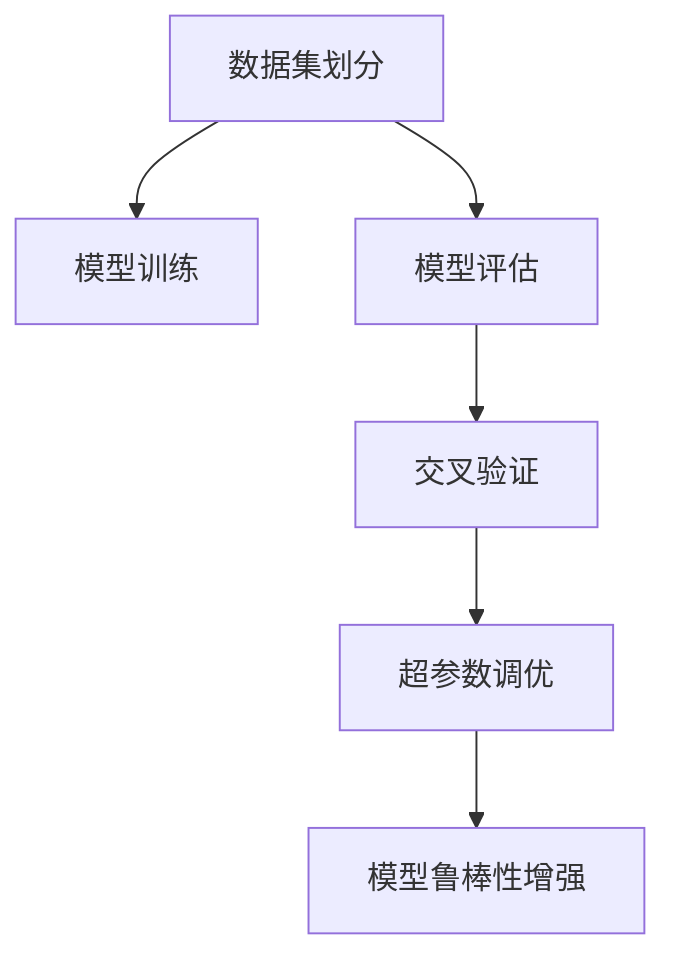

                 

# 数据验证与数据测试原理与代码实战案例讲解

> 关键词：数据验证,数据测试,机器学习,深度学习,验证集,测试集,交叉验证,模型评估,Python,TensorFlow,PyTorch

## 1. 背景介绍

### 1.1 问题由来

在数据驱动的机器学习和深度学习项目中，数据验证与数据测试是确保模型性能和可靠性的关键环节。面对海量的数据，如何在有限的时间内高效验证模型的泛化能力和鲁棒性，成为数据科学家和工程师必须解决的挑战。良好的数据验证与测试实践能够提升模型性能，避免过拟合，提高模型的可靠性，是构建高质量机器学习模型的基石。

### 1.2 问题核心关键点

1. **数据分割**：如何将数据集划分为训练集、验证集和测试集，是数据验证与测试的基础。
2. **模型评估**：如何在有限的验证集上评估模型的性能，防止过拟合。
3. **交叉验证**：如何在有限的数据集上进行多轮交叉验证，获得更加稳健的模型评估结果。
4. **测试集策略**：如何处理测试集，确保模型在未见过的数据上表现良好。
5. **特征工程**：如何在数据预处理阶段进行特征选择和变换，提升模型性能。
6. **模型鲁棒性**：如何构建鲁棒模型，提高模型的泛化能力。

### 1.3 问题研究意义

数据验证与数据测试在机器学习和深度学习项目中起着至关重要的作用。良好的数据验证与测试实践能够：

1. **提升模型性能**：通过合理的数据分割和验证方法，避免过拟合，提升模型的泛化能力。
2. **提高可靠性**：确保模型在未见过的数据上表现良好，增强模型的鲁棒性。
3. **降低成本**：减少对标注数据的依赖，降低数据标注和模型训练的资源投入。
4. **加速迭代**：通过有效的交叉验证和测试策略，快速迭代优化模型，加速项目进程。
5. **确保质量**：通过科学的数据验证与测试方法，确保模型的高质量和可靠性，避免潜在的错误。

## 2. 核心概念与联系

### 2.1 核心概念概述

为更好地理解数据验证与数据测试的原理和实践，本节将介绍几个关键概念：

- **数据集划分**：将数据集划分为训练集、验证集和测试集的过程，是数据验证与测试的基础。
- **模型评估指标**：用于衡量模型性能的指标，如准确率、召回率、F1-score等。
- **交叉验证**：将数据集分为若干子集，在子集上进行多轮验证的方法，提升模型评估的稳健性。
- **超参数调优**：通过交叉验证等方法，调整模型超参数以优化模型性能。
- **模型鲁棒性**：模型对输入数据和噪声的鲁棒性，确保模型在不同环境下的稳定性和可靠性。

### 2.2 核心概念原理和架构的 Mermaid 流程图(Mermaid 流程节点中不要有括号、逗号等特殊字符)



这个流程图展示了数据验证与测试的核心流程：

1. 数据集划分：将数据集分为训练集、验证集和测试集，进行模型训练。
2. 模型评估：在验证集上评估模型性能，调整模型参数。
3. 交叉验证：通过多轮验证，提升模型评估的稳健性。
4. 超参数调优：通过交叉验证，调整模型超参数，优化模型性能。
5. 模型鲁棒性增强：通过数据增强、正则化等方法，增强模型鲁棒性。

这些概念共同构成了数据验证与测试的核心框架，确保模型在实际应用中的高效、稳定和可靠。

## 3. 核心算法原理 & 具体操作步骤

### 3.1 算法原理概述

数据验证与数据测试的原理主要基于以下三个方面：

1. **数据分割**：将数据集划分为训练集、验证集和测试集，用于模型训练、验证和测试。
2. **模型评估**：通过在验证集上评估模型性能，避免过拟合，优化模型参数。
3. **交叉验证**：通过多轮验证，提升模型评估的稳健性，优化超参数调优。

### 3.2 算法步骤详解

#### 3.2.1 数据分割

数据分割是数据验证与测试的基础，通常将数据集分为训练集、验证集和测试集：

1. **训练集**：用于模型训练的样本集合。
2. **验证集**：用于模型评估和调参的样本集合。
3. **测试集**：用于最终模型性能评估的样本集合。

数据分割方法包括：

- **随机分割**：随机将数据集分为训练集、验证集和测试集，常用于大规模数据集。
- **分层分割**：按照标签分布将数据集分为训练集、验证集和测试集，保证各个集合并列数据的平衡。

#### 3.2.2 模型评估

模型评估通过在验证集上评估模型性能，指导模型调参：

1. **准确率**：分类任务中，正确分类的样本数占总样本数的比例。
2. **召回率**：分类任务中，正确分类的正样本数占所有正样本数的比例。
3. **F1-score**：准确率和召回率的调和平均数，综合评估模型性能。

常用的模型评估指标还包括精确度、均方误差、R^2等，具体选择根据任务类型和模型需求而定。

#### 3.2.3 交叉验证

交叉验证通过多轮验证，提升模型评估的稳健性，优化超参数调优：

1. **k折交叉验证**：将数据集分为k个子集，每轮使用k-1个子集进行训练，剩余一个子集进行验证，进行k轮验证。
2. **留一交叉验证**：每个样本作为验证集，剩余样本作为训练集，进行n轮验证。

通过交叉验证，可以获得更加稳健的模型评估结果，避免过拟合，提高模型泛化能力。

### 3.3 算法优缺点

数据验证与数据测试具有以下优点：

1. **避免过拟合**：通过验证集评估模型性能，避免模型在训练集上过拟合。
2. **提高模型性能**：通过交叉验证和超参数调优，优化模型性能。
3. **稳健性高**：多轮验证提升模型评估的稳健性，避免单一验证结果的偏差。

同时，数据验证与测试也存在以下缺点：

1. **数据依赖**：依赖标注数据，标注成本较高。
2. **计算资源消耗**：交叉验证和模型评估消耗较多计算资源，影响模型训练速度。
3. **模型解释性差**：模型评估结果缺乏解释，难以理解模型内部工作机制。

尽管存在这些缺点，数据验证与数据测试仍是当前机器学习和深度学习项目中不可或缺的重要环节。

### 3.4 算法应用领域

数据验证与数据测试在机器学习和深度学习项目中具有广泛的应用，涵盖以下几个领域：

1. **自然语言处理(NLP)**：在文本分类、情感分析、机器翻译等任务中，通过数据验证与测试提升模型性能。
2. **计算机视觉(CV)**：在图像分类、目标检测、图像生成等任务中，通过数据验证与测试优化模型性能。
3. **语音识别**：在语音识别、语音合成等任务中，通过数据验证与测试提升模型性能。
4. **推荐系统**：在个性化推荐、商品推荐等任务中，通过数据验证与测试优化模型性能。
5. **医疗诊断**：在疾病诊断、医学影像分析等任务中，通过数据验证与测试提升模型性能。

数据验证与数据测试的应用领域非常广泛，覆盖了众多实际应用场景，是提升模型性能的重要手段。

## 4. 数学模型和公式 & 详细讲解 & 举例说明

### 4.1 数学模型构建

数据验证与数据测试的核心模型构建包括数据集划分、模型评估和交叉验证三个部分：

1. **数据集划分**：将数据集分为训练集、验证集和测试集，常采用随机分割或分层分割方法。
2. **模型评估**：通过在验证集上评估模型性能，选择评估指标如准确率、召回率、F1-score等。
3. **交叉验证**：通过多轮交叉验证，提升模型评估的稳健性，优化超参数调优。

### 4.2 公式推导过程

以二分类任务为例，推导模型评估和交叉验证的公式：

#### 4.2.1 模型评估

假设模型在样本 $x_i$ 上的输出为 $\hat{y}_i$，真实标签为 $y_i$，则二分类任务的交叉熵损失函数为：

$$
\ell(y_i,\hat{y}_i) = -[y_i\log\hat{y}_i+(1-y_i)\log(1-\hat{y}_i)]
$$

在验证集上评估模型性能，通过计算损失函数的平均值，得到模型的交叉熵损失：

$$
\mathcal{L} = \frac{1}{N}\sum_{i=1}^N\ell(y_i,\hat{y}_i)
$$

其中 $N$ 为验证集样本数。

#### 4.2.2 交叉验证

k折交叉验证的公式为：

$$
\mathcal{L}_{cv} = \frac{1}{k}\sum_{i=1}^k\mathcal{L}_{cv,i}
$$

其中 $\mathcal{L}_{cv,i}$ 为第 $i$ 轮交叉验证的损失函数平均值。

### 4.3 案例分析与讲解

假设有一个二分类任务，通过交叉验证评估模型性能：

1. **数据集划分**：将数据集分为训练集、验证集和测试集，常采用随机分割或分层分割方法。
2. **模型训练**：在训练集上训练模型，通过反向传播算法优化模型参数。
3. **模型评估**：在验证集上计算交叉熵损失，选择评估指标如准确率、召回率、F1-score等。
4. **交叉验证**：通过k折交叉验证，计算各轮验证的损失函数平均值，优化模型超参数调优。

通过以上步骤，可以有效评估模型的性能，避免过拟合，提升模型泛化能力。

## 5. 项目实践：代码实例和详细解释说明

### 5.1 开发环境搭建

在进行数据验证与数据测试的实践前，我们需要准备好开发环境。以下是使用Python进行PyTorch开发的环境配置流程：

1. 安装Anaconda：从官网下载并安装Anaconda，用于创建独立的Python环境。
2. 创建并激活虚拟环境：
```bash
conda create -n pytorch-env python=3.8 
conda activate pytorch-env
```
3. 安装PyTorch：根据CUDA版本，从官网获取对应的安装命令。例如：
```bash
conda install pytorch torchvision torchaudio cudatoolkit=11.1 -c pytorch -c conda-forge
```
4. 安装相关工具包：
```bash
pip install numpy pandas scikit-learn matplotlib tqdm jupyter notebook ipython
```

完成上述步骤后，即可在`pytorch-env`环境中开始数据验证与数据测试的实践。

### 5.2 源代码详细实现

下面我们以二分类任务为例，给出使用PyTorch进行数据验证与数据测试的PyTorch代码实现。

首先，定义模型和优化器：

```python
import torch
from torch import nn, optim

# 定义模型
class BinaryClassifier(nn.Module):
    def __init__(self):
        super(BinaryClassifier, self).__init__()
        self.fc1 = nn.Linear(784, 128)
        self.fc2 = nn.Linear(128, 1)
        self.sigmoid = nn.Sigmoid()
        
    def forward(self, x):
        x = x.view(-1, 784)
        x = self.fc1(x)
        x = self.sigmoid(x)
        x = self.fc2(x)
        return self.sigmoid(x)

# 定义优化器
model = BinaryClassifier()
optimizer = optim.SGD(model.parameters(), lr=0.01)
```

接着，定义数据集划分函数：

```python
import numpy as np

def split_data(data, labels, train_ratio=0.8, val_ratio=0.1):
    train_idx = np.random.permutation(len(data))[:int(train_ratio * len(data))]
    val_idx = np.random.permutation(len(data))[int(train_ratio * len(data)):int(train_ratio * len(data) + val_ratio * len(data))]
    test_idx = np.random.permutation(len(data))[int(train_ratio * len(data) + val_ratio * len(data)):]

    train_data, train_labels = data[train_idx], labels[train_idx]
    val_data, val_labels = data[val_idx], labels[val_idx]
    test_data, test_labels = data[test_idx], labels[test_idx]

    return train_data, train_labels, val_data, val_labels, test_data, test_labels
```

然后，定义模型训练函数：

```python
def train_epoch(model, train_data, train_labels, optimizer):
    model.train()
    train_loss = 0
    for i, (inputs, labels) in enumerate(train_loader):
        optimizer.zero_grad()
        outputs = model(inputs)
        loss = nn.BCELoss()(outputs, labels)
        loss.backward()
        optimizer.step()
        train_loss += loss.item()
    return train_loss / len(train_loader)
```

定义模型评估函数：

```python
def evaluate(model, val_data, val_labels):
    model.eval()
    val_loss = 0
    predictions = []
    labels = []
    with torch.no_grad():
        for inputs, labels in val_loader:
            outputs = model(inputs)
            val_loss += nn.BCELoss()(outputs, labels).item()
            predictions.append(outputs.argmax(dim=1).tolist())
            labels.append(labels.tolist())
    return val_loss / len(val_loader), predictions, labels
```

最后，定义交叉验证函数：

```python
def cross_validate(model, train_data, train_labels, val_data, val_labels, test_data, test_labels, k=5):
    cv_loss = []
    for i in range(k):
        train_idx = np.random.permutation(len(train_data))[:int(len(train_data) * (i+1)/k)]
        val_idx = np.random.permutation(len(train_data))[int(len(train_data) * (i+1)/k):int(len(train_data) * (i+2)/k)]
        test_idx = np.random.permutation(len(train_data))[int(len(train_data) * (i+2)/k):]

        train_data, train_labels = train_data[train_idx], train_labels[train_idx]
        val_data, val_labels = val_data[val_idx], val_labels[val_idx]
        test_data, test_labels = train_data[test_idx], train_labels[test_idx]

        train_loss = 0
        for i in range(epochs):
            train_loss += train_epoch(model, train_data, train_labels, optimizer)
        val_loss, predictions, labels = evaluate(model, val_data, val_labels)
        cv_loss.append(val_loss)

    return np.mean(cv_loss)
```

以上代码实现了二分类任务的数据集划分、模型训练、模型评估和交叉验证。接下来，使用以上函数进行数据验证与数据测试的实践：

```python
from torch.utils.data import DataLoader
from torchvision import datasets, transforms

# 加载数据集
train_data, train_labels = datasets.MNIST(root='./data', train=True, download=True, transform=transforms.ToTensor())
test_data, test_labels = datasets.MNIST(root='./data', train=False, transform=transforms.ToTensor())

# 数据集划分
train_data, train_labels, val_data, val_labels, test_data, test_labels = split_data(train_data, train_labels, train_ratio=0.8, val_ratio=0.1)

# 定义数据加载器
train_loader = DataLoader(train_data, batch_size=64, shuffle=True)
val_loader = DataLoader(val_data, batch_size=64, shuffle=True)
test_loader = DataLoader(test_data, batch_size=64, shuffle=True)

# 模型训练
epochs = 10
for i in range(epochs):
    train_loss = train_epoch(model, train_loader)
    val_loss, predictions, labels = evaluate(model, val_loader)
    print(f'Epoch {i+1}, train loss: {train_loss:.3f}, val loss: {val_loss:.3f}')

# 交叉验证
cv_loss = cross_validate(model, train_data, train_labels, val_data, val_labels, test_data, test_labels, k=5)
print(f'Cross-validation loss: {cv_loss:.3f}')
```

### 5.3 代码解读与分析

让我们再详细解读一下关键代码的实现细节：

**split_data函数**：
- 定义了数据集划分函数，通过随机抽样将数据集分为训练集、验证集和测试集。
- 采用随机抽样方法，保证各个子集的样本分布均衡。

**train_epoch函数**：
- 定义了模型训练函数，将模型切换到训练模式，通过反向传播算法优化模型参数。
- 在每个batch上计算损失函数，并更新模型参数。

**evaluate函数**：
- 定义了模型评估函数，将模型切换到评估模式，计算验证集上的损失函数。
- 记录验证集上的损失函数和预测结果。

**cross_validate函数**：
- 定义了交叉验证函数，通过k折交叉验证评估模型性能。
- 在每个子集上训练模型，计算验证集上的损失函数，并取平均值作为最终结果。

这些函数实现了数据集划分、模型训练、模型评估和交叉验证的基本流程，可以用于各种机器学习和深度学习项目的实践。

## 6. 实际应用场景

### 6.1 智能推荐系统

数据验证与数据测试在智能推荐系统中具有重要应用：

1. **数据集划分**：将用户行为数据划分为训练集、验证集和测试集，用于模型训练和评估。
2. **模型评估**：通过在验证集上评估模型性能，优化推荐模型。
3. **交叉验证**：通过多轮交叉验证，提升推荐模型性能的稳健性。

智能推荐系统通过数据验证与数据测试，能够快速迭代优化推荐模型，提高推荐效果，提升用户体验。

### 6.2 金融风控系统

数据验证与数据测试在金融风控系统中具有重要应用：

1. **数据集划分**：将历史数据划分为训练集、验证集和测试集，用于模型训练和评估。
2. **模型评估**：通过在验证集上评估模型性能，优化风控模型。
3. **交叉验证**：通过多轮交叉验证，提升风控模型性能的稳健性。

金融风控系统通过数据验证与数据测试，能够快速迭代优化风控模型，提高模型泛化能力，降低金融风险。

### 6.3 医疗诊断系统

数据验证与数据测试在医疗诊断系统中具有重要应用：

1. **数据集划分**：将医疗数据划分为训练集、验证集和测试集，用于模型训练和评估。
2. **模型评估**：通过在验证集上评估模型性能，优化医疗诊断模型。
3. **交叉验证**：通过多轮交叉验证，提升医疗诊断模型性能的稳健性。

医疗诊断系统通过数据验证与数据测试，能够快速迭代优化医疗诊断模型，提高模型准确率，辅助医生诊断。

### 6.4 未来应用展望

随着数据驱动的机器学习和深度学习项目的不断发展，数据验证与数据测试的应用领域将不断扩展，成为提升模型性能的重要手段。未来，数据验证与数据测试将进一步优化：

1. **自动化数据划分**：通过自动化工具进行数据集划分，提高数据集划分的效率和准确性。
2. **动态数据划分**：根据模型性能动态调整数据集划分策略，提升模型评估的稳健性。
3. **分布式数据验证**：通过分布式计算技术，提升数据验证与数据测试的效率，支持大规模数据集。
4. **强化数据验证**：通过引入对抗样本和噪声数据，提升模型的鲁棒性和泛化能力。
5. **多模态数据验证**：通过融合多种数据模态，提升模型的感知能力和泛化能力。

数据验证与数据测试的不断发展，将进一步提升机器学习和深度学习模型的性能和可靠性，推动数据驱动的智能应用向更广泛领域扩展。

## 7. 工具和资源推荐

### 7.1 学习资源推荐

为了帮助开发者系统掌握数据验证与数据测试的理论基础和实践技巧，这里推荐一些优质的学习资源：

1. 《Python数据科学手册》：由Jake VanderPlas编写，全面介绍了Python在数据科学中的应用，包括数据集划分、模型评估和交叉验证等。
2. Coursera《机器学习》课程：由Andrew Ng教授主讲，介绍了机器学习和深度学习的核心概念和实践技巧，包括数据集划分和交叉验证。
3. Kaggle竞赛：参加Kaggle数据科学竞赛，实践数据验证与数据测试，学习优化模型性能的方法。
4. Scikit-Learn官方文档：Scikit-Learn提供了丰富的数据集划分和模型评估工具，是数据验证与数据测试的良好实践指南。
5. TensorFlow官方文档：TensorFlow提供了丰富的模型评估和交叉验证工具，是深度学习项目中常用的数据验证与数据测试工具。

通过对这些资源的学习实践，相信你一定能够快速掌握数据验证与数据测试的精髓，并用于解决实际的机器学习和深度学习问题。

### 7.2 开发工具推荐

高效的开发离不开优秀的工具支持。以下是几款用于数据验证与数据测试开发的常用工具：

1. PyTorch：基于Python的开源深度学习框架，灵活动态的计算图，适合快速迭代研究。
2. TensorFlow：由Google主导开发的开源深度学习框架，生产部署方便，适合大规模工程应用。
3. Scikit-Learn：基于Python的机器学习库，提供丰富的数据集划分和模型评估工具。
4. Jupyter Notebook：免费的交互式编程环境，支持代码和数据可视化，适合数据验证与数据测试的实践。
5. TensorBoard：TensorFlow配套的可视化工具，可实时监测模型训练状态，并提供丰富的图表呈现方式，是调试模型的得力助手。

合理利用这些工具，可以显著提升数据验证与数据测试的开发效率，加快创新迭代的步伐。

### 7.3 相关论文推荐

数据验证与数据测试在机器学习和深度学习项目中具有重要研究价值，以下是几篇奠基性的相关论文，推荐阅读：

1. "A Framework for Testing Machine Learning Algorithms"：提出了模型评估和交叉验证的经典方法，是数据验证与数据测试的重要理论基础。
2. "Cross-Validation: Assessing the Performance of Machine Learning Algorithms"：详细介绍了交叉验证的理论和实践方法，是模型评估的常用工具。
3. "Data Augmentation for Generative Adversarial Networks"：介绍了数据增强方法，通过引入对抗样本和噪声数据，提升模型的鲁棒性和泛化能力。
4. "Evaluating Cross-Validation for Model Selection"：探讨了交叉验证在模型选择中的作用，提出了更加稳健的交叉验证策略。
5. "Improving Robustness with Adversarial Training"：介绍了对抗训练方法，通过引入对抗样本，提高模型的鲁棒性和泛化能力。

这些论文代表了大数据验证与数据测试技术的发展脉络。通过学习这些前沿成果，可以帮助研究者把握学科前进方向，激发更多的创新灵感。

## 8. 总结：未来发展趋势与挑战

### 8.1 总结

本文对数据验证与数据测试的原理和实践进行了全面系统的介绍。首先阐述了数据验证与数据测试的研究背景和意义，明确了数据集划分、模型评估和交叉验证的核心流程。其次，从理论到实践，详细讲解了数据集划分、模型评估和交叉验证的数学原理和关键步骤，给出了数据验证与数据测试任务开发的完整代码实例。同时，本文还广泛探讨了数据验证与数据测试在实际应用中的场景，展示了数据验证与数据测试范式的广泛应用。此外，本文精选了数据验证与数据测试的相关学习资源、开发工具和论文，力求为读者提供全方位的技术指引。

通过本文的系统梳理，可以看到，数据验证与数据测试在机器学习和深度学习项目中起着至关重要的作用。良好的数据验证与测试实践能够提升模型性能，避免过拟合，提高模型的可靠性，是构建高质量机器学习模型的基石。未来，随着数据驱动的机器学习和深度学习项目的不断发展，数据验证与数据测试的应用领域将不断扩展，成为提升模型性能的重要手段。

### 8.2 未来发展趋势

数据验证与数据测试的未来发展趋势将呈现以下几个方向：

1. **自动化数据划分**：通过自动化工具进行数据集划分，提高数据集划分的效率和准确性。
2. **动态数据划分**：根据模型性能动态调整数据集划分策略，提升模型评估的稳健性。
3. **分布式数据验证**：通过分布式计算技术，提升数据验证与数据测试的效率，支持大规模数据集。
4. **强化数据验证**：通过引入对抗样本和噪声数据，提升模型的鲁棒性和泛化能力。
5. **多模态数据验证**：通过融合多种数据模态，提升模型的感知能力和泛化能力。
6. **无监督和半监督验证**：探索无监督和半监督数据验证方法，摆脱对大规模标注数据的依赖。

这些趋势将进一步提升数据验证与数据测试的效率和稳健性，推动数据驱动的智能应用向更广泛领域扩展。

### 8.3 面临的挑战

尽管数据验证与数据测试技术已经取得了显著进展，但在实际应用中仍面临诸多挑战：

1. **数据标注成本**：标注大规模数据集成本较高，特别是在特定领域的数据集获取上。
2. **模型鲁棒性**：在实际应用中，模型面临多样化的输入数据和噪声，需要提高模型的鲁棒性。
3. **模型解释性**：模型评估结果缺乏解释，难以理解模型内部工作机制。
4. **计算资源消耗**：交叉验证和模型评估消耗较多计算资源，影响模型训练速度。
5. **模型泛化能力**：模型在未见过的数据上表现不稳定，需要提高模型的泛化能力。

尽管存在这些挑战，数据验证与数据测试仍是当前机器学习和深度学习项目中不可或缺的重要环节。研究者需要通过不断的技术创新和实践优化，克服这些挑战，推动数据验证与数据测试技术的发展。

### 8.4 研究展望

面向未来，数据验证与数据测试技术需要在以下几个方面寻求新的突破：

1. **自动化数据验证**：通过自动化工具进行数据验证，提高数据验证的效率和准确性。
2. **分布式数据验证**：通过分布式计算技术，提升数据验证的效率，支持大规模数据集。
3. **无监督和半监督验证**：探索无监督和半监督数据验证方法，摆脱对大规模标注数据的依赖。
4. **多模态数据验证**：通过融合多种数据模态，提升模型的感知能力和泛化能力。
5. **对抗数据验证**：通过引入对抗样本和噪声数据，提升模型的鲁棒性和泛化能力。
6. **模型解释性增强**：通过模型可视化、可解释性等方法，增强模型的可解释性。

这些研究方向将引领数据验证与数据测试技术迈向更高的台阶，为构建安全、可靠、可解释、可控的智能系统铺平道路。面向未来，数据验证与数据测试技术还需要与其他人工智能技术进行更深入的融合，如知识表示、因果推理、强化学习等，多路径协同发力，共同推动自然语言理解和智能交互系统的进步。只有勇于创新、敢于突破，才能不断拓展语言模型的边界，让智能技术更好地造福人类社会。

## 9. 附录：常见问题与解答

**Q1：什么是数据集划分？**

A: 数据集划分是将数据集分为训练集、验证集和测试集的过程，用于模型训练、验证和测试。训练集用于模型训练，验证集用于模型评估和调参，测试集用于最终模型性能评估。

**Q2：如何进行数据集划分？**

A: 数据集划分通常采用随机分割或分层分割方法。随机分割方法随机将数据集分为训练集、验证集和测试集，分层分割方法按照标签分布将数据集分为训练集、验证集和测试集，保证各个集合并列数据的平衡。

**Q3：什么是模型评估？**

A: 模型评估通过在验证集上评估模型性能，指导模型调参。常用的模型评估指标包括准确率、召回率、F1-score等，具体选择根据任务类型和模型需求而定。

**Q4：如何进行模型评估？**

A: 在验证集上计算模型的损失函数，选择评估指标如准确率、召回率、F1-score等，评估模型性能。

**Q5：什么是交叉验证？**

A: 交叉验证通过多轮验证，提升模型评估的稳健性，优化超参数调优。常用的交叉验证方法包括k折交叉验证和留一交叉验证，通过多轮验证提升模型评估的稳健性。

**Q6：如何进行交叉验证？**

A: 通过k折交叉验证或多轮验证，在每轮验证中，使用k-1个子集进行训练，剩余一个子集进行验证，进行k轮验证。

**Q7：数据验证与数据测试的优点和缺点是什么？**

A: 数据验证与数据测试的优点包括避免过拟合、提高模型性能、提高模型稳健性。缺点包括数据依赖、计算资源消耗、模型解释性差。

**Q8：如何在数据验证与数据测试中避免过拟合？**

A: 通过数据增强、正则化、早停等方法，避免模型在训练集上过拟合。

**Q9：如何在数据验证与数据测试中提高模型泛化能力？**

A: 通过交叉验证和超参数调优，优化模型性能，提高模型泛化能力。

**Q10：如何在数据验证与数据测试中提升模型鲁棒性？**

A: 通过引入对抗样本和噪声数据，提升模型的鲁棒性和泛化能力。

通过以上问答，对数据验证与数据测试的核心概念、原理和实践有了更全面的了解。数据验证与数据测试在机器学习和深度学习项目中具有广泛应用，是提升模型性能的重要手段。希望通过本文的学习，能够帮助你在实际项目中更加高效、稳健地进行模型评估和调优。

