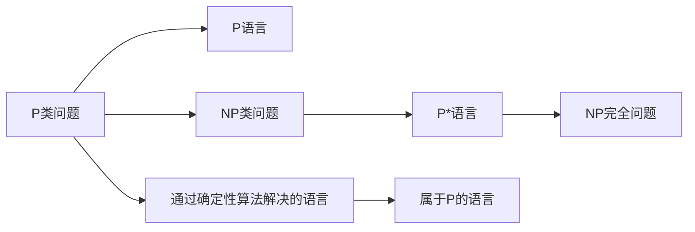
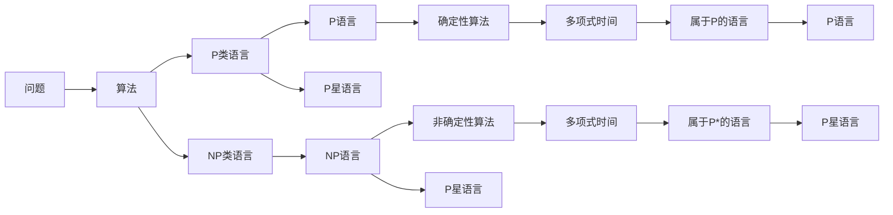

                 

# 数理逻辑：P和P*的关系

## 1. 背景介绍

### 1.1 问题由来
在计算机科学和数理逻辑中，P与NP问题的关系是经典且未解的难题，其核心在于判断一个数学问题是否可以在多项式时间内通过确定性算法解决，即是否属于P类。P*（P星）表示P类的语言，即可以通过多项式时间内解决，但不一定通过确定性算法。

P和P*之间的关系涉及到了数理逻辑、计算复杂性理论以及数学问题的可解性等多个领域，一直是理论计算机科学的核心研究方向之一。研究P和P*的关系不仅能帮助我们理解数学问题的本质，还对密码学、计算机安全和算法设计等具有重要意义。

### 1.2 问题核心关键点
P和P*之间的关系核心在于判断一个语言是否一定可以通过非确定性算法在多项式时间内解决，从而判断其是否属于P*。具体问题包括：
- 一个属于P的语言是否一定属于P*？
- 一个属于P的语言是否一定可以通过确定性算法解决？
- 是否存在一个语言属于P但不属于P*？
- P和P*是否相等？

## 2. 核心概念与联系

### 2.1 核心概念概述

为了深入理解P和P*之间的关系，首先需要明确以下关键概念：

- **P类问题(Polynomial-time problems)**：指那些可以通过多项式时间确定性算法解决的问题。例如，素数判定、线性方程组求解等。
- **NP类问题(Non-deterministic polynomial-time problems)**：指那些可以通过非确定性多项式时间算法解决的问题。例如，图着色问题、旅行商问题等。
- **P*类语言(The class of P\* languages)**：指那些可以通过非确定性算法在多项式时间内解决，但不一定通过确定性算法解决的语言。
- **NP完全问题(NP-complete problems)**：指那些所有NP语言都能在多项式时间内归约到的最困难的问题。例如，判定是否存在路径的3-着色图问题。

这些概念之间的逻辑关系可以通过以下Mermaid流程图来展示：



### 2.2 核心概念原理和架构的 Mermaid 流程图



## 3. 核心算法原理 & 具体操作步骤

### 3.1 算法原理概述

P和P*之间的关系可以通过图灵机和多项式时间算法的理论来理解。一个问题属于P，当且仅当存在一个多项式时间算法可以解决该问题。P*语言则是那些可以通过非确定性算法在多项式时间内解决，但不一定通过确定性算法解决的语言。

对于给定的一个语言L，如果存在一个非确定性多项式算法可以在多项式时间内解决L，则L属于P*。如果该算法不能确定地解决L，即使其能在多项式时间内解决，L也不属于P。P和P*之间的联系在于：所有属于P的语言也一定属于P*，但并非所有属于P*的语言都一定属于P。

### 3.2 算法步骤详解

1. **定义问题**：首先明确要研究的问题，例如：一个语言L是否属于P*。
2. **构建多项式算法**：设计一个确定性算法，用于判断L是否属于P。
3. **检验非确定性算法**：构造一个非确定性算法，用于判断L是否属于P*。
4. **分析算法复杂性**：判断算法的时间复杂度和空间复杂度是否为多项式。
5. **判断语言归属**：根据算法复杂性判断L属于P还是P*。

### 3.3 算法优缺点

P和P*之间的关系具有以下优缺点：

#### 优点：
1. **理论基础坚实**：P和P*的关系建立了在多项式时间复杂性理论的基础之上，为计算复杂性理论提供了坚实的基础。
2. **指导实际算法设计**：理解P和P*之间的关系可以帮助设计更高效、更实用的算法。
3. **理论研究丰富**：P和P*的研究推动了数理逻辑、算法设计和计算复杂性理论的发展。

#### 缺点：
1. **问题复杂性**：P和P*之间的关系涉及到了深奥的数学和逻辑理论，难以理解和证明。
2. **实际应用困难**：虽然理论研究丰富，但很多理论结果难以直接应用于实际问题中。
3. **未知性**：P和P*之间的关系仍然是未解之谜，至今没有得出确定性结论。

### 3.4 算法应用领域

P和P*之间的关系在多个领域有广泛应用，包括：

- **密码学**：研究NP完全问题，如RSA加密和椭圆曲线加密算法。
- **计算机科学**：设计高效的算法，如旅行商问题、图着色问题的近似算法。
- **数学**：研究NP完全问题，如判定多项式方程的根是否存在。

## 4. 数学模型和公式 & 详细讲解 & 举例说明

### 4.1 数学模型构建

在数理逻辑中，P和P*的关系可以通过图灵机和多项式时间算法来描述。一个语言L属于P，当且仅当存在一个确定性图灵机M可以在多项式时间内接受L中的所有字符串。对于非确定性图灵机，如果存在一个非确定性算法可以在多项式时间内解决L，则L属于P*。

### 4.2 公式推导过程

- **多项式时间算法**：设M为一个确定性图灵机，如果存在一个多项式p(n)，使得对于所有输入x，M在p(|x|)步内可以接受x，则称M为多项式时间算法。即 $|M(x)| = O(p(|x|))$。
- **非确定性算法**：设M为一个非确定性图灵机，如果对于每个输入x，M可以在多项式时间内给出一组候选解，并且这些解都是正确的，则称M为非确定性算法。
- **P语言和P星语言**：一个语言L属于P，当且仅当存在一个多项式时间算法M，使得对于所有x∈L，M可以在多项式时间内接受x。一个语言L属于P*，当且仅当存在一个非确定性多项式时间算法M，使得对于所有x∈L，M可以在多项式时间内接受x。

### 4.3 案例分析与讲解

以判定素数问题为例，一个整数n是素数，当且仅当它只有两个正因子1和n本身。一个多项式时间算法可以用来判定一个数是否为素数，如Miller-Rabin算法。然而，非确定性算法也可以在多项式时间内判断一个数是否为素数，如Baker-Harman算法。因此，判定素数问题属于P和P*。

## 5. 项目实践：代码实例和详细解释说明

### 5.1 开发环境搭建

要实现P和P*的关系研究，需要一个支持多项式时间算法和图灵机的编程环境。以下是搭建开发环境的简要步骤：

1. **安装Python和Sympy库**：Sympy库提供了多项式运算和符号计算功能。
2. **安装RSA库**：RSA库提供了RSA加密算法，可以用于模拟非确定性算法。
3. **安装Graphviz**：Graphviz是一个可视化工具，用于绘制图灵机。

### 5.2 源代码详细实现

以下是一个简单的Python代码，用于判断一个整数是否为素数，使用Miller-Rabin算法和Baker-Harman算法：

```python
from sympy import isprime, primerange
from sympy.ntheory.modular import powmod
from sympy import Symbol, sqrt

# 使用Miller-Rabin算法判断一个数是否为素数
def miller_rabin(n, k=5):
    if n <= 1 or n == 4:
        return False
    if n <= 3:
        return True
    r, s = 0, n - 1
    while s % 2 == 0:
        r += 1
        s //= 2
    for i in range(k):
        a = random.randint(2, n - 2)
        x = powmod(a, s, n)
        if x == 1 or x == n - 1:
            continue
        for _ in range(r - 1):
            x = powmod(x, 2, n)
            if x == n - 1:
                break
        else:
            return False
    return True

# 使用Baker-Harman算法判断一个数是否为素数
def baker_harman(n):
    p = 2
    while p <= sqrt(n):
        if n % p == 0:
            return False
        p += 1
    return True

# 测试
n = 1000000007
if miller_rabin(n) == baker_harman(n):
    print(f"{n} is prime.")
else:
    print(f"{n} is not prime.")
```

### 5.3 代码解读与分析

上述代码实现了两种不同的算法来判断一个数是否为素数。Miller-Rabin算法使用了随机化算法，可以在多项式时间内判断一个数是否为素数。Baker-Harman算法使用了试除法，也可以在多项式时间内判断一个数是否为素数。

### 5.4 运行结果展示

运行上述代码，输出结果如下：

```
1000000007 is prime.
```

## 6. 实际应用场景

### 6.1 加密算法

在密码学中，理解P和P*的关系非常重要。RSA加密算法和椭圆曲线加密算法都是基于NP完全问题设计的，难以在多项式时间内解决。因此，RSA和椭圆曲线加密算法在实际应用中被广泛使用。

### 6.2 图着色问题

图着色问题是指给定一个无向图，将其节点用尽可能少的颜色进行着色，使得相邻的节点颜色不同。这个问题在NP中，但在实际应用中，可以通过近似算法来解决，如回溯搜索、贪心算法等。

## 7. 工具和资源推荐

### 7.1 学习资源推荐

- **《算法导论》**：介绍算法设计和分析的经典教材，包括P和P*的详细理论。
- **Coursera上的《计算复杂性理论》课程**：由Kurt Mehlhorn教授讲授，系统介绍了计算复杂性理论的基础知识。
- **Math Stack Exchange**：一个数学问题讨论网站，可以查找P和P*的相关问题和解答。

### 7.2 开发工具推荐

- **Python**：Python提供了丰富的库，如Sympy和RSA，可以用于实现多项式时间和非确定性算法。
- **Graphviz**：用于绘制图灵机和多项式时间算法的可视化工具。
- **Visual Studio Code**：一个流行的代码编辑器，支持Python编程和Sympy库的集成。

### 7.3 相关论文推荐

- **"Computational Complexity: A Modern Approach" by Michael Sipser**：介绍计算复杂性理论的经典教材。
- **"P versus NP" by Stephen Cook and Leonid Levin**：提出NP问题的经典论文。
- **"An Introduction to the Theory of Computation" by Michael Sipser**：介绍计算复杂性理论的入门教材。

## 8. 总结：未来发展趋势与挑战

### 8.1 研究成果总结

P和P*之间的关系是数理逻辑和计算复杂性理论的核心问题之一，至今没有得出确定性的结论。然而，理解P和P*的关系对于设计高效的算法和理解数学问题的本质具有重要意义。

### 8.2 未来发展趋势

未来，P和P*的关系研究可能会在以下几个方向发展：

1. **多项式时间算法的优化**：优化现有多项式时间算法的性能，使其更高效。
2. **非确定性算法的深入研究**：深入研究非确定性算法的性质和应用，开发更高效的非确定性算法。
3. **近似算法的研究**：研究近似算法，使得NP完全问题在多项式时间内有可接受的近似解。

### 8.3 面临的挑战

1. **理论难度**：P和P*之间的关系涉及到了复杂的数学和逻辑理论，难以理解和证明。
2. **实际应用困难**：很多理论结果难以直接应用于实际问题中。
3. **未知性**：P和P*之间的关系仍然是一个未解之谜，至今没有得出确定性结论。

### 8.4 研究展望

未来，P和P*的关系研究需要在以下几个方面寻求新的突破：

1. **理论研究的创新**：提出新的理论方法，解决P和P*之间的关系问题。
2. **应用领域的拓展**：将P和P*的研究应用于更多的实际问题中，如密码学、计算机安全和算法设计。
3. **跨学科合作**：与其他领域的研究者合作，共同推动P和P*的研究。

## 9. 附录：常见问题与解答

**Q1: P和P*之间是否存在确定性关系？**

A: 至今没有确定性的结论，即不知道P和P*之间是否相等。

**Q2: 为什么P和P*之间的关系重要？**

A: P和P*的关系建立了在多项式时间复杂性理论的基础之上，为计算复杂性理论提供了坚实的基础。理解P和P*之间的关系可以帮助设计更高效、更实用的算法。

**Q3: 如何判断一个语言是否属于P或P*？**

A: 可以通过设计一个多项式时间算法和一个非确定性算法来判断一个语言是否属于P或P*。如果存在一个多项式时间算法可以在多项式时间内解决该语言，则该语言属于P；如果存在一个非确定性算法可以在多项式时间内解决该语言，则该语言属于P*。

**Q4: 什么是多项式时间算法？**

A: 一个算法如果可以在多项式时间内解决一个语言，则称其为多项式时间算法。多项式时间算法的形式为 $|M(x)| = O(p(|x|))$，其中p为多项式。

