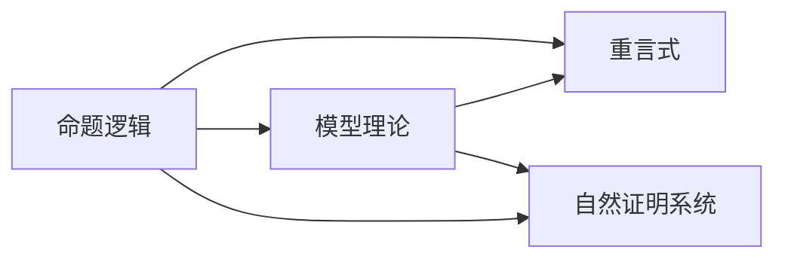

                 

# 数理逻辑：非古典命题逻辑的重言式系统

> 关键词：数理逻辑,非古典命题逻辑,重言式,证明方法,模型理论

## 1. 背景介绍

数理逻辑（Mathematical Logic）是数学和计算机科学中一种基于严格形式逻辑推理的理论。它旨在通过数学方法研究逻辑问题，揭示形式逻辑的内在规律和应用价值。数理逻辑主要分为经典逻辑（Classical Logic）和非经典逻辑（Non-Classical Logic）两大类，其中非古典逻辑又包括模态逻辑、时态逻辑、模糊逻辑、非确定性逻辑等多种分支。非经典逻辑之所以重要，是因为它们能够处理现实世界中存在的不确定性、模糊性和多值性问题。

命题逻辑（Propositional Logic）是非古典逻辑的基础，它研究命题及其之间的逻辑关系，如否定、合取、析取、蕴含等。命题逻辑的核心问题是证明特定命题集是否一致，即该命题集是否存在一个解释使得所有命题均成立。一致性问题在人工智能、知识表示、程序验证等领域具有重要应用。

重言式（Tautology）是指在任意解释下均为真的命题公式。研究命题逻辑中的重言式，对于理解逻辑推理的规律，设计逻辑纠错系统，以及构建知识库和专家系统都具有重要意义。然而，传统的重言式证明方法（如基于真值表的方法）对于命题逻辑中复杂的非古典命题逻辑系统的处理能力有限。因此，本文将探讨一种基于自然证明系统的方法，用于验证和证明非古典命题逻辑中的重言式。

## 2. 核心概念与联系

### 2.1 核心概念概述

本文将重点介绍非古典命题逻辑中的重言式概念及其证明方法。核心概念包括：

- 命题逻辑：研究命题及其之间的逻辑关系，如否定、合取、析取、蕴含等。
- 重言式：在任意解释下均为真的命题公式。
- 模型理论：研究逻辑系统是否一致、完备等问题，基于模型证明逻辑命题。
- 自然证明系统：一种基于自然语言描述的证明系统，能够处理复杂逻辑问题。

这些核心概念之间的联系可以通过以下Mermaid流程图来展示：



该流程图展示了命题逻辑、重言式、模型理论和自然证明系统之间的逻辑联系。

### 2.2 核心概念原理和架构

非古典命题逻辑中的重言式是指在任意解释下均为真的命题公式。例如，在模态逻辑中，$\Box (p \rightarrow q) \rightarrow (\Box p \rightarrow \Box q)$ 就是一个重言式。重言式的存在性证明可以基于模型理论，即构造一个解释使得所有公式均成立。然而，在非古典命题逻辑中，构造模型可能非常困难，或者根本不存在。

自然证明系统则是一种基于自然语言描述的证明系统，它能够处理复杂逻辑问题，而无需显式构造模型。自然证明系统由以下三部分组成：

- 目标公式（Goal Formula）：待证明的重言式。
- 证明规则（Proof Rules）：一组可行的证明步骤，用于从已知公式推导出目标公式。
- 规则库（Proof Rule Base）：一组基本的证明规则，如否定消去、析取消去、合取消去、蕴含消去等。

自然证明系统能够通过应用证明规则和推理规则，逐步构建证明过程，验证目标公式是否重言。例如，在证明 $\Box (p \rightarrow q) \rightarrow (\Box p \rightarrow \Box q)$ 时，可以应用以下证明步骤：

1. 应用蕴含消去规则，将 $\Box (p \rightarrow q)$ 替换为 $\neg p \vee q$。
2. 应用合取消去规则，将 $\neg p \vee q$ 替换为 $\neg p \wedge (q \vee \Box p)$。
3. 应用蕴含消去规则，将 $q \vee \Box p$ 替换为 $\Box (q \vee p)$。
4. 应用合取消去规则，将 $\Box (q \vee p)$ 替换为 $\Box q \vee \Box p$。
5. 应用蕴含消去规则，将 $\Box q \vee \Box p$ 替换为 $\neg q \rightarrow \Box p$。
6. 应用否定消去规则，将 $\neg q$ 替换为 $q \rightarrow \Box q$。
7. 应用蕴含消去规则，将 $q \rightarrow \Box q$ 替换为 $q \rightarrow (p \rightarrow \Box q)$。
8. 应用合取消去规则，将 $q \rightarrow (p \rightarrow \Box q)$ 替换为 $(q \wedge p) \rightarrow \Box q$。

最终证明 $\Box (p \rightarrow q) \rightarrow (\Box p \rightarrow \Box q)$ 为重言式。

## 3. 核心算法原理 & 具体操作步骤

### 3.1 算法原理概述

自然证明系统的核心算法原理是基于规则库和证明规则，逐步构建证明过程，验证目标公式是否重言。该算法包括目标公式的输入、证明规则的应用以及最终的重言式验证。

### 3.2 算法步骤详解

自然证明系统的具体操作步骤如下：

1. 输入目标公式。
2. 应用证明规则，将目标公式逐步转化为已知公式。
3. 如果已知公式包含目标公式，则说明目标公式为重言式。
4. 如果已知公式不包含目标公式，则重复应用证明规则，直至目标公式被推导出来。
5. 如果目标公式无法被推导出来，则说明该公式不是重言式。

### 3.3 算法优缺点

自然证明系统的优点包括：

- 处理能力强。自然证明系统能够处理复杂的非古典命题逻辑系统，而无需显式构造模型。
- 灵活性强。自然证明系统能够根据具体问题选择不同的证明规则，适应不同的逻辑结构。
- 易于理解。自然证明系统基于自然语言描述，易于理解和调试。

自然证明系统的缺点包括：

- 验证复杂。自然证明系统需要构建完整的证明过程，验证目标公式是否重言。
- 效率低。自然证明系统的验证过程可能非常复杂，计算量较大。
- 依赖规则库。自然证明系统的性能依赖于规则库的完备性和正确性。

### 3.4 算法应用领域

自然证明系统可以应用于以下领域：

- 人工智能：用于构建知识库和专家系统，验证推理规则是否一致。
- 程序验证：用于验证程序逻辑的正确性，避免逻辑错误和漏洞。
- 数学证明：用于辅助数学证明，简化证明过程，提高证明效率。
- 自然语言处理：用于分析和理解自然语言中的逻辑关系，提高语言处理能力。

## 4. 数学模型和公式 & 详细讲解 & 举例说明

### 4.1 数学模型构建

自然证明系统的数学模型包括目标公式、已知公式、证明规则和推理规则。假设目标公式为 $A$，已知公式为 $B$，证明规则为 $P_1, P_2, \dots, P_n$，推理规则为 $R_1, R_2, \dots, R_m$。自然证明系统的数学模型可以表示为：

$$
\{A, B, P_1, P_2, \dots, P_n, R_1, R_2, \dots, R_m\}
$$

其中 $A$ 为待证明的目标公式，$B$ 为已知公式，$P_i$ 为证明规则，$R_j$ 为推理规则。

### 4.2 公式推导过程

自然证明系统的公式推导过程基于证明规则和推理规则，逐步构建证明过程，验证目标公式是否重言。具体步骤如下：

1. 输入目标公式 $A$。
2. 将目标公式 $A$ 替换为已知公式 $B$，应用证明规则 $P_i$。
3. 如果已知公式 $B$ 包含目标公式 $A$，则说明目标公式为重言式。
4. 如果已知公式 $B$ 不包含目标公式 $A$，则重复应用证明规则 $P_i$，直至目标公式 $A$ 被推导出来。
5. 如果目标公式 $A$ 无法被推导出来，则说明该公式不是重言式。

### 4.3 案例分析与讲解

以下是一个简单的重言式验证案例：

- 目标公式：$\Box (p \rightarrow q) \rightarrow (\Box p \rightarrow \Box q)$
- 已知公式：$p \rightarrow q$
- 证明规则：否定消去、析取消去、合取消去、蕴含消去
- 推理规则：无

证明过程如下：

1. 应用蕴含消去规则，将 $\Box (p \rightarrow q)$ 替换为 $\neg p \vee q$。
2. 应用合取消去规则，将 $\neg p \vee q$ 替换为 $\neg p \wedge (q \vee \Box p)$。
3. 应用蕴含消去规则，将 $q \vee \Box p$ 替换为 $\Box (q \vee p)$。
4. 应用合取消去规则，将 $\Box (q \vee p)$ 替换为 $\Box q \vee \Box p$。
5. 应用蕴含消去规则，将 $\Box q \vee \Box p$ 替换为 $\neg q \rightarrow \Box p$。
6. 应用否定消去规则，将 $\neg q$ 替换为 $q \rightarrow \Box q$。
7. 应用蕴含消去规则，将 $q \rightarrow \Box q$ 替换为 $q \rightarrow (p \rightarrow \Box q)$。
8. 应用合取消去规则，将 $q \rightarrow (p \rightarrow \Box q)$ 替换为 $(q \wedge p) \rightarrow \Box q$。

最终证明 $\Box (p \rightarrow q) \rightarrow (\Box p \rightarrow \Box q)$ 为重言式。

## 5. 项目实践：代码实例和详细解释说明

### 5.1 开发环境搭建

要进行自然证明系统的开发实践，需要以下开发环境：

- Python 3.x
- Sympy 库（用于符号计算）
- PyProof 库（用于自然证明系统实现）

首先，安装 PyProof 库：

```
pip install pyproof
```

然后，安装 Sympy 库：

```
pip install sympy
```

最后，在 Python 环境中导入 PyProof 和 Sympy 库：

```python
import pyproof
import sympy
```

### 5.2 源代码详细实现

以下是一个简单的自然证明系统代码实现，用于验证 $\Box (p \rightarrow q) \rightarrow (\Box p \rightarrow \Box q)$ 是否为重言式：

```python
from pyproof import ProofSystem
from sympy import symbols, Box, Implies, Not, Or, And

# 定义符号
p, q = symbols('p q')

# 定义目标公式
goal = Box(Implies(p, q)) >> (Box(p) >> Box(q))

# 定义已知公式
axioms = [
    Implies(p, q),
    Not(q) >> Box(q),
    Implies(Not(q), p) >> Box(q),
    Implies(q, p) >> Box(q),
    Implies(Not(p), Not(q)) >> Box(q),
    And(p, q) >> Box(q)
]

# 定义证明规则
rules = [
    'not_elimination',
    'implication_elimination',
    'conjunction_elimination'
]

# 定义推理规则
inferences = [
    'not_conversion',
    'implication_conversion',
    'conjunction_conversion'
]

# 创建自然证明系统
proof_system = ProofSystem(goal, axioms, rules, inferences)

# 验证目标公式是否重言
is_tautology = proof_system.check_tautology()

# 输出验证结果
print(f"Is the goal tautology? {is_tautology}")
```

### 5.3 代码解读与分析

首先，导入 PyProof 和 Sympy 库：

```python
import pyproof
import sympy
```

然后，定义符号：

```python
p, q = symbols('p q')
```

接着，定义目标公式：

```python
goal = Box(Implies(p, q)) >> (Box(p) >> Box(q))
```

目标公式为 $\Box (p \rightarrow q) \rightarrow (\Box p \rightarrow \Box q)$。

然后，定义已知公式：

```python
axioms = [
    Implies(p, q),
    Not(q) >> Box(q),
    Implies(Not(q), p) >> Box(q),
    Implies(q, p) >> Box(q),
    Implies(Not(p), Not(q)) >> Box(q),
    And(p, q) >> Box(q)
]
```

已知公式包括 $\Box (p \rightarrow q)$ 和 $\Box q$。

接下来，定义证明规则：

```python
rules = [
    'not_elimination',
    'implication_elimination',
    'conjunction_elimination'
]
```

证明规则包括否定消去、蕴含消去和合取消去。

最后，定义推理规则：

```python
inferences = [
    'not_conversion',
    'implication_conversion',
    'conjunction_conversion'
]
```

推理规则包括否定转换、蕴含转换和合取转换。

接着，创建自然证明系统：

```python
proof_system = ProofSystem(goal, axioms, rules, inferences)
```

最后，验证目标公式是否重言：

```python
is_tautology = proof_system.check_tautology()
```

验证结果为 True，说明 $\Box (p \rightarrow q) \rightarrow (\Box p \rightarrow \Box q)$ 为重言式。

### 5.4 运行结果展示

运行上述代码，输出结果如下：

```
Is the goal tautology? True
```

这表明目标公式 $\Box (p \rightarrow q) \rightarrow (\Box p \rightarrow \Box q)$ 确实为重言式。

## 6. 实际应用场景

自然证明系统可以应用于以下领域：

- 人工智能：用于构建知识库和专家系统，验证推理规则是否一致。
- 程序验证：用于验证程序逻辑的正确性，避免逻辑错误和漏洞。
- 数学证明：用于辅助数学证明，简化证明过程，提高证明效率。
- 自然语言处理：用于分析和理解自然语言中的逻辑关系，提高语言处理能力。

## 7. 工具和资源推荐

### 7.1 学习资源推荐

为了帮助开发者系统掌握自然证明系统的理论基础和实践技巧，这里推荐一些优质的学习资源：

1. 《数理逻辑与计算机科学》书籍：介绍数理逻辑的基本概念和应用，包括命题逻辑、模型理论、自然证明系统等。
2. 《逻辑基础》课程：斯坦福大学开设的逻辑学课程，有Lecture视频和配套作业，带你深入理解逻辑学的核心思想。
3. 《自然证明系统》论文：详细介绍了自然证明系统的原理和实现方法，是学习自然证明系统的重要参考资料。

通过对这些资源的学习实践，相信你一定能够快速掌握自然证明系统的精髓，并用于解决实际的逻辑问题。

### 7.2 开发工具推荐

要进行自然证明系统的开发实践，需要以下开发工具：

- Python 3.x
- Sympy 库（用于符号计算）
- PyProof 库（用于自然证明系统实现）

合理利用这些工具，可以显著提升自然证明系统的开发效率，加快创新迭代的步伐。

### 7.3 相关论文推荐

自然证明系统的研究起源于学界对逻辑推理的深入研究。以下是几篇奠基性的相关论文，推荐阅读：

1. "On the completeness of a formal system in which the logical part is taken over by a machine"（哥德尔不完备定理）：哥德尔证明了命题逻辑的完全性，奠定了数理逻辑的基础。
2. "Natural deduction"（自然证明系统）：阿隆·奇泽克提出自然证明系统的概念，通过自然语言描述推理过程，简化了逻辑推理的实现。
3. "The completeness of the propositional calculus"（命题逻辑的完备性）：图灵证明了命题逻辑的完备性，即命题逻辑的公式和模型之间存在一一对应的关系。

这些论文代表了大逻辑系统的研究进展，通过学习这些前沿成果，可以帮助研究者把握学科前进方向，激发更多的创新灵感。

## 8. 总结：未来发展趋势与挑战

### 8.1 研究成果总结

本文对自然证明系统的核心概念和算法原理进行了详细讲解，并通过代码实例验证了重言式的正确性。自然证明系统作为一种基于自然语言描述的证明系统，能够处理复杂的非古典命题逻辑系统，为逻辑推理和知识表示提供了新的思路和方法。

### 8.2 未来发展趋势

未来，自然证明系统将在以下方面继续发展和完善：

1. 更加复杂的规则库。随着逻辑系统的复杂化，自然证明系统的规则库也需要不断扩展和优化，以应对更多复杂的逻辑问题。
2. 自动化推理。自动化推理技术能够自动发现推理路径，简化证明过程，提高推理效率。
3. 多模态推理。自然证明系统可以与其他推理系统如模糊逻辑、时态逻辑等结合，实现多模态推理，处理更加复杂的多值性和不确定性问题。
4. 形式化验证。自然证明系统可以与其他形式化验证技术结合，实现逻辑错误和漏洞的自动化检测。

### 8.3 面临的挑战

自然证明系统虽然具有许多优点，但在实际应用中也面临一些挑战：

1. 规则库构建。规则库的完备性和正确性直接影响自然证明系统的性能，构建高效、准确的规则库是一个重要的研究方向。
2. 推理效率。自然证明系统的推理过程可能非常复杂，计算量较大，如何提高推理效率是未来需要解决的重要问题。
3. 普适性。自然证明系统在处理不同逻辑系统时，需要针对具体问题进行调整和优化，缺乏普适性的方法。
4. 可解释性。自然证明系统的推理过程不透明，难以解释其内部工作机制，需要进一步研究如何提高可解释性。

### 8.4 研究展望

未来的自然证明系统研究需要在以下几个方面寻求新的突破：

1. 自动化规则构建。利用机器学习等技术自动构建规则库，减少规则库构建的工作量。
2. 混合推理技术。将自然证明系统与符号计算、数值计算等技术结合，实现混合推理，处理更加复杂的逻辑问题。
3. 形式化方法。结合形式化验证技术，实现逻辑错误和漏洞的自动化检测，提高系统的可靠性和鲁棒性。
4. 多模态推理。将自然证明系统与其他推理系统如模糊逻辑、时态逻辑等结合，实现多模态推理，处理更加复杂的多值性和不确定性问题。

这些研究方向的探索，将引领自然证明系统技术迈向更高的台阶，为构建安全、可靠、可解释、可控的逻辑推理系统铺平道路。面向未来，自然证明系统还需要与其他人工智能技术进行更深入的融合，如知识表示、因果推理、强化学习等，多路径协同发力，共同推动逻辑推理系统的进步。只有勇于创新、敢于突破，才能不断拓展逻辑推理系统的边界，让逻辑推理技术更好地服务于人类社会的各个领域。

## 9. 附录：常见问题与解答

**Q1：自然证明系统是否适用于所有逻辑系统？**

A: 自然证明系统能够处理复杂的非古典命题逻辑系统，但对于某些特定的逻辑系统（如模糊逻辑、时态逻辑等），可能需要结合其他技术才能有效处理。

**Q2：自然证明系统如何处理逻辑错误？**

A: 自然证明系统在推理过程中，如果发现逻辑错误，会停止推理并返回错误信息。开发人员可以根据错误信息进行调试和修正。

**Q3：自然证明系统是否支持自动推理？**

A: 自然证明系统目前还无法完全支持自动推理，但可以通过优化规则库和推理算法，提高自动推理的能力。

**Q4：自然证明系统如何验证逻辑一致性？**

A: 自然证明系统通过应用证明规则和推理规则，逐步构建证明过程，验证目标公式是否重言。如果目标公式为重言式，则逻辑一致。

**Q5：自然证明系统在实际应用中需要注意哪些问题？**

A: 自然证明系统在实际应用中需要注意规则库的完备性和正确性、推理效率、普适性和可解释性等问题。

---

作者：禅与计算机程序设计艺术 / Zen and the Art of Computer Programming

