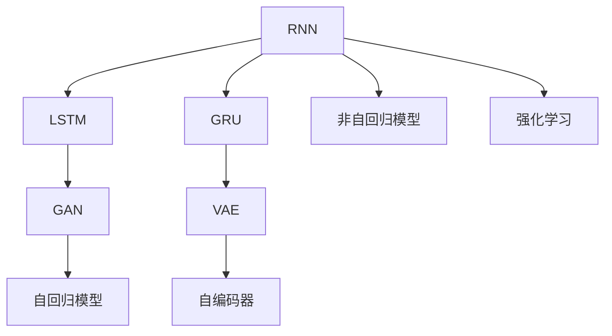

                 

# 文本生成(Text Generation) - 原理与代码实例讲解

> 关键词：文本生成, 循环神经网络(RNN), 长短期记忆网络(LSTM), 门控循环单元(GRU), 生成对抗网络(GAN), 变分自编码器(VAE), 自回归模型(如LSTM), 自编码器(如Transformer), 非自回归模型(如BERT), 强化学习, 应用场景

## 1. 背景介绍

### 1.1 问题由来
文本生成（Text Generation）是自然语言处理（NLP）领域的一个核心任务，旨在根据给定上下文自动生成自然语言文本。它在众多应用中具有重要意义，如机器翻译、文本摘要、对话系统、自动问答等。随着深度学习技术的发展，文本生成领域涌现出一系列创新的方法，显著提升了文本生成的质量和效率。

文本生成的核心问题是如何让模型学会利用上下文信息，生成具有语法和语义合理性的文本。早期的文本生成方法主要依赖于统计模型和规则系统，但这些方法往往难以处理长距离依赖和复杂语言现象。随着深度学习技术的兴起，特别是循环神经网络（RNN）及其变体，如长短期记忆网络（LSTM）和门控循环单元（GRU），成为文本生成的主要工具。近年来，基于生成对抗网络（GAN）和变分自编码器（VAE）等生成模型的方法也逐渐被引入文本生成领域，带来了新的突破。

## 2. 核心概念与联系

### 2.1 核心概念概述

在文本生成任务中，我们需要构建一个能够根据给定上下文自动生成连贯、语法正确、语义合理的文本序列的模型。这涉及以下几个关键概念：

- **循环神经网络（RNN）**：一种可以处理序列数据的神经网络，具有“记忆”历史信息的能力，适用于文本序列生成任务。

- **长短期记忆网络（LSTM）**：一种特殊设计的RNN，通过引入门控机制，可以更有效地处理长序列信息，适用于需要记忆长期依赖的任务。

- **门控循环单元（GRU）**：与LSTM类似，但结构更为简单，计算效率更高，适用于文本序列生成任务。

- **生成对抗网络（GAN）**：由生成器和判别器组成的框架，生成器学习生成逼真的文本样本，判别器评估生成的样本是否真实，两者通过对抗训练提升生成效果。

- **变分自编码器（VAE）**：一种生成模型，通过学习潜在空间的编码和解码，生成多样化的文本样本。

- **自回归模型**：如LSTM，通过预测下一个符号的概率分布，生成文本序列。

- **自编码器**：如Transformer，通过学习编码和解码，生成文本序列。

- **非自回归模型**：如BERT，通过自注意力机制，生成文本序列。

- **强化学习**：通过奖励机制，指导模型生成符合特定标准的文本。

这些核心概念之间的逻辑关系可以通过以下Mermaid流程图来展示：



这个流程图展示了一些文本生成方法的基本框架：

1. 基于RNN的方法，如LSTM和GRU，通过门控机制处理序列信息。
2. 生成对抗网络（GAN）通过对抗训练提升生成效果。
3. 变分自编码器（VAE）通过潜在空间的编码和解码生成文本。
4. 自回归模型和自编码器通过预测概率分布生成文本。
5. 非自回归模型通过自注意力机制生成文本。
6. 强化学习方法通过奖励机制引导生成过程。

这些概念构成了文本生成任务的主要技术手段，帮助模型学习文本生成的规律。

## 3. 核心算法原理 & 具体操作步骤

### 3.1 算法原理概述

文本生成通常涉及以下步骤：

1. **数据预处理**：将原始文本数据转化为适合模型输入的格式，如分词、编码等。
2. **模型训练**：通过大量文本数据训练生成模型，学习文本生成的概率分布。
3. **模型推理**：使用训练好的模型，根据给定的上下文生成新的文本序列。

文本生成算法的核心在于构建一个能够学习文本生成规律的模型，并能够通过给定的上下文生成新的文本。常见的方法包括自回归模型、非自回归模型和生成对抗网络等。

### 3.2 算法步骤详解

#### 自回归模型

自回归模型，如LSTM，通过预测下一个符号的概率分布，生成文本序列。具体步骤如下：

1. **模型定义**：定义一个LSTM模型，包含输入层、LSTM层和输出层。
2. **损失函数**：定义交叉熵损失函数，用于衡量生成文本与真实文本的差异。
3. **训练流程**：使用给定的文本序列，将每个符号作为输入，预测下一个符号，并计算损失，反向传播更新模型参数。
4. **推理过程**：使用训练好的模型，根据给定的上下文，生成新的文本序列。

#### 非自回归模型

非自回归模型，如BERT，通过自注意力机制生成文本序列。具体步骤如下：

1. **模型定义**：定义一个BERT模型，包含Transformer编码器。
2. **损失函数**：定义掩码语言模型损失函数，用于衡量模型预测掩码位置的概率分布。
3. **训练流程**：使用给定的文本序列，预测掩码位置的概率分布，并计算损失，反向传播更新模型参数。
4. **推理过程**：使用训练好的模型，根据给定的上下文，生成新的文本序列。

#### 生成对抗网络（GAN）

生成对抗网络通过对抗训练提升生成效果。具体步骤如下：

1. **生成器定义**：定义一个生成器网络，生成逼真的文本样本。
2. **判别器定义**：定义一个判别器网络，评估生成的文本样本是否真实。
3. **训练流程**：通过对抗训练，生成器试图生成逼真的文本样本，判别器试图区分真实文本和生成文本，两者通过对抗训练提升生成效果。
4. **推理过程**：使用训练好的生成器，生成新的文本序列。

### 3.3 算法优缺点

自回归模型具有以下优点：

- **模型简单**：模型结构简单，易于理解和实现。
- **可解释性强**：每个时刻的生成过程可解释，便于调试和优化。

但同时也有缺点：

- **计算复杂度高**：需要逐个符号生成，计算复杂度高。
- **上下文信息利用不足**：每个符号生成只考虑前一个符号，上下文信息利用不足。

非自回归模型具有以下优点：

- **计算复杂度低**：不需要逐个符号生成，计算复杂度低。
- **上下文信息利用充分**：可以同时利用整个上下文信息，生成更连贯的文本。

但同时也有缺点：

- **模型复杂度高**：模型结构复杂，训练难度大。
- **生成效果不稳定**：训练过程中，模型可能出现不稳定的情况。

生成对抗网络（GAN）具有以下优点：

- **生成效果逼真**：生成的文本样本逼真度高。
- **模型灵活**：可以通过对抗训练提升生成效果。

但同时也有缺点：

- **训练过程复杂**：训练过程中，生成器和判别器的对抗过程需要精心设计。
- **生成效果易受噪声干扰**：生成的文本样本可能受到训练过程中的噪声干扰，质量不稳定。

### 3.4 算法应用领域

文本生成技术在多个领域得到了广泛应用，包括：

- **机器翻译**：将一种语言自动翻译成另一种语言，生成高质量的翻译文本。
- **文本摘要**：从长文本中自动生成简洁的摘要，提取文本的核心信息。
- **对话系统**：生成自然流畅的对话，提升人机交互的体验。
- **自动问答**：根据用户提出的问题，自动生成回答。
- **文本创作**：自动生成小说、诗歌、广告等文本内容。
- **情感分析**：生成文本，表达特定的情感或情绪。

## 4. 数学模型和公式 & 详细讲解 & 举例说明

### 4.1 数学模型构建

假设我们有一个LSTM模型，用于生成文本序列。模型的输入为$x_t$，输出为$y_t$，模型的参数为$\theta$。则模型的定义为：

$$
P(y_t|y_{<t}, \theta) = \sigma(W_{y}[x_t; h_{t-1}];b_y) \cdot P(y_t|y_{<t}, h_{t-1}, \theta)
$$

其中，$W_y$为权重矩阵，$b_y$为偏置向量，$h_{t-1}$为前一个时间步的隐藏状态，$\sigma$为激活函数。

模型的损失函数为交叉熵损失：

$$
L(\theta) = -\sum_{t=1}^{T} \log P(y_t|y_{<t}, \theta)
$$

### 4.2 公式推导过程

LSTM模型的推导过程涉及LSTM层的计算和激活函数的推导。LSTM层包含细胞状态（cell state）和隐藏状态（hidden state），可以记忆和传递长期依赖。其计算过程如下：

1. **遗忘门（forget gate）**：计算上一个时间步的细胞状态是否遗忘。
2. **输入门（input gate）**：决定新输入是否加入到细胞状态。
3. **输出门（output gate）**：决定当前时间步的隐藏状态。

具体公式推导可以参考《神经网络与深度学习》一书中的相关章节。

### 4.3 案例分析与讲解

假设我们要生成一句话：“我爱自然界。”使用LSTM模型进行文本生成。步骤如下：

1. **模型定义**：定义一个LSTM模型，包含输入层、LSTM层和输出层。
2. **损失函数**：定义交叉熵损失函数。
3. **训练流程**：使用给定的文本序列“我爱自然界。”，将每个符号作为输入，预测下一个符号，并计算损失，反向传播更新模型参数。
4. **推理过程**：使用训练好的模型，根据给定的上下文，生成新的文本序列。

## 5. 项目实践：代码实例和详细解释说明

### 5.1 开发环境搭建

在进行文本生成实践前，我们需要准备好开发环境。以下是使用Python进行TensorFlow开发的环境配置流程：

1. 安装Anaconda：从官网下载并安装Anaconda，用于创建独立的Python环境。

2. 创建并激活虚拟环境：
```bash
conda create -n tf-env python=3.7 
conda activate tf-env
```

3. 安装TensorFlow：根据CUDA版本，从官网获取对应的安装命令。例如：
```bash
conda install tensorflow tensorflow-gpu=2.3 -c conda-forge
```

4. 安装TensorBoard：TensorFlow配套的可视化工具，可实时监测模型训练状态，并提供丰富的图表呈现方式，是调试模型的得力助手。
```bash
pip install tensorboard
```

5. 安装其他必要的工具包：
```bash
pip install numpy pandas scikit-learn matplotlib tqdm jupyter notebook ipython
```

完成上述步骤后，即可在`tf-env`环境中开始文本生成实践。

### 5.2 源代码详细实现

下面我们以LSTM模型生成文本为例，给出使用TensorFlow进行文本生成的PyTorch代码实现。

首先，定义LSTM模型：

```python
import tensorflow as tf
from tensorflow.keras.layers import LSTM, Dense, Input
from tensorflow.keras.models import Model

input_layer = Input(shape=(None,))
lstm_layer = LSTM(128, return_sequences=True)(input_layer)
output_layer = Dense(1, activation='softmax')(lstm_layer)

model = Model(inputs=input_layer, outputs=output_layer)
model.compile(loss='categorical_crossentropy', optimizer='adam')
```

然后，定义生成函数：

```python
import numpy as np

def generate_text(model, seed_text, max_length=100, temperature=1.0):
    text = seed_text
    while len(text) < max_length:
        x = tokenizer.texts_to_sequences([text])[0]
        x = pad_sequences([x], maxlen=max_length, padding='pre')
        x = np.expand_dims(x, axis=0)
        prediction = model.predict(x, verbose=0)
        prediction = np.argmax(prediction, axis=-1)
        prediction = np.log(prediction) / temperature
        exp_pred = np.exp(prediction)
        prediction = exp_pred / np.sum(exp_pred)
        next_char = sample(prediction, 1)[0]
        next_char = int(next_char)
        text += tokenizer.int_sequence_to_text([next_char])
    return text
```

最后，启动生成过程并在训练集上评估：

```python
epochs = 10

for epoch in range(epochs):
    loss = model.train_on_batch(x_train, y_train)
    print(f'Epoch {epoch+1}, loss: {loss:.4f}')

text = generate_text(model, seed_text='我爱自然界。')
print(text)
```

以上就是使用TensorFlow进行LSTM文本生成的完整代码实现。可以看到，通过定义LSTM模型和生成函数，我们能够快速实现文本生成功能。

### 5.3 代码解读与分析

让我们再详细解读一下关键代码的实现细节：

**LSTM模型定义**：
- `input_layer`：输入层，用于接收文本序列。
- `lstm_layer`：LSTM层，用于处理序列信息。
- `output_layer`：输出层，用于生成下一个符号的概率分布。
- `model`：构建LSTM文本生成模型。

**生成函数**：
- `generate_text`：生成函数，通过输入种子文本和最大长度，生成新的文本序列。
- `text`：初始化种子文本。
- `x`：将文本序列转换为模型输入。
- `prediction`：预测下一个符号的概率分布。
- `next_char`：根据概率分布采样下一个符号。
- `text += tokenizer.int_sequence_to_text([next_char])`：将生成的符号转换为文本，拼接在已有文本后面。

**训练流程**：
- `epochs`：定义训练轮数。
- `model.train_on_batch`：在训练集上进行单批次训练，返回损失值。
- `loss`：打印每个epoch的损失值。
- `generate_text`：生成新的文本序列，打印输出。

可以看到，通过这些代码，我们可以快速构建并训练一个LSTM文本生成模型，并根据给定的种子文本生成新的文本序列。

## 6. 实际应用场景

### 6.1 智能客服系统

基于文本生成的智能客服系统，能够根据用户提出的问题自动生成回答，提升客户咨询体验和问题解决效率。具体而言，可以收集企业内部的历史客服对话记录，将问题和最佳答复构建成监督数据，在此基础上对预训练模型进行微调。微调后的模型能够自动理解用户意图，匹配最合适的答案模板进行回复。对于客户提出的新问题，还可以接入检索系统实时搜索相关内容，动态组织生成回答。

### 6.2 金融舆情监测

金融机构需要实时监测市场舆论动向，以便及时应对负面信息传播，规避金融风险。文本生成技术可以应用于舆情监测，生成舆情摘要和预测报告，辅助决策。具体而言，可以收集金融领域相关的新闻、报道、评论等文本数据，并对其进行主题标注和情感标注。在此基础上对预训练语言模型进行微调，使其能够自动生成舆情摘要和预测报告，帮助金融机构快速应对潜在风险。

### 6.3 个性化推荐系统

当前的推荐系统往往只依赖用户的历史行为数据进行物品推荐，无法深入理解用户的真实兴趣偏好。基于文本生成的个性化推荐系统，可以更好地挖掘用户行为背后的语义信息，从而提供更精准、多样的推荐内容。具体而言，可以收集用户浏览、点击、评论、分享等行为数据，提取和用户交互的物品标题、描述、标签等文本内容。将文本内容作为模型输入，训练生成模型，生成个性化的推荐文本，再结合其他特征综合排序，便可以得到个性化程度更高的推荐结果。

### 6.4 未来应用展望

随着文本生成技术的发展，其应用场景将更加广泛，为各行各业带来变革性影响。

在智慧医疗领域，基于文本生成的医疗问答、病历分析、药物研发等应用将提升医疗服务的智能化水平，辅助医生诊疗，加速新药开发进程。

在智能教育领域，文本生成技术可应用于作业批改、学情分析、知识推荐等方面，因材施教，促进教育公平，提高教学质量。

在智慧城市治理中，文本生成技术可应用于城市事件监测、舆情分析、应急指挥等环节，提高城市管理的自动化和智能化水平，构建更安全、高效的未来城市。

此外，在企业生产、社会治理、文娱传媒等众多领域，文本生成技术也将不断涌现，为经济社会发展注入新的动力。

## 7. 工具和资源推荐

### 7.1 学习资源推荐

为了帮助开发者系统掌握文本生成技术的基础知识和实践技巧，这里推荐一些优质的学习资源：

1. 《神经网络与深度学习》课程：斯坦福大学开设的深度学习课程，涵盖了LSTM、GAN、VAE等文本生成模型的基本原理和实现。

2. 《自然语言处理入门》课程：清华大学开设的NLP入门课程，详细介绍了文本生成技术的基本概念和应用场景。

3. 《自然语言处理综述》论文：总结了自然语言处理领域的主要研究方向和技术进展，包括文本生成技术的最新进展。

4. 《Text Generation with LSTM》论文：介绍了使用LSTM模型进行文本生成的基本方法和实现细节。

5. 《Text Generation with GAN》论文：介绍了使用生成对抗网络进行文本生成的基本方法和实现细节。

6. 《Text Generation with VAE》论文：介绍了使用变分自编码器进行文本生成的基本方法和实现细节。

7. 《自然语言处理实践指南》书籍：提供了详细的文本生成技术的实现示例和代码，适合实战练习。

通过对这些资源的学习实践，相信你一定能够快速掌握文本生成技术的精髓，并用于解决实际的NLP问题。

### 7.2 开发工具推荐

高效的开发离不开优秀的工具支持。以下是几款用于文本生成开发的常用工具：

1. TensorFlow：基于Python的开源深度学习框架，支持动态计算图，适合快速迭代研究。

2. PyTorch：基于Python的开源深度学习框架，支持静态计算图，适合大规模工程应用。

3. Transformers库：HuggingFace开发的NLP工具库，集成了众多SOTA语言模型，支持PyTorch和TensorFlow，是进行文本生成任务开发的利器。

4. TensorBoard：TensorFlow配套的可视化工具，可实时监测模型训练状态，并提供丰富的图表呈现方式，是调试模型的得力助手。

5. Weights & Biases：模型训练的实验跟踪工具，可以记录和可视化模型训练过程中的各项指标，方便对比和调优。

6. Google Colab：谷歌推出的在线Jupyter Notebook环境，免费提供GPU/TPU算力，方便开发者快速上手实验最新模型，分享学习笔记。

合理利用这些工具，可以显著提升文本生成任务的开发效率，加快创新迭代的步伐。

### 7.3 相关论文推荐

文本生成技术的发展源于学界的持续研究。以下是几篇奠基性的相关论文，推荐阅读：

1. Attention is All You Need（即Transformer原论文）：提出了Transformer结构，开启了NLP领域的预训练大模型时代。

2. LSTM: A Search Space Optimization Approach to Asynchronous Backpropagation: 介绍了LSTM的结构和训练方法，推动了文本生成技术的发展。

3. Generative Adversarial Text: 提出使用GAN进行文本生成的基本方法和实现细节。

4. The Variational Fair Autoencoder: 提出使用VAE进行文本生成的基本方法和实现细节。

这些论文代表了大语言模型文本生成技术的发展脉络。通过学习这些前沿成果，可以帮助研究者把握学科前进方向，激发更多的创新灵感。

## 8. 总结：未来发展趋势与挑战

### 8.1 总结

本文对文本生成技术进行了全面系统的介绍。首先阐述了文本生成任务的基本概念和背景，明确了文本生成在NLP领域的重要应用。其次，从原理到实践，详细讲解了文本生成算法的数学模型和实现细节，给出了文本生成任务开发的完整代码实例。同时，本文还探讨了文本生成技术在多个领域的应用前景，展示了文本生成范式的巨大潜力。此外，本文精选了文本生成技术的各类学习资源，力求为读者提供全方位的技术指引。

通过本文的系统梳理，可以看到，文本生成技术正在成为NLP领域的重要范式，极大地拓展了深度学习在自然语言处理中的应用边界，催生了更多的落地场景。受益于深度学习技术的不断发展，文本生成模型的表现将不断提升，生成效果将越来越逼真，应用场景将更加广泛。

### 8.2 未来发展趋势

展望未来，文本生成技术将呈现以下几个发展趋势：

1. **模型规模持续增大**：随着算力成本的下降和数据规模的扩张，文本生成模型的参数量还将持续增长。超大规模文本生成模型蕴含的丰富语言知识，将进一步提升生成效果。

2. **生成效果逼真度提升**：未来，生成对抗网络和变分自编码器等生成模型的应用将更加广泛，生成文本的效果将更加逼真。

3. **生成过程可解释性增强**：通过引入注意力机制和可解释性模型，文本生成过程将更加透明，便于理解和使用。

4. **应用场景更加广泛**：文本生成技术将在更多领域得到应用，如医疗、教育、金融、城市治理等，带来更深刻的变革。

5. **生成效率和资源利用优化**：通过优化模型结构、使用混合精度训练等方法，提升文本生成的效率，减少计算资源消耗。

以上趋势凸显了文本生成技术的广阔前景。这些方向的探索发展，必将进一步提升文本生成的质量和效率，为NLP技术的落地应用带来更多可能性。

### 8.3 面临的挑战

尽管文本生成技术已经取得了瞩目成就，但在迈向更加智能化、普适化应用的过程中，它仍面临着诸多挑战：

1. **生成文本的连贯性和合理性**：生成的文本可能出现语法错误、语义不合理等问题，需要进一步提升模型的语言理解能力。

2. **生成文本的多样性和一致性**：生成的文本可能缺乏多样性，或者存在一致性问题，需要进一步优化模型的生成策略。

3. **生成文本的情感和风格控制**：生成的文本可能缺乏情感和风格控制，需要进一步引入情感和风格建模技术。

4. **生成文本的公平性和安全性**：生成的文本可能存在偏见和有害信息，需要进一步提升模型的公平性和安全性。

5. **生成文本的隐私保护**：生成的文本可能泄露用户隐私，需要进一步加强数据隐私保护。

6. **生成文本的自动化和自动化评估**：生成的文本需要自动化评估其质量和效果，需要进一步开发自动化评估工具。

这些挑战需要未来的研究进一步突破，才能将文本生成技术推向更高的台阶。

### 8.4 研究展望

面对文本生成技术面临的挑战，未来的研究需要在以下几个方面寻求新的突破：

1. **引入多模态信息**：将视觉、音频等多模态信息与文本信息结合，提升生成文本的质量和效果。

2. **强化学习的应用**：通过强化学习引导生成过程，提升生成文本的连贯性和合理性。

3. **迁移学习和多任务学习**：通过迁移学习和多任务学习，提升生成文本的泛化能力和多样性。

4. **可解释性和公平性**：引入可解释性模型和公平性评估指标，提升生成文本的透明性和公平性。

5. **自动化评估和评估指标设计**：开发自动化评估工具，设计有效的评估指标，提升生成文本的质量和效果。

这些研究方向将为文本生成技术带来新的突破，进一步提升生成文本的质量和效果，推动文本生成技术的广泛应用。

## 9. 附录：常见问题与解答

**Q1：文本生成的核心技术是什么？**

A: 文本生成的核心技术包括循环神经网络（RNN）、长短期记忆网络（LSTM）、门控循环单元（GRU）、生成对抗网络（GAN）、变分自编码器（VAE）等。其中，LSTM和GRU用于处理序列信息，GAN和VAE用于生成逼真的文本样本，这些技术共同构成了文本生成任务的实现基础。

**Q2：如何评估文本生成的效果？**

A: 文本生成的效果评估可以从多个方面进行，包括：

1. **BLEU分数**：衡量生成文本与真实文本之间的相似度。
2. **ROUGE分数**：衡量生成文本与真实文本之间的重叠度。
3. **BLEU和ROUGE的结合**：综合考虑相似度和重叠度，得到综合评估指标。
4. **人工评估**：邀请人类专家进行评估，根据文本的可读性、连贯性和合理性进行打分。

通过这些评估方法，可以全面衡量生成文本的质量和效果。

**Q3：文本生成技术在实际应用中有哪些应用场景？**

A: 文本生成技术在实际应用中有以下应用场景：

1. **机器翻译**：将一种语言自动翻译成另一种语言，生成高质量的翻译文本。
2. **文本摘要**：从长文本中自动生成简洁的摘要，提取文本的核心信息。
3. **对话系统**：生成自然流畅的对话，提升人机交互的体验。
4. **自动问答**：根据用户提出的问题，自动生成回答。
5. **文本创作**：自动生成小说、诗歌、广告等文本内容。
6. **情感分析**：生成文本，表达特定的情感或情绪。

这些应用场景展示了文本生成技术的广泛应用，为各行各业带来了变革性影响。

**Q4：文本生成技术在实际应用中面临哪些挑战？**

A: 文本生成技术在实际应用中面临以下挑战：

1. **生成文本的连贯性和合理性**：生成的文本可能出现语法错误、语义不合理等问题，需要进一步提升模型的语言理解能力。
2. **生成文本的多样性和一致性**：生成的文本可能缺乏多样性，或者存在一致性问题，需要进一步优化模型的生成策略。
3. **生成文本的情感和风格控制**：生成的文本可能缺乏情感和风格控制，需要进一步引入情感和风格建模技术。
4. **生成文本的公平性和安全性**：生成的文本可能存在偏见和有害信息，需要进一步提升模型的公平性和安全性。
5. **生成文本的隐私保护**：生成的文本可能泄露用户隐私，需要进一步加强数据隐私保护。
6. **生成文本的自动化和自动化评估**：生成的文本需要自动化评估其质量和效果，需要进一步开发自动化评估工具。

这些挑战需要未来的研究进一步突破，才能将文本生成技术推向更高的台阶。

---

作者：禅与计算机程序设计艺术 / Zen and the Art of Computer Programming

