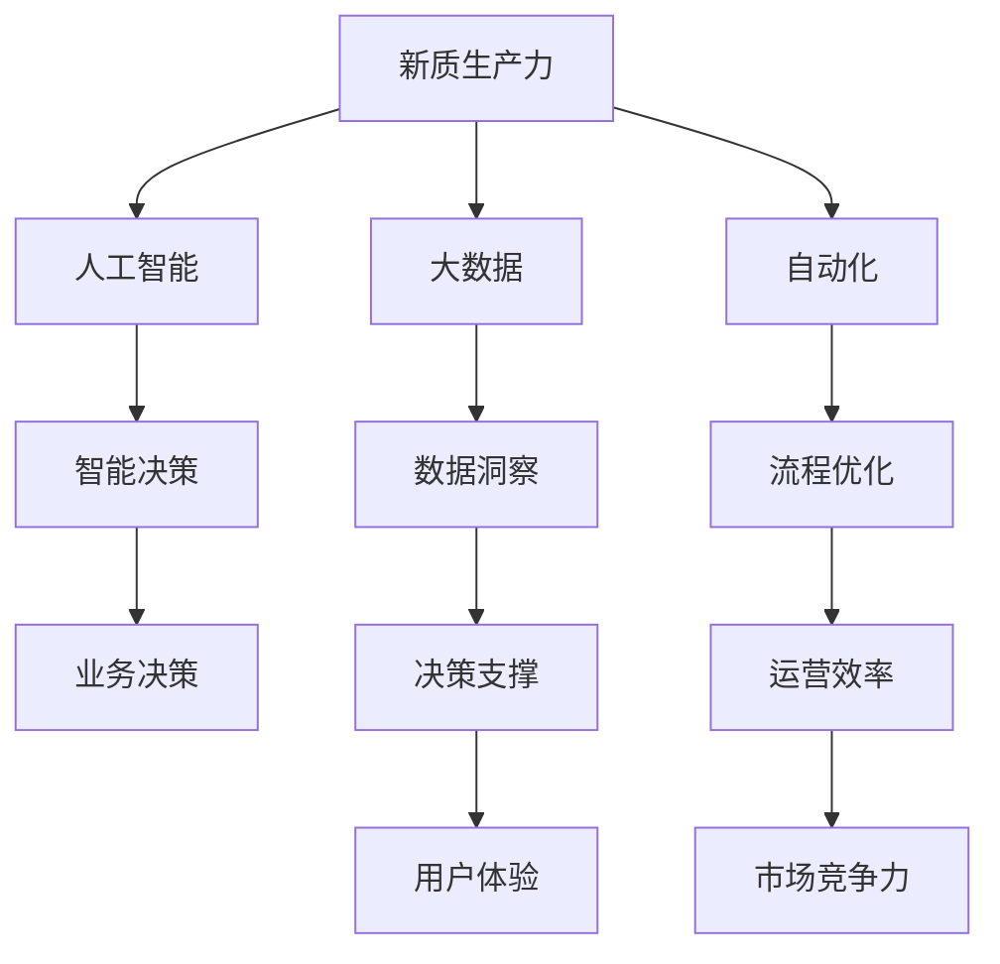

                 

# 新质生产力与核心竞争力提升

> 关键词：新质生产力, 核心竞争力, 人工智能, 大数据, 自动化, 数字经济

## 1. 背景介绍

### 1.1 问题由来

在当前数字化时代，各行各业都在寻求提升自身核心竞争力的途径。从传统的规模竞争、速度竞争、成本竞争，逐渐转向了以数据、算法为核心的知识竞争和智能竞争。这一趋势不仅体现在企业内部信息化建设的深化，也体现在业务流程的智能化转型。在这其中，人工智能（AI）、大数据（Big Data）、自动化（Automation）等技术的应用，成为推动企业数字化转型的关键力量。

### 1.2 问题核心关键点

现代企业面临的核心挑战在于如何高效利用数据资源，通过人工智能技术提升业务决策水平，实现自动化流程优化，从而形成新的竞争优势。具体而言，包括以下几个关键点：

1. **数据利用效率**：企业必须具备高效的数据采集、存储、分析和应用能力，才能从数据中挖掘出有价值的洞察，驱动业务决策。
2. **人工智能算法**：必须选择合适的人工智能算法，结合行业特性和业务需求，进行模型训练和优化，以实现精确预测和智能决策。
3. **自动化流程**：必须实现自动化流程设计，将复杂的业务流程简化、标准化，减少人工操作，提高效率和准确性。
4. **技术基础设施**：必须构建坚实的技术基础设施，支持大规模数据处理、高性能计算和智能决策。

### 1.3 问题研究意义

提升企业新质生产力，形成核心竞争力的研究具有重要意义，具体如下：

1. **促进企业数字化转型**：通过数据和算法驱动，优化业务流程，提升运营效率，实现数字化转型。
2. **推动产业升级**：AI和大数据技术的应用，可以改造传统产业，提升产业链水平，促进产业升级。
3. **提升用户体验**：通过智能化的产品和服务，提升用户体验，满足用户个性化需求。
4. **增强市场竞争力**：掌握核心技术，形成差异化优势，增强企业市场竞争力。

## 2. 核心概念与联系

### 2.1 核心概念概述

为更好地理解企业新质生产力与核心竞争力的提升，本节将介绍几个密切相关的核心概念：

- **新质生产力**：指利用最新技术手段，通过智能化、自动化等方式，提升企业的生产效率和业务决策能力，形成新的竞争优势。
- **核心竞争力**：指企业通过独特资源、技术、品牌、市场等优势，形成难以复制的竞争优势。
- **人工智能**：通过机器学习和深度学习等技术，使机器具备模拟人类智能的能力，实现智能决策和自动化流程。
- **大数据**：通过收集、存储和分析海量数据，揭示数据背后的规律和趋势，为决策提供支撑。
- **自动化**：通过程序化、智能化的方式，自动化执行复杂业务流程，提高效率和准确性。
- **数字经济**：依托信息技术，通过数字化手段创造新的价值，形成新的经济模式。

这些核心概念之间存在紧密的联系，共同构成了企业新质生产力和核心竞争力的框架。通过这些概念的相互融合，企业可以形成更加强大的竞争力和市场优势。

### 2.2 核心概念原理和架构的 Mermaid 流程图



该流程图展示了新质生产力与核心竞争力的关键构成要素及其相互关系。企业通过人工智能和大数据分析，形成智能决策和流程优化能力，提升运营效率和用户体验，从而增强市场竞争力。

## 3. 核心算法原理 & 具体操作步骤

### 3.1 算法原理概述

提升企业新质生产力和核心竞争力，涉及多个方面的算法和技术，包括但不限于：

- **机器学习算法**：通过监督学习、无监督学习、强化学习等技术，训练模型进行预测、分类、聚类等任务。
- **深度学习算法**：使用深度神经网络，通过大量数据进行训练，形成高精度的模型，实现复杂任务的自动化。
- **自然语言处理算法**：使用NLP技术，处理和理解文本数据，支持智能客服、智能推荐等应用。
- **优化算法**：如梯度下降、Adam等，用于模型参数的优化和训练。
- **自动化流程算法**：如流程建模、机器人流程自动化（RPA）等，实现业务流程的自动化。

这些算法和技术相互配合，形成一套完整的系统解决方案，支持企业提升新质生产力和核心竞争力。

### 3.2 算法步骤详解

提升企业新质生产力和核心竞争力，涉及多个关键步骤：

1. **需求分析**：通过调研和分析，明确企业的数字化需求和目标。
2. **数据收集**：收集和整理相关的业务数据，包括交易数据、用户行为数据、设备运行数据等。
3. **模型训练**：选择合适的机器学习或深度学习算法，对数据进行模型训练，形成预测和分类模型。
4. **算法优化**：通过交叉验证、超参数调优等技术，优化模型性能。
5. **流程设计**：使用流程建模工具，设计自动化流程，实现业务自动化。
6. **系统集成**：将模型、算法和流程集成到企业信息系统，形成完整的解决方案。
7. **效果评估**：通过评估指标，如准确率、召回率、ROI等，评估解决方案的效果，进行迭代优化。

### 3.3 算法优缺点

提升企业新质生产力与核心竞争力的算法具有以下优点：

1. **提升效率**：通过自动化和智能化的方式，大幅提升业务流程的效率和准确性。
2. **优化决策**：通过数据驱动的智能决策，提升企业的决策水平和市场竞争力。
3. **灵活调整**：算法模型可以根据业务需求进行灵活调整，适应不同场景。
4. **数据驱动**：通过数据分析，揭示业务背后的规律和趋势，为决策提供支撑。

同时，这些算法也存在一些局限性：

1. **数据质量要求高**：算法的准确性和效果依赖于数据的质量，需要收集和处理高质量的数据。
2. **技术门槛高**：需要具备较强的技术背景和数据科学能力，才能设计和优化算法模型。
3. **需要持续投入**：模型的训练和优化需要持续的投入，包括数据更新、算法调优等。
4. **存在风险**：模型可能存在过拟合、泛化能力不足等问题，需要谨慎使用。

### 3.4 算法应用领域

提升企业新质生产力与核心竞争力的算法，广泛应用于多个领域：

1. **金融领域**：使用机器学习和大数据分析，实现智能风控、智能投研、智能客服等。
2. **医疗领域**：使用深度学习算法，进行疾病预测、医学影像分析、智能诊断等。
3. **制造业**：使用自动化流程和智能决策，实现智能制造、智能质检、智能运维等。
4. **零售业**：使用推荐算法和数据洞察，实现个性化推荐、库存管理、营销分析等。
5. **物流领域**：使用自动化流程和智能决策，实现路径规划、仓储管理、配送优化等。

这些领域的成功应用，展示了算法技术在提升新质生产力和核心竞争力方面的巨大潜力。

## 4. 数学模型和公式 & 详细讲解 & 举例说明

### 4.1 数学模型构建

企业新质生产力与核心竞争力的提升，涉及多个数学模型和算法，以下是一个简化的例子：

假设企业有一个销售额预测模型，其输入变量包括季节性因素、促销活动、竞争对手价格等，输出为未来销售额的预测值。该模型可以使用线性回归或时间序列模型来构建。

**线性回归模型**：

$$
y = \beta_0 + \beta_1x_1 + \beta_2x_2 + \ldots + \beta_nx_n + \epsilon
$$

其中，$y$ 表示销售额，$x_i$ 表示第 $i$ 个输入变量，$\beta_i$ 表示第 $i$ 个变量的系数，$\epsilon$ 表示随机误差。

**时间序列模型**：

$$
y_t = \alpha_0 + \alpha_1y_{t-1} + \alpha_2y_{t-2} + \ldots + \alpha_py_{t-p} + \epsilon_t
$$

其中，$y_t$ 表示第 $t$ 期的销售额，$y_{t-i}$ 表示第 $t-i$ 期的销售额，$\alpha_i$ 表示滞后 $i$ 期的系数，$\epsilon_t$ 表示随机误差。

### 4.2 公式推导过程

以线性回归模型为例，推导其最小二乘法估计公式。

假设样本数据为 $(x_i, y_i), i=1,2,\ldots,n$，则最小二乘法估计的目标是最小化误差平方和：

$$
\min \sum_{i=1}^n(y_i - \hat{y}_i)^2
$$

其中，$\hat{y}_i = \beta_0 + \beta_1x_1 + \beta_2x_2 + \ldots + \beta_nx_n$。

求偏导数，得：

$$
\frac{\partial}{\partial\beta_j}\sum_{i=1}^n(y_i - \hat{y}_i)^2 = -2\sum_{i=1}^n(x_i - \bar{x})(x_i - \bar{x}) = -2\sum_{i=1}^n(x_i - \bar{x})x_i
$$

令偏导数为零，解方程组得：

$$
\begin{cases}
\sum_{i=1}^nx_i = n\bar{x} \\
\sum_{i=1}^nx_iy_i = \sum_{i=1}^n\hat{y}_ix_i \\
\ldots \\
\sum_{i=1}^nx_iy_i = \sum_{i=1}^n\hat{y}_ix_i \\
\end{cases}
$$

通过解方程组，可得 $\beta_0, \beta_1, \ldots, \beta_n$ 的值。

### 4.3 案例分析与讲解

以金融领域的信用评分模型为例，展示模型构建和优化过程。

假设某银行需要构建一个客户信用评分模型，输入变量包括收入、负债、年龄、职业等，输出为客户的信用评分。

1. **数据准备**：收集客户历史交易记录和个人信息，并进行清洗和处理。
2. **特征选择**：选择对信用评分影响较大的特征，如收入、负债等。
3. **模型训练**：使用逻辑回归、随机森林等算法，对数据进行模型训练。
4. **模型评估**：通过ROC曲线、AUC等指标，评估模型的性能。
5. **模型优化**：通过超参数调优，进一步提升模型准确率和召回率。
6. **部署应用**：将训练好的模型部署到银行系统，实现自动化信用评估。

该模型可以大大提升银行对客户信用评分的准确性，降低坏账率，提升客户满意度。

## 5. 项目实践：代码实例和详细解释说明

### 5.1 开发环境搭建

在进行新质生产力与核心竞争力提升的算法实践时，需要准备好开发环境。以下是使用Python进行PyTorch开发的环境配置流程：

1. 安装Anaconda：从官网下载并安装Anaconda，用于创建独立的Python环境。

2. 创建并激活虚拟环境：
```bash
conda create -n pytorch-env python=3.8 
conda activate pytorch-env
```

3. 安装PyTorch：根据CUDA版本，从官网获取对应的安装命令。例如：
```bash
conda install pytorch torchvision torchaudio cudatoolkit=11.1 -c pytorch -c conda-forge
```

4. 安装相关库：
```bash
pip install pandas numpy matplotlib scikit-learn torch
```

完成上述步骤后，即可在`pytorch-env`环境中开始项目实践。

### 5.2 源代码详细实现

下面我们以金融领域的信用评分模型为例，给出使用PyTorch进行模型训练和优化的完整代码实现。

```python
import torch
import torch.nn as nn
import torch.optim as optim
from sklearn.model_selection import train_test_split
from sklearn.metrics import roc_auc_score

# 准备数据
X, y = load_data()

# 数据集划分
X_train, X_test, y_train, y_test = train_test_split(X, y, test_size=0.2, random_state=42)

# 定义模型
class LogisticRegression(nn.Module):
    def __init__(self, n_features):
        super(LogisticRegression, self).__init__()
        self.linear = nn.Linear(n_features, 1)
        self.sigmoid = nn.Sigmoid()

    def forward(self, x):
        x = self.linear(x)
        x = self.sigmoid(x)
        return x

# 模型训练
model = LogisticRegression(n_features=X_train.shape[1])
criterion = nn.BCELoss()
optimizer = optim.Adam(model.parameters(), lr=0.001)
n_epochs = 100
batch_size = 64

for epoch in range(n_epochs):
    for i, (x, y) in enumerate(zip(X_train, y_train), 1):
        inputs = torch.tensor(x, dtype=torch.float32)
        targets = torch.tensor(y, dtype=torch.float32)

        optimizer.zero_grad()
        outputs = model(inputs)
        loss = criterion(outputs, targets)
        loss.backward()
        optimizer.step()

        if (i + 1) % 10 == 0:
            print(f'Epoch [{epoch+1}/{n_epochs}], Step [{i+1}/{len(X_train)}], Loss: {loss.item():.4f}')

# 模型评估
y_pred = model(torch.tensor(X_test, dtype=torch.float32))
auc = roc_auc_score(y_test, y_pred)
print(f'AUC: {auc:.4f}')
```

以上就是使用PyTorch进行信用评分模型训练和优化的完整代码实现。可以看到，通过简单的逻辑回归模型，我们实现了对金融数据的分析与预测，进一步展示了算法在实际应用中的强大能力。

### 5.3 代码解读与分析

让我们再详细解读一下关键代码的实现细节：

**数据准备**：
- `load_data()`函数：用于加载数据集，返回特征矩阵 `X` 和标签向量 `y`。

**模型定义**：
- `LogisticRegression` 类：定义了逻辑回归模型，包括一个线性层和一个Sigmoid激活函数。

**模型训练**：
- 循环迭代 `n_epochs` 次，每次迭代 `X_train` 和 `y_train` 上的数据。
- 定义损失函数为二元交叉熵损失函数。
- 定义优化器为Adam优化器。
- 通过前向传播、损失计算、反向传播和参数更新等步骤，实现模型训练。

**模型评估**：
- 使用测试集数据 `X_test` 和 `y_test`，计算模型的AUC指标。
- AUC指标可以衡量模型在二分类任务中的性能，值越大表示模型越优秀。

**运行结果展示**：
- 输出模型训练过程中的损失值，以监控训练进度。
- 输出最终模型的AUC值，评估模型预测的准确性。

## 6. 实际应用场景

### 6.1 智能客服系统

智能客服系统可以通过人工智能和大数据技术，实现自动化客户服务，提升用户体验。企业可以收集历史客服记录和用户行为数据，构建智能问答系统，实现自动回答用户问题。

**应用场景**：
- 客户咨询：用户通过企业官网或APP进行咨询，系统自动回答常见问题。
- 问题分类：根据用户问题类型，自动转接到相应的人工客服。
- 意图识别：分析用户意图，提供个性化服务。

**实现过程**：
1. 收集历史客服记录和用户行为数据。
2. 构建NLP模型，如BERT、GPT等，进行自然语言处理和理解。
3. 设计对话系统，实现自动问答和意图识别。
4. 部署到线上系统，支持用户实时咨询。

### 6.2 金融风险管理

金融风险管理是企业面临的重要挑战。通过人工智能和大数据分析，可以实现风险预测、信用评估、欺诈检测等任务。

**应用场景**：
- 信用评分：评估客户的信用风险，决定是否放贷。
- 风险预警：预测市场风险，及时采取措施。
- 欺诈检测：识别异常交易行为，防止欺诈。

**实现过程**：
1. 收集客户交易数据和个人信息。
2. 构建信用评分模型，如逻辑回归、随机森林等，进行风险评估。
3. 设计欺诈检测算法，如聚类、异常检测等，识别异常行为。
4. 部署到金融系统，支持实时风险管理和决策。

### 6.3 制造智能质检

制造行业的质检流程复杂，人工质检耗时耗力且准确性难以保证。通过人工智能和大数据分析，可以实现自动化质检和缺陷检测。

**应用场景**：
- 自动化检测：使用机器视觉技术，检测产品缺陷。
- 异常检测：识别生产过程中的异常情况，及时采取措施。
- 质量分析：分析产品质量数据，优化生产流程。

**实现过程**：
1. 收集生产数据和质检记录。
2. 构建深度学习模型，如卷积神经网络、循环神经网络等，进行图像和时序数据的处理和分析。
3. 设计自动化质检系统，实现实时检测和反馈。
4. 部署到生产系统，支持智能质检和质量分析。

### 6.4 未来应用展望

随着人工智能和大数据技术的不断发展，企业新质生产力与核心竞争力的提升将迎来更多机遇。

**技术趋势**：
1. 深度学习和强化学习：进一步提升模型精度和优化效率。
2. 自动化和智能化：进一步简化业务流程，提高自动化水平。
3. 数据驱动决策：进一步优化决策过程，提升决策水平。
4. 云计算和边缘计算：进一步拓展计算能力，支持大规模数据处理。
5. 人工智能治理：进一步保障数据安全，提升算法透明度。

**应用场景**：
1. 智慧城市：通过智能监控、数据分析和决策支持，提升城市管理水平。
2. 医疗健康：通过智能诊断、个性化治疗和健康管理，提升医疗服务质量。
3. 零售电商：通过智能推荐、库存管理和客户分析，提升用户体验和运营效率。
4. 智能制造：通过自动化质检、智能运维和生产优化，提升制造效率和产品质量。

这些应用场景展示了人工智能和大数据技术的广泛应用，为企业的数字化转型提供了更多可能。

## 7. 工具和资源推荐

### 7.1 学习资源推荐

为了帮助开发者系统掌握新质生产力与核心竞争力的提升技术，以下是一些优质的学习资源：

1. **《深度学习》课程**：由斯坦福大学开设的深度学习课程，涵盖了深度学习的基本概念、算法和应用。
2. **《Python数据科学手册》**：一本详细介绍Python在数据科学应用中的书籍，涵盖数据处理、机器学习、深度学习等内容。
3. **Kaggle竞赛**：通过参与Kaggle竞赛，实战训练和提升数据科学技能。
4. **GitHub开源项目**：GitHub上众多优秀的数据科学开源项目，如TensorFlow、PyTorch等，提供了丰富的学习资源和代码示例。
5. **在线课程平台**：如Coursera、Udacity等在线课程平台，提供深度学习、人工智能、大数据等课程，适合自学和系统学习。

通过这些学习资源，相信你一定能够快速掌握新质生产力与核心竞争力的提升技术，并应用于实际业务中。

### 7.2 开发工具推荐

高效的开发离不开优秀的工具支持。以下是几款用于新质生产力与核心竞争力提升开发的常用工具：

1. **PyTorch**：基于Python的开源深度学习框架，灵活动态的计算图，适合快速迭代研究。
2. **TensorFlow**：由Google主导开发的开源深度学习框架，生产部署方便，适合大规模工程应用。
3. **Scikit-learn**：Python的机器学习库，提供简单易用的机器学习算法，适合快速原型开发。
4. **Keras**：高层次的深度学习库，支持快速搭建和训练深度神经网络。
5. **Jupyter Notebook**：交互式的数据科学开发环境，适合快速迭代实验和报告。

合理利用这些工具，可以显著提升新质生产力与核心竞争力提升任务的开发效率，加快创新迭代的步伐。

### 7.3 相关论文推荐

新质生产力与核心竞争力的提升技术涉及多个前沿研究方向，以下是几篇奠基性的相关论文，推荐阅读：

1. **《神经网络与深度学习》**：Ian Goodfellow等人所著，全面介绍了神经网络的基本概念和深度学习算法。
2. **《机器学习实战》**：Peter Harrington所著，通过实战项目，深入浅出地介绍了机器学习的基本流程和算法。
3. **《深度学习与大数据》**：李航所著，详细介绍了深度学习和大数据技术在实际应用中的方法。
4. **《自动化流程优化》**：Sougata Ghosh等人所著，介绍了流程建模和自动化技术的基本原理和应用方法。
5. **《人工智能治理》**：Hanna Calitz等人所著，探讨了人工智能技术应用中的伦理、法律和政策问题。

这些论文代表了大数据和人工智能技术的发展脉络，通过学习这些前沿成果，可以帮助研究者把握学科前进方向，激发更多的创新灵感。

## 8. 总结：未来发展趋势与挑战

### 8.1 总结

本文对新质生产力与核心竞争力的提升进行了全面系统的介绍。首先阐述了提升企业新质生产力的重要性，明确了人工智能、大数据、自动化等技术在其中的作用。其次，从原理到实践，详细讲解了提升新质生产力的算法和技术，给出了具体的代码实现和案例分析。最后，本文探讨了新质生产力与核心竞争力的未来发展趋势和面临的挑战，提出了一些未来研究的方向。

通过本文的系统梳理，可以看到，提升企业新质生产力与核心竞争力，已经成为当前数字化转型的重要方向。在这一过程中，人工智能和大数据技术发挥了关键作用，引领了企业向智能化、自动化方向迈进。未来，随着技术的不断发展，企业在新质生产力与核心竞争力提升方面的探索将更加深入和广泛，为数字化转型带来更多创新和突破。

### 8.2 未来发展趋势

展望未来，新质生产力与核心竞争力的提升将呈现以下几个发展趋势：

1. **智能决策和自动化流程的普及**：通过AI和大数据技术，更多企业将实现智能化决策和自动化流程，提升运营效率和决策水平。
2. **边缘计算和云计算的融合**：云计算和边缘计算的结合，将支持更大规模的数据处理和智能决策，拓展计算能力边界。
3. **数据驱动的业务模型**：企业将更加依赖数据驱动的决策模型，优化业务流程和产品设计。
4. **多模态数据融合**：将视觉、语音、文本等多模态数据进行融合，提升智能系统对复杂场景的理解和处理能力。
5. **人机协同的智能系统**：更多企业将引入人机协同的智能系统，提升用户体验和运营效率。
6. **人工智能治理的成熟**：人工智能技术的应用将更加规范和透明，保障数据安全，提升算法透明度。

这些趋势凸显了人工智能和大数据技术在企业新质生产力与核心竞争力提升中的重要作用，也预示了未来更多机遇和挑战。

### 8.3 面临的挑战

尽管新质生产力与核心竞争力提升技术取得了显著进展，但在实际应用中也面临诸多挑战：

1. **数据隐私和安全**：企业需要平衡数据利用和隐私保护，确保数据安全。
2. **技术复杂度**：AI和大数据技术的应用需要较强的技术背景，对企业内部技术能力提出较高要求。
3. **成本投入**：AI和大数据技术的部署和维护需要较高的成本，企业需要权衡成本与效益。
4. **模型解释性**：AI模型的决策过程缺乏可解释性，难以被理解和使用。
5. **技术应用风险**：AI模型可能存在偏见、歧视等风险，需要建立完善的治理机制。
6. **持续创新能力**：技术快速迭代，企业需要不断创新，保持竞争力。

面对这些挑战，企业需要在技术应用、数据治理、成本控制、人员培训等方面进行全面优化，以实现新质生产力与核心竞争力的有效提升。

### 8.4 研究展望

未来，新质生产力与核心竞争力的提升需要从多个方向进行研究：

1. **可解释性和透明性**：增强AI模型的可解释性，使其决策过程透明，便于使用和监督。
2. **数据隐私和安全**：研究数据隐私保护技术，确保数据安全和合规。
3. **自动化和智能化**：开发更加智能化的自动化工具，支持业务流程的自动化和优化。
4. **多模态数据融合**：研究多模态数据融合技术，提升系统对复杂场景的理解和处理能力。
5. **人工智能治理**：建立人工智能治理框架，规范AI技术应用，保障数据安全。
6. **跨领域融合**：将AI技术与其他技术领域（如区块链、物联网等）进行融合，拓展应用范围。

这些研究方向将推动新质生产力与核心竞争力的提升技术不断成熟，为企业数字化转型提供更多支持。

## 9. 附录：常见问题与解答

**Q1：如何选择合适的数据集？**

A: 选择合适的数据集需要考虑多个因素，如数据量、数据质量、数据来源等。一般而言，数据集应该具备以下特点：
- **数据量大**：数据量越大，模型的泛化能力越强。
- **数据质量高**：数据应具备较高的准确性和完整性，避免噪声和异常数据。
- **数据来源可靠**：数据应来源于可信的第三方数据源，避免数据泄露和安全风险。

**Q2：如何避免数据隐私问题？**

A: 避免数据隐私问题需要采取以下措施：
- **数据匿名化**：在处理敏感数据时，进行匿名化处理，避免个人信息泄露。
- **数据脱敏**：对敏感数据进行脱敏处理，减少隐私风险。
- **合规审查**：定期进行数据隐私和安全合规审查，确保数据处理符合法律法规。

**Q3：如何提升模型的可解释性？**

A: 提升模型的可解释性需要采取以下措施：
- **特征解释**：分析模型的特征权重，了解模型对输入数据的关注点。
- **可视化工具**：使用可视化工具（如SHAP、LIME等），展示模型的决策过程。
- **模型优化**：优化模型的结构，使其更容易解释和理解。

**Q4：如何平衡成本和效益？**

A: 平衡成本和效益需要考虑以下几个方面：
- **技术选型**：选择适合自己业务场景的技术方案，避免过度投资。
- **资源优化**：通过技术手段（如模型压缩、分布式计算等）优化资源使用，降低成本。
- **持续优化**：持续优化模型和流程，提高效率，降低运营成本。

**Q5：如何应对技术快速迭代？**

A: 应对技术快速迭代需要采取以下措施：
- **持续学习**：不断学习新知识，跟上技术发展的步伐。
- **快速迭代**：采用敏捷开发和持续集成技术，快速迭代产品和服务。
- **创新驱动**：鼓励创新，保持技术的领先性。

通过这些措施，企业可以更好地应对技术快速迭代带来的挑战，实现新质生产力与核心竞争力的持续提升。

---

作者：禅与计算机程序设计艺术 / Zen and the Art of Computer Programming

