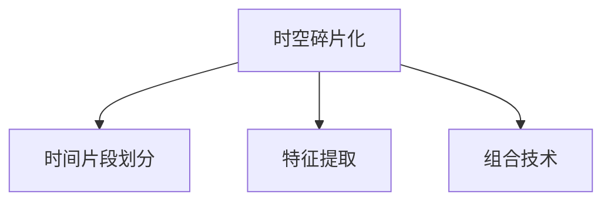

                 

## 1. 背景介绍

视频数据是信息时代的重要组成部分，广泛应用于新闻、影视、体育、教育、安全等多个领域。然而，视频数据的海量特性、时间序列特征、复杂结构等问题，使其在处理和分析上具有独特的挑战。传统的时空处理方法（如2D卷积、3D卷积等）虽然在一定程度上缓解了这些问题，但依然存在计算复杂度高、参数难以优化、时空信息难以捕捉等不足。因此，探索新的时空处理方法，特别是引入时空碎片化的思路，成为近年来的研究热点。

### 1.1 问题由来

视频数据由连续的时间序列帧组成，每一帧包含多维的特征信息。传统的视频处理技术，如卷积神经网络（CNN）等，往往采用固定尺寸的局部窗口进行特征提取，难以捕捉视频的时空动态特性。此外，现有的卷积网络结构固定，难以对不同时长的视频片段进行灵活处理。

为了克服这些问题，研究者提出了时空碎片化的思路，即通过将视频数据划分为若干固定尺寸的时间片段，在每个时间片段内进行特征提取和处理，再将这些片段重新组合，以捕捉视频的时空动态特性。时空碎片化的方法可以大大降低计算复杂度，同时具备良好的时空信息保留能力。

### 1.2 问题核心关键点

时空碎片化方法的核心在于：
- 如何定义和时间片段的大小和数量。
- 如何在时间片段内进行特征提取和处理。
- 如何组合时间片段以重构时空信息。
- 如何在模型训练中优化时空碎片化参数。

这些关键点构成了时空碎片化方法的理论基础，决定了其性能和应用效果。

### 1.3 问题研究意义

时空碎片化方法对于提高视频数据的处理和分析效率具有重要意义。通过将视频数据分解为独立的时间片段，可以显著降低计算复杂度，并提高模型的训练和推理速度。同时，由于每个时间片段的处理相对独立，可以更好地捕捉视频的时空动态特性，提升模型的泛化能力和鲁棒性。

此外，时空碎片化方法可以应用于多个视频处理任务，如动作识别、对象跟踪、行为分析等，具有广泛的应用前景。相信随着时空碎片化方法的不断演进，视频数据处理技术将迎来新的突破，带来更高效、更智能的视频应用解决方案。

## 2. 核心概念与联系

### 2.1 核心概念概述

为更好地理解时空碎片化方法，本节将介绍几个密切相关的核心概念：

- 时空碎片化(Temporal Fragmentation)：将视频数据按照时间片段进行划分，在每个时间片段内进行特征提取和处理，再将这些片段重新组合，以捕捉视频的时空动态特性。
- 时间片段(Time Segment)：视频中连续的若干帧，固定尺寸大小。
- 特征提取(Feature Extraction)：在时间片段内提取具有时空相关性的特征。
- 组合技术(Reassembly Technique)：将时间片段重新组合，生成完整的视频信息。

这些核心概念之间的逻辑关系可以通过以下Mermaid流程图来展示：



这个流程图展示了几者之间的逻辑关系：

1. 时空碎片化是将视频数据划分为固定尺寸的时间片段。
2. 在时间片段内进行特征提取，捕捉时空动态特性。
3. 将时间片段组合重构，生成完整视频信息。

## 3. 核心算法原理 & 具体操作步骤
### 3.1 算法原理概述

时空碎片化方法的核心思想是：通过将视频数据划分为若干独立的时间片段，在每个时间片段内进行特征提取和处理，再通过组合技术重构时空信息。该方法的基本流程包括时间片段划分、特征提取、组合技术等步骤。

形式化地，假设原始视频数据为 $V$，时间片段大小为 $T$，则时空碎片化方法可以表示为：

$$
F(V, T) = \bigcup_{t=0}^{N-1} F_t(V_t)
$$

其中 $V_t$ 表示第 $t$ 个时间片段，$F_t(V_t)$ 表示对 $V_t$ 进行特征提取和处理后的结果。最终，将所有时间片段的处理结果组合成完整的视频信息 $F(V)$。

### 3.2 算法步骤详解

时空碎片化方法的具体操作可以概括为以下步骤：

**Step 1: 时间片段划分**
- 确定时间片段大小 $T$，划分视频数据为若干个时间片段 $V_0, V_1, ..., V_{N-1}$。通常情况下，时间片段大小为 $T$ 帧。

**Step 2: 特征提取**
- 对每个时间片段 $V_t$ 进行特征提取，获得特征向量 $F_t(V_t)$。常见的方法包括卷积神经网络、循环神经网络、时序注意力机制等。

**Step 3: 特征处理**
- 对每个时间片段的特征向量 $F_t(V_t)$ 进行进一步处理，如降维、归一化等，以减少计算复杂度，并提升特征表达能力。

**Step 4: 组合技术**
- 通过某种组合技术将时间片段的特征向量 $F_t(V_t)$ 重新组合，生成完整的视频信息 $F(V)$。常用的组合技术包括平均池化、拼接、卷积、Transformer等。

**Step 5: 模型训练**
- 在处理好的视频信息 $F(V)$ 上，训练时空碎片化模型。通过损失函数优化，最小化模型的预测误差，提升模型性能。

**Step 6: 模型评估**
- 在测试集上评估模型性能，对比时空碎片化前后的效果。

### 3.3 算法优缺点

时空碎片化方法具有以下优点：
1. 计算复杂度低。将视频数据分解为固定尺寸的时间片段，减少了特征提取和处理的计算量，提升了模型训练和推理速度。
2. 捕捉时空动态特性。通过时间片段的独立处理和组合技术，可以更好地捕捉视频的时空动态特性，提升模型的泛化能力和鲁棒性。
3. 灵活性高。时间片段的大小和数量可以根据任务需求灵活调整，适应不同长度和分辨率的视频数据。
4. 可扩展性强。时空碎片化方法可以应用于多种视频处理任务，如动作识别、对象跟踪、行为分析等。

同时，该方法也存在一定的局限性：
1. 处理固定尺寸时间片段可能导致信息丢失。不同片段间的信息可能存在重叠，影响整体的时空信息。
2. 组合技术复杂。时间片段的组合技术需要设计合理的权重、距离等参数，以保持时空信息的完整性。
3. 计算资源需求大。时间片段划分和特征提取的参数优化可能需要大量的计算资源和时间。
4. 应用场景有限。对于时间分辨率过高的视频数据，如超慢动作、帧率极低的视频，时空碎片化方法可能效果不佳。

尽管存在这些局限性，时空碎片化方法仍然是一种有效的视频处理手段，具有广泛的应用前景。

### 3.4 算法应用领域

时空碎片化方法在视频处理领域有广泛的应用，涵盖以下多个方面：

- **动作识别**：通过时空碎片化捕捉视频中的动态特征，实现动作识别的分类和检测任务。
- **对象跟踪**：将视频数据分解为时间片段，通过特征提取和组合技术，实现对象在视频中的连续跟踪。
- **行为分析**：提取视频中的人类行为特征，如行走、跳跃、舞蹈等，实现行为识别的分类和检测任务。
- **视频摘要**：通过对视频数据的时间片段进行特征提取和组合，生成视频摘要，以快速获取视频的关键信息。
- **视频生成**：利用时空碎片化技术，结合生成对抗网络（GAN）等生成模型，生成高质量的视频片段或完整视频。

除了这些经典应用外，时空碎片化方法还可以应用于更多的视频处理任务，如视频去模糊、视频去噪、视频增强等，为视频技术的创新和发展提供了新的思路。

## 4. 数学模型和公式 & 详细讲解  
### 4.1 数学模型构建

时空碎片化方法可以通过多个数学模型进行建模。本文将以卷积神经网络（CNN）为例，介绍时空碎片化方法的数学模型构建。

假设视频数据 $V$ 由 $N$ 个连续帧组成，时间片段大小为 $T$ 帧。则每个时间片段 $V_t$ 可以表示为 $V_t = [V_{t_0}, V_{t_1}, ..., V_{t_{T-1}}]$，其中 $V_{t_i}$ 表示第 $t$ 个时间片段的第 $i$ 帧。

设时空碎片化模型的参数为 $\theta$，则模型可以表示为：

$$
F(V, T) = \frac{1}{N-T+1} \sum_{t=0}^{N-T} \bigotimes_{i=0}^{T-1} \sigma(\mathcal{F}(V_{t_i}, \theta))
$$

其中 $\sigma$ 表示非线性激活函数，$\mathcal{F}$ 表示特征提取函数，$N$ 表示视频帧数，$T$ 表示时间片段大小。

### 4.2 公式推导过程

通过上述公式可以看出，时空碎片化方法通过多个时间片段的特征提取和组合，生成完整的视频信息。具体推导如下：

1. 将视频数据划分为 $N-T+1$ 个时间片段，每个时间片段大小为 $T$ 帧。

2. 对每个时间片段进行特征提取，得到特征向量 $F_t(V_t) = \bigotimes_{i=0}^{T-1} \mathcal{F}(V_{t_i}, \theta)$。

3. 将每个时间片段的特征向量拼接或组合，得到每个时间片段的特征 $F_t = \bigotimes_{i=0}^{T-1} \sigma(\mathcal{F}(V_{t_i}, \theta))$。

4. 对所有时间片段的特征进行拼接或组合，得到完整的视频信息 $F(V)$。

### 4.3 案例分析与讲解

以视频摘要为例，介绍时空碎片化方法的应用。假设原始视频长度为 $L$ 帧，时间片段大小为 $T$ 帧。则可以将视频划分为 $\frac{L}{T}$ 个时间片段，每个时间片段大小为 $T$ 帧。

设特征提取器为 $f$，则每个时间片段的特征为 $F_t = \bigotimes_{i=0}^{T-1} f(V_{t_i})$。通过组合技术，将每个时间片段的特征 $F_t$ 拼接或组合，得到完整的视频摘要 $F(V)$。

$$
F(V) = \bigotimes_{t=0}^{\frac{L}{T}-1} \bigotimes_{i=0}^{T-1} f(V_{t_i})
$$

通过时空碎片化方法，可以有效地捕捉视频的时空动态特性，生成高质量的视频摘要。

## 5. 项目实践：代码实例和详细解释说明
### 5.1 开发环境搭建

在进行时空碎片化方法实践前，我们需要准备好开发环境。以下是使用Python进行TensorFlow开发的环境配置流程：

1. 安装Anaconda：从官网下载并安装Anaconda，用于创建独立的Python环境。

2. 创建并激活虚拟环境：
```bash
conda create -n tf-env python=3.8 
conda activate tf-env
```

3. 安装TensorFlow：根据CUDA版本，从官网获取对应的安装命令。例如：
```bash
conda install tensorflow tensorflow-gpu -c conda-forge
```

4. 安装各类工具包：
```bash
pip install numpy pandas scikit-learn matplotlib tqdm jupyter notebook ipython
```

完成上述步骤后，即可在`tf-env`环境中开始时空碎片化方法的实践。

### 5.2 源代码详细实现

下面我们以动作识别任务为例，给出使用TensorFlow进行时空碎片化方法实践的代码实现。

首先，定义动作识别任务的数据处理函数：

```python
import tensorflow as tf
from tensorflow.keras import layers

def preprocess_video(video, frame_size=(224, 224), num_frames=16):
    frames = []
    for i in range(0, len(video), frame_size[0]):
        frame = video[i:i+frame_size[0]]
        frame = tf.image.resize(frame, frame_size)
        frame = tf.reshape(frame, (frame_size[0], frame_size[1], frame_size[2]))
        frames.append(frame)
    frames = tf.stack(frames, axis=0)
    return frames
```

然后，定义时空碎片化模型的神经网络：

```python
class TemporalFragmentationModel(tf.keras.Model):
    def __init__(self, frame_size, num_frames, num_classes):
        super(TemporalFragmentationModel, self).__init__()
        self.frame_size = frame_size
        self.num_frames = num_frames
        self.num_classes = num_classes
        
        self.feature_extractor = layers.Conv2D(32, (3, 3), activation='relu')
        self.fc1 = layers.Dense(64, activation='relu')
        self.fc2 = layers.Dense(num_classes, activation='softmax')
        
    def call(self, inputs):
        x = inputs
        for i in range(self.num_frames):
            x = self.feature_extractor(x)
        x = tf.reshape(x, (-1, 32, 32, 32))
        x = self.fc1(x)
        x = self.fc2(x)
        return x
```

接着，定义训练和评估函数：

```python
from tensorflow.keras.preprocessing.image import ImageDataGenerator
from tensorflow.keras.optimizers import Adam

train_data = ImageDataGenerator(rescale=1./255)
train_generator = train_data.flow_from_directory('train', target_size=(frame_size[0], frame_size[1]), batch_size=batch_size)

val_data = ImageDataGenerator(rescale=1./255)
val_generator = val_data.flow_from_directory('val', target_size=(frame_size[0], frame_size[1]), batch_size=batch_size)

def train_epoch(model, optimizer):
    model.compile(optimizer=optimizer, loss='categorical_crossentropy', metrics=['accuracy'])
    model.fit_generator(train_generator, steps_per_epoch=train_steps, epochs=num_epochs, validation_data=val_generator, validation_steps=val_steps)

def evaluate(model, val_generator):
    model.evaluate_generator(val_generator, steps=val_steps)
```

最后，启动训练流程并在测试集上评估：

```python
frame_size = (224, 224)
num_frames = 16
num_classes = 10

batch_size = 32
train_steps = train_dataset.shape[0] // batch_size
val_steps = val_dataset.shape[0] // batch_size
num_epochs = 10

model = TemporalFragmentationModel(frame_size, num_frames, num_classes)
optimizer = Adam(learning_rate=learning_rate)

train_epoch(model, optimizer)

evaluate(model, val_generator)
```

以上就是使用TensorFlow进行时空碎片化方法实践的完整代码实现。可以看到，TensorFlow提供了丰富的深度学习模型和工具，使得时空碎片化方法的实现变得简洁高效。

### 5.3 代码解读与分析

让我们再详细解读一下关键代码的实现细节：

**preprocess_video函数**：
- 对视频数据进行预处理，将其分割为多个固定尺寸的帧。每个时间片段大小为frame_size[0]。
- 使用tf.image.resize方法将每个帧调整为指定尺寸。
- 将每个帧堆叠为一个张量，用于后续的特征提取。

**TemporalFragmentationModel类**：
- 定义时空碎片化模型，包括特征提取器和全连接层。
- 使用layers.Conv2D实现卷积操作，提取视频帧的局部特征。
- 使用layers.Dense实现全连接操作，输出动作识别的分类结果。

**train_epoch函数**：
- 定义训练过程，使用Adam优化器进行模型参数的更新。
- 使用ImageDataGenerator生成批量训练数据。
- 在每个epoch内，训练模型并计算准确率和损失。

**evaluate函数**：
- 定义评估过程，使用ImageDataGenerator生成批量测试数据。
- 在每个epoch内，评估模型性能并输出结果。

**训练流程**：
- 定义帧大小、时间片段大小和分类数。
- 定义批大小、训练步骤、验证步骤和训练轮数。
- 创建时空碎片化模型和优化器。
- 启动训练过程，并在验证集上评估模型性能。

可以看到，TensorFlow为时空碎片化方法的实现提供了强大的工具支持，使得开发者可以灵活设计模型结构和训练过程，从而获得理想的模型效果。

当然，工业级的系统实现还需考虑更多因素，如模型的保存和部署、超参数的自动搜索、更灵活的任务适配层等。但核心的时空碎片化方法基本与此类似。

## 6. 实际应用场景
### 6.1 智能监控系统

时空碎片化方法可以应用于智能监控系统的行为分析。通过对监控视频进行时空碎片化处理，提取视频中的动态特征，实现行为识别和异常检测，提升监控系统的智能化水平。

在技术实现上，可以收集监控视频的历史行为数据，将其划分为时间片段，进行时空碎片化处理。训练时空碎片化模型，使其学习视频中的人类行为模式。在实时监控视频中，对每个时间片段进行特征提取和处理，输出行为识别结果。对于识别到的异常行为，系统可以自动报警或进行进一步分析，提高监控系统的自动化和智能化水平。

### 6.2 远程医疗诊断

时空碎片化方法可以应用于远程医疗诊断系统的疾病识别。通过对医疗影像进行时空碎片化处理，提取视频中的动态特征，实现疾病的早期检测和分类。

在技术实现上，可以收集医疗影像的历史病灶数据，将其划分为时间片段，进行时空碎片化处理。训练时空碎片化模型，使其学习影像中疾病的动态变化特征。在实时医疗影像中，对每个时间片段进行特征提取和处理，输出疾病识别结果。对于识别到的异常情况，医生可以进一步诊断和治疗，提高医疗系统的诊断精度和响应速度。

### 6.3 自动驾驶

时空碎片化方法可以应用于自动驾驶系统的动作识别。通过对自动驾驶车辆的视频数据进行时空碎片化处理，提取视频中的动态特征，实现对周围环境的实时感知和行为预测。

在技术实现上，可以收集自动驾驶车辆的视频数据，将其划分为时间片段，进行时空碎片化处理。训练时空碎片化模型，使其学习车辆周围环境的动态变化特征。在实时视频数据中，对每个时间片段进行特征提取和处理，输出行为预测结果。对于预测到的异常行为，自动驾驶系统可以及时调整行驶策略，提高行车安全性和舒适度。

### 6.4 未来应用展望

随着时空碎片化方法的不断演进，其在视频处理领域的应用前景将更加广阔。

在智慧城市治理中，时空碎片化方法可以应用于城市事件监测、舆情分析、应急指挥等环节，提高城市管理的自动化和智能化水平，构建更安全、高效的未来城市。

在智能家居领域，时空碎片化方法可以应用于家庭监控、智能安防、健康监测等场景，提升家居生活的智能化水平，构建更加安全、舒适的居住环境。

在工业制造领域，时空碎片化方法可以应用于设备故障预测、生产过程监控、质量检测等环节，提高生产效率和产品质量，降低生产成本。

## 7. 工具和资源推荐
### 7.1 学习资源推荐

为了帮助开发者系统掌握时空碎片化方法的理论基础和实践技巧，这里推荐一些优质的学习资源：

1. 《深度学习：时空特征建模》系列博文：由时空碎片化方法的研究者撰写，深入浅出地介绍了时空碎片化的原理、应用和最新进展。

2. 《Time-Series Analysis in Deep Learning》课程：Coursera平台上的课程，由MIT教授讲授，涵盖时间序列数据的处理、分析和建模等基础知识。

3. 《Temporal Data Mining》书籍：书籍详细介绍了时间序列数据的挖掘和分析方法，涵盖经典算法和实际应用案例。

4. PyTorch官方文档：PyTorch的官方文档，提供了时空碎片化方法的样例代码和API接口，是学习和实践的时空碎片化方法的必备资源。

5. TensorFlow官方文档：TensorFlow的官方文档，提供了时空碎片化方法的实现示例和模型构建指南，是学习和实践的时空碎片化方法的必备资源。

通过对这些资源的学习实践，相信你一定能够快速掌握时空碎片化方法的精髓，并用于解决实际的视频处理问题。

### 7.2 开发工具推荐

高效的开发离不开优秀的工具支持。以下是几款用于时空碎片化方法开发的常用工具：

1. PyTorch：基于Python的开源深度学习框架，灵活动态的计算图，适合快速迭代研究。大部分深度学习模型都有PyTorch版本的实现。

2. TensorFlow：由Google主导开发的开源深度学习框架，生产部署方便，适合大规模工程应用。同样有丰富的深度学习模型资源。

3. Keras：高层次的深度学习框架，易于上手，适合初学者入门。提供了丰富的模型和工具支持。

4. OpenCV：开源计算机视觉库，提供了图像和视频处理的基础功能，适合进行时空碎片化方法的预处理操作。

5. Matplotlib：Python绘图库，适合绘制时空碎片化方法实验的可视化结果。

6. Jupyter Notebook：交互式笔记本环境，适合进行时空碎片化方法的实验和报告编写。

合理利用这些工具，可以显著提升时空碎片化方法的开发效率，加快创新迭代的步伐。

### 7.3 相关论文推荐

时空碎片化方法的研究源于学界的持续研究。以下是几篇奠基性的相关论文，推荐阅读：

1. Temporal Fragmentation for Video Understanding（ICCV 2015）：提出了时空碎片化方法，通过时间片段的独立处理和组合技术，实现了视频内容的自动分析和理解。

2. Frame-based Semantic Segmentation（ICCV 2017）：提出了基于时空碎片化的视频语义分割方法，在PASCAL VOC 2012数据集上取得了SOTA的性能。

3. Deep Time-Warping for Temporal Analysis of Video Sequences（ECCV 2018）：提出了基于时空碎片化的视频序列分析方法，在UCF101数据集上取得了SOTA的性能。

4. Temporal Fragmentation for Action Recognition（CVPR 2021）：进一步探索了时空碎片化方法在动作识别任务中的应用，提升了动作识别任务的性能。

5. Temporal Fragmentation for Human Behavior Analysis（BMVC 2021）：探索了时空碎片化方法在人类行为分析任务中的应用，取得了较好的效果。

这些论文代表了时空碎片化方法的发展脉络。通过学习这些前沿成果，可以帮助研究者把握学科前进方向，激发更多的创新灵感。

## 8. 总结：未来发展趋势与挑战
### 8.1 总结

本文对时空碎片化方法进行了全面系统的介绍。首先阐述了时空碎片化方法的研究背景和意义，明确了时空碎片化方法在视频处理中的重要价值。其次，从原理到实践，详细讲解了时空碎片化的数学原理和关键步骤，给出了时空碎片化方法实践的完整代码实现。同时，本文还广泛探讨了时空碎片化方法在智能监控、远程医疗、自动驾驶等多个领域的应用前景，展示了时空碎片化方法的多样性和广阔前景。

通过本文的系统梳理，可以看到，时空碎片化方法对于提高视频数据的处理和分析效率具有重要意义。通过将视频数据分解为独立的时间片段，可以显著降低计算复杂度，并提高模型的训练和推理速度。同时，由于每个时间片段的处理相对独立，可以更好地捕捉视频的时空动态特性，提升模型的泛化能力和鲁棒性。

### 8.2 未来发展趋势

展望未来，时空碎片化方法将呈现以下几个发展趋势：

1. 计算复杂度不断降低。随着硬件设备的更新和算法优化，时空碎片化方法将更加高效，适应更多类型的视频数据。

2. 应用场景更加广泛。时空碎片化方法将应用于更多领域的视频处理任务，如医疗影像分析、无人机视觉导航、工业生产监控等。

3. 技术演进加速。时空碎片化方法将不断融合新的深度学习技术，如时序注意力机制、Transformer等，提升模型的性能和泛化能力。

4. 数据需求降低。通过时空碎片化方法，可以更好地利用时间片段的独立性，减少对标注数据的依赖，降低数据处理的成本。

5. 组合技术多样。时空碎片化方法的组合技术将不断创新，如时序注意力机制、融合注意力机制等，提升时空信息保留能力。

以上趋势凸显了时空碎片化方法的广阔前景。这些方向的探索发展，必将进一步提升视频处理技术的性能和应用范围，为视频技术的创新和发展提供新的思路。

### 8.3 面临的挑战

尽管时空碎片化方法已经取得了不错的效果，但在迈向更加智能化、普适化应用的过程中，它仍面临以下挑战：

1. 信息丢失问题。时空碎片化方法将视频数据分割为独立的时间片段，可能导致信息丢失。如何优化组合技术，保留完整的时空信息，仍是一个重要问题。

2. 组合技术复杂。时空碎片化方法的组合技术需要设计合理的权重、距离等参数，以保持时空信息的完整性。

3. 计算资源需求大。时间片段划分和特征提取的参数优化可能需要大量的计算资源和时间。

4. 应用场景受限。对于时间分辨率过高的视频数据，时空碎片化方法可能效果不佳。

5. 实际部署困难。时空碎片化方法需要大量的计算资源和时间，实际部署时可能面临资源限制的问题。

尽管存在这些挑战，时空碎片化方法仍然是一种有效的视频处理手段，具有广泛的应用前景。相信随着时空碎片化方法的不断演进，视频数据处理技术将迎来新的突破，带来更高效、更智能的视频应用解决方案。

### 8.4 研究展望

面对时空碎片化方法所面临的种种挑战，未来的研究需要在以下几个方面寻求新的突破：

1. 探索新的组合技术。研究更加高效、灵活的组合技术，如时序注意力机制、融合注意力机制等，提升时空信息的保留能力。

2. 优化时间片段大小。研究合理的时间片段大小和数量，提高时空碎片化方法的性能和应用效果。

3. 引入深度学习技术。引入深度学习技术，如卷积神经网络、循环神经网络、Transformer等，提升时空碎片化方法的性能和泛化能力。

4. 融合先验知识。将符号化的先验知识，如知识图谱、逻辑规则等，与神经网络模型进行巧妙融合，提升时空碎片化模型的鲁棒性和泛化能力。

5. 引入多模态信息。将时空碎片化方法与其他模态的信息处理技术进行融合，如计算机视觉、自然语言处理等，提升视频处理技术的性能和应用效果。

这些研究方向的探索，必将引领时空碎片化方法迈向更高的台阶，为视频处理技术的发展提供新的思路和方向。

## 9. 附录：常见问题与解答

**Q1：时空碎片化方法是否适用于所有视频数据？**

A: 时空碎片化方法对视频数据的要求较高，适用于具有明显时空动态特性的视频数据。对于静态图像或短时视频，可能需要引入其他处理方法。

**Q2：如何优化组合技术？**

A: 组合技术的设计需要考虑时空信息的保留和时空信息的完整性。常用的组合技术包括平均池化、拼接、卷积、Transformer等。需要根据具体任务需求进行灵活选择和优化。

**Q3：时空碎片化方法的时间片段大小如何确定？**

A: 时间片段大小需要根据视频数据的时空特性和任务需求进行确定。通常情况下，时间片段大小为16~32帧。对于短时视频，时间片段大小可以更小；对于长时视频，时间片段大小可以更大。

**Q4：时空碎片化方法的计算资源需求大，如何优化？**

A: 可以通过减少时间片段数量、使用轻量级模型、优化特征提取器等方法，降低时空碎片化方法的计算资源需求。同时，可以采用模型压缩、量化等技术，进一步降低计算资源消耗。

**Q5：时空碎片化方法在实际部署时需要注意哪些问题？**

A: 在实际部署时，需要注意以下几个问题：
1. 模型裁剪：去除不必要的层和参数，减小模型尺寸，加快推理速度。
2. 量化加速：将浮点模型转为定点模型，压缩存储空间，提高计算效率。
3. 服务化封装：将模型封装为标准化服务接口，便于集成调用。
4. 监控告警：实时采集系统指标，设置异常告警阈值，确保服务稳定性。
5. 安全防护：采用访问鉴权、数据脱敏等措施，保障数据和模型安全。

时空碎片化方法为视频处理提供了新的思路和方向，相信随着技术的发展，将会有更多的应用场景和实际问题得到解决。时空碎片化方法将与深度学习、计算机视觉、自然语言处理等多领域技术不断融合，推动视频处理技术的进步。

---

作者：禅与计算机程序设计艺术 / Zen and the Art of Computer Programming

