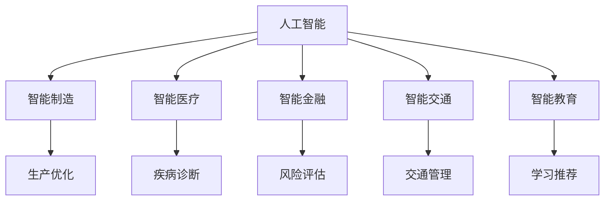

                 

# 智能产业化的发展方向与趋势

在人工智能(AI)与工业领域的深度融合下，智能产业化为各行各业带来了前所未有的革新与机遇。本文旨在深入探讨智能产业化的发展方向与趋势，期望为相关从业人员提供思路和灵感。

## 1. 背景介绍

随着AI技术的飞速发展，智能产业化的浪潮在全球范围内席卷。从制造业、医疗、金融到教育，AI技术正逐步渗透到各个垂直行业，带来生产效率的提升与业务模式的创新。智能产业化的核心目标是通过AI技术的应用，实现智能化、自动化与决策支持，从而提升经济效益与社会福祉。

智能产业化的关键在于将AI技术与具体业务场景结合，构建可落地的智能解决方案。本文将从背景介绍、核心概念与联系、核心算法原理与具体操作步骤、数学模型与详细讲解、项目实践与详细解释说明、实际应用场景与未来应用展望、工具和资源推荐、总结与发展趋势与挑战等方面进行阐述。

## 2. 核心概念与联系

### 2.1 核心概念概述

智能产业化的发展离不开几个核心概念：

- **人工智能**：通过机器学习、深度学习等技术，模拟人类智能活动，实现自主学习、决策与执行。
- **智能制造**：利用AI技术优化生产流程、质量控制与供应链管理，提升制造业的效率与灵活性。
- **智能医疗**：运用AI技术辅助疾病诊断、治疗方案推荐与医疗管理，提高医疗服务的质量和可及性。
- **智能金融**：通过AI算法进行风险评估、信用评分与市场预测，优化金融产品设计与运营。
- **智能交通**：利用AI技术优化交通管理、自动驾驶与智慧物流，提升城市交通系统的效率与安全。
- **智能教育**：借助AI技术进行个性化学习推荐、智能评估与教育管理，实现教育资源的优化配置。

这些概念之间存在紧密的联系，通过协同作用，可以共同推动智能产业化的发展。

### 2.2 核心概念原理和架构的 Mermaid 流程图



以上流程图示意了AI技术与各垂直行业结合的过程。

## 3. 核心算法原理 & 具体操作步骤

### 3.1 算法原理概述

智能产业化的核心在于通过算法实现自动化决策与过程优化。核心算法通常包括数据预处理、特征工程、模型训练与调优等步骤。

- **数据预处理**：清洗、标准化、特征选择与生成，为后续模型训练提供高质量的输入数据。
- **特征工程**：设计有意义的特征，提取数据中的有用信息，提高模型的泛化能力。
- **模型训练与调优**：选择合适的算法与超参数，在训练集上进行模型训练，并在验证集上进行调优，以获得最优的模型性能。
- **部署与监控**：将训练好的模型部署到实际应用中，并实时监控其性能与稳定性。

### 3.2 算法步骤详解

以智能制造为例，具体算法步骤如下：

1. **数据收集与预处理**：
   - 收集生产过程中的设备运行数据、产品质量数据、能耗数据等。
   - 数据清洗、去噪，处理缺失值与异常值。
   - 特征工程：提取关键性能指标、运行状态特征等。

2. **模型选择与训练**：
   - 选择合适的算法，如回归分析、时间序列预测、异常检测等。
   - 设定模型超参数，如学习率、正则化系数等。
   - 在训练集上训练模型，使用交叉验证等方法进行调优。

3. **模型评估与部署**：
   - 在验证集上评估模型性能，如准确率、召回率、F1分数等。
   - 将模型部署到生产环境中，实时监控模型性能与资源消耗。
   - 根据反馈数据，定期更新与维护模型。

### 3.3 算法优缺点

智能产业化的算法具有以下优点：

- **自动化决策**：模型可以自动分析数据，辅助决策，减少人工干预，提高效率。
- **实时响应**：通过实时数据输入与输出，模型可以动态调整其行为，应对变化。
- **精度提升**：通过算法优化，模型可以逐步提升预测与决策的准确性。

但同时，也存在一些缺点：

- **高数据需求**：需要大量高质量的数据进行模型训练，数据获取成本较高。
- **模型解释性不足**：复杂的模型难以解释其决策过程，可能影响用户的信任。
- **模型维护复杂**：模型需要定期更新与维护，以适应变化的数据分布。
- **技术门槛高**：算法开发与模型训练需要专业知识，对人员要求较高。

### 3.4 算法应用领域

智能算法在多个领域都有广泛应用，包括但不限于：

- **工业自动化**：利用传感器数据与机器学习，实现生产过程的自动化与智能化。
- **医疗诊断**：运用图像识别与自然语言处理，辅助疾病诊断与治疗方案推荐。
- **金融风控**：通过大数据分析与机器学习，进行信用评分与风险评估。
- **城市管理**：通过城市大数据与AI算法，优化交通管理与公共服务。
- **教育个性化**：利用AI技术进行学习行为分析与个性化推荐，提升教育效果。

## 4. 数学模型和公式 & 详细讲解 & 举例说明

### 4.1 数学模型构建

智能算法往往依赖于数学模型进行描述与优化。以回归模型为例，数学模型可表示为：

$$
y = \theta_0 + \theta_1 x_1 + \theta_2 x_2 + ... + \theta_n x_n + \epsilon
$$

其中，$y$ 为输出值，$x_i$ 为输入特征，$\theta_i$ 为模型参数，$\epsilon$ 为误差项。

### 4.2 公式推导过程

以线性回归模型为例，最小二乘法（Ordinary Least Squares, OLS）用于求解模型参数：

$$
\hat{\theta} = (X^T X)^{-1} X^T y
$$

其中，$X$ 为输入特征矩阵，$y$ 为输出值向量。通过求解此公式，可得到最优模型参数。

### 4.3 案例分析与讲解

以智能制造中的设备故障预测为例，模型可通过历史维修记录与运行数据进行训练，预测未来设备故障。

模型通过输入设备运行数据，如振动、温度、压力等，输出故障预测概率。在训练过程中，模型学习故障发生与运行数据之间的关联，从而实现故障预测。

## 5. 项目实践：代码实例和详细解释说明

### 5.1 开发环境搭建

智能算法的开发环境通常包含Python、TensorFlow、PyTorch等深度学习框架。以下以TensorFlow为例进行说明：

1. 安装TensorFlow：
   ```bash
   pip install tensorflow
   ```

2. 安装相关工具包：
   ```bash
   pip install numpy pandas sklearn matplotlib
   ```

3. 创建虚拟环境：
   ```bash
   python -m venv venv
   source venv/bin/activate
   ```

### 5.2 源代码详细实现

以智能制造中的设备故障预测为例，代码实现如下：

```python
import tensorflow as tf
import numpy as np
from sklearn.model_selection import train_test_split
from sklearn.metrics import mean_squared_error

# 加载数据
def load_data():
    # 加载设备运行数据
    x = np.loadtxt('device_data.csv', delimiter=',')
    # 加载设备故障数据
    y = np.loadtxt('failure_data.csv', delimiter=',')
    # 数据集划分
    x_train, x_test, y_train, y_test = train_test_split(x, y, test_size=0.2, random_state=42)
    return x_train, x_test, y_train, y_test

# 定义模型
def create_model():
    model = tf.keras.Sequential([
        tf.keras.layers.Dense(64, activation='relu', input_shape=[n_features]),
        tf.keras.layers.Dense(1)
    ])
    return model

# 训练模型
def train_model(model, x_train, y_train, x_test, y_test):
    model.compile(optimizer='adam', loss='mse')
    history = model.fit(x_train, y_train, epochs=100, batch_size=32, validation_data=(x_test, y_test))
    # 评估模型
    mse = mean_squared_error(y_test, model.predict(x_test))
    print(f"Mean Squared Error: {mse:.2f}")

# 运行代码
x_train, x_test, y_train, y_test = load_data()
model = create_model()
train_model(model, x_train, y_train, x_test, y_test)
```

### 5.3 代码解读与分析

**数据加载**：
- 使用`numpy`加载设备运行数据与故障数据。
- 使用`train_test_split`将数据集划分为训练集与测试集。

**模型定义**：
- 使用`Sequential`定义模型结构，包含一个隐藏层与一个输出层。
- 隐藏层使用`Dense`，激活函数为ReLU。
- 输出层只有一个神经元，使用线性激活函数。

**模型训练**：
- 使用`compile`设置优化器与损失函数。
- 使用`fit`方法进行模型训练，设置训练轮数与批次大小。
- 使用`mean_squared_error`评估模型性能。

**结果展示**：
- 打印模型在测试集上的均方误差（Mean Squared Error），评估模型预测能力。

## 6. 实际应用场景

### 6.1 智能制造

在智能制造中，智能算法被广泛应用于设备状态监测、故障预测与预防性维护。通过实时监控设备运行数据，模型可以预测设备故障，及时进行维护，避免设备停机时间。

### 6.2 智能医疗

智能算法在智能医疗中的应用包括疾病预测、诊断辅助与个性化治疗。模型通过学习历史医疗数据，预测疾病风险，辅助医生进行诊断，并提供个性化治疗方案。

### 6.3 智能金融

智能算法在智能金融中的应用包括信用评分、风险评估与市场预测。模型通过分析用户行为与市场数据，进行信用评分与风险评估，优化金融产品设计与运营。

### 6.4 未来应用展望

未来，智能算法将在更多领域发挥作用，包括但不限于：

- **智能农业**：通过传感器数据与机器学习，优化农业生产与管理。
- **智能零售**：利用AI技术进行用户行为分析与商品推荐，提升零售体验与效率。
- **智能安防**：通过视频分析与图像识别，提升安防系统的识别与响应能力。
- **智能物流**：利用AI算法优化运输路线与货物调度，提升物流效率与准确性。

## 7. 工具和资源推荐

### 7.1 学习资源推荐

- **《Python深度学习》**：适合初学者入门的经典书籍，涵盖深度学习的基本概念与实践。
- **《TensorFlow实战》**：详细介绍TensorFlow的使用方法与案例分析。
- **《机器学习实战》**：通过Python实现各种机器学习算法的实战指南。
- **Coursera、Udacity**：提供大量机器学习与深度学习的在线课程，适合自学与进阶。

### 7.2 开发工具推荐

- **Jupyter Notebook**：免费开源的Python环境，支持代码编辑与运行，适合数据探索与算法实验。
- **PyCharm**：商业化的Python IDE，支持调试、代码高亮与自动补全等功能。
- **Google Colab**：谷歌提供的免费Jupyter Notebook环境，支持GPU与TPU资源，适合高性能计算。

### 7.3 相关论文推荐

- **"Deep Learning" by Ian Goodfellow, Yoshua Bengio, and Aaron Courville**：全面介绍深度学习的基本概念与算法。
- **"Neural Networks and Deep Learning" by Michael Nielsen**：通过互动式Web教程，详细讲解深度学习原理与实现。
- **"Learning from Data" by Pedro Domingos**：探讨机器学习的理论基础与应用实践。

## 8. 总结：未来发展趋势与挑战

### 8.1 研究成果总结

智能产业化的研究近年来取得了显著进展，涵盖了数据预处理、特征工程、模型训练与调优等多个方面。技术进步使得智能算法在多个垂直行业中的应用变得更加广泛与高效。

### 8.2 未来发展趋势

未来，智能产业化的发展趋势将主要体现在以下几个方面：

1. **多模态融合**：将文本、图像、视频等多种模态数据进行融合，提升智能算法的感知与理解能力。
2. **自适应学习**：通过强化学习与在线学习，使模型能够动态调整自身行为，适应变化的环境。
3. **联邦学习**：在数据分散的情况下，通过联邦学习技术，实现模型参数的分布式更新与优化。
4. **边缘计算**：将智能算法部署到边缘设备上，实现实时数据处理与决策。
5. **隐私保护**：通过差分隐私、联邦学习等技术，保护用户隐私与数据安全。

### 8.3 面临的挑战

智能产业化面临的挑战主要包括以下几个方面：

1. **数据获取成本**：高质量的数据获取成本较高，数据隐私保护与共享难度大。
2. **模型可解释性**：复杂模型难以解释其决策过程，影响用户信任与接受度。
3. **技术复杂性**：算法开发与模型训练需要专业知识，对人员要求较高。
4. **模型鲁棒性**：模型面对新的数据分布与变化的环境，泛化能力不足，容易发生过拟合与灾难性遗忘。
5. **伦理与安全**：智能算法的应用可能带来伦理与安全问题，需要多方协同管理。

### 8.4 研究展望

未来的研究需要在以下几个方面取得突破：

1. **高效数据获取与利用**：利用自动化数据采集与标注工具，提高数据获取效率，降低成本。
2. **增强模型可解释性**：引入可视化工具与解释性技术，提高模型的透明性与用户理解。
3. **多模态融合算法**：研究多种模态数据的融合方法，提升智能算法的感知与理解能力。
4. **自适应与联邦学习**：研究自适应与联邦学习算法，提高模型的动态性与分布式学习能力。
5. **隐私保护技术**：研究差分隐私、联邦学习等技术，保障数据安全与隐私保护。

## 9. 附录：常见问题与解答

**Q1: 智能算法在实际应用中应注意哪些问题？**

A: 智能算法在实际应用中应注意以下几个问题：
1. **数据质量**：数据质量直接影响模型性能，应进行数据清洗与预处理。
2. **模型选择**：根据具体问题选择合适的算法与模型，避免过度拟合或欠拟合。
3. **模型调优**：根据模型表现进行调优，调整超参数与模型结构。
4. **模型部署**：将训练好的模型部署到实际应用中，并实时监控其性能与稳定性。
5. **数据安全**：保护用户数据隐私与模型安全，避免数据泄露与模型滥用。

**Q2: 智能算法如何应用于智能制造？**

A: 智能算法在智能制造中的应用主要体现在以下几个方面：
1. **设备状态监测**：利用传感器数据与机器学习，实现设备运行状态监测与故障预测。
2. **生产过程优化**：通过数据驱动决策，优化生产流程与资源配置。
3. **供应链管理**：通过智能算法优化供应链计划与库存管理。
4. **质量控制**：利用智能算法进行产品检测与质量控制，提升产品质量。

**Q3: 智能算法在医疗领域有哪些应用？**

A: 智能算法在医疗领域的应用主要包括以下几个方面：
1. **疾病预测**：通过分析患者数据，预测疾病风险。
2. **诊断辅助**：利用图像识别与自然语言处理，辅助医生进行疾病诊断。
3. **治疗方案推荐**：通过学习历史治疗数据，推荐个性化治疗方案。
4. **医疗管理**：优化医疗资源配置与患者管理。

**Q4: 智能算法在金融领域有哪些应用？**

A: 智能算法在金融领域的应用主要包括以下几个方面：
1. **信用评分**：通过分析用户行为与数据，进行信用评分与风险评估。
2. **市场预测**：利用机器学习预测股市、外汇等市场走势。
3. **智能投顾**：通过智能算法提供投资建议与资产管理服务。
4. **反欺诈检测**：利用异常检测算法识别欺诈行为。

**Q5: 智能算法的开发与实现过程中，如何保证模型的稳定性与鲁棒性？**

A: 为了保证智能算法的稳定性与鲁棒性，应采取以下几个措施：
1. **数据清洗与预处理**：清洗与处理数据，避免噪声与异常值对模型性能的影响。
2. **特征工程**：设计有意义的特征，提取数据中的有用信息。
3. **模型调优**：根据模型表现进行调优，调整超参数与模型结构。
4. **模型验证与测试**：使用交叉验证等方法评估模型性能，避免过拟合。
5. **在线学习与适应性学习**：利用在线学习与适应性算法，提高模型的动态性与泛化能力。

作者：禅与计算机程序设计艺术 / Zen and the Art of Computer Programming

