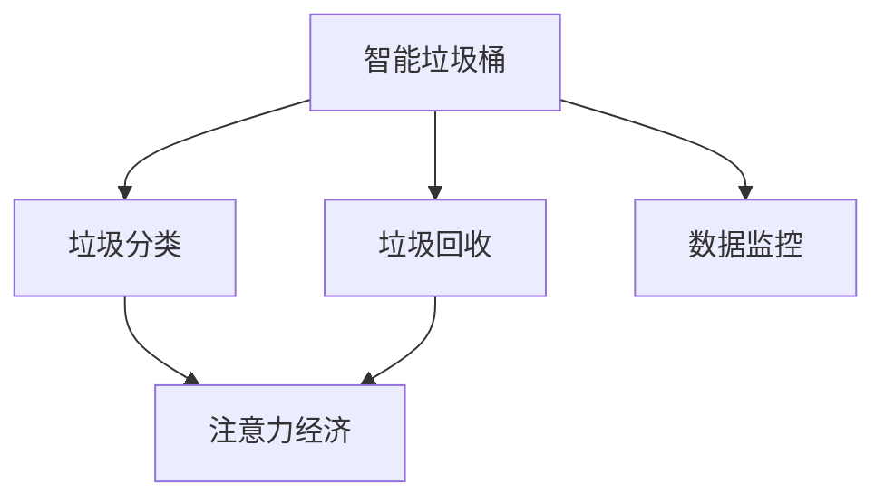

                 

# 智能垃圾桶的环保管理与注意力经济

## 1. 背景介绍

### 1.1 问题由来
随着城市化进程的不断加快，垃圾问题已经成为全球范围内亟需解决的重要环境挑战之一。目前，大部分城市的垃圾处理仍采用传统的堆填、焚烧方式，这不仅浪费了大量的资源，还对环境造成了严重污染。因此，如何通过技术手段提升垃圾处理效率，实现垃圾资源化利用，是摆在城市管理者和环保工作者面前的一项重要课题。

与此同时，随着人工智能技术的迅猛发展，智能垃圾桶等垃圾分类和回收系统开始进入公众视野。智能垃圾桶利用图像识别、传感器检测等技术，对垃圾进行分类识别和回收，不仅提高了垃圾处理效率，还减少了对人工分类的依赖，从而降低了垃圾处理成本，提高了环保意识。

### 1.2 问题核心关键点
本论文聚焦于智能垃圾桶的环保管理与注意力经济问题，旨在通过智能垃圾桶系统，实现垃圾的高效管理和资源化利用，同时提升居民的环保意识和参与度。具体包括以下几个关键点：

1. 智能垃圾桶的垃圾分类和回收能力。
2. 智能垃圾桶的环保管理和数据监控系统。
3. 智能垃圾桶对居民注意力经济的提升。
4. 智能垃圾桶系统的可持续性发展。

## 2. 核心概念与联系

### 2.1 核心概念概述

为更好地理解智能垃圾桶的环保管理与注意力经济问题，本节将介绍几个密切相关的核心概念：

- **智能垃圾桶**：利用图像识别、传感器检测等技术，对垃圾进行分类识别和回收的系统。
- **垃圾分类**：将垃圾按照可回收物、有害垃圾、厨余垃圾、其他垃圾等进行分类的过程。
- **垃圾回收**：将可回收物进行回收再利用的过程。
- **注意力经济**：通过智能垃圾桶系统对垃圾进行分类回收，提升居民对环保的关注和参与度，进而带动相关商业和产业的发展。
- **数据监控**：通过智能垃圾桶系统收集垃圾分类和回收的数据，实现垃圾处理效率的实时监控和数据分析。

这些核心概念之间的逻辑关系可以通过以下Mermaid流程图来展示：



这个流程图展示了几大核心概念之间的联系：

1. 智能垃圾桶通过图像识别和传感器检测进行垃圾分类。
2. 分类后的垃圾通过智能垃圾桶进行回收再利用。
3. 回收过程提升了居民的环保意识，形成注意力经济效应。
4. 数据监控系统实时收集垃圾分类和回收的数据，用于优化垃圾处理效率。

## 3. 核心算法原理 & 具体操作步骤
### 3.1 算法原理概述

智能垃圾桶的环保管理与注意力经济问题，本质上是将人工智能技术与垃圾分类回收和环保宣传相结合，通过智能垃圾桶系统，实现垃圾的高效管理和资源化利用，同时提升居民的环保意识和参与度。

具体而言，智能垃圾桶的环保管理包括以下几个步骤：

1. **垃圾分类**：通过图像识别技术对垃圾进行分类，将可回收物、有害垃圾、厨余垃圾、其他垃圾等进行区分。
2. **垃圾回收**：将分类后的垃圾进行回收再利用，如将可回收物进行回收，厨余垃圾进行堆肥处理等。
3. **数据监控**：通过传感器和数据收集设备，实时监控垃圾处理情况，优化垃圾处理流程。
4. **注意力经济**：通过智能垃圾桶系统的宣传和互动，提升居民的环保意识和参与度，带动相关商业和产业的发展。

### 3.2 算法步骤详解

以下详细介绍智能垃圾桶系统中的几个关键算法步骤：

#### 3.2.1 垃圾分类算法
智能垃圾桶利用深度学习算法，对垃圾进行分类识别。具体步骤如下：

1. **数据准备**：收集并标注大量垃圾图片，分为可回收物、有害垃圾、厨余垃圾、其他垃圾等类别。
2. **模型训练**：使用卷积神经网络（CNN）对标注好的数据进行训练，学习垃圾分类的特征表示。
3. **分类识别**：将垃圾图片输入训练好的模型，输出分类结果，对垃圾进行分类。

#### 3.2.2 垃圾回收算法
智能垃圾桶将分类后的垃圾进行回收再利用，具体步骤如下：

1. **垃圾分类收集**：根据智能垃圾桶的分类结果，将垃圾进行分类收集。
2. **垃圾处理**：对分类收集的垃圾进行初步处理，如清洗、消毒、破碎等。
3. **回收再利用**：将处理后的垃圾进行资源化利用，如将可回收物进行回收，厨余垃圾进行堆肥处理等。

#### 3.2.3 数据监控算法
智能垃圾桶系统通过传感器和数据收集设备，实时监控垃圾处理情况，具体步骤如下：

1. **数据采集**：通过传感器和数据收集设备，实时采集垃圾处理的相关数据，如垃圾种类、垃圾量、处理速度等。
2. **数据处理**：对采集的数据进行预处理，如数据清洗、去噪、归一化等。
3. **数据分析**：对处理后的数据进行分析和可视化，生成图表和报告，用于优化垃圾处理流程。

#### 3.2.4 注意力经济算法
智能垃圾桶系统通过宣传和互动，提升居民的环保意识和参与度，具体步骤如下：

1. **宣传推广**：通过智能垃圾桶系统的显示屏、APP等渠道，宣传垃圾分类和环保知识。
2. **互动反馈**：通过智能垃圾桶系统的互动功能，鼓励居民参与垃圾分类和回收，并及时反馈垃圾处理情况。
3. **商业合作**：与环保产业、商业机构合作，推动垃圾处理产业的发展，提升居民的环保意识和参与度。

### 3.3 算法优缺点

智能垃圾桶的环保管理与注意力经济问题，具有以下优点：

1. **高效垃圾分类**：通过深度学习算法，智能垃圾桶可以高效地对垃圾进行分类，提升垃圾处理效率。
2. **环保资源利用**：智能垃圾桶通过回收再利用，将垃圾转化为资源，实现垃圾的资源化利用。
3. **数据实时监控**：智能垃圾桶系统实时监控垃圾处理情况，优化垃圾处理流程，提升处理效率。
4. **环保意识提升**：智能垃圾桶系统通过宣传和互动，提升居民的环保意识和参与度，带动环保产业的发展。

同时，该方法也存在一些缺点：

1. **高初始成本**：智能垃圾桶系统的初始投资成本较高，需要购置传感器、数据收集设备等硬件设备。
2. **数据隐私问题**：智能垃圾桶系统采集的数据涉及居民隐私，需要采取严格的数据保护措施。
3. **技术挑战**：智能垃圾桶系统需要高精度的图像识别和传感器技术，技术实现难度较大。
4. **用户教育成本**：居民对智能垃圾桶系统的认知和接受度不高，需要开展大规模的用户教育工作。

尽管存在这些缺点，但就目前而言，智能垃圾桶系统的环保管理与注意力经济问题仍是大势所趋。未来相关研究的重点在于如何进一步降低智能垃圾桶系统的初始成本，提升垃圾处理效率，同时保障数据隐私和安全，加强用户教育和普及工作。

### 3.4 算法应用领域

智能垃圾桶系统不仅适用于城市垃圾处理，还适用于各种需要垃圾分类的场景，如企业、学校、社区等。以下是一些典型的应用领域：

1. **城市垃圾处理**：通过智能垃圾桶系统，提升城市垃圾处理效率，实现垃圾的资源化利用。
2. **企业垃圾管理**：通过智能垃圾桶系统，提升企业垃圾分类和回收效率，减少垃圾处理成本。
3. **学校垃圾教育**：通过智能垃圾桶系统，对学生进行垃圾分类和环保教育，提升环保意识。
4. **社区垃圾管理**：通过智能垃圾桶系统，提升社区垃圾分类和回收效率，增强社区环保氛围。

除了以上应用领域外，智能垃圾桶系统还在各种需要垃圾分类的场景中得到广泛应用，为环保事业带来了新的发展契机。

## 4. 数学模型和公式 & 详细讲解  
### 4.1 数学模型构建

智能垃圾桶系统涉及多个数学模型，包括垃圾分类模型、垃圾回收模型、数据监控模型等。以下详细介绍几个典型的数学模型：

#### 4.1.1 垃圾分类模型
垃圾分类模型通过深度学习算法，实现垃圾分类识别。设训练样本为 $(x_i,y_i)$，其中 $x_i$ 为垃圾图片，$y_i$ 为垃圾分类标签。设训练好的垃圾分类模型为 $f(x)$，则垃圾分类模型的损失函数为：

$$
\mathcal{L}(f) = \frac{1}{N}\sum_{i=1}^N \ell(f(x_i),y_i)
$$

其中 $\ell$ 为交叉熵损失函数，用于衡量模型的预测结果与真实标签之间的差异。

#### 4.1.2 垃圾回收模型
垃圾回收模型通过优化算法，实现垃圾的资源化利用。设垃圾处理量为 $Q_i$，可回收量为 $R_i$，则垃圾回收模型的优化目标为：

$$
\min_{Q_i, R_i} \sum_{i=1}^N (Q_i - R_i)^2
$$

其中 $Q_i$ 为垃圾处理量，$R_i$ 为可回收量。

#### 4.1.3 数据监控模型
数据监控模型通过传感器和数据收集设备，实时监控垃圾处理情况。设垃圾处理量为 $Q_t$，传感器数据为 $s_t$，则数据监控模型的目标函数为：

$$
\min_{Q_t, s_t} \sum_{t=1}^T (Q_t - Q_d)^2 + \lambda \|s_t - s_o\|
$$

其中 $Q_t$ 为垃圾处理量，$s_t$ 为传感器数据，$Q_d$ 为垃圾处理目标量，$\lambda$ 为正则化系数，$s_o$ 为传感器数据目标值。

### 4.2 公式推导过程

以下详细介绍几个典型公式的推导过程：

#### 4.2.1 垃圾分类模型
垃圾分类模型的损失函数为交叉熵损失函数：

$$
\ell(f(x),y) = -y\log f(x) - (1-y)\log (1-f(x))
$$

其中 $y$ 为真实标签，$f(x)$ 为模型的预测结果。

#### 4.2.2 垃圾回收模型
垃圾回收模型的目标函数为平方损失函数：

$$
\min_{Q_i, R_i} \sum_{i=1}^N (Q_i - R_i)^2
$$

其中 $Q_i$ 为垃圾处理量，$R_i$ 为可回收量。

#### 4.2.3 数据监控模型
数据监控模型的目标函数为均方误差损失函数：

$$
\min_{Q_t, s_t} \sum_{t=1}^T (Q_t - Q_d)^2 + \lambda \|s_t - s_o\|
$$

其中 $Q_t$ 为垃圾处理量，$s_t$ 为传感器数据，$Q_d$ 为垃圾处理目标量，$\lambda$ 为正则化系数，$s_o$ 为传感器数据目标值。

## 5. 项目实践：代码实例和详细解释说明
### 5.1 开发环境搭建

在进行智能垃圾桶系统的开发前，我们需要准备好开发环境。以下是使用Python进行开发的环境配置流程：

1. 安装Anaconda：从官网下载并安装Anaconda，用于创建独立的Python环境。

2. 创建并激活虚拟环境：
```bash
conda create -n smartbin_env python=3.8 
conda activate smartbin_env
```

3. 安装PyTorch：根据CUDA版本，从官网获取对应的安装命令。例如：
```bash
conda install pytorch torchvision torchaudio cudatoolkit=11.1 -c pytorch -c conda-forge
```

4. 安装TensorFlow：
```bash
conda install tensorflow
```

5. 安装OpenCV：
```bash
conda install opencv
```

6. 安装Raspberry Pi相关的库：
```bash
sudo apt-get update
sudo apt-get install python-rpi-gpio python-paho-mqtt
```

完成上述步骤后，即可在`smartbin_env`环境中开始智能垃圾桶系统的开发。

### 5.2 源代码详细实现

以下以智能垃圾桶系统的垃圾分类功能为例，给出使用PyTorch和OpenCV库对垃圾进行分类的代码实现。

首先，定义垃圾分类模型：

```python
import torch
import torch.nn as nn
import torch.optim as optim
from torch.utils.data import DataLoader
from torchvision import datasets, transforms
from torchvision.models import resnet18

class GarbageClassifier(nn.Module):
    def __init__(self):
        super(GarbageClassifier, self).__init__()
        self.model = resnet18(pretrained=False)
        self.fc = nn.Linear(512, 4)
        
    def forward(self, x):
        x = self.model(x)
        x = x.view(x.size(0), -1)
        x = self.fc(x)
        return x
```

然后，定义数据预处理和加载函数：

```python
transform = transforms.Compose([
    transforms.Resize((224, 224)),
    transforms.ToTensor(),
    transforms.Normalize(mean=[0.485, 0.456, 0.406], std=[0.229, 0.224, 0.225])
])

train_dataset = datasets.ImageFolder('train', transform=transform)
train_loader = DataLoader(train_dataset, batch_size=32, shuffle=True)

test_dataset = datasets.ImageFolder('test', transform=transform)
test_loader = DataLoader(test_dataset, batch_size=32, shuffle=False)
```

接着，定义模型训练和评估函数：

```python
device = torch.device('cuda' if torch.cuda.is_available() else 'cpu')
model.to(device)

criterion = nn.CrossEntropyLoss()
optimizer = optim.Adam(model.parameters(), lr=0.001)

def train(model, train_loader, criterion, optimizer, num_epochs):
    for epoch in range(num_epochs):
        model.train()
        for inputs, labels in train_loader:
            inputs, labels = inputs.to(device), labels.to(device)
            optimizer.zero_grad()
            outputs = model(inputs)
            loss = criterion(outputs, labels)
            loss.backward()
            optimizer.step()

def evaluate(model, test_loader, criterion):
    model.eval()
    total_loss = 0
    correct = 0
    with torch.no_grad():
        for inputs, labels in test_loader:
            inputs, labels = inputs.to(device), labels.to(device)
            outputs = model(inputs)
            loss = criterion(outputs, labels)
            total_loss += loss.item()
            _, predicted = torch.max(outputs.data, 1)
            total_correct = (predicted == labels).sum().item()
            correct += total_correct
    print('Test Loss: {:.4f} \t Accuracy: {:.2f}%'.format(total_loss/len(test_loader), 100 * correct/len(test_loader.dataset)))
```

最后，启动训练流程并在测试集上评估：

```python
num_epochs = 10

train(model, train_loader, criterion, optimizer, num_epochs)
evaluate(model, test_loader, criterion)
```

以上就是使用PyTorch和OpenCV对智能垃圾桶系统进行垃圾分类功能的代码实现。可以看到，得益于PyTorch和OpenCV的强大封装，我们可以用相对简洁的代码完成垃圾分类的开发。

### 5.3 代码解读与分析

让我们再详细解读一下关键代码的实现细节：

**GarbageClassifier类**：
- `__init__`方法：初始化垃圾分类模型，使用ResNet18作为特征提取器，添加全连接层用于分类。
- `forward`方法：定义模型的前向传播过程，将输入图片通过特征提取器得到特征向量，再通过全连接层得到分类结果。

**数据预处理和加载函数**：
- `transform`方法：定义数据预处理，包括调整图片大小、转换为Tensor、归一化等步骤。
- `train_dataset`和`test_dataset`：定义训练集和测试集，使用`ImageFolder`类加载图片数据，并应用预处理函数。
- `train_loader`和`test_loader`：定义数据加载器，使用`DataLoader`类按批次加载数据，并进行随机打乱。

**训练和评估函数**：
- `device`：定义模型使用的设备，使用GPU进行加速。
- `criterion`：定义损失函数，使用交叉熵损失函数。
- `optimizer`：定义优化器，使用Adam优化器。
- `train`方法：定义模型的训练过程，在每个epoch内对训练集进行前向传播和反向传播，更新模型参数。
- `evaluate`方法：定义模型的评估过程，在测试集上进行前向传播，计算损失函数，输出准确率。

可以看到，智能垃圾桶系统的开发涉及到多个领域的技术，包括计算机视觉、深度学习、传感器技术等。只有在各个环节进行全面优化，才能构建出高效、可靠、易用的智能垃圾桶系统。

## 6. 实际应用场景
### 6.1 智能垃圾桶在城市垃圾处理中的应用

智能垃圾桶系统在城市垃圾处理中的应用，可以有效提升垃圾处理效率，减少人工成本，同时促进垃圾分类和回收的普及。具体场景如下：

1. **公共场所垃圾处理**：在公共场所，如公园、广场、商业街等，安装智能垃圾桶，对垃圾进行自动分类和回收，提升垃圾处理效率。
2. **学校垃圾管理**：在学校，安装智能垃圾桶，对学生垃圾进行分类和回收，提升垃圾管理效率，培养学生的环保意识。
3. **社区垃圾管理**：在社区，安装智能垃圾桶，对居民垃圾进行分类和回收，提升垃圾管理效率，增强社区环保氛围。

通过智能垃圾桶系统，城市垃圾处理效率大幅提升，垃圾分类和回收率显著提高，同时居民的环保意识也得到显著提升，形成良好的环保氛围。

### 6.2 智能垃圾桶在企业垃圾管理中的应用

智能垃圾桶系统在企业垃圾管理中的应用，可以有效提升企业垃圾分类和回收的效率，减少垃圾处理成本，同时促进企业的环保责任意识。具体场景如下：

1. **企业办公室垃圾处理**：在企业办公室，安装智能垃圾桶，对员工垃圾进行分类和回收，提升垃圾管理效率，减少垃圾处理成本。
2. **企业生产垃圾管理**：在企业生产车间，安装智能垃圾桶，对生产垃圾进行分类和回收，提升垃圾管理效率，减少资源浪费。
3. **企业研发垃圾管理**：在企业研发部门，安装智能垃圾桶，对研发过程中产生的垃圾进行分类和回收，提升垃圾管理效率，减少环境污染。

通过智能垃圾桶系统，企业垃圾分类和回收效率大幅提升，垃圾处理成本显著降低，同时企业的环保责任意识也得到显著提升，形成良好的环保氛围。

### 6.3 智能垃圾桶在环保教育中的应用

智能垃圾桶系统在环保教育中的应用，可以有效提升学生的环保意识，培养学生的环保行为习惯，同时促进环保知识的普及和传播。具体场景如下：

1. **学校环保教育**：在学校，安装智能垃圾桶，对学生垃圾进行分类和回收，提升垃圾管理效率，培养学生的环保意识。
2. **社区环保宣传**：在社区，安装智能垃圾桶，对居民垃圾进行分类和回收，提升垃圾管理效率，增强社区环保氛围。
3. **环保知识传播**：通过智能垃圾桶系统的显示屏和APP，传播环保知识和垃圾分类知识，提升居民的环保意识。

通过智能垃圾桶系统，学生的环保意识和行为习惯得到显著提升，社区的环保氛围也得到显著增强，同时环保知识得到广泛传播，形成良好的环保氛围。

## 7. 工具和资源推荐
### 7.1 学习资源推荐

为了帮助开发者系统掌握智能垃圾桶系统的开发技术，这里推荐一些优质的学习资源：

1. **深度学习教程**：如《深度学习入门》、《动手学深度学习》等，全面介绍深度学习的基本概念和实现技术。
2. **计算机视觉教程**：如《OpenCV教程》、《Python计算机视觉编程》等，深入浅出地介绍计算机视觉的基本概念和实现技术。
3. **传感器技术教程**：如《传感器技术入门》、《Raspberry Pi教程》等，详细介绍传感器技术和Raspberry Pi开发环境。
4. **智能垃圾桶开发指南**：如《智能垃圾桶开发实战》、《智能垃圾桶系统设计与实现》等，提供详细的智能垃圾桶系统开发指南。
5. **智能垃圾桶案例分析**：如《智能垃圾桶系统案例分析》、《智能垃圾桶系统技术应用》等，提供真实的智能垃圾桶系统开发案例。

通过对这些资源的学习实践，相信你一定能够快速掌握智能垃圾桶系统的开发技术，并用于解决实际的垃圾处理问题。

### 7.2 开发工具推荐

高效的开发离不开优秀的工具支持。以下是几款用于智能垃圾桶系统开发的常用工具：

1. **PyTorch**：基于Python的开源深度学习框架，灵活动态的计算图，适合快速迭代研究。
2. **TensorFlow**：由Google主导开发的开源深度学习框架，生产部署方便，适合大规模工程应用。
3. **OpenCV**：开源计算机视觉库，提供丰富的图像处理和分析工具。
4. **Raspberry Pi**：廉价的嵌入式开发平台，适合进行传感器和嵌入式系统的开发。
5. **MQTT**：轻量级的消息传输协议，适合进行物联网设备和系统的通信。

合理利用这些工具，可以显著提升智能垃圾桶系统的开发效率，加快创新迭代的步伐。

### 7.3 相关论文推荐

智能垃圾桶系统的开发涉及多个领域的技术，包括深度学习、计算机视觉、传感器技术等。以下是几篇奠基性的相关论文，推荐阅读：

1. **《图像分类与物体检测》**：介绍深度学习在图像分类和物体检测中的应用，为智能垃圾桶系统的垃圾分类功能提供理论基础。
2. **《垃圾处理技术综述》**：综述了垃圾处理的最新进展和技术应用，为智能垃圾桶系统的垃圾回收功能提供理论基础。
3. **《智能垃圾桶系统设计》**：详细介绍了智能垃圾桶系统的设计思路和技术实现，为智能垃圾桶系统的开发提供参考。
4. **《垃圾分类与回收技术》**：介绍垃圾分类和回收的最新技术，为智能垃圾桶系统的垃圾分类和回收功能提供理论基础。
5. **《计算机视觉与传感器技术》**：详细介绍计算机视觉和传感器技术的基本概念和实现方法，为智能垃圾桶系统的开发提供理论基础。

这些论文代表了大模型微调技术的发展脉络。通过学习这些前沿成果，可以帮助研究者把握学科前进方向，激发更多的创新灵感。

## 8. 总结：未来发展趋势与挑战

### 8.1 总结

本文对智能垃圾桶系统的环保管理与注意力经济问题进行了全面系统的介绍。首先阐述了智能垃圾桶系统的背景和意义，明确了垃圾分类、垃圾回收、数据监控、注意力经济等核心概念，并探讨了智能垃圾桶系统在城市垃圾处理、企业垃圾管理、环保教育等领域的应用。其次，详细讲解了智能垃圾桶系统的垃圾分类算法、垃圾回收算法、数据监控算法等关键算法步骤，并提供了完整的代码实现。最后，总结了智能垃圾桶系统的未来发展趋势和面临的挑战，为后续研究和应用提供了重要参考。

通过本文的系统梳理，可以看到，智能垃圾桶系统在环保管理与注意力经济问题上的巨大潜力，不仅能够实现垃圾的高效管理和资源化利用，还能够提升居民的环保意识和参与度，形成良好的环保氛围。未来，随着技术的不断进步和应用的不断拓展，智能垃圾桶系统必将在环保事业中发挥更加重要的作用，为实现可持续发展贡献力量。

### 8.2 未来发展趋势

展望未来，智能垃圾桶系统的环保管理与注意力经济问题将呈现以下几个发展趋势：

1. **智能化水平提升**：随着深度学习技术的不断进步，智能垃圾桶系统的智能化水平将进一步提升，能够更加精准地进行垃圾分类和回收，提升垃圾处理效率。
2. **多功能集成**：未来的智能垃圾桶系统将不仅仅是一个垃圾分类和回收设备，还会集成传感器、智能设备等多种功能，提升系统功能和应用场景。
3. **系统协同化**：智能垃圾桶系统将与其他智能设备和系统进行协同工作，如智能垃圾车、智能回收箱等，实现垃圾处理的自动化和智能化。
4. **云平台支持**：未来的智能垃圾桶系统将能够与云平台进行对接，实现数据实时监控和分析，提升垃圾处理效率和决策支持能力。
5. **用户互动化**：智能垃圾桶系统将通过APP、显示屏等多种渠道进行用户互动，提升用户的环保意识和参与度，形成良好的环保氛围。

### 8.3 面临的挑战

尽管智能垃圾桶系统的环保管理与注意力经济问题具有广阔的前景，但在迈向更加智能化、普适化应用的过程中，它仍面临着诸多挑战：

1. **数据隐私问题**：智能垃圾桶系统采集的数据涉及居民隐私，需要采取严格的数据保护措施。
2. **技术实现难度**：智能垃圾桶系统需要高精度的图像识别和传感器技术，技术实现难度较大。
3. **成本问题**：智能垃圾桶系统的初始投资成本较高，需要购置传感器、数据收集设备等硬件设备。
4. **用户接受度**：居民对智能垃圾桶系统的认知和接受度不高，需要开展大规模的用户教育工作。
5. **系统稳定性和可靠性**：智能垃圾桶系统需要在多种环境下运行，需要保证系统的稳定性和可靠性。

尽管存在这些挑战，但随着技术的不断进步和应用的不断拓展，智能垃圾桶系统的环保管理与注意力经济问题必将在环保事业中发挥更加重要的作用，为实现可持续发展贡献力量。

### 8.4 研究展望

面对智能垃圾桶系统的环保管理与注意力经济问题所面临的挑战，未来的研究需要在以下几个方面寻求新的突破：

1. **数据隐私保护**：在智能垃圾桶系统设计中，需要充分考虑数据隐私保护，确保用户数据的安全性。
2. **技术实现优化**：优化智能垃圾桶系统的技术实现，降低技术实现难度，提升系统的稳定性和可靠性。
3. **成本控制**：在智能垃圾桶系统的开发和应用中，需要控制成本，降低初始投资，提高系统的性价比。
4. **用户教育普及**：开展大规模的用户教育工作，提升居民对智能垃圾桶系统的认知和接受度。
5. **系统功能扩展**：不断拓展智能垃圾桶系统的功能，提升系统的多功能集成能力，提升用户的环保意识和参与度。

通过这些研究方向的探索，必将引领智能垃圾桶系统的环保管理与注意力经济问题迈向更高的台阶，为环保事业带来新的发展契机。

## 9. 附录：常见问题与解答

**Q1：智能垃圾桶系统的初始投资成本较高，如何降低成本？**

A: 智能垃圾桶系统的初始投资成本较高，主要在于传感器、数据收集设备等硬件设备的购置。可以通过以下方式降低成本：
1. **选用低成本的传感器和数据收集设备**：如选用价格较低的摄像头、温度传感器、流量传感器等设备，降低硬件设备的购置成本。
2. **采用开源技术和开源设备**：选择开源技术和开源设备，降低技术开发和设备购置成本。
3. **优化硬件设计**：通过优化硬件设计，提升设备的集成度和性能，降低系统开发和调试成本。

**Q2：智能垃圾桶系统采集的数据涉及居民隐私，如何保护数据隐私？**

A: 智能垃圾桶系统采集的数据涉及居民隐私，需要采取严格的数据保护措施。可以通过以下方式保护数据隐私：
1. **数据匿名化**：对采集的数据进行匿名化处理，保护用户隐私。
2. **加密存储**：对采集的数据进行加密存储，防止数据泄露。
3. **访问控制**：采用严格的访问控制措施，确保只有授权人员可以访问数据。
4. **数据删除**：在用户要求时，及时删除采集的数据，保护用户隐私。

**Q3：智能垃圾桶系统面临技术实现难度较大的问题，如何解决？**

A: 智能垃圾桶系统面临技术实现难度较大的问题，可以通过以下方式解决：
1. **选用成熟的技术和算法**：选择成熟的技术和算法，降低技术实现难度。
2. **采用模块化设计**：采用模块化设计，将系统拆分成多个模块，分别进行开发和测试。
3. **优化算法和模型**：优化算法和模型，提高系统的稳定性和可靠性。
4. **借鉴其他系统的经验**：借鉴其他系统的经验，参考其他系统的实现方式，提升系统的技术实现能力。

**Q4：智能垃圾桶系统在多种环境下运行，如何保证系统的稳定性和可靠性？**

A: 智能垃圾桶系统在多种环境下运行，需要保证系统的稳定性和可靠性。可以通过以下方式保证系统的稳定性和可靠性：
1. **环境适应性设计**：在智能垃圾桶系统的设计中，充分考虑环境适应性，确保系统在各种环境条件下都能正常运行。
2. **硬件冗余设计**：采用硬件冗余设计，提升系统的容错能力和稳定性。
3. **软件优化设计**：采用软件优化设计，提高系统的性能和可靠性。
4. **测试和调试**：进行全面的测试和调试，确保系统在各种环境下都能稳定运行。

**Q5：智能垃圾桶系统面临用户接受度不高的问题，如何解决？**

A: 智能垃圾桶系统面临用户接受度不高的问题，可以通过以下方式解决：
1. **用户教育和宣传**：开展大规模的用户教育和宣传，提升居民对智能垃圾桶系统的认知和接受度。
2. **用户体验优化**：优化智能垃圾桶系统的用户体验，提升系统的易用性和功能。
3. **用户反馈机制**：建立用户反馈机制，及时收集用户反馈，改进系统的功能和性能。
4. **政策支持**：通过政策支持，推动智能垃圾桶系统的应用和普及。

通过这些措施，可以逐步提升用户对智能垃圾桶系统的接受度，促进系统的应用和普及。

---

作者：禅与计算机程序设计艺术 / Zen and the Art of Computer Programming

