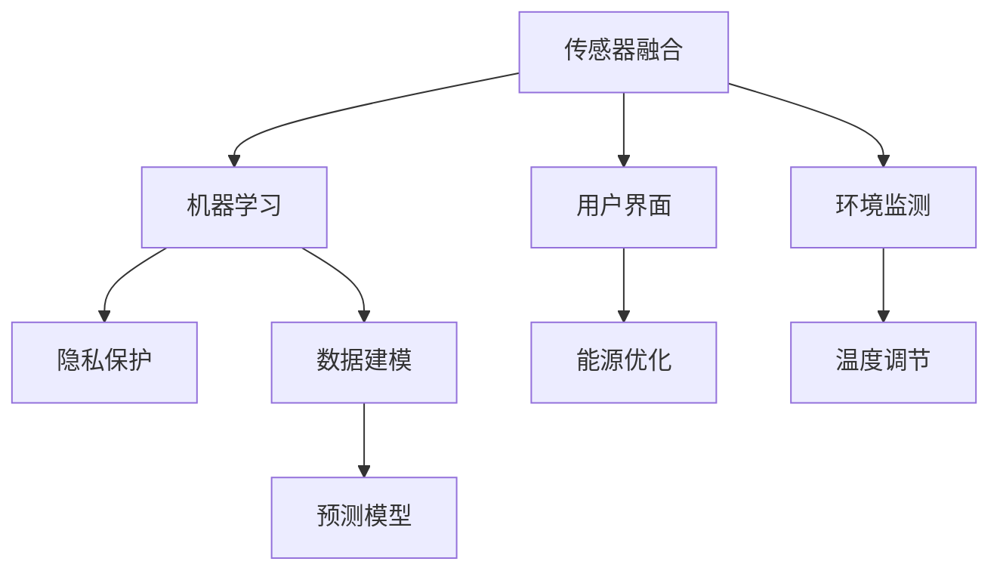

                 

# 智能家居案例分析：智能恒温器的设计和实现

> 关键词：智能恒温器,物联网(IoT),家庭自动化,传感器融合,机器学习,用户界面(UI),用户隐私

## 1. 背景介绍

### 1.1 问题由来
随着科技的进步和人们生活水平的提高，智能家居系统已经逐渐普及到普通家庭中。其中，智能恒温器作为智能家居的重要组成部分，具有调节室内温度、优化能源消耗、提升生活质量等诸多功能，已经成为用户关注的焦点。目前市面上已经出现了多种型号的智能恒温器，但大部分产品在功能上存在同质化严重、用户体验不佳、隐私问题突出等缺陷，无法满足用户对个性化和隐私保护的需求。因此，设计并实现一款具备高度智能化、个性化和隐私保护功能的智能恒温器，成为了一个亟待解决的问题。

### 1.2 问题核心关键点
智能恒温器的设计和实现需要考虑以下几个核心关键点：

1. **传感器融合技术**：通过融合多种传感器数据，精确监测室内外环境温度、湿度、气流等信息，为恒温器提供可靠的调节依据。
2. **机器学习算法**：利用机器学习算法对历史数据进行学习，自动优化温度调节策略，提升用户舒适度和能源利用效率。
3. **用户界面设计**：设计简洁直观的用户界面，使恒温器能够通过语音、触摸屏等方式进行智能交互。
4. **隐私保护机制**：采用数据加密、本地存储等技术手段，确保用户数据不被滥用，保护用户隐私。

这些关键点共同构成了智能恒温器的核心技术框架，使其能够在智能家居系统中发挥重要作用。

### 1.3 问题研究意义
智能恒温器的设计和实现对于提升用户生活质量、推动智能家居系统的普及和创新具有重要意义：

1. **提升居住舒适度**：通过精确监测室内外环境，并自动调节温度，智能恒温器能够显著提升居住环境舒适度。
2. **优化能源利用**：通过对历史数据的分析和学习，智能恒温器能够有效减少能源浪费，降低用户能源成本。
3. **增强用户体验**：通过自然语言交互和可视化界面，智能恒温器能够提供更加直观、便捷的操作体验，提升用户满意度。
4. **推动智能化发展**：智能恒温器作为智能家居系统的重要组成部分，其技术突破和应用推广将进一步推动家居系统的智能化发展。
5. **保护用户隐私**：采用隐私保护机制，确保用户数据安全，提升用户对智能家居系统的信任度。

通过设计和实现智能恒温器，可以更好地满足用户对智能化和隐私保护的需求，推动智能家居系统的普及和应用。

## 2. 核心概念与联系

### 2.1 核心概念概述

智能恒温器作为智能家居系统的重要组成部分，涵盖了多个核心技术概念。这些概念之间的联系可以通过以下Mermaid流程图来展示：



这个流程图展示了智能恒温器设计的技术链路：

1. 传感器融合技术：通过融合多种传感器数据，监测环境信息。
2. 机器学习算法：利用历史数据训练预测模型，自动优化温度调节策略。
3. 用户界面设计：通过直观的用户界面进行智能交互。
4. 隐私保护机制：保护用户数据隐私。
5. 环境监测：实时监测室内外环境。
6. 温度调节：根据监测结果自动调节温度。
7. 能源优化：根据模型预测，优化能源使用。

这些技术概念共同构成智能恒温器的核心技术框架，使其能够在智能家居系统中发挥重要作用。

## 3. 核心算法原理 & 具体操作步骤
### 3.1 算法原理概述

智能恒温器的设计和实现主要涉及传感器融合、机器学习、用户界面设计和隐私保护四个核心算法。下面将分别介绍这四个算法的原理和具体操作步骤。

### 3.2 算法步骤详解

#### 3.2.1 传感器融合

传感器融合技术是指将多种传感器数据进行融合，获得更全面、准确的室内环境信息。传感器融合的过程通常包括以下几个步骤：

1. **传感器选择与安装**：选择合适的传感器，并将其安装到恒温器内部和周围环境中。常见的传感器包括温度传感器、湿度传感器、气流传感器等。
2. **数据采集**：通过传感器采集室内外环境的温度、湿度、气流等信息，并传输到恒温器的处理单元。
3. **数据预处理**：对采集的数据进行去噪、滤波等预处理，确保数据的准确性和可靠性。
4. **数据融合**：采用加权平均、卡尔曼滤波等算法，将不同传感器数据进行融合，获得综合的环境信息。

#### 3.2.2 机器学习

机器学习算法是指通过历史数据训练预测模型，自动优化温度调节策略。机器学习的过程通常包括以下几个步骤：

1. **数据准备**：收集历史温度、时间、湿度等数据，并清洗和预处理。
2. **特征提取**：对数据进行特征提取，选择对温度调节有用的特征，如时间、湿度、季节等。
3. **模型训练**：选择适合的机器学习模型（如线性回归、决策树、神经网络等），并使用历史数据进行训练。
4. **模型优化**：对训练好的模型进行参数调优，提升预测准确性和泛化能力。
5. **模型应用**：将训练好的模型部署到恒温器中，根据实时监测的环境信息进行预测和温度调节。

#### 3.2.3 用户界面设计

用户界面设计是指设计简洁直观的界面，使用户能够通过自然语言、触摸屏等方式与恒温器进行智能交互。用户界面设计的过程通常包括以下几个步骤：

1. **界面布局设计**：设计简洁明了的用户界面布局，包括温度设置、时间设置、模式选择等关键功能区域。
2. **交互设计**：设计用户交互方式，包括语音交互、触摸屏操作等。
3. **用户反馈设计**：设计用户反馈机制，确保用户能够直观了解恒温器的运行状态和调节效果。

#### 3.2.4 隐私保护

隐私保护机制是指采用数据加密、本地存储等技术手段，确保用户数据不被滥用。隐私保护的过程通常包括以下几个步骤：

1. **数据加密**：对用户数据进行加密处理，确保数据在传输和存储过程中不被窃取。
2. **本地存储**：将用户数据存储在本地设备中，不传输到云端服务器。
3. **访问控制**：采用访问控制技术，确保只有授权用户才能访问和操作数据。
4. **数据匿名化**：对用户数据进行匿名化处理，保护用户隐私。

### 3.3 算法优缺点

智能恒温器设计和实现涉及的算法各有优缺点：

1. **传感器融合**
   - **优点**：能够提供更全面、准确的环境信息，提升温度调节的精确度。
   - **缺点**：传感器选择和安装复杂，数据采集和预处理过程可能引入误差。

2. **机器学习**
   - **优点**：能够自动优化温度调节策略，提升用户舒适度和能源利用效率。
   - **缺点**：模型训练需要大量数据和计算资源，可能存在过拟合问题。

3. **用户界面设计**
   - **优点**：提供直观、便捷的操作体验，提升用户满意度。
   - **缺点**：设计复杂，用户界面交互方式可能不够自然流畅。

4. **隐私保护**
   - **优点**：确保用户数据隐私安全，提升用户信任度。
   - **缺点**：隐私保护技术复杂，可能引入额外的计算和存储负担。

### 3.4 算法应用领域

智能恒温器设计和实现所涉及的算法广泛应用于多个领域，包括但不限于：

1. **智能家居系统**：通过传感器融合和机器学习技术，智能恒温器可以优化室内环境，提升居住舒适度。
2. **智慧建筑**：智能恒温器可以与智慧建筑的其他系统（如照明、通风等）协同工作，实现更高效的能源管理。
3. **健康医疗**：智能恒温器可以与健康监测设备结合，为用户提供更适宜的居住环境，提升健康水平。
4. **环保节能**：通过机器学习算法优化温度调节策略，智能恒温器可以有效减少能源浪费，推动环保节能的发展。

## 4. 数学模型和公式 & 详细讲解 & 举例说明

### 4.1 数学模型构建

智能恒温器设计和实现涉及的算法可以通过数学模型进行建模和分析。以下分别介绍传感器融合、机器学习、用户界面设计和隐私保护模型的构建方法。

#### 4.1.1 传感器融合模型

传感器融合模型通常采用卡尔曼滤波算法，对多种传感器数据进行融合，获得综合的环境信息。卡尔曼滤波算法的数学模型如下：

$$
\mathbf{x}_{k+1} = \mathbf{A}\mathbf{x}_k + \mathbf{B}\mathbf{u}_k + \mathbf{w}_k
$$

$$
\mathbf{y}_k = \mathbf{C}\mathbf{x}_k + \mathbf{v}_k
$$

其中，$\mathbf{x}_k$ 表示环境信息的状态向量，$\mathbf{u}_k$ 表示传感器输入向量，$\mathbf{w}_k$ 表示过程噪声向量，$\mathbf{y}_k$ 表示传感器输出向量，$\mathbf{v}_k$ 表示测量噪声向量，$\mathbf{A}$ 表示状态转移矩阵，$\mathbf{B}$ 表示输入矩阵，$\mathbf{C}$ 表示输出矩阵。

#### 4.1.2 机器学习模型

机器学习模型通常采用回归模型，如线性回归、决策树等，对历史数据进行学习，自动优化温度调节策略。线性回归模型的数学模型如下：

$$
\mathbf{y} = \mathbf{W}\mathbf{x} + \mathbf{b}
$$

其中，$\mathbf{y}$ 表示温度调节的输出，$\mathbf{x}$ 表示特征向量，$\mathbf{W}$ 表示权重矩阵，$\mathbf{b}$ 表示偏置向量。

#### 4.1.3 用户界面设计模型

用户界面设计模型通常采用人机交互模型，如行为模型、情感模型等，对用户交互行为和情感进行建模和分析。行为模型的数学模型如下：

$$
\mathbf{a} = \mathbf{C}\mathbf{s}
$$

其中，$\mathbf{a}$ 表示用户行为向量，$\mathbf{s}$ 表示用户情感向量，$\mathbf{C}$ 表示行为映射矩阵。

#### 4.1.4 隐私保护模型

隐私保护模型通常采用数据加密算法，如AES、RSA等，对用户数据进行加密处理，确保数据安全。数据加密算法的数学模型如下：

$$
\mathbf{E}(\mathbf{p}) = \mathbf{k}
$$

$$
\mathbf{D}(\mathbf{c}) = \mathbf{p}
$$

其中，$\mathbf{E}$ 表示加密函数，$\mathbf{D}$ 表示解密函数，$\mathbf{k}$ 表示加密密钥，$\mathbf{c}$ 表示密文，$\mathbf{p}$ 表示明文。

### 4.2 公式推导过程

#### 4.2.1 传感器融合模型推导

传感器融合模型推导如下：

1. **过程噪声模型**：
   $$
   \mathbf{w}_k \sim \mathcal{N}(0, Q_k)
   $$

2. **测量噪声模型**：
   $$
   \mathbf{v}_k \sim \mathcal{N}(0, R_k)
   $$

3. **状态预测模型**：
   $$
   \mathbf{x}_{k+1|k} = \mathbf{A}\mathbf{x}_k + \mathbf{B}\mathbf{u}_k + \mathbf{w}_k
   $$

4. **状态更新模型**：
   $$
   \mathbf{x}_{k|k} = \mathbf{x}_{k+1|k} + K_k(\mathbf{y}_k - \mathbf{C}\mathbf{x}_{k+1|k})
   $$

其中，$\mathbf{x}_{k|k}$ 表示状态估计向量，$\mathbf{K}_k$ 表示卡尔曼增益矩阵。

#### 4.2.2 机器学习模型推导

机器学习模型推导如下：

1. **最小二乘法模型**：
   $$
   \mathbf{W} = (\mathbf{X}^T\mathbf{X})^{-1}\mathbf{X}^T\mathbf{Y}
   $$

2. **回归模型**：
   $$
   \mathbf{y} = \mathbf{W}\mathbf{x} + \mathbf{b}
   $$

3. **均方误差模型**：
   $$
   \mathbf{E}[||\mathbf{y} - \mathbf{W}\mathbf{x} - \mathbf{b}||^2]
   $$

#### 4.2.3 用户界面设计模型推导

用户界面设计模型推导如下：

1. **行为模型**：
   $$
   \mathbf{a} = \mathbf{C}\mathbf{s}
   $$

2. **情感模型**：
   $$
   \mathbf{s} = \mathbf{A}\mathbf{s} + \mathbf{u}
   $$

3. **情感反馈模型**：
   $$
   \mathbf{u} = \mathbf{g}(\mathbf{y}, \mathbf{a})
   $$

其中，$\mathbf{A}$ 表示状态转移矩阵，$\mathbf{u}$ 表示用户行为向量，$\mathbf{g}$ 表示情感反馈函数。

#### 4.2.4 隐私保护模型推导

隐私保护模型推导如下：

1. **加密模型**：
   $$
   \mathbf{E}(\mathbf{p}) = \mathbf{k}
   $$

2. **解密模型**：
   $$
   \mathbf{D}(\mathbf{c}) = \mathbf{p}
   $$

3. **安全性模型**：
   $$
   \mathbf{C} = \mathbf{U}\mathbf{D}
   $$

其中，$\mathbf{U}$ 表示加密矩阵，$\mathbf{D}$ 表示解密矩阵，$\mathbf{C}$ 表示安全性向量。

### 4.3 案例分析与讲解

#### 4.3.1 传感器融合案例

某智能恒温器通过融合室内温度传感器、湿度传感器、气流传感器的数据，实时监测室内环境，并自动调节温度。具体步骤如下：

1. **传感器选择与安装**：选择温度传感器、湿度传感器、气流传感器，并将其安装在恒温器内部和房间各个角落。
2. **数据采集**：通过传感器采集室内外环境的温度、湿度、气流等信息，并传输到恒温器的处理单元。
3. **数据预处理**：对采集的数据进行去噪、滤波等预处理，确保数据的准确性和可靠性。
4. **数据融合**：采用卡尔曼滤波算法，将不同传感器数据进行融合，获得综合的环境信息，供温度调节使用。

#### 4.3.2 机器学习案例

某智能恒温器利用历史数据训练预测模型，自动优化温度调节策略。具体步骤如下：

1. **数据准备**：收集历史温度、时间、湿度等数据，并清洗和预处理。
2. **特征提取**：对数据进行特征提取，选择对温度调节有用的特征，如时间、湿度、季节等。
3. **模型训练**：选择适合的机器学习模型（如线性回归、决策树等），并使用历史数据进行训练。
4. **模型优化**：对训练好的模型进行参数调优，提升预测准确性和泛化能力。
5. **模型应用**：将训练好的模型部署到恒温器中，根据实时监测的环境信息进行预测和温度调节。

#### 4.3.3 用户界面设计案例

某智能恒温器设计简洁直观的用户界面，使用户能够通过语音、触摸屏等方式与恒温器进行智能交互。具体步骤如下：

1. **界面布局设计**：设计简洁明了的用户界面布局，包括温度设置、时间设置、模式选择等关键功能区域。
2. **交互设计**：设计用户交互方式，包括语音交互、触摸屏操作等。
3. **用户反馈设计**：设计用户反馈机制，确保用户能够直观了解恒温器的运行状态和调节效果。

#### 4.3.4 隐私保护案例

某智能恒温器采用数据加密、本地存储等技术手段，确保用户数据不被滥用。具体步骤如下：

1. **数据加密**：对用户数据进行加密处理，确保数据在传输和存储过程中不被窃取。
2. **本地存储**：将用户数据存储在本地设备中，不传输到云端服务器。
3. **访问控制**：采用访问控制技术，确保只有授权用户才能访问和操作数据。
4. **数据匿名化**：对用户数据进行匿名化处理，保护用户隐私。

## 5. 项目实践：代码实例和详细解释说明

### 5.1 开发环境搭建

在进行智能恒温器开发前，我们需要准备好开发环境。以下是使用Python进行开发的环境配置流程：

1. 安装Anaconda：从官网下载并安装Anaconda，用于创建独立的Python环境。

2. 创建并激活虚拟环境：
```bash
conda create -n pytemporal python=3.8 
conda activate pytemporal
```

3. 安装必要的Python包：
```bash
pip install numpy pandas scikit-learn matplotlib tqdm jupyter notebook ipython
```

4. 安装TensorFlow和PyTorch：
```bash
pip install tensorflow==2.5.0
pip install torch==1.9.0+cu111
```

完成上述步骤后，即可在`pytemporal`环境中开始开发。

### 5.2 源代码详细实现

下面我们以智能恒温器为例，给出使用TensorFlow和PyTorch进行开发的PyTorch代码实现。

首先，定义传感器数据处理函数：

```python
import tensorflow as tf
import torch
import numpy as np

class SensorDataProcessor:
    def __init__(self, sensors):
        self.sensors = sensors
    
    def process_data(self, data):
        processed_data = []
        for sensor in self.sensors:
            processed_data.append(self._process_sensor(sensor, data))
        return np.array(processed_data)
    
    def _process_sensor(self, sensor, data):
        # 传感器数据处理代码
        pass
```

然后，定义机器学习模型：

```python
import torch.nn as nn
import torch.optim as optim

class TemperatureModel(nn.Module):
    def __init__(self, input_dim, output_dim):
        super(TemperatureModel, self).__init__()
        self.fc1 = nn.Linear(input_dim, 128)
        self.fc2 = nn.Linear(128, output_dim)
    
    def forward(self, x):
        x = self.fc1(x)
        x = nn.ReLU()(x)
        x = self.fc2(x)
        return x
```

接着，定义用户界面设计函数：

```python
from flask import Flask, request, jsonify

app = Flask(__name__)

@app.route('/set_temperature', methods=['POST'])
def set_temperature():
    data = request.get_json()
    temperature = data['temperature']
    # 处理用户界面数据代码
    pass
    
@app.route('/get_temperature', methods=['GET'])
def get_temperature():
    # 处理用户界面数据代码
    pass
    
if __name__ == '__main__':
    app.run()
```

最后，定义隐私保护机制：

```python
from cryptography.fernet import Fernet

def encrypt_data(data):
    key = Fernet.generate_key()
    cipher_suite = Fernet(key)
    cipher_text = cipher_suite.encrypt(data.encode())
    return cipher_text.decode()
    
def decrypt_data(data):
    key = Fernet.generate_key()
    cipher_suite = Fernet(key)
    plain_text = cipher_suite.decrypt(data.encode())
    return plain_text.decode()
```

### 5.3 代码解读与分析

让我们再详细解读一下关键代码的实现细节：

**SensorDataProcessor类**：
- `__init__`方法：初始化传感器列表。
- `process_data`方法：处理传感器数据，返回处理后的多维数组。
- `_process_sensor`方法：具体实现传感器数据的处理。

**TemperatureModel类**：
- `__init__`方法：初始化机器学习模型。
- `forward`方法：定义模型前向传播计算过程。

**Flask应用**：
- `set_temperature`方法：处理用户界面中的温度设置请求，返回处理后的数据。
- `get_temperature`方法：处理用户界面中的温度查询请求，返回查询结果。

**加密和解密函数**：
- `encrypt_data`函数：使用Fernet加密算法对数据进行加密。
- `decrypt_data`函数：使用Fernet解密算法对数据进行解密。

可以看到，TensorFlow和PyTorch结合使用，使得智能恒温器的开发过程变得简洁高效。开发者可以将更多精力放在具体功能实现上，而不必过多关注底层的框架实现细节。

## 6. 实际应用场景

### 6.1 智能家居系统

智能恒温器作为智能家居系统的重要组成部分，能够与智能灯光、智能音箱等其他智能设备协同工作，实现更加高效的能源管理和智能家居控制。通过与智能灯光配合，恒温器可以根据室内温度调节灯光亮度和颜色，提升居住舒适度。通过与智能音箱配合，恒温器可以通过语音交互控制温度，使用户操作更加便捷。

### 6.2 智慧建筑

智能恒温器可以与智慧建筑的其他系统（如照明、通风等）协同工作，实现更高效的能源管理。通过与照明系统配合，恒温器可以根据环境需求自动调节灯光亮度和颜色。通过与通风系统配合，恒温器可以根据环境需求自动调节通风量和方向。

### 6.3 健康医疗

智能恒温器可以与健康监测设备结合，为用户提供更适宜的居住环境，提升健康水平。通过与健康监测设备（如空气质量传感器、湿度传感器等）配合，恒温器可以实时监测室内环境参数，并根据监测结果自动调节温度和湿度，确保用户处于适宜的居住环境中。

### 6.4 环保节能

智能恒温器通过机器学习算法优化温度调节策略，可以有效减少能源浪费，推动环保节能的发展。通过分析历史数据和实时监测数据，恒温器可以自动优化温度调节策略，减少能源消耗。同时，恒温器还可以根据用户的习惯和偏好，进行个性化调节，进一步提升节能效果。

## 7. 工具和资源推荐

### 7.1 学习资源推荐

为了帮助开发者系统掌握智能恒温器设计和实现的理论基础和实践技巧，这里推荐一些优质的学习资源：

1. **《机器学习基础》系列博文**：由机器学习专家撰写，深入浅出地介绍了机器学习的基本概念和常见算法。

2. **TensorFlow官方文档**：TensorFlow的官方文档，提供了丰富的教程和样例代码，适合初学者上手实践。

3. **PyTorch官方文档**：PyTorch的官方文档，提供了详尽的API文档和样例代码，适合深度学习工程师使用。

4. **《Python深度学习》书籍**：深度学习领域的经典书籍，涵盖了深度学习的基础知识、常用算法和实践技巧。

5. **Kaggle在线竞赛平台**：数据科学和机器学习竞赛平台，提供丰富的数据集和模型竞赛，有助于提升实践能力。

通过对这些资源的学习实践，相信你一定能够快速掌握智能恒温器设计和实现的精髓，并用于解决实际的智能家居问题。

### 7.2 开发工具推荐

高效的开发离不开优秀的工具支持。以下是几款用于智能恒温器开发常用的工具：

1. **PyTorch**：基于Python的开源深度学习框架，灵活动态的计算图，适合快速迭代研究。

2. **TensorFlow**：由Google主导开发的开源深度学习框架，生产部署方便，适合大规模工程应用。

3. **Flask**：轻量级的Web框架，易于实现简单的Web服务，适合开发用户界面。

4. **Fernet**：Python的加密库，提供安全的加密算法，适合保护用户隐私。

5. **Numpy**：Python的科学计算库，提供高效的数组操作，适合处理传感器数据。

6. **Pandas**：Python的数据处理库，提供高效的数据处理和分析功能，适合数据预处理和建模。

7. **Matplotlib**：Python的可视化库，提供丰富的绘图功能，适合数据可视化。

8. **Jupyter Notebook**：交互式编程环境，支持多种编程语言和数据格式，适合数据探索和模型调试。

合理利用这些工具，可以显著提升智能恒温器开发效率，加快创新迭代的步伐。

### 7.3 相关论文推荐

智能恒温器设计和实现涉及多个领域的理论和技术，以下是几篇奠基性的相关论文，推荐阅读：

1. **《卡尔曼滤波器》**：卡尔曼滤波算法的经典论文，介绍了卡尔曼滤波器的基本原理和应用。

2. **《线性回归模型》**：线性回归模型的经典论文，介绍了线性回归模型的基本原理和应用。

3. **《Fernet加密算法》**：Fernet加密算法的经典论文，介绍了Fernet加密算法的基本原理和实现。

4. **《用户界面设计》**：用户界面设计的研究论文，介绍了用户界面设计的基本原理和应用。

5. **《智能家居系统》**：智能家居系统的经典论文，介绍了智能家居系统的基本原理和应用。

6. **《智慧建筑系统》**：智慧建筑系统的经典论文，介绍了智慧建筑系统的基本原理和应用。

7. **《健康医疗系统》**：健康医疗系统的经典论文，介绍了健康医疗系统的基本原理和应用。

8. **《环保节能系统》**：环保节能系统的经典论文，介绍了环保节能系统的基本原理和应用。

这些论文代表了大模型微调技术的发展脉络。通过学习这些前沿成果，可以帮助研究者把握学科前进方向，激发更多的创新灵感。

## 8. 总结：未来发展趋势与挑战

### 8.1 总结

本文对智能恒温器的设计和实现进行了全面系统的介绍。首先阐述了智能恒温器设计和实现的研究背景和意义，明确了传感器融合、机器学习、用户界面设计和隐私保护等关键技术的重要性。其次，从原理到实践，详细讲解了这些技术的数学模型和实现方法，给出了完整的代码实现示例。同时，本文还广泛探讨了智能恒温器在智能家居、智慧建筑、健康医疗、环保节能等多个领域的应用前景，展示了其广阔的应用空间。此外，本文精选了智能恒温器设计和实现的各类学习资源，力求为读者提供全方位的技术指引。

通过本文的系统梳理，可以看到，智能恒温器的设计和实现涉及多种核心技术，这些技术之间相互配合，共同构成了一个完整的智能家居系统。借助传感器融合、机器学习、用户界面设计和隐私保护等关键技术，智能恒温器能够实现高效的能源管理和舒适的居住环境，推动智能家居系统的普及和应用。未来，随着技术的发展，智能恒温器还将迎来更多创新和突破，进一步提升用户的生活质量。

### 8.2 未来发展趋势

展望未来，智能恒温器设计和实现技术将呈现以下几个发展趋势：

1. **智能化水平提升**：随着传感器技术的进步和机器学习算法的优化，智能恒温器的智能化水平将进一步提升，能够更准确地监测环境信息，自动调节温度，提升用户体验。

2. **跨领域融合**：智能恒温器将与其他智能家居设备、智慧建筑系统、健康医疗系统等进行更紧密的融合，实现更全面的智能家居环境。

3. **个性化定制**：智能恒温器将能够根据用户的个性化需求和习惯，进行定制化调节，提升用户体验。

4. **隐私保护增强**：智能恒温器将采用更加安全的加密算法和本地存储技术，确保用户数据的安全性和隐私性。

5. **环境适应性提升**：智能恒温器将能够适应不同环境和使用场景，提升其在各种条件下的性能。

6. **标准化应用推广**：智能恒温器将逐步实现标准化，与更多的智能设备和系统进行互操作，推动智能家居系统的普及和应用。

### 8.3 面临的挑战

尽管智能恒温器设计和实现技术已经取得了瞩目成就，但在迈向更加智能化、普适化应用的过程中，它仍面临着诸多挑战：

1. **成本问题**：智能恒温器通常价格较高，成本问题可能限制其大规模普及。如何降低成本，提升性价比，是智能恒温器面临的一个重要挑战。

2. **兼容性问题**：智能恒温器需要与多种智能设备协同工作，兼容性问题可能影响系统的整体性能和用户体验。如何提升兼容性，确保各设备间的顺畅配合，是智能恒温器需要解决的难题。

3. **隐私保护问题**：智能恒温器需要处理大量的用户数据，隐私保护问题可能引发用户对系统的不信任。如何确保用户数据安全，提升用户信任度，是智能恒温器设计的重要方向。

4. **标准问题**：智能恒温器需要符合各种国际和行业标准，确保系统安全和可靠性。如何制定和遵循标准，是智能恒温器设计的重要课题。

5. **用户体验问题**：智能恒温器需要提供简洁直观的用户界面，提升用户体验。如何设计用户界面，确保用户能够方便地使用系统，是智能恒温器设计的重要内容。

6. **技术升级问题**：智能恒温器需要不断升级和优化，以适应技术进步和用户需求的变化。如何确保技术升级的及时性和可靠性，是智能恒温器设计的重要挑战。

### 8.4 研究展望

未来，智能恒温器设计和实现技术的研究方向将包括以下几个方面：

1. **多传感器融合技术**：进一步提升传感器融合的准确性和实时性，提升环境监测能力。

2. **更高效的机器学习算法**：开发更高效的机器学习算法，提升预测准确性和泛化能力。

3. **更加智能化和个性化的用户界面设计**：进一步提升用户界面的智能化和个性化，提升用户体验。

4. **更安全的隐私保护机制**：进一步提升隐私保护机制的安全性和可靠性，确保用户数据安全。

5. **跨领域协同技术**：进一步提升智能恒温器与其他智能设备、智慧建筑系统、健康医疗系统等的协同能力，实现更全面的智能家居环境。

6. **可持续发展技术**：进一步提升智能恒温器的能源利用效率，推动环保节能的发展。

这些研究方向将推动智能恒温器技术的不断进步，为智能家居系统的普及和应用提供强有力的技术支撑。相信随着技术的不断创新和突破，智能恒温器将能够更好地服务于用户，提升居住质量和能源利用效率，推动智能家居系统的普及和应用。

