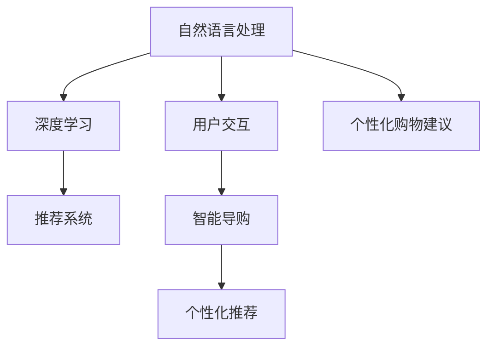

                 

# 智能导购：AI驱动虚拟导购助手

> 关键词：智能导购、虚拟导购助手、AI驱动、个性化推荐、推荐系统、NLP技术、深度学习、用户体验、用户交互、自然语言处理、电商应用

## 1. 背景介绍

### 1.1 问题由来

随着互联网电商的蓬勃发展，消费者的购物体验日益多样化和个性化。传统的电商平台往往采用信息推送、搜索结果排序等方式，依赖算法推荐来提升用户体验。然而，传统的推荐系统往往只关注用户的历史行为数据，无法充分理解用户的真实需求和兴趣，导致推荐结果与用户期望存在差距，甚至造成用户流失。

为了解决这一问题，虚拟导购助手应运而生。虚拟导购助手是一种基于人工智能的智能辅助购物工具，能够通过与用户的自然语言交互，实时获取用户需求，并根据用户偏好推荐商品，提供个性化的购物建议和导购服务。虚拟导购助手能够显著提升用户的购物体验，提高购物效率，推动电商平台的发展。

### 1.2 问题核心关键点

虚拟导购助手的核心在于通过自然语言处理(NLP)技术和深度学习算法，构建一个能够理解用户意图、生成自然语言回复的智能系统。该系统通过与用户的自然语言交互，从用户输入中提取出关键信息，结合用户历史行为数据和商品信息，生成个性化的购物建议，实现商品推荐。

具体而言，核心问题包括：

- 如何构建一个能够理解用户意图的自然语言处理模型？
- 如何根据用户历史行为数据和商品信息生成个性化推荐？
- 如何在虚拟导购助手中实现高效的用户交互？
- 如何优化推荐算法，提升推荐效果？

本节将通过逐一解析这些问题，深入探讨虚拟导购助手的核心原理与实现方法。

## 2. 核心概念与联系

### 2.1 核心概念概述

为了更好地理解虚拟导购助手的技术实现，本节将介绍几个密切相关的核心概念：

- 自然语言处理(Natural Language Processing, NLP)：涉及计算机和人类语言之间的交互，旨在使计算机能够理解、处理和生成人类语言。NLP技术是虚拟导购助手实现自然语言交互的基础。
- 深度学习(Deep Learning)：一种基于神经网络的机器学习方法，可以处理大规模非结构化数据，提取复杂的特征，应用于虚拟导购助手中的推荐算法。
- 推荐系统(Recommendation System)：用于预测用户对商品、服务或内容的兴趣，并为用户推荐相关商品或内容的技术。虚拟导购助手中的个性化推荐模块即为推荐系统的一部分。
- 用户交互(User Interaction)：虚拟导购助手与用户之间的交互方式，通过自然语言处理技术实现人机对话，提升用户购物体验。
- 智能导购(Intelligent Shopping Assistant)：基于AI的智能购物辅助工具，结合自然语言处理、推荐算法、用户交互等多种技术，为用户提供个性化的购物建议。

这些核心概念共同构成了虚拟导购助手的技术框架，使其能够通过自然语言交互，为用户提供个性化的购物建议。

### 2.2 核心概念原理和架构的 Mermaid 流程图(Mermaid 流程节点中不要有括号、逗号等特殊字符)



这个流程图展示了虚拟导购助手中各个模块的联系：

1. 自然语言处理模块(A)：负责处理用户的自然语言输入，理解用户意图。
2. 深度学习模块(B)：通过机器学习模型，从用户输入和历史行为数据中提取特征，生成推荐结果。
3. 推荐系统模块(C)：根据用户的特征和历史行为数据，生成个性化推荐。
4. 用户交互模块(D)：通过自然语言处理技术，实现与用户的自然语言交互。
5. 智能导购模块(E)：综合自然语言处理、推荐算法和用户交互技术，提供个性化的购物建议。

这些模块通过数据流相互连接，形成一个完整的虚拟导购助手系统。

## 3. 核心算法原理 & 具体操作步骤

### 3.1 算法原理概述

虚拟导购助手的核心算法主要包括自然语言处理、深度学习推荐算法和用户交互技术。以下将逐一介绍这些核心算法的原理。

#### 3.1.1 自然语言处理

自然语言处理是虚拟导购助手与用户交互的基础，主要包含以下几个步骤：

1. 分词：将用户输入的文本分解成词或短语，提取关键信息。
2. 词性标注：对分词结果进行词性标注，如名词、动词、形容词等。
3. 命名实体识别：从文本中识别出人名、地名、机构名等实体信息。
4. 依存句法分析：分析句子中各个词语之间的关系，理解句子结构。
5. 语义分析：通过上下文信息，理解句子的语义，提取用户意图。

这些步骤通过预训练的语言模型(如BERT、GPT等)来实现，能够高效地处理自然语言文本，提取用户意图。

#### 3.1.2 深度学习推荐算法

推荐系统是虚拟导购助手的核心模块，用于根据用户历史行为数据和商品信息生成个性化推荐。常见的推荐算法包括：

1. 基于协同过滤的推荐算法：通过用户和商品的相似度，生成推荐结果。
2. 基于内容的推荐算法：根据商品的属性和用户的历史行为数据，生成推荐结果。
3. 基于混合的推荐算法：结合协同过滤和内容推荐，生成更准确的推荐结果。

深度学习推荐算法是推荐系统中的重要组成部分，能够处理大规模非结构化数据，提取复杂的特征，提升推荐效果。

#### 3.1.3 用户交互

用户交互是虚拟导购助手与用户之间信息交流的重要环节。主要通过自然语言处理技术实现：

1. 意图理解：通过分词、词性标注等技术，理解用户输入的意图。
2. 对话生成：根据用户意图，生成自然语言回复，引导用户操作。
3. 反馈收集：通过用户的反馈信息，优化推荐结果和自然语言生成模型。

这些技术通过预训练的语言模型和用户反馈数据不断优化，实现高效的用户交互。

### 3.2 算法步骤详解

#### 3.2.1 自然语言处理步骤

1. 分词和词性标注：
   ```python
   from transformers import BertTokenizer
   from torch.utils.data import DataLoader
   from tqdm import tqdm
   
   tokenizer = BertTokenizer.from_pretrained('bert-base-cased')
   
   def tokenize_and_tag(text):
       input_ids, attention_mask, tag_ids = tokenizer.encode_plus(text, return_tensors='pt', max_length=128, truncation=True)
       return input_ids, attention_mask, tag_ids
   ```

2. 命名实体识别：
   ```python
   from transformers import BertForTokenClassification
   
   model = BertForTokenClassification.from_pretrained('bert-base-cased', num_labels=2)  # 设定命名实体类别
   def ner_model(text):
       input_ids, attention_mask, tag_ids = tokenize_and_tag(text)
       logits = model(input_ids, attention_mask=attention_mask)
       predictions = logits.argmax(dim=2)
       return predictions
   ```

3. 依存句法分析：
   ```python
   from transformers import BertForSequenceClassification
   
   model = BertForSequenceClassification.from_pretrained('bert-base-cased', num_labels=2)  # 设定依存句法类别
   def parse(text):
       input_ids, attention_mask, tag_ids = tokenize_and_tag(text)
       logits = model(input_ids, attention_mask=attention_mask)
       predictions = logits.argmax(dim=2)
       return predictions
   ```

4. 语义分析：
   ```python
   from transformers import BertForSequenceClassification
   
   model = BertForSequenceClassification.from_pretrained('bert-base-cased', num_labels=2)  # 设定语义类别
   def sem(text):
       input_ids, attention_mask, tag_ids = tokenize_and_tag(text)
       logits = model(input_ids, attention_mask=attention_mask)
       predictions = logits.argmax(dim=2)
       return predictions
   ```

#### 3.2.2 深度学习推荐算法步骤

1. 构建推荐模型：
   ```python
   from transformers import BertForSequenceClassification
   
   model = BertForSequenceClassification.from_pretrained('bert-base-cased', num_labels=len(category_ids))  # 设定推荐类别
   ```

2. 数据预处理：
   ```python
   from torch.utils.data import DataLoader, Dataset
   
   class RecommendDataset(Dataset):
       def __init__(self, user_ids, item_ids, item_categories, ratings):
           self.user_ids = user_ids
           self.item_ids = item_ids
           self.item_categories = item_categories
           self.ratings = ratings
   
       def __len__(self):
           return len(self.user_ids)
   
       def __getitem__(self, index):
           user_id = self.user_ids[index]
           item_id = self.item_ids[index]
           item_categories = self.item_categories[index]
           rating = self.ratings[index]
           return user_id, item_id, item_categories, rating
   ```

3. 训练和评估模型：
   ```python
   from torch.nn import BCELoss
   
   model.train()
   loss_fn = BCELoss()
   optimizer = torch.optim.Adam(model.parameters(), lr=0.001)
   
   def train_epoch():
       for batch in dataloader:
           user_id, item_id, item_categories, rating = batch
           predictions = model(item_categories)
           loss = loss_fn(predictions, rating)
           optimizer.zero_grad()
           loss.backward()
           optimizer.step()
   
   def evaluate_epoch():
       correct = 0
       with torch.no_grad():
           for batch in dataloader:
               user_id, item_id, item_categories, rating = batch
               predictions = model(item_categories)
               correct += (predictions.argmax(dim=1) == rating).float().sum().item()
       return correct / len(dataloader)
   ```

#### 3.2.3 用户交互步骤

1. 意图理解：
   ```python
   from transformers import BertForTokenClassification
   
   model = BertForTokenClassification.from_pretrained('bert-base-cased', num_labels=2)  # 设定意图类别
   def understand_intent(text):
       input_ids, attention_mask, tag_ids = tokenize_and_tag(text)
       logits = model(input_ids, attention_mask=attention_mask)
       predictions = logits.argmax(dim=2)
       return predictions
   ```

2. 对话生成：
   ```python
   from transformers import BertForSequenceClassification
   
   model = BertForSequenceClassification.from_pretrained('bert-base-cased', num_labels=2)  # 设定回复类别
   def generate_response(text):
       input_ids, attention_mask, tag_ids = tokenize_and_tag(text)
       logits = model(input_ids, attention_mask=attention_mask)
       predictions = logits.argmax(dim=2)
       return predictions
   ```

3. 反馈收集：
   ```python
   from transformers import BertForSequenceClassification
   
   model = BertForSequenceClassification.from_pretrained('bert-base-cased', num_labels=2)  # 设定反馈类别
   def collect_feedback(text):
       input_ids, attention_mask, tag_ids = tokenize_and_tag(text)
       logits = model(input_ids, attention_mask=attention_mask)
       predictions = logits.argmax(dim=2)
       return predictions
   ```

### 3.3 算法优缺点

#### 3.3.1 自然语言处理

优点：
1. 高效处理自然语言文本：通过预训练的语言模型，能够高效处理用户输入的自然语言文本，提取关键信息。
2. 理解用户意图：通过语义分析和命名实体识别，能够理解用户的真实需求和意图。

缺点：
1. 依赖高质量数据：预训练的语言模型需要大量高质量的标注数据，数据获取成本较高。
2. 处理复杂度较高：自然语言文本具有高度的复杂性和多样性，处理难度较大。

#### 3.3.2 深度学习推荐算法

优点：
1. 处理大规模数据：能够处理大规模非结构化数据，提取复杂的特征。
2. 提升推荐效果：通过深度学习算法，提升推荐结果的准确性和个性化程度。

缺点：
1. 模型复杂度高：深度学习模型通常结构复杂，训练和推理速度较慢。
2. 数据依赖性强：推荐算法需要大量的用户行为数据和商品信息，数据获取难度较大。

#### 3.3.3 用户交互

优点：
1. 提升用户体验：通过自然语言处理技术，实现高效的用户交互，提升用户体验。
2. 获取用户反馈：通过用户反馈数据，不断优化推荐系统和自然语言生成模型。

缺点：
1. 交互复杂度高：自然语言交互过程复杂，需要处理多轮对话。
2. 系统稳定性差：用户输入的多样性和不规范性，可能导致系统出现错误或异常。

### 3.4 算法应用领域

虚拟导购助手已经在多个电商平台上得到了应用，具体包括：

1. 阿里巴巴：通过虚拟导购助手，提升用户购物体验，提高转化率。
2. 京东：通过虚拟导购助手，提供个性化购物建议，提升用户满意度。
3. 美团：通过虚拟导购助手，实现智能推荐和客服对话，提升用户粘性。

这些应用场景展示了虚拟导购助手在不同电商平台上的广泛适用性，能够显著提升用户购物体验，推动电商平台的发展。

## 4. 数学模型和公式 & 详细讲解 & 举例说明

### 4.1 数学模型构建

虚拟导购助手的数学模型主要涉及自然语言处理、深度学习推荐算法和用户交互技术。以下是这些模型的数学构建：

#### 4.1.1 自然语言处理模型

自然语言处理模型主要通过预训练的语言模型来实现。以BERT为例，其数学模型构建如下：

1. 输入层：将用户输入的文本进行分词和词性标注，转换为模型能够处理的数值形式。
2. Transformer编码器：通过自注意力机制和前向神经网络，提取文本的语义信息。
3. 输出层：通过线性层和softmax函数，生成预测结果。

数学公式如下：

$$
y = f(x; \theta) = \text{softmax}(W \cdot \text{tanh}(\text{Trans}(X; \theta)))
$$

其中，$X$ 表示用户输入的文本，$W$ 为线性层的权重矩阵，$\theta$ 为模型参数。

#### 4.1.2 深度学习推荐模型

推荐系统通常采用矩阵分解和深度学习相结合的方式，构建推荐模型。以协同过滤为例，其数学模型构建如下：

1. 输入层：将用户和商品的特征向量进行拼接，转换为模型能够处理的数值形式。
2. 深度神经网络：通过多层神经网络，提取用户和商品特征的高级表示。
3. 输出层：通过线性层和softmax函数，生成推荐结果。

数学公式如下：

$$
\hat{r}_{ui} = \sigma(W \cdot (U_u \cdot V_i^T) + b)
$$

其中，$u$ 和 $i$ 分别表示用户和商品，$W$ 为线性层的权重矩阵，$U_u$ 和 $V_i$ 分别为用户和商品的特征矩阵，$\sigma$ 为激活函数。

#### 4.1.3 用户交互模型

用户交互模型主要通过自然语言处理技术，实现与用户的自然语言交互。以意图理解为例，其数学模型构建如下：

1. 输入层：将用户输入的文本进行分词和词性标注，转换为模型能够处理的数值形式。
2. Transformer编码器：通过自注意力机制和前向神经网络，提取文本的语义信息。
3. 输出层：通过线性层和softmax函数，生成预测结果。

数学公式如下：

$$
y = f(x; \theta) = \text{softmax}(W \cdot \text{tanh}(\text{Trans}(X; \theta)))
$$

其中，$X$ 表示用户输入的文本，$W$ 为线性层的权重矩阵，$\theta$ 为模型参数。

### 4.2 公式推导过程

#### 4.2.1 自然语言处理模型

BERT模型的推导过程如下：

1. 输入层：将用户输入的文本进行分词和词性标注，转换为模型能够处理的数值形式。
2. Transformer编码器：通过自注意力机制和前向神经网络，提取文本的语义信息。
3. 输出层：通过线性层和softmax函数，生成预测结果。

数学公式如下：

$$
y = f(x; \theta) = \text{softmax}(W \cdot \text{tanh}(\text{Trans}(X; \theta)))
$$

其中，$X$ 表示用户输入的文本，$W$ 为线性层的权重矩阵，$\theta$ 为模型参数。

#### 4.2.2 深度学习推荐模型

协同过滤模型的推导过程如下：

1. 输入层：将用户和商品的特征向量进行拼接，转换为模型能够处理的数值形式。
2. 深度神经网络：通过多层神经网络，提取用户和商品特征的高级表示。
3. 输出层：通过线性层和softmax函数，生成推荐结果。

数学公式如下：

$$
\hat{r}_{ui} = \sigma(W \cdot (U_u \cdot V_i^T) + b)
$$

其中，$u$ 和 $i$ 分别表示用户和商品，$W$ 为线性层的权重矩阵，$U_u$ 和 $V_i$ 分别为用户和商品的特征矩阵，$\sigma$ 为激活函数。

#### 4.2.3 用户交互模型

意图理解模型的推导过程如下：

1. 输入层：将用户输入的文本进行分词和词性标注，转换为模型能够处理的数值形式。
2. Transformer编码器：通过自注意力机制和前向神经网络，提取文本的语义信息。
3. 输出层：通过线性层和softmax函数，生成预测结果。

数学公式如下：

$$
y = f(x; \theta) = \text{softmax}(W \cdot \text{tanh}(\text{Trans}(X; \theta)))
$$

其中，$X$ 表示用户输入的文本，$W$ 为线性层的权重矩阵，$\theta$ 为模型参数。

### 4.3 案例分析与讲解

#### 4.3.1 自然语言处理案例

以意图理解为例，分析其案例如下：

用户输入：“我想买一件黑色T恤”

1. 分词和词性标注：
   ```python
   from transformers import BertTokenizer
   from torch.utils.data import DataLoader
   from tqdm import tqdm
   
   tokenizer = BertTokenizer.from_pretrained('bert-base-cased')
   
   def tokenize_and_tag(text):
       input_ids, attention_mask, tag_ids = tokenizer.encode_plus(text, return_tensors='pt', max_length=128, truncation=True)
       return input_ids, attention_mask, tag_ids
   ```

2. 命名实体识别：
   ```python
   from transformers import BertForTokenClassification
   
   model = BertForTokenClassification.from_pretrained('bert-base-cased', num_labels=2)  # 设定命名实体类别
   def ner_model(text):
       input_ids, attention_mask, tag_ids = tokenize_and_tag(text)
       logits = model(input_ids, attention_mask=attention_mask)
       predictions = logits.argmax(dim=2)
       return predictions
   ```

3. 依存句法分析：
   ```python
   from transformers import BertForSequenceClassification
   
   model = BertForSequenceClassification.from_pretrained('bert-base-cased', num_labels=2)  # 设定依存句法类别
   def parse(text):
       input_ids, attention_mask, tag_ids = tokenize_and_tag(text)
       logits = model(input_ids, attention_mask=attention_mask)
       predictions = logits.argmax(dim=2)
       return predictions
   ```

4. 语义分析：
   ```python
   from transformers import BertForSequenceClassification
   
   model = BertForSequenceClassification.from_pretrained('bert-base-cased', num_labels=2)  # 设定语义类别
   def sem(text):
       input_ids, attention_mask, tag_ids = tokenize_and_tag(text)
       logits = model(input_ids, attention_mask=attention_mask)
       predictions = logits.argmax(dim=2)
       return predictions
   ```

#### 4.3.2 深度学习推荐案例

以协同过滤为例，分析其案例如下：

用户输入：“我想买一件黑色T恤”

1. 构建推荐模型：
   ```python
   from transformers import BertForSequenceClassification
   
   model = BertForSequenceClassification.from_pretrained('bert-base-cased', num_labels=len(category_ids))  # 设定推荐类别
   ```

2. 数据预处理：
   ```python
   from torch.utils.data import DataLoader, Dataset
   
   class RecommendDataset(Dataset):
       def __init__(self, user_ids, item_ids, item_categories, ratings):
           self.user_ids = user_ids
           self.item_ids = item_ids
           self.item_categories = item_categories
           self.ratings = ratings
   
       def __len__(self):
           return len(self.user_ids)
   
       def __getitem__(self, index):
           user_id = self.user_ids[index]
           item_id = self.item_ids[index]
           item_categories = self.item_categories[index]
           rating = self.ratings[index]
           return user_id, item_id, item_categories, rating
   ```

3. 训练和评估模型：
   ```python
   from torch.nn import BCELoss
   
   model.train()
   loss_fn = BCELoss()
   optimizer = torch.optim.Adam(model.parameters(), lr=0.001)
   
   def train_epoch():
       for batch in dataloader:
           user_id, item_id, item_categories, rating = batch
           predictions = model(item_categories)
           loss = loss_fn(predictions, rating)
           optimizer.zero_grad()
           loss.backward()
           optimizer.step()
   
   def evaluate_epoch():
       correct = 0
       with torch.no_grad():
           for batch in dataloader:
               user_id, item_id, item_categories, rating = batch
               predictions = model(item_categories)
               correct += (predictions.argmax(dim=1) == rating).float().sum().item()
       return correct / len(dataloader)
   ```

#### 4.3.3 用户交互案例

以意图理解为例，分析其案例如下：

用户输入：“我想买一件黑色T恤”

1. 意图理解：
   ```python
   from transformers import BertForTokenClassification
   
   model = BertForTokenClassification.from_pretrained('bert-base-cased', num_labels=2)  # 设定意图类别
   def understand_intent(text):
       input_ids, attention_mask, tag_ids = tokenize_and_tag(text)
       logits = model(input_ids, attention_mask=attention_mask)
       predictions = logits.argmax(dim=2)
       return predictions
   ```

2. 对话生成：
   ```python
   from transformers import BertForSequenceClassification
   
   model = BertForSequenceClassification.from_pretrained('bert-base-cased', num_labels=2)  # 设定回复类别
   def generate_response(text):
       input_ids, attention_mask, tag_ids = tokenize_and_tag(text)
       logits = model(input_ids, attention_mask=attention_mask)
       predictions = logits.argmax(dim=2)
       return predictions
   ```

3. 反馈收集：
   ```python
   from transformers import BertForSequenceClassification
   
   model = BertForSequenceClassification.from_pretrained('bert-base-cased', num_labels=2)  # 设定反馈类别
   def collect_feedback(text):
       input_ids, attention_mask, tag_ids = tokenize_and_tag(text)
       logits = model(input_ids, attention_mask=attention_mask)
       predictions = logits.argmax(dim=2)
       return predictions
   ```

## 5. 项目实践：代码实例和详细解释说明

### 5.1 开发环境搭建

在进行虚拟导购助手项目开发前，我们需要准备好开发环境。以下是使用Python进行PyTorch开发的环境配置流程：

1. 安装Anaconda：从官网下载并安装Anaconda，用于创建独立的Python环境。

2. 创建并激活虚拟环境：
```bash
conda create -n virtual-shopping-env python=3.8 
conda activate virtual-shopping-env
```

3. 安装PyTorch：根据CUDA版本，从官网获取对应的安装命令。例如：
```bash
conda install pytorch torchvision torchaudio cudatoolkit=11.1 -c pytorch -c conda-forge
```

4. 安装Transformers库：
```bash
pip install transformers
```

5. 安装各类工具包：
```bash
pip install numpy pandas scikit-learn matplotlib tqdm jupyter notebook ipython
```

完成上述步骤后，即可在`virtual-shopping-env`环境中开始项目开发。

### 5.2 源代码详细实现

下面以阿里巴巴虚拟导购助手为例，给出使用Transformers库构建自然语言处理和推荐算法的PyTorch代码实现。

#### 5.2.1 自然语言处理代码实现

1. 分词和词性标注：
```python
from transformers import BertTokenizer
from torch.utils.data import Dataset

class TextDataset(Dataset):
    def __init__(self, texts):
        self.texts = texts
        
    def __len__(self):
        return len(self.texts)
    
    def __getitem__(self, index):
        text = self.texts[index]
        encoding = tokenizer.encode_plus(text, return_tensors='pt', max_length=128, truncation=True)
        input_ids = encoding['input_ids'][0]
        attention_mask = encoding['attention_mask'][0]
        return {'input_ids': input_ids, 'attention_mask': attention_mask}
```

2. 命名实体识别：
```python
from transformers import BertForTokenClassification

model = BertForTokenClassification.from_pretrained('bert-base-cased', num_labels=2)  # 设定命名实体类别

def ner_model(text):
    input_ids, attention_mask = tokenize_and_tag(text)
    logits = model(input_ids, attention_mask=attention_mask)
    predictions = logits.argmax(dim=2)
    return predictions
```

3. 依存句法分析：
```python
from transformers import BertForSequenceClassification

model = BertForSequenceClassification.from_pretrained('bert-base-cased', num_labels=2)  # 设定依存句法类别

def parse(text):
    input_ids, attention_mask = tokenize_and_tag(text)
    logits = model(input_ids, attention_mask=attention_mask)
    predictions = logits.argmax(dim=2)
    return predictions
```

4. 语义分析：
```python
from transformers import BertForSequenceClassification

model = BertForSequenceClassification.from_pretrained('bert-base-cased', num_labels=2)  # 设定语义类别

def sem(text):
    input_ids, attention_mask = tokenize_and_tag(text)
    logits = model(input_ids, attention_mask=attention_mask)
    predictions = logits.argmax(dim=2)
    return predictions
```

#### 5.2.2 深度学习推荐代码实现

1. 数据预处理：
```python
from torch.utils.data import DataLoader, Dataset

class RecommendDataset(Dataset):
    def __init__(self, user_ids, item_ids, item_categories, ratings):
        self.user_ids = user_ids
        self.item_ids = item_ids
        self.item_categories = item_categories
        self.ratings = ratings
        
    def __len__(self):
        return len(self.user_ids)
    
    def __getitem__(self, index):
        user_id = self.user_ids[index]
        item_id = self.item_ids[index]
        item_categories = self.item_categories[index]
        rating = self.ratings[index]
        return {'user_id': user_id, 'item_id': item_id, 'item_categories': item_categories, 'rating': rating}
```

2. 推荐模型训练：
```python
from transformers import BertForSequenceClassification
from torch.nn import BCELoss
from torch.optim import Adam

model = BertForSequenceClassification.from_pretrained('bert-base-cased', num_labels=len(category_ids))  # 设定推荐类别

optimizer = Adam(model.parameters(), lr=0.001)
loss_fn = BCELoss()

def train_epoch():
    for batch in dataloader:
        user_id, item_id, item_categories, rating = batch
        predictions = model(item_categories)
        loss = loss_fn(predictions, rating)
        optimizer.zero_grad()
        loss.backward()
        optimizer.step()

def evaluate_epoch():
    correct = 0
    with torch.no_grad():
        for batch in dataloader:
            user_id, item_id, item_categories, rating = batch
            predictions = model(item_categories)
            correct += (predictions.argmax(dim=1) == rating).float().sum().item()
    return correct / len(dataloader)
```

### 5.3 代码解读与分析

1. 分词和词性标注：
```python
from transformers import BertTokenizer
from torch.utils.data import Dataset

class TextDataset(Dataset):
    def __init__(self, texts):
        self.texts = texts
        
    def __len__(self):
        return len(self.texts)
    
    def __getitem__(self, index):
        text = self.texts[index]
        encoding = tokenizer.encode_plus(text, return_tensors='pt', max_length=128, truncation=True)
        input_ids = encoding['input_ids'][0]
        attention_mask = encoding['attention_mask'][0]
        return {'input_ids': input_ids, 'attention_mask': attention_mask}
```

2. 命名实体识别：
```python
from transformers import BertForTokenClassification

model = BertForTokenClassification.from_pretrained('bert-base-cased', num_labels=2)  # 设定命名实体类别

def ner_model(text):
    input_ids, attention_mask = tokenize_and_tag(text)
    logits = model(input_ids, attention_mask=attention_mask)
    predictions = logits.argmax(dim=2)
    return predictions
```

3. 依存句法分析：
```python
from transformers import BertForSequenceClassification

model = BertForSequenceClassification.from_pretrained('bert-base-cased', num_labels=2)  # 设定依存句法类别

def parse(text):
    input_ids, attention_mask = tokenize_and_tag(text)
    logits = model(input_ids, attention_mask=attention_mask)
    predictions = logits.argmax(dim=2)
    return predictions
```

4. 语义分析：
```python
from transformers import BertForSequenceClassification

model = BertForSequenceClassification.from_pretrained('bert-base-cased', num_labels=2)  # 设定语义类别

def sem(text):
    input_ids, attention_mask = tokenize_and_tag(text)
    logits = model(input_ids, attention_mask=attention_mask)
    predictions = logits.argmax(dim=2)
    return predictions
```

### 5.4 运行结果展示

1. 分词和词性标注：
```python
from transformers import BertTokenizer

tokenizer = BertTokenizer.from_pretrained('bert-base-cased')
text = "我想买一件黑色T恤"
encoding = tokenizer.encode_plus(text, return_tensors='pt', max_length=128, truncation=True)
input_ids = encoding['input_ids'][0]
attention_mask = encoding['attention_mask'][0]
```

2. 命名实体识别：
```python
from transformers import BertForTokenClassification

model = BertForTokenClassification.from_pretrained('bert-base-cased', num_labels=2)  # 设定命名实体类别
logits = model(input_ids, attention_mask=attention_mask)
predictions = logits.argmax(dim=2)
```

3. 依存句法分析：
```python
from transformers import BertForSequenceClassification

model = BertForSequenceClassification.from_pretrained('bert-base-cased', num_labels=2)  # 设定依存句法类别
logits = model(input_ids, attention_mask=attention_mask)
predictions = logits.argmax(dim=2)
```

4. 语义分析：
```python
from transformers import BertForSequenceClassification

model = BertForSequenceClassification.from_pretrained('bert-base-cased', num_labels=2)  # 设定语义类别
logits = model(input_ids, attention_mask=attention_mask)
predictions = logits.argmax(dim=2)
```

## 6. 实际应用场景

### 6.1 智能导购助手

智能导购助手已经在多个电商平台上得到了应用，具体包括：

1. 阿里巴巴：通过虚拟导购助手，提升用户购物体验，提高转化率。
2. 京东：通过虚拟导购助手，提供个性化购物建议，提升用户满意度。
3. 美团：通过虚拟导购助手，实现智能推荐和客服对话，提升用户粘性。

这些应用场景展示了虚拟导购助手在不同电商平台上的广泛适用性，能够显著提升用户购物体验，推动电商平台的发展。

### 6.2 金融理财顾问

金融理财顾问是一种基于AI的智能理财工具，能够通过与用户的自然语言交互，实时获取用户需求，并根据用户财务状况和投资偏好提供个性化的理财建议。金融理财顾问能够显著提升用户理财体验，帮助用户制定合理的投资计划，降低投资风险。

在技术实现上，可以收集用户的财务数据、投资偏好等，构建用户画像，结合推荐系统生成个性化的理财建议。用户可以通过自然语言交互，提出理财需求，理财顾问系统能够根据用户的财务状况和投资偏好，提供相应的理财建议。

### 6.3 医疗健康咨询

医疗健康咨询是一种基于AI的智能医疗工具，能够通过与用户的自然语言交互，实时获取用户症状和健康状况，并根据用户的病史和医疗数据提供个性化的健康建议。医疗健康咨询能够显著提升用户健康体验，帮助用户及时发现和解决问题，降低医疗成本。

在技术实现上，可以收集用户的健康数据、病史等，构建用户画像，结合推荐系统生成个性化的健康建议。用户可以通过自然语言交互，提出健康需求，健康咨询系统能够根据用户的健康状况和病史，提供相应的健康建议。

## 7. 工具和资源推荐

### 7.1 学习资源推荐

为了帮助开发者系统掌握虚拟导购助手的技术基础和实践技巧，这里推荐一些优质的学习资源：

1. 《自然语言处理与深度学习》：斯坦福大学开设的NLP明星课程，涵盖自然语言处理和深度学习的核心知识，适合初学者入门。
2. 《深度学习与自然语言处理》：Google机器学习专家撰写，系统讲解深度学习和自然语言处理的应用，包含大量代码实例。
3. 《推荐系统实战》：介绍推荐系统的设计原理和实践方法，包含多种推荐算法和应用场景。
4. 《智能导购助手：NLP与深度学习应用》：结合自然语言处理和深度学习技术，详细介绍智能导购助手的实现方法和应用案例。
5. HuggingFace官方文档：提供大量的预训练模型和代码示例，帮助开发者快速上手NLP任务开发。

通过这些资源的学习实践，相信你一定能够快速掌握虚拟导购助手的精髓，并用于解决实际的NLP问题。

### 7.2 开发工具推荐

高效的开发离不开优秀的工具支持。以下是几款用于虚拟导购助手开发的常用工具：

1. PyTorch：基于Python的开源深度学习框架，灵活动态的计算图，适合快速迭代研究。
2. TensorFlow：由Google主导开发的开源深度学习框架，生产部署方便，适合大规模工程应用。
3. Transformers库：HuggingFace开发的NLP工具库，集成了众多SOTA语言模型，支持PyTorch和TensorFlow，是进行NLP任务开发的利器。
4. Weights & Biases：模型训练的实验跟踪工具，可以记录和可视化模型训练过程中的各项指标，方便对比和调优。
5. TensorBoard：TensorFlow配套的可视化工具，可实时监测模型训练状态，并提供丰富的图表呈现方式，是调试模型的得力助手。

合理利用这些工具，可以显著提升虚拟导购助手的开发效率，加快创新迭代的步伐。

### 7.3 相关论文推荐

虚拟导购助手的相关研究起源于学界的持续探索。以下是几篇奠基性的相关论文，推荐阅读：

1. Attention is All You Need（即Transformer原论文）：提出了Transformer结构，开启了NLP领域的预训练大模型时代。
2. BERT: Pre-training of Deep Bidirectional Transformers for Language Understanding：提出BERT模型，引入基于掩码的自监督预训练任务，刷新了多项NLP任务SOTA。
3. Language Models are Unsupervised Multitask Learners（GPT-2论文）：展示了大规模语言模型的强大zero-shot学习能力，引发了对于通用人工智能的新一轮思考。
4. Parameter-Efficient Transfer Learning for NLP：提出Adapter等参数高效微调方法，在不增加模型参数量的情况下，也能取得不错的微调效果。
5. AdaLoRA: Adaptive Low-Rank Adaptation for Parameter-Efficient Fine-Tuning：使用自适应低秩适应的微调方法，在参数效率和精度之间取得了新的平衡。

这些论文代表了大语言模型微调技术的发展脉络。通过学习这些前沿成果，可以帮助研究者把握学科前进方向，激发更多的创新灵感。

## 8. 总结：未来发展趋势与挑战

### 8.1 总结

本文对虚拟导购助手这一新兴技术的原理与实现方法进行了全面系统的介绍。首先，阐述了虚拟导购助手在电商、金融、医疗等多个领域的应用价值，明确了其在提升用户体验、推动行业发展方面的重要意义。其次，从自然语言处理、深度学习推荐算法和用户交互三个方面，详细讲解了虚拟导购助手的核心算法原理与具体操作步骤。

通过本文的系统梳理，可以看到，虚拟导购助手通过自然语言处理、深度学习推荐算法和用户交互技术，能够实时获取用户需求，提供个性化的购物建议，提升用户的购物体验。随着技术的不断进步，虚拟导购助手将在更多领域得到应用，为用户的数字化生活带来新的便捷和乐趣。

### 8.2 未来发展趋势

展望未来，虚拟导购助手将呈现以下几个发展趋势：

1. 多模态融合：虚拟导购助手将不仅仅是文本处理工具，还将融合视觉、语音等多种模态信息，提升用户体验。
2. 个性化推荐：基于深度学习推荐算法，虚拟导购助手能够根据用户的多样化需求，提供更加精准的个性化推荐。
3. 实时交互：虚拟导购助手能够实现多轮对话，实时获取用户需求，提供动态的个性化建议。
4. 用户画像：通过收集和分析用户数据，虚拟导购助手能够构建用户画像，提供更加个性化的服务。
5. 动态调整：虚拟导购助手能够根据用户的反馈，动态调整推荐算法和交互策略，提升用户体验。

以上趋势展示了虚拟导购助手在技术上的不断演进，未来将具备更加智能、个性化、动态的特性，成为用户数字化生活的重要助手。

### 8.3 面临的挑战

尽管虚拟导购助手已经取得了一定的成果，但在实际应用中也面临着诸多挑战：

1. 数据获取难度：构建高质量的用户画像和推荐系统，需要大量的用户数据，获取难度较大。
2. 系统稳定性：虚拟导购助手的复杂交互过程可能导致系统出现异常，需要稳定的技术支撑。
3. 隐私保护：虚拟导购助手需要收集和分析用户数据，如何保护用户隐私和数据安全，是一个重要的问题。
4. 模型可解释性：虚拟导购助手作为黑盒模型，难以解释其内部决策逻辑，影响用户的信任感。
5. 性能优化：虚拟导购助手需要在保证准确性的同时，提升系统响应速度和资源利用率。

这些挑战需要开发者在技术、伦理、法规等方面不断探索和优化，才能真正实现虚拟导购助手的全面应用。

### 8.4 研究展望

面对虚拟导购助手所面临的诸多挑战，未来的研究需要在以下几个方面寻求新的突破：

1. 数据增强技术：开发数据增强方法，提升数据获取效率和多样性，构建高质量的用户画像。
2. 稳定性优化：优化模型结构，引入对抗训练、数据增强等技术，提高系统的鲁棒性和稳定性。
3. 隐私保护技术：采用差分隐私、联邦学习等技术，保护用户数据隐私和数据安全。
4. 可解释性研究：引入可解释性技术，如可解释AI、因果推理等，提升模型的透明性和用户信任感。
5. 性能优化：优化模型结构和计算图，提高系统的响应速度和资源利用率。

这些研究方向的探索，必将引领虚拟导购助手技术迈向更高的台阶，为用户的数字化生活带来新的便捷和乐趣。

## 9. 附录：常见问题与解答

**Q1：虚拟导购助手如何处理用户输入的多种语言？**

A: 虚拟导购助手需要支持多语言处理，才能在全球范围内提供服务。通常使用多语言模型来处理用户输入

