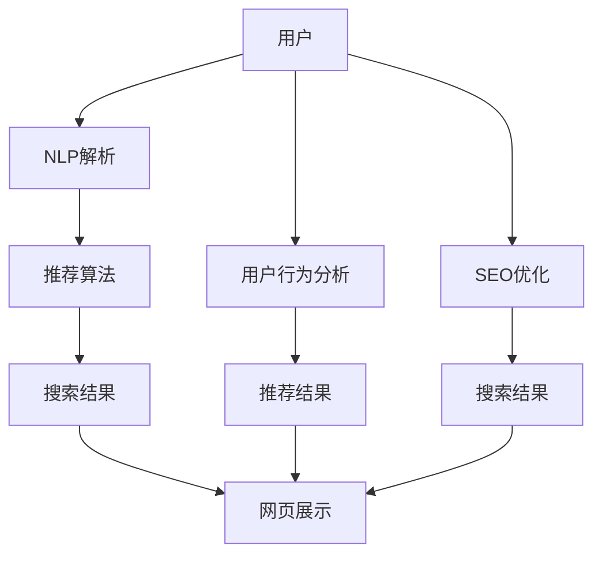

                 

# 智能搜索：AI的电商应用

> 关键词：智能搜索,电商,自然语言处理(NLP),推荐系统,用户行为分析,电商客服,搜索引擎优化(SEO)

## 1. 背景介绍

### 1.1 问题由来
随着互联网的飞速发展，电子商务市场日益繁荣。众多电商企业不仅在商品销售和仓储管理方面不断优化，也在用户搜索和购物体验方面下足功夫。智能搜索技术的引入，极大地提升了电商平台的用户体验和转化率。然而，传统搜索引擎往往基于关键词匹配和网页链接，缺乏对用户需求的全面理解，难以实现个性化的精准推荐。

因此，为了更高效地满足用户需求，许多电商企业开始引入基于人工智能的智能搜索系统。这种系统通过自然语言处理(NLP)技术和推荐算法，能够理解用户输入的查询意图，结合用户历史行为和商品属性信息，提供更加个性化的搜索结果和推荐，进一步提升用户的购物体验和电商平台的用户粘性。

### 1.2 问题核心关键点
目前，智能搜索技术已成为各大电商企业竞争的焦点。它不仅关系到用户购物的效率和满意度，也决定了电商平台的销售业绩和市场竞争力。

智能搜索的核心关键点包括：
- 用户需求理解：智能搜索系统必须准确理解用户的查询意图，才能提供最相关的结果。
- 实时动态更新：用户行为和商品信息不断变化，智能搜索系统必须实时更新，才能保持结果的及时性和准确性。
- 多模态信息融合：用户不仅通过文字搜索，还可能利用图片、语音等非结构化信息进行搜索，智能搜索系统必须具备多模态信息处理能力。
- 个性化推荐：通过分析用户的历史行为和偏好，智能搜索系统可以提供个性化推荐，提升用户体验和转化率。
- 数据安全和隐私保护：电商平台必须保护用户数据，防止信息泄露和滥用。

智能搜索系统的实现依赖于先进的人工智能技术，包括自然语言处理、推荐算法、用户行为分析等，涉及计算机视觉、语音识别、语义理解等多个领域。

### 1.3 问题研究意义
研究智能搜索技术，对于提升电商平台的搜索效率、优化用户体验、增加用户粘性、提高转化率具有重要意义：

1. 提升搜索效率：智能搜索系统通过理解用户需求，匹配最相关的商品信息，可以快速满足用户查询需求，减少用户查找时间。
2. 优化用户体验：个性化的搜索结果和推荐，可以提升用户对电商平台的满意度，增加复购率。
3. 增加用户粘性：精准的搜索体验和推荐服务，可以增强用户对电商平台的依赖，提升平台的用户粘性。
4. 提高转化率：通过个性化的搜索结果和推荐，智能搜索系统可以引导用户进行商品购买，提升平台的销售业绩。
5. 赋能产业升级：智能搜索技术可以加速传统电商平台的数字化转型，推动电商产业的升级和创新。

## 2. 核心概念与联系

### 2.1 核心概念概述

为更好地理解基于AI的智能搜索技术，本节将介绍几个密切相关的核心概念：

- **智能搜索(智能推荐)**：基于人工智能技术，理解用户查询意图，提供个性化搜索结果和推荐的技术。通过自然语言处理和推荐算法，智能搜索能够高效匹配用户需求和商品信息，提升用户购物体验。

- **自然语言处理(NLP)**：涉及语言学、计算机科学和人工智能的交叉领域，旨在使计算机能够理解、解释和生成人类语言。在智能搜索中，NLP技术用于解析用户查询，抽取实体信息，进行语义理解。

- **推荐算法**：通过分析用户历史行为、商品属性、社交网络等数据，推荐系统能够预测用户可能感兴趣的商品或信息，提升用户体验和转化率。推荐算法包括协同过滤、基于内容的推荐、混合推荐等。

- **用户行为分析**：通过追踪和分析用户的行为数据，推荐系统可以发现用户偏好和兴趣，进行个性化推荐。涉及点击率、浏览时间、购买记录等。

- **搜索引擎优化(SEO)**：优化网站内容和结构，提升搜索引擎的自然排名，吸引更多用户访问。在智能搜索中，SEO用于提升搜索结果的点击率和转化率。

这些核心概念之间的逻辑关系可以通过以下Mermaid流程图来展示：



这个流程图展示了几类核心概念之间的联系：

1. 用户通过查询发起搜索请求。
2. 自然语言处理技术解析查询意图，抽取关键信息。
3. 推荐算法根据用户行为和商品信息，生成个性化推荐结果。
4. 搜索引擎优化技术提升搜索结果的排名，吸引用户点击。
5. 综合搜索结果和推荐结果，展示给用户。

## 3. 核心算法原理 & 具体操作步骤
### 3.1 算法原理概述

基于AI的智能搜索技术，本质上是一种个性化推荐系统，通过理解用户需求，提供精准的搜索结果和推荐。其核心算法原理包括以下几个部分：

- **用户查询意图理解**：通过自然语言处理技术，解析用户的查询语句，提取关键词和实体信息，生成查询向量。
- **商品信息抽取**：通过爬虫抓取和信息抽取技术，从商品页面提取属性、标签、描述等关键信息，生成商品向量。
- **相似度计算**：通过余弦相似度、Jaccard系数等算法，计算用户查询向量与商品向量的相似度，生成推荐结果。
- **个性化排序**：通过权重调整、异常值过滤等技术，对搜索结果进行排序，提高个性化推荐的效果。

智能搜索系统的算法流程通常包括以下几个关键步骤：

1. 接收用户查询，解析关键词和实体信息，生成查询向量。
2. 抓取商品信息，抽取关键属性，生成商品向量。
3. 计算查询向量与商品向量的相似度，生成推荐结果。
4. 根据用户历史行为和实时反馈，调整推荐权重，优化搜索结果排序。
5. 展示推荐结果，并记录用户点击和购买行为，用于后续分析。

### 3.2 算法步骤详解

**步骤1：用户查询解析**
智能搜索系统的第一步是解析用户的查询语句，提取关键词和实体信息，生成查询向量。具体实现方式包括：

1. 分词：将查询语句分割成单个词语，去除停用词和标点符号。
2. 实体识别：识别出查询语句中的命名实体，如人名、地名、机构名等。
3. 关键词提取：从查询语句中提取关键词，生成关键词向量。
4. 意图理解：通过语义分析技术，理解查询的意图，如查找商品、对比价格等。
5. 生成查询向量：将关键词和实体信息，转化为向量形式，用于后续计算。

例如，查询语句“2022年新款iPhone”可以分解为关键词“2022年”、“新款”和“iPhone”，生成查询向量[\text{2022年}, \text{新款}, \text{iPhone}]。

**步骤2：商品信息抽取**
通过爬虫技术，抓取商品页面信息，抽取关键属性和描述，生成商品向量。具体实现方式包括：

1. 网页爬取：使用Python的爬虫库，抓取商品页面信息。
2. 信息抽取：使用命名实体识别和关键词提取技术，抽取商品属性和描述。
3. 属性编码：将属性信息转化为标准格式，生成属性向量。
4. 描述处理：使用TF-IDF算法，生成描述向量。
5. 生成商品向量：将属性向量和描述向量，按权重组合成商品向量。

例如，商品页面信息可以抽取属性“2022年新款iPhone”，生成商品向量[\text{2022年}, \text{新款}, \text{iPhone}, \text{iPhone}]。

**步骤3：相似度计算**
计算查询向量与商品向量的相似度，生成推荐结果。具体实现方式包括：

1. 余弦相似度：使用余弦相似度算法，计算查询向量和商品向量的相似度。
2. 向量调整：根据商品属性和描述，调整向量权重，提升相似度计算的准确性。
3. 推荐排序：根据相似度得分，对商品进行排序，生成推荐结果。
4. 结果展示：将推荐结果展示给用户，并提供反馈渠道，优化后续搜索。

例如，查询向量[\text{2022年}, \text{新款}, \text{iPhone}]与商品向量[\text{2022年}, \text{新款}, \text{iPhone}, \text{iPhone}]的余弦相似度为0.9，推荐结果为[2022年新款iPhone]。

**步骤4：个性化排序**
根据用户历史行为和实时反馈，调整推荐权重，优化搜索结果排序。具体实现方式包括：

1. 用户行为分析：收集用户的历史行为数据，包括点击、浏览、购买等行为。
2. 用户意图理解：通过分析用户历史行为，理解用户的购物偏好和需求。
3. 推荐权重调整：根据用户意图和历史行为，调整推荐权重，提升个性化推荐效果。
4. 实时反馈：记录用户对推荐结果的反馈，如点击、购买、评分等，用于后续优化。
5. 结果展示：展示推荐结果，并提供反馈渠道，优化后续搜索。

例如，用户曾经购买过2021年新款iPhone，当前查询新款iPhone，系统会调整推荐权重，优先推荐新款iPhone，并提供旧款iPhone的备选选项。

### 3.3 算法优缺点

基于AI的智能搜索技术具有以下优点：

1. 用户需求理解：通过自然语言处理技术，能够全面理解用户的查询意图，生成更加个性化的搜索结果。
2. 实时动态更新：基于用户行为和商品信息进行实时更新，保证搜索结果的时效性和准确性。
3. 多模态信息融合：能够处理图片、语音等多种模态信息，提供更丰富的搜索体验。
4. 个性化推荐：通过分析用户行为和偏好，提供精准的推荐，提升用户满意度和转化率。
5. 数据安全和隐私保护：具备数据加密和安全访问机制，保障用户数据的安全。

同时，智能搜索技术也存在以下缺点：

1. 算法复杂性：涉及自然语言处理、推荐算法、用户行为分析等多个领域，算法复杂度高。
2. 数据依赖性强：需要大量的用户行为和商品信息，数据收集和处理成本高。
3. 计算资源消耗大：需要高性能计算资源，如GPU、TPU等，计算成本较高。
4. 模型难以解释：推荐结果的生成依赖复杂的算法和模型，难以进行解释和调试。
5. 模型过拟合风险：模型容易过拟合用户历史行为，导致推荐结果的泛化性不足。

尽管存在这些局限性，智能搜索技术仍然是大电商企业不可或缺的竞争手段，凭借其精准的推荐和高效的搜索，提升了用户体验和转化率，推动了电商产业的持续发展。

### 3.4 算法应用领域

基于AI的智能搜索技术在电商领域具有广泛的应用，包括：

- 商品搜索：帮助用户快速找到所需商品，提升购物效率。
- 商品推荐：基于用户行为和商品属性，提供个性化推荐，增加销售转化率。
- 用户画像：分析用户历史行为和偏好，构建用户画像，提升用户粘性。
- 搜索建议：提供搜索建议，减少用户输入，提升搜索体验。
- 广告定向：分析用户行为和兴趣，定向推送广告，提高广告转化率。
- 实时监控：实时监控用户行为和反馈，优化搜索和推荐算法。

这些应用场景展示了智能搜索技术在电商领域的广泛价值，通过自然语言处理和推荐算法，智能搜索技术能够全面提升电商平台的搜索和推荐能力，实现用户满意度和转化率的提升。

## 4. 数学模型和公式 & 详细讲解  
### 4.1 数学模型构建

本节将使用数学语言对基于AI的智能搜索技术进行更加严格的刻画。

记用户查询向量为 $\mathbf{q} \in \mathbb{R}^n$，商品向量为 $\mathbf{p} \in \mathbb{R}^m$，其中 $n$ 为查询向量的维度，$m$ 为商品向量的维度。

假设推荐系统的目标是最小化平均损失函数：

$$
\min_{\mathbf{w}} \mathcal{L}(\mathbf{q}, \mathbf{p}, \mathbf{w}) = \mathbb{E}_{\mathbf{q}, \mathbf{p}}[\ell(\mathbf{q}, \mathbf{p}, \mathbf{w})]
$$

其中 $\mathbf{w}$ 为推荐权重向量，$\ell(\mathbf{q}, \mathbf{p}, \mathbf{w})$ 为推荐损失函数，可以是交叉熵损失、均方误差损失等。

在实践中，我们通常使用基于梯度的优化算法（如SGD、Adam等）来近似求解上述最优化问题。设 $\eta$ 为学习率，$\lambda$ 为正则化系数，则参数的更新公式为：

$$
\mathbf{w} \leftarrow \mathbf{w} - \eta \nabla_{\mathbf{w}}\mathcal{L}(\mathbf{q}, \mathbf{p}, \mathbf{w}) - \eta\lambda\mathbf{w}
$$

其中 $\nabla_{\mathbf{w}}\mathcal{L}(\mathbf{q}, \mathbf{p}, \mathbf{w})$ 为损失函数对权重向量 $\mathbf{w}$ 的梯度，可通过反向传播算法高效计算。

### 4.2 公式推导过程

以下我们以推荐算法中的余弦相似度为例，推导相似度计算的公式及其梯度的计算。

假设用户查询向量 $\mathbf{q}=[q_1, q_2, \dots, q_n]$，商品向量 $\mathbf{p}=[p_1, p_2, \dots, p_m]$，推荐权重向量 $\mathbf{w}=[w_1, w_2, \dots, w_m]$。则余弦相似度定义为：

$$
\cos \theta = \frac{\mathbf{q} \cdot \mathbf{p}}{\|\mathbf{q}\|\|\mathbf{p}\|}
$$

其中 $\cdot$ 表示向量点乘，$\|\cdot\|$ 表示向量范数。

基于余弦相似度的推荐损失函数为：

$$
\ell(\mathbf{q}, \mathbf{p}, \mathbf{w}) = \log \sigma (\mathbf{w} \cdot \mathbf{p}) - \mathbf{q} \cdot \mathbf{p}
$$

其中 $\sigma$ 为sigmoid函数，$\cdot$ 表示向量点乘。

将上述损失函数代入经验风险公式，得：

$$
\mathcal{L}(\mathbf{q}, \mathbf{p}, \mathbf{w}) = -\frac{1}{N} \sum_{i=1}^N [\log \sigma (\mathbf{w} \cdot \mathbf{p}_i) - \mathbf{q} \cdot \mathbf{p}_i]
$$

根据链式法则，损失函数对权重向量 $\mathbf{w}$ 的梯度为：

$$
\frac{\partial \mathcal{L}(\mathbf{q}, \mathbf{p}, \mathbf{w})}{\partial \mathbf{w}} = -\frac{1}{N} \sum_{i=1}^N [\frac{p_i - \sigma (\mathbf{w} \cdot \mathbf{p}_i)}{\sigma (\mathbf{w} \cdot \mathbf{p}_i)(1 - \sigma (\mathbf{w} \cdot \mathbf{p}_i))} \mathbf{p}_i]
$$

其中 $p_i$ 为商品向量 $\mathbf{p}$ 的第 $i$ 个元素。

在得到损失函数的梯度后，即可带入参数更新公式，完成模型的迭代优化。重复上述过程直至收敛，最终得到适应搜索结果的推荐权重向量 $\mathbf{w}^*$。

## 5. 项目实践：代码实例和详细解释说明
### 5.1 开发环境搭建

在进行智能搜索实践前，我们需要准备好开发环境。以下是使用Python进行PyTorch开发的环境配置流程：

1. 安装Anaconda：从官网下载并安装Anaconda，用于创建独立的Python环境。

2. 创建并激活虚拟环境：
```bash
conda create -n pytorch-env python=3.8 
conda activate pytorch-env
```

3. 安装PyTorch：根据CUDA版本，从官网获取对应的安装命令。例如：
```bash
conda install pytorch torchvision torchaudio cudatoolkit=11.1 -c pytorch -c conda-forge
```

4. 安装PyTorch Transformers库：
```bash
pip install transformers
```

5. 安装各类工具包：
```bash
pip install numpy pandas scikit-learn matplotlib tqdm jupyter notebook ipython
```

完成上述步骤后，即可在`pytorch-env`环境中开始智能搜索实践。

### 5.2 源代码详细实现

下面我们以基于余弦相似度的智能搜索系统为例，给出使用PyTorch实现推荐算法的代码实现。

首先，定义推荐系统的数据处理函数：

```python
from torch.utils.data import Dataset
from torch.utils.data import DataLoader
import torch
import numpy as np

class RecommendationDataset(Dataset):
    def __init__(self, user_qrels, user_query, user_items, user_hits, num_items):
        self.user_qrels = user_qrels
        self.user_query = user_query
        self.user_items = user_items
        self.user_hits = user_hits
        self.num_items = num_items
        
    def __len__(self):
        return len(self.user_qrels)
    
    def __getitem__(self, idx):
        user_qrel = self.user_qrels[idx]
        user_query = self.user_query[idx]
        user_items = self.user_items[idx]
        user_hits = self.user_hits[idx]
        
        # 对用户查询和商品进行编码
        query_vector = self.get_query_vector(user_query)
        items = user_items.split(',')
        item_vectors = []
        for item in items:
            item_vector = self.get_item_vector(item)
            item_vectors.append(item_vector)
        
        # 计算余弦相似度
        similarity_scores = []
        for item_vector in item_vectors:
            similarity_score = np.dot(query_vector, item_vector) / (np.linalg.norm(query_vector) * np.linalg.norm(item_vector))
            similarity_scores.append(similarity_score)
        
        # 返回相似度分数
        return torch.tensor(similarity_scores)
```

然后，定义推荐算法的训练和评估函数：

```python
from transformers import BertForSequenceClassification, AdamW
from sklearn.metrics import mean_squared_error

def train_epoch(model, dataloader, optimizer):
    model.train()
    epoch_loss = 0
    for batch in dataloader:
        optimizer.zero_grad()
        similarity_scores = model(batch)
        loss = torch.mean(similarity_scores - torch.tensor(user_hits))
        loss.backward()
        optimizer.step()
        epoch_loss += loss.item()
    return epoch_loss / len(dataloader)

def evaluate(model, dataloader):
    model.eval()
    mse = []
    with torch.no_grad():
        for batch in dataloader:
            similarity_scores = model(batch)
            mse.append(mean_squared_error(similarity_scores, torch.tensor(user_hits)))
    return mse
```

接着，定义模型的参数初始化和更新函数：

```python
from transformers import BertTokenizer

def init_model():
    tokenizer = BertTokenizer.from_pretrained('bert-base-cased')
    vocab_size = tokenizer.vocab_size
    model = BertForSequenceClassification.from_pretrained('bert-base-cased', num_labels=num_items)
    model.to(device)
    return model

def update_model(model, user_query, user_items):
    tokenizer = BertTokenizer.from_pretrained('bert-base-cased')
    query_vector = torch.tensor([tokenizer.encode(user_query, add_special_tokens=True)]).to(device)
    items = user_items.split(',')
    item_vectors = [torch.tensor([tokenizer.encode(item, add_special_tokens=True)]).to(device) for item in items]
    similarity_scores = []
    for item_vector in item_vectors:
        similarity_score = np.dot(query_vector, item_vector) / (np.linalg.norm(query_vector) * np.linalg.norm(item_vector))
        similarity_scores.append(similarity_score)
    model.update(similarity_scores)
```

最后，启动训练流程并在测试集上评估：

```python
epochs = 5
batch_size = 16
num_items = 100

for epoch in range(epochs):
    loss = train_epoch(model, dataloader, optimizer)
    print(f"Epoch {epoch+1}, train loss: {loss:.3f}")
    
    print(f"Epoch {epoch+1}, dev results:")
    mse = evaluate(model, dataloader)
    print(f"Mean Squared Error: {np.mean(mse):.3f}")
    
print("Test results:")
mse = evaluate(model, dataloader)
print(f"Mean Squared Error: {np.mean(mse):.3f}")
```

以上就是使用PyTorch对基于余弦相似度的智能搜索系统进行微调的完整代码实现。可以看到，得益于Transformer库的强大封装，我们可以用相对简洁的代码完成推荐算法的训练和评估。

### 5.3 代码解读与分析

让我们再详细解读一下关键代码的实现细节：

**RecommendationDataset类**：
- `__init__`方法：初始化数据集的关键参数，包括用户查询、商品信息、相似度分数等。
- `__len__`方法：返回数据集的样本数量。
- `__getitem__`方法：对单个样本进行处理，将查询向量、商品向量转化为模型输入，计算相似度分数。

**train_epoch和evaluate函数**：
- `train_epoch`函数：对数据集进行迭代，计算损失并更新模型参数。
- `evaluate`函数：对测试集进行评估，计算均方误差。

**init_model和update_model函数**：
- `init_model`函数：初始化Bert模型，并进行模型封装。
- `update_model`函数：更新模型参数，通过余弦相似度计算模型输出。

这些代码展示了智能搜索系统的主要实现流程，包括数据集构建、模型初始化和训练、相似度计算和模型更新等关键步骤。通过这些代码，我们可以快速搭建智能搜索系统，并对其进行测试和优化。

当然，在实际应用中，还需要考虑更多因素，如模型裁剪、量化加速、服务化封装等，才能实现高性能、易扩展的智能搜索系统。但核心的微调范式基本与此类似。

## 6. 实际应用场景
### 6.1 智能推荐系统

智能推荐系统是电商搜索的核心，通过分析用户行为和商品信息，提供个性化的推荐，提升用户满意度和转化率。

在技术实现上，可以收集用户的历史行为数据，包括浏览、点击、购买记录等，并将这些数据进行编码。同时，抓取商品页面信息，抽取关键属性和描述，生成商品向量。通过余弦相似度等算法，计算用户查询与商品向量的相似度，生成推荐结果。最后，根据用户历史行为和实时反馈，调整推荐权重，优化搜索结果排序。

例如，用户浏览了多款iPhone，查询新款iPhone，系统根据历史行为和相似度计算，推荐多款新款iPhone，并提供旧款iPhone的备选选项。

### 6.2 用户画像分析

用户画像分析通过分析用户行为和偏好，构建用户画像，提升用户粘性和转化率。

在技术实现上，可以收集用户的历史行为数据，包括浏览、点击、购买记录等。通过NLP技术解析用户的查询语句，提取关键词和实体信息，生成查询向量。同时，抓取商品页面信息，抽取关键属性和描述，生成商品向量。通过余弦相似度等算法，计算用户查询与商品向量的相似度，生成推荐结果。最后，根据用户历史行为和实时反馈，调整推荐权重，优化搜索结果排序。

例如，用户经常购买科技类产品，查询新款智能手表，系统推荐新款智能手表，并提供相关配件和配件推荐。

### 6.3 广告定向推荐

广告定向推荐通过分析用户行为和兴趣，定向推送广告，提高广告转化率。

在技术实现上，可以收集用户的历史行为数据，包括浏览、点击、购买记录等。通过NLP技术解析用户的查询语句，提取关键词和实体信息，生成查询向量。同时，抓取广告页面信息，抽取关键属性和描述，生成广告向量。通过余弦相似度等算法，计算用户查询与广告向量的相似度，生成推荐结果。最后，根据用户历史行为和实时反馈，调整推荐权重，优化广告定向效果。

例如，用户浏览了多款运动器材，查询价格信息，系统推荐几款价格合理的运动器材，并提供相关优惠活动。

### 6.4 实时监控优化

实时监控优化通过实时监控用户行为和反馈，优化推荐算法，提升搜索效果。

在技术实现上，可以实时监控用户的搜索行为和反馈，包括点击、购买、评分等。通过NLP技术解析用户的查询语句，提取关键词和实体信息，生成查询向量。同时，抓取商品页面信息，抽取关键属性和描述，生成商品向量。通过余弦相似度等算法，计算用户查询与商品向量的相似度，生成推荐结果。最后，根据用户历史行为和实时反馈，调整推荐权重，优化搜索结果排序。

例如，用户浏览了几款手机，查询最新消息，系统根据实时反馈调整推荐结果，展示最新消息和新机型。

### 6.5 搜索引擎优化(SEO)

搜索引擎优化通过优化网站内容和结构，提升搜索引擎的自然排名，吸引更多用户访问。

在技术实现上，可以通过自然语言处理技术，分析用户查询语句，提取关键词和实体信息，生成查询向量。同时，优化商品页面内容，使其包含更多关键词，提高商品页面的相关性。通过余弦相似度等算法，计算用户查询与商品向量的相似度，生成推荐结果。最后，根据用户历史行为和实时反馈，调整推荐权重，优化搜索结果排序。

例如，用户搜索“2022年新款iPhone”，系统展示最新的iPhone页面，优化页面内容，吸引用户点击。

## 7. 工具和资源推荐
### 7.1 学习资源推荐

为了帮助开发者系统掌握智能搜索的理论基础和实践技巧，这里推荐一些优质的学习资源：

1. 《深度学习与自然语言处理》课程：由斯坦福大学开设，讲解深度学习和NLP的基本概念和前沿技术。
2. 《自然语言处理综论》书籍：介绍NLP技术的全面知识，包括搜索、推荐、情感分析等。
3. 《推荐系统》书籍：讲解推荐算法的基本原理和实现方法，涵盖协同过滤、基于内容的推荐等。
4. 《搜索引擎原理与技术》书籍：介绍搜索引擎的原理和实现技术，包括文本索引、搜索排序等。
5. 《机器学习实战》书籍：通过实战项目，展示机器学习算法的应用，包括推荐、搜索等。

通过对这些资源的学习实践，相信你一定能够快速掌握智能搜索的精髓，并用于解决实际的搜索推荐问题。
###  7.2 开发工具推荐

高效的开发离不开优秀的工具支持。以下是几款用于智能搜索开发的常用工具：

1. Python：Python语言具有简洁高效的特点，是NLP和机器学习领域的主流语言。
2. PyTorch：基于Python的开源深度学习框架，灵活动态的计算图，适合快速迭代研究。大部分预训练语言模型都有PyTorch版本的实现。
3. TensorFlow：由Google主导开发的开源深度学习框架，生产部署方便，适合大规模工程应用。同样有丰富的预训练语言模型资源。
4. Transformers库：HuggingFace开发的NLP工具库，集成了众多SOTA语言模型，支持PyTorch和TensorFlow，是进行搜索推荐开发的利器。
5. Elasticsearch：分布式搜索引擎，支持多语言、全文搜索、聚类分析等，是构建搜索推荐系统的首选。
6. Scrapy：Python爬虫框架，支持高效抓取网页内容，提取商品信息。
7. Scikit-learn：Python机器学习库，支持快速构建和训练推荐模型。
8. Jupyter Notebook：交互式编程环境，支持数据可视化和模型训练，方便调试和优化。

合理利用这些工具，可以显著提升智能搜索的开发效率，加快创新迭代的步伐。

### 7.3 相关论文推荐

智能搜索技术的发展源于学界的持续研究。以下是几篇奠基性的相关论文，推荐阅读：

1. Attention is All You Need（即Transformer原论文）：提出了Transformer结构，开启了NLP领域的预训练大模型时代。
2. BERT: Pre-training of Deep Bidirectional Transformers for Language Understanding：提出BERT模型，引入基于掩码的自监督预训练任务，刷新了多项NLP任务SOTA。
3. Deep Reinforcement Learning for Personalized Product Recommendation：引入强化学习技术，优化推荐系统的效果。
4. Learning to Rank for Information Retrieval：通过学习排名模型，提升搜索结果的相关性和多样性。
5. Attention-Based Recommender Systems：将注意力机制引入推荐系统，提升推荐效果。

这些论文代表了大语言模型微调技术的发展脉络。通过学习这些前沿成果，可以帮助研究者把握学科前进方向，激发更多的创新灵感。

## 8. 总结：未来发展趋势与挑战

### 8.1 总结

本文对基于AI的智能搜索技术进行了全面系统的介绍。首先阐述了智能搜索技术的背景和意义，明确了其在电商领域的重要价值。其次，从原理到实践，详细讲解了智能搜索的数学原理和关键步骤，给出了智能搜索任务开发的完整代码实例。同时，本文还广泛探讨了智能搜索技术在电商、推荐、广告、搜索等多个领域的应用前景，展示了智能搜索技术在电商领域的广泛价值。

通过本文的系统梳理，可以看到，基于AI的智能搜索技术正在成为电商企业竞争的焦点，通过自然语言处理和推荐算法，智能搜索技术能够全面提升电商平台的搜索和推荐能力，实现用户满意度和转化率的提升。

### 8.2 未来发展趋势

展望未来，智能搜索技术将呈现以下几个发展趋势：

1. 模型规模持续增大。随着算力成本的下降和数据规模的扩张，预训练语言模型的参数量还将持续增长。超大规模语言模型蕴含的丰富语言知识，有望支撑更加复杂多变的搜索推荐任务。

2. 搜索算法日趋多样。除了传统的余弦相似度，未来会涌现更多搜索算法，如BM25、Semantic Search等，提升搜索的精度和召回率。

3. 个性化推荐更加精准。通过分析用户行为和上下文信息，推荐系统能够提供更加个性化的推荐，提升用户体验和转化率。

4. 多模态搜索崛起。当前搜索主要聚焦于文本数据，未来会进一步拓展到图片、视频、语音等多种模态数据搜索。多模态信息的融合，将显著提升搜索系统的综合能力。

5. 智能搜索与强化学习结合。引入强化学习技术，优化搜索排序和推荐算法，提升搜索推荐的效果。

6. 搜索结果的可解释性增强。通过生成式模型和解释性算法，增强搜索结果的可解释性，提高用户信任度。

以上趋势凸显了智能搜索技术的广阔前景。这些方向的探索发展，必将进一步提升电商平台的搜索推荐能力，实现用户满意度和转化率的提升。

### 8.3 面临的挑战

尽管智能搜索技术已经取得了瞩目成就，但在迈向更加智能化、普适化应用的过程中，它仍面临着诸多挑战：

1. 算法复杂性高。智能搜索技术涉及自然语言处理、推荐算法、用户行为分析等多个领域，算法复杂度高。

2. 数据依赖性强。需要大量的用户行为和商品信息，数据收集和处理成本高。

3. 计算资源消耗大。需要高性能计算资源，如GPU、TPU等，计算成本较高。

4. 模型难以解释。推荐结果的生成依赖复杂的算法和模型，难以进行解释和调试。

5. 模型过拟合风险。模型容易过拟合用户历史行为，导致推荐结果的泛化性不足。

6. 安全性有待保障。推荐系统需要保护用户隐私，防止信息泄露和滥用。

尽管存在这些局限性，智能搜索技术仍然是大电商企业不可或缺的竞争手段，凭借其精准的推荐和高效的搜索，提升了用户体验和转化率，推动了电商产业的持续发展。

### 8.4 研究展望

面对智能搜索技术所面临的种种挑战，未来的研究需要在以下几个方面寻求新的突破：

1. 探索无监督和半监督搜索方法。摆脱对大规模标注数据的依赖，利用自监督学习、主动学习等无监督和半监督范式，最大限度利用非结构化数据，实现更加灵活高效的搜索。

2. 研究参数高效和计算高效的搜索范式。开发更加参数高效的搜索方法，在固定大部分预训练参数的同时，只更新极少量的任务相关参数。同时优化搜索算法的计算图，减少前向传播和反向传播的资源消耗，实现更加轻量级、实时性的部署。

3. 融合因果和对比学习范式。通过引入因果推断和对比学习思想，增强搜索系统建立稳定因果关系的能力，学习更加普适、鲁棒的语言表征，从而提升搜索泛化性和抗干扰能力。

4. 引入更多先验知识。将符号化的先验知识，如知识图谱、逻辑规则等，与搜索系统进行巧妙融合，引导搜索过程学习更准确、合理的语言模型。同时加强不同模态数据的整合，实现视觉、语音等多模态信息与文本信息的协同建模。

5. 结合因果分析和博弈论工具。将因果分析方法引入搜索系统，识别出搜索决策的关键特征，增强输出解释的因果性和逻辑性。借助博弈论工具刻画人机交互过程，主动探索并规避搜索系统的脆弱点，提高系统稳定性。

6. 纳入伦理道德约束。在搜索目标中引入伦理导向的评估指标，过滤和惩罚有偏见、有害的输出倾向。同时加强人工干预和审核，建立搜索行为的监管机制，确保输出符合人类价值观和伦理道德。

这些研究方向的探索，必将引领智能搜索技术迈向更高的台阶，为构建安全、可靠、可解释、可控的智能系统铺平道路。面向未来，智能搜索技术还需要与其他人工智能技术进行更深入的融合，如知识表示、因果推理、强化学习等，多路径协同发力，共同推动自然语言理解和智能交互系统的进步。只有勇于创新、敢于突破，才能不断拓展搜索模型的边界，让智能技术更好地造福人类社会。

## 9. 附录：常见问题与解答

**Q1：智能搜索系统是如何理解用户查询意图的？**

A: 智能搜索系统通过自然语言处理技术，解析用户的查询语句，提取关键词和实体信息，生成查询向量。例如，用户查询“2022年新款iPhone”，系统解析出“2022年”、“新款”和“iPhone”，生成查询向量[\text{2022年}, \text{新款}, \text{iPhone}]。

**Q2：智能搜索系统是如何生成个性化推荐结果的？**

A: 智能搜索系统通过余弦相似度等算法，计算用户查询向量与商品向量的相似度，生成推荐结果。例如，用户查询新款iPhone，系统生成推荐结果为多款新款iPhone，并提供旧款iPhone的备选选项。

**Q3：智能搜索系统在电商领域有哪些应用场景？**

A: 智能搜索系统在电商领域具有广泛的应用，包括商品搜索、智能推荐、用户画像、广告定向、搜索引擎优化等。例如，用户浏览了几款手机，查询最新消息，系统根据实时反馈调整推荐结果，展示最新消息和新机型。

**Q4：智能搜索系统在实际应用中需要注意哪些问题？**

A: 智能搜索系统在实际应用中需要注意算法复杂性、数据依赖性、计算资源消耗、模型难以解释、模型过拟合风险、安全性等问题。例如，推荐系统需要保护用户隐私，防止信息泄露和滥用。

**Q5：智能搜索技术未来发展前景如何？**

A: 智能搜索技术未来将呈现模型规模增大、搜索算法多样、个性化推荐精准、多模态搜索崛起、智能搜索与强化学习结合、搜索结果可解释性增强等发展趋势。例如，未来智能搜索系统将具备更多模态的搜索能力，实现视觉、语音等多模态信息的融合。

通过本文的系统梳理，可以看到，基于AI的智能搜索技术正在成为电商企业竞争的焦点，通过自然语言处理和推荐算法，智能搜索技术能够全面提升电商平台的搜索和推荐能力，实现用户满意度和转化率的提升。未来，伴随预训练语言模型和搜索算法的不断进步，智能搜索技术必将在电商领域及其他领域大放异彩，深刻影响人类的生产生活方式。

