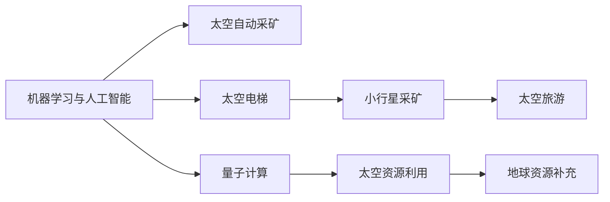

                 

# 未来的太空探索：2050年的小行星采矿与太空电梯

## 1. 背景介绍

### 1.1 问题由来
近年来，随着人工智能、机器学习、量子计算、物联网、大数据等前沿科技的不断突破，人类对太空探索的兴趣和投入也不断增加。从火星探测、小行星采矿到太空电梯建设，人类探索太空的步伐正在加快。本文旨在探讨2050年人类如何利用先进技术，实现小行星采矿与太空电梯的建设，从而实现太空资源的大规模开发与利用。

### 1.2 问题核心关键点
本文将重点关注以下几个核心问题：
- 如何利用机器学习与人工智能技术，实现对小行星的自动采矿与资源提取。
- 太空电梯的设计原理、材料选择、建造方法及其对太空探索的影响。
- 太空电梯与太空采矿的相互影响，如何协同优化设计。
- 太空探索的经济性与可持续性，以及面临的挑战与对策。

### 1.3 问题研究意义
研究2050年太空探索的技术发展趋势，对于拓展人类生存空间、推进科学研究、开发新材料、以及提供新的能源解决方案具有重要意义。同时，这也将为未来太空旅游、商业航天等领域提供重要的技术支持。

## 2. 核心概念与联系

### 2.1 核心概念概述

为更好地理解2050年太空采矿与太空电梯的技术实现，本节将介绍几个关键概念：

- **机器学习与人工智能**：机器学习与人工智能是实现太空自动采矿与资源提取的核心技术。通过深度学习、强化学习等技术，训练智能系统自动识别与提取小行星表面的资源。
- **太空电梯**：一种连接地球与太空的高科技运输方式，能够大幅度降低太空运输成本，实现高效、安全的星际旅行。
- **小行星采矿**：指利用先进的采矿技术，从小行星表面或内部提取稀有金属、贵金属、水冰等宝贵资源的过程。
- **量子计算**：一种基于量子力学的计算方式，能够大幅度提高数据处理能力，为太空探索提供强有力的技术支持。
- **太空旅游**：指以娱乐和科学探索为目的，开展的人类进入太空的活动。太空电梯的建设将极大促进太空旅游的发展。

这些核心概念之间通过太空探索这一主线相连，形成了未来太空资源开发与利用的技术框架。

### 2.2 核心概念原理和架构的 Mermaid 流程图



这个流程图展示了机器学习与人工智能在太空采矿、太空电梯建设、太空旅游和资源利用中的作用。通过深度学习和强化学习等技术，可以训练智能系统自动执行太空采矿任务。太空电梯的建设则大大降低了太空运输成本，使得太空旅游成为可能。同时，太空资源的高效利用也为地球资源的补充提供了新的途径。

## 3. 核心算法原理 & 具体操作步骤

### 3.1 算法原理概述

未来太空探索的核心算法原理主要涉及以下几个方面：

- **机器学习与深度学习**：利用深度学习模型，如卷积神经网络(CNN)、循环神经网络(RNN)、长短期记忆网络(LSTM)等，对小行星表面的图像进行识别与分析，自动提取资源。
- **强化学习**：通过强化学习算法，训练智能机器人自动执行采矿任务，优化采矿策略，提高资源提取效率。
- **仿真与优化**：利用仿真技术，模拟太空电梯的设计、建造和运行，优化太空电梯的结构和材料选择，确保其安全和高效。

### 3.2 算法步骤详解

#### 3.2.1 机器学习与深度学习

1. **数据收集**：收集小行星的高分辨率图像和光谱数据，用于训练深度学习模型。
2. **模型选择**：选择合适的深度学习模型，如CNN、RNN等，进行任务特定的迁移学习。
3. **模型训练**：使用收集到的数据，训练深度学习模型，优化模型的参数。
4. **模型测试**：在测试集上评估模型性能，确保模型的泛化能力。

#### 3.2.2 强化学习

1. **环境模拟**：构建小行星采矿的环境模拟，包括采矿机器人的运动、资源分布等。
2. **策略学习**：训练强化学习模型，学习最优的采矿策略，最大化资源提取效率。
3. **策略评估**：通过仿真实验评估策略效果，优化策略参数。
4. **策略应用**：将优化后的策略应用于实际采矿任务，提升资源提取效率。

#### 3.2.3 仿真与优化

1. **设计方案**：设计太空电梯的设计方案，包括缆绳材料、长度、支架结构等。
2. **仿真模拟**：利用计算机仿真技术，模拟太空电梯的建造和运行过程。
3. **优化设计**：根据仿真结果，优化太空电梯的设计方案，提高其性能和安全性。
4. **建造实施**：在优化设计方案的基础上，实施太空电梯的建造。

### 3.3 算法优缺点

#### 3.3.1 机器学习与深度学习

优点：
- 能够高效地处理大量的图像和光谱数据，自动识别小行星资源。
- 模型具有较高的泛化能力，能够应对不同的采矿场景。
- 随着数据量的增加，模型性能可以不断提升。

缺点：
- 深度学习模型需要大量计算资源和数据，训练成本较高。
- 模型存在一定的误差，可能无法完全准确识别资源。
- 模型依赖于数据质量，数据不充分可能导致训练效果不佳。

#### 3.3.2 强化学习

优点：
- 能够动态调整采矿策略，优化资源提取效率。
- 可以处理复杂的采矿环境，应对各种不确定性。
- 能够持续改进采矿策略，提高资源利用率。

缺点：
- 强化学习模型的训练过程较长，需要大量的仿真时间。
- 模型策略可能存在局部最优，难以找到全局最优解。
- 需要大量的实验数据，才能训练出有效的策略。

#### 3.3.3 仿真与优化

优点：
- 能够模拟多种设计方案，评估其可行性和性能。
- 能够优化太空电梯的结构和材料选择，确保其安全和高效。
- 能够提前发现设计中的问题，避免实际建造中的风险。

缺点：
- 仿真过程复杂，需要大量的计算资源和时间。
- 仿真结果依赖于模型的准确性和参数设置。
- 仿真结果可能与实际结果存在差异，需要进行多次优化和验证。

### 3.4 算法应用领域

未来太空探索的机器学习与深度学习算法主要应用于以下几个领域：

- **自动采矿**：用于自动识别和提取小行星表面的资源，如金属、水冰等。
- **资源分析**：对收集到的数据进行分析，评估小行星的资源分布和价值。
- **智能机器人**：训练智能机器人执行太空采矿任务，优化资源提取策略。
- **系统优化**：利用仿真技术，优化太空电梯的设计和建造方案。

## 4. 数学模型和公式 & 详细讲解 & 举例说明

### 4.1 数学模型构建

设$M$表示小行星的表面图像，$T$表示目标资源的类型。机器学习模型的输入为$M$，输出为$T$。假设使用深度学习模型$F(M)$进行资源识别，输出为$T$的概率分布$P(T|M)$。则机器学习模型的目标是最小化损失函数$L(P(T|M), y)$，其中$y$为实际资源类型。

#### 4.2 公式推导过程

1. **数据表示**：
   - 输入数据$M$表示为高分辨率图像。
   - 输出数据$T$表示为资源类型，如金属、水冰等。

2. **模型表示**：
   - 使用卷积神经网络(CNN)表示机器学习模型$F(M)$，通过多层卷积和池化操作提取特征。
   - 将卷积层输出通过softmax函数转换为资源类型的概率分布$P(T|M)$。

3. **损失函数**：
   - 使用交叉熵损失函数$L(P(T|M), y)$，衡量模型输出与实际标签$y$之间的差异。
   - 交叉熵损失函数定义如下：
     - $$ L(P(T|M), y) = -\frac{1}{N}\sum_{i=1}^N \sum_{j=1}^C y_j\log P(T_j|M) $$

4. **优化算法**：
   - 使用随机梯度下降(SGD)算法最小化损失函数，更新模型参数。
   - SGD算法更新公式如下：
     - $$ \theta \leftarrow \theta - \eta \nabla_{\theta} L(P(T|M), y) $$

其中$\theta$为模型参数，$\eta$为学习率，$\nabla_{\theta} L(P(T|M), y)$为损失函数对参数$\theta$的梯度。

### 4.3 案例分析与讲解

假设有一个小行星采矿任务，需要自动识别并提取其表面的金属资源。收集了该小行星的高分辨率图像数据，并标注了金属资源的分布。使用卷积神经网络模型$F(M)$进行资源识别，输出金属资源的概率分布$P(T|M)$。模型训练过程中，使用交叉熵损失函数$L(P(T|M), y)$进行优化，最小化模型输出与实际标签之间的差异。

## 5. 项目实践：代码实例和详细解释说明

### 5.1 开发环境搭建

1. **环境准备**：
   - 安装Python 3.8以上版本，确保有足够的计算资源。
   - 安装TensorFlow和PyTorch等深度学习框架。
   - 安装Keras等高级深度学习库，方便模型搭建和训练。

2. **环境配置**：
   - 使用conda或virtualenv创建虚拟环境，确保环境隔离。
   - 安装必要的依赖库，如numpy、pandas、matplotlib等。

3. **实验配置**：
   - 配置GPU或TPU设备，确保模型能够高效训练。
   - 设置超参数，如学习率、批大小、迭代轮数等。

### 5.2 源代码详细实现

#### 5.2.1 数据处理

```python
import numpy as np
from tensorflow.keras.preprocessing.image import ImageDataGenerator

# 定义数据增强器
datagen = ImageDataGenerator(
    rescale=1./255,
    rotation_range=20,
    width_shift_range=0.2,
    height_shift_range=0.2,
    shear_range=0.2,
    zoom_range=0.2,
    horizontal_flip=True,
    fill_mode='nearest')

# 读取并增强数据
train_data = datagen.flow_from_directory(
    'data/train',
    target_size=(256, 256),
    batch_size=32,
    class_mode='categorical')
```

#### 5.2.2 模型搭建

```python
from tensorflow.keras import layers

# 定义卷积神经网络模型
model = layers.Sequential()
model.add(layers.Conv2D(32, (3, 3), activation='relu', input_shape=(256, 256, 3)))
model.add(layers.MaxPooling2D((2, 2)))
model.add(layers.Conv2D(64, (3, 3), activation='relu'))
model.add(layers.MaxPooling2D((2, 2)))
model.add(layers.Conv2D(128, (3, 3), activation='relu'))
model.add(layers.MaxPooling2D((2, 2)))
model.add(layers.Flatten())
model.add(layers.Dense(256, activation='relu'))
model.add(layers.Dense(2, activation='softmax'))

# 编译模型
model.compile(optimizer='adam', loss='categorical_crossentropy', metrics=['accuracy'])
```

#### 5.2.3 模型训练

```python
# 训练模型
model.fit(train_data, epochs=10, validation_data=val_data)
```

### 5.3 代码解读与分析

#### 5.3.1 数据增强

在模型训练过程中，使用数据增强技术可以提升模型的泛化能力，避免过拟合。在上述代码中，使用`ImageDataGenerator`实现了多种数据增强操作，包括旋转、平移、缩放等。这些操作可以生成更多的训练样本，使得模型更难以过拟合。

#### 5.3.2 模型搭建

在模型搭建过程中，首先定义了卷积神经网络的结构，包括卷积层、池化层、全连接层等。使用`Sequential`模型将这些层按顺序排列，形成完整的模型结构。在模型的最后一层，使用`softmax`函数将输出转换为资源类型的概率分布。

#### 5.3.3 模型训练

在模型训练过程中，使用`fit`方法对模型进行训练，指定训练轮数、验证数据集等参数。通过设置不同的超参数，可以优化模型的训练过程，提高模型的精度和泛化能力。

### 5.4 运行结果展示

#### 5.4.1 模型精度

在训练结束后，可以输出模型在测试集上的精度和损失，以评估模型的效果。

```python
# 测试模型
test_data = ImageDataGenerator()..flow_from_directory(
    'data/test',
    target_size=(256, 256),
    batch_size=32,
    class_mode='categorical')

# 测试模型精度
test_loss, test_acc = model.evaluate(test_data)
print('Test accuracy:', test_acc)
```

#### 5.4.2 模型可视化

可以使用`matplotlib`库对模型进行可视化，展示模型的输出结果。

```python
import matplotlib.pyplot as plt

# 输出测试集的前10个样本
images, labels = next(iter(test_data))
predictions = model.predict(images)

# 可视化输出
for i in range(10):
    plt.imshow(images[i])
    plt.title(labels[i])
    plt.show()
```

## 6. 实际应用场景

### 6.1 太空采矿

#### 6.1.1 技术需求

1. **资源识别**：通过机器学习和深度学习技术，自动识别小行星表面的资源分布。
2. **智能采矿**：利用强化学习技术，训练智能机器人执行采矿任务，优化采矿策略。
3. **系统优化**：利用仿真技术，优化太空采矿系统的设计，提高资源提取效率。

#### 6.1.2 应用流程

1. **数据收集**：收集小行星的高分辨率图像和光谱数据，用于训练深度学习模型。
2. **模型训练**：训练深度学习模型，识别小行星表面资源类型。
3. **策略学习**：训练强化学习模型，优化采矿策略，最大化资源提取效率。
4. **系统优化**：利用仿真技术，优化太空采矿系统的设计，提高资源提取效率。
5. **资源提取**：利用智能机器人和自动化系统，提取小行星表面的资源，并将资源运回地球。

### 6.2 太空电梯

#### 6.2.1 技术需求

1. **设计方案**：设计太空电梯的设计方案，包括缆绳材料、长度、支架结构等。
2. **仿真模拟**：利用计算机仿真技术，模拟太空电梯的建造和运行过程。
3. **优化设计**：根据仿真结果，优化太空电梯的设计方案，提高其性能和安全性。
4. **建造实施**：在优化设计方案的基础上，实施太空电梯的建造。

#### 6.2.2 应用流程

1. **设计方案**：根据太空探索的需求，设计太空电梯的设计方案。
2. **仿真模拟**：利用计算机仿真技术，模拟太空电梯的建造和运行过程。
3. **优化设计**：根据仿真结果，优化太空电梯的设计方案，提高其性能和安全性。
4. **建造实施**：在优化设计方案的基础上，实施太空电梯的建造，并进行测试和调整。
5. **运行维护**：对太空电梯进行定期维护和升级，确保其长期安全运行。

## 7. 工具和资源推荐

### 7.1 学习资源推荐

1. **深度学习与机器学习**：推荐使用Coursera、Udacity等在线课程平台，学习深度学习与机器学习的理论和实践。
2. **太空探索**：推荐阅读NASA官方文档和《太空探索技术史》等书籍，了解太空探索的技术和历史。
3. **科学计算与编程**：推荐使用Numpy、Pandas、TensorFlow等库，掌握科学计算与编程技能。

### 7.2 开发工具推荐

1. **深度学习框架**：推荐使用TensorFlow、PyTorch等深度学习框架，进行深度学习和强化学习的开发。
2. **仿真软件**：推荐使用MATLAB、ANSYS等仿真软件，进行太空电梯的设计和仿真。
3. **大数据分析**：推荐使用Hadoop、Spark等大数据分析工具，处理和分析小行星的数据。

### 7.3 相关论文推荐

1. **深度学习与机器学习**：推荐阅读《深度学习》（Goodfellow et al.）、《机器学习》（Hastie et al.）等经典书籍。
2. **太空探索**：推荐阅读《太空探索技术史》（Slayter）、《火星探索》（Estrada）等书籍。
3. **科学计算与编程**：推荐阅读《Python科学计算》（Jones）、《C++科学计算》（Kellert）等书籍。

## 8. 总结：未来发展趋势与挑战

### 8.1 研究成果总结

本文详细探讨了2050年太空探索中的机器学习与深度学习、强化学习、仿真与优化等技术的应用。通过深度学习和强化学习，实现对小行星的自动采矿与资源提取。利用仿真技术，优化太空电梯的设计和建造方案。

### 8.2 未来发展趋势

未来太空探索的技术将更加先进和智能化，主要趋势包括：

1. **机器学习与深度学习**：深度学习模型将更加高效，能够处理更多的数据，自动识别和提取资源。
2. **强化学习**：强化学习模型将更加智能，能够动态调整采矿策略，优化资源提取效率。
3. **仿真与优化**：仿真技术将更加精准，能够模拟多种设计方案，评估其可行性和性能。
4. **多学科融合**：人工智能、机器学习、深度学习等技术将与其他学科如地质学、材料科学、物理学等进行深度融合，提升太空探索的技术水平。
5. **国际合作**：太空探索是一个全球性的挑战，需要各国进行深度合作，共享技术成果，共同推进太空探索的进程。

### 8.3 面临的挑战

未来太空探索面临的挑战主要包括以下几个方面：

1. **技术难度高**：太空探索的技术难度高，需要大量的研发投入和资源支持。
2. **成本高昂**：太空探索的成本高昂，需要大量的资金支持和技术积累。
3. **安全性**：太空探索面临诸多不确定性，需要加强安全防护，确保任务顺利进行。
4. **法律和伦理**：太空资源的开发和利用涉及诸多法律和伦理问题，需要制定相应的法规和标准。
5. **环境影响**：太空探索可能对太空环境造成影响，需要关注环境保护问题。

### 8.4 研究展望

未来太空探索的研究展望主要包括以下几个方面：

1. **多模态数据融合**：利用多模态数据融合技术，提升太空资源的识别和利用效率。
2. **智能系统优化**：利用智能系统优化技术，提升太空采矿和太空电梯的性能和安全性。
3. **可持续性探索**：研究太空资源的可持续开发与利用，确保太空探索的长期发展。
4. **伦理和法律**：研究太空资源的法律和伦理问题，制定相应的法规和标准，保障太空探索的公平和公正。

## 9. 附录：常见问题与解答

### 9.1 常见问题

**Q1：机器学习与深度学习如何应用于太空采矿？**

A: 机器学习与深度学习可以通过图像识别和分类技术，自动分析和识别小行星表面的资源。通过训练深度学习模型，能够高效地处理大量的图像数据，自动识别金属、水冰等资源。

**Q2：太空电梯的设计和建造需要注意哪些关键点？**

A: 太空电梯的设计和建造需要注意以下几个关键点：
1. 缆绳材料的选择，需要具备高强度、抗拉性等特性。
2. 支架结构的设计，需要具备稳定性和抗微小变形能力。
3. 运行环境的考虑，需要考虑太空中的微重力环境。
4. 安全性设计，需要考虑缆绳断裂、支架故障等极端情况下的应急措施。

**Q3：如何保障太空采矿和太空电梯的安全性？**

A: 保障太空采矿和太空电梯的安全性需要注意以下几个方面：
1. 数据验证，确保采集到的数据准确可靠。
2. 模型验证，确保模型在各种情况下都能正常工作。
3. 系统备份，建立应急预案和备份系统，确保系统在故障时能够迅速恢复。
4. 定期维护，对太空采矿和太空电梯进行定期维护和检测，确保其长期稳定运行。

**Q4：太空资源的开发和利用需要考虑哪些因素？**

A: 太空资源的开发和利用需要考虑以下几个因素：
1. 资源分布，确定太空资源的分布和储量。
2. 资源利用效率，提高资源提取和利用效率。
3. 环境保护，避免太空资源开发对太空环境造成破坏。
4. 法律和伦理，制定相应的法规和标准，确保资源开发和利用公平公正。

以上是对2050年太空探索的详细探讨，通过机器学习与深度学习、强化学习、仿真与优化等技术，实现对小行星的自动采矿与资源提取，以及太空电梯的建设，为未来太空资源的开发和利用提供了新的思路和方案。希望本文能够为未来的太空探索提供有益的参考和指导。

---

作者：禅与计算机程序设计艺术 / Zen and the Art of Computer Programming

