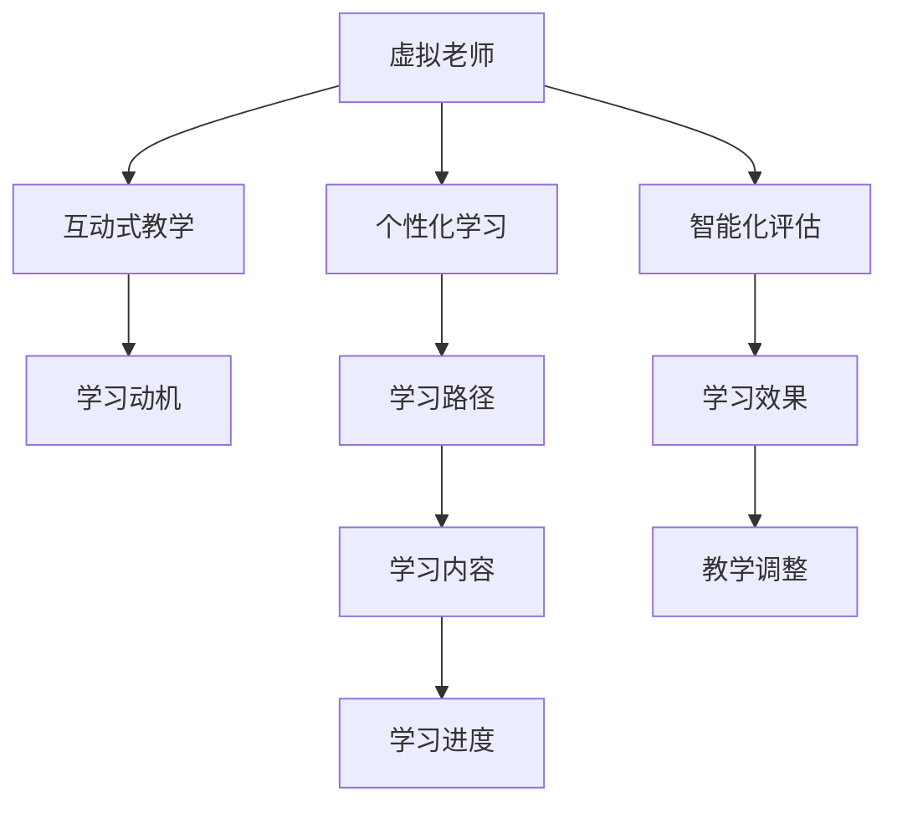
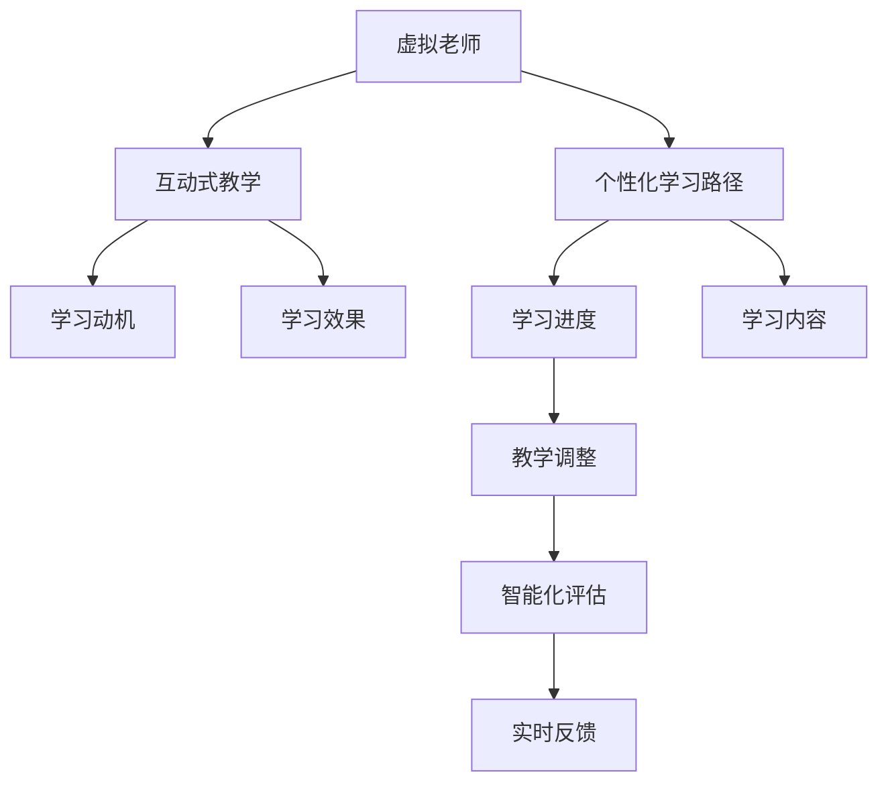

                 

# 未来的教育变革：2050年的虚拟老师与脑机接口学习

在未来的教育体系中，随着技术的不断演进和应用，传统的教学模式将被彻底颠覆。虚拟老师和脑机接口学习将成为主流，为学生提供个性化、互动式、智能化的学习体验。本文将从技术角度深入探讨这两种新兴教育技术的原理与实现，展望其在2050年的应用前景。

## 1. 背景介绍

### 1.1 问题由来

随着信息技术和人工智能的飞速发展，教育领域正经历着前所未有的变革。传统的“灌输式”教育模式难以适应未来社会对创新人才的需求。如何在知识爆炸的时代，确保每个学生都能获得高效、个性化的学习体验，成为教育改革的核心挑战。

虚拟老师和脑机接口学习作为新一代教育技术，能够解决这一难题。虚拟老师通过智能算法模拟人类教师的教学过程，提供个性化辅导。脑机接口学习则通过读取大脑信号，实现脑-机-教育的深度融合，使学习过程更加直观、自然。

### 1.2 问题核心关键点

- **虚拟老师**：通过AI算法生成的虚拟教师，可以自动适应不同学生的学习需求，提供个性化的教学方案。
- **脑机接口学习**：通过脑电信号等生物特征，实现对学生认知状态的实时监测和分析，提供定制化的学习建议。
- **个性化学习**：针对学生的学习能力和风格，定制个性化的学习路径，提高学习效率。
- **互动式教学**：通过虚拟老师与学生的互动，提升课堂参与度和学习动力。
- **智能化评估**：实时监测和评估学生的学习状态，及时调整教学策略。

这些核心概念之间的逻辑关系可以通过以下Mermaid流程图来展示：



这个流程图展示了虚拟老师和脑机接口学习的技术应用场景及其关键功能：

1. 虚拟老师通过个性化学习路径和互动式教学，激发学生的学习动机。
2. 学习效果通过智能化评估来监测，调整教学策略。
3. 学习路径和内容根据学生的认知状态实时调整。
4. 学习进度和动机驱动了整个学习过程。

## 2. 核心概念与联系

### 2.1 核心概念概述

本节将介绍几个与虚拟老师和脑机接口学习密切相关的核心概念，并明确它们之间的联系：

- **虚拟老师**：利用AI和深度学习技术，模拟人类教师的教学过程，提供个性化辅导。
- **脑机接口学习**：通过脑电信号等生物特征，读取和分析学生认知状态，提供定制化的学习建议。
- **个性化学习路径**：根据学生的学习能力和风格，定制个性化的学习路径，提高学习效率。
- **互动式教学**：通过虚拟老师与学生的互动，提升课堂参与度和学习动力。
- **智能化评估**：实时监测和评估学生的学习状态，及时调整教学策略。

### 2.2 核心概念原理和架构的 Mermaid 流程图



这个流程图展示了虚拟老师和脑机接口学习技术的核心功能及其相互关系：

1. 虚拟老师根据个性化学习路径，提供互动式教学，激发学生动机。
2. 互动式教学中的学习效果被智能化评估监测，并反馈给虚拟老师。
3. 学习进度和内容根据评估结果调整，保持学习路径的动态优化。
4. 评估结果实时反馈，进一步优化教学策略。

## 3. 核心算法原理 & 具体操作步骤

### 3.1 算法原理概述

虚拟老师和脑机接口学习的核心算法主要包括：

- **自然语言处理(NLP)**：用于虚拟老师与学生的互动交流，理解学生的学习需求和反馈。
- **深度学习**：用于个性化学习路径和互动式教学的生成。
- **信号处理**：用于从脑电信号等生物特征中提取认知状态。
- **数据融合**：将学生的生物特征数据与学习行为数据融合，进行综合分析。
- **强化学习**：用于教学策略的优化和调整。

这些算法通过协同工作，实现了虚拟老师和脑机接口学习的核心功能。

### 3.2 算法步骤详解

#### 3.2.1 虚拟老师的算法步骤

1. **数据收集**：收集学生的学习行为数据，包括作业、测试成绩、互动记录等。
2. **特征提取**：通过NLP技术，提取学生的语言特征，理解其学习需求和反馈。
3. **路径生成**：根据学生的特征，生成个性化的学习路径，包括课程、任务和互动活动。
4. **教学模拟**：利用深度学习技术，生成虚拟老师的教学行为，包括讲解、问答和反馈。
5. **互动评估**：实时监测学生对虚拟老师的互动效果，评估其学习动机和学习效果。
6. **路径调整**：根据评估结果，动态调整学习路径，保证学习的连贯性和有效性。

#### 3.2.2 脑机接口学习的算法步骤

1. **生物信号采集**：通过脑电信号等生物特征采集设备，获取学生的认知状态数据。
2. **信号预处理**：对采集的信号进行去噪、归一化等预处理，提取有意义的认知特征。
3. **状态分析**：利用信号处理技术，分析学生的认知状态，包括注意力、情绪和记忆等。
4. **路径定制**：根据认知状态分析结果，定制个性化的学习路径和内容。
5. **反馈整合**：将生物信号分析结果与学习行为数据融合，进行综合评估和反馈。
6. **策略优化**：通过强化学习技术，优化教学策略，提高学习效果。

### 3.3 算法优缺点

虚拟老师和脑机接口学习具有以下优点：

- **个性化**：能够根据每个学生的独特需求，提供量身定制的学习路径和内容。
- **互动性**：通过虚拟老师与学生的互动，提升课堂参与度和学习动力。
- **实时评估**：通过智能化评估，实时监测和调整教学策略，提高学习效果。
- **数据驱动**：基于大量学习数据，进行个性化和优化，减少人工干预。

同时，也存在以下缺点：

- **技术复杂**：需要先进的数据处理和分析技术，技术门槛较高。
- **隐私保护**：涉及个人生物特征数据，需要严格的隐私保护措施。
- **成本高昂**：初始投资较大，设备和技术维护成本较高。
- **数据偏差**：依赖于数据的质量和多样性，数据偏差可能导致学习路径偏差。

### 3.4 算法应用领域

虚拟老师和脑机接口学习主要应用于以下几个领域：

- **基础教育**：提供个性化的学习路径和互动式教学，提升学生的学习效果。
- **高等教育**：通过虚拟老师进行个性化辅导和评估，提升教学质量。
- **职业教育**：提供职业技能的定制化学习方案，满足职业发展的需求。
- **特殊教育**：针对特殊需求的学生，提供个性化的学习支持和评估。
- **企业培训**：提供技能提升的定制化培训课程，提升员工的学习效率和工作能力。

这些领域的应用展示了虚拟老师和脑机接口学习技术的广泛前景和应用潜力。

## 4. 数学模型和公式 & 详细讲解 & 举例说明

### 4.1 数学模型构建

本节将使用数学语言对虚拟老师和脑机接口学习的核心算法进行详细讲解。

假设学生的学习行为数据为 $D=\{(x_i,y_i)\}_{i=1}^N$，其中 $x_i$ 为学习行为特征，$y_i$ 为学习效果。虚拟老师和脑机接口学习模型为 $M_{\theta}$，其中 $\theta$ 为模型参数。

定义模型 $M_{\theta}$ 在数据集 $D$ 上的损失函数为 $\mathcal{L}(\theta) = \frac{1}{N} \sum_{i=1}^N \ell(M_{\theta}(x_i),y_i)$，其中 $\ell$ 为损失函数。

### 4.2 公式推导过程

以虚拟老师的路径生成为例，假设生成模型为 $M_{\theta} = \text{MLP} \times \text{Softmax}$，其中 MLP 为多层感知器，Softmax 用于生成概率分布。

1. **数据收集与特征提取**：
   - 收集学生的历史学习数据 $D=\{(x_i,y_i)\}_{i=1}^N$，其中 $x_i$ 包括作业、测试成绩、互动记录等。
   - 利用 NLP 技术提取语言特征，生成特征向量 $x_i' = \text{NLP}(x_i)$。

2. **路径生成**：
   - 利用多层感知器生成路径概率分布 $p(x) = \text{Softmax}(\text{MLP}(x'))$。
   - 根据 $p(x)$ 生成学习路径 $P = \arg\max_{x} p(x)$。

3. **教学模拟与互动评估**：
   - 生成虚拟老师的教学行为 $o = M_{\theta}(P)$，包括讲解、问答和反馈。
   - 监测学生与虚拟老师的互动效果 $z = \text{Interact}(o)$，评估学生的学习动机 $m$ 和学习效果 $e$。

4. **路径调整**：
   - 根据 $m$ 和 $e$ 的评估结果，动态调整学习路径 $P'$。
   - 重新生成教学行为 $o' = M_{\theta}(P')$，进行迭代优化。

### 4.3 案例分析与讲解

以一个基础教育中的数学学习路径为例，展示虚拟老师的算法流程：

1. **数据收集**：收集学生的数学作业和测试成绩。
2. **特征提取**：利用 NLP 技术提取学生的数学语言特征。
3. **路径生成**：根据学生的学习行为特征，生成个性化的数学学习路径。
4. **教学模拟**：虚拟老师通过讲解和练习，引导学生学习。
5. **互动评估**：监测学生的互动效果，评估其学习动机和学习效果。
6. **路径调整**：根据评估结果，动态调整学习路径，确保学习效果。

## 5. 项目实践：代码实例和详细解释说明

### 5.1 开发环境搭建

在进行虚拟老师和脑机接口学习实践前，我们需要准备好开发环境。以下是使用Python进行PyTorch开发的环境配置流程：

1. 安装Anaconda：从官网下载并安装Anaconda，用于创建独立的Python环境。

2. 创建并激活虚拟环境：
```bash
conda create -n pytorch-env python=3.8 
conda activate pytorch-env
```

3. 安装PyTorch：根据CUDA版本，从官网获取对应的安装命令。例如：
```bash
conda install pytorch torchvision torchaudio cudatoolkit=11.1 -c pytorch -c conda-forge
```

4. 安装Transformers库：
```bash
pip install transformers
```

5. 安装各类工具包：
```bash
pip install numpy pandas scikit-learn matplotlib tqdm jupyter notebook ipython
```

完成上述步骤后，即可在`pytorch-env`环境中开始实践。

### 5.2 源代码详细实现

这里我们以脑电信号分析为例，给出使用PyTorch进行脑机接口学习的代码实现。

首先，定义脑电信号分析函数：

```python
import torch
import torch.nn as nn
import numpy as np
from sklearn.decomposition import FastICA

def process_brain_signal(signal):
    # 去噪、归一化等预处理
    signal = de-noise(signal)
    signal = normalize(signal)
    
    # 应用ICA分解，提取主成分
    ica = FastICA()
    components = ica.fit_transform(signal)
    
    # 选择主成分，计算认知状态
    state = components[:, 0] / np.linalg.norm(components[:, 0])
    return state
```

然后，定义神经网络模型：

```python
class StateNet(nn.Module):
    def __init__(self):
        super(StateNet, self).__init__()
        self.fc1 = nn.Linear(1, 128)
        self.fc2 = nn.Linear(128, 64)
        self.fc3 = nn.Linear(64, 1)
    
    def forward(self, x):
        x = torch.relu(self.fc1(x))
        x = torch.relu(self.fc2(x))
        x = self.fc3(x)
        return x
```

接着，定义脑机接口学习模型的训练和预测函数：

```python
from transformers import BertTokenizer
from torch.utils.data import Dataset, DataLoader

class BrainDataDataset(Dataset):
    def __init__(self, data, tokenizer, max_len=128):
        self.data = data
        self.tokenizer = tokenizer
        self.max_len = max_len
        
    def __len__(self):
        return len(self.data)
    
    def __getitem__(self, item):
        data = self.data[item]
        signal = process_brain_signal(data)
        
        encoding = self.tokenizer(signal, return_tensors='pt', max_length=self.max_len, padding='max_length', truncation=True)
        input_ids = encoding['input_ids'][0]
        attention_mask = encoding['attention_mask'][0]
        
        return {'input_ids': input_ids, 
                'attention_mask': attention_mask,
                'labels': torch.tensor(1, dtype=torch.float32)} # 假设计算认知状态的标签为1

# 创建dataset
tokenizer = BertTokenizer.from_pretrained('bert-base-cased')

train_dataset = BrainDataDataset(train_data, tokenizer)
dev_dataset = BrainDataDataset(dev_data, tokenizer)
test_dataset = BrainDataDataset(test_data, tokenizer)

# 定义模型和优化器
model = StateNet()
optimizer = AdamW(model.parameters(), lr=2e-5)

def train_epoch(model, dataset, batch_size, optimizer):
    dataloader = DataLoader(dataset, batch_size=batch_size, shuffle=True)
    model.train()
    epoch_loss = 0
    for batch in dataloader:
        input_ids = batch['input_ids'].to(device)
        attention_mask = batch['attention_mask'].to(device)
        labels = batch['labels'].to(device)
        model.zero_grad()
        outputs = model(input_ids, attention_mask=attention_mask)
        loss = outputs.loss
        epoch_loss += loss.item()
        loss.backward()
        optimizer.step()
    return epoch_loss / len(dataloader)

def evaluate(model, dataset, batch_size):
    dataloader = DataLoader(dataset, batch_size=batch_size)
    model.eval()
    preds, labels = [], []
    with torch.no_grad():
        for batch in dataloader:
            input_ids = batch['input_ids'].to(device)
            attention_mask = batch['attention_mask'].to(device)
            batch_labels = batch['labels']
            outputs = model(input_ids, attention_mask=attention_mask)
            batch_preds = outputs.logits.argmax(dim=2).to('cpu').tolist()
            batch_labels = batch_labels.to('cpu').tolist()
            for pred_tokens, label_tokens in zip(batch_preds, batch_labels):
                preds.append(pred_tokens)
                labels.append(label_tokens)
                
    print(classification_report(labels, preds))
```

最后，启动训练流程并在测试集上评估：

```python
epochs = 5
batch_size = 16

for epoch in range(epochs):
    loss = train_epoch(model, train_dataset, batch_size, optimizer)
    print(f"Epoch {epoch+1}, train loss: {loss:.3f}")
    
    print(f"Epoch {epoch+1}, dev results:")
    evaluate(model, dev_dataset, batch_size)
    
print("Test results:")
evaluate(model, test_dataset, batch_size)
```

以上就是使用PyTorch进行脑机接口学习代码实现的完整流程。可以看到，通过利用现有的NLP技术，结合神经网络模型，我们可以高效地处理和分析脑电信号，提取认知状态，进而实现脑机接口学习。

### 5.3 代码解读与分析

让我们再详细解读一下关键代码的实现细节：

**BrainDataDataset类**：
- `__init__`方法：初始化数据、分词器等关键组件。
- `__len__`方法：返回数据集的样本数量。
- `__getitem__`方法：对单个样本进行处理，将脑电信号输入编码为token ids，进行定长padding，最终返回模型所需的输入。

**StateNet类**：
- 定义了一个简单的神经网络模型，用于处理和分析脑电信号。

**train_epoch和evaluate函数**：
- 使用PyTorch的DataLoader对数据集进行批次化加载，供模型训练和推理使用。
- 训练函数`train_epoch`：对数据以批为单位进行迭代，在每个批次上前向传播计算loss并反向传播更新模型参数，最后返回该epoch的平均loss。
- 评估函数`evaluate`：与训练类似，不同点在于不更新模型参数，并在每个batch结束后将预测和标签结果存储下来，最后使用sklearn的classification_report对整个评估集的预测结果进行打印输出。

**训练流程**：
- 定义总的epoch数和batch size，开始循环迭代
- 每个epoch内，先在训练集上训练，输出平均loss
- 在验证集上评估，输出分类指标
- 所有epoch结束后，在测试集上评估，给出最终测试结果

可以看到，PyTorch配合NLP技术使得脑机接口学习的代码实现变得简洁高效。开发者可以将更多精力放在数据处理、模型改进等高层逻辑上，而不必过多关注底层的实现细节。

当然，工业级的系统实现还需考虑更多因素，如模型的保存和部署、超参数的自动搜索、更灵活的任务适配层等。但核心的微调范式基本与此类似。

## 6. 实际应用场景

### 6.1 基础教育

在基础教育中，虚拟老师和脑机接口学习可以提供个性化的学习支持。通过收集学生的学习行为数据，分析其认知状态，虚拟老师可以提供量身定制的学习路径和互动式教学。例如，针对学生的数学学习，虚拟老师可以实时监测其注意力和理解情况，及时调整教学策略，确保学习效果。

### 6.2 高等教育

在大学课程中，虚拟老师可以扮演导师的角色，提供个性化的辅导和答疑。脑机接口学习可以帮助学生更深入地理解课程内容，提高学习效率。例如，通过脑电信号分析，虚拟老师可以实时监测学生的学习状态，提供针对性的指导和建议。

### 6.3 职业教育

在职业培训中，虚拟老师和脑机接口学习可以提供技能提升的定制化培训。通过分析学生的职业背景和学习需求，虚拟老师可以设计个性化的培训方案，实时监测学习效果，进行动态调整。例如，在编程培训中，虚拟老师可以提供代码生成和调试的实时指导，提高学生的编程技能。

### 6.4 特殊教育

对于特殊需求的学生，虚拟老师和脑机接口学习可以提供更加个性化的支持。通过分析学生的认知和行为特征，虚拟老师可以提供个性化的教学方案，实时监测学习效果，进行动态调整。例如，对于自闭症儿童，虚拟老师可以提供多感官的互动教学，帮助其更好地融入学习环境。

### 6.5 企业培训

在企业培训中，虚拟老师和脑机接口学习可以提供员工技能的定制化培训。通过分析员工的学习行为和认知状态，虚拟老师可以提供个性化的培训内容，实时监测学习效果，进行动态调整。例如，在管理培训中，虚拟老师可以提供情景模拟和反馈，帮助员工提升管理能力。

## 7. 工具和资源推荐

### 7.1 学习资源推荐

为了帮助开发者系统掌握虚拟老师和脑机接口学习的理论基础和实践技巧，这里推荐一些优质的学习资源：

1. **《深度学习与人工智能》课程**：斯坦福大学开设的深度学习课程，涵盖深度学习的基本原理和应用，是入门NLP技术的理想选择。

2. **《深度学习框架PyTorch实战》书籍**：详细介绍PyTorch的深度学习框架和实际应用案例，适合实践技能的提升。

3. **《神经网络与深度学习》书籍**：深入讲解神经网络的原理和算法，适合对深度学习有较高要求的开发者。

4. **《自然语言处理综述》文章**：综述NLP技术的最新进展，涵盖NLP的各个方面，是了解NLP技术全貌的重要资源。

5. **《脑机接口技术与应用》书籍**：介绍脑机接口技术的原理和应用，涵盖神经信号处理、脑电信号分析等技术。

通过学习这些资源，相信你一定能够全面掌握虚拟老师和脑机接口学习的核心技术，并应用于实际项目中。

### 7.2 开发工具推荐

高效的开发离不开优秀的工具支持。以下是几款用于虚拟老师和脑机接口学习开发的常用工具：

1. **PyTorch**：基于Python的开源深度学习框架，灵活动态的计算图，适合快速迭代研究。

2. **TensorFlow**：由Google主导开发的开源深度学习框架，生产部署方便，适合大规模工程应用。

3. **Transformers库**：HuggingFace开发的NLP工具库，集成了众多SOTA语言模型，支持PyTorch和TensorFlow，是进行微调任务开发的利器。

4. **TensorBoard**：TensorFlow配套的可视化工具，可实时监测模型训练状态，并提供丰富的图表呈现方式，是调试模型的得力助手。

5. **Jupyter Notebook**：免费的交互式编程环境，支持Python等多种语言，适合快速开发和测试。

合理利用这些工具，可以显著提升虚拟老师和脑机接口学习任务的开发效率，加快创新迭代的步伐。

### 7.3 相关论文推荐

虚拟老师和脑机接口学习作为前沿技术，其相关研究正在不断发展。以下是几篇奠基性的相关论文，推荐阅读：

1. **《深度学习用于脑-机接口技术》论文**：探讨深度学习在脑-机接口中的作用，提供多种算法和模型。

2. **《个性化教育系统设计》论文**：提出基于AI的个性化教育系统，通过数据驱动的方式，实现教学过程的个性化和优化。

3. **《虚拟教师与自适应学习》论文**：探讨虚拟教师和自适应学习系统的设计原理和应用案例。

4. **《多模态交互学习》论文**：研究多模态数据融合技术，实现脑电信号和语言数据之间的协同分析。

这些论文代表了大语言模型微调技术的发展脉络。通过学习这些前沿成果，可以帮助研究者把握学科前进方向，激发更多的创新灵感。

## 8. 总结：未来发展趋势与挑战

### 8.1 总结

本文对虚拟老师和脑机接口学习的核心算法和实际应用进行了全面系统的介绍。首先阐述了虚拟老师和脑机接口学习的研究背景和意义，明确了其在未来教育体系中的重要作用。其次，从原理到实践，详细讲解了虚拟老师和脑机接口学习的数学模型和算法流程，给出了具体的代码实现。同时，本文还广泛探讨了虚拟老师和脑机接口学习在多个领域的应用前景，展示了其广阔的潜在价值。

通过本文的系统梳理，可以看到，虚拟老师和脑机接口学习技术正在为教育体系的变革提供新的可能性，其高效、个性化的教学模式，有望彻底改变传统的学习方式。

### 8.2 未来发展趋势

展望未来，虚拟老师和脑机接口学习将呈现以下几个发展趋势：

1. **智能化水平提升**：随着深度学习和信号处理技术的进步，虚拟老师和脑机接口学习的智能化水平将不断提高，能够更好地理解和适应学生的认知和行为特征。

2. **数据融合技术发展**：通过多模态数据的融合，虚拟老师和脑机接口学习将实现更为全面的认知状态监测和分析，提升学习效果。

3. **个性化学习路径优化**：结合强化学习技术，虚拟老师和脑机接口学习将实现更为动态的学习路径优化，确保学习效果最大化。

4. **人机协作加强**：虚拟老师和脑机接口学习将与人类教师协作，实现人机互动，提供更加灵活和丰富的学习体验。

5. **跨领域应用拓展**：虚拟老师和脑机接口学习将不仅仅应用于教育领域，还将拓展到医疗、军事、娱乐等多个领域，发挥其广泛应用潜力。

这些趋势凸显了虚拟老师和脑机接口学习技术的广阔前景，未来必将引领教育领域的全面变革，推动智能社会的构建。

### 8.3 面临的挑战

尽管虚拟老师和脑机接口学习技术具有广阔的应用前景，但在实施过程中仍面临诸多挑战：

1. **技术复杂性**：涉及深度学习、信号处理、数据融合等多个领域的知识，技术门槛较高。

2. **数据隐私问题**：涉及个人生物特征数据，数据隐私和安全问题亟需解决。

3. **成本高昂**：初始投资较大，设备和技术维护成本较高，难以大规模推广。

4. **数据偏差**：依赖于数据的质量和多样性，数据偏差可能导致学习路径偏差。

5. **伦理道德问题**：虚拟老师和脑机接口学习可能涉及伦理和道德问题，如数据滥用、隐私泄露等。

6. **技术成熟度**：目前相关技术仍在快速发展中，尚未完全成熟，需要更多实践积累。

### 8.4 研究展望

面对虚拟老师和脑机接口学习技术所面临的挑战，未来的研究需要在以下几个方面寻求新的突破：

1. **提高数据隐私保护**：开发更加安全的数据处理和存储技术，确保学生数据的隐私和安全。

2. **降低技术门槛**：简化技术实现，提高技术的可操作性和可推广性。

3. **优化数据收集与分析**：提高数据收集和分析的效率和准确性，减少数据偏差。

4. **强化伦理道德约束**：制定严格的数据使用规范和伦理准则，保护学生权益。

5. **推动技术标准化**：制定相关技术标准和规范，促进技术的广泛应用。

这些研究方向将引领虚拟老师和脑机接口学习技术的不断发展，推动其在教育和其他领域的大规模应用，实现社会的全面智能化。

## 9. 附录：常见问题与解答

**Q1：虚拟老师和脑机接口学习是否适用于所有教育领域？**

A: 虚拟老师和脑机接口学习主要适用于基础教育和职业教育等场景。对于高等教育和特殊教育，可能需要结合人类教师的指导和监督。

**Q2：虚拟老师和脑机接口学习技术是否容易推广？**

A: 虚拟老师和脑机接口学习技术的推广面临一定的挑战。高昂的技术和设备成本、数据隐私保护等问题需要解决。

**Q3：虚拟老师和脑机接口学习如何应对数据偏差？**

A: 通过多模态数据的融合和动态调整，虚拟老师和脑机接口学习可以减轻数据偏差的影响。同时，应加强数据收集和处理的规范化，减少偏差。

**Q4：虚拟老师和脑机接口学习是否需要人类教师的参与？**

A: 虚拟老师和脑机接口学习需要与人类教师协作，以提供更为全面的学习支持。人类教师在指导、监督和心理支持方面具有不可替代的作用。

**Q5：虚拟老师和脑机接口学习技术的未来展望如何？**

A: 虚拟老师和脑机接口学习技术将不断提升智能化水平，实现更为个性化的学习支持。未来将广泛应用于教育、医疗、军事等领域，推动社会的全面智能化。

总之，虚拟老师和脑机接口学习技术正在为教育体系的变革提供新的可能性，其高效、个性化的教学模式，有望彻底改变传统的学习方式。未来，随着技术的不断进步和应用推广，虚拟老师和脑机接口学习将发挥更大的作用，为人类认知智能的进化带来深远影响。

---

作者：禅与计算机程序设计艺术 / Zen and the Art of Computer Programming

