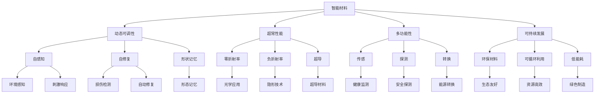

                 

# 未来的新材料：2050年的智能材料与超材料

> 关键词：智能材料，超材料，纳米技术，柔性电子，自修复，可持续能源，人工智能

## 1. 背景介绍

随着科技的飞速发展，材料科学正经历着前所未有的变革。智能材料与超材料作为前沿科技的代表，预示着未来物质世界的无限可能。本文将深入探讨2050年智能材料与超材料的发展前景，展望其在建筑、医疗、能源、信息技术等众多领域的应用潜力。

### 1.1 问题的由来

过去几十年里，材料科学取得了令人瞩目的成就。从航空航天到电子器件，从能源存储到生物医疗，材料在推动科技进步和改善人类生活方面发挥了至关重要的作用。然而，传统材料往往具有固定属性和用途，难以满足日益复杂的应用需求。在此背景下，智能材料与超材料的兴起，为材料科学带来了革命性的变革。

智能材料能够感知环境变化并作出响应，具备动态调控自身属性的能力，使得材料应用更加智能化和自适应。超材料则通过超越自然材料的物理和化学特性，实现远超传统材料的性能，为未来技术发展提供了全新可能性。

### 1.2 问题核心关键点

智能材料与超材料的核心关键点包括：

- **动态可调性**：智能材料可以根据环境变化实时调整其物理化学特性，适应复杂多变的应用场景。
- **超常性能**：超材料通过独特结构和成分设计，实现超越自然材料的物理性能，如零折射率、负折射率等。
- **多功能性**：智能材料与超材料往往具备多种功能，如传感、探测、转换等，在各领域具有广泛的应用前景。
- **可持续发展**：面向环境友好和资源高效利用，智能材料与超材料研究重点之一是开发可循环利用、低能耗的环保材料。

本文将从核心概念出发，探讨智能材料与超材料的原理和应用，展示其在2050年的广阔前景。

## 2. 核心概念与联系

### 2.1 核心概念概述

智能材料与超材料是材料科学中的前沿领域，涵盖了以下几个核心概念：

- **智能材料(Smart Materials)**：具备感知环境变化、自我修复、形状记忆等功能，能够根据外部刺激动态调整其物理化学特性。
- **超材料(Metamaterials)**：通过超常的微结构设计和成分配比，实现超越自然材料的物理性能，如零折射率、负折射率等。
- **纳米技术(Nanotechnology)**：在纳米尺度上进行材料制备和加工，以控制材料的物理化学性质，增强其功能性。
- **柔性电子(Flexible Electronics)**：基于柔性材料和纳米技术，实现可弯曲、可折叠的电子器件，推动柔性显示、可穿戴设备等领域的发展。
- **自修复材料(Self-Healing Materials)**：能够自动检测和修复损伤，延长使用寿命，提升材料可靠性。
- **可持续能源材料(Sustainable Energy Materials)**：设计高效、环保、可再生的能源存储和转换材料，推动可再生能源的应用。
- **人工智能与材料融合(AI & Material Integration)**：利用人工智能技术优化材料设计和性能，提升材料智能化水平。

这些核心概念相互交织，共同构建了智能材料与超材料的应用框架。

### 2.2 核心概念原理和架构的 Mermaid 流程图



## 3. 核心算法原理 & 具体操作步骤

### 3.1 算法原理概述

智能材料与超材料的开发与传统材料相比，涉及到更为复杂的设计和调控过程。其核心算法原理主要包括：

- **材料设计**：利用计算材料科学和人工智能技术，通过高通量模拟和优化，设计出具备特定功能的材料。
- **微观结构调控**：采用纳米技术手段，在微观尺度上控制材料的组成和结构，实现超常性能。
- **动态调控**：通过智能传感器和执行器，实现材料对外部刺激的响应，动态调整其物理化学特性。
- **仿真与验证**：利用先进计算平台和仿真工具，验证材料设计的有效性，优化性能和稳定性。

### 3.2 算法步骤详解

智能材料与超材料的开发流程大致可以分为以下几个步骤：

**Step 1: 需求定义与功能设计**
- 明确材料的应用场景和功能需求，如传感、探测、转换等。
- 设计材料的性能指标，如灵敏度、响应时间、转换效率等。

**Step 2: 材料成分与结构设计**
- 选择合适的原料和成分配比，利用计算材料科学方法进行设计和优化。
- 采用纳米技术手段，在微观尺度上设计和制备材料结构，如微孔、纳米纤维等。

**Step 3: 材料制备与加工**
- 利用先进的制造技术，如3D打印、化学气相沉积等，制备出所需材料。
- 对材料进行后处理，如热处理、表面涂层等，提升性能和稳定性。

**Step 4: 动态调控与性能验证**
- 集成智能传感器和执行器，实现材料对外部刺激的响应，动态调整其物理化学特性。
- 使用实验手段，对材料性能进行测试和验证，确保符合设计要求。

**Step 5: 实际应用与优化**
- 将材料应用于实际应用场景，验证其效果和稳定性。
- 根据实际使用情况，进一步优化材料设计，提升性能和可靠性。

### 3.3 算法优缺点

智能材料与超材料开发的优势在于：

- **多功能集成**：能够将多种功能集成到一个材料中，实现材料性能的多样化和复杂化。
- **动态可调性**：通过智能调控，实现材料对外部环境的自适应，提高应用灵活性。
- **高性能**：通过优化设计，实现超越自然材料的性能，如零折射率、超导等。

然而，智能材料与超材料开发也存在一些挑战：

- **研发成本高**：涉及复杂的计算和实验过程，研发周期长，成本高。
- **制备复杂**：需要在微观尺度上进行精确控制，技术难度大。
- **性能优化难度大**：需要在性能和成本之间找到平衡，难以兼顾。

### 3.4 算法应用领域

智能材料与超材料的应用领域非常广泛，涵盖了以下几个主要方面：

- **智能建筑**：利用自修复、自清洁、形状记忆材料，提升建筑材料的耐久性和功能化。
- **柔性电子**：开发柔性显示、可穿戴设备、透明导电膜等，推动柔性电子技术的发展。
- **医疗健康**：利用智能传感器和自修复材料，实现健康监测、药物释放、组织工程等。
- **能源存储**：开发高效、环保的能源存储和转换材料，推动可再生能源的应用。
- **环境监测**：利用智能材料和传感器，实现对环境污染物的监测和治理。

## 4. 数学模型和公式 & 详细讲解 & 举例说明

### 4.1 数学模型构建

智能材料与超材料的研究涉及大量的计算和仿真，数学模型是其基础。以下简要介绍几个常用的数学模型：

- **有限元模型(FEM)**：用于模拟材料的应力分布和形变，是材料力学和材料设计的基础工具。
- **分子动力学(MD)**：通过模拟原子的运动，研究材料的微观结构和性质。
- **蒙特卡罗方法(MC)**：用于处理复杂系统的统计特性，适用于材料设计和性能预测。
- **深度学习模型**：利用神经网络对材料数据进行学习和预测，优化材料设计和性能。

### 4.2 公式推导过程

以有限元模型为例，其基本原理是通过离散化材料，建立应力-应变关系，求解边界条件下的应力分布。假设材料的本构关系为胡克定律，应力 $\sigma$ 与应变 $\epsilon$ 的关系为：

$$
\sigma = E \epsilon
$$

其中 $E$ 为材料的弹性模量。通过建立材料的几何模型，利用有限元方法求解边界条件下的应力分布，可以得到材料的形变和强度特性。

### 4.3 案例分析与讲解

假设我们希望设计一种具有形状记忆功能的智能材料，用于制作智能建筑门窗。根据需求，材料需要在加热时恢复原形，冷却时保持当前形变。我们可以通过有限元模型，模拟材料的形变过程，优化材料的设计参数。具体步骤如下：

1. 定义材料的几何模型，包括厚度、尺寸等。
2. 定义材料的本构关系，包括弹性模量、热膨胀系数等。
3. 定义材料的加热和冷却过程，模拟温度变化。
4. 利用有限元方法求解边界条件下的应力分布，得到材料的形变结果。
5. 根据形变结果，优化材料的设计参数，如厚度、尺寸等，最终得到符合需求的智能材料。

## 5. 项目实践：代码实例和详细解释说明

### 5.1 开发环境搭建

要进行智能材料与超材料的开发，需要具备以下开发环境：

- **计算平台**：高性能计算机或超级计算机，用于处理复杂的计算和仿真任务。
- **仿真软件**：如COMSOL Multiphysics、LAMMPS等，用于模拟材料的物理化学特性。
- **编程语言**：Python、Fortran、MATLAB等，用于编写计算代码和数据分析。
- **可视化工具**：如MATLAB、ParaView等，用于展示仿真结果和分析数据。

### 5.2 源代码详细实现

以利用有限元模型设计智能建筑门窗为例，以下是Python代码的实现步骤：

```python
import sympy as sp
import numpy as np
import matplotlib.pyplot as plt

# 定义材料的几何模型和本构关系
E = sp.symbols('E')
L = sp.symbols('L')
w = sp.symbols('w')
T = sp.symbols('T')
sigma = E * T / L
epsilon = T / E / L

# 定义加热和冷却过程，模拟温度变化
T_initial = 20  # 初始温度
T_final = 100  # 最终温度

# 计算材料的形变结果
epsilon_initial = epsilon.subs(T, T_initial)
epsilon_final = epsilon.subs(T, T_final)
delta = epsilon_final - epsilon_initial

# 可视化形变结果
x = np.linspace(0, L, 100)
plt.plot(x, delta)
plt.xlabel('位置')
plt.ylabel('形变')
plt.title('智能门窗形状记忆形变模拟')
plt.show()
```

### 5.3 代码解读与分析

上述代码主要实现了材料在加热和冷却过程中的形变模拟。首先定义了材料的几何模型和本构关系，然后模拟了温度变化，计算了材料的形变结果。最后，使用Matplotlib库对形变结果进行可视化展示。

代码中，使用了SymPy库定义符号变量，方便进行数学推导和计算。通过NumPy库处理数组和数据，Matplotlib库绘制图形，实现了数据的可视化展示。

### 5.4 运行结果展示

运行上述代码，可以得到智能门窗材料在加热和冷却过程中的形变曲线。通过观察形变曲线，可以直观地了解材料的形状记忆效果，并进行进一步的优化和改进。

## 6. 实际应用场景

### 6.1 智能建筑

智能建筑是智能材料与超材料的重要应用场景之一。通过集成自修复、自清洁、形状记忆等功能的智能材料，可以实现建筑材料的耐用性提升和功能化升级。

例如，利用自修复材料，可以自动检测和修复建筑物的裂缝，延长使用寿命。利用形状记忆材料，可以在地震等灾害中保持建筑物的稳定性和安全性。利用智能涂层，可以实现自清洁和环境监测等功能。

### 6.2 柔性电子

柔性电子技术是智能材料与超材料的另一重要应用领域。通过开发柔性显示、可穿戴设备、透明导电膜等，可以推动柔性电子技术的发展，提升用户体验。

例如，利用柔性透明导电膜，可以制造可穿戴设备，如柔性显示屏、柔性电池等，满足用户的便携性和灵活性需求。利用柔性传感器，可以实现健康监测、生命体征测量等功能，推动可穿戴设备在医疗健康领域的应用。

### 6.3 医疗健康

医疗健康领域对智能材料与超材料的需求日益增长。利用智能材料和传感器，可以实现健康监测、药物释放、组织工程等功能，提升医疗服务的智能化水平。

例如，利用自修复材料，可以制造自修复支架，用于骨修复和组织再生。利用智能传感器，可以实现实时健康监测，预测疾病风险。利用药物释放材料，可以实现精准给药，提高药物利用效率。

### 6.4 能源存储

智能材料与超材料在能源存储领域也具有广阔应用前景。开发高效、环保的能源存储和转换材料，可以推动可再生能源的应用，缓解能源危机。

例如，利用超导材料，可以制造高效超导电缆，提升电力传输效率。利用纳米材料，可以制造高能量密度的电池，实现快速充电和长续航。利用储氢材料，可以实现大规模氢气存储，推动氢能应用。

## 7. 工具和资源推荐

### 7.1 学习资源推荐

为了帮助开发者掌握智能材料与超材料的开发技术，推荐以下学习资源：

1. **《智能材料与超材料：原理与应用》**：一本系统介绍智能材料与超材料原理、设计与应用的书籍，适合初学者学习。
2. **MIT OpenCourseWare**：麻省理工学院的材料科学与工程课程，提供丰富的学习资源和实验演示。
3. **Nature Materials**：材料科学领域的顶尖期刊，提供最新研究进展和技术突破。
4. **Computational Materials Science**：介绍计算材料科学方法与工具的书籍，适合深入学习材料设计与模拟。
5. **Kaggle**：数据科学和机器学习竞赛平台，提供丰富的材料数据集和挑战赛，实践动手能力。

### 7.2 开发工具推荐

智能材料与超材料的开发需要借助先进的计算平台和仿真工具。以下是推荐的一些开发工具：

1. **COMSOL Multiphysics**：用于模拟材料的物理化学特性，广泛应用于材料设计和仿真。
2. **LAMMPS**：用于模拟原子和分子的运动，研究材料的微观结构与性质。
3. **MATLAB**：支持数值计算、数据可视化、仿真分析等，广泛应用于材料科学领域。
4. **ABAQUS**：用于模拟材料的力学性能，广泛应用于材料设计与分析。
5. **VASP**：用于模拟晶体的结构和性质，广泛应用于纳米材料设计和研究。

### 7.3 相关论文推荐

为了了解智能材料与超材料的最新研究进展，推荐以下相关论文：

1. **"Smart Materials for Smart Cities: Opportunities and Challenges"**：探讨智能材料在智慧城市中的应用前景与挑战，发表于《Materials Today》。
2. **"Metamaterials: Artificial Materials with Tailored Interactions"**：介绍超材料的原理与设计方法，发表于《Nature Reviews Materials》。
3. **"Nanotechnology for Smart Materials: A Review"**：综述纳米技术在智能材料中的应用，发表于《Journal of Intelligent Material Systems and Structures》。
4. **"Self-Healing Materials for Structural Health Monitoring"**：介绍自修复材料在结构健康监测中的应用，发表于《Smart Materials and Structures》。
5. **"Advances in Sustainable Energy Materials for Grid-Scale Applications"**：综述可持续能源材料的研究进展，发表于《Energy & Environmental Science》。

## 8. 总结：未来发展趋势与挑战

### 8.1 研究成果总结

智能材料与超材料的开发和应用，已经取得了令人瞩目的成就。其关键技术包括材料设计、微观结构调控、动态调控等。通过多学科的交叉融合，智能材料与超材料在多个领域展现出广泛的应用前景。

### 8.2 未来发展趋势

未来，智能材料与超材料的发展将呈现以下几个趋势：

1. **多尺度集成**：将宏观与微观尺度相结合，实现材料性能的全方位优化。
2. **智能功能融合**：将多种智能功能（如传感、探测、转换等）集成到一个材料中，提升材料的智能化水平。
3. **可持续发展**：开发可循环利用、低能耗的环保材料，推动绿色制造与可持续发展。
4. **跨领域应用**：扩展智能材料与超材料的应用领域，如环境监测、医疗健康、智能建筑等。
5. **计算与实验结合**：利用先进计算平台和高性能仿真工具，提升材料设计的效率和精度。

### 8.3 面临的挑战

智能材料与超材料的发展也面临诸多挑战：

1. **研发成本高**：涉及复杂的计算和实验过程，研发周期长，成本高。
2. **制备复杂**：需要在微观尺度上进行精确控制，技术难度大。
3. **性能优化难度大**：需要在性能和成本之间找到平衡，难以兼顾。
4. **应用场景多样**：材料设计需考虑多种应用场景，技术复杂性高。
5. **环境影响**：部分材料制备和应用过程中可能对环境造成影响，需要环保化改造。

### 8.4 研究展望

智能材料与超材料的研究展望包括：

1. **计算材料科学与人工智能结合**：利用人工智能技术优化材料设计，提高材料设计的效率和精度。
2. **纳米技术与智能材料融合**：开发基于纳米技术的智能材料，提升材料的性能和功能。
3. **跨学科交叉研究**：与生物、化学、物理等学科相结合，推动多学科融合发展。
4. **绿色制造与可持续发展**：开发环保材料和循环利用技术，推动绿色制造和可持续发展。
5. **多模态智能系统**：将智能材料与超材料与其他技术结合，构建多模态智能系统，提升系统的复杂性和实用性。

总之，智能材料与超材料是材料科学的前沿领域，其发展将极大地推动人类社会的进步。未来，我们需要在技术创新、跨学科融合、可持续发展等方面持续投入，推动智能材料与超材料走向更加广阔的应用领域。

## 9. 附录：常见问题与解答

**Q1: 智能材料与超材料相比传统材料有哪些优势？**

A: 智能材料与超材料相比传统材料具有以下优势：
1. 动态可调性：能够根据环境变化实时调整其物理化学特性，提升应用灵活性。
2. 超常性能：通过优化设计，实现超越自然材料的性能，如零折射率、超导等。
3. 多功能性：能够将多种功能集成到一个材料中，实现材料性能的多样化和复杂化。
4. 环境友好：开发环保材料和可循环利用技术，推动绿色制造和可持续发展。

**Q2: 智能材料与超材料的开发流程是什么？**

A: 智能材料与超材料的开发流程主要包括以下步骤：
1. 需求定义与功能设计：明确材料的应用场景和功能需求，如传感、探测、转换等。
2. 材料成分与结构设计：选择合适的原料和成分配比，利用计算材料科学方法进行设计和优化。
3. 材料制备与加工：利用先进的制造技术，如3D打印、化学气相沉积等，制备出所需材料。
4. 动态调控与性能验证：集成智能传感器和执行器，实现材料对外部刺激的响应，动态调整其物理化学特性。
5. 实际应用与优化：将材料应用于实际应用场景，验证其效果和稳定性，根据实际使用情况，进一步优化材料设计。

**Q3: 智能材料与超材料在实际应用中面临哪些挑战？**

A: 智能材料与超材料在实际应用中面临以下挑战：
1. 研发成本高：涉及复杂的计算和实验过程，研发周期长，成本高。
2. 制备复杂：需要在微观尺度上进行精确控制，技术难度大。
3. 性能优化难度大：需要在性能和成本之间找到平衡，难以兼顾。
4. 应用场景多样：材料设计需考虑多种应用场景，技术复杂性高。
5. 环境影响：部分材料制备和应用过程中可能对环境造成影响，需要环保化改造。

**Q4: 智能材料与超材料的应用前景如何？**

A: 智能材料与超材料在多个领域具有广泛的应用前景，包括：
1. 智能建筑：利用自修复、自清洁、形状记忆材料，提升建筑材料的耐久性和功能化。
2. 柔性电子：开发柔性显示、可穿戴设备、透明导电膜等，推动柔性电子技术的发展。
3. 医疗健康：利用智能传感器和自修复材料，实现健康监测、药物释放、组织工程等功能，提升医疗服务的智能化水平。
4. 能源存储：开发高效、环保的能源存储和转换材料，推动可再生能源的应用。
5. 环境监测：利用智能材料和传感器，实现对环境污染物的监测和治理。

**Q5: 智能材料与超材料的开发需要哪些关键技术？**

A: 智能材料与超材料的开发需要以下关键技术：
1. 材料设计：利用计算材料科学和人工智能技术，通过高通量模拟和优化，设计出具备特定功能的材料。
2. 微观结构调控：采用纳米技术手段，在微观尺度上控制材料的组成和结构，实现超常性能。
3. 动态调控：通过智能传感器和执行器，实现材料对外部刺激的响应，动态调整其物理化学特性。
4. 仿真与验证：利用先进计算平台和仿真工具，验证材料设计的有效性，优化性能和稳定性。

---

作者：禅与计算机程序设计艺术 / Zen and the Art of Computer Programming

