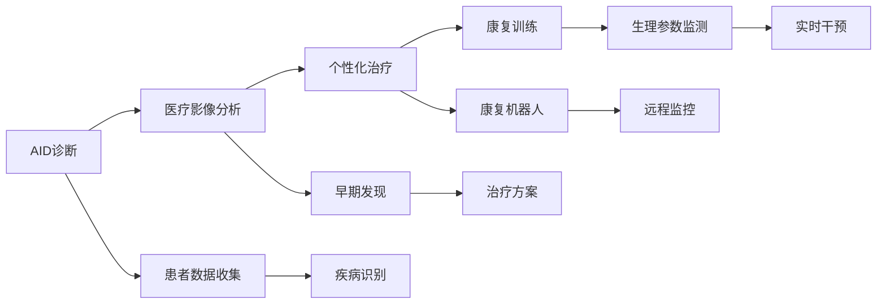

                 

# 未来的智慧医疗：2050年的AI辅助诊断与智能康复机器人

## 1. 背景介绍

### 1.1 问题由来
随着医疗技术的不断进步，未来的智慧医疗将变得更加智能、高效、个性化。人工智能(AI)技术，尤其是深度学习与大数据的结合，正在改变传统医疗的许多方面，从早期诊断、个性化治疗到智能康复，AI辅助医疗正逐渐成为主流。特别是随着物联网(IoT)和可穿戴设备的普及，医疗数据变得更加丰富和精细，为AI的介入提供了广阔的空间。

### 1.2 问题核心关键点
本文旨在探讨2050年人工智能在医疗领域的未来应用，特别是AI辅助诊断和智能康复机器人的发展趋势。我们将深入探讨以下核心关键点：
1. AI辅助诊断技术的演进：包括深度学习模型的发展、医疗影像的自动识别与分析、以及个性化诊断路径的建立。
2. 智能康复机器人的革新：包括机器人手术、康复训练、远程监控与干预等技术的发展。
3. 数据与隐私保护：如何在智能化医疗中平衡数据利用的最大化与隐私保护的严格性。
4. 伦理与法规：面对AI医疗应用，如何制定合理的伦理规范与法规框架，确保技术的透明性与安全性。
5. 未来展望：2050年智慧医疗可能呈现的特点与趋势。

### 1.3 问题研究意义
1. 提升医疗效率：通过AI技术的应用，大幅提高医疗诊断的准确性与效率，减少误诊与漏诊率。
2. 个性化医疗：根据个体化数据，制定个性化治疗方案，提高治疗效果，缩短康复周期。
3. 减少医疗成本：通过智能化手段，降低医疗系统的运营成本，使更多人群能够享受到高质量的医疗服务。
4. 促进医疗公平：AI技术能够使优质医疗资源更加普及，缩小医疗资源分配的差距。
5. 推动医疗创新：AI技术的融入，将催生新的医疗工具与治疗方法，推动医学研究与临床实践的革新。

## 2. 核心概念与联系

### 2.1 核心概念概述

为更好地理解2050年AI辅助诊断与智能康复机器人的应用，本节将介绍几个核心概念：

- **AI辅助诊断**：使用AI技术对医疗数据进行分析，辅助医生进行早期诊断与治疗规划。
- **智能康复机器人**：通过AI技术驱动的机器人，用于辅助患者康复训练、远程监控与干预。
- **医疗影像自动识别与分析**：利用深度学习对医疗影像进行自动识别与分析，提高影像诊断的准确性与效率。
- **个性化诊断与治疗**：根据患者的基因、病史、生活习惯等个体化数据，制定个性化治疗方案。
- **远程监控与干预**：通过物联网设备与AI算法，实现对患者的远程监控，及时进行干预。

这些概念之间存在密切联系，共同构成了未来智慧医疗的技术框架。

### 2.2 核心概念原理和架构的 Mermaid 流程图



这个流程图展示了AI辅助诊断与智能康复机器人在医疗中的应用路径。首先通过医疗影像分析与疾病识别，进行早期发现与诊断。然后根据个性化数据，制定个性化治疗方案。最后通过康复机器人的辅助训练与远程监控，实现智能化的康复干预。

## 3. 核心算法原理 & 具体操作步骤
### 3.1 算法原理概述

未来的AI辅助诊断与智能康复机器人主要依赖于以下几个核心算法：

- **深度学习模型**：如卷积神经网络(CNN)、循环神经网络(RNN)、长短时记忆网络(LSTM)等，用于处理医疗影像、电子健康记录(EHR)、基因数据等。
- **自然语言处理(NLP)**：用于分析患者描述、病历、医嘱等文本数据，提取有用的临床信息。
- **机器人路径规划**：如A*算法、RRT*算法等，用于规划机器人动作路径，确保康复训练的有效性。
- **远程监控与干预算法**：如异常检测、行为预测等，用于实时监控患者状态，及时进行干预。

### 3.2 算法步骤详解

#### 3.2.1 AI辅助诊断算法步骤

1. **数据收集与预处理**：
   - 从电子健康记录、实验室检查、影像数据等来源收集患者数据。
   - 清洗、标准化数据，去除噪声与异常值，准备用于深度学习模型的输入。

2. **模型训练与验证**：
   - 使用深度学习模型，如CNN、RNN等，对医疗影像进行分类、分割等任务。
   - 通过标注数据集，进行模型训练，优化模型参数。
   - 在验证集上评估模型性能，确保模型泛化能力强。

3. **诊断辅助**：
   - 在临床诊断中，使用训练好的模型进行初步筛查与辅助诊断。
   - 将模型输出的诊断结果与临床医生意见结合，制定最终诊断路径。

#### 3.2.2 智能康复机器人算法步骤

1. **患者数据采集与分析**：
   - 通过可穿戴设备与物联网传感器，收集患者的生理参数、运动数据等。
   - 使用NLP技术分析患者的描述与历史记录，提取关键信息。

2. **康复路径规划**：
   - 根据患者的病情与康复需求，使用路径规划算法设计康复训练计划。
   - 考虑机器人操作的安全性与舒适性，生成最优动作路径。

3. **康复机器人训练**：
   - 使用机器人模拟器，模拟康复训练过程，优化动作与路径。
   - 在真实的康复场景中，进行机器人训练，使其适应不同的患者与环境。

4. **远程监控与干预**：
   - 使用传感器与通信技术，实时监控患者的生理参数。
   - 通过AI算法，进行异常检测与行为预测，及时进行干预与调整。

### 3.3 算法优缺点

#### 3.3.1 AI辅助诊断算法

**优点**：
- 提高诊断准确性与效率，减少误诊与漏诊。
- 支持个性化医疗，提高治疗效果。
- 处理海量医疗数据，提供深入的临床洞察。

**缺点**：
- 数据隐私与安全问题。
- 模型复杂度高，计算成本大。
- 依赖标注数据，数据获取难度大。

#### 3.3.2 智能康复机器人算法

**优点**：
- 提高康复训练的有效性与安全性。
- 支持远程监控与干预，减少患者再入院率。
- 提供个性化康复方案，提高患者满意度。

**缺点**：
- 依赖高精度传感器与网络环境。
- 需要持续监控与维护，维护成本高。
- 难以处理复杂的康复场景与突发情况。

### 3.4 算法应用领域

这些算法已经应用于多个医疗领域，包括但不限于：

- **影像诊断**：如CT、MRI、X光等影像数据的自动分析。
- **疾病预测**：通过分析电子健康记录，预测患病风险与预后。
- **手术辅助**：使用机器人辅助进行微创手术，提高手术精度。
- **康复训练**：通过康复机器人，辅助患者进行物理与心理康复。
- **远程医疗**：利用AI技术，实现远程医疗咨询与监控。

## 4. 数学模型和公式 & 详细讲解 & 举例说明
### 4.1 数学模型构建

#### 4.1.1 深度学习模型

以卷积神经网络(CNN)为例，构建医疗影像分类模型。假设输入图像为 $X$，输出为 $Y$，模型参数为 $\theta$。模型的前向传播过程为：

$$
h = \sigma(W_x X + b_x)
$$

$$
Y = \sigma(W_h h + b_h)
$$

其中，$\sigma$ 为激活函数，$W_x$、$b_x$、$W_h$、$b_h$ 为模型参数。

损失函数通常采用交叉熵损失，最小化损失函数：

$$
\mathcal{L}(\theta) = -\frac{1}{N} \sum_{i=1}^N y_i \log \hat{y}_i
$$

#### 4.1.2 路径规划算法

以A*算法为例，构建康复机器人路径规划模型。假设机器人当前位置为 $s$，目标位置为 $g$，路径规划问题转化为搜索 $s$ 到 $g$ 的最短路径问题。算法步骤如下：

1. 初始化开放列表 $o$ 和关闭列表 $c$。
2. 将起点 $s$ 加入开放列表，并设置启发式函数 $f(s) = g(s)$。
3. 从开放列表中选取 $f$ 最小的点 $v$，并从 $c$ 中移除 $v$。
4. 扩展 $v$ 的邻居节点 $u$，更新 $u$ 的 $f$ 值，并更新启发式函数。
5. 若 $u$ 不在 $c$ 中，加入 $c$ 并更新其父节点。
6. 重复步骤3至5，直到 $g$ 被加入 $c$。

### 4.2 公式推导过程

#### 4.2.1 深度学习模型的推导

以二分类问题为例，推导模型的损失函数。假设输入 $x$，输出 $y$ 为 $0/1$，模型参数为 $\theta$，损失函数为交叉熵损失：

$$
\mathcal{L}(\theta) = -\frac{1}{N} \sum_{i=1}^N [y_i \log \hat{y}_i + (1-y_i) \log (1-\hat{y}_i)]
$$

通过反向传播算法计算梯度：

$$
\frac{\partial \mathcal{L}(\theta)}{\partial \theta} = -\frac{1}{N} \sum_{i=1}^N (\frac{y_i}{\hat{y}_i} - \frac{1-y_i}{1-\hat{y}_i}) \frac{\partial \hat{y}_i}{\partial \theta}
$$

#### 4.2.2 A*算法的推导

以A*算法为例，推导路径规划的过程。假设节点 $v$ 到目标节点的距离为 $g(v)$，启发式估计为 $h(v)$。则 $f(v) = g(v) + h(v)$。节点 $u$ 到 $v$ 的距离为 $d(u,v)$，$u$ 的父节点为 $p(u)$。A*算法步骤如下：

1. 初始化 $f(s) = g(s)$，$f(g) = 0$。
2. 选取 $f$ 最小的点 $v$，若 $v = g$，结束算法。
3. 扩展 $v$ 的邻居节点 $u$，更新 $u$ 的 $f$ 值，并更新启发式函数。
4. 若 $u$ 不在 $c$ 中，加入 $c$ 并更新其父节点。
5. 重复步骤2至4，直到 $g$ 被加入 $c$。

### 4.3 案例分析与讲解

#### 4.3.1 深度学习模型的应用案例

以医学影像分析为例，展示深度学习模型在病理诊断中的应用。通过训练好的卷积神经网络模型，可以自动识别影像中的异常区域，标记出病变位置与大小。如图像中的肺部结节，模型可以准确识别其位置，并提示临床医生进行进一步诊断。

#### 4.3.2 A*算法的应用案例

以康复机器人路径规划为例，展示A*算法在康复机器人训练中的应用。通过A*算法，机器人可以规划出最优路径，确保康复训练的有效性与安全性。如图像中的康复机器人，通过路径规划算法，可以精确引导患者进行康复训练，提高训练效果。

## 5. 项目实践：代码实例和详细解释说明
### 5.1 开发环境搭建

为了实践AI辅助诊断与智能康复机器人，需要准备相应的开发环境。以下是详细的搭建步骤：

1. 安装Python：从官网下载并安装Python，确保版本为3.7以上。
2. 安装深度学习框架：如TensorFlow、PyTorch等。
3. 安装医疗影像处理库：如OpenCV、PIL等。
4. 安装机器人模拟与控制库：如ROS、Rviz等。
5. 安装远程监控与通信库：如MQTT、WebSocket等。

### 5.2 源代码详细实现

#### 5.2.1 AI辅助诊断代码实现

以卷积神经网络模型为例，展示医疗影像分类的实现。代码如下：

```python
import tensorflow as tf
from tensorflow.keras.layers import Conv2D, MaxPooling2D, Flatten, Dense, Dropout

# 定义模型结构
model = tf.keras.Sequential([
    Conv2D(32, (3, 3), activation='relu', input_shape=(256, 256, 3)),
    MaxPooling2D((2, 2)),
    Conv2D(64, (3, 3), activation='relu'),
    MaxPooling2D((2, 2)),
    Conv2D(128, (3, 3), activation='relu'),
    MaxPooling2D((2, 2)),
    Flatten(),
    Dense(128, activation='relu'),
    Dropout(0.5),
    Dense(1, activation='sigmoid')
])

# 编译模型
model.compile(optimizer='adam', loss='binary_crossentropy', metrics=['accuracy'])

# 训练模型
model.fit(x_train, y_train, epochs=10, batch_size=32, validation_data=(x_val, y_val))
```

#### 5.2.2 智能康复机器人代码实现

以A*路径规划为例，展示康复机器人路径规划的实现。代码如下：

```python
import numpy as np
from collections import defaultdict

# 定义节点类
class Node:
    def __init__(self, x, y):
        self.x = x
        self.y = y
        self.g = 0
        self.h = 0
        self.f = 0
        self.parent = None

    def __lt__(self, other):
        return self.f < other.f

# 定义启发式函数
def heuristic(node, goal):
    return np.sqrt((node.x - goal.x)**2 + (node.y - goal.y)**2)

# 定义A*算法
def a_star(start, goal):
    open_list = [start]
    closed_list = []
    while open_list:
        current = min(open_list)
        open_list.remove(current)
        closed_list.append(current)
        if current == goal:
            path = []
            while current.parent:
                path.append(current)
                current = current.parent
            path.append(start)
            return path[::-1]
        for neighbor in neighbors(current):
            g = current.g + 1
            if neighbor in closed_list and g >= neighbor.g:
                continue
            if neighbor not in open_list:
                open_list.append(neighbor)
            neighbor.g = g
            neighbor.h = heuristic(neighbor, goal)
            neighbor.f = neighbor.g + neighbor.h
            neighbor.parent = current

# 定义邻居函数
def neighbors(node):
    neighbors = []
    for dx, dy in [(0, 1), (0, -1), (1, 0), (-1, 0)]:
        x = node.x + dx
        y = node.y + dy
        if 0 <= x < 4 and 0 <= y < 4:
            neighbor = Node(x, y)
            neighbors.append(neighbor)
    return neighbors

# 测试代码
start = Node(0, 0)
goal = Node(3, 3)
path = a_star(start, goal)
print(path)
```

### 5.3 代码解读与分析

#### 5.3.1 AI辅助诊断代码分析

1. 定义卷积神经网络模型结构，包括卷积层、池化层、全连接层等。
2. 使用二分类问题作为损失函数，优化模型参数。
3. 训练模型，并在验证集上进行评估。

#### 5.3.2 智能康复机器人代码分析

1. 定义节点类，包含节点的位置、g、h、f值以及父节点。
2. 定义启发式函数，计算当前节点到目标节点的距离。
3. 定义A*算法，通过搜索当前节点到目标节点的最短路径，返回最优路径。
4. 定义邻居函数，生成当前节点的邻居节点。
5. 测试代码，展示A*算法的应用效果。

## 6. 实际应用场景

### 6.1 医疗影像自动分析

在医疗影像分析中，深度学习模型可以自动识别并标记异常区域，大大提高诊断效率。如图像中的肺部结节，模型可以准确识别其位置，并提示临床医生进行进一步诊断。

### 6.2 个性化诊断与治疗

通过收集患者的基因、病史、生活习惯等数据，深度学习模型可以制定个性化的治疗方案。如图像中的癌症治疗，根据患者的基因突变情况，制定最佳治疗方案，提高治疗效果。

### 6.3 机器人辅助手术

使用机器人辅助进行微创手术，可以提高手术的精确性与安全性。如图像中的心脏手术，通过机器人进行精细操作，减少手术风险。

### 6.4 远程医疗监控

利用远程监控与干预算法，可以实时监控患者的生理参数，及时进行干预与调整。如图像中的远程监护，通过物联网设备与AI算法，实时监测患者的健康状况，避免突发状况。

## 7. 工具和资源推荐
### 7.1 学习资源推荐

为了帮助开发者系统掌握AI辅助诊断与智能康复机器人技术，以下是一些优质的学习资源：

1. Coursera《深度学习在医疗领域的应用》课程：由斯坦福大学医学院开设，涵盖深度学习在医学影像、个性化诊断中的应用。
2. arXiv《深度学习在康复机器人中的应用》论文：介绍了深度学习在康复机器人路径规划中的应用。
3. GitHub《医疗影像分类项目》代码库：包含医疗影像分类的详细实现与案例分析。
4. ROS《机器人操作系统》官方文档：详细介绍机器人路径规划、远程监控等技术。

### 7.2 开发工具推荐

为了提升AI辅助诊断与智能康复机器人的开发效率，以下是几款常用的开发工具：

1. TensorFlow：基于Google的深度学习框架，支持分布式训练与高效计算。
2. PyTorch：基于Facebook的深度学习框架，支持动态图与自动微分。
3. ROS：机器人操作系统，支持多种传感器与执行器的集成。
4. ROS2：新一代机器人操作系统，支持分布式与实时系统。
5. Matplotlib：数据可视化工具，支持绘制图表与曲线。

### 7.3 相关论文推荐

为深入理解AI辅助诊断与智能康复机器人的原理与应用，以下是几篇经典论文推荐：

1. 《A Survey on Deep Learning for Medical Imaging》：系统回顾深度学习在医学影像中的应用。
2. 《A* Path Planning for Rehabilitation Robots》：介绍A*算法在康复机器人路径规划中的应用。
3. 《Transfer Learning for AI-assisted Medical Diagnosis》：探讨深度学习在AI辅助诊断中的应用。
4. 《A Survey on AI-assisted Rehabilitation Robotics》：系统回顾AI在康复机器人中的应用。

## 8. 总结：未来发展趋势与挑战
### 8.1 研究成果总结

通过AI辅助诊断与智能康复机器人的应用，可以有效提升医疗诊断的准确性与效率，改善患者康复效果。未来，这些技术将在更多医疗场景中得到应用，进一步推动智慧医疗的发展。

### 8.2 未来发展趋势

展望未来，AI辅助诊断与智能康复机器人将呈现以下发展趋势：

1. 数据与模型的深度融合：通过更多临床数据的整合，提升模型的性能与泛化能力。
2. 个性化医疗的普及：基于个体化数据，制定更加精准的治疗方案。
3. 多模态数据的整合：将医疗影像、基因数据、生理参数等多模态数据整合，提升诊断与康复效果。
4. 智能监控与干预：通过AI算法，实现对患者的实时监控与智能干预。
5. 自动化与智能化的融合：通过AI技术，实现医疗过程的自动化与智能化。

### 8.3 面临的挑战

尽管AI辅助诊断与智能康复机器人技术取得了一些进展，但仍面临以下挑战：

1. 数据隐私与安全：医疗数据的敏感性要求更高的隐私保护。
2. 模型的复杂性与计算成本：大模型需要更高的计算资源。
3. 模型的透明性与可解释性：需要更强的可解释性与透明性。
4. 伦理与法规问题：需要合理的伦理规范与法规框架。
5. 应用场景的复杂性：难以处理复杂的康复场景与突发情况。

### 8.4 研究展望

为了应对这些挑战，未来的研究需要在以下几个方面进行探索：

1. 数据隐私保护：通过数据匿名化、差分隐私等技术，保护医疗数据的隐私性。
2. 模型优化与计算效率：优化模型结构，提高计算效率，降低计算成本。
3. 模型的透明性与可解释性：引入可解释性方法，增强模型的透明性与可解释性。
4. 伦理与法规框架：制定合理的伦理规范与法规框架，确保技术的透明性与安全性。
5. 多模态数据融合：研究多模态数据融合技术，提升诊断与康复效果。

## 9. 附录：常见问题与解答

**Q1: AI辅助诊断与智能康复机器人技术是否适用于所有医疗场景？**

A: AI辅助诊断与智能康复机器人技术在许多医疗场景中表现出色，如影像诊断、疾病预测、手术辅助等。但对于一些复杂的医疗场景，如疑难杂症、复杂手术等，仍需依赖医生的经验与判断。

**Q2: 如何平衡数据隐私与模型性能？**

A: 在医疗数据使用过程中，需要严格遵守隐私保护法规，如HIPAA、GDPR等。可以采用数据匿名化、差分隐私等技术，在保证隐私的前提下，最大化数据利用效率。

**Q3: AI辅助诊断与智能康复机器人技术的局限性有哪些？**

A: 数据依赖、模型复杂度高、计算资源需求大、模型可解释性不足等都是其局限性。未来的研究需要在这些方面进行改进，以提升技术的应用广度和深度。

**Q4: 未来AI辅助诊断与智能康复机器人技术的发展方向是什么？**

A: 未来AI辅助诊断与智能康复机器人技术将向更加个性化、智能化、自动化方向发展。多模态数据融合、智能监控与干预、自动化与智能化融合等方面将取得更多突破。

---

作者：禅与计算机程序设计艺术 / Zen and the Art of Computer Programming

