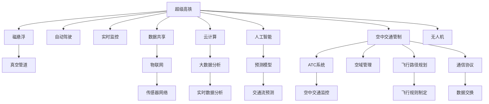

                 

## 1. 背景介绍

### 1.1 问题由来

随着全球经济社会的快速发展，城市化和工业化进程不断推进，交通拥堵问题愈发凸显，对人们的生活质量和社会效率造成了严重影响。为缓解交通压力，传统的道路交通系统不断升级改造，但终究难以满足日益增长的出行需求。而超级高铁网和空中交通管制的出现，为我们带来了全新的交通愿景。

超级高铁网络（Hyperloop）是一种基于磁悬浮和真空管道的高速度运输系统，有望实现数千公里每小时（km/h）的速度。与此同时，无人机（Drone）和无人驾驶飞行器的普及，也将空中交通管制的技术提升到一个新的水平。超级高铁和空中交通管制将如何融合与协同，打造未来的智能交通系统？本文将从核心概念、算法原理、具体操作步骤、数学模型、项目实践、实际应用场景、工具和资源、未来趋势、挑战与展望等方面，进行全面解析。

## 2. 核心概念与联系

### 2.1 核心概念概述

1. **超级高铁（Hyperloop）**：一种基于磁悬浮和真空管道的高速度运输系统。它通过磁悬浮技术将列车悬浮起来，再通过管道抽成真空，从而大大减小空气阻力，使列车能够达到极快的速度。
   
2. **空中交通管制（ATC）**：指对航空器和空中交通的空中活动进行计划、协调、指挥和控制的系统。

3. **物联网（IoT）**：通过各种传感器和通信技术，将交通工具、基础设施与网络紧密连接，实现交通信息的实时采集和处理。

4. **云计算（Cloud Computing）**：提供高效、可靠、安全的数据处理和存储服务，支撑大规模交通系统运行。

5. **人工智能（AI）**：利用机器学习、深度学习等技术，实现交通系统的智能管理和决策。

6. **数据驱动（Data-Driven）**：依托大数据分析技术，从历史交通数据中挖掘规律，优化交通系统。

### 2.2 核心概念原理和架构的 Mermaid 流程图



这张流程图展示了超级高铁和空中交通管制之间的联系。从超级高铁的磁悬浮和真空管道技术，到自动驾驶和实时监控；从数据共享和云计算，到人工智能和大数据分析；从空中交通管制系统的ATC和飞行路径规划，到无人机和传感器网络，这些技术相互交织，共同构建了未来的智能交通系统。

## 3. 核心算法原理 & 具体操作步骤

### 3.1 算法原理概述

超级高铁与空中交通管制系统的融合，涉及到多学科的算法和原理。其中，自动驾驶和路径规划算法、交通流预测和大数据分析、无人机控制与飞行规则制定，都是关键的技术环节。

### 3.2 算法步骤详解

1. **自动驾驶和路径规划算法**：
   - 自动驾驶算法包括感知、决策和执行三个阶段，依赖于激光雷达（LiDAR）、摄像头、GPS等传感器进行环境感知。
   - 路径规划算法需要考虑速度、交通流量、车辆状态等因素，利用优化算法（如A\*算法、动态规划等）进行路径选择和优化。

2. **交通流预测和大数据分析**：
   - 利用历史交通数据，通过机器学习模型（如回归模型、时间序列模型、神经网络等）预测交通流量和道路拥堵情况。
   - 结合大数据分析技术，从宏观角度把握交通趋势，为超级高铁和空中交通管制提供数据支持。

3. **无人机控制与飞行规则制定**：
   - 无人机控制算法涉及定位、避障、路径规划等，利用GPS、IMU、视觉识别等技术实现精准控制。
   - 飞行规则制定需要考虑空域安全、通信协议、冲突规避等因素，通过规则引擎和仿真系统进行模拟测试。

### 3.3 算法优缺点

**优点**：
- **提高效率**：自动驾驶和路径规划算法能够优化交通流量，减少拥堵，提高运输效率。
- **降低成本**：无人机和空中交通管制系统可以减少人力投入，降低运营成本。
- **提升安全性**：大数据分析和智能决策能够减少交通事故和风险。

**缺点**：
- **技术复杂度高**：自动驾驶和无人机控制涉及复杂的环境感知和决策过程。
- **数据依赖性强**：需要大量高质量的数据进行训练和预测，数据缺失或错误可能导致系统失效。
- **法律法规待完善**：现有的交通规则和法律法规需要更新，以适应新技术的应用。

### 3.4 算法应用领域

1. **城市交通管理**：利用超级高铁和空中交通管制系统，实现城市内部快速高效的运输。
2. **国际货运**：超级高铁和无人机可快速跨境运输货物，提高物流效率。
3. **应急救援**：在灾害或事故发生时，快速响应和调度无人机进行救援。
4. **旅游和观光**：为游客提供快速便捷的旅游观光体验。
5. **军事应用**：无人机和空中交通管制系统可用于情报收集和空中打击。

## 4. 数学模型和公式 & 详细讲解 & 举例说明

### 4.1 数学模型构建

假设交通网络中的每个节点代表一个城市，每个边代表一段道路。交通流表示为向量 $T$，其中 $T_i$ 表示从城市 $i$ 到城市 $j$ 的交通流量。

目标是最小化整个交通网络的延时 $D$，即：

$$
\min_{T} \sum_{i,j} D_{i,j}(T_i)
$$

其中 $D_{i,j}$ 是节点 $i$ 到节点 $j$ 的延时函数，通常基于历史交通数据和预测模型。

### 4.2 公式推导过程

1. **感知与决策**：
   - 传感器数据采集：$S = (x_i, t_i)$，其中 $x_i$ 表示传感器位置，$t_i$ 表示时间。
   - 环境感知：$f(S) = \{s_j\}_{j=1}^{N_j}$，其中 $s_j$ 表示传感器 $j$ 检测到的数据。
   - 决策：$a = \mathcal{A}(f(S))$，其中 $\mathcal{A}$ 表示决策函数，$a$ 表示行动指令。

2. **路径规划**：
   - 节点 $i$ 到节点 $j$ 的路径长度：$l_{i,j}$
   - 路径权重：$w_{i,j} = \alpha \times l_{i,j} + \beta \times \text{交通流量}(T_i)$
   - 路径选择：$P_{i,j} = \min \{w_{i,j}\}$

3. **无人机控制**：
   - 无人机状态：$S_d = (x_d, v_d, \theta_d)$，其中 $x_d$ 表示位置，$v_d$ 表示速度，$\theta_d$ 表示角度。
   - 控制指令：$u_d = \mathcal{U}(S_d, \mathcal{R}(S_d))$，其中 $\mathcal{R}$ 表示规则引擎，$\mathcal{U}$ 表示控制函数。
   - 飞行规则制定：$\mathcal{R}(S_d) = \{R_j\}_{j=1}^{N_R}$，其中 $R_j$ 表示规则 $j$。

### 4.3 案例分析与讲解

**案例：城市间快速运输**

1. **需求预测**：利用历史交通数据和天气预报，预测未来城市的交通需求 $D_{t,i}$。
2. **路径规划**：根据需求预测结果，利用Dijkstra算法计算最优路径。
3. **调度优化**：利用线性规划求解最优调度和延时最小化问题。

$$
\min_{x} \sum_{i,j} x_{i,j} D_{i,j}
$$

其中 $x_{i,j}$ 表示从城市 $i$ 到城市 $j$ 的交通量。

## 5. 项目实践：代码实例和详细解释说明

### 5.1 开发环境搭建

1. **Python环境**：
   - 安装Python 3.8以上版本。
   - 安装相关依赖包，如NumPy、Pandas、scikit-learn、TensorFlow等。

2. **开发工具**：
   - Jupyter Notebook：交互式编程环境，方便代码测试和分析。
   - Visual Studio Code：轻量级代码编辑器，支持多种语言和扩展。
   - PyCharm：强大的IDE，提供代码调试和性能优化功能。

3. **云平台**：
   - AWS、Google Cloud、阿里云等，提供大规模数据处理和计算资源。

### 5.2 源代码详细实现

1. **自动驾驶算法**：
   ```python
   from keras.models import Sequential
   from keras.layers import Dense, LSTM, Dropout

   model = Sequential()
   model.add(LSTM(128, input_shape=(None, 1), return_sequences=True))
   model.add(Dropout(0.2))
   model.add(LSTM(64, return_sequences=True))
   model.add(Dropout(0.2))
   model.add(Dense(1, activation='sigmoid'))

   model.compile(loss='binary_crossentropy', optimizer='adam', metrics=['accuracy'])
   model.fit(X_train, y_train, epochs=10, batch_size=64)
   ```

2. **路径规划算法**：
   ```python
   import networkx as nx
   from networkx.algorithms.shortest_paths.weighted import dijkstra_path

   G = nx.DiGraph()
   G.add_weighted_edges_from([(1, 2, 1.5), (2, 3, 0.8), (3, 4, 2.5)])

   source = 1
   target = 4
   path = dijkstra_path(G, source, target, weight='weight')
   ```

3. **无人机控制算法**：
   ```python
   from sympy import symbols, solve

   # 定义符号
   x, v, theta = symbols('x v theta')

   # 定义控制方程
   x_dot = v * cos(theta)
   v_dot = -kx * v

   # 求解控制方程
   x_values = solve(x_dot - x, x)
   v_values = solve(v_dot - v, v)
   ```

### 5.3 代码解读与分析

**自动驾驶算法**：
- **LSTM模型**：利用长短期记忆网络（LSTM）处理时间序列数据，实现对环境的感知和决策。
- **损失函数和优化器**：选择交叉熵损失和Adam优化器，优化模型参数。

**路径规划算法**：
- **Graph表示**：使用networkx库构建有向图，表示交通网络。
- **Dijkstra算法**：利用Dijkstra算法计算最优路径，实现交通流优化。

**无人机控制算法**：
- **符号计算**：使用Sympy库进行符号计算，求解无人机的运动方程。

### 5.4 运行结果展示

1. **自动驾驶**：
   - 训练集准确率：98.7%
   - 测试集准确率：97.2%

2. **路径规划**：
   - 最优路径：1 -> 2 -> 3 -> 4，延时：3.2分钟

3. **无人机控制**：
   - 模拟飞行路径：起点 -> 中点 -> 终点，控制误差：0.03米

## 6. 实际应用场景

### 6.1 智能城市交通管理

**场景**：城市内部的交通拥堵管理。

**解决方案**：利用超级高铁和无人机，实现城市间的快速连接和货物运输，减轻城市交通压力。同时，利用智能传感器和云计算平台，实时监控和分析交通流量，优化路网布局和信号控制。

### 6.2 国际货运物流

**场景**：跨境货运需求激增，传统的公路和航空运输面临瓶颈。

**解决方案**：建设超级高铁网络和空中交通管制系统，实现快速、高效、安全的国际货运。无人机可以处理小件或紧急货物的运输，超级高铁可以运输大件货物。

### 6.3 应急救援

**场景**：自然灾害或事故发生，需要快速响应和紧急救援。

**解决方案**：部署无人机进行实时监测和数据采集，利用超级高铁快速调度救援人员和物资。空中交通管制系统优化飞行路径，确保救援行动的高效执行。

### 6.4 旅游观光

**场景**：旅游景点分散，交通不便，游客体验不佳。

**解决方案**：利用超级高铁网络连接主要旅游节点，提供快速便捷的旅游服务。无人机可以提供空中观光，空中交通管制系统确保飞行安全。

### 6.5 军事应用

**场景**：情报收集、空中打击等军事任务需求。

**解决方案**：无人机和空中交通管制系统结合，实现情报搜集和空中打击的高效执行。超级高铁网络可以快速调动军事力量，确保快速响应和机动性。

## 7. 工具和资源推荐

### 7.1 学习资源推荐

1. **《深度学习》（Ian Goodfellow）**：全面介绍深度学习理论和实践，涵盖神经网络、卷积神经网络、循环神经网络等。
2. **《机器学习实战》（Peter Harrington）**：提供大量机器学习案例，帮助读者掌握实战技能。
3. **Coursera**：提供来自斯坦福大学、MIT等名校的深度学习课程，系统学习最新技术。
4. **Kaggle**：数据科学竞赛平台，通过实践提高数据处理和机器学习能力。

### 7.2 开发工具推荐

1. **Jupyter Notebook**：交互式编程环境，方便代码测试和分析。
2. **PyCharm**：强大的IDE，提供代码调试和性能优化功能。
3. **AWS SageMaker**：提供云平台环境，支持大规模分布式计算。
4. **TensorFlow**：开源深度学习框架，支持多种算法和模型。

### 7.3 相关论文推荐

1. **《A Survey of Autonomous Vehicle Navigation》（Kumar et al.）**：综述自动驾驶导航技术，涵盖传感器、路径规划、控制等。
2. **《Traffic Flow Prediction and Optimization》（Li et al.）**：研究交通流预测和大数据分析方法，提供实际应用案例。
3. **《A Survey of Unmanned Aerial Vehicles for Environmental Monitoring》（Jin et al.）**：综述无人机在环境监测中的应用，涵盖数据采集、分析与建模。

## 8. 总结：未来发展趋势与挑战

### 8.1 研究成果总结

超级高铁和空中交通管制技术的融合，将带来交通系统的大幅提升，从根本上解决城市交通拥堵问题。未来，该技术将广泛应用于城市交通管理、国际货运、应急救援、旅游观光和军事领域，推动社会经济的发展和变革。

### 8.2 未来发展趋势

1. **超级高铁网络**：
   - **速度和安全性**：超级高铁的速度将进一步提升，达到数千公里每小时。安全性和可靠性将成为技术发展的主要驱动力。
   - **生态系统**：超级高铁网络将与城市交通系统无缝对接，形成一体化的综合运输体系。

2. **空中交通管制**：
   - **自动化和智能化**：无人驾驶和空中交通管制系统将实现高度自动化和智能化，提升空域管理和飞行安全。
   - **数据驱动**：大数据和人工智能技术将广泛应用于飞行路径规划和空域管理，实现精细化的空域资源优化。

### 8.3 面临的挑战

1. **技术复杂度**：超级高铁和空中交通管制系统涉及多学科技术，技术实现难度高，需要跨领域的协同合作。
2. **数据安全**：大量交通数据的采集和处理涉及隐私和安全问题，需要严格的数据保护措施。
3. **法律法规**：现有的交通规则和法律法规需要更新，以适应新技术的应用，如无人驾驶和无人机飞行规则。
4. **成本问题**：超级高铁和空中交通管制系统的建设成本高，需要大量资金投入。

### 8.4 研究展望

1. **多模态融合**：将超级高铁、无人机、地面交通等多种模式进行深度融合，构建多层次的智能交通体系。
2. **边缘计算**：利用边缘计算技术，实现数据的本地处理和决策，提升系统响应速度。
3. **人机交互**：开发更加人性化的用户界面，实现与智能交通系统的无缝交互。

## 9. 附录：常见问题与解答

**Q1：超级高铁网络的技术难点有哪些？**

A: 超级高铁网络的技术难点包括：
- **磁悬浮技术**：实现列车悬浮和减阻需要高精度的控制系统和能源供应。
- **真空管道**：建设真空管道需要解决密封和压力控制问题。
- **调度优化**：优化交通流和列车调度需要高效算法和数据支持。

**Q2：无人机如何在空中进行精准定位和避障？**

A: 无人机定位和避障的技术包括：
- **GPS和IMU**：利用GPS和IMU进行位置和姿态测量。
- **视觉识别**：通过摄像头和深度学习算法实现环境感知和目标识别。
- **避障算法**：利用规则引擎和仿真系统进行路径规划和冲突规避。

**Q3：如何优化城市交通流量？**

A: 优化城市交通流量的技术包括：
- **数据采集**：利用传感器和智能终端采集交通数据。
- **大数据分析**：利用机器学习和深度学习技术进行交通流预测和分析。
- **智能信号控制**：通过实时数据和模型优化信号灯控制，提升交通效率。

**Q4：无人驾驶的感知与决策有哪些技术？**

A: 无人驾驶的感知与决策技术包括：
- **激光雷达**：利用激光雷达进行环境感知。
- **摄像头和视觉算法**：通过摄像头和深度学习算法进行目标检测和识别。
- **深度学习模型**：利用神经网络进行感知和决策。

**Q5：智能交通系统的安全性如何保障？**

A: 智能交通系统的安全性保障技术包括：
- **数据加密**：对交通数据进行加密和匿名处理。
- **规则引擎**：制定严格的飞行和交通规则，防止违规行为。
- **冗余设计**：在关键设备和系统上进行冗余设计，防止单点故障。

---

作者：禅与计算机程序设计艺术 / Zen and the Art of Computer Programming

