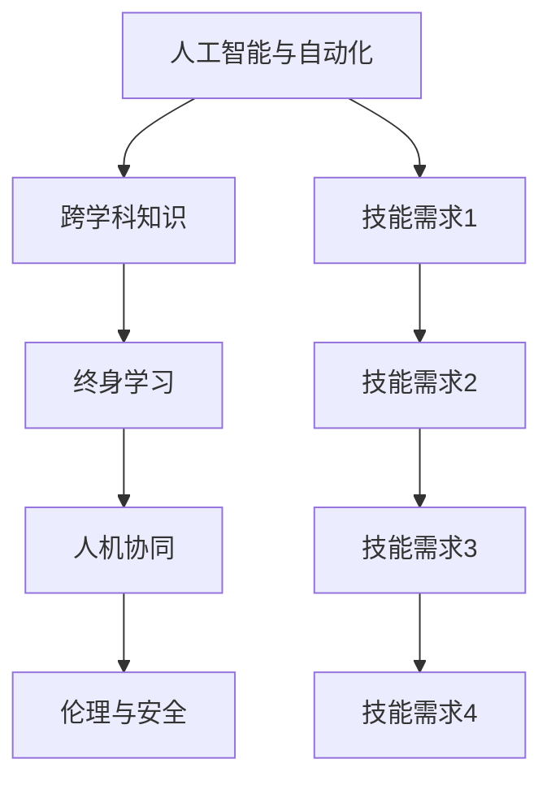

                 

## 1. 背景介绍

随着技术进步和社会变迁，未来的工作环境将发生翻天覆地的变化。新技术和新需求层出不穷，对人才的需求也在悄然改变。如何在变幻莫测的未来社会中，培养出具有竞争力的新型人才，成为教育界和业界亟待解决的问题。本文将从核心概念、算法原理、操作步骤等多个维度，探讨未来社会对人才技能的需求，并提供一份全面的技能培养指南。

## 2. 核心概念与联系

### 2.1 核心概念概述

未来社会对人才的需求，将更加注重综合素质和跨领域能力。以下是几个核心概念：

- **人工智能与自动化**：AI技术和自动化工具将极大地改变工作流程，提高效率。具备AI基础，并能与AI协作的人才，将成为未来职场中的关键力量。

- **跨学科知识**：未来的工作往往需要多学科融合。掌握统计学、心理学、数据科学等跨领域知识，能够更好地理解和解决复杂问题。

- **终身学习**：技术更新速度快，终身学习将成为获取新知识和技能的必要手段。具备快速学习能力和自我迭代能力的人才，将更具竞争力。

- **人机协同**：未来的工作环境将高度依赖人机协同。了解人机交互原理，能够有效沟通和协作，将带来新的工作体验和职业机会。

- **伦理与安全**：随着AI技术的应用，数据隐私、算法偏见、安全性等伦理问题也随之而来。具备数据安全意识和伦理知识，将有助于构建可靠、公正的AI系统。

### 2.2 核心概念原理和架构的 Mermaid 流程图



这个流程图展示了核心概念之间的联系：人工智能与自动化推动跨学科知识的学习，进而促使终身学习成为必备能力；跨学科知识和终身学习能力，使得人机协同更加高效；人机协同与人机互动，需要遵循伦理和安全准则。

## 3. 核心算法原理 & 具体操作步骤

### 3.1 算法原理概述

培养适应未来社会的人才，需要一个综合性的框架，涵盖知识结构、技能提升、心态塑造等方面。以下是一个简化的算法框架：

- **输入**：个体的初始能力、知识背景、兴趣点。
- **处理**：通过跨学科学习、项目实践、反思反馈等环节，提升个体技能和知识。
- **输出**：适应未来社会需求的人才。

### 3.2 算法步骤详解

**Step 1: 评估基础能力**
- 对个体进行基础能力评估，包括认知能力、学习风格、兴趣倾向等。
- 使用标准化测评工具，如认知能力测验、职业兴趣量表等。

**Step 2: 设计个性化学习路径**
- 根据评估结果，设计个性化的学习路径，涵盖跨学科知识、技术技能、软技能等。
- 利用数据科学、学习心理学等理论，制定科学的个性化学习方案。

**Step 3: 实施跨学科学习**
- 组织跨学科课程和工作坊，引入统计学、数据科学、心理学等领域的知识。
- 通过案例分析、项目实践等方式，让知识在实际应用中得到巩固。

**Step 4: 进行技能提升**
- 通过在线课程、实验室实践、实习项目等方式，提升个体的技术技能和软技能。
- 建立项目导向的学习体系，鼓励个体在真实环境中解决问题。

**Step 5: 进行反思与反馈**
- 定期组织反思会议，促进个体对学习过程的自我评估和迭代优化。
- 引入导师和同侪反馈机制，帮助个体不断调整学习方向和策略。

**Step 6: 持续学习与迭代**
- 鼓励个体建立终身学习的习惯，持续跟进技术发展和行业趋势。
- 提供多样化的学习资源和平台，支持个体自主学习和自我提升。

### 3.3 算法优缺点

**优点**：
- 个性化学习路径有助于发掘个体潜能，提升学习效果。
- 跨学科知识使个体具备更全面的视角和更强的适应性。
- 技能提升和反思反馈环节，帮助个体在实践中不断迭代和优化。
- 终身学习机制，确保个体能够跟上技术发展的步伐。

**缺点**：
- 设计个性化学习路径需要大量资源和精力。
- 跨学科知识的学习门槛较高，需要个体具备较强的学习能力和适应能力。
- 反思与反馈环节对个体的主观能动性要求较高。
- 终身学习机制需要个体具备较强的自我驱动和自我管理能力。

### 3.4 算法应用领域

该算法框架在多个领域都有广泛的应用，包括但不限于：

- **教育培训**：为学生设计个性化的学习路径，提升其综合素质和跨领域能力。
- **职业发展**：为职场人士提供持续的技能提升和职业转型机会，帮助其适应技术变革。
- **企业培训**：为员工提供跨学科培训和技能提升，增强其应对未来挑战的能力。
- **在线学习平台**：提供个性化的学习资源和课程，支持个体自主学习和终身学习。

## 4. 数学模型和公式 & 详细讲解 & 举例说明

### 4.1 数学模型构建

未来社会的人才需求，可以通过数学模型来量化和分析。以下是一个简化的数学模型：

设个体 $i$ 的初始能力为 $C_i$，学习后的能力为 $C'_i$。模型的目标是最小化 $C_i$ 和 $C'_i$ 的差异，即：

$$
\min_{C'_i} \| C_i - C'_i \|
$$

其中 $\| \cdot \|$ 表示两个能力之间的距离度量，如欧式距离、曼哈顿距离等。

### 4.2 公式推导过程

以欧式距离为例，公式推导如下：

$$
\| C_i - C'_i \| = \sqrt{\sum_{k=1}^K (c_{ik} - c'_{ik})^2}
$$

其中 $K$ 表示能力维数，$c_{ik}$ 和 $c'_{ik}$ 分别表示个体 $i$ 在能力维度 $k$ 上的初始能力和学习后的能力值。

### 4.3 案例分析与讲解

假设个体 $i$ 在逻辑思维、数据分析、项目管理三个能力维度上的初始能力分别为 $3$、$4$、$2$，学习后的能力分别为 $5$、$5$、$3$。使用欧式距离公式计算其能力变化：

$$
\| C_i - C'_i \| = \sqrt{(3-5)^2 + (4-5)^2 + (2-3)^2} = \sqrt{5} \approx 2.24
$$

可以看出，个体 $i$ 在逻辑思维和数据分析能力上有所提升，但在项目管理能力上没有明显变化。

## 5. 项目实践：代码实例和详细解释说明

### 5.1 开发环境搭建

要进行技能培养的编程实践，首先需要搭建好开发环境。以下是使用Python和Jupyter Notebook搭建开发环境的步骤：

1. 安装Anaconda：从官网下载并安装Anaconda，用于创建独立的Python环境。
2. 创建并激活虚拟环境：
```bash
conda create -n myenv python=3.8
conda activate myenv
```
3. 安装必要的Python包：
```bash
pip install numpy pandas matplotlib scikit-learn tqdm jupyter notebook ipython
```
4. 安装Jupyter Notebook：
```bash
pip install jupyter notebook
```

### 5.2 源代码详细实现

以下是一个简化的Python代码示例，用于评估和优化个体的学习路径：

```python
import numpy as np
from sklearn.metrics import mean_squared_error

def evaluate_capacity(capacity_initial, capacity_final):
    return np.sqrt(np.sum((capacity_initial - capacity_final)**2))

def optimize_learning_path(capacity_initial, desired_capacity, weights=None):
    weights = weights if weights is not None else np.ones(len(capacity_initial))
    capacity_final = np.zeros(len(capacity_initial))
    current_capacity = capacity_initial
    while np.linalg.norm(current_capacity - capacity_final) > 0.01:
        diff = current_capacity - capacity_final
        current_capacity += weights * diff / np.linalg.norm(diff)
    return current_capacity

# 示例数据
capacity_initial = np.array([3, 4, 2])
desired_capacity = np.array([5, 5, 3])
weights = np.array([1, 1, 0.5])  # 逻辑思维和数据分析更重要的权重

# 评估初始能力和目标能力之间的差异
initial_error = evaluate_capacity(capacity_initial, desired_capacity)
print(f"Initial error: {initial_error:.2f}")

# 优化学习路径
capacity_final = optimize_learning_path(capacity_initial, desired_capacity, weights)
final_error = evaluate_capacity(capacity_initial, capacity_final)
print(f"Final error: {final_error:.2f}")
```

### 5.3 代码解读与分析

该代码示例中，`evaluate_capacity`函数用于计算初始能力和目标能力之间的欧式距离，`optimize_learning_path`函数用于优化学习路径。通过迭代更新当前能力，直到满足预设的精度要求。在示例数据中，个体在逻辑思维和数据分析能力上的提升权重更大。

## 6. 实际应用场景

### 6.1 教育培训

在教育培训领域，该算法框架可以帮助学校设计个性化的学习路径，提升学生的综合素质和跨领域能力。通过跨学科课程、项目实践和反思反馈，培养学生适应未来社会的能力。

### 6.2 职业发展

在职业发展领域，该算法框架可以帮助职场人士进行技能提升和职业转型。通过在线课程、实习项目和持续学习，使员工保持竞争力，适应技术变革。

### 6.3 企业培训

在企业培训领域，该算法框架可以帮助企业设计跨学科培训和技能提升方案。通过跨学科知识的学习和实际项目的实践，增强员工应对未来挑战的能力。

### 6.4 在线学习平台

在在线学习平台领域，该算法框架可以提供个性化的学习资源和课程，支持个体自主学习和终身学习。通过智能化推荐和反馈机制，提升学习效果。

## 7. 工具和资源推荐

### 7.1 学习资源推荐

为了帮助开发者系统掌握未来社会人才需求的技能培养指南，以下是一些优质的学习资源：

1. 《机器学习实战》：由Peter Harrington撰写，详细介绍了机器学习和数据科学的基本概念和实际应用。
2. 《深度学习》：由Ian Goodfellow、Yoshua Bengio和Aaron Courville撰写，全面介绍了深度学习的理论基础和算法实现。
3. Coursera《机器学习》课程：由Andrew Ng主讲，系统讲解了机器学习的基本原理和实际应用。
4. Udacity《深度学习》课程：由深度学习专家Sebastian Thrun主讲，详细介绍了深度学习的最新进展和应用。
5. edX《人工智能与机器学习》课程：由MIT和哈佛大学联合开设，涵盖人工智能和机器学习的核心概念和算法。

### 7.2 开发工具推荐

高效的开发离不开优秀的工具支持。以下是几款用于技能培养开发的常用工具：

1. Python：广泛使用的高级编程语言，适合快速迭代研究和开发。
2. Jupyter Notebook：基于Web的交互式编程环境，适合撰写和共享Python代码。
3. Anaconda：集成了多个数据科学和机器学习库，方便管理和部署。
4. TensorFlow：由Google主导的深度学习框架，支持分布式计算和模型部署。
5. PyTorch：由Facebook开发的深度学习框架，支持动态图和动态计算图。
6. Scikit-learn：开源的机器学习库，提供多种经典机器学习算法。

### 7.3 相关论文推荐

未来社会的人才需求涉及多个学科领域，以下是几篇奠基性的相关论文，推荐阅读：

1. "Artificial Intelligence: A Modern Approach" by Stuart Russell and Peter Norvig：介绍人工智能的基本概念和应用。
2. "Machine Learning Yearning" by Andrew Ng：介绍了机器学习的实践经验和策略。
3. "Deep Learning" by Ian Goodfellow、Yoshua Bengio和Aaron Courville：全面介绍了深度学习的理论基础和算法实现。
4. "Hands-On Machine Learning with Scikit-Learn, Keras, and TensorFlow" by Aurélien Géron：介绍了机器学习的实际应用和实现。
5. "Programming Pearls" by Jon Bentley：介绍了编程中的经典问题和解决方案。

## 8. 总结：未来发展趋势与挑战

### 8.1 总结

本文对未来社会的人才需求进行了全面系统的介绍，探讨了核心概念、算法原理、操作步骤等多个维度。未来社会对人才的需求，将更加注重综合素质和跨领域能力。通过设计个性化的学习路径、实施跨学科学习、进行技能提升、反思与反馈等环节，可以培养出适应未来社会需求的人才。

### 8.2 未来发展趋势

展望未来，未来社会的人才需求将呈现以下几个趋势：

1. **跨学科融合**：未来的工作将更多地涉及多学科知识的整合和应用。具备跨学科知识的人才，将更具竞争力。
2. **技术更新速度快**：技术更新速度快，终身学习将成为获取新知识和技能的必要手段。
3. **人机协同**：未来的工作环境将高度依赖人机协同。了解人机交互原理，能够有效沟通和协作，将带来新的工作体验和职业机会。
4. **伦理与安全**：随着AI技术的应用，数据隐私、算法偏见、安全性等伦理问题也随之而来。具备数据安全意识和伦理知识，将有助于构建可靠、公正的AI系统。

### 8.3 面临的挑战

尽管未来社会的人才需求有了新的趋势，但在培养过程中仍面临诸多挑战：

1. **资源有限**：个性化学习路径的设计需要大量资源和精力。
2. **学习门槛高**：跨学科知识的学习门槛较高，需要个体具备较强的学习能力和适应能力。
3. **自我驱动要求高**：反思与反馈环节对个体的主观能动性要求较高。
4. **终身学习要求高**：终身学习机制需要个体具备较强的自我驱动和自我管理能力。

### 8.4 研究展望

未来社会的人才需求将继续演进，研究者需要在以下几个方面进行深入探索：

1. **个性化学习路径的优化**：通过机器学习和大数据分析，优化个性化学习路径的设计，提升学习效果。
2. **跨学科知识的学习策略**：研究跨学科知识的学习策略，帮助个体更高效地掌握跨领域知识。
3. **人机协同的理论与实践**：研究人机协同的理论基础和实际应用，提升人机协同的效果。
4. **伦理与安全的研究**：研究AI技术的伦理和安全问题，确保AI系统的可靠性和公正性。

## 9. 附录：常见问题与解答

**Q1：未来社会的人才需求是否只关注技术技能？**

A: 未来社会的人才需求不仅关注技术技能，还注重跨学科知识、软技能和伦理安全等综合素质。具备全面素质的人才，才能更好地适应未来社会的需求。

**Q2：如何确保学习路径的个性化和科学性？**

A: 个性化学习路径的设计需要结合个体的初始能力、学习风格和兴趣倾向，科学性则需通过数据科学和心理学理论进行验证。持续的反思反馈机制，可以帮助个体不断调整和优化学习路径。

**Q3：跨学科学习是否需要耗费大量时间？**

A: 跨学科学习确实需要耗费一定时间，但通过高效的学习策略和在线课程，可以在较短的时间内掌握相关知识。持续的学习习惯和自我驱动，也是实现高效学习的重要保障。

**Q4：人机协同的具体实现方式有哪些？**

A: 人机协同的实现方式多种多样，包括基于自然语言处理的对话系统、人机协作机器人、虚拟助手等。通过技术手段和设计思路，可以有效提升人机协同的效果。

**Q5：如何确保AI系统的伦理与安全？**

A: 确保AI系统的伦理与安全，需要在数据采集、模型训练和系统部署等环节进行全面把控。引入伦理和安全意识，建立严格的数据隐私保护机制和算法审查机制，是确保系统可靠性的重要措施。

---

作者：禅与计算机程序设计艺术 / Zen and the Art of Computer Programming

