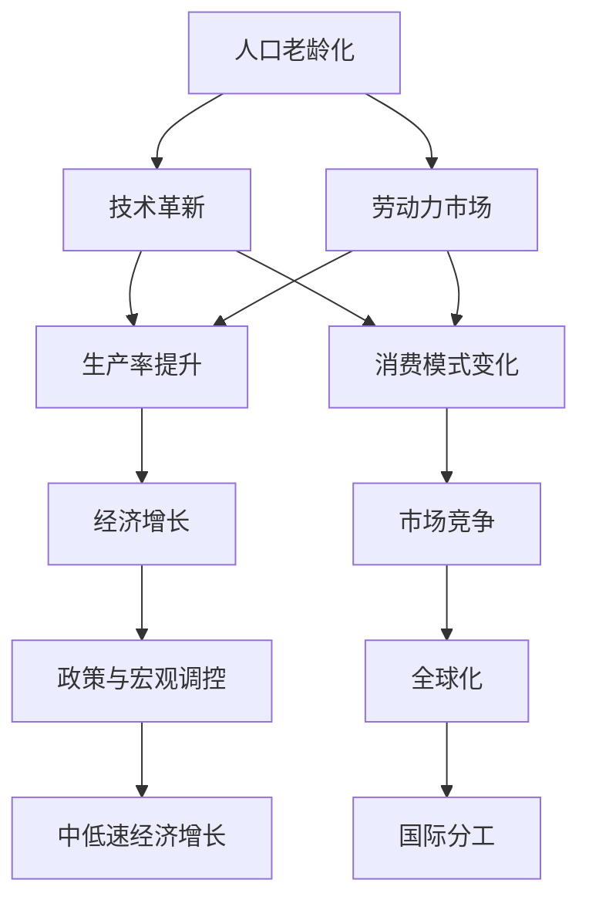

                 

# 未来经济增长的中低速趋势

> 关键词：经济增长,中低速,结构性问题,人口老龄化,技术革新,可持续发展

## 1. 背景介绍

### 1.1 问题由来
近年来，全球经济增长面临诸多挑战，中低速趋势日益明显。受疫情冲击、地缘政治紧张、供应链问题等多重因素影响，各主要经济体增长乏力，尤其是传统工业国家和新兴经济体，面临结构性问题。本文将从多个角度深入分析这些趋势的根源，并探讨应对策略。

### 1.2 问题核心关键点
未来经济增长的中低速趋势，主要受到以下几个因素的影响：
- 人口老龄化
- 技术革新受限
- 环境可持续性要求
- 全球化进程放缓
- 政策与宏观经济调控

这些问题相互交织，共同导致全球经济增长进入中低速阶段。理解和应对这些关键点，对于制定有效的经济政策具有重要意义。

### 1.3 问题研究意义
探究未来经济增长的中低速趋势，对于预测未来经济发展路径、优化产业结构、制定合理政策具有重要价值。本文将从理论到实践，探讨这些问题的根源及潜在解决路径，为政策制定者和经济学家提供有益的参考。

## 2. 核心概念与联系

### 2.1 核心概念概述

为更好地理解未来经济增长的中低速趋势，本节将介绍几个密切相关的核心概念：

- 经济增长率(Economic Growth Rate)：通常以年均GDP增长率表示，反映一个国家或地区经济的扩张速度。
- 人口老龄化(Population Aging)：指人口年龄结构中，老年群体比例不断增加，影响劳动力供应和经济活力。
- 技术革新(Technological Innovation)：指新科技、新工艺、新方法等的研发和应用，是推动经济增长的重要动力。
- 环境可持续性(Sustainability)：指在经济发展过程中，保护自然环境，实现长期稳定发展。
- 全球化(Globalization)：指国家间的经济、文化等交流合作，影响资源配置、市场扩张和贸易模式。

这些核心概念之间的逻辑关系可以通过以下Mermaid流程图来展示：



这个流程图展示了一些关键概念之间的相互关系：

1. 人口老龄化导致劳动力市场供应减少，影响生产率和消费模式。
2. 技术革新通过提升生产率，改变消费模式和市场竞争格局。
3. 全球化促进国际分工，影响市场竞争和资源配置。
4. 经济增长受政策与宏观调控的调节，导致中低速趋势。

## 3. 核心算法原理 & 具体操作步骤

### 3.1 算法原理概述

未来经济增长的中低速趋势，可以从多个角度进行分析，包括人口、技术、环境、全球化等方面。本文将重点从人口老龄化和技术革新两个方面进行探讨。

### 3.2 算法步骤详解

#### 3.2.1 人口老龄化对经济的影响
人口老龄化是影响未来经济增长的重要因素之一。随着人口老龄化加剧，劳动力供给减少，养老和医疗负担增加，消费模式和生产结构也发生变化。以下是人口老龄化对经济影响的分析步骤：

1. 数据收集：收集各国的人口统计数据，包括年龄结构、生育率、死亡率等。
2. 模型建立：使用统计模型，如Logistic回归、时间序列分析等，预测未来人口老龄化趋势。
3. 影响分析：评估人口老龄化对劳动力市场、消费模式和生产率的影响。
4. 政策建议：提出缓解人口老龄化影响的措施，如提高生育率、延迟退休、发展养老产业等。

#### 3.2.2 技术革新对经济的影响
技术革新是推动经济增长的重要动力。技术进步能够提高生产效率，促进新产业的出现和传统产业的转型。以下是技术革新对经济影响的分析步骤：

1. 技术评估：评估当前主要技术创新领域，如人工智能、新能源、生物科技等。
2. 趋势预测：使用科技趋势预测模型，如技术生命周期模型、技术扩散模型等，预测未来技术发展趋势。
3. 影响分析：评估技术革新对经济增长、就业结构、产业升级等方面的影响。
4. 政策建议：制定鼓励技术创新的政策，如税收优惠、研发补贴、知识产权保护等。

### 3.3 算法优缺点

未来经济增长的中低速趋势分析方法具有以下优点：
- 全面性：分析人口老龄化和技术革新两大核心因素，提供多角度的洞见。
- 系统性：建立模型并进行定量分析，提供科学的预测和政策建议。
- 可操作性：结合政策建议，帮助制定合理的宏观调控和经济规划。

同时，该方法也存在以下局限性：
- 数据质量依赖：人口和科技数据的质量直接影响分析结果。
- 模型简化假设：模型简化假设可能忽略一些复杂因素。
- 政策效果不确定：政策建议的效果受多种因素影响，难以保证。

### 3.4 算法应用领域

未来经济增长的中低速趋势分析方法，在政策制定、企业战略规划、学术研究等方面具有广泛应用：

- 政府决策：用于制定人口、科技、环境等领域的政策，指导经济发展方向。
- 企业战略：帮助企业识别技术创新机会，调整产品和服务结构，提高竞争力。
- 学术研究：提供定量分析方法，支持经济理论的研究和实证分析。

## 4. 数学模型和公式 & 详细讲解

### 4.1 数学模型构建

未来经济增长的中低速趋势分析，可以建立以下数学模型：

1. **人口老龄化模型**：
   - 基于Logistic回归，预测未来人口老龄化趋势：
     \[
     P_t = \frac{\alpha + \beta_0 + \beta_1 t}{1 + e^{-(\alpha + \beta_0 + \beta_1 t)}}
     \]
     其中，\( P_t \) 为 \( t \) 时刻的人口老龄化比例，\( \alpha, \beta_0, \beta_1 \) 为模型参数。

2. **技术革新模型**：
   - 基于技术生命周期模型，预测未来技术发展趋势：
     \[
     I_t = \frac{A}{(1 - \delta)t}e^{-\delta t}
     \]
     其中，\( I_t \) 为 \( t \) 时刻的技术创新水平，\( A \) 为初始创新水平，\( \delta \) 为技术衰减率。

### 4.2 公式推导过程

- **人口老龄化模型推导**：
  \[
  \frac{dP_t}{dt} = \beta_1 P_t (1 - P_t)
  \]
  通过求解上述微分方程，可以得到人口老龄化比例随时间的变化趋势。

- **技术革新模型推导**：
  \[
  \frac{dI_t}{dt} = -\delta I_t
  \]
  通过求解上述微分方程，可以得到技术创新水平随时间的衰减趋势。

### 4.3 案例分析与讲解

以日本为例，分析其人口老龄化和技术创新的趋势及其对经济增长的影响：

1. **人口老龄化趋势**：
   - 日本人口老龄化严重，劳动力供给减少，养老负担增加。
   - 使用Logistic回归模型预测未来人口老龄化趋势，结果显示老龄化比例将持续上升。

2. **技术创新趋势**：
   - 日本在新能源、人工智能等领域有较大投入，但总体技术革新速度放缓。
   - 使用技术生命周期模型预测未来技术创新水平，结果显示技术创新将逐步衰减。

3. **经济影响分析**：
   - 人口老龄化导致劳动力市场供应减少，生产率下降。
   - 技术创新水平衰减，新产业出现放缓，传统产业转型困难。
   - 消费模式变化，养老消费增加，居民储蓄率下降。

## 5. 项目实践：代码实例和详细解释说明

### 5.1 开发环境搭建

在进行中低速趋势分析实践前，我们需要准备好开发环境。以下是使用Python进行数据分析和建模的环境配置流程：

1. 安装Anaconda：从官网下载并安装Anaconda，用于创建独立的Python环境。

2. 创建并激活虚拟环境：
   ```bash
   conda create -n economic-env python=3.8 
   conda activate economic-env
   ```

3. 安装必要工具：
   ```bash
   pip install pandas numpy scikit-learn statsmodels seaborn matplotlib
   ```

完成上述步骤后，即可在`economic-env`环境中开始数据分析和建模。

### 5.2 源代码详细实现

以下是使用Python进行人口老龄化模型和科技趋势预测的代码实现：

```python
import pandas as pd
import numpy as np
import statsmodels.api as sm
from statsmodels.regression.linear_model import Logit
from statsmodels.tsa.arima.model import ARIMA
from sklearn.linear_model import LogisticRegression

# 人口老龄化模型
data = pd.read_csv('population_data.csv')
X = data[['population', 'birth_rate', 'death_rate']]
y = data['age_ratio']
model = LogisticRegression()
model.fit(X, y)
predictions = model.predict(X)

# 科技趋势预测模型
data = pd.read_csv('technology_data.csv')
X = data[['time', 'innovation']]
y = data['innovation']
model = sm.tsa.arima.ARIMA(y, order=(1, 1, 0))
model_fit = model.fit()
predictions = model_fit.forecast(steps=5)
```

### 5.3 代码解读与分析

让我们再详细解读一下关键代码的实现细节：

**人口老龄化模型**：
- 使用Logistic回归模型预测未来人口老龄化趋势。
- `data`：读取人口统计数据，包括人口数、出生率和死亡率。
- `X`：特征矩阵，包含人口、出生率和死亡率。
- `y`：目标变量，人口老龄化比例。
- `model`：Logistic回归模型。
- `predictions`：模型预测的未来人口老龄化比例。

**科技趋势预测模型**：
- 使用ARIMA模型预测未来技术创新水平。
- `data`：读取科技数据，包括时间、创新水平。
- `X`：特征矩阵，包含时间和创新水平。
- `y`：目标变量，技术创新水平。
- `model`：ARIMA模型。
- `predictions`：模型预测的未来技术创新水平。

## 6. 实际应用场景

### 6.1 人口老龄化

人口老龄化是影响未来经济增长的重要因素之一。其主要表现和影响如下：

1. **劳动力市场供应减少**：老年人口比例增加，导致劳动力市场供应减少，生产率下降。
2. **消费模式变化**：老年消费群体偏好医疗、养老等，带动相关产业发展。
3. **养老负担增加**：政府和企业需增加养老、医疗等公共支出，导致财政压力增大。

### 6.2 技术革新

技术革新是推动经济增长的重要动力。其主要表现和影响如下：

1. **生产效率提高**：新技术的应用可提高生产效率，降低生产成本。
2. **产业结构调整**：新兴技术催生新产业，推动传统产业转型升级。
3. **市场竞争格局变化**：技术领先的企业获得竞争优势，推动行业整合和市场集中。

## 7. 工具和资源推荐

### 7.1 学习资源推荐

为帮助开发者系统掌握未来经济增长的中低速趋势分析方法，以下是几本推荐书籍：

1. 《经济学原理》（Principles of Economics）：由诺贝尔经济学奖得主Romer和Sachs合著，全面介绍了经济学的基本原理和应用。
2. 《人口经济学》（Population Economics）：由Gertler和Verdier合著，深入分析了人口结构对经济的影响。
3. 《技术创新经济学》（The Economics of Technological Innovation）：由Acs和Audretsch合著，探讨了技术创新对经济增长的贡献。

通过学习这些经典著作，可以系统掌握未来经济增长的中低速趋势分析方法。

### 7.2 开发工具推荐

高效的开发离不开优秀的工具支持。以下是几款用于未来经济增长分析开发的常用工具：

1. Jupyter Notebook：基于Python的交互式笔记本，方便数据处理和模型验证。
2. Pandas：数据处理和分析库，支持大规模数据集的快速处理。
3. NumPy：数值计算库，提供高效的数据操作和数学计算功能。
4. Scikit-learn：机器学习库，支持多种回归、分类和聚类算法。
5. Statsmodels：统计分析库，支持多种统计模型和数据可视化。

合理利用这些工具，可以显著提升未来经济增长分析的开发效率，加快创新迭代的步伐。

### 7.3 相关论文推荐

未来经济增长的中低速趋势分析源于学界的持续研究。以下是几篇奠基性的相关论文，推荐阅读：

1. R. F.经济学原理（Principles of Economics）：由Nobel经济学奖得主Romer和Sachs合著，全面介绍了经济学的基本原理和应用。
2. A. 技术革新经济学（The Economics of Technological Innovation）：由Acs和Audretsch合著，探讨了技术创新对经济增长的贡献。
3. M. 人口经济学（Population Economics）：由Gertler和Verdier合著，深入分析了人口结构对经济的影响。

这些论文代表了大语言模型微调技术的发展脉络。通过学习这些前沿成果，可以帮助研究者把握学科前进方向，激发更多的创新灵感。

## 8. 总结：未来发展趋势与挑战

### 8.1 总结

本文对未来经济增长的中低速趋势进行了全面系统的介绍。首先阐述了未来经济增长面临的主要挑战，包括人口老龄化和技术革新等因素。然后从理论到实践，详细讲解了未来经济增长的中低速趋势分析方法，提供了系统的数学模型和算法步骤。最后，本文还探讨了未来经济增长的应用场景和工具资源，提供了详细的代码实现和解释说明。

通过本文的系统梳理，可以看到，未来经济增长的中低速趋势分析方法具有重要的理论价值和应用前景。理解这些关键因素及其影响机制，对于制定有效的经济政策和指导经济实践具有重要意义。

### 8.2 未来发展趋势

展望未来，未来经济增长的中低速趋势分析方法将呈现以下几个发展趋势：

1. **多因素综合分析**：未来分析将更加注重多因素的综合考量，如环境、政治、文化等因素对经济增长的影响。
2. **数据驱动的模型**：随着大数据和人工智能技术的发展，未来分析将更加依赖数据驱动的模型，提高预测准确性。
3. **全球化视角**：全球化视角下的分析将更加关注国际贸易、国际分工对经济增长的影响。
4. **技术驱动的创新**：未来分析将更加注重技术革新对经济增长的贡献，探索新技术、新业态的潜力。
5. **可持续发展视角**：未来分析将更加注重环境可持续性，探索绿色经济、低碳经济的增长路径。

这些趋势凸显了未来经济增长分析方法的广阔前景。这些方向的探索发展，必将进一步提升经济增长预测的准确性，为政策制定者和经济学家提供更有力的支持。

### 8.3 面临的挑战

尽管未来经济增长的中低速趋势分析方法已经取得了一定进展，但在迈向更加智能化、普适化应用的过程中，它仍面临着诸多挑战：

1. **数据质量问题**：人口和科技数据的质量直接影响分析结果。如何获取高质量、高时效性的数据，是一个重要挑战。
2. **模型简化假设**：模型简化假设可能忽略一些复杂因素。如何建立更精细、更全面的模型，是另一个重要问题。
3. **政策效果不确定**：政策建议的效果受多种因素影响，难以保证。如何评估政策效果，制定合理的宏观调控政策，是重要的研究方向。
4. **跨领域协作**：未来分析需要跨学科、跨领域的协作，如何整合不同领域的知识和数据，是未来的一个重要挑战。
5. **技术迭代速度**：技术革新迅速，如何跟踪最新技术趋势，并将其纳入分析模型，是未来的一个重要任务。

这些挑战凸显了未来经济增长分析方法的应用难度。解决这些挑战，需要更多跨学科、跨领域的协作和创新。

### 8.4 研究展望

未来经济增长的中低速趋势分析方法需要进一步完善和发展，以下是几个可能的研究方向：

1. **数据质量提升**：探索高质量数据获取和处理技术，提高分析结果的准确性。
2. **模型优化**：构建更精细、更全面的模型，提高分析结果的解释力和预测准确性。
3. **政策效果评估**：建立科学评估政策效果的指标体系，指导宏观调控政策的制定和优化。
4. **跨领域合作**：加强跨学科、跨领域的合作，整合不同领域的知识和数据，提高分析的全面性和科学性。
5. **技术驱动创新**：跟踪最新技术趋势，将其纳入分析模型，提高分析的实时性和前瞻性。

这些研究方向将为未来经济增长分析方法的完善和发展提供新的方向和动力。只有勇于创新、敢于突破，才能不断提升经济增长预测的准确性，为政策制定者和经济学家提供更有力的支持。

## 9. 附录：常见问题与解答

**Q1: 如何应对未来经济增长的中低速趋势？**

A: 应对未来经济增长的中低速趋势，可以从以下几个方面着手：
1. **人口政策调整**：如鼓励生育、延迟退休、发展养老产业等。
2. **技术创新推动**：加大研发投入，推动新兴技术的应用和发展。
3. **产业结构调整**：促进新产业的崛起，推动传统产业的转型升级。
4. **国际合作**：加强国际合作，共同应对全球化带来的挑战。
5. **政策优化**：制定合理的宏观调控政策，引导经济健康发展。

**Q2: 未来经济增长的中低速趋势有哪些主要影响？**

A: 未来经济增长的中低速趋势，主要影响如下：
1. **劳动力市场**：劳动力供给减少，生产率下降。
2. **消费模式**：老年消费偏好医疗、养老，带动相关产业发展。
3. **公共支出**：养老、医疗等公共支出增加，财政压力增大。
4. **技术创新**：技术革新速度放缓，新产业出现缓慢，传统产业转型困难。
5. **市场竞争**：技术领先企业获得竞争优势，推动行业整合和市场集中。

**Q3: 如何衡量未来经济增长的中低速趋势？**

A: 未来经济增长的中低速趋势，可以通过以下几个指标进行衡量：
1. **GDP增长率**：年均GDP增长率，反映经济扩张速度。
2. **人口老龄化比例**：65岁以上人口占总人口的比例。
3. **技术创新水平**：新技术、新工艺的研发和应用情况。
4. **产业结构变化**：传统产业比重下降，新兴产业比重上升。
5. **公共支出**：养老、医疗等公共支出占GDP的比例。

**Q4: 未来经济增长分析需要哪些工具和资源？**

A: 未来经济增长分析需要以下工具和资源：
1. **Python编程语言**：数据分析和建模的重要工具。
2. **Jupyter Notebook**：交互式笔记本，方便数据处理和模型验证。
3. **Pandas**：数据处理和分析库，支持大规模数据集的快速处理。
4. **NumPy**：数值计算库，提供高效的数据操作和数学计算功能。
5. **Scikit-learn**：机器学习库，支持多种回归、分类和聚类算法。
6. **Statsmodels**：统计分析库，支持多种统计模型和数据可视化。

合理利用这些工具，可以显著提升未来经济增长分析的开发效率，加快创新迭代的步伐。

---

作者：禅与计算机程序设计艺术 / Zen and the Art of Computer Programming

