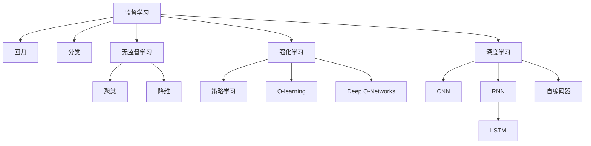

                 

# 机器学习 原理与代码实例讲解

> 关键词：机器学习,监督学习,无监督学习,强化学习,深度学习,代码实例,原理讲解

## 1. 背景介绍

### 1.1 问题由来
机器学习（Machine Learning, ML）是人工智能（AI）的一个核心分支，旨在通过算法和模型自动地从数据中学习规律，以实现特定任务的目标。其应用范围广泛，从语音识别、图像处理到推荐系统、自然语言处理等，几乎涵盖了各行各业。

随着数据量的不断增长和计算能力的飞速提升，机器学习算法的发展也日益成熟，从简单的线性回归、逻辑回归，到复杂的深度神经网络、深度强化学习等，不断拓展着机器学习的边界。同时，机器学习在实际应用中面临的挑战也日益复杂，如数据预处理、模型选择、超参数调优等问题，需要不断进行深入研究和技术迭代。

### 1.2 问题核心关键点
机器学习主要分为三类：监督学习、无监督学习和强化学习。这三种学习方式在不同的应用场景中各有优势，互为补充。监督学习利用有标签数据进行模型训练，目标是构建一个映射函数，将输入数据映射到正确的输出。无监督学习则无需标签，目标是发现数据的内在结构，如聚类、降维等。强化学习则是通过与环境的交互，学习最优策略以最大化某种奖励。

机器学习算法具有广泛的实际应用，从图像分类、语音识别到推荐系统、自然语言处理等领域，机器学习技术的深度和广度正在不断拓展，成为推动人工智能发展的重要引擎。

### 1.3 问题研究意义
研究机器学习算法及其在实际应用中的有效使用，对于加速人工智能技术的应用和产业化进程具有重要意义：

1. **加速应用开发**：机器学习算法可以自动化地处理大量数据，快速构建复杂模型，减少人工干预，提升应用开发效率。
2. **提升模型性能**：机器学习算法在处理数据、提取特征等方面的能力，可以显著提高模型在特定任务上的性能。
3. **促进技术创新**：机器学习算法的发展催生了许多新技术，如深度学习、强化学习等，为人工智能领域的持续创新提供了动力。
4. **推动产业升级**：机器学习技术在各行各业的应用，如金融、医疗、教育、制造等，推动了传统行业的数字化转型和智能化升级。

## 2. 核心概念与联系

### 2.1 核心概念概述

为了更好地理解机器学习，本节将介绍几个密切相关的核心概念：

- **监督学习(Supervised Learning)**：利用有标签数据进行模型训练，目标是构建一个从输入到输出的映射函数，如回归、分类等。
- **无监督学习(Unsupervised Learning)**：利用无标签数据进行模型训练，目标是发现数据的内在结构和规律，如聚类、降维等。
- **强化学习(Reinforcement Learning, RL)**：通过与环境的交互，学习最优策略以最大化某种奖励。
- **深度学习(Deep Learning, DL)**：利用深度神经网络进行模型训练，目标是构建高复杂度的特征表示和映射函数。
- **卷积神经网络(Convolutional Neural Networks, CNN)**：专门用于处理图像和视觉数据的神经网络，通过卷积操作提取局部特征。
- **循环神经网络(Recurrent Neural Networks, RNN)**：专门用于处理序列数据的神经网络，通过循环结构捕捉时间依赖性。
- **长短期记忆网络(Long Short-Term Memory Networks, LSTM)**：一种特殊类型的RNN，通过门控机制解决梯度消失问题，适用于处理序列数据。
- **自编码器(Autencoders)**：一种无监督学习算法，通过将输入数据压缩为低维编码，再重构为原始数据，进行降维和特征提取。

这些核心概念之间的逻辑关系可以通过以下Mermaid流程图来展示：



这个流程图展示了机器学习中的主要学习方式和代表性算法，帮助读者理清各个概念之间的关系。

## 3. 核心算法原理 & 具体操作步骤
### 3.1 算法原理概述

机器学习的核心在于构建一个映射函数，通过训练学习函数参数，使得模型能够在输入数据和输出标签之间建立稳定的映射关系。这一过程通常包括数据预处理、模型选择、参数初始化、模型训练和模型评估等步骤。

以监督学习为例，其核心原理可概括为以下几个步骤：

1. **数据预处理**：将原始数据转换为模型所需的格式，包括特征提取、数据清洗、归一化等操作。
2. **模型选择**：选择合适的模型结构和损失函数，如线性回归、逻辑回归、支持向量机等。
3. **参数初始化**：对模型参数进行随机初始化，通常采用小随机值，避免梯度消失。
4. **模型训练**：通过迭代优化算法（如梯度下降、Adam等），最小化损失函数，更新模型参数。
5. **模型评估**：在测试集上评估模型性能，如准确率、精确率、召回率等指标。

### 3.2 算法步骤详解

以线性回归为例，其训练过程可以概括为以下几个步骤：

1. **数据准备**：假设有一组训练数据 $(x_1, y_1), (x_2, y_2), ..., (x_n, y_n)$，其中 $x_i$ 为输入特征向量，$y_i$ 为输出标签。
2. **模型初始化**：假设模型为 $y = \theta_0 + \theta_1 x_1 + \theta_2 x_2 + ... + \theta_p x_p$，其中 $\theta_0, \theta_1, \theta_2, ..., \theta_p$ 为模型参数。
3. **参数初始化**：通常采用小随机值，如 $\theta_0 \sim N(0, \sigma^2)$，$\theta_1, \theta_2, ..., \theta_p \sim N(0, \sigma^2)$。
4. **模型训练**：通过梯度下降算法，更新模型参数，使得损失函数最小化。
5. **模型评估**：在测试集上计算均方误差（Mean Squared Error, MSE）等指标，评估模型性能。

具体步骤如下：

1. **计算损失函数**：
   $$
   L(\theta) = \frac{1}{n} \sum_{i=1}^n (y_i - (\theta_0 + \theta_1 x_{1,i} + \theta_2 x_{2,i} + ... + \theta_p x_{p,i}))^2
   $$

2. **计算梯度**：
   $$
   \frac{\partial L}{\partial \theta_j} = \frac{2}{n} \sum_{i=1}^n (y_i - (\theta_0 + \theta_1 x_{1,i} + \theta_2 x_{2,i} + ... + \theta_p x_{p,i})) (x_{j,i})
   $$

3. **更新参数**：
   $$
   \theta_j \leftarrow \theta_j - \alpha \frac{\partial L}{\partial \theta_j}
   $$
   其中 $\alpha$ 为学习率。

4. **重复迭代**：重复上述过程，直至损失函数收敛。

### 3.3 算法优缺点

监督学习的优点包括：

1. **模型解释性强**：利用有标签数据训练模型，容易解释模型输出的决策过程。
2. **应用广泛**：广泛应用于分类、回归、推荐系统、自然语言处理等任务。
3. **易于优化**：使用梯度下降等优化算法，可以快速迭代训练，收敛速度较快。

其缺点包括：

1. **数据需求高**：需要大量有标签数据进行训练，获取标注数据成本较高。
2. **过拟合风险**：模型容易过度拟合训练集，泛化能力不足。
3. **模型复杂度高**：复杂的模型结构和参数调整，增加了模型设计和调试的复杂性。

### 3.4 算法应用领域

监督学习在实际应用中广泛使用，包括但不限于以下领域：

- **图像分类**：利用监督学习训练神经网络，对图像进行分类识别，如图像识别、人脸识别等。
- **自然语言处理**：利用监督学习训练语言模型，进行文本分类、情感分析、机器翻译等任务。
- **推荐系统**：利用监督学习训练推荐模型，根据用户行为和物品属性，推荐相关商品或内容。
- **金融预测**：利用监督学习训练预测模型，预测股票价格、信用风险等。
- **医疗诊断**：利用监督学习训练诊断模型，预测疾病、诊断结果等。

## 4. 数学模型和公式 & 详细讲解  
### 4.1 数学模型构建

本节将使用数学语言对线性回归模型的训练过程进行更加严格的刻画。

假设有一组训练数据 $(x_1, y_1), (x_2, y_2), ..., (x_n, y_n)$，其中 $x_i = (x_{1,i}, x_{2,i}, ..., x_{p,i})^T$ 为输入特征向量，$y_i$ 为输出标签。假设模型为 $y = \theta_0 + \theta_1 x_1 + \theta_2 x_2 + ... + \theta_p x_p$，其中 $\theta_0, \theta_1, \theta_2, ..., \theta_p$ 为模型参数。

定义模型 $y = \theta_0 + \theta_1 x_1 + \theta_2 x_2 + ... + \theta_p x_p$ 在数据样本 $(x,y)$ 上的损失函数为 $L(y, \hat{y}) = \frac{1}{2}(y - \hat{y})^2$，则在数据集 $D$ 上的经验风险为：

$$
\mathcal{L}(\theta) = \frac{1}{n} \sum_{i=1}^n L(y_i, \hat{y_i})
$$

其中 $\hat{y_i} = \theta_0 + \theta_1 x_{1,i} + \theta_2 x_{2,i} + ... + \theta_p x_{p,i}$ 为模型预测值。

训练目标是最小化经验风险，即找到最优参数：

$$
\theta^* = \mathop{\arg\min}_{\theta} \mathcal{L}(\theta)
$$

在实践中，我们通常使用基于梯度的优化算法（如SGD、Adam等）来近似求解上述最优化问题。设 $\eta$ 为学习率，$\lambda$ 为正则化系数，则参数的更新公式为：

$$
\theta \leftarrow \theta - \eta \nabla_{\theta}\mathcal{L}(\theta) - \eta\lambda\theta
$$

其中 $\nabla_{\theta}\mathcal{L}(\theta)$ 为损失函数对参数 $\theta$ 的梯度，可通过反向传播算法高效计算。

### 4.2 公式推导过程

以下是线性回归模型的详细推导过程。

假设模型 $y = \theta_0 + \theta_1 x_1 + \theta_2 x_2 + ... + \theta_p x_p$，则在数据样本 $(x,y)$ 上的损失函数为 $L(y, \hat{y}) = \frac{1}{2}(y - \hat{y})^2$，其中 $\hat{y} = \theta_0 + \theta_1 x_1 + \theta_2 x_2 + ... + \theta_p x_p$。

在最小二乘法中，损失函数对 $\theta$ 的梯度计算如下：

$$
\nabla_{\theta}\mathcal{L}(\theta) = \frac{1}{n} \sum_{i=1}^n -(y_i - (\theta_0 + \theta_1 x_{1,i} + \theta_2 x_{2,i} + ... + \theta_p x_{p,i}))
$$

根据链式法则，参数的更新公式为：

$$
\theta_j \leftarrow \theta_j - \alpha \frac{1}{n} \sum_{i=1}^n (y_i - (\theta_0 + \theta_1 x_{1,i} + \theta_2 x_{2,i} + ... + \theta_p x_{p,i}))
$$

其中 $\alpha$ 为学习率。

在得到损失函数的梯度后，即可带入参数更新公式，完成模型的迭代优化。重复上述过程直至收敛，最终得到适应训练集的最佳模型参数 $\theta^*$。

## 5. 项目实践：代码实例和详细解释说明
### 5.1 开发环境搭建

在进行机器学习项目实践前，我们需要准备好开发环境。以下是使用Python进行scikit-learn开发的环境配置流程：

1. 安装Anaconda：从官网下载并安装Anaconda，用于创建独立的Python环境。

2. 创建并激活虚拟环境：
```bash
conda create -n ml-env python=3.8 
conda activate ml-env
```

3. 安装scikit-learn：
```bash
pip install scikit-learn
```

4. 安装numpy、pandas、matplotlib等工具包：
```bash
pip install numpy pandas matplotlib seaborn jupyter notebook ipython
```

完成上述步骤后，即可在`ml-env`环境中开始机器学习实践。

### 5.2 源代码详细实现

这里以线性回归为例，展示如何使用scikit-learn库进行机器学习模型训练。

首先，导入相关库：

```python
from sklearn.datasets import load_boston
from sklearn.model_selection import train_test_split
from sklearn.linear_model import LinearRegression
from sklearn.metrics import mean_squared_error
import numpy as np
import matplotlib.pyplot as plt
```

然后，准备数据集：

```python
boston = load_boston()
X = boston.data
y = boston.target
X_train, X_test, y_train, y_test = train_test_split(X, y, test_size=0.2, random_state=42)
```

接着，定义模型和优化器：

```python
model = LinearRegression()
```

然后，定义训练和评估函数：

```python
def train_model(model, X_train, y_train, X_test, y_test):
    model.fit(X_train, y_train)
    y_pred = model.predict(X_test)
    mse = mean_squared_error(y_test, y_pred)
    rmse = np.sqrt(mse)
    return rmse

rmse = train_model(model, X_train, y_train, X_test, y_test)
print(f"RMSE: {rmse:.2f}")
```

最后，启动训练流程并在测试集上评估：

```python
for alpha in [0.1, 0.01, 0.001]:
    model = LinearRegression(alpha=alpha)
    rmse = train_model(model, X_train, y_train, X_test, y_test)
    print(f"Alpha: {alpha}, RMSE: {rmse:.2f}")
```

以上就是使用scikit-learn库进行线性回归模型训练的完整代码实现。可以看到，通过scikit-learn库，我们可以用非常简洁的代码实现线性回归模型的训练和评估。

### 5.3 代码解读与分析

让我们再详细解读一下关键代码的实现细节：

**train_test_split函数**：
- 将数据集分为训练集和测试集，保持训练集和测试集的特征和标签分布一致。

**LinearRegression模型**：
- 利用scikit-learn的线性回归模型，无需手动实现梯度下降算法。

**mean_squared_error函数**：
- 计算模型在测试集上的均方误差（RMSE）。

**训练和评估函数**：
- 对模型进行训练，并计算测试集的RMSE。
- 设置不同的学习率，输出不同学习率下的RMSE，帮助选择最优模型。

通过scikit-learn库的封装，机器学习模型的开发变得更加简单高效。开发者可以将更多精力放在数据处理、模型改进等高层逻辑上，而不必过多关注底层的实现细节。

## 6. 实际应用场景

### 6.1 推荐系统

推荐系统利用机器学习算法，根据用户的历史行为和偏好，推荐相关商品或内容。推荐系统广泛应用于电商平台、视频网站、社交网络等领域，提升用户体验和点击转化率。

在实际应用中，推荐系统通过收集用户点击、浏览、评分等行为数据，利用协同过滤、基于内容的推荐等方法，构建用户和物品之间的相似度关系，从而进行推荐。常见的推荐模型包括基于矩阵分解的SVD、基于神经网络的RNN、Transformer等。

### 6.2 图像分类

图像分类利用机器学习算法，对图像进行自动分类识别，广泛应用于安防监控、医疗诊断、自动驾驶等领域。通过训练神经网络模型，如卷积神经网络（CNN），对图像中的不同特征进行提取和分类，从而实现图像识别和分类。

在实际应用中，图像分类模型通常使用大规模标注数据进行训练，如ImageNet数据集。训练后的模型可以用于新图像的分类识别，提升识别精度和速度。

### 6.3 自然语言处理

自然语言处理利用机器学习算法，对文本进行自动分类、情感分析、机器翻译等任务。通过训练语言模型，如长短期记忆网络（LSTM）、Transformer等，对文本中的不同特征进行提取和分类，从而实现自然语言理解和生成。

在实际应用中，自然语言处理模型通常使用大规模无标签数据进行预训练，然后在特定任务上进行微调。微调后的模型可以应用于问答系统、机器翻译、文本摘要等任务，提升模型在特定任务上的性能。

### 6.4 金融预测

金融预测利用机器学习算法，对股票价格、信用风险等进行预测，广泛应用于金融市场、风险控制等领域。通过训练预测模型，如线性回归、支持向量机等，对历史数据进行分析和学习，从而进行股票价格、信用风险等预测。

在实际应用中，金融预测模型通常使用大规模历史数据进行训练，通过时间序列分析和特征工程，构建预测模型。训练后的模型可以用于实时预测股票价格、信用风险等，提供决策支持。

## 7. 工具和资源推荐

### 7.1 学习资源推荐

为了帮助开发者系统掌握机器学习算法及其应用，这里推荐一些优质的学习资源：

1. 《机器学习》（周志华）：周志华教授所著的经典教材，详细介绍了机器学习算法的基本原理和实际应用。
2. 《深度学习》（Ian Goodfellow等）：深度学习领域的经典教材，全面介绍了深度神经网络及其应用。
3. 《Python机器学习》（Sebastian Raschka）：Python语言在机器学习中的实践指南，包含大量实用代码和案例。
4. Coursera机器学习课程：由斯坦福大学Andrew Ng教授主讲，提供全面的机器学习课程学习路径。
5. Kaggle竞赛平台：提供丰富的数据集和竞赛机会，实战练习机器学习算法。

通过对这些资源的学习实践，相信你一定能够快速掌握机器学习算法的精髓，并用于解决实际的NLP问题。

### 7.2 开发工具推荐

高效的开发离不开优秀的工具支持。以下是几款用于机器学习算法开发的常用工具：

1. scikit-learn：Python语言下最流行的机器学习库，提供了丰富的机器学习算法和模型评估工具。
2. TensorFlow：由Google主导开发的深度学习框架，生产部署方便，适合大规模工程应用。
3. PyTorch：由Facebook主导开发的深度学习框架，灵活高效，适合研究迭代。
4. Keras：高层次的深度学习框架，易于上手，适合快速原型开发。
5. Jupyter Notebook：开源的交互式编程环境，支持多种语言和库，适合快速实验和分享。

合理利用这些工具，可以显著提升机器学习算法的开发效率，加快创新迭代的步伐。

### 7.3 相关论文推荐

机器学习算法的发展源于学界的持续研究。以下是几篇奠基性的相关论文，推荐阅读：

1. 《机器学习》（Tom Mitchell）：机器学习领域的经典教材，详细介绍了机器学习算法的原理和应用。
2. 《深度学习》（Ian Goodfellow等）：深度学习领域的经典教材，全面介绍了深度神经网络及其应用。
3. 《Perceptron: A Probabilistic Model for Information Retrieval》（Rosenblatt, 1958）：首次提出了感知机算法，为机器学习奠定了基础。
4. 《Support Vector Machines》（Vapnik, 1995）：介绍了支持向量机算法，被广泛应用于分类和回归任务。
5. 《Neural Networks and Deep Learning》（Michael Nielsen）：介绍了神经网络和深度学习的基本原理和实际应用。

这些论文代表了大机器学习的发展脉络，通过学习这些前沿成果，可以帮助研究者把握学科前进方向，激发更多的创新灵感。

## 8. 总结：未来发展趋势与挑战

### 8.1 总结

本文对机器学习算法及其在实际应用中的有效使用进行了全面系统的介绍。首先阐述了机器学习算法的背景和意义，明确了其在各行各业中的重要应用。其次，从原理到实践，详细讲解了监督学习的数学原理和关键步骤，给出了机器学习算法的完整代码实例。同时，本文还广泛探讨了机器学习算法在推荐系统、图像分类、自然语言处理、金融预测等多个行业领域的应用前景，展示了机器学习算法的强大能力。最后，本文精选了机器学习算法的学习资源和开发工具，力求为读者提供全方位的技术指引。

通过本文的系统梳理，可以看到，机器学习算法已经成为人工智能技术的重要组成部分，极大地推动了人工智能技术的落地应用和产业化进程。未来，伴随算法的不断演进和优化，机器学习算法将在更广泛的领域中发挥更大的作用，为人类社会带来深远的影响。

### 8.2 未来发展趋势

展望未来，机器学习算法将呈现以下几个发展趋势：

1. **深度学习进一步发展**：深度神经网络将更加复杂，层数更深、参数更多，将带来更强的表达能力和建模能力。
2. **强化学习深度融合**：强化学习与深度学习的结合将更加紧密，应用于更复杂的决策问题。
3. **无监督学习与监督学习结合**：无监督学习与监督学习的结合将带来更全面、鲁棒的学习方法。
4. **联邦学习**：分布式机器学习技术将进一步发展，支持大规模数据集的高效训练和模型协作。
5. **自动机器学习**：自动化机器学习技术将帮助开发者快速构建和优化机器学习模型，降低开发成本。
6. **模型压缩与加速**：模型压缩、量化等技术将进一步发展，提升模型的计算效率和部署性能。
7. **跨模态学习**：跨模态学习技术将使机器学习算法能够处理更多样化的数据，如文本、图像、语音等。

这些趋势将使机器学习算法在更广泛的领域中发挥更大的作用，推动人工智能技术的不断进步。

### 8.3 面临的挑战

尽管机器学习算法已经取得了瞩目成就，但在迈向更加智能化、普适化应用的过程中，仍面临诸多挑战：

1. **数据质量和数量瓶颈**：获取高质量、大规模的数据集仍然是一个挑战，数据标注成本高昂，数据分布不均等问题亟待解决。
2. **模型复杂度**：深度学习模型往往参数众多，训练复杂，对计算资源要求较高。
3. **模型泛化能力**：模型在训练集上表现良好，但在测试集和实际应用中泛化能力不足。
4. **模型鲁棒性**：模型面对噪声、对抗样本等干扰时，泛化能力下降。
5. **算法透明度**：复杂模型缺乏可解释性，难以理解其决策过程。
6. **模型安全性**：机器学习模型可能存在偏见、有害信息等，需要加强算法伦理和安全性的研究。

### 8.4 研究展望

面对机器学习算法所面临的种种挑战，未来的研究需要在以下几个方面寻求新的突破：

1. **数据增强技术**：通过数据增强技术，如回译、数据合成等，丰富数据集的多样性，降低数据标注成本。
2. **模型压缩技术**：开发模型压缩、量化等技术，提升模型的计算效率和部署性能，支持更大规模模型的训练。
3. **无监督学习**：发展无监督学习算法，降低对有标签数据的依赖，提升模型的泛化能力。
4. **对抗样本防御**：研究对抗样本防御技术，提高模型对噪声、对抗样本的鲁棒性。
5. **可解释性算法**：开发可解释性算法，增强模型的透明度和可理解性，帮助用户信任和接受机器学习决策。
6. **隐私保护算法**：研究隐私保护算法，保护用户隐私和数据安全。

这些研究方向的探索，将使机器学习算法更加强大、普适、安全，为人工智能技术的发展奠定坚实基础。

## 9. 附录：常见问题与解答

**Q1：机器学习算法是否适用于所有数据集？**

A: 机器学习算法通常适用于有一定结构、规律的数据集，如时间序列、图像、文本等。对于一些无结构、无规律的数据集，可能需要预处理和特征工程才能使用。

**Q2：如何选择机器学习算法？**

A: 选择机器学习算法需要考虑数据类型、任务类型、模型复杂度等因素。一般来说，简单任务可以使用线性回归、逻辑回归等基本算法，复杂任务可以使用深度学习算法，如卷积神经网络、循环神经网络等。同时，需要进行算法评估和比较，选择最适合的算法。

**Q3：机器学习算法是否适用于小数据集？**

A: 机器学习算法通常需要大量数据进行训练，小数据集可能无法训练出高精度的模型。但是，近年来一些新算法如小样本学习、半监督学习等，可以在数据量不足的情况下，利用无标签数据或弱标签数据进行训练，获得较好的性能。

**Q4：如何优化机器学习算法的性能？**

A: 优化机器学习算法需要考虑多个因素，如算法选择、数据预处理、模型参数、超参数调优等。常见的方法包括数据增强、正则化、梯度下降算法优化等。同时，需要不断实验和对比，选择最优的算法和参数设置。

**Q5：如何理解机器学习算法的数学原理？**

A: 理解机器学习算法的数学原理需要具备一定的数学基础，如线性代数、概率论、统计学等。可以通过阅读相关教材、论文、博客等学习数学知识，结合实际应用进行深入理解。同时，可以参考一些开源代码实现，更好地理解算法的实现细节。

通过本文的系统梳理，可以看到，机器学习算法已经成为人工智能技术的重要组成部分，极大地推动了人工智能技术的落地应用和产业化进程。未来，伴随算法的不断演进和优化，机器学习算法将在更广泛的领域中发挥更大的作用，为人类社会带来深远的影响。

