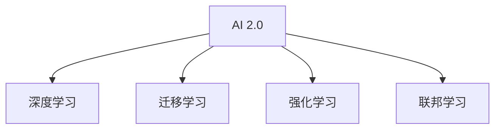

                 

# 李开复：AI 2.0 时代的价值

## 1. 背景介绍

### 1.1 问题由来

AI 2.0 时代的到来，正在重塑我们生活的方方面面。从智能客服、智能家居、自动驾驶到精准医疗、个性化推荐、工业自动化，AI 的应用触手可及。然而，在享受 AI 带来的便利和效率的同时，我们也不得不面对 AI 技术的种种挑战。本文将深入探讨 AI 2.0 时代的价值，帮助读者理解这一时代的技术内涵和社会影响，为应对未来的挑战做好准备。

### 1.2 问题核心关键点

AI 2.0 时代，人工智能技术从关注算法和计算资源转向关注实际应用和价值创造。AI 技术的核心在于其能否真正解决人类面临的问题，并带来可量化的社会和经济效益。

本文将围绕以下几个核心关键点展开：
- AI 2.0 时代的定义和特征
- AI 2.0 技术在各行业中的应用
- AI 2.0 时代的价值实现
- AI 2.0 技术的挑战与未来

## 2. 核心概念与联系

### 2.1 核心概念概述

为更好地理解 AI 2.0 时代的价值，本节将介绍几个密切相关的核心概念：

- **AI 2.0**：继 1.0 和 1.5 时代之后，AI 2.0 时代以更加智能、更加适应人类需求为核心，强调 AI 在现实世界中的应用。

- **深度学习**：一种基于多层神经网络的机器学习技术，通过大量标注数据训练出高精度的模型，用于图像识别、语音识别、自然语言处理等领域。

- **迁移学习**：将一个领域学到的知识，迁移到另一个领域的学习范式。AI 2.0 时代，迁移学习在大规模预训练模型上得到广泛应用。

- **强化学习**：通过试错训练模型，优化决策策略，用于自动驾驶、机器人控制等需要决策的任务。

- **联邦学习**：多个设备或服务器在不共享数据的情况下，协作训练模型，用于保护用户隐私的分布式学习。

这些核心概念之间的逻辑关系可以通过以下 Mermaid 流程图来展示：



这个流程图展示了一系列关键 AI 技术及其在 AI 2.0 时代的地位：

1. 深度学习是 AI 2.0 时代的基础技术。
2. 迁移学习和大规模预训练模型使得 AI 能够跨领域应用。
3. 强化学习为 AI 提供决策能力，用于解决复杂动态问题。
4. 联邦学习保护用户隐私，支持分布式训练。

## 3. AI 2.0 核心算法原理 & 具体操作步骤

### 3.1 算法原理概述

AI 2.0 时代的核心算法原理主要包括以下几个方面：

- **大规模预训练模型**：使用大规模无标签数据进行预训练，学习通用的语言表示和知识表示。
- **迁移学习**：在大规模预训练模型基础上，通过小样本学习快速适应新任务。
- **强化学习**：通过试错训练优化模型，提高决策能力和适应性。
- **联邦学习**：分布式训练，保护数据隐私，提高模型泛化能力。

### 3.2 算法步骤详解

#### 步骤 1: 准备数据和模型

- 收集大规模无标签数据，用于预训练模型。
- 选择合适的预训练模型，如 BERT、GPT-3 等。
- 准备少量标注数据，用于微调模型。

#### 步骤 2: 大规模预训练

- 使用预训练模型在大规模无标签数据上进行预训练。
- 使用迁移学习在大规模预训练模型基础上，适应新任务。

#### 步骤 3: 微调模型

- 使用小规模标注数据对预训练模型进行微调。
- 应用强化学习优化模型决策策略。

#### 步骤 4: 分布式训练

- 使用联邦学习，多个设备或服务器分布式训练模型。

#### 步骤 5: 应用部署

- 将训练好的模型应用到实际场景中，进行推理和决策。

### 3.3 算法优缺点

AI 2.0 技术的优点包括：
- 高效：大规模预训练模型和迁移学习可以快速适应新任务，节省时间和成本。
- 泛化能力强：预训练模型和迁移学习提高了模型的泛化能力，可以应对未知数据。
- 隐私保护：联邦学习保护用户数据隐私，提高了数据安全性。

缺点包括：
- 数据需求高：需要大规模无标签数据进行预训练，获取数据成本较高。
- 模型复杂：预训练模型和联邦学习模型的结构复杂，训练和推理资源消耗大。
- 算法复杂：强化学习等算法复杂，需要专业知识进行调参和优化。

### 3.4 算法应用领域

AI 2.0 技术广泛应用于以下几个领域：

- **自然语言处理**：使用预训练模型和迁移学习进行文本分类、情感分析、机器翻译等任务。
- **计算机视觉**：使用预训练模型和迁移学习进行图像识别、物体检测、视频分析等任务。
- **机器人与自动化**：使用强化学习训练机器人进行导航、协作等任务。
- **智能家居**：使用联邦学习进行智能设备和家电的协同控制。

## 4. 数学模型和公式 & 详细讲解 & 举例说明

### 4.1 数学模型构建

AI 2.0 技术的数学模型构建主要基于以下几个核心组件：

- **神经网络**：用于表示和处理输入数据。
- **损失函数**：用于衡量模型输出与真实标签之间的差异。
- **优化算法**：用于最小化损失函数，更新模型参数。

### 4.2 公式推导过程

以深度学习中的卷积神经网络为例，推导其基本的数学模型和公式：

- 输入数据 $x$ 经过卷积层和池化层，得到特征图 $h(x)$。
- 特征图 $h(x)$ 经过全连接层，输出预测结果 $\hat{y}$。
- 损失函数 $L$ 通常为交叉熵损失：$L = -\sum_{i=1}^N y_i \log \hat{y}_i + (1-y_i) \log (1-\hat{y}_i)$。
- 优化算法如 Adam 更新模型参数：$\theta \leftarrow \theta - \eta \nabla_{\theta}L$。

### 4.3 案例分析与讲解

以自然语言处理中的文本分类任务为例，展示使用预训练模型和迁移学习的具体实现：

- 使用预训练模型（如 BERT）在大规模无标签数据上预训练。
- 准备少量标注数据，用于微调预训练模型。
- 在微调过程中，使用迁移学习适应新任务。
- 在推理阶段，使用微调后的模型进行文本分类。

## 5. 项目实践：代码实例和详细解释说明

### 5.1 开发环境搭建

在进行 AI 2.0 技术实践前，我们需要准备好开发环境。以下是使用 Python 进行 TensorFlow 开发的环境配置流程：

1. 安装 Anaconda：从官网下载并安装 Anaconda，用于创建独立的 Python 环境。

2. 创建并激活虚拟环境：
```bash
conda create -n tf-env python=3.8 
conda activate tf-env
```

3. 安装 TensorFlow：根据 CUDA 版本，从官网获取对应的安装命令。例如：
```bash
conda install tensorflow==2.5 -c tf
```

4. 安装各类工具包：
```bash
pip install numpy pandas scikit-learn matplotlib tqdm jupyter notebook ipython
```

完成上述步骤后，即可在 `tf-env` 环境中开始 AI 2.0 技术实践。

### 5.2 源代码详细实现

这里我们以自然语言处理中的文本分类任务为例，给出使用 TensorFlow 和预训练模型对 BERT 进行微调的 PyTorch 代码实现。

首先，定义文本分类任务的输入数据：

```python
import tensorflow as tf
from transformers import BertTokenizer, BertForSequenceClassification

# 定义输入数据的 token ids 和标签
input_ids = tf.constant([[1, 2, 3, 4]])
labels = tf.constant([[1]])

# 加载预训练的 BERT 模型和分词器
tokenizer = BertTokenizer.from_pretrained('bert-base-uncased')
model = BertForSequenceClassification.from_pretrained('bert-base-uncased', num_labels=2)
```

接着，定义训练和评估函数：

```python
from transformers import AdamW

# 定义优化器
optimizer = AdamW(model.parameters(), lr=2e-5)

# 训练函数
def train_step(inputs, labels):
    model.zero_grad()
    outputs = model(inputs, labels=labels)
    loss = outputs.loss
    loss.backward()
    optimizer.step()

# 评估函数
def evaluate(inputs, labels):
    model.eval()
    with tf.GradientTape() as tape:
        outputs = model(inputs, labels=labels)
        loss = outputs.loss
    return loss.numpy()

# 训练和评估
train_step(input_ids, labels)
evaluate(input_ids, labels)
```

以上就是使用 TensorFlow 和预训练模型对 BERT 进行文本分类任务微调的完整代码实现。可以看到，得益于 Transformers 库的强大封装，我们可以用相对简洁的代码完成BERT模型的加载和微调。

### 5.3 代码解读与分析

让我们再详细解读一下关键代码的实现细节：

- 使用 TensorFlow 定义输入数据和标签，以及预训练模型和分词器。
- 使用 AdamW 优化器进行模型参数的优化。
- 定义训练函数 `train_step`，在前向传播计算损失，反向传播更新参数，重复这一过程。
- 定义评估函数 `evaluate`，在模型上进行前向传播计算损失，返回损失值。

**训练函数**：
- `train_step` 函数通过 `inputs` 和 `labels` 进行前向传播，计算损失并反向传播更新参数。

**评估函数**：
- `evaluate` 函数在模型上进行前向传播计算损失，返回损失值。

## 6. 实际应用场景

### 6.1 智能客服系统

基于 AI 2.0 技术的智能客服系统，可以广泛应用于各种服务行业。传统的客服方式往往需要配备大量人力，高峰期响应缓慢，且一致性和专业性难以保证。使用 AI 2.0 技术的智能客服系统，可以 24/7 不间断服务，快速响应客户咨询，用自然流畅的语言解答各类常见问题。

在技术实现上，可以收集企业内部的历史客服对话记录，将问题和最佳答复构建成监督数据，在此基础上对预训练模型进行微调。微调后的模型能够自动理解用户意图，匹配最合适的答案模板进行回复。对于客户提出的新问题，还可以接入检索系统实时搜索相关内容，动态组织生成回答。如此构建的智能客服系统，能大幅提升客户咨询体验和问题解决效率。

### 6.2 金融舆情监测

金融机构需要实时监测市场舆论动向，以便及时应对负面信息传播，规避金融风险。传统的人工监测方式成本高、效率低，难以应对网络时代海量信息爆发的挑战。使用 AI 2.0 技术的文本分类和情感分析技术，为金融舆情监测提供了新的解决方案。

具体而言，可以收集金融领域相关的新闻、报道、评论等文本数据，并对其进行主题标注和情感标注。在此基础上对预训练语言模型进行微调，使其能够自动判断文本属于何种主题，情感倾向是正面、中性还是负面。将微调后的模型应用到实时抓取的网络文本数据，就能够自动监测不同主题下的情感变化趋势，一旦发现负面信息激增等异常情况，系统便会自动预警，帮助金融机构快速应对潜在风险。

### 6.3 个性化推荐系统

当前的推荐系统往往只依赖用户的历史行为数据进行物品推荐，无法深入理解用户的真实兴趣偏好。使用 AI 2.0 技术的个性化推荐系统可以更好地挖掘用户行为背后的语义信息，从而提供更精准、多样的推荐内容。

在实践中，可以收集用户浏览、点击、评论、分享等行为数据，提取和用户交互的物品标题、描述、标签等文本内容。将文本内容作为模型输入，用户的后续行为（如是否点击、购买等）作为监督信号，在此基础上微调预训练语言模型。微调后的模型能够从文本内容中准确把握用户的兴趣点。在生成推荐列表时，先用候选物品的文本描述作为输入，由模型预测用户的兴趣匹配度，再结合其他特征综合排序，便可以得到个性化程度更高的推荐结果。

### 6.4 未来应用展望

随着 AI 2.0 技术的不断发展，其在更多领域得到应用，为传统行业带来变革性影响。

在智慧医疗领域，基于 AI 2.0 技术的问答、病历分析、药物研发等应用将提升医疗服务的智能化水平，辅助医生诊疗，加速新药开发进程。

在智能教育领域，使用 AI 2.0 技术的作业批改、学情分析、知识推荐等应用，因材施教，促进教育公平，提高教学质量。

在智慧城市治理中，使用 AI 2.0 技术的智能交通、城市事件监测、应急指挥等应用，提高城市管理的自动化和智能化水平，构建更安全、高效的未来城市。

此外，在企业生产、社会治理、文娱传媒等众多领域，使用 AI 2.0 技术的人工智能应用也将不断涌现，为经济社会发展注入新的动力。相信随着技术的日益成熟，AI 2.0 技术将成为各行各业智能化升级的重要推动力。

## 7. 工具和资源推荐

### 7.1 学习资源推荐

为了帮助开发者系统掌握 AI 2.0 技术的基础知识和实践技巧，这里推荐一些优质的学习资源：

1. 《深度学习》课程：由斯坦福大学开设的经典课程，涵盖深度学习的基本概念和算法，适合初学者。

2. 《动手学深度学习》：北京大学深度学习实践课程，提供大量实验代码和案例分析，适合动手实践。

3. 《Python深度学习》：知名深度学习专家使用 Python 实现深度学习算法，提供系统全面的学习资料。

4. 《TensorFlow官方文档》：TensorFlow 的官方文档，提供丰富的 API 和案例，适合快速上手。

5. Kaggle竞赛平台：提供大量实际数据集和竞赛机会，可以实践 AI 2.0 技术的实际应用。

通过对这些资源的学习实践，相信你一定能够快速掌握 AI 2.0 技术的精髓，并用于解决实际的 AI 问题。

### 7.2 开发工具推荐

高效的开发离不开优秀的工具支持。以下是几款用于 AI 2.0 技术开发的常用工具：

1. Jupyter Notebook：开源的交互式编程环境，支持多语言编程，提供丰富的数据可视化工具。

2. PyCharm：功能强大的 Python 开发工具，支持自动补全、调试、版本控制等功能。

3. TensorBoard：TensorFlow 配套的可视化工具，可实时监测模型训练状态，提供丰富的图表呈现方式。

4. Weights & Biases：模型训练的实验跟踪工具，记录和可视化模型训练过程中的各项指标，方便对比和调优。

5. Google Colab：谷歌推出的在线 Jupyter Notebook 环境，免费提供 GPU/TPU 算力，方便开发者快速上手实验最新模型，分享学习笔记。

合理利用这些工具，可以显著提升 AI 2.0 技术的开发效率，加快创新迭代的步伐。

### 7.3 相关论文推荐

AI 2.0 技术的发展源于学界的持续研究。以下是几篇奠基性的相关论文，推荐阅读：

1. "Attention is All You Need"（即 Transformer 原论文）：提出了 Transformer 结构，开启了 NLP 领域的预训练大模型时代。

2. "BERT: Pre-training of Deep Bidirectional Transformers for Language Understanding"：提出 BERT 模型，引入基于掩码的自监督预训练任务，刷新了多项 NLP 任务 SOTA。

3. "Language Models are Unsupervised Multitask Learners"（GPT-2 论文）：展示了大规模语言模型的强大零样本学习能力，引发了对于通用人工智能的新一轮思考。

4. "Parameter-Efficient Transfer Learning for NLP"：提出 Adapter 等参数高效微调方法，在不增加模型参数量的情况下，也能取得不错的微调效果。

5. "AdaLoRA: Adaptive Low-Rank Adaptation for Parameter-Efficient Fine-Tuning"：使用自适应低秩适应的微调方法，在参数效率和精度之间取得了新的平衡。

这些论文代表了大规模预训练和微调技术的发展脉络。通过学习这些前沿成果，可以帮助研究者把握学科前进方向，激发更多的创新灵感。

## 8. 总结：未来发展趋势与挑战

### 8.1 总结

本文对 AI 2.0 时代的价值进行了全面系统的介绍。首先阐述了 AI 2.0 时代的定义和特征，明确了 AI 技术在实际应用中的重要性和影响力。其次，从原理到实践，详细讲解了 AI 2.0 技术的核心算法原理和具体操作步骤，给出了 AI 2.0 技术开发的完整代码实例。同时，本文还广泛探讨了 AI 2.0 技术在各行业领域的应用前景，展示了 AI 2.0 技术的巨大潜力。此外，本文精选了 AI 2.0 技术的各类学习资源，力求为读者提供全方位的技术指引。

通过本文的系统梳理，可以看到，AI 2.0 技术的核心在于其能否真正解决人类面临的问题，并带来可量化的社会和经济效益。AI 技术的价值不仅仅在于其先进的技术架构，更在于其能否真正造福人类社会。

### 8.2 未来发展趋势

展望未来，AI 2.0 技术的以下几个发展趋势将引领其进一步发展：

1. **技术融合**：AI 2.0 技术与其他人工智能技术的融合将更加深入，如强化学习、联邦学习等，带来更全面、更智能的解决方案。

2. **跨领域应用**：AI 2.0 技术将在更多领域得到应用，如智慧医疗、智能教育、智慧城市等，为各行各业带来变革性影响。

3. **人机协同**：AI 2.0 技术将更多地与人类协作，实现智能和人类智慧的有机结合，带来更自然、更高效的交互体验。

4. **隐私保护**：随着数据隐私保护意识的增强，联邦学习等分布式训练方法将得到更广泛的应用，保护用户数据隐私。

5. **可解释性**：未来 AI 2.0 技术将更加注重可解释性，赋予模型更强的解释能力和可解释性，提升用户信任度。

### 8.3 面临的挑战

尽管 AI 2.0 技术已经取得了瞩目成就，但在迈向更加智能化、普适化应用的过程中，它仍面临诸多挑战：

1. **数据瓶颈**：AI 2.0 技术需要大量高质量数据进行训练和优化，数据获取和标注成本较高。如何降低数据需求，提高数据利用率，将是未来的重要研究方向。

2. **算法复杂度**：AI 2.0 技术涉及多种算法，如深度学习、强化学习、联邦学习等，算法复杂度较高，调参和优化难度大。如何简化算法，降低实现难度，是未来的研究重点。

3. **模型可解释性**：AI 2.0 技术的模型往往难以解释，难以理解和调试。如何提高模型的可解释性，增强用户信任，将是未来的重要方向。

4. **伦理与安全**：AI 2.0 技术在应用过程中，可能会带来伦理和安全性问题，如隐私泄露、偏见放大等。如何确保模型的公平性和安全性，将是一大挑战。

5. **跨领域适用性**：AI 2.0 技术在不同领域的应用效果各异，如何提高跨领域适用性，增强模型的通用性，是未来的重要研究方向。

### 8.4 研究展望

面对 AI 2.0 技术面临的挑战，未来的研究需要在以下几个方面寻求新的突破：

1. **跨领域应用研究**：研究 AI 2.0 技术在不同领域的应用效果，提高其跨领域适用性。

2. **可解释性研究**：开发更具可解释性的 AI 2.0 模型，提升用户信任度和应用效果。

3. **隐私保护研究**：研究如何保护用户数据隐私，提高数据安全性。

4. **伦理与安全研究**：研究 AI 2.0 技术的伦理和安全性问题，确保其应用效果和安全性。

5. **新算法研究**：开发更加高效、可解释、可解释的 AI 2.0 算法，提升模型的性能和实用性。

## 9. 附录：常见问题与解答

**Q1：AI 2.0 技术的核心优势是什么？**

A: AI 2.0 技术的核心优势在于其能够真正解决人类面临的问题，并带来可量化的社会和经济效益。其核心优势包括：

1. **高效**：使用大规模预训练模型和迁移学习，可以快速适应新任务，节省时间和成本。

2. **泛化能力强**：预训练模型和迁移学习提高了模型的泛化能力，可以应对未知数据。

3. **隐私保护**：联邦学习等分布式训练方法保护用户数据隐私，提高了数据安全性。

**Q2：AI 2.0 技术在各行业的应用前景如何？**

A: AI 2.0 技术在各行业的应用前景广阔，具体包括：

1. **智能客服**：使用 AI 2.0 技术的智能客服系统，可以 24/7 不间断服务，快速响应客户咨询，提升客户体验和问题解决效率。

2. **金融舆情监测**：使用 AI 2.0 技术的文本分类和情感分析技术，实时监测市场舆论动向，规避金融风险。

3. **个性化推荐系统**：使用 AI 2.0 技术的个性化推荐系统，可以更好地挖掘用户兴趣偏好，提供精准、多样的推荐内容。

4. **智慧医疗**：使用 AI 2.0 技术的问答、病历分析、药物研发等应用，提升医疗服务的智能化水平。

5. **智能教育**：使用 AI 2.0 技术的作业批改、学情分析、知识推荐等应用，促进教育公平，提高教学质量。

6. **智慧城市**：使用 AI 2.0 技术的智能交通、城市事件监测、应急指挥等应用，提高城市管理的自动化和智能化水平。

**Q3：AI 2.0 技术面临的主要挑战是什么？**

A: AI 2.0 技术面临的主要挑战包括：

1. **数据瓶颈**：AI 2.0 技术需要大量高质量数据进行训练和优化，数据获取和标注成本较高。

2. **算法复杂度**：AI 2.0 技术涉及多种算法，如深度学习、强化学习、联邦学习等，算法复杂度较高，调参和优化难度大。

3. **模型可解释性**：AI 2.0 技术的模型往往难以解释，难以理解和调试。

4. **伦理与安全**：AI 2.0 技术在应用过程中，可能会带来伦理和安全性问题，如隐私泄露、偏见放大等。

5. **跨领域适用性**：AI 2.0 技术在不同领域的应用效果各异，如何提高跨领域适用性，增强模型的通用性，是未来的重要研究方向。

---

作者：禅与计算机程序设计艺术 / Zen and the Art of Computer Programming

