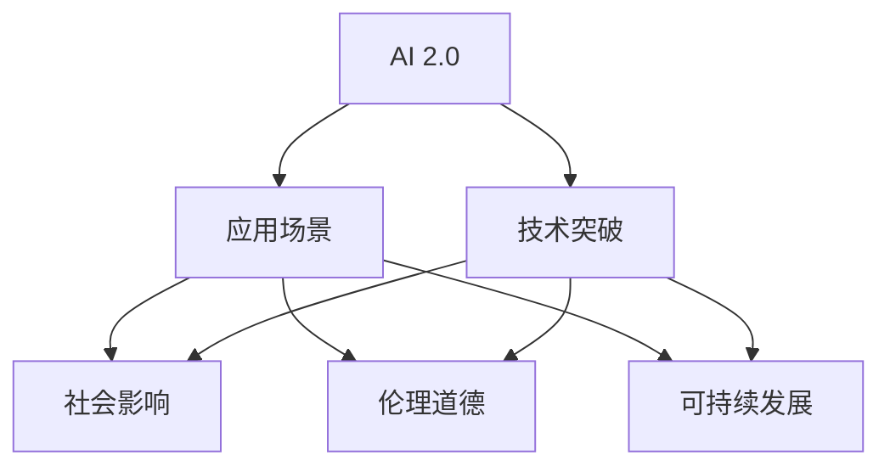

                 

# 李开复：AI 2.0 时代的价值

> 关键词：人工智能, 2.0 时代, 价值, 技术发展, 社会影响, 伦理道德

## 1. 背景介绍

### 1.1 问题由来

自1956年达特茅斯会议以来，人工智能(AI)领域经历了多次技术浪潮。从最初的符号主义到专家系统，再到机器学习和深度学习，AI技术在不断进步的同时，其应用领域也在不断扩展。而如今，我们正处于一个新的AI时代——AI 2.0。

### 1.2 问题核心关键点

AI 2.0时代，人工智能技术和应用实现了显著的突破，不仅在学术界和工业界引发了广泛关注，也引发了公众对AI技术的深度思考。其核心关键点包括：

1. **技术进步**：深度学习、强化学习、自然语言处理等技术的突破，使得AI在许多领域实现了超越人类水平的表现。
2. **应用场景**：AI技术在医疗、金融、教育、交通等领域的应用，提升了人类生活质量。
3. **社会影响**：AI技术的发展对就业、隐私、安全等方面产生了深远影响。
4. **伦理道德**：AI技术的滥用可能带来道德和法律问题，如自动化武器、面部识别争议等。
5. **可持续发展**：AI技术对环境和资源的影响，以及如何在发展AI技术的同时实现可持续发展。

### 1.3 问题研究意义

理解AI 2.0时代的价值，不仅有助于把握技术发展趋势，还能指导政策制定、社会规范和技术应用。通过深入分析AI技术对社会的影响，我们可以更好地利用AI技术，促进社会进步，同时避免可能的负面影响。

## 2. 核心概念与联系

### 2.1 核心概念概述

为更好地理解AI 2.0时代的价值，本节将介绍几个密切相关的核心概念：

- **AI 2.0**：指人工智能技术的第二阶段，包括深度学习、神经网络等技术的突破，实现了在特定任务上的超越人类水平表现。
- **技术突破**：指AI领域在算法、硬件、数据等方面的创新，推动AI技术的快速发展。
- **应用场景**：指AI技术在不同领域的具体应用，如医疗、金融、教育等。
- **社会影响**：指AI技术对就业、隐私、安全等社会层面的影响。
- **伦理道德**：指AI技术应用中涉及的道德和法律问题。
- **可持续发展**：指AI技术在发展过程中对环境和资源的影响，以及如何在发展AI技术的同时实现可持续发展。

这些核心概念之间的逻辑关系可以通过以下Mermaid流程图来展示：



这个流程图展示了几大核心概念之间的关系：

1. AI 2.0技术的突破是推动应用场景扩展的基础。
2. 应用场景的扩展带来了社会影响、伦理道德和可持续发展等多方面的考量。
3. 技术突破、应用场景、社会影响、伦理道德和可持续发展相互影响，共同构成了AI 2.0时代的全貌。

## 3. 核心算法原理 & 具体操作步骤
### 3.1 算法原理概述

AI 2.0时代的核心算法原理主要基于深度学习，特别是卷积神经网络(CNN)和递归神经网络(RNN)。通过这些算法，AI技术在图像识别、语音识别、自然语言处理等领域实现了突破。

具体来说，深度学习通过多层神经网络模拟人类大脑的处理方式，利用大量数据进行训练，从而学习到数据的复杂表示。这些复杂表示不仅能够识别复杂的模式，还能对未知数据进行预测和生成。

### 3.2 算法步骤详解

AI 2.0时代，深度学习的核心步骤包括数据预处理、模型构建、训练和优化等。以图像识别为例，其核心步骤包括：

1. **数据预处理**：将原始图像转换为神经网络可处理的格式，如归一化、裁剪、调整大小等。
2. **模型构建**：构建卷积神经网络，设计合适的卷积核、池化层、全连接层等。
3. **训练**：使用大规模数据集对模型进行训练，调整权重以最小化损失函数。
4. **优化**：使用优化算法如随机梯度下降(SGD)或其变种AdamW等，优化模型参数。

### 3.3 算法优缺点

深度学习在AI 2.0时代具有以下优点：

1. **高性能**：深度学习模型在特定任务上表现出色，如图像识别、语音识别、自然语言处理等。
2. **自适应**：深度学习模型能够适应不同复杂度的任务，从简单的分类到复杂的生成任务。
3. **可扩展**：深度学习模型可以通过增加层数和神经元数量来提高性能。

同时，深度学习也存在以下缺点：

1. **数据需求大**：深度学习模型需要大量标注数据进行训练，数据收集和标注成本高。
2. **计算资源消耗大**：深度学习模型计算量大，对硬件资源要求高。
3. **可解释性差**：深度学习模型通常是"黑盒"，难以解释其内部决策过程。
4. **过拟合风险高**：深度学习模型容易过拟合，尤其在数据量较少的情况下。

### 3.4 算法应用领域

深度学习在AI 2.0时代广泛应用于以下领域：

1. **计算机视觉**：如图像分类、目标检测、人脸识别等。
2. **自然语言处理**：如机器翻译、情感分析、文本生成等。
3. **语音识别**：如语音识别、说话人识别等。
4. **医疗影像**：如医学影像分析、疾病诊断等。
5. **自动驾驶**：如车辆感知、路径规划等。

## 4. 数学模型和公式 & 详细讲解 & 举例说明

### 4.1 数学模型构建

AI 2.0时代的数学模型主要基于深度学习，包括卷积神经网络(CNN)和递归神经网络(RNN)。这里以卷积神经网络为例，构建其数学模型。

卷积神经网络通常包含卷积层、池化层、全连接层等。其核心数学模型为：

$$
y = \sigma(\sum_i w_ix_i + b)
$$

其中，$x_i$ 表示输入特征，$w_i$ 表示卷积核权重，$b$ 表示偏置项，$\sigma$ 表示激活函数。

### 4.2 公式推导过程

卷积神经网络的推导过程如下：

1. **卷积层**：输入特征通过卷积操作，得到输出特征图。卷积操作的数学表达式为：

$$
y_{i,j} = \sum_k w_{k}x_{i+k,j} + b
$$

2. **激活函数**：通过激活函数$\sigma$对卷积层的输出进行非线性变换。

3. **池化层**：通过最大池化等操作，对特征图进行降维。

4. **全连接层**：将池化层输出的特征图转换为向量，输入全连接层进行分类或回归等任务。

### 4.3 案例分析与讲解

以图像分类为例，使用卷积神经网络进行分类任务。输入一张28x28的灰度图像，将其转换为向量形式，输入卷积神经网络中。通过多层卷积、池化等操作，得到特征图。最后通过全连接层进行分类，输出结果。

## 5. 项目实践：代码实例和详细解释说明

### 5.1 开发环境搭建

要进行AI 2.0时代的项目实践，首先需要搭建开发环境。以下是使用Python进行TensorFlow开发的环境配置流程：

1. 安装Anaconda：从官网下载并安装Anaconda，用于创建独立的Python环境。

2. 创建并激活虚拟环境：
```bash
conda create -n tf-env python=3.8 
conda activate tf-env
```

3. 安装TensorFlow：根据CUDA版本，从官网获取对应的安装命令。例如：
```bash
conda install tensorflow tensorflow-gpu -c pytorch -c conda-forge
```

4. 安装各类工具包：
```bash
pip install numpy pandas scikit-learn matplotlib tqdm jupyter notebook ipython
```

完成上述步骤后，即可在`tf-env`环境中开始项目实践。

### 5.2 源代码详细实现

下面以图像分类为例，给出使用TensorFlow构建卷积神经网络并进行训练的代码实现。

```python
import tensorflow as tf
from tensorflow.keras import datasets, layers, models

# 加载数据集
(train_images, train_labels), (test_images, test_labels) = datasets.cifar10.load_data()

# 数据预处理
train_images, test_images = train_images / 255.0, test_images / 255.0

# 构建卷积神经网络
model = models.Sequential([
    layers.Conv2D(32, (3, 3), activation='relu', input_shape=(32, 32, 3)),
    layers.MaxPooling2D((2, 2)),
    layers.Conv2D(64, (3, 3), activation='relu'),
    layers.MaxPooling2D((2, 2)),
    layers.Conv2D(64, (3, 3), activation='relu'),
    layers.Flatten(),
    layers.Dense(64, activation='relu'),
    layers.Dense(10)
])

# 编译模型
model.compile(optimizer='adam',
              loss=tf.keras.losses.SparseCategoricalCrossentropy(from_logits=True),
              metrics=['accuracy'])

# 训练模型
history = model.fit(train_images, train_labels, epochs=10, 
                    validation_data=(test_images, test_labels))
```

### 5.3 代码解读与分析

让我们再详细解读一下关键代码的实现细节：

**卷积神经网络模型构建**：
- `Sequential`：用于构建顺序模型，添加一层层卷积层、池化层、全连接层。
- `Conv2D`：用于添加卷积层，设置卷积核大小、数量、激活函数等。
- `MaxPooling2D`：用于添加池化层，对特征图进行降维。
- `Flatten`：用于将池化层输出的二维特征图转换为一维向量。
- `Dense`：用于添加全连接层，进行分类等任务。

**模型编译**：
- `compile`：编译模型，设置优化器、损失函数、评估指标等。
- `SparseCategoricalCrossentropy`：用于指定分类任务的损失函数。
- `from_logits=True`：表示模型的输出不是经过softmax函数处理的。

**模型训练**：
- `fit`：训练模型，设置训练数据、标签、训练轮数等。
- `validation_data`：指定验证数据集，用于评估模型性能。

可以看到，TensorFlow的高级API使得构建卷积神经网络并进行训练变得简洁高效。开发者可以将更多精力放在模型改进和调优上，而不必过多关注底层的实现细节。

当然，工业级的系统实现还需考虑更多因素，如模型的保存和部署、超参数的自动搜索、更灵活的任务适配层等。但核心的深度学习原理基本与此类似。

## 6. 实际应用场景

### 6.1 智慧医疗

AI 2.0时代的深度学习技术在智慧医疗领域展现了巨大的潜力。通过医疗影像、电子病历等数据，AI技术可以辅助医生进行疾病诊断、治疗方案推荐等任务。

例如，使用深度学习模型对X光片、CT影像等进行自动诊断，可以显著提高诊断效率和准确性。同时，使用自然语言处理技术对病历进行文本分析，可以辅助医生提取重要信息，提高诊疗效果。

### 6.2 智能交通

AI 2.0时代的深度学习技术在智能交通领域也有广泛应用。通过图像识别、语音识别等技术，AI系统可以辅助交通管理，提高道路安全性和交通效率。

例如，使用深度学习模型对交通视频进行分析，可以实现车辆识别、交通违规检测等任务。同时，使用语音识别技术，可以实现智能语音导航、智能客服等功能。

### 6.3 智能制造

AI 2.0时代的深度学习技术在智能制造领域也有广泛应用。通过图像识别、自然语言处理等技术，AI系统可以辅助制造过程，提高生产效率和质量。

例如，使用深度学习模型对生产过程进行图像识别和分析，可以实现质量检测、设备维护等任务。同时，使用自然语言处理技术，可以实现智能调度、智能客服等功能。

### 6.4 未来应用展望

随着深度学习技术的不断发展，AI 2.0时代的深度学习技术将在更多领域得到应用，为社会带来深远影响。

1. **医疗**：深度学习技术在医疗领域的应用将大大提升诊疗效果，提高医疗资源利用率，减少误诊、漏诊等问题。
2. **交通**：深度学习技术在智能交通领域的应用将提高交通效率，减少交通事故，改善城市交通环境。
3. **制造**：深度学习技术在智能制造领域的应用将提高生产效率，减少资源浪费，提升产品质量。
4. **教育**：深度学习技术在教育领域的应用将提升教育效果，实现个性化教育，培养更多优秀人才。
5. **金融**：深度学习技术在金融领域的应用将提高风险管理水平，提升投资决策效果，优化金融服务。
6. **环保**：深度学习技术在环保领域的应用将提升环境监测能力，实现污染源追踪，促进环境保护。

## 7. 工具和资源推荐
### 7.1 学习资源推荐

为了帮助开发者系统掌握AI 2.0时代的深度学习原理和实践技巧，这里推荐一些优质的学习资源：

1. **《深度学习》书籍**：由Ian Goodfellow、Yoshua Bengio和Aaron Courville合著，全面介绍了深度学习的理论基础和实际应用。
2. **CS231n《卷积神经网络和视觉识别》课程**：斯坦福大学开设的深度学习课程，涵盖卷积神经网络、图像分类等核心内容。
3. **PyTorch官方文档**：PyTorch框架的官方文档，提供了丰富的深度学习资源和样例代码。
4. **TensorFlow官方文档**：TensorFlow框架的官方文档，提供了完整的深度学习开发工具链和样例代码。
5. **Coursera深度学习专项课程**：由Google、DeepMind等知名机构开设的深度学习课程，涵盖深度学习理论和实践。

通过对这些资源的学习实践，相信你一定能够快速掌握深度学习的基本原理和应用技巧，并用于解决实际的NLP问题。

### 7.2 开发工具推荐

高效的开发离不开优秀的工具支持。以下是几款用于深度学习开发常用的工具：

1. **PyTorch**：基于Python的开源深度学习框架，灵活动态的计算图，适合快速迭代研究。
2. **TensorFlow**：由Google主导开发的开源深度学习框架，生产部署方便，适合大规模工程应用。
3. **TensorBoard**：TensorFlow配套的可视化工具，可实时监测模型训练状态，并提供丰富的图表呈现方式。
4. **Weights & Biases**：模型训练的实验跟踪工具，可以记录和可视化模型训练过程中的各项指标，方便对比和调优。
5. **Jupyter Notebook**：交互式的开发环境，支持Python代码编写和实时显示结果，方便调试和迭代。

合理利用这些工具，可以显著提升深度学习开发的效率，加快创新迭代的步伐。

### 7.3 相关论文推荐

深度学习在AI 2.0时代的快速发展离不开学界的持续研究。以下是几篇奠基性的相关论文，推荐阅读：

1. **ImageNet分类任务**：Hinton等提出的深度学习模型在ImageNet分类任务上取得了显著效果。
2. **卷积神经网络**：LeNet、AlexNet、VGG等经典的卷积神经网络模型，奠定了深度学习在计算机视觉领域的基础。
3. **自然语言处理**：LSTM、GRU等递归神经网络模型，推动了自然语言处理技术的突破。
4. **深度学习优化算法**：Adam、SGD等优化算法，提高了深度学习模型的训练效率和收敛速度。

这些论文代表了大规模深度学习模型的发展脉络。通过学习这些前沿成果，可以帮助研究者把握学科前进方向，激发更多的创新灵感。

## 8. 总结：未来发展趋势与挑战

### 8.1 总结

本文对AI 2.0时代的深度学习技术进行了全面系统的介绍。首先阐述了深度学习在AI 2.0时代的突破性进展，明确了其在计算机视觉、自然语言处理等领域的重要应用。其次，从原理到实践，详细讲解了深度学习模型的构建、训练和优化等关键步骤，给出了深度学习任务开发的完整代码实例。同时，本文还广泛探讨了深度学习技术在智慧医疗、智能交通、智能制造等多个领域的应用前景，展示了深度学习技术的广泛影响。此外，本文精选了深度学习技术的各类学习资源，力求为读者提供全方位的技术指引。

通过本文的系统梳理，可以看到，深度学习在AI 2.0时代不仅在技术上取得了突破，还在实际应用中展现了巨大的潜力。未来，伴随深度学习技术的不断发展，其在更多领域的应用将不断扩展，为社会带来更加深远的影响。

### 8.2 未来发展趋势

展望未来，深度学习技术的发展将呈现以下几个趋势：

1. **算法优化**：深度学习算法将不断优化，提高模型的训练效率和收敛速度，降低计算资源消耗。
2. **模型压缩**：深度学习模型将不断压缩，减小模型参数量，提高推理效率，降低存储和计算成本。
3. **多模态融合**：深度学习模型将实现跨模态融合，融合视觉、语音、文本等多种模态信息，提升模型的感知能力。
4. **边缘计算**：深度学习模型将向边缘计算方向发展，降低对云端计算资源的依赖，提升模型的实时性和可靠性。
5. **自适应学习**：深度学习模型将具备自适应学习能力，能够根据任务需求动态调整模型结构，提高模型的泛化能力。
6. **人机协同**：深度学习模型将与人类协同工作，发挥各自优势，实现更高效、智能的决策和执行。

### 8.3 面临的挑战

尽管深度学习技术在AI 2.0时代取得了显著进展，但在迈向更加智能化、普适化应用的过程中，它仍面临诸多挑战：

1. **数据依赖**：深度学习模型需要大量标注数据进行训练，数据收集和标注成本高，数据质量难以保证。
2. **计算资源**：深度学习模型计算量大，对硬件资源要求高，计算成本高。
3. **可解释性**：深度学习模型通常是"黑盒"，难以解释其内部决策过程，缺乏可解释性。
4. **过拟合风险**：深度学习模型容易过拟合，尤其在数据量较少的情况下，泛化能力有限。
5. **伦理道德**：深度学习模型应用中涉及的伦理道德问题，如自动化武器、面部识别争议等。
6. **可持续发展**：深度学习模型对环境资源的影响，以及如何在发展深度学习技术的同时实现可持续发展。

### 8.4 研究展望

面对深度学习技术面临的种种挑战，未来的研究需要在以下几个方面寻求新的突破：

1. **无监督和半监督学习**：摆脱对大规模标注数据的依赖，利用自监督学习、主动学习等无监督和半监督范式，最大限度利用非结构化数据，实现更加灵活高效的深度学习。
2. **模型压缩和稀疏化**：开发更加高效的模型压缩和稀疏化方法，减小模型参数量，提高推理效率，降低存储和计算成本。
3. **多模态融合**：实现跨模态融合，融合视觉、语音、文本等多种模态信息，提升模型的感知能力。
4. **自适应学习**：开发具备自适应学习能力的深度学习模型，根据任务需求动态调整模型结构，提高模型的泛化能力。
5. **伦理道德**：建立深度学习模型的伦理道德规范，避免有害应用，确保输出符合人类价值观和伦理道德。
6. **可持续发展**：在发展深度学习技术的同时，关注其对环境资源的影响，实现可持续发展。

这些研究方向的探索，必将引领深度学习技术迈向更高的台阶，为构建智能、普适、可持续的AI系统铺平道路。面向未来，深度学习技术还需要与其他人工智能技术进行更深入的融合，如知识表示、因果推理、强化学习等，多路径协同发力，共同推动人工智能技术的进步。只有勇于创新、敢于突破，才能不断拓展深度学习技术的边界，让智能技术更好地造福人类社会。

## 9. 附录：常见问题与解答

**Q1：深度学习在AI 2.0时代是否适用于所有应用场景？**

A: 深度学习在AI 2.0时代适用于许多应用场景，如计算机视觉、自然语言处理、智能交通等。但对于一些特定领域的应用，如化学、物理等，深度学习可能并不适用。此外，对于一些需要精细调节的任务，如自动化设计、精细制造等，深度学习也存在局限。

**Q2：深度学习在应用过程中需要注意哪些问题？**

A: 深度学习在应用过程中需要注意以下问题：
1. 数据需求：深度学习模型需要大量标注数据进行训练，数据收集和标注成本高，数据质量难以保证。
2. 计算资源：深度学习模型计算量大，对硬件资源要求高，计算成本高。
3. 可解释性：深度学习模型通常是"黑盒"，难以解释其内部决策过程，缺乏可解释性。
4. 过拟合风险：深度学习模型容易过拟合，尤其在数据量较少的情况下，泛化能力有限。
5. 伦理道德：深度学习模型应用中涉及的伦理道德问题，如自动化武器、面部识别争议等。
6. 可持续发展：深度学习模型对环境资源的影响，以及如何在发展深度学习技术的同时实现可持续发展。

**Q3：如何在深度学习中避免过拟合问题？**

A: 在深度学习中避免过拟合问题的方法包括：
1. 数据增强：通过回译、近义替换等方式扩充训练集。
2. 正则化：使用L2正则、Dropout等技术，防止模型过度适应训练集。
3. 提前停止：根据验证集性能决定何时停止训练，防止过拟合。
4. 模型压缩：使用模型压缩技术，减小模型规模，提高泛化能力。
5. 多模型集成：训练多个模型，取平均输出，抑制过拟合。

这些方法可以结合使用，根据具体任务和数据特点进行灵活调整。只有在数据、模型、训练、推理等各环节进行全面优化，才能最大限度地发挥深度学习的潜力。

**Q4：深度学习在实际部署中需要注意哪些问题？**

A: 将深度学习模型转化为实际应用，还需要考虑以下问题：
1. 模型裁剪：去除不必要的层和参数，减小模型尺寸，加快推理速度。
2. 量化加速：将浮点模型转为定点模型，压缩存储空间，提高计算效率。
3. 服务化封装：将模型封装为标准化服务接口，便于集成调用。
4. 弹性伸缩：根据请求流量动态调整资源配置，平衡服务质量和成本。
5. 监控告警：实时采集系统指标，设置异常告警阈值，确保服务稳定性。
6. 安全防护：采用访问鉴权、数据脱敏等措施，保障数据和模型安全。

合理利用这些工具，可以显著提升深度学习模型的开发效率，加快创新迭代的步伐。当然，工业级的系统实现还需考虑更多因素，如模型的保存和部署、超参数的自动搜索、更灵活的任务适配层等。但核心的深度学习原理基本与此类似。

---

作者：禅与计算机程序设计艺术 / Zen and the Art of Computer Programming

