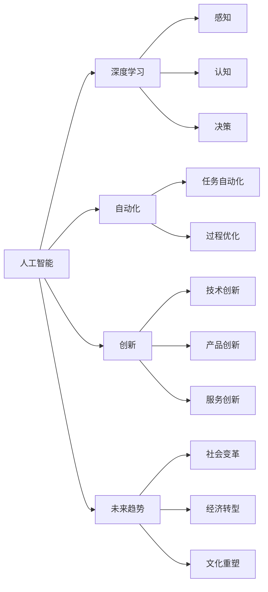

                 

# 李开复：AI 2.0 时代的价值

> 关键词：人工智能,深度学习,自动化,创新,未来趋势

## 1. 背景介绍

在当今科技飞速发展的时代，人工智能（AI）已经成为引领新一轮技术革命的关键力量。从深度学习到自动化，AI正在迅速渗透到各行各业，改变着我们的生活方式和工作方式。然而，AI的发展并非一帆风顺，在取得巨大成就的同时，也面临着诸多挑战和争议。本文将深入探讨AI 2.0时代的价值，以及其在推动创新和变革中扮演的角色。

## 2. 核心概念与联系

### 2.1 核心概念概述

为了更好地理解AI 2.0时代的价值，我们需要对几个核心概念进行详细解析：

- **人工智能**：指通过计算机模拟人类智能的过程，包括感知、认知、决策等方面。
- **深度学习**：一种机器学习方法，通过多层神经网络模拟人脑的神经元处理信息，实现复杂任务。
- **自动化**：通过AI技术实现任务自动化，减少人力成本，提高效率。
- **创新**：AI在技术、产品、服务等方面带来的新思想、新方法、新应用。
- **未来趋势**：AI技术发展前景及其对社会、经济、文化等方面的影响。

这些概念之间相互关联，共同构成了AI 2.0时代的技术框架。通过理解这些概念，我们可以更好地把握AI的未来走向及其价值。

### 2.2 核心概念原理和架构的 Mermaid 流程图



这个流程图展示了人工智能及其核心技术之间的关系，以及它们如何共同推动社会各领域的变革。

## 3. 核心算法原理 & 具体操作步骤

### 3.1 算法原理概述

AI 2.0时代，深度学习算法占据了核心地位。深度学习通过多层神经网络对数据进行抽象和处理，实现复杂的模式识别和预测任务。其核心原理包括：

- **前向传播**：将输入数据通过神经网络，逐层计算得到输出。
- **反向传播**：根据输出结果和真实标签计算误差，通过梯度下降算法调整网络参数，最小化损失函数。
- **激活函数**：引入非线性变换，增强网络的表达能力。
- **损失函数**：衡量模型预测与真实标签之间的差异，常用的有交叉熵、均方误差等。

### 3.2 算法步骤详解

深度学习算法的基本流程包括：

1. **数据准备**：收集和预处理训练数据，进行归一化、标准化等操作。
2. **模型搭建**：选择合适的神经网络架构，设置超参数如学习率、批大小等。
3. **训练模型**：使用训练数据进行前向传播和反向传播，不断调整网络参数。
4. **验证模型**：在验证集上评估模型性能，调整超参数以避免过拟合。
5. **测试模型**：在测试集上验证模型泛化能力，给出最终的性能指标。

### 3.3 算法优缺点

深度学习的优点包括：

- **高精度**：在图像识别、语音识别、自然语言处理等领域，深度学习模型的精度远超传统方法。
- **可扩展性**：通过增加网络层数和节点数，可以处理更加复杂和庞大的数据集。
- **自适应性**：深度学习算法可以自动学习数据特征，无需手动设计特征提取器。

缺点包括：

- **计算资源需求高**：深度学习模型参数量大，训练和推理过程中需要大量计算资源。
- **过拟合风险**：模型复杂度高，容易在训练集上过拟合。
- **可解释性差**：深度学习模型往往被视为"黑盒"，难以解释其内部工作机制。

### 3.4 算法应用领域

深度学习在多个领域得到了广泛应用，包括但不限于：

- **计算机视觉**：图像分类、目标检测、图像分割等。
- **自然语言处理**：机器翻译、文本生成、情感分析等。
- **语音识别**：自动语音识别、语音合成、情感识别等。
- **医疗健康**：医学影像分析、疾病诊断、基因分析等。
- **自动驾驶**：环境感知、路径规划、行为预测等。

## 4. 数学模型和公式 & 详细讲解 & 举例说明

### 4.1 数学模型构建

深度学习模型通常由输入层、隐藏层和输出层组成。以全连接神经网络为例，模型输入为 $x$，隐藏层为 $h$，输出层为 $y$，则模型可以表示为：

$$ y = f(h) = f(W_2h + b_2) = f(W_1f(W_2h + b_2) + b_1) $$

其中，$f$ 为激活函数，$W$ 和 $b$ 为权重和偏置参数。

### 4.2 公式推导过程

以最简单的二分类任务为例，假设有 $N$ 个训练样本，每个样本有 $D$ 个特征，则目标函数为：

$$ L(\theta) = -\frac{1}{N}\sum_{i=1}^N[y_i\log f(x_i; \theta) + (1-y_i)\log(1-f(x_i; \theta))] $$

其中，$y_i$ 为标签，$f(x_i; \theta)$ 为模型输出。使用梯度下降算法更新参数：

$$ \theta \leftarrow \theta - \eta\nabla_{\theta}L(\theta) $$

其中，$\eta$ 为学习率，$\nabla_{\theta}L(\theta)$ 为损失函数对参数的梯度。

### 4.3 案例分析与讲解

以图像分类为例，我们可以使用卷积神经网络（CNN）进行建模。CNN通过卷积层、池化层和全连接层，逐步提取图像特征并进行分类。具体步骤如下：

1. **数据预处理**：将图像进行归一化、灰度化等处理。
2. **卷积层**：通过卷积操作提取图像局部特征。
3. **池化层**：通过降采样操作减少特征维度，保留关键信息。
4. **全连接层**：将特征向量输入到全连接层进行分类。
5. **输出层**：使用Softmax函数进行多类别分类。

## 5. 项目实践：代码实例和详细解释说明

### 5.1 开发环境搭建

要使用深度学习算法进行项目实践，首先需要搭建开发环境。以下是一个典型的Python深度学习开发环境搭建步骤：

1. **安装Python**：确保Python版本为3.6以上，以支持深度学习框架。
2. **安装深度学习框架**：选择PyTorch或TensorFlow等深度学习框架，并按照官方文档进行安装。
3. **安装依赖库**：安装常用的依赖库，如NumPy、Pandas、Matplotlib等。

### 5.2 源代码详细实现

以手写数字识别为例，我们可以使用PyTorch框架进行项目实践。以下是代码实现：

```python
import torch
import torch.nn as nn
import torch.optim as optim
from torchvision import datasets, transforms

# 定义模型
class MNISTNet(nn.Module):
    def __init__(self):
        super(MNISTNet, self).__init__()
        self.conv1 = nn.Conv2d(1, 32, 3, 1)
        self.conv2 = nn.Conv2d(32, 64, 3, 1)
        self.fc1 = nn.Linear(64 * 14 * 14, 128)
        self.fc2 = nn.Linear(128, 10)

    def forward(self, x):
        x = self.conv1(x)
        x = nn.functional.relu(x)
        x = self.conv2(x)
        x = nn.functional.max_pool2d(x, 2)
        x = x.view(-1, 64 * 7 * 7)
        x = self.fc1(x)
        x = nn.functional.relu(x)
        x = self.fc2(x)
        return nn.functional.log_softmax(x, dim=1)

# 加载数据集
train_dataset = datasets.MNIST(root='./data', train=True, transform=transforms.ToTensor(), download=True)
test_dataset = datasets.MNIST(root='./data', train=False, transform=transforms.ToTensor(), download=True)

# 定义数据加载器
train_loader = torch.utils.data.DataLoader(train_dataset, batch_size=64, shuffle=True)
test_loader = torch.utils.data.DataLoader(test_dataset, batch_size=64, shuffle=False)

# 定义模型和优化器
model = MNISTNet()
criterion = nn.NLLLoss()
optimizer = optim.Adam(model.parameters(), lr=0.001)

# 训练模型
for epoch in range(10):
    train_loss = 0.0
    for batch_idx, (data, target) in enumerate(train_loader):
        data, target = data.to(device), target.to(device)
        optimizer.zero_grad()
        output = model(data)
        loss = criterion(output, target)
        loss.backward()
        optimizer.step()
        train_loss += loss.item()

    print('Train Epoch: {} \tLoss: {:.6f}'.format(epoch + 1, train_loss / len(train_loader)))

# 测试模型
correct = 0
total = 0
with torch.no_grad():
    for data, target in test_loader:
        data, target = data.to(device), target.to(device)
        output = model(data)
        _, predicted = torch.max(output.data, 1)
        total += target.size(0)
        correct += (predicted == target).sum().item()

print('Test Accuracy of the model on the 10000 test images: {} %'.format(100 * correct / total))
```

### 5.3 代码解读与分析

上述代码实现了一个简单的手写数字识别模型。其核心步骤如下：

1. **定义模型**：使用PyTorch定义一个简单的卷积神经网络，包含两个卷积层和两个全连接层。
2. **加载数据集**：使用PyTorch自带的MNIST数据集，加载训练集和测试集。
3. **定义数据加载器**：将数据集分成批次，使用Adam优化器进行模型训练。
4. **训练模型**：在训练集上训练模型，并输出训练损失。
5. **测试模型**：在测试集上测试模型，输出测试准确率。

## 6. 实际应用场景

### 6.1 医疗健康

在医疗健康领域，深度学习可以用于疾病预测、医学影像分析、基因分析等方面。例如，使用深度学习模型分析医疗影像，可以自动化检测癌症、糖尿病等疾病，提高诊断效率和准确性。此外，通过基因数据分析，可以揭示疾病的发病机制，为个性化治疗提供依据。

### 6.2 自动驾驶

自动驾驶是深度学习的重要应用之一。通过感知、决策、控制等模块，深度学习模型可以实现环境感知、路径规划、行为预测等功能。例如，使用卷积神经网络进行图像处理，识别交通标志、行人等，使用循环神经网络进行时间序列分析，预测行驶轨迹。

### 6.3 金融科技

在金融科技领域，深度学习可以用于风险评估、欺诈检测、市场预测等方面。通过分析大量的金融数据，深度学习模型可以发现异常交易行为，预测市场趋势，提高金融产品的风险控制能力。此外，通过自然语言处理，可以自动化处理金融报告和新闻，提供投资建议。

### 6.4 未来应用展望

未来，深度学习将会在更多领域得到广泛应用。例如：

- **教育**：使用深度学习进行学生成绩预测、智能辅导、内容推荐等，提高教育效果。
- **农业**：使用深度学习进行作物识别、病虫害预测、农业机器人控制等，提升农业生产效率。
- **娱乐**：使用深度学习进行视频推荐、内容生成、虚拟助手等，提升用户体验。

## 7. 工具和资源推荐

### 7.1 学习资源推荐

为了帮助开发者更好地掌握深度学习技术，以下是一些优质的学习资源：

- **Coursera深度学习课程**：由斯坦福大学Andrew Ng教授主讲，系统介绍了深度学习的基本概念和应用。
- **Deep Learning with PyTorch**：PyTorch官方文档，提供了丰富的深度学习教程和示例代码。
- **Hands-On Machine Learning with Scikit-Learn and TensorFlow**：O'Reilly出版社的经典书籍，详细介绍了机器学习的基本算法和应用。

### 7.2 开发工具推荐

以下是一些常用的深度学习开发工具：

- **PyTorch**：由Facebook开发的深度学习框架，支持动态计算图和GPU加速。
- **TensorFlow**：由Google开发的深度学习框架，支持静态计算图和分布式训练。
- **Keras**：基于TensorFlow的高级深度学习框架，提供简单易用的API。
- **MXNet**：由亚马逊开发的深度学习框架，支持多种编程语言和硬件平台。

### 7.3 相关论文推荐

以下是一些深度学习领域的经典论文，推荐阅读：

- **ImageNet Classification with Deep Convolutional Neural Networks**：Alex Krizhevsky等人提出卷积神经网络，在ImageNet数据集上取得了突破性进展。
- **Deep Residual Learning for Image Recognition**：Kaiming He等人提出残差网络，解决了深度神经网络训练中的梯度消失问题。
- **Attention Is All You Need**：Vaswani等人提出Transformer结构，开启了NLP领域的预训练大模型时代。

## 8. 总结：未来发展趋势与挑战

### 8.1 研究成果总结

深度学习在多个领域取得了巨大成功，但其未来发展仍面临诸多挑战：

- **计算资源需求**：深度学习模型需要大量计算资源，如GPU、TPU等，这对硬件设备提出了高要求。
- **数据获取困难**：深度学习需要大量的标注数据进行训练，获取高质量数据成本高，周期长。
- **模型可解释性差**：深度学习模型往往是"黑盒"，难以解释其内部工作机制，对应用场景提出了高要求。

### 8.2 未来发展趋势

未来，深度学习的发展趋势包括：

- **模型规模增大**：随着算力成本的下降和数据规模的扩张，深度学习模型将持续增大，其表达能力和泛化能力也将更强。
- **多模态融合**：深度学习将与视觉、语音、文本等多模态数据进行融合，实现更全面的信息感知和理解。
- **自动化设计**：自动化设计深度学习模型将变得更加普遍，减少人工干预和调试工作量。
- **联邦学习**：通过分布式训练和隐私保护技术，联邦学习将使深度学习模型在数据分布不均衡的情况下也能高效工作。

### 8.3 面临的挑战

尽管深度学习取得了显著成果，但仍面临以下挑战：

- **数据隐私保护**：深度学习模型需要大量数据进行训练，如何在保护数据隐私的同时，最大化数据利用效率，是未来的重要研究方向。
- **公平性和可解释性**：深度学习模型容易产生偏见，如何在模型设计和训练过程中引入公平性约束，增强模型的可解释性，是未来需要重点解决的问题。
- **跨模态知识迁移**：不同模态之间的知识迁移仍然存在挑战，如何在不同模态之间建立有效的知识关联，是未来需要攻克的难题。

### 8.4 研究展望

未来，深度学习的研究方向包括：

- **零样本和少样本学习**：探索如何在无需标注数据的情况下，通过迁移学习、数据增强等手段，实现模型的泛化能力。
- **多模态深度学习**：实现视觉、语音、文本等多模态数据的融合，增强深度学习模型的感知能力。
- **深度学习与量子计算**：探索量子计算在深度学习中的应用，提升计算效率和模型性能。
- **深度学习与区块链**：实现数据共享和隐私保护，增强深度学习模型的公平性和可解释性。

总之，深度学习在推动人工智能发展、变革人类社会方面具有巨大潜力。然而，其未来发展仍面临诸多挑战，需要在计算资源、数据获取、模型设计等方面进行深入研究，才能实现深度学习的长期可持续发展。

## 9. 附录：常见问题与解答

### Q1: 深度学习需要哪些计算资源？

A: 深度学习需要大量计算资源，如GPU、TPU等。一般来说，对于小规模模型，可以使用CPU进行训练和推理；对于大规模模型，则需要使用GPU或TPU进行计算加速。此外，还需要大容量的内存和存储空间，用于存储模型参数和训练数据。

### Q2: 深度学习模型是否可解释？

A: 深度学习模型通常是"黑盒"，难以解释其内部工作机制。为了增强模型的可解释性，可以采用可视化技术，如图像重构、特征热图等，帮助理解模型输出。此外，也可以引入对抗样本、可解释性工具等，进一步提升模型的可解释性。

### Q3: 深度学习模型如何应用于医疗健康？

A: 深度学习在医疗健康领域可以用于疾病预测、医学影像分析、基因分析等。例如，使用卷积神经网络分析医学影像，可以自动化检测疾病，提高诊断效率和准确性。此外，通过基因数据分析，可以揭示疾病的发病机制，为个性化治疗提供依据。

### Q4: 深度学习模型是否适用于多模态数据？

A: 深度学习可以适用于多模态数据，如视觉、语音、文本等。例如，通过多模态融合技术，可以将视觉和语音信息结合起来，实现更全面、准确的信息感知和理解。此外，深度学习还可以与自然语言处理技术结合，进行情感分析、文本生成等任务。

总之，深度学习在推动人工智能发展、变革人类社会方面具有巨大潜力。然而，其未来发展仍面临诸多挑战，需要在计算资源、数据获取、模型设计等方面进行深入研究，才能实现深度学习的长期可持续发展。未来，深度学习将会在更多领域得到广泛应用，为人类社会带来更多便利和福祉。

