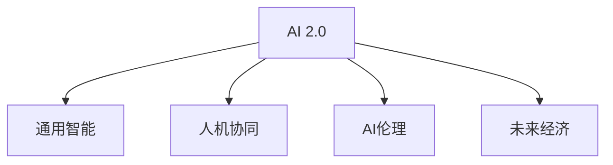

                 

# 李开复：AI 2.0 时代的价值

## 1. 背景介绍

### 1.1 问题由来
随着人工智能(AI)技术的迅猛发展，AI 2.0 时代已悄然来临。这个时代的核心特征是通用人工智能（AGI）的崛起，机器能够具备人类般的学习、推理、创造和情感。AI 2.0 不仅仅局限于某个特定领域，而是广泛应用于多个领域，带来颠覆性的变革。本文将从AI 2.0 时代的价值、未来发展趋势及面临的挑战等方面，深入探讨这一时代对人类社会的影响。

### 1.2 问题核心关键点
AI 2.0 时代的价值主要体现在以下几个方面：

- **人类能力增强**：AI 2.0 将极大提升人类在决策、创造、沟通和处理信息等方面的能力，使人机协同达到新高度。
- **社会经济变革**：AI 2.0 技术将加速各行各业的自动化和智能化进程，改变现有的经济结构和社会组织形态。
- **伦理道德考量**：AI 2.0 技术的广泛应用带来了新的伦理道德问题，需要探讨如何在技术发展中保护个人隐私、确保数据安全。
- **人类与AI的共生**：AI 2.0 时代，人类与AI将形成新的共生关系，AI将成为人类生活和工作的助手和伙伴。

### 1.3 问题研究意义
理解AI 2.0 时代的价值，对于推动AI技术的发展、制定合理的AI政策、保障社会的可持续发展具有重要意义。AI 2.0 技术的应用将深刻改变人类生活和工作方式，提升生产力，推动社会进步。同时，对AI 2.0 可能带来的伦理问题进行深入探讨，有助于构建更加安全、公正、包容的AI生态。

## 2. 核心概念与联系

### 2.1 核心概念概述

为更好地理解AI 2.0 时代的价值，本节将介绍几个关键概念及其相互关系：

- **AI 2.0**：指具有通用智能能力的AI系统，能够在多个领域展现与人类相当或超越人类的能力。
- **通用智能**：AI系统能够跨领域学习、推理和创新，解决复杂问题。
- **人机协同**：AI 2.0 技术与人类的协作将更加紧密，实现1+1>2的效果。
- **AI伦理**：在AI 2.0 技术应用过程中，如何平衡技术发展与伦理道德，保护个人隐私和数据安全。
- **未来经济**：AI 2.0 技术对就业、产业结构、经济增长等未来经济形态的影响。

这些概念之间的逻辑关系可以通过以下Mermaid流程图来展示：



这个流程图展示AI 2.0时代核心概念的相互联系：

1. AI 2.0 技术的出现基于通用智能能力。
2. 通用智能赋予AI 2.0 更广泛的应用能力。
3. 人机协同提升AI 2.0在多个领域的效能。
4. AI伦理在AI 2.0 的广泛应用中尤为关键。
5. 未来经济形态受AI 2.0 技术的影响深远。

## 3. 核心算法原理 & 具体操作步骤

### 3.1 算法原理概述

AI 2.0 时代的核心算法主要是深度学习和强化学习。深度学习通过多层神经网络模型，实现对复杂数据的自动特征提取和模式识别；强化学习则通过智能体与环境的交互，逐步优化策略，实现自主决策和学习。

### 3.2 算法步骤详解

AI 2.0 时代的算法步骤主要包括数据准备、模型训练、模型评估和应用部署：

1. **数据准备**：收集和处理大量高质量的数据，用于模型的训练和测试。数据的多样性和代表性对模型性能至关重要。

2. **模型训练**：选择合适的深度学习或强化学习算法，在大量数据上进行训练。训练过程需要调整模型参数，以最小化预测误差或最大化奖励。

3. **模型评估**：在独立于训练数据的测试集上评估模型性能。常见的评估指标包括准确率、召回率、F1分数等。

4. **应用部署**：将训练好的模型部署到实际应用场景中，进行实时推理和决策。

### 3.3 算法优缺点

AI 2.0 时代的算法具有以下优点：

- **高效性**：通过自动化学习过程，AI 2.0 算法能够快速处理大量数据，提高决策效率。
- **准确性**：在大规模数据训练的基础上，AI 2.0 模型能够取得高精度预测结果。
- **灵活性**：算法能够适应不同的应用场景，提供个性化的解决方案。

同时，AI 2.0 算法也存在以下缺点：

- **资源消耗大**：深度学习和强化学习算法需要强大的计算资源和存储空间，难以在资源有限的设备上运行。
- **可解释性差**：AI 2.0 模型往往被视为"黑盒"，难以解释其内部决策逻辑。
- **伦理风险高**：AI 2.0 模型的应用可能带来隐私泄露、就业冲击等问题，需要加以重视。

### 3.4 算法应用领域

AI 2.0 算法的应用领域广泛，包括但不限于以下几个方面：

- **医疗健康**：用于疾病诊断、个性化治疗、医疗影像分析等。
- **金融服务**：应用于信用评分、风险管理、投资策略优化等。
- **交通运输**：用于智能交通管理、自动驾驶、物流优化等。
- **智能制造**：用于质量控制、生产调度、设备维护等。
- **教育培训**：用于个性化学习、自动评分、智能辅导等。

这些应用领域展示了AI 2.0 技术在提高效率、优化决策、改善服务质量等方面的巨大潜力。

## 4. 数学模型和公式 & 详细讲解 & 举例说明

### 4.1 数学模型构建

AI 2.0 时代的主要数学模型包括深度神经网络（DNN）和强化学习模型（RL）。

- **深度神经网络**：由多层线性变换和非线性激活函数组成，用于特征提取和模式识别。常用的深度神经网络模型包括卷积神经网络（CNN）、循环神经网络（RNN）和变分自编码器（VAE）等。
- **强化学习模型**：通过智能体与环境的交互，逐步优化策略。常用的强化学习模型包括Q-learning、SARSA、策略梯度等。

### 4.2 公式推导过程

以下以深度神经网络为例，推导其前向传播和反向传播公式。

设深度神经网络由 $L$ 层组成，其中第 $l$ 层的输入为 $x_l$，输出为 $h_l$，激活函数为 $\sigma(\cdot)$。

- **前向传播**：
  $$
  h_1 = W_1x + b_1
  $$
  $$
  h_l = \sigma(h_{l-1}W_l + b_l), l=2,...,L
  $$
  最终输出为 $h_L$。

- **反向传播**：
  $$
  \frac{\partial L}{\partial W_l} = \frac{\partial L}{\partial h_l}\frac{\partial h_l}{\partial W_l} = \frac{\partial L}{\partial h_l}\frac{\partial \sigma(h_{l-1}W_l + b_l)}{\partial h_{l-1}}W_l
  $$
  $$
  \frac{\partial L}{\partial b_l} = \frac{\partial L}{\partial h_l}\frac{\partial \sigma(h_{l-1}W_l + b_l)}{\partial h_{l-1}}
  $$

### 4.3 案例分析与讲解

以图像分类任务为例，使用卷积神经网络（CNN）进行图像特征提取和分类。

- **数据准备**：收集和处理图像数据集，进行数据增强、归一化等预处理。
- **模型设计**：设计卷积神经网络结构，包括卷积层、池化层、全连接层等。
- **训练过程**：使用交叉熵损失函数，通过反向传播算法更新模型参数。
- **评估测试**：在独立测试集上评估模型性能，根据评估结果调整模型参数。

## 5. 项目实践：代码实例和详细解释说明

### 5.1 开发环境搭建

在进行AI 2.0时代项目的实践时，首先需要搭建合适的开发环境。

1. **安装Python**：从官网下载并安装Python，建议选择最新版本。
2. **安装深度学习框架**：如TensorFlow、PyTorch等，这些框架提供了丰富的深度学习库和工具。
3. **配置环境**：设置虚拟环境，确保项目开发的隔离性和一致性。

### 5.2 源代码详细实现

以下以图像分类任务为例，使用TensorFlow实现卷积神经网络的代码实现。

```python
import tensorflow as tf
from tensorflow.keras import layers, models

# 构建卷积神经网络模型
model = models.Sequential([
    layers.Conv2D(32, (3, 3), activation='relu', input_shape=(28, 28, 1)),
    layers.MaxPooling2D((2, 2)),
    layers.Conv2D(64, (3, 3), activation='relu'),
    layers.MaxPooling2D((2, 2)),
    layers.Flatten(),
    layers.Dense(64, activation='relu'),
    layers.Dense(10)
])

# 编译模型
model.compile(optimizer='adam',
              loss=tf.keras.losses.SparseCategoricalCrossentropy(from_logits=True),
              metrics=['accuracy'])

# 训练模型
model.fit(train_images, train_labels, epochs=10, 
          validation_data=(test_images, test_labels))
```

### 5.3 代码解读与分析

**TensorFlow**：
- `Sequential`：用于构建顺序模型。
- `Conv2D`：卷积层，用于特征提取。
- `MaxPooling2D`：池化层，用于降维。
- `Flatten`：将高维数据展平。
- `Dense`：全连接层，用于分类。

**模型编译**：
- `adam`：Adam优化器，适用于深度学习模型。
- `SparseCategoricalCrossentropy`：交叉熵损失函数，适用于多分类问题。
- `from_logits=True`：表示输出的是原始概率值，而非logit值。

**模型训练**：
- `fit`：用于训练模型，指定训练数据、标签、轮数等参数。
- `validation_data`：用于验证模型性能的独立数据集。

## 6. 实际应用场景

### 6.1 智能医疗

AI 2.0 技术在智能医疗领域有着广阔的应用前景。例如，通过深度学习算法，AI 2.0 系统可以分析医疗影像，进行疾病诊断和治疗方案推荐。此外，强化学习算法可以用于优化手术路径和药物剂量，提高医疗效率和准确性。

### 6.2 智能交通

AI 2.0 技术在智能交通领域也表现出色。通过强化学习算法，AI 2.0 系统可以优化交通信号控制、智能驾驶、物流管理等，减少交通拥堵，提高运输效率。

### 6.3 金融服务

AI 2.0 技术在金融领域也有着广泛应用。通过深度学习算法，AI 2.0 系统可以进行信用评分、风险管理、投资策略优化等。此外，强化学习算法可以用于交易系统，提升交易效率和收益。

### 6.4 未来应用展望

未来，AI 2.0 技术将继续向更广泛的领域拓展，带来颠覆性的变革。例如，AI 2.0 在教育、娱乐、社交等领域的应用将进一步深化，提升人类生活质量。

## 7. 工具和资源推荐

### 7.1 学习资源推荐

- **《深度学习》（Ian Goodfellow等著）**：深入介绍深度学习的基本概念和算法。
- **Coursera AI课程**：斯坦福大学和Coursera合作开设的深度学习课程，涵盖深度学习理论和实践。
- **GitHub**：全球最大的开源社区，可以获取和学习大量AI 2.0 项目和代码。

### 7.2 开发工具推荐

- **PyTorch**：开源深度学习框架，提供了丰富的神经网络库和工具。
- **TensorFlow**：由Google开发的深度学习框架，适用于大规模分布式训练。
- **Jupyter Notebook**：轻量级编程环境，支持交互式编程和数据可视化。

### 7.3 相关论文推荐

- **《深度学习》（Ian Goodfellow等著）**：全面介绍深度学习的基本概念和算法。
- **《强化学习》（Richard S. Sutton和Andrew G. Barto著）**：介绍强化学习的基本概念和算法。
- **《AI Superpowers》（李开复著）**：探讨AI 2.0 时代的技术、应用和未来趋势。

## 8. 总结：未来发展趋势与挑战

### 8.1 研究成果总结

AI 2.0 技术已经取得了显著进展，应用于多个领域并带来显著效果。然而，其应用仍面临许多挑战，如资源消耗大、模型可解释性差、伦理风险高等。

### 8.2 未来发展趋势

未来，AI 2.0 技术将继续向更广泛的领域拓展，带来更多创新应用。例如，AI 2.0 在医疗、交通、金融等领域的应用将进一步深化。

### 8.3 面临的挑战

AI 2.0 技术在发展过程中面临许多挑战，如资源消耗大、模型可解释性差、伦理风险高等。

### 8.4 研究展望

未来，需要在AI 2.0 技术发展中重视伦理道德问题，提高模型可解释性，优化资源消耗，推动AI 2.0 技术向更广泛的应用场景拓展。

## 9. 附录：常见问题与解答

**Q1: AI 2.0 技术与传统AI技术有何区别？**

A: AI 2.0 技术具有通用智能能力，能够应用于多个领域并带来颠覆性变革，而传统AI技术往往局限于特定领域和任务。

**Q2: AI 2.0 技术的应用前景如何？**

A: AI 2.0 技术在医疗、交通、金融等领域有着广阔的应用前景，未来还将拓展到教育、娱乐、社交等多个领域。

**Q3: AI 2.0 技术面临的主要挑战是什么？**

A: AI 2.0 技术面临的主要挑战包括资源消耗大、模型可解释性差、伦理风险高等问题。

**Q4: 如何提高AI 2.0 模型的可解释性？**

A: 可以通过引入因果分析和博弈论工具，提高模型决策的可解释性，避免“黑盒”问题。

**Q5: AI 2.0 技术对就业有何影响？**

A: AI 2.0 技术将改变现有的就业结构，可能带来就业冲击，但同时也会创造新的就业机会，如AI工程师、数据科学家等。

---

作者：禅与计算机程序设计艺术 / Zen and the Art of Computer Programming

