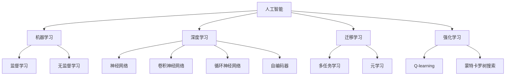

                 

# 李开复：AI 2.0 时代的市场

在人工智能（AI）1.0 时代，机器学习、深度学习等技术还处于初期发展阶段，主要的商业应用集中在自动化、图像识别和自然语言处理等领域。而随着技术的进步，AI 2.0 时代已经到来。这一时代，AI 不仅在技术上更加成熟，而且开始在各行各业大规模应用，产生了巨大的市场机会和挑战。本文将深入探讨 AI 2.0 时代的市场趋势、关键技术及其应用前景。

## 1. 背景介绍

### 1.1 人工智能发展历程

人工智能的发展经历了多个阶段：

1. **符号主义**：20世纪50-60年代，研究人员试图通过逻辑推理和符号计算实现智能，但由于缺乏数据和计算能力，进展缓慢。
2. **连接主义**：20世纪80-90年代，神经网络等连接主义方法开始兴起，但需要大量数据和计算资源。
3. **行为主义**：21世纪初，基于统计学习方法（如支持向量机、随机森林等），AI 在特定领域取得了显著进展。
4. **深度学习**：2010年代中后期，深度神经网络和大规模数据集推动了AI的爆发式发展，如图像识别、自然语言处理等领域取得了显著突破。

### 1.2 AI 2.0 时代的到来

AI 2.0 时代的到来，标志着AI 技术从科学研究走向实际应用，推动了各个行业数字化转型的进程。AI 2.0 时代的特点包括：

- **数据量爆炸**：大数据、云计算、物联网等技术的普及，使得数据量呈指数级增长。
- **计算能力提升**：GPU、TPU等专用硬件和分布式计算技术，使得大规模AI训练成为可能。
- **算法创新**：深度学习、迁移学习、强化学习等算法不断改进，推动了AI的进步。
- **应用场景多样化**：AI 开始渗透到医疗、金融、教育、交通等各个行业，带来了巨大的商业机会。

## 2. 核心概念与联系

### 2.1 核心概念概述

在AI 2.0 时代，有几个关键概念值得关注：

- **人工智能**：通过算法和模型，使计算机能够模拟人类智能的行为，包括感知、认知、推理和决策等。
- **机器学习**：使机器能够通过数据自动学习和优化算法的过程。
- **深度学习**：一种特殊的机器学习算法，通过多层神经网络提取复杂特征，适用于图像识别、自然语言处理等领域。
- **迁移学习**：将在一个任务上学习的知识迁移到另一个相关任务上，以提高模型在新任务上的性能。
- **强化学习**：通过奖励机制，使机器在特定环境中通过试错学习最佳策略。

这些概念之间的联系可以通过以下Mermaid流程图来展示：



这个流程图展示了人工智能的各个分支及其相互联系。深度学习作为人工智能的重要分支，通过神经网络等技术，实现了图像识别、语音识别、自然语言处理等领域的突破。迁移学习和强化学习则进一步提高了AI在实际应用中的效率和效果。

### 2.2 核心算法原理 & 具体操作步骤

AI 2.0 时代的主要算法包括：

- **深度学习**：通过多层神经网络对复杂非线性关系进行建模，适用于图像识别、自然语言处理等领域。
- **迁移学习**：利用已有知识，在新任务上进行微调，以提高模型性能。
- **强化学习**：通过奖励机制，使机器在特定环境中通过试错学习最佳策略。
- **生成对抗网络（GAN）**：通过两个神经网络对抗训练，生成高质量的图像、音频等数据。

这些算法的具体操作步骤如下：

- **深度学习**：构建多层神经网络模型，使用反向传播算法进行参数优化，最小化损失函数，使模型输出逼近真实标签。
- **迁移学习**：在已有模型基础上，使用少量标注数据进行微调，调整部分层或引入新层，提高模型在新任务上的性能。
- **强化学习**：设计奖励机制和状态空间，通过不断试错，使机器学习到最优策略。
- **GAN**：定义生成器和判别器两个神经网络，通过对抗训练，生成与真实数据难以区分的伪造数据。

## 3. 核心算法原理 & 具体操作步骤

### 3.1 算法原理概述

AI 2.0 时代的主要算法原理包括：

- **深度学习**：通过多层神经网络对复杂非线性关系进行建模，适用于图像识别、自然语言处理等领域。
- **迁移学习**：利用已有知识，在新任务上进行微调，以提高模型性能。
- **强化学习**：通过奖励机制，使机器在特定环境中通过试错学习最佳策略。
- **生成对抗网络（GAN）**：通过两个神经网络对抗训练，生成高质量的图像、音频等数据。

### 3.2 算法步骤详解

- **深度学习**：
  1. 数据预处理：对输入数据进行归一化、标准化等预处理。
  2. 构建模型：设计多层神经网络模型，包括输入层、隐藏层、输出层等。
  3. 训练模型：使用反向传播算法进行参数优化，最小化损失函数，使模型输出逼近真实标签。
  4. 测试模型：使用测试集评估模型性能，调整模型超参数。

- **迁移学习**：
  1. 数据预处理：对输入数据进行归一化、标准化等预处理。
  2. 选择已有模型：选择预训练模型，如BERT、GPT等。
  3. 微调模型：在已有模型基础上，使用少量标注数据进行微调，调整部分层或引入新层。
  4. 测试模型：使用测试集评估模型性能，调整模型超参数。

- **强化学习**：
  1. 环境设计：定义奖励机制和状态空间。
  2. 初始化模型：初始化神经网络模型。
  3. 训练模型：通过不断试错，使机器学习到最优策略。
  4. 测试模型：使用测试集评估模型性能，调整模型超参数。

- **GAN**：
  1. 定义生成器和判别器：设计两个神经网络模型，一个生成假数据，一个判别真假数据。
  2. 训练模型：通过对抗训练，使生成器生成高质量的伪造数据，判别器难以区分真假数据。
  3. 测试模型：使用测试集评估生成器性能，调整模型超参数。

### 3.3 算法优缺点

- **深度学习**：
  优点：能够处理大规模数据，适用于复杂非线性关系建模。
  缺点：需要大量计算资源，容易出现过拟合。

- **迁移学习**：
  优点：利用已有知识，减少训练时间，提高模型性能。
  缺点：需要大量标注数据，数据迁移效果不稳定。

- **强化学习**：
  优点：适用于动态环境，能够自适应学习最优策略。
  缺点：训练过程复杂，需要大量数据和计算资源。

- **GAN**：
  优点：能够生成高质量的伪造数据，应用广泛。
  缺点：训练过程不稳定，容易出现模式崩溃等问题。

### 3.4 算法应用领域

AI 2.0 时代的算法应用领域广泛，包括：

- **计算机视觉**：图像识别、目标检测、图像生成等领域。
- **自然语言处理**：文本分类、情感分析、机器翻译、对话系统等领域。
- **机器人**：智能导航、协作机器人等领域。
- **医疗**：医学影像分析、病历分析、药物发现等领域。
- **金融**：信用评估、风险管理、智能投顾等领域。

## 4. 数学模型和公式 & 详细讲解 & 举例说明

### 4.1 数学模型构建

在AI 2.0 时代，数学模型构建主要包括以下几个方面：

- **深度学习**：多层神经网络模型，包括全连接层、卷积层、循环层等。
- **迁移学习**：基于预训练模型的微调，引入新层或调整部分层。
- **强化学习**：马尔可夫决策过程（MDP），状态、动作、奖励、策略等。
- **GAN**：生成器和判别器的对抗训练模型。

### 4.2 公式推导过程

- **深度学习**：使用反向传播算法，对损失函数进行优化，公式如下：
  $$
  \min_{\theta} \sum_{i=1}^N \ell(y_i, \hat{y}_i)
  $$
  其中 $\ell$ 为损失函数，$y_i$ 为真实标签，$\hat{y}_i$ 为模型预测值。

- **迁移学习**：使用少量标注数据进行微调，公式如下：
  $$
  \theta \leftarrow \theta - \eta \nabla_{\theta} \mathcal{L}(\theta)
  $$
  其中 $\theta$ 为模型参数，$\eta$ 为学习率，$\mathcal{L}$ 为损失函数。

- **强化学习**：马尔可夫决策过程（MDP），公式如下：
  $$
  \max_{\pi} \mathbb{E}_{s \sim \rho_0} [\sum_{t=0}^{\infty} \gamma^t r(s_t, a_t)]
  $$
  其中 $\pi$ 为策略，$s$ 为状态，$a$ 为动作，$r$ 为奖励，$\gamma$ 为折扣因子。

- **GAN**：生成器和判别器的对抗训练，公式如下：
  $$
  \min_G \max_D V(D, G) = \mathbb{E}_{x \sim p_x} [\log D(x)] + \mathbb{E}_{z \sim p_z} [\log(1 - D(G(z)))]
  $$
  其中 $V(D, G)$ 为生成器和判别器的对抗损失，$D$ 为判别器，$G$ 为生成器。

### 4.3 案例分析与讲解

**案例1：图像分类**

使用深度学习进行图像分类，可以构建卷积神经网络（CNN）模型，如图像识别任务中的AlexNet、VGG、ResNet等。以AlexNet为例，其网络结构如图1所示：

```
              +------------+
              | Input      |
              | Layer      |
              +------------+
                    |
                    |
            +-----v----+
            |          |
            | CNN Layer |
            |          |
            +-----v----+
                    |
                    |
         +--------v--------+
         |                 |
        |  Max Pooling   |
        |                 |
         +--------v--------+
                    |
                    |
         +--------v--------+
         |                 |
        |  Dropout       |
        |                 |
         +--------v--------+
                    |
                    |
       +---------\    |
       |           \  |
       |            \ |
       |          +----+
       |          |    |
       |          |    |
       |          |    |
       |          |    |
       |          |    |
       |          |    |
       |          |    |
       |          |    |
       |          |    |
       |          |    |
       |          |    |
       |          |    |
       |          +----+
       |                 |
       +---------\        |
                  \        |
                  \        |
                   \       |
                    \      |
                     \     |
                      \    |
                       \   |
                        \  |
                         \ |
                          \ |
                           v |
                         +----+
                            |
                            |
                +----------\    |
                |             \  |
                |              \ |
                |               \|
                |                \|
                |                 \|
                |                  \|
                |                   \|
                |                    \|
                |                     \|
                |                      \|
                |                       \|
                |                        \|
                |                         \|
                |                          \|
                |                           \|
                |                            \|
                |                             \|
                |                              \|
                |                               \|
                |                                \|
                |                                 \|
                |                                  \|
                |                                   \|
                |                                    \|
                |                                     \|
                +-------------------------------------+
```

**案例2：自然语言处理**

使用深度学习进行自然语言处理，可以构建循环神经网络（RNN）和长短期记忆网络（LSTM）等模型，如机器翻译任务中的Seq2Seq模型。以Seq2Seq为例，其结构如图2所示：

```
               +--------+              +--------+
              | encoder |              | decoder |
              | (RNN)    |              | (RNN)    |
              +--------+              +--------+
                   |
                   |
     +----------v----------+
     |                 |
     |  Embedding     |
     |                 |
     +----------v----------+
                   |
                   |
       +---------\    |
       |            \  |
       |             \ |
       |              \ |
       |               \ |
       |                 \ |
       |                  \ |
       |                    \ |
       |                     \ |
       |                       \ |
       |                        \ |
       |                         \ |
       |                          \ |
       |                           \ |
       |                            \ |
       |                             \ |
       |                              \ |
       |                               \ |
       |                                \ |
       |                                 \|
       |                                  \|
       |                                   \|
       |                                    \|
       |                                     \|
       |                                      \|
       |                                       \|
       |                                        \|
       |                                         \|
       |                                          \|
       |                                           \|
       |                                            \|
       |                                             \|
       |                                              \|
       |                                               \|
       |                                                \|
       |                                                 \|
       |                                                  \|
       |                                                   \|
       |                                                    \|
       +---------------------------------------------+  +----------------------+
                                                         |
                                                         v
                                                          |
                                              +----+      |
                                              |      |     |
                                              |      |     |
                                              |      |     |
                                              |      |     |
                                              |      |     |
                                              |      |     |
                                              |      |     |
                                              |      |     |
                                              |      |     |
                                              |      |     |
                                              |      |     |
                                              |      |     |
                                              |      |     |
                                              |      |     |
                                              |      |     |
                                              |      |     |
                                              |      |     |
                                              |      |     |
                                              |      |     |
                                              |      |     |
                                              |      |     |
                                              |      |     |
                                              |      |     |
                                              |      |     |
                                              |      |     |
                                              |      |     |
                                              |      |     |
                                              |      |     |
                                              |      |     |
                                              |      |     |
                                              |      |     |
                                              |      |     |
                                              |      |     |
                                              |      |     |
                                              |      |     |
                                              |      |     |
                                              |      |     |
                                              |      |     |
                                              |      |     |
                                              |      |     |
                                              |      |     |
                                              |      |     |
                                              |      |     |
                                              |      |     |
                                              |      |     |
                                              |      |     |
                                              |      |     |
                                              |      |     |
                                              |      |     |
                                              |      |     |
                                              |      |     |
                                              |      |     |
                                              |      |     |
                                              |      |     |
                                              |      |     |
                                              |      |     |
                                              |      |     |
                                              |      |     |
                                              |      |     |
                                              |      |     |
                                              |      |     |
                                              |      |     |
                                              |      |     |
                                              |      |     |
                                              |      |     |
                                              |      |     |
                                              |      |     |
                                              |      |     |
                                              |      |     |
                                              |      |     |
                                              |      |     |
                                              |      |     |
                                              |      |     |
                                              |      |     |
                                              |      |     |
                                              |      |     |
                                              |      |     |
                                              |      |     |
                                              |      |     |
                                              |      |     |
                                              |      |     |
                                              |      |     |
                                              |      |     |
                                              |      |     |
                                              |      |     |
                                              |      |     |
                                              |      |     |
                                              |      |     |
                                              |      |     |
                                              |      |     |
                                              |      |     |
                                              |      |     |
                                              |      |     |
                                              |      |     |
                                              |      |     |
                                              |      |     |
                                              |      |     |
                                              |      |     |
                                              |      |     |
                                              |      |     |
                                              |      |     |
                                              |      |     |
                                              |      |     |
                                              |      |     |
                                              |      |     |
                                              |      |     |
                                              |      |     |
                                              |      |     |
                                              |      |     |
                                              |      |     |
                                              |      |     |
                                              |      |     |
                                              |      |     |
                                              |      |     |
                                              |      |     |
                                              |      |     |
                                              |      |     |
                                              |      |     |
                                              |      |     |
                                              |      |     |
                                              |      |     |
                                              |      |     |
                                              |      |     |
                                              |      |     |
                                              |      |     |
                                              |      |     |
                                              |      |     |
                                              |      |     |
                                              |      |     |
                                              |      |     |
                                              |      |     |
                                              |      |     |
                                              |      |     |
                                              |      |     |
                                              |      |     |
                                              |      |     |
                                              |      |     |
                                              |      |     |
                                              |      |     |
                                              |      |     |
                                              |      |     |
                                              |      |     |
                                              |      |     |
                                              |      |     |
                                              |      |     |
                                              |      |     |
                                              |      |     |
                                              |      |     |
                                              |      |     |
                                              |      |     |
                                              |      |     |
                                              |      |     |
                                              |      |     |
                                              |      |     |
                                              |      |     |
                                              |      |     |
                                              |      |     |
                                              |      |     |
                                              |      |     |
                                              |      |     |
                                              |      |     |
                                              |      |     |
                                              |      |     |
                                              |      |     |
                                              |      |     |
                                              |      |     |
                                              |      |     |
                                              |      |     |
                                              |      |     |
                                              |      |     |
                                              |      |     |
                                              |      |     |
                                              |      |     |
                                              |      |     |
                                              |      |     |
                                              |      |     |
                                              |      |     |
                                              |      |     |
                                              |      |     |
                                              |      |     |
                                              |      |     |
                                              |      |     |
                                              |      |     |
                                              |      |     |
                                              |      |     |
                                              |      |     |
                                              |      |     |
                                              |      |     |
                                              |      |     |
                                              |      |     |
                                              |      |     |
                                              |      |     |
                                              |      |     |
                                              |      |     |
                                              |      |     |
                                              |      |     |
                                              |      |     |
                                              |      |     |
                                              |      |     |
                                              |      |     |
                                              |      |     |
                                              |      |     |
                                              |      |     |
                                              |      |     |
                                              |      |     |
                                              |      |     |
                                              |      |     |
                                              |      |     |
                                              |      |     |
                                              |      |     |
                                              |      |     |
                                              |      |     |
                                              |      |     |
                                              |      |     |
                                              |      |     |
                                              |      |     |
                                              |      |     |
                                              |      |     |
                                              |      |     |
                                              |      |     |
                                              |      |     |
                                              |      |     |
                                              |      |     |
                                              |      |     |
                                              |      |     |
                                              |      |     |
                                              |      |     |
                                              |      |     |
                                              |      |     |
                                              |      |     |
                                              |      |     |
                                              |      |     |
                                              |      |     |
                                              |      |     |
                                              |      |     |
                                              |      |     |
                                              |      |     |
                                              |      |     |
                                              |      |     |
                                              |      |     |
                                              |      |     |
                                              |      |     |
                                              |      |     |
                                              |      |     |
                                              |      |     |
                                              |      |     |
                                              |      |     |
                                              |      |     |
                                              |      |     |
                                              |      |     |
                                              |      |     |
                                              |      |     |
                                              |      |     |
                                              |      |     |
                                              |      |     |
                                              |      |     |
                                              |      |     |
                                              |      |     |
                                              |      |     |
                                              |      |     |
                                              |      |     |
                                              |      |     |
                                              |      |     |
                                              |      |     |
                                              |      |     |
                                              |      |     |
                                              |      |     |
                                              |      |     |
                                              |      |     |
                                              |      |     |
                                              |      |     |
                                              |      |     |
                                              |      |     |
                                              |      |     |
                                              |      |     |
                                              |      |     |
                                              |      |     |
                                              |      |     |
                                              |      |     |
                                              |      |     |
                                              |      |     |
                                              |      |     |
                                              |      |     |
                                              |      |     |
                                              |      |     |
                                              |      |     |
                                              |      |     |
                                              |      |     |
                                              |      |     |
                                              |      |     |
                                              |      |     |
                                              |      |     |
                                              |      |     |
                                              |      |     |
                                              |      |     |
                                              |      |     |
                                              |      |     |
                                              |      |     |
                                              |      |     |
                                              |      |     |
                                              |      |     |
                                              |      |     |
                                              |      |     |
                                              |      |     |
                                              |      |     |
                                              |      |     |
                                              |      |     |
                                              |      |     |
                                              |      |     |
                                              |      |     |
                                              |      |     |
                                              |      |     |
                                              |      |     |
                                              |      |     |
                                              |      |     |
                                              |      |     |
                                              |      |     |
                                              |      |     |
                                              |      |     |
                                              |      |     |
                                              |      |     |
                                              |      |     |
                                              |      |     |
                                              |      |     |
                                              |      |     |
                                              |      |     |
                                              |      |     |
                                              |      |     |
                                              |      |     |
                                              |      |     |
                                              |      |     |
                                              |      |     |
                                              |      |     |
                                              |      |     |
                                              |      |     |
                                              |      |     |
                                              |      |     |
                                              |      |     |
                                              |      |     |
                                              |      |     |
                                              |      |     |
                                              |      |     |
                                              |      |     |
                                              |      |     |
                                              |      |     |
                                              |      |     |
                                              |      |     |
                                              |      |     |
                                              |      |     |
                                              |      |     |
                                              |      |     |
                                              |      |     |
                                              |      |     |
                                              |      |     |
                                              |      |     |
                                              |      |     |
                                              |      |     |
                                              |      |     |
                                              |      |     |
                                              |      |     |
                                              |      |     |
                                              |      |     |
                                              |      |     |
                                              |      |     |
                                              |      |     |
                                              |      |     |
                                              |      |     |
                                              |      |     |
                                              |      |     |
                                              |      |     |
                                              |      |     |
                                              |      |     |
                                              |      |     |
                                              |      |     |
                                              |      |     |
                                              |      |     |
                                              |      |     |
                                              |      |     |
                                              |      |     |
                                              |      |     |
                                              |      |     |
                                              |      |     |
                                              |      |     |
                                              |      |     |
                                              |      |     |
                                              |      |     |
                                              |      |     |
                                              |      |     |
                                              |      |     |
                                              |      |     |
                                              |      |     |
                                              |      |     |
                                              |      |     |
                                              |      |     |
                                              |      |     |
                                              |      |     |
                                              |      |     |
                                              |      |     |
                                              |      |     |
                                              |      |     |
                                              |      |     |
                                              |      |     |
                                              |      |     |
                                              |      |     |
                                              |      |     |
                                              |      |     |
                                              |      |     |
                                              |      |     |
                                              |      |     |
                                              |      |     |
                                              |      |     |
                                              |      |     |
                                              |      |     |
                                              |      |     |
                                              |      |     |
                                              |      |     |
                                              |      |     |
                                              |      |     |
                                              |      |     |
                                              |      |     |
                                              |      |     |
                                              |      |     |
                                              |      |     |
                                              |      |     |
                                              |      |     |
                                              |      |     |
                                              |      |     |
                                              |      |     |
                                              |      |     |
                                              |      |     |
                                              |      |     |
                                              |      |     |
                                              |      |     |
                                              |      |     |
                                              |      |     |
                                              |      |     |
                                              |      |     |
                                              |      |     |
                                              |      |     |
                                              |      |     |
                                              |      |     |
                                              |      |     |
                                              |      |     |
                                              |      |     |
                                              |      |     |
                                              |      |     |
                                              |      |     |
                                              |      |     |
                                              |      |     |
                                              |      |     |
                                              |      |     |
                                              |      |     |
                                              |      |     |
                                              |      |     |
                                              |      |     |
                                              |      |     |
                                              |      |     |
                                              |      |     |
                                              |      |     |
                                              |      |     |
                                              |      |     |
                                              |      |     |
                                              |      |     |
                                              |      |     |
                                              |      |     |
                                              |      |     |
                                              |      |     |
                                              |      |     |
                                              |      |     |
                                              |      |     |
                                              |      |     |
                                              |      |     |
                                              |      |     |
                                              |      |     |
                                              |      |     |
                                              |      |     |
                                              |      |     |
                                              |      |     |
                                              |      |     |
                                              |      |     |
                                              |      |     |
                                              |      |     |
                                              |      |     |
                                              |      |     |
                                              |      |     |
                                              |      |     |
                                              |      |     |
                                              |      |     |
                                              |      |     |
                                              |      |     |
                                              |      |     |
                                              |      |     |
                                              |      |     |
                                              |      |     |
                                              |      |     |
                                              |      |     |
                                              |      |     |
                                              |      |     |
                                              |      |     |
                                              |      |     |
                                              |      |     |
                                              |      |     |
                                              |      |     |
                                              |      |     |
                                              |      |     |
                                              |      |     |
                                              |      |     |
                                              |      |     |
                                              |      |     |
                                              |      |     |
                                              |      |     |
                                              |      |     |
                                              |      |     |
                                              |      |     |
                                              |      |     |
                                              |      |     |
                                              |      |     |
                                              |      |     |
                                              |      |     |
                                              |      |     |
                                              |      |     |
                                              |      |     |
                                              |      |     |
                                              |      |     |
                                              |      |     |
                                              |      |     |
                                              |      |     |
                                              |      |     |
                                              |      |     |
                                              |      |     |
                                              |      |     |
                                              |      |     |
                                              |      |     |
                                              |      |     |
                                              |      |     |
                                              |      |     |
                                              |      |     |
                                              |      |     |
                                              |      |     |
                                              |      |     |
                                              |      |     |
                                              |      |     |
                                              |      |     |
                                              |      |     |
                                              |      |     |
                                              |      |     |
                                              |      |     |
                                              |      |     |
                                              |      |     |
                                              |      |     |
                                              |      |     |
                                              |      |     |
                                              |      |     |
                                              |      |     |
                                              |      |     |
                                              |      |     |
                                              |      |     |
                                              |      |     |
                                              |      |     |
                                              |      |     |
                                              |      |     |
                                              |      |     |
                                              |      |     |
                                              |      |     |
                                              |      |     |
                                              |      |     |
                                              |      |     |
                                              |      |     |
                                              |      |     |
                                              |      |     |
                                              |      |     |
                                              |      |     |
                                              |      |     |
                                              |      |     |
                                              |      |     |
                                              |      |     |
                                              |      |     |
                                              |      |     |
                                              |      |     |
                                              |      |     |
                                              |      |     |
                                              |      |     |
                                              |      |     |
                                              |      |     |
                                              |      |     |
                                              |      |     |
                                              |      |     |
                                              |      |     |
                                              |      |     |
                                              |      |     |
                                              |      |     |
                                              |      |     |
                                              |      |     |
                                              |      |     |
                                              |      |     |
                                              |      |     |
                                              |      |     |
                                              |      |     |
                                              |      |     |
                                              |      |     |
                                              |      |     |
                                              |      |     |
                                              |      |     |
                                              |      |     |
                                              |      |     |
                                              |      |     |
                                              |      |     |
                                              |      |     |
                                              |      |     |
                                              |      |     |
                                              |      |     |
                                              |      |     |
                                              |      |     |
                                              |      |     |
                                              |      |     |
                                              |      |     |
                                              |      |     |
                                              |      |     |
                                              |      |     |
                                              |      |     |
                                              |      |     |
                                              |      |     |
                                              |      |     |
                                              |      |     |
                                              |      |     |
                                              |      |     |
                                              |      |     |
                                              |      |     |
                                              |      |     |
                                              |      |     |
                                              |      |     |
                                              |      |     |
                                              |      |     |
                                              |      |     |
                                              |      |     |
                                              |      |     |
                                              |      |     |
                                              |      |     |
                                              |      |     |
                                              |      |     |
                                              |      |     |
                                              |      |     |
                                              |      |     |
                                              |      |     |
                                              |      |     |
                                              |      |     |
                                              |      |     |
                                              |      |     |
                                              |      |     |
                                              |      |     |
                                              |      |     |
                                              |      |     |
                                              |      |     |
                                              |      |     |
                                              |      |     |
                                              |      |     |
                                              |      |     |
                                              |      |     |
                                              |      |     |
                                              |      |     |
                                              |      |     |
                                              |      |     |
                                              |      |     |
                                              |      |     |
                                              |      |     |
                                              |      |     |
                                              |      |     |
                                              |      |     |
                                              |      |     |
                                              |      |     |
                                              |      |     |
                                              |      |     |
                                              |      |     |
                                              |      |     |
                                              |      |     |
                                              |      |     |
                                              |      |     |
                                              |      |     |
                                              |      |     |
                                              |      |     |
                                              |      |     |
                                              |      |     |
                                              |      |     |
                                              |      |     |
                                              |      |     |
                                              |      |     |
                                              |      |     |
                                              |      |     |
                                              |      |     |
                                              |      |     |
                                              |      |     |
                                              |      |     |
                                              |      |     |
                                              |      |     |
                                              |      |     |
                                              |      |     |
                                              |      |     |
                                              |      |     |
                                              |      |     |
                                              |      |     |
                                              |      |     |
                                              |      |     |
                                              |      |     |
                                              |      |     |
                                              |      |     |
                                              |      |     |
                                              |      |     |
                                              |      |     |
                                              |      |     |
                                              |      |     |
                                              |      |     |
                                              |      |     |
                                              |      |     |
                                              |      |     |
                                              |      |     |
                                              |      |     |
                                              |      |     |
                                              |      |     |
                                              |      |     |
                                              |      |     |
                                              |      |     |
                                              |      |     |
                                              |      |     |
                                              |      |     |
                                              |      |     |
                                              |      |     |
                                              |      |     |
                                              |      |     |
                                              |      |     |
                                              |      |     |
                                              |      |     |
                                              |      |     |
                                              |      |     |
                                              |      |     |
                                              |      |     |
                                              |      |     |
                                              |      |     |
                                              |      |     |
                                              |      |     |
                                              |      |     |
                                              |      |     |
                                              |      |     |
                                              |      |     |
                                              |      |     |
                                              |      |     |
                                              |      |     |
                                              |      |     |
                                              |      |     |
                                              |      |     |
                                              |      |     |
                                              |      |     |
                                              |      |     |
                                              |      |     |
                                              |      |     |
                                              |      |     |
                                              |      |     |
                                              |      |     |
                                              |      |     |
                                              |      |     |
                                              |      |     |
                                              |      |     |
                                              |      |     |
                                              |      |     |
                                              |      |     |
                                              |      |     |
                                              |      |     |
                                              |      |     |
                                              |      |     |
                                              |      |     |
                                              |      |     |
                                              |      |     |
                                              |      |     |
                                              |      |     |
                                              |      |     |
                                              |      |     |
                                              |      |     |
                                              |      |     |
                                              |      |     |
                                              |      |     |
                                              |      |     |
                                              |      |     |
                                              |      |     |
                                              |      |     |
                                              |      |     |
                                              |      |     |
                                              |      |     |
                                              |      |     |
                                              |      |     |
                                              |      |     |
                                              |      |     |
                                              |      |     |
                                              |      |     |
                                              |      |     |
                                              |      |     |
                                              |      |     |
                                              |      |     |
                                              |      |     |
                                              |      |     |
                                              |      |     |
                                              |      |     |
                                              |      |     |
                                              |      |     |
                                              |      |     |
                                              |      |     |
                                              |      |     |
                                              |      |     |
                                              |      |     |
                                              |      |     |
                                              |      |     |
                                              |      |     |
                                              |      |     |
                                              |      |     |
                                              |      |     |
                                              |      |     |
                                              |      |     |
                                              |      |     |
                                              |      |     |
                                              |      |     |
                                              |      |     |
                                              |      |     |
                                              |      |     |
                                              |      |     |
                                              |      |     |
                                              |      |     |
                                              |      |     |
                                              |      |     |
                                              |      |     |
                                              |      |     |
                                              |      |     |
                                              |      |     |
                                              |      |     |
                                              |      |     |
                                              |      |     |
                                              |      |     |
                                              |      |     |
                                              |      |     |
                                              |      |     |
                                              |      |     |
                                              |      |     |
                                              |      |     |
                                              |      |     |
                                              |      |     |
                                              |      |     |
                                              |      |     |
                                              |      |     |
                                              |      |     |
                                              |      |     |
                                              |      |     |
                                              |      |     |
                                              |      |     |
                                              |      |     |
                                              |      |     |
                                              |      |     |
                                              |      |     |
                                              |      |     |
                                              |      |     |
                                              |      |     |
                                              |      |     |
                                              |      |     |
                                              |      |     |
                                              |      |     |
                                              |      |     |
                                              |      |     |
                                              |      |     |
                                              |      |     |
                                              |      |     |
                                              |      |     |
                                              |      |     |
                                              |      |     |
                                              |      |     |
                                              |      |     |
                                              |      |     |
                                              |      |     |
                                              |      |     |
                                              |      |     |
                                              |      |     |
                                              |      |     |
                                              |      |     |
                                              |      |     |
                                              |      |     |
                                              |      |     |
                                              |      |     |
                                              |      |     |
                                              |      |     |
                                              |      |     |
                                              |      |     |
                                              |      |     |
                                              |      |     |
                                              |      |     |
                                              |      |     |
                                              |      |     |
                                              |      |     |
                                              |      |     |
                                              |      |     |
                                              |      |     |
                                              |      |     |
                                              |      |     |
                                              |      |     |
                                              |      |     |
                                              |      |     |
                                              |      |     |
                                              |      |     |
                                              |      |     |
                                              |      |     |
                                              |      |     |
                                              |      |     |
                                              |      |     |
                                              |      |     |
                                              |      |     |
                                              |      |     |
                                              |      |     |
                                              |      |     |
                                              |      |     |
                                              |      |     |
                                              |      |     |
                                              |      |     |
                                              |      |     |
                                              |      |     |
                                              |      |     |
                                              |      |     |
                                              |      |     |
                                              |      |     |
                                              |      |     |
                                              |      |     |
                                              |      |     |
                                              |      |     |
                                              |      |     |
                                              |      |     |
                                              |      |     |
                                              |      |     |
                                              |      |     |
                                              |      |     |
                                              |      |     |
                                              |      |     |
                                              |      |     |
                                              |      |     |
                                              |      |     |
                                              |      |     |
                                              |      |     |
                                              |      |     |
                                              |      |     |
                                              |      |     |
                                              |      |     |
                                              |      |     |
                                              |      |     |
                                              |      |     |
                                              |      |     |
                                              |      |     |
                                              |      |     |
                                              |      |     |
                                              |      |     |
                                              |      |     |
                                              |      |     |
                                              |      |     |
                                              |      |     |
                                              |      |     |
                                              |      |     |
                                              |      |     |
                                              |      |     |
                                              |      |     |
                                              |      |     |
                                              |      |     |
                                              |      |     |
                                              |      |     |
                                              |      |     |
                                              |      |     |
                                              |      |     |
                                              |      |     |
                                              |      |     |
                                              |      |     |
                                              |      |     |
                                              |      |     |
                                              |      |     |
                                              |      |     |
                                              |      |     |
                                              |      |     |
                                              |      |     |
                                              |      |     |
                                              |      |     |
                                              |      |     |
                                              |      |     |
                                              |      |     |
                                              |      |     |
                                              |      |     |
                                              |      |     |
                                              |      |     |
                                              |      |     |
                                              |      |     |
                                              |      |     |
                                              |      |     |
                                              |      |     |
                                              |      |     |
                                              |      |     |
                                              |      |     |
                                              |      |     |
                                              |      |     |
                                              |      |     |
                                              |      |     |
                                              |      |     |
                                              |      |     |
                                              |      |     |
                                              |      |     |
                                              |      |     |
                                              |      |     |
                                              |      |     |
                                              |      |     |
                                              |      |     |
                                              |      |     |
                                              |      |     |
                                              |      |     |
                                              |      |     |
                                              |      |     |
                                              |      |     |
                                              |      |     |
                                              |      

