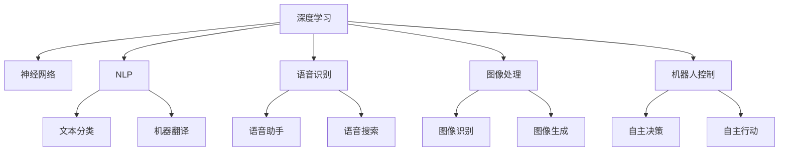

                 

# 李开复：AI 2.0 时代的挑战

## 1. 背景介绍

### 1.1 问题由来

在人工智能（AI）飞速发展的今天，我们正在步入AI 2.0时代，也称为智能时代或人机协作时代。AI 2.0时代的特点是人工智能更加普及，深度学习和神经网络技术已经广泛应用于语音识别、图像处理、自然语言处理、机器人控制等各个领域。AI 2.0时代的挑战也随之而来。本文将探讨AI 2.0时代的挑战及其应对策略。

### 1.2 问题核心关键点

AI 2.0时代的主要挑战包括：

1. 数据隐私和安全问题：随着AI技术的应用普及，如何保护数据隐私和安全，防止数据被滥用或泄露，是一个重要的问题。
2. AI的偏见和歧视问题：AI模型可能学习到并放大人类社会的偏见和歧视，对特定人群或群体产生不公平的待遇。
3. AI的道德和伦理问题：AI在决策过程中可能缺乏人类的道德和伦理观念，导致一些决策结果不符合人类的价值观。
4. AI的就业和社会影响：AI技术的广泛应用可能导致一些职业岗位的消失，引起社会就业结构的变化。
5. AI的公平性和透明性问题：AI模型的决策过程和结果可能缺乏透明性，导致用户难以理解和信任模型的决策。

## 2. 核心概念与联系

### 2.1 核心概念概述

为了更好地理解AI 2.0时代的挑战，我们需要掌握一些核心概念：

- AI（人工智能）：指利用计算机技术实现人类智能的任务，包括感知、推理、学习、决策等。
- 深度学习：一种机器学习方法，通过多层次的神经网络结构，学习数据中的复杂模式。
- 神经网络：一种模拟人脑神经元之间的连接关系的计算模型，用于处理复杂的非线性问题。
- 自然语言处理（NLP）：利用计算机技术处理和理解自然语言的任务，如文本分类、机器翻译、语音识别等。
- 语音识别：将语音信号转换为文本的计算机技术，广泛应用于语音助手、语音搜索等。
- 图像处理：利用计算机技术处理和分析图像的任务，如图像识别、图像生成等。
- 机器人控制：利用计算机技术实现机器人的自主决策和行动。

这些核心概念之间的逻辑关系可以通过以下Mermaid流程图来展示：



这个流程图展示了深度学习如何与各种AI应用领域相联系，进一步推动了AI技术的进步和应用。

## 3. 核心算法原理 & 具体操作步骤
### 3.1 算法原理概述

AI 2.0时代的主要算法包括深度学习和神经网络，其核心原理是通过多层次的神经网络结构，学习数据中的复杂模式。深度学习通常使用反向传播算法进行训练，通过优化损失函数，最小化预测误差。

### 3.2 算法步骤详解

AI 2.0时代的算法步骤通常包括以下几个步骤：

1. 数据收集和预处理：收集并清洗数据，将其转换为计算机可处理的形式。
2. 模型训练：使用反向传播算法进行模型训练，最小化预测误差。
3. 模型评估：在测试集上评估模型性能，确保其在新数据上的泛化能力。
4. 模型部署：将训练好的模型部署到实际应用中，进行推理和决策。
5. 模型优化：根据实际应用场景，对模型进行优化和调整，提升性能和效率。

### 3.3 算法优缺点

深度学习在处理复杂问题方面具有很大的优势，但也存在一些缺点：

- 需要大量标注数据：深度学习模型需要大量标注数据进行训练，数据标注成本较高。
- 过拟合风险：深度学习模型在训练集上表现良好，但在新数据上的泛化能力可能较差，容易发生过拟合。
- 模型解释性差：深度学习模型通常被视为"黑盒"，难以解释其决策过程。
- 资源需求高：深度学习模型需要大量计算资源进行训练和推理。

### 3.4 算法应用领域

AI 2.0时代的深度学习技术已经广泛应用于各个领域，包括但不限于：

- 自然语言处理（NLP）：如文本分类、机器翻译、语音识别等。
- 计算机视觉：如图像识别、图像生成、视频分析等。
- 机器人控制：如自主决策、自主行动等。
- 智能推荐：如商品推荐、个性化广告等。
- 医疗诊断：如疾病诊断、药物研发等。

## 4. 数学模型和公式 & 详细讲解 & 举例说明

### 4.1 数学模型构建

AI 2.0时代的主要数学模型包括神经网络和深度学习模型，如卷积神经网络（CNN）、循环神经网络（RNN）、长短期记忆网络（LSTM）、变分自编码器（VAE）等。

### 4.2 公式推导过程

以下以卷积神经网络（CNN）为例，推导其基本结构和方法。

卷积神经网络通常由卷积层、池化层、全连接层等组成。卷积层通过卷积核对输入数据进行特征提取，池化层用于降维和特征选择，全连接层用于分类或回归。

卷积层的基本公式如下：

$$
y = \sigma\left(\sum_{i=1}^I w_i \ast x + b\right)
$$

其中，$y$ 表示卷积层的输出，$x$ 表示输入数据，$w_i$ 表示卷积核权重，$b$ 表示偏置项，$\sigma$ 表示激活函数，通常使用ReLU或Sigmoid函数。

池化层的基本公式如下：

$$
y = \max_{i,j} x_{i,j}
$$

其中，$y$ 表示池化层的输出，$x$ 表示输入数据，$\max$ 表示取最大值操作。

全连接层的基本公式如下：

$$
y = \sigma\left(\sum_{i=1}^I w_i x_i + b\right)
$$

其中，$y$ 表示全连接层的输出，$x_i$ 表示输入数据，$w_i$ 表示权重，$b$ 表示偏置项，$\sigma$ 表示激活函数，通常使用Softmax函数。

### 4.3 案例分析与讲解

以下以图像分类为例，说明卷积神经网络的训练过程。

假设输入数据为$x$，卷积层使用$N$个卷积核，每个卷积核的大小为$k \times k$，步长为$s$，输出特征图的大小为$H \times W$。卷积层的输出$y$可以表示为：

$$
y = \sigma\left(\sum_{i=1}^N \sum_{j=1}^{k^2} w_{i,j} * x_{i,j} + b\right)
$$

其中，$w_{i,j}$ 表示第$i$个卷积核的第$j$个元素，$x_{i,j}$ 表示输入数据$x$的第$i$行、第$j$列元素。

池化层对卷积层的输出进行降维和特征选择，通常使用最大池化操作。池化层的输出$y$可以表示为：

$$
y = \max_{i,j} x_{i,j}
$$

其中，$x$ 表示池化层的输入，$y$ 表示池化层的输出。

全连接层将池化层的输出进行分类或回归，通常使用Softmax函数。全连接层的输出$y$可以表示为：

$$
y = \sigma\left(\sum_{i=1}^I w_i x_i + b\right)
$$

其中，$w_i$ 表示权重，$x_i$ 表示输入数据，$b$ 表示偏置项，$\sigma$ 表示激活函数。

## 5. 项目实践：代码实例和详细解释说明

### 5.1 开发环境搭建

在进行AI 2.0时代的应用开发前，我们需要准备好开发环境。以下是使用Python进行TensorFlow开发的环境配置流程：

1. 安装Anaconda：从官网下载并安装Anaconda，用于创建独立的Python环境。
2. 创建并激活虚拟环境：
```bash
conda create -n tf-env python=3.8 
conda activate tf-env
```
3. 安装TensorFlow：根据CUDA版本，从官网获取对应的安装命令。例如：
```bash
conda install tensorflow -c tensorflow -c conda-forge
```
4. 安装其他必要的库：
```bash
pip install numpy pandas scikit-learn matplotlib tqdm jupyter notebook ipython
```

完成上述步骤后，即可在`tf-env`环境中开始AI 2.0时代的项目开发。

### 5.2 源代码详细实现

这里我们以图像分类为例，使用TensorFlow实现一个简单的卷积神经网络。

首先，定义卷积神经网络的结构：

```python
import tensorflow as tf

class CNN(tf.keras.Model):
    def __init__(self, num_classes):
        super(CNN, self).__init__()
        self.conv1 = tf.keras.layers.Conv2D(32, (3, 3), activation='relu', padding='same')
        self.pool1 = tf.keras.layers.MaxPooling2D((2, 2))
        self.conv2 = tf.keras.layers.Conv2D(64, (3, 3), activation='relu', padding='same')
        self.pool2 = tf.keras.layers.MaxPooling2D((2, 2))
        self.flatten = tf.keras.layers.Flatten()
        self.fc1 = tf.keras.layers.Dense(128, activation='relu')
        self.fc2 = tf.keras.layers.Dense(num_classes, activation='softmax')

    def call(self, inputs):
        x = self.conv1(inputs)
        x = self.pool1(x)
        x = self.conv2(x)
        x = self.pool2(x)
        x = self.flatten(x)
        x = self.fc1(x)
        return self.fc2(x)
```

然后，定义模型训练过程：

```python
train_dataset = ...
train_dataset.shuffle(1000)
train_dataset = train_dataset.batch(32)
train_dataset = train_dataset.prefetch(buffer_size=32)

val_dataset = ...
val_dataset = val_dataset.batch(32)

model = CNN(num_classes=10)
model.compile(optimizer=tf.keras.optimizers.Adam(0.001), 
              loss=tf.keras.losses.SparseCategoricalCrossentropy(from_logits=True), 
              metrics=['accuracy'])

model.fit(train_dataset, validation_data=val_dataset, epochs=10)
```

最后，使用训练好的模型进行图像分类：

```python
test_dataset = ...
test_dataset = test_dataset.batch(32)
test_dataset = test_dataset.prefetch(buffer_size=32)

test_loss, test_acc = model.evaluate(test_dataset)
print('Test accuracy:', test_acc)
```

### 5.3 代码解读与分析

让我们再详细解读一下关键代码的实现细节：

**CNN类**：
- `__init__`方法：初始化卷积层、池化层、全连接层等关键组件。
- `call`方法：实现前向传播过程，计算模型输出。

**模型训练过程**：
- 使用TensorFlow的Data API对数据集进行批次化加载，供模型训练和推理使用。
- 定义模型，选择Adam优化器、交叉熵损失函数和准确率评估指标。
- 使用`fit`方法进行模型训练，并在验证集上评估模型性能。
- 在测试集上评估模型性能，输出测试准确率。

## 6. 实际应用场景

### 6.1 智能推荐系统

AI 2.0时代的智能推荐系统已经广泛应用于电子商务、视频网站、新闻推荐等领域。传统推荐系统基于用户的浏览历史、评分记录等行为数据进行推荐，难以捕捉用户的深层次需求。智能推荐系统通过深度学习技术，可以更好地理解用户偏好，并提供个性化的推荐结果。

在技术实现上，可以收集用户的行为数据，如浏览记录、购买记录、评分记录等，提取和用户交互的物品特征。将特征作为模型输入，使用深度学习模型进行训练和推理，得到用户的兴趣向量。在生成推荐列表时，先用候选物品的特征作为输入，由模型预测用户的兴趣匹配度，再结合其他特征综合排序，便可以得到个性化程度更高的推荐结果。

### 6.2 智能医疗诊断

AI 2.0时代的智能医疗诊断技术可以大大提升医疗诊断的准确性和效率。传统医疗诊断依赖医生的经验和知识，可能存在误诊和漏诊的风险。智能医疗诊断系统通过深度学习技术，可以学习大量的医疗数据，自动进行疾病诊断、药物研发等工作，减轻医生的负担，提升医疗服务质量。

在技术实现上，可以收集大量的医疗数据，包括病人的病历、影像、实验室检测结果等，提取和疾病相关的特征。将特征作为模型输入，使用深度学习模型进行训练和推理，得到疾病诊断结果。在诊断过程中，可以结合专家的知识，通过解释模型的决策过程，帮助医生更好地理解和应用智能诊断系统。

### 6.3 智能客服系统

AI 2.0时代的智能客服系统已经广泛应用于金融、电商、教育等各个领域。传统客服系统依赖大量人力，成本高、效率低。智能客服系统通过深度学习技术，可以自动理解用户意图，匹配最佳答案，提供7x24小时不间断服务，提升客户满意度。

在技术实现上，可以收集企业内部的历史客服对话记录，将问题和最佳答复构建成监督数据，在此基础上对预训练对话模型进行微调。微调后的对话模型能够自动理解用户意图，匹配最合适的答案模板进行回复。对于客户提出的新问题，还可以接入检索系统实时搜索相关内容，动态组织生成回答。如此构建的智能客服系统，能大幅提升客户咨询体验和问题解决效率。

### 6.4 未来应用展望

随着AI 2.0时代的到来，深度学习技术将得到更广泛的应用，带来更多的创新和突破。未来，AI 2.0技术将进一步推动智能推荐、智能医疗、智能客服等领域的智能化进程，提升各行各业的生产效率和服务质量。同时，AI 2.0技术还将拓展到更多新的应用领域，如智能交通、智能制造、智能城市等，为社会经济的可持续发展提供新的动力。

## 7. 工具和资源推荐

### 7.1 学习资源推荐

为了帮助开发者系统掌握AI 2.0时代的核心技术，这里推荐一些优质的学习资源：

1. 《深度学习》书籍：由Ian Goodfellow、Yoshua Bengio和Aaron Courville合著，全面介绍了深度学习的理论基础和应用实践。
2. CS231n《卷积神经网络》课程：斯坦福大学开设的计算机视觉课程，讲解了卷积神经网络的结构和训练方法。
3. CS224n《自然语言处理》课程：斯坦福大学开设的NLP课程，讲解了NLP的基本概念和深度学习模型。
4. TensorFlow官方文档：TensorFlow的官方文档，提供了丰富的教程和样例代码，帮助开发者快速上手深度学习。
5. PyTorch官方文档：PyTorch的官方文档，提供了强大的GPU加速和分布式训练支持，适合深度学习研究。
6. Weights & Biases：模型训练的实验跟踪工具，可以记录和可视化模型训练过程中的各项指标，方便对比和调优。

通过对这些资源的学习实践，相信你一定能够快速掌握AI 2.0时代的核心技术，并用于解决实际的AI应用问题。

### 7.2 开发工具推荐

高效的开发离不开优秀的工具支持。以下是几款用于AI 2.0时代项目开发的常用工具：

1. TensorFlow：由Google主导开发的深度学习框架，生产部署方便，适合大规模工程应用。
2. PyTorch：由Facebook开发的深度学习框架，灵活易用，适合快速迭代研究。
3. Jupyter Notebook：交互式笔记本工具，适合进行模型实验和数据可视化。
4. Weights & Biases：模型训练的实验跟踪工具，记录和可视化模型训练过程中的各项指标，方便对比和调优。
5. TensorBoard：TensorFlow配套的可视化工具，可以实时监测模型训练状态，并提供丰富的图表呈现方式。

合理利用这些工具，可以显著提升AI 2.0时代的项目开发效率，加快创新迭代的步伐。

### 7.3 相关论文推荐

AI 2.0时代的深度学习技术源于学界的持续研究。以下是几篇奠基性的相关论文，推荐阅读：

1. AlexNet：2012年ImageNet图像识别竞赛的冠军，标志着深度学习在计算机视觉领域的突破。
2. ResNet：2015年ImageNet图像识别竞赛的冠军，引入了残差网络结构，解决了深度网络的退化问题。
3. InceptionNet：2014年ImageNet图像识别竞赛的亚军，提出了多尺度卷积网络结构，提升了深度网络的性能。
4. LSTM：2016年自然语言处理领域的里程碑论文，提出了长短期记忆网络结构，提升了序列数据的处理能力。
5. Transformer：2017年自然语言处理领域的里程碑论文，提出了自注意力机制，解决了序列数据的长期依赖问题。

这些论文代表了大语言模型微调技术的发展脉络。通过学习这些前沿成果，可以帮助研究者把握学科前进方向，激发更多的创新灵感。

## 8. 总结：未来发展趋势与挑战

### 8.1 总结

本文对AI 2.0时代的深度学习技术进行了全面系统的介绍。首先阐述了AI 2.0时代的背景和挑战，明确了深度学习在各个领域的应用前景。其次，从原理到实践，详细讲解了深度学习的数学模型和实现方法，给出了深度学习项目开发的完整代码实例。同时，本文还广泛探讨了深度学习技术在智能推荐、智能医疗、智能客服等领域的实际应用，展示了深度学习技术的巨大潜力。此外，本文精选了深度学习技术的各类学习资源，力求为开发者提供全方位的技术指引。

通过本文的系统梳理，可以看到，深度学习技术正在成为AI 2.0时代的核心技术，极大地推动了人工智能技术的应用和发展。未来，伴随深度学习技术的不断进步，AI 2.0技术必将在更多领域大放异彩，深刻影响人类的生产生活方式。

### 8.2 未来发展趋势

展望未来，深度学习技术将呈现以下几个发展趋势：

1. 模型规模持续增大。随着算力成本的下降和数据规模的扩张，深度学习模型的参数量还将持续增长。超大规模深度学习模型蕴含的丰富知识，有望支撑更加复杂多变的应用场景。
2. 模型结构更加多样化。深度学习模型的结构将更加多样化，包括卷积神经网络、循环神经网络、变分自编码器等。不同的模型结构将适应不同的应用场景，提升模型的性能和效率。
3. 模型的可解释性将得到提升。深度学习模型的决策过程将更加透明，用户能够理解和信任模型的决策结果，提升模型的可信度和可用性。
4. 模型将更加高效和轻量级。深度学习模型将更加高效和轻量级，能够实时地进行推理和决策，提升模型的应用价值。
5. 模型将更加注重公平性和可控性。深度学习模型将更加注重公平性和可控性，避免对特定人群或群体的偏见和歧视，提升模型的社会价值。

以上趋势凸显了深度学习技术的广阔前景。这些方向的探索发展，必将进一步提升AI 2.0技术的应用范围和效果，为人类社会的数字化转型提供新的动力。

### 8.3 面临的挑战

尽管深度学习技术已经取得了瞩目成就，但在迈向更加智能化、普适化应用的过程中，它仍面临着诸多挑战：

1. 数据隐私和安全问题：深度学习模型需要大量的标注数据进行训练，数据隐私和安全问题将是一个重要挑战。如何保护用户数据隐私，防止数据泄露和滥用，是一个需要解决的难题。
2. 模型的偏见和歧视问题：深度学习模型可能学习到并放大人类社会的偏见和歧视，对特定人群或群体产生不公平的待遇。如何减少模型的偏见和歧视，提升模型的公平性，是一个重要的研究方向。
3. 模型的透明性和可解释性问题：深度学习模型通常被视为"黑盒"，难以解释其决策过程。如何赋予深度学习模型更强的可解释性，是一个重要的研究方向。
4. 模型的资源消耗问题：深度学习模型需要大量的计算资源进行训练和推理，资源消耗问题将是一个需要解决的重要难题。如何提高模型的效率和性能，优化资源使用，是一个重要的研究方向。

### 8.4 研究展望

面向未来，深度学习技术需要在以下几个方面寻求新的突破：

1. 探索无监督学习和半监督学习方法。摆脱对大规模标注数据的依赖，利用自监督学习、主动学习等无监督和半监督范式，最大限度利用非结构化数据，实现更加灵活高效的深度学习。
2. 研究参数高效和计算高效的深度学习方法。开发更加参数高效的深度学习方法，在固定大部分深度学习参数的同时，只更新极少量的任务相关参数。同时优化深度学习模型的计算图，减少前向传播和反向传播的资源消耗，实现更加轻量级、实时性的部署。
3. 融合因果推断和强化学习。将因果推断方法引入深度学习模型，识别出模型决策的关键特征，增强输出解释的因果性和逻辑性。借助强化学习工具，进行更高效的决策优化。
4. 引入更多的先验知识。将符号化的先验知识，如知识图谱、逻辑规则等，与深度学习模型进行巧妙融合，引导深度学习模型学习更准确、合理的知识表示。同时加强不同模态数据的整合，实现视觉、语音等多模态信息与文本信息的协同建模。
5. 结合因果分析和博弈论工具。将因果分析方法引入深度学习模型，识别出模型决策的关键特征，增强输出解释的因果性和逻辑性。借助博弈论工具，刻画人机交互过程，主动探索并规避模型的脆弱点，提高系统稳定性。
6. 纳入伦理道德约束。在深度学习模型的训练目标中引入伦理导向的评估指标，过滤和惩罚有偏见、有害的输出倾向。加强人工干预和审核，建立深度学习模型的监管机制，确保输出符合人类价值观和伦理道德。

这些研究方向将推动深度学习技术迈向更高的台阶，为构建安全、可靠、可解释、可控的智能系统铺平道路。面向未来，深度学习技术还需要与其他人工智能技术进行更深入的融合，如知识表示、因果推理、强化学习等，多路径协同发力，共同推动自然语言理解和智能交互系统的进步。只有勇于创新、敢于突破，才能不断拓展深度学习技术的边界，让智能技术更好地造福人类社会。

## 9. 附录：常见问题与解答

**Q1：深度学习需要大量标注数据，如何解决这个问题？**

A: 深度学习需要大量标注数据进行训练，但标注数据的获取成本较高。解决这一问题的方法包括：
1. 数据增强：通过数据增强技术，如旋转、平移、翻转等，生成更多的训练样本。
2. 半监督学习：利用少量标注数据和大量未标注数据，进行半监督学习，提升模型的泛化能力。
3. 主动学习：通过主动学习算法，从少量标注数据中选择最具代表性的样本进行标注，提高标注效率。
4. 无监督学习：利用无监督学习方法，如自编码器、GAN等，从非结构化数据中提取有用的特征，用于深度学习训练。

**Q2：深度学习模型容易出现过拟合，如何解决这一问题？**

A: 过拟合是深度学习模型常见的问题，解决这一问题的方法包括：
1. 正则化：通过L2正则化、Dropout等方法，减少模型的复杂度，防止过拟合。
2. 数据增强：通过数据增强技术，生成更多的训练样本，提高模型的泛化能力。
3. 早停法：在验证集上监测模型性能，当性能不再提升时停止训练，避免过拟合。
4. 模型集成：通过集成多个深度学习模型，取平均输出，抑制过拟合。

**Q3：深度学习模型的可解释性差，如何改进这一问题？**

A: 深度学习模型的可解释性差，难以解释其决策过程。改进这一问题的方法包括：
1. 可解释性模型：引入可解释性模型，如决策树、规则引擎等，解释深度学习模型的决策过程。
2. 局部可解释性：利用局部可解释性方法，如LIME、SHAP等，解释深度学习模型的特定决策。
3. 可视化工具：使用可视化工具，如TensorBoard、t-SNE等，可视化深度学习模型的特征和决策过程。
4. 简化模型：通过简化深度学习模型的结构，如使用少量的特征，降低模型的复杂度，提高可解释性。

**Q4：深度学习模型的资源消耗高，如何优化这一问题？**

A: 深度学习模型需要大量的计算资源进行训练和推理，优化这一问题的方法包括：
1. 模型压缩：通过模型压缩技术，如剪枝、量化、蒸馏等，减小深度学习模型的尺寸，提高推理速度。
2. 分布式训练：通过分布式训练技术，利用多台计算机协同训练深度学习模型，提高训练速度。
3. 硬件加速：利用GPU、TPU等高性能硬件加速深度学习模型的训练和推理。
4. 数据预处理：通过数据预处理技术，如特征提取、数据增强等，减少深度学习模型对计算资源的需求。

---

作者：禅与计算机程序设计艺术 / Zen and the Art of Computer Programming

