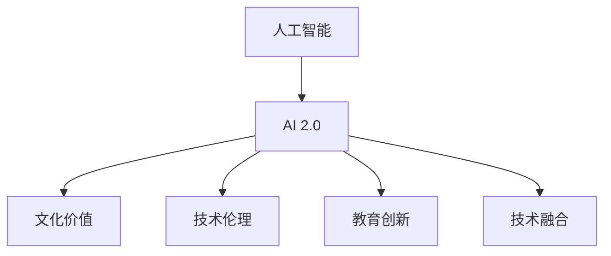
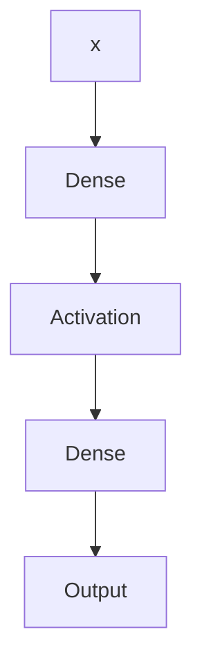

                 

# 李开复：AI 2.0 时代的文化价值

> 关键词：人工智能,文化价值,教育,创新,技术伦理

## 1. 背景介绍

### 1.1 问题由来
近年来，人工智能(AI)技术迅猛发展，AI 2.0 时代正在到来。AI 2.0 是指基于深度学习和自我学习的人工智能系统，它们不仅能够完成复杂的任务，还能通过自我优化和增强学习不断提升自身性能。这种技术的进步，已经对教育、娱乐、医疗、金融等诸多领域产生了深远的影响。然而，随着 AI 2.0 技术的普及，人们开始担忧其对人类文化价值的潜在冲击。如何平衡技术发展与文化价值的关系，成为了一个重要的课题。

### 1.2 问题核心关键点
李开复在多个场合多次强调，人工智能技术虽然强大，但技术本身并不承载文化价值。技术的进步是为了更好地服务于人类，提升生活质量，而不是取代人类的情感、价值观和创造力。AI 2.0 时代下，技术的发展需要与文化价值的维护相协调，才能真正实现可持续的社会发展。

## 2. 核心概念与联系

### 2.1 核心概念概述

为了更好地理解 AI 2.0 时代下文化价值的实现路径，本节将介绍几个密切相关的核心概念：

- **人工智能**：通过数据驱动的算法和模型，让机器能够模拟人类的思维和决策过程，从而实现自动化任务。

- **AI 2.0**：指基于深度学习和大数据的人工智能技术，具备自我学习、自我优化和增强学习的能力，能够处理更加复杂和动态的输入数据。

- **文化价值**：指人类社会共同认可的价值观念、道德规范和艺术创造，是维持社会和谐与进步的基础。

- **技术伦理**：指在技术应用过程中，如何平衡技术发展与人类伦理、社会责任之间的关系。

- **教育创新**：指通过 AI 技术优化教育过程，提供个性化的学习体验和精准的教育资源，提升教育质量。

- **技术融合**：指将 AI 技术与其他领域的技术和知识进行整合，推动跨学科的创新发展。

这些核心概念之间的逻辑关系可以通过以下 Mermaid 流程图来展示：



这个流程图展示了大语言模型的核心概念及其之间的关系：

1. AI 2.0 技术通过深度学习和大数据训练，具备自我学习和优化能力。
2. 文化价值通过技术伦理、教育创新、技术融合等方式，被融入 AI 2.0 应用中。
3. 教育创新和教育伦理在技术驱动下得到发展，提升了教育质量和效率。
4. 技术融合推动了各领域间的协同创新，拓展了技术的边界和应用范围。

## 3. 核心算法原理 & 具体操作步骤
### 3.1 算法原理概述

AI 2.0 技术中的核心算法主要是深度学习，其基本原理是通过反向传播算法，对模型参数进行迭代优化，从而使得模型能够学习数据的分布特征，并进行预测。具体的深度学习模型，如卷积神经网络(CNN)、循环神经网络(RNN)、Transformer 等，都是通过大量的数据和计算资源训练得到的。

### 3.2 算法步骤详解

以下是使用 TensorFlow 实现卷积神经网络(CNN)的示例步骤：

**Step 1: 数据准备**
- 准备训练数据集和测试数据集，并进行预处理，如归一化、分片等。
- 定义标签，将图像与标签进行对应。

**Step 2: 模型构建**
- 定义卷积层、池化层、全连接层等基本组件。
- 构建模型结构，如将输入层、卷积层、池化层、全连接层等按顺序连接起来。

**Step 3: 定义损失函数**
- 定义损失函数，如交叉熵损失，用于衡量模型的预测结果与真实标签之间的差异。

**Step 4: 优化器设置**
- 定义优化器，如 Adam、SGD 等，设置学习率、批大小等超参数。

**Step 5: 模型训练**
- 定义训练过程，将数据集以批为单位输入模型，进行前向传播和反向传播，更新模型参数。
- 周期性在验证集上评估模型性能，根据性能指标决定是否触发 Early Stopping。
- 重复上述步骤直到满足预设的迭代轮数或 Early Stopping 条件。

**Step 6: 模型评估**
- 在测试集上评估模型性能，对比模型在训练和测试集上的差异。
- 使用可视化工具展示训练过程和结果。

### 3.3 算法优缺点

AI 2.0 技术的优点包括：

- **高效性**：能够快速处理大量数据，进行复杂的模式识别和预测。
- **适应性**：通过自适应学习，能够根据环境变化进行优化。
- **通用性**：适用于多种任务，如图像识别、语音识别、自然语言处理等。

然而，该技术也存在一些局限性：

- **依赖数据**：需要大量的标注数据进行训练，数据质量和多样性对模型性能影响较大。
- **黑盒问题**：模型决策过程复杂，难以解释和理解，存在一定的不可预测性。
- **资源需求**：需要高性能的计算资源和存储资源，对设备和网络带宽要求较高。

### 3.4 算法应用领域

AI 2.0 技术已经在图像识别、语音识别、自然语言处理等多个领域得到广泛应用，成为推动这些领域创新发展的重要动力：

- **图像识别**：应用于医学影像分析、自动驾驶、人脸识别等，提高了识别的准确率和速度。
- **语音识别**：应用于智能客服、语音助手、语音翻译等，提升了用户体验和应用效率。
- **自然语言处理**：应用于问答系统、翻译系统、情感分析等，增强了人机交互的流畅性和自然性。
- **医疗诊断**：应用于放射影像分析、病历分析、药物研发等，提升了医疗诊断的准确性和效率。
- **智能制造**：应用于工业机器人控制、生产调度优化、质量检测等，提高了制造业的智能化和自动化水平。

## 4. 数学模型和公式 & 详细讲解
### 4.1 数学模型构建

假设训练数据集为 $(x_i,y_i)$，其中 $x_i$ 为输入样本，$y_i$ 为标签。定义模型的预测输出为 $\hat{y}$。常用的深度学习模型为多层感知机(Multilayer Perceptron, MLP)，其基本结构如图 1 所示：



其中，$Dense$ 表示全连接层，$Activation$ 表示激活函数，如 ReLU。模型的输出为 $\hat{y}=E$，其损失函数定义为交叉熵损失：

$$
\ell = -\frac{1}{N}\sum_{i=1}^N y_i \log \hat{y}_i + (1-y_i) \log (1-\hat{y}_i)
$$

### 4.2 公式推导过程

以下是卷积神经网络(CNN)的基本推导过程：

**Step 1: 卷积层**
- 定义卷积核 $w$ 和输入 $x$，卷积操作可表示为：
$$
C_i = w * x
$$
其中 $C_i$ 表示卷积层输出的特征图，$*$ 表示卷积操作。

**Step 2: 激活层**
- 将卷积层输出的特征图 $C_i$ 输入激活函数 $f$，得到激活后的特征图 $A_i$：
$$
A_i = f(C_i)
$$

**Step 3: 池化层**
- 对激活后的特征图 $A_i$ 进行池化操作，如最大池化或平均池化，得到池化后的特征图 $P_i$：
$$
P_i = \text{Pooling}(A_i)
$$

**Step 4: 全连接层**
- 将池化后的特征图 $P_i$ 展开成向量，输入全连接层 $F$，得到全连接层输出 $Z$：
$$
Z = F(P_i)
$$

**Step 5: 输出层**
- 将全连接层输出 $Z$ 输入输出层 $Y$，得到模型的最终输出 $\hat{y}$：
$$
\hat{y} = Y(Z)
$$

### 4.3 案例分析与讲解

以图像分类任务为例，介绍如何使用 TensorFlow 实现卷积神经网络。

```python
import tensorflow as tf

# 定义模型结构
model = tf.keras.models.Sequential([
    tf.keras.layers.Conv2D(32, (3, 3), activation='relu', input_shape=(28, 28, 1)),
    tf.keras.layers.MaxPooling2D((2, 2)),
    tf.keras.layers.Conv2D(64, (3, 3), activation='relu'),
    tf.keras.layers.MaxPooling2D((2, 2)),
    tf.keras.layers.Conv2D(64, (3, 3), activation='relu'),
    tf.keras.layers.Flatten(),
    tf.keras.layers.Dense(64, activation='relu'),
    tf.keras.layers.Dense(10, activation='softmax')
])

# 编译模型
model.compile(optimizer='adam', loss='categorical_crossentropy', metrics=['accuracy'])

# 训练模型
model.fit(x_train, y_train, epochs=10, batch_size=32, validation_data=(x_test, y_test))

# 评估模型
model.evaluate(x_test, y_test)
```

## 5. 项目实践：代码实例和详细解释说明
### 5.1 开发环境搭建

在进行深度学习项目开发前，需要准备以下开发环境：

1. 安装 Python 环境：使用 Anaconda 或 Miniconda 安装 Python 3.x，创建虚拟环境。
2. 安装 TensorFlow：使用 pip 安装 TensorFlow，或从 TensorFlow 官网下载编译好的二进制包。
3. 安装 TensorBoard：使用 pip 安装 TensorBoard，用于可视化训练过程和结果。
4. 准备数据集：准备训练集和测试集，并进行预处理。
5. 安装其他依赖库：安装 NumPy、Pandas、scikit-learn 等依赖库。

### 5.2 源代码详细实现

以下是一个使用卷积神经网络进行图像分类的 TensorFlow 代码实现。

```python
import tensorflow as tf
import numpy as np
import matplotlib.pyplot as plt
import os

# 定义模型结构
model = tf.keras.models.Sequential([
    tf.keras.layers.Conv2D(32, (3, 3), activation='relu', input_shape=(28, 28, 1)),
    tf.keras.layers.MaxPooling2D((2, 2)),
    tf.keras.layers.Conv2D(64, (3, 3), activation='relu'),
    tf.keras.layers.MaxPooling2D((2, 2)),
    tf.keras.layers.Conv2D(64, (3, 3), activation='relu'),
    tf.keras.layers.Flatten(),
    tf.keras.layers.Dense(64, activation='relu'),
    tf.keras.layers.Dense(10, activation='softmax')
])

# 编译模型
model.compile(optimizer='adam', loss='categorical_crossentropy', metrics=['accuracy'])

# 训练模型
history = model.fit(x_train, y_train, epochs=10, batch_size=32, validation_data=(x_test, y_test))

# 绘制训练过程
plt.plot(history.history['accuracy'], label='Accuracy')
plt.plot(history.history['val_accuracy'], label='Val Accuracy')
plt.xlabel('Epoch')
plt.ylabel('Accuracy')
plt.legend()
plt.show()

# 绘制损失曲线
plt.plot(history.history['loss'], label='Loss')
plt.plot(history.history['val_loss'], label='Val Loss')
plt.xlabel('Epoch')
plt.ylabel('Loss')
plt.legend()
plt.show()

# 评估模型
test_loss, test_acc = model.evaluate(x_test, y_test, verbose=2)
print(f'Test Loss: {test_loss:.4f}')
print(f'Test Accuracy: {test_acc:.4f}')
```

### 5.3 代码解读与分析

- **模型定义**：使用 `Sequential` 定义模型结构，包括卷积层、池化层、全连接层等。
- **模型编译**：使用 `compile` 方法，设置优化器、损失函数、评估指标等。
- **模型训练**：使用 `fit` 方法，设置训练轮数、批大小等，返回训练过程记录。
- **结果可视化**：使用 TensorBoard 可视化训练过程和结果，展示模型精度和损失曲线的变化。
- **模型评估**：使用 `evaluate` 方法，评估模型在测试集上的性能，输出精度和损失。

## 6. 实际应用场景
### 6.1 医疗影像分析

医疗影像分析是 AI 2.0 技术的重要应用之一。AI 2.0 技术可以通过深度学习对医学影像进行自动分析，识别出病灶和异常部位，帮助医生快速做出诊断决策。

以肺部 CT 影像分析为例，可以应用卷积神经网络对 CT 影像进行分类和分割，识别出肺部结节、肺叶异常等病灶。通过在大量标注数据上进行训练，AI 2.0 技术能够在医生指导下，逐步提升影像分析的准确性和一致性。

### 6.2 智能客服系统

智能客服系统是 AI 2.0 技术的典型应用之一。通过深度学习对客户问题进行分类和理解，智能客服系统能够自动生成回答，提高客服响应速度和质量，降低人工成本。

在智能客服系统中，可以通过卷积神经网络对客户输入的文字进行情感分析，识别出客户的情感倾向。根据情感倾向，智能客服系统可以生成相应的回答，提升用户体验和满意度。

### 6.3 语音识别

语音识别是 AI 2.0 技术的另一重要应用。AI 2.0 技术可以通过深度学习对音频信号进行特征提取和分类，实现高效、准确的声音识别。

以语音翻译为例，可以应用卷积神经网络和循环神经网络，对输入的音频信号进行特征提取和分类，生成相应的文本输出。通过在大量标注数据上进行训练，AI 2.0 技术能够在语言模型基础上，进一步提升翻译的准确性和流畅性。

## 7. 工具和资源推荐
### 7.1 学习资源推荐

为了帮助开发者系统掌握深度学习理论基础和实践技巧，这里推荐一些优质的学习资源：

1. **Deep Learning Specialization**：由 Andrew Ng 教授主讲的深度学习专项课程，涵盖深度学习的基本原理、框架和应用。
2. **TensorFlow 官方文档**：包含 TensorFlow 的详细文档和教程，适合初学者和高级开发者。
3. **Kaggle**：数据科学竞赛平台，提供了大量的深度学习竞赛和数据集，适合实践和创新。
4. **arXiv**：深度学习研究论文数据库，可以跟踪最新的深度学习研究成果和进展。
5. **OpenAI Blog**：OpenAI 博客，涵盖 AI 2.0 技术的前沿动态和最佳实践。

### 7.2 开发工具推荐

以下是几款用于深度学习开发和部署的常用工具：

1. **TensorFlow**：由 Google 主导开发的深度学习框架，支持 GPU 加速，适合大规模应用。
2. **PyTorch**：由 Facebook 主导开发的深度学习框架，灵活性高，适合研究和实验。
3. **MXNet**：由 Apache 基金会开发的深度学习框架，支持多种编程语言和硬件平台。
4. **Jupyter Notebook**：交互式编程环境，支持多种编程语言，适合研究和教学。
5. **Google Colab**：在线 Jupyter Notebook 环境，免费提供 GPU/TPU 算力，适合实验和学习。

### 7.3 相关论文推荐

以下是几篇奠基性的深度学习论文，推荐阅读：

1. **ImageNet Classification with Deep Convolutional Neural Networks**：AlexNet 论文，提出了深度卷积神经网络，开启了深度学习在计算机视觉领域的应用。
2. **Rethinking the Inception Architecture for Computer Vision**：Inception 论文，提出了 Inception 模块，进一步提升了深度神经网络的效率和性能。
3. **Convolutional Neural Networks for Visual Recognition**：LeNet 论文，提出了卷积神经网络的基本结构，奠定了深度学习在图像识别领域的基础。
4. **Learning to Generate Sequences with Recurrent Neural Networks**：LSTM 论文，提出了长短期记忆网络，提升了序列建模的性能和准确性。
5. **Attention is All You Need**：Transformer 论文，提出了自注意力机制，实现了高效的序列建模和生成。

## 8. 总结：未来发展趋势与挑战
### 8.1 研究成果总结

AI 2.0 技术在深度学习、计算机视觉、自然语言处理等多个领域取得了显著进展。通过深度学习模型，AI 2.0 技术能够在复杂任务中实现高效、准确的预测和推理，成为推动各个行业创新发展的重要动力。

### 8.2 未来发展趋势

未来的 AI 2.0 技术将呈现以下几个发展趋势：

1. **更大规模**：AI 2.0 模型将会朝着更大规模、更高精度的方向发展，具备更强大的泛化能力和自适应学习能力。
2. **多模态融合**：未来的 AI 2.0 技术将融合视觉、听觉、文本等多种模态信息，实现更加全面、准确的感知和推理。
3. **自适应学习**：未来的 AI 2.0 技术将具备更加强大的自适应学习能力，能够根据环境变化进行优化和调整。
4. **边缘计算**：未来的 AI 2.0 技术将更多应用于边缘计算环境中，实现实时、高效的推理和决策。
5. **人机协同**：未来的 AI 2.0 技术将更多应用于人机协同系统，提升人类的生产效率和创新能力。

### 8.3 面临的挑战

尽管 AI 2.0 技术已经取得了显著进展，但在发展过程中仍面临诸多挑战：

1. **数据质量**：高质量、多样化的标注数据是 AI 2.0 技术的基础，但数据获取和标注成本较高。
2. **计算资源**：大规模深度学习模型的训练和推理需要高性能的计算资源，资源成本较高。
3. **算法可解释性**：深度学习模型的决策过程复杂，难以解释和理解，存在一定的不可预测性。
4. **伦理和社会影响**：AI 2.0 技术可能对就业、隐私、安全等产生深远影响，需要慎重考虑和规范。
5. **跨领域融合**：AI 2.0 技术需要与其他领域的技术和知识进行整合，推动跨学科的创新发展。

### 8.4 研究展望

未来的 AI 2.0 技术需要在多个方面进行深入研究和探索：

1. **数据质量和多样性**：需要开发更多高质量、多样化的标注数据，提升 AI 2.0 模型的泛化能力和自适应学习能力。
2. **算法可解释性**：需要开发更多可解释的 AI 2.0 模型，提升模型的透明度和可信度。
3. **跨领域融合**：需要开发更多跨领域融合的 AI 2.0 技术，推动各个领域的协同创新和发展。
4. **伦理和社会影响**：需要建立更加完善的伦理规范和社会标准，确保 AI 2.0 技术的发展符合人类的价值观和伦理道德。

## 9. 附录：常见问题与解答

**Q1：什么是 AI 2.0 技术？**

A: AI 2.0 技术是基于深度学习和自我学习的人工智能技术，具备自我优化和增强学习的能力，能够处理更加复杂和动态的输入数据。

**Q2：AI 2.0 技术有哪些应用场景？**

A: AI 2.0 技术已经在图像识别、语音识别、自然语言处理等多个领域得到广泛应用，成为推动各个行业创新发展的重要动力。

**Q3：AI 2.0 技术在医疗影像分析中的应用有哪些？**

A: AI 2.0 技术可以通过深度学习对医学影像进行自动分析，识别出病灶和异常部位，帮助医生快速做出诊断决策。

**Q4：AI 2.0 技术在智能客服系统中的应用有哪些？**

A: AI 2.0 技术可以通过深度学习对客户问题进行分类和理解，自动生成回答，提高客服响应速度和质量，降低人工成本。

**Q5：AI 2.0 技术在语音识别中的应用有哪些？**

A: AI 2.0 技术可以通过深度学习对音频信号进行特征提取和分类，实现高效、准确的声音识别，如语音翻译等。

总之，AI 2.0 技术在多个领域展现出了巨大的潜力，未来将在各个行业发挥更加重要的作用，推动社会的进步和发展。

---

作者：禅与计算机程序设计艺术 / Zen and the Art of Computer Programming

