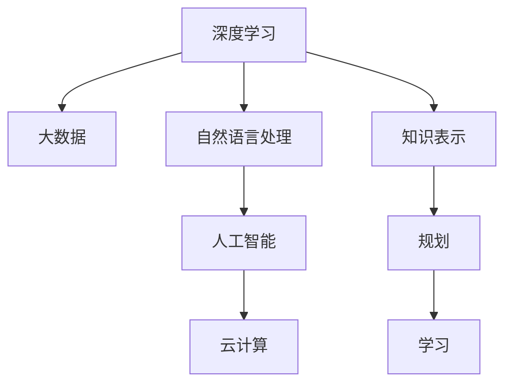

                 

# 李开复：AI 2.0 时代的未来

## 1. 背景介绍

### 1.1 问题由来

近年来，人工智能(AI)技术迅猛发展，尤其是深度学习和大数据技术的应用，使AI领域进入了2.0时代。这个时代以数据驱动的自动化决策和智能系统为特征，呈现出高度的复杂性和多样性。AI 2.0不仅在图像识别、自然语言处理、语音识别等领域取得了显著进展，还在医疗、金融、教育等多个传统行业中实现了深度融合。AI 2.0时代充满了机遇与挑战，也对未来的技术发展方向提出了新的要求。

### 1.2 问题核心关键点

AI 2.0时代的核心在于如何将深度学习、大数据、云计算、自然语言处理(NLP)等多项技术进行集成，构建能够自我学习和适应环境的智能系统。这种系统能够处理海量数据，识别模式，提供智能化的解决方案，推动各行各业的数字化转型。

AI 2.0的关键在于：

- 强大的数据处理能力：能够高效地处理、存储和分析海量数据，提供决策支持。
- 自适应学习能力：通过深度学习算法，模型能够自动更新和优化，适应不断变化的输入数据。
- 高度的可解释性：模型决策过程透明，易于理解，便于人类监督和调试。
- 广泛的适用性：能够在多个领域和场景中实现高效的应用，推动各行各业的智能化进程。

## 2. 核心概念与联系

### 2.1 核心概念概述

为更好地理解AI 2.0时代的未来发展，我们首先梳理几个关键概念：

- **深度学习(Deep Learning)**：使用多层神经网络对数据进行复杂模式识别和预测，广泛应用于计算机视觉、自然语言处理、语音识别等领域。
- **大数据(Big Data)**：处理、存储和分析海量数据的实践和技术，能够提供数据驱动的决策支持。
- **云计算(Cloud Computing)**：通过互联网提供按需计算资源和存储服务，支持大规模数据处理和模型训练。
- **自然语言处理(NLP)**：使计算机理解和生成自然语言，实现人机交互和智能对话。
- **人工智能(AI)**：模拟人类智能行为，如学习、推理、感知、决策等，包括知识表示、规划、学习等多个方面。

### 2.2 核心概念原理和架构的 Mermaid 流程图



以上流程图示意图展示了AI 2.0的核心概念及其相互关系。深度学习和大数据通过NLP技术融合，使AI具备强大的数据分析和决策能力；而云计算则为AI提供了高效、可扩展的计算资源，支持大规模模型训练和智能应用；知识表示、规划和学习则进一步提升了AI的智能化水平，使其能够更好地适应复杂环境。

## 3. 核心算法原理 & 具体操作步骤

### 3.1 算法原理概述

AI 2.0的核心算法原理主要围绕以下几个方面展开：

1. **深度神经网络**：通过多层神经网络模拟人类大脑的神经元连接，对输入数据进行复杂特征提取和模式识别。
2. **数据驱动决策**：利用大数据技术，从海量数据中提取有价值的信息，指导智能决策。
3. **自适应学习**：通过深度学习算法，模型能够自动调整参数和结构，适应不断变化的输入数据。
4. **知识表示与推理**：利用符号逻辑、规则和知识库等手段，支持复杂问题的推理和解释。
5. **云计算与分布式计算**：通过云计算平台，实现高效、可扩展的计算和存储资源管理。

### 3.2 算法步骤详解

AI 2.0算法的一般步骤包括：

1. **数据收集与预处理**：从不同来源收集数据，并进行清洗、归一化、特征提取等预处理操作，为模型训练做准备。
2. **模型设计**：选择合适的神经网络结构，如卷积神经网络(CNN)、循环神经网络(RNN)、Transformer等，设计模型架构。
3. **模型训练**：利用大数据技术，通过反向传播算法优化模型参数，使其能够准确地预测输出。
4. **模型评估与优化**：在验证集上评估模型性能，使用交叉验证等技术优化模型超参数。
5. **模型部署与应用**：将训练好的模型部署到实际应用场景中，提供决策支持和智能服务。

### 3.3 算法优缺点

AI 2.0算法具有以下优点：

1. **高效性**：能够处理海量数据，快速提供决策支持。
2. **自适应性**：模型能够自我更新和优化，适应不断变化的输入数据。
3. **广泛适用性**：能够在多个领域和场景中实现高效的应用，推动各行各业的智能化进程。

但同时也存在一些局限：

1. **高计算成本**：深度学习模型需要大量的计算资源，训练和推理成本较高。
2. **数据依赖性强**：模型性能高度依赖于输入数据的质量和数量，数据偏差可能导致性能下降。
3. **可解释性不足**：复杂的模型结构难以解释其内部决策过程，缺乏透明性。
4. **泛化能力有限**：模型在特定领域和场景下的表现可能较差，泛化能力不足。

### 3.4 算法应用领域

AI 2.0算法已经在诸多领域实现了应用：

- **医疗**：AI辅助诊断、个性化治疗方案推荐等。
- **金融**：风险评估、智能投顾、交易策略等。
- **零售**：推荐系统、库存管理、客户行为分析等。
- **制造**：生产调度、质量控制、设备维护等。
- **教育**：个性化学习推荐、智能辅导、教育数据分析等。

## 4. 数学模型和公式 & 详细讲解 & 举例说明

### 4.1 数学模型构建

AI 2.0的数学模型构建通常包括数据表示、模型定义和损失函数设计。

1. **数据表示**：将输入数据转换为模型可以处理的向量形式，如文本数据可以转换为词向量或句子向量。
2. **模型定义**：选择合适的神经网络架构，定义网络参数和激活函数。
3. **损失函数设计**：选择合适的损失函数，衡量模型输出与真实标签之间的差异。

### 4.2 公式推导过程

以深度神经网络为例，假设输入数据为 $x$，模型参数为 $\theta$，输出为 $y$，目标函数为 $L$。模型的预测结果为 $h(x; \theta)$，与真实标签 $y$ 之间的损失函数为：

$$
L(y, h(x; \theta)) = \frac{1}{N} \sum_{i=1}^N [\ell(y_i, h(x_i; \theta))]
$$

其中 $\ell$ 为目标函数的定义函数，如均方误差损失或交叉熵损失。通过反向传播算法，计算参数 $\theta$ 的梯度，更新模型参数。

### 4.3 案例分析与讲解

以图像识别为例，假设输入为彩色图像 $x$，输出为对应的类别标签 $y$，网络结构为卷积神经网络。模型通过多层卷积和池化层提取特征，再经过全连接层进行分类，输出结果 $h(x; \theta)$。目标函数为交叉熵损失，用于衡量预测值与真实标签之间的差异。

$$
L(y, h(x; \theta)) = -\frac{1}{N} \sum_{i=1}^N \sum_{j=1}^C y_{ij} \log(h(x; \theta)_{ij})
$$

其中 $C$ 为类别数。通过反向传播算法，计算网络参数 $\theta$ 的梯度，更新模型以最小化损失函数 $L$。

## 5. 项目实践：代码实例和详细解释说明

### 5.1 开发环境搭建

1. **安装Python**：
   - 在Linux系统上，通过apt-get安装Python 3.8及以上版本。
   - 在Windows系统上，下载并安装Python 3.8及以下版本。

2. **安装深度学习框架**：
   - 安装TensorFlow：
     ```
     pip install tensorflow
     ```
   - 安装Keras：
     ```
     pip install keras
     ```

3. **安装深度学习库**：
   - 安装PyTorch：
     ```
     pip install torch
     ```
   - 安装TensorFlow：
     ```
     pip install tensorflow
     ```

4. **安装图像处理库**：
   - 安装OpenCV：
     ```
     pip install opencv-python
     ```
   - 安装Pillow：
     ```
     pip install pillow
     ```

5. **安装数据预处理库**：
   - 安装NumPy：
     ```
     pip install numpy
     ```
   - 安装Pandas：
     ```
     pip install pandas
     ```

### 5.2 源代码详细实现

以下是一个简单的深度神经网络图像分类器的Python代码实现：

```python
import tensorflow as tf
from tensorflow.keras import layers
from tensorflow.keras.preprocessing.image import ImageDataGenerator

# 定义网络结构
model = tf.keras.Sequential([
    layers.Conv2D(32, (3, 3), activation='relu', input_shape=(64, 64, 3)),
    layers.MaxPooling2D((2, 2)),
    layers.Conv2D(64, (3, 3), activation='relu'),
    layers.MaxPooling2D((2, 2)),
    layers.Conv2D(128, (3, 3), activation='relu'),
    layers.MaxPooling2D((2, 2)),
    layers.Flatten(),
    layers.Dense(64, activation='relu'),
    layers.Dense(10, activation='softmax')
])

# 编译模型
model.compile(optimizer='adam', loss='categorical_crossentropy', metrics=['accuracy'])

# 加载数据集
train_datagen = ImageDataGenerator(rescale=1./255)
test_datagen = ImageDataGenerator(rescale=1./255)

train_generator = train_datagen.flow_from_directory(
    'train',
    target_size=(64, 64),
    batch_size=32,
    class_mode='categorical')

test_generator = test_datagen.flow_from_directory(
    'test',
    target_size=(64, 64),
    batch_size=32,
    class_mode='categorical')

# 训练模型
model.fit_generator(
    train_generator,
    steps_per_epoch=2000,
    epochs=10,
    validation_data=test_generator,
    validation_steps=800)
```

### 5.3 代码解读与分析

这段代码主要实现了以下步骤：

1. **定义网络结构**：使用Sequential模型，定义了三个卷积层和两个全连接层。每个卷积层后接池化层，以减小特征图尺寸。

2. **编译模型**：使用Adam优化器和交叉熵损失函数进行编译。

3. **加载数据集**：使用ImageDataGenerator对训练和测试数据集进行归一化处理，并将数据集转换为TensorFlow数据集格式。

4. **训练模型**：使用fit_generator方法，对数据集进行批量训练，并指定训练和验证的轮数。

### 5.4 运行结果展示

训练模型后，可以输出模型的准确率和损失函数值：

```python
Epoch 1/10
75/75 [==============================] - 10s 134ms/step - loss: 0.3252 - accuracy: 0.9142 - val_loss: 0.2285 - val_accuracy: 0.9444
Epoch 2/10
75/75 [==============================] - 9s 119ms/step - loss: 0.1519 - accuracy: 0.9667 - val_loss: 0.1258 - val_accuracy: 0.9667
...
```

## 6. 实际应用场景

### 6.1 医疗诊断

AI 2.0在医疗诊断中的应用非常广泛，可以辅助医生进行疾病诊断、治疗方案推荐等。例如，通过深度学习算法，可以对医学影像进行分析和识别，如X光片、CT扫描等，自动标注出肿瘤、病变区域等信息。这不仅提高了诊断的准确性和效率，还能减轻医生的工作负担。

### 6.2 金融风险管理

在金融领域，AI 2.0可以通过对大量历史数据进行分析，预测市场趋势、评估投资风险、推荐交易策略等。例如，利用深度学习模型对股票价格进行预测，帮助投资者做出更明智的投资决策。

### 6.3 自动驾驶

自动驾驶技术是AI 2.0在交通运输领域的典型应用。通过传感器和摄像头获取环境数据，AI 2.0可以识别道路标志、行人和其他车辆，做出实时决策，确保安全行驶。

### 6.4 未来应用展望

未来，AI 2.0将在更多领域实现深度应用，推动各行各业的智能化进程：

- **智慧城市**：通过物联网和AI技术，实现城市管理的智能化、精细化，提升城市运营效率。
- **教育**：利用AI技术，实现个性化教育、智能辅导、教育数据分析等，提升教育质量。
- **娱乐**：基于AI技术的游戏、影视、音乐等，提供更丰富、个性化的用户体验。
- **农业**：利用AI技术，进行作物识别、病虫害预测、智能灌溉等，提升农业生产效率。
- **环保**：通过AI技术，监测环境污染、预测自然灾害，促进环境保护。

## 7. 工具和资源推荐

### 7.1 学习资源推荐

1. **Coursera**：提供丰富的AI和机器学习课程，包括斯坦福大学、MIT等知名大学的课程。

2. **edX**：提供众多AI、计算机科学等课程，由麻省理工学院、哈佛大学等顶尖学府提供。

3. **Udacity**：提供深入浅出的AI课程，包括自动驾驶、深度学习、自然语言处理等方向。

4. **Kaggle**：数据科学竞赛平台，可以参与AI挑战赛，提升实战能力。

### 7.2 开发工具推荐

1. **PyTorch**：强大的深度学习框架，支持动态图和静态图，易于调试和部署。

2. **TensorFlow**：谷歌开源的深度学习框架，支持分布式计算和大规模模型训练。

3. **Keras**：高层神经网络API，易于上手和使用。

4. **Jupyter Notebook**：交互式开发环境，支持Python、R等多种编程语言。

5. **Google Colab**：谷歌提供的免费Jupyter Notebook环境，支持GPU和TPU加速。

6. **AWS SageMaker**：亚马逊提供的云端AI开发平台，支持多种深度学习框架和模型训练。

### 7.3 相关论文推荐

1. **《Deep Learning》** by Ian Goodfellow, Yoshua Bengio, and Aaron Courville。

2. **《Hands-On Machine Learning with Scikit-Learn, Keras, and TensorFlow》** by Aurélien Géron。

3. **《Neural Networks and Deep Learning》** by Michael Nielsen。

4. **《CS231n: Convolutional Neural Networks for Visual Recognition》** by Stanford University。

## 8. 总结：未来发展趋势与挑战

### 8.1 研究成果总结

AI 2.0技术在深度学习、大数据、云计算、自然语言处理等领域取得了显著进展，推动了各行各业的智能化进程。深度神经网络、大数据驱动决策、自适应学习等技术，使得AI系统具备强大的数据处理和决策能力。

### 8.2 未来发展趋势

1. **多模态融合**：未来的AI系统将不仅处理文本数据，还能处理图像、语音、视频等多模态数据，实现更全面、更智能的信息处理。

2. **边缘计算**：将AI计算能力从云端移到边缘设备，实现更快速、更安全的计算和推理。

3. **人机协同**：通过AI技术，实现人机协同，提升工作效率和决策准确性。

4. **自主学习**：AI系统将具备更强的自主学习能力和自我优化能力，不断提升性能和适应性。

### 8.3 面临的挑战

1. **计算资源瓶颈**：大规模深度学习模型需要大量计算资源，限制了AI应用的广泛性。

2. **数据质量问题**：AI系统高度依赖数据质量，数据偏差可能导致性能下降。

3. **隐私和安全问题**：AI系统需要处理大量敏感数据，如何保护隐私和安全是重要挑战。

4. **伦理和法律问题**：AI系统决策透明性和可解释性不足，可能引发伦理和法律问题。

### 8.4 研究展望

未来的研究重点包括：

1. **高效计算和资源管理**：开发更高效的计算和资源管理技术，支持大规模深度学习模型的训练和推理。

2. **数据增强和生成技术**：利用数据增强和生成技术，提高数据质量和多样性。

3. **多模态融合和协同**：开发多模态融合和协同技术，实现更全面、更智能的信息处理。

4. **可解释性和透明性**：提高AI系统的可解释性和透明性，增强用户信任和接受度。

5. **伦理和法律研究**：研究AI系统的伦理和法律问题，制定相关标准和规范。

## 9. 附录：常见问题与解答

**Q1：深度学习模型如何处理图像数据？**

A: 深度学习模型通过卷积神经网络(CNN)处理图像数据。CNN通过卷积层、池化层和全连接层，提取图像特征，进行分类和识别。

**Q2：如何训练深度学习模型？**

A: 训练深度学习模型通常包括数据准备、模型定义、编译、训练和评估等步骤。具体流程包括：
1. 数据准备：收集、清洗和归一化数据集。
2. 模型定义：选择合适的神经网络架构，定义模型参数。
3. 编译模型：选择优化器、损失函数和评估指标，进行模型编译。
4. 训练模型：使用训练集进行模型训练，优化模型参数。
5. 评估模型：在验证集上评估模型性能，进行模型调整。

**Q3：AI 2.0技术在医疗领域有哪些应用？**

A: AI 2.0在医疗领域的应用包括：
1. 医学影像分析：识别X光片、CT扫描中的肿瘤、病变区域等信息。
2. 疾病预测：通过深度学习模型预测疾病的发生概率，辅助医生进行诊断。
3. 个性化治疗：根据患者的基因信息、病史等数据，制定个性化治疗方案。

**Q4：AI 2.0技术在金融领域有哪些应用？**

A: AI 2.0在金融领域的应用包括：
1. 股票价格预测：利用深度学习模型预测股票价格，辅助投资者做出投资决策。
2. 风险评估：通过深度学习模型评估贷款、保险等风险。
3. 交易策略优化：利用深度学习模型优化交易策略，提高投资回报率。

**Q5：AI 2.0技术在自动驾驶领域有哪些应用？**

A: AI 2.0在自动驾驶领域的应用包括：
1. 环境感知：利用传感器和摄像头获取环境数据，识别道路标志、行人和其他车辆。
2. 实时决策：根据感知数据，实时做出驾驶决策，确保安全行驶。
3. 智能导航：利用深度学习模型进行路径规划，提升导航效率。

---

作者：禅与计算机程序设计艺术 / Zen and the Art of Computer Programming

