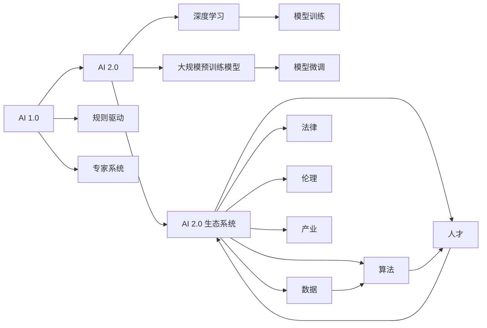

                 

# 李开复：AI 2.0 时代的生态

## 1. 背景介绍

在过去的几十年中，人工智能（AI）经历了从简单到复杂的演变，从最初的专家系统到深度学习，再到如今的大规模预训练模型，AI 技术不断突破，引领了各个行业的数字化转型。然而，这些技术的进步并没有完全解决人类面临的问题。李开复教授在《AI 2.0》一书中提出，我们正处于 AI 2.0 时代，这是一个需要重新定义人工智能、重新思考其生态系统的时代。本文将从李教授的视角，探讨 AI 2.0 时代的技术、应用、伦理和社会挑战，并展望未来发展趋势。

## 2. 核心概念与联系

### 2.1 核心概念概述

在探讨 AI 2.0 时代的生态之前，我们需要理解几个核心概念：

- **AI 1.0**：指的是早期的规则驱动系统，如专家系统和决策支持系统，这些系统依赖于手工编写的规则和逻辑，但缺乏对复杂问题的处理能力。
- **AI 2.0**：指的是基于深度学习的大规模预训练模型，如 GPT-3 和 BERT，这些模型通过在大规模无标签数据上自监督学习，具备了强大的语言理解能力。
- **AI 2.0 生态系统**：指的是由 AI 技术、数据、算法、人才、法律、伦理、产业等多个要素构成的复杂系统。

### 2.2 核心概念原理和架构的 Mermaid 流程图



这个流程图展示了从 AI 1.0 到 AI 2.0 的演变，以及 AI 2.0 生态系统的构成。

## 3. 核心算法原理 & 具体操作步骤

### 3.1 算法原理概述

AI 2.0 时代的基础是深度学习和大规模预训练模型。这些模型通过在大规模无标签数据上自监督学习，获得了广泛的语言和知识表示。例如，BERT 和 GPT-3 等模型在理解语义、情感、上下文等方面表现出色。这些模型的训练过程通常分为两个阶段：预训练和微调。

### 3.2 算法步骤详解

#### 预训练阶段

1. **数据准备**：收集大规模无标签数据，如维基百科、新闻文章、社交媒体等，这些数据构成了模型的预训练语料库。
2. **模型初始化**：选择合适的模型架构，如 Transformer，并初始化参数。
3. **自监督学习**：通过自监督任务（如掩码语言模型、预测下一句等），模型在预训练数据上进行自监督学习，学习语言的通用表示。
4. **模型评估**：在预训练过程中，通过评估指标（如困惑度、跨语言迁移能力）来评估模型性能，及时调整训练策略。

#### 微调阶段

1. **数据准备**：收集下游任务的标注数据，如分类任务的数据集、问答任务的问题与答案对等。
2. **模型适配**：在预训练模型的基础上，添加任务适配层，如分类器、解码器等。
3. **超参数设置**：选择合适的优化器、学习率、批大小、迭代次数等超参数。
4. **模型训练**：使用微调数据集对模型进行有监督学习，优化任务适配层的参数。
5. **模型评估**：在验证集和测试集上评估模型性能，对比微调前后的效果。

### 3.3 算法优缺点

#### 优点

1. **模型通用性**：大规模预训练模型可以应用于多种任务，如自然语言处理、计算机视觉、语音识别等。
2. **性能提升**：微调可以显著提升模型在下游任务上的性能，特别是在数据量较小的情况下。
3. **计算高效**：微调通常只需要调整顶层参数，可以节省计算资源。

#### 缺点

1. **标注成本高**：微调依赖于下游任务的标注数据，获取高质量标注数据的成本较高。
2. **迁移能力有限**：当目标任务与预训练数据的分布差异较大时，微调的性能提升有限。
3. **可解释性不足**：微调模型通常是"黑盒"系统，难以解释其内部工作机制。
4. **安全性问题**：模型可能学习到有偏见、有害的信息，输出存在风险。

### 3.4 算法应用领域

AI 2.0 时代的应用领域非常广泛，包括但不限于：

- **自然语言处理**：如文本分类、情感分析、问答系统、机器翻译等。
- **计算机视觉**：如图像分类、物体检测、图像生成等。
- **语音识别**：如语音合成、语音识别、语音情感分析等。
- **机器人学**：如机器人导航、协作、情感交互等。

## 4. 数学模型和公式 & 详细讲解 & 举例说明

### 4.1 数学模型构建

在 AI 2.0 时代，深度学习模型是核心。以 Transformer 为例，其数学模型可以表示为：

$$
M_{\theta}(x) = \mathrm{Encoder}_{\theta_1}(\mathrm{Embedding}(x)) \times \mathrm{Decoder}_{\theta_2}(\mathrm{Embedding}(y))
$$

其中，$x$ 和 $y$ 分别为输入和输出序列，$\theta_1$ 和 $\theta_2$ 为模型参数。

### 4.2 公式推导过程

以 BERT 为例，其预训练任务包括掩码语言模型和下一句预测。以掩码语言模型为例，其公式推导如下：

$$
L(x, \hat{x}) = -\sum_{i=1}^{n} \log p(\hat{x}_i | x)
$$

其中，$x$ 为输入序列，$\hat{x}$ 为掩码后的序列，$n$ 为序列长度。

### 4.3 案例分析与讲解

以 GPT-3 为例，其微调任务为问答系统。其公式推导如下：

$$
\theta^* = \mathop{\arg\min}_{\theta} \mathcal{L}(M_{\theta},D)
$$

其中，$\theta$ 为模型参数，$D$ 为标注数据集，$\mathcal{L}$ 为损失函数。

## 5. 项目实践：代码实例和详细解释说明

### 5.1 开发环境搭建

1. **安装 Python 和相关库**：
   ```bash
   conda create -n ai python=3.8
   conda activate ai
   pip install torch torchvision transformers
   ```

2. **准备数据集**：
   - 预训练数据集：如 WikiText、新闻文章等。
   - 微调数据集：如问答系统的问题与答案对等。

### 5.2 源代码详细实现

#### 预训练模型

```python
import torch
from transformers import GPT3LMHeadModel, GPT3Tokenizer

model = GPT3LMHeadModel.from_pretrained('gpt3')
tokenizer = GPT3Tokenizer.from_pretrained('gpt3')
```

#### 微调模型

```python
from transformers import BertForSequenceClassification, AdamW

# 加载微调数据集
train_dataset = ...
dev_dataset = ...
test_dataset = ...

# 加载预训练模型
bert = BertForSequenceClassification.from_pretrained('bert-base-cased')

# 初始化优化器
optimizer = AdamW(bert.parameters(), lr=1e-5)

# 微调过程
for epoch in range(5):
    for batch in train_dataset:
        input_ids = batch['input_ids']
        attention_mask = batch['attention_mask']
        labels = batch['labels']

        bert.zero_grad()
        outputs = bert(input_ids, attention_mask=attention_mask, labels=labels)
        loss = outputs.loss
        loss.backward()
        optimizer.step()

    # 在验证集上评估模型性能
    evaluate(bert, dev_dataset)
```

### 5.3 代码解读与分析

以上代码展示了使用 Transformers 库对 BERT 进行微调的过程。首先，加载预训练模型和微调数据集，然后定义优化器，最后进行模型的微调过程。

## 6. 实际应用场景

### 6.1 医疗健康

AI 2.0 技术在医疗健康领域有广泛应用。例如，IBM Watson Health 利用 AI 技术分析海量医学数据，提供诊断建议和治疗方案，提升了医疗效率和准确性。

### 6.2 教育

AI 2.0 技术在教育领域也有重要应用。例如，Coursera 利用 AI 技术分析学生行为数据，提供个性化的学习建议，提高了教育质量。

### 6.3 金融

AI 2.0 技术在金融领域也有广泛应用。例如，JPMorgan Chase 利用 AI 技术分析市场数据，提供投资建议，提高了决策的准确性和效率。

### 6.4 未来应用展望

未来，AI 2.0 技术将进一步普及，应用于更多领域，如农业、能源、环保等。AI 2.0 技术将与物联网、5G 等新兴技术结合，推动各行各业数字化转型，带来全新的业务模式和服务体验。

## 7. 工具和资源推荐

### 7.1 学习资源推荐

1. **《AI Superbook》**：由李开复教授编写，全面介绍了 AI 技术的历史、现状和未来。
2. **《深度学习》课程**：由斯坦福大学开设的深度学习课程，介绍了深度学习的原理和实践。
3. **《Natural Language Processing with Transformers》书籍**：介绍如何使用 Transformers 库进行 NLP 任务开发。
4. **Hugging Face 官方文档**：提供了丰富的预训练模型和微调样例代码。
5. **Clue 开源项目**：涵盖多种中文 NLP 数据集，提供了基于微调的基线模型。

### 7.2 开发工具推荐

1. **PyTorch**：基于 Python 的深度学习框架，适用于研究和小规模应用。
2. **TensorFlow**：由 Google 开发的深度学习框架，适用于大规模工程应用。
3. **Transformers 库**：提供了丰富的预训练模型和微调 API。
4. **Weights & Biases**：模型训练的实验跟踪工具，记录和可视化训练过程。
5. **TensorBoard**：TensorFlow 配套的可视化工具，用于监控训练过程。

### 7.3 相关论文推荐

1. **Attention is All You Need**：Transformer 原论文，提出了 Transformer 结构。
2. **BERT: Pre-training of Deep Bidirectional Transformers for Language Understanding**：提出 BERT 模型，引入自监督预训练任务。
3. **GPT-3**：介绍 GPT-3 模型，展示了大规模预训练模型的潜力。
4. **Parameter-Efficient Transfer Learning for NLP**：提出 Adapter 等参数高效微调方法。
5. **Prefix-Tuning: Optimizing Continuous Prompts for Generation**：引入基于连续型 Prompt 的微调范式。

## 8. 总结：未来发展趋势与挑战

### 8.1 研究成果总结

AI 2.0 时代的核心技术包括深度学习、大规模预训练模型、自然语言处理等。这些技术在各个领域得到了广泛应用，提升了效率和准确性。

### 8.2 未来发展趋势

1. **计算能力提升**：未来 AI 技术将依赖于更强大的计算资源，如 GPU、TPU 等。
2. **数据质量提升**：高质量的数据是 AI 技术的基石，未来的 AI 技术将依赖于更好的数据采集、标注技术。
3. **模型可解释性**：未来的 AI 模型将更加注重可解释性，方便人类理解和信任。
4. **多模态融合**：未来的 AI 技术将融合视觉、语音、文本等多种模态，提升模型的通用性和鲁棒性。
5. **伦理和安全**：未来的 AI 技术将更加注重伦理和安全问题，避免偏见和恶意用途。

### 8.3 面临的挑战

1. **计算成本高昂**：大规模 AI 模型的训练和推理需要大量计算资源，成本较高。
2. **数据获取困难**：高质量标注数据难以获取，限制了 AI 技术的发展。
3. **模型安全性**：AI 模型可能学习到有害信息，输出存在风险。
4. **模型可解释性不足**：AI 模型通常是黑盒系统，难以解释其决策过程。

### 8.4 研究展望

未来 AI 技术的研究方向包括：

1. **无监督和半监督学习**：探索从无标注或少标注数据中学习 AI 模型的方法。
2. **参数高效微调**：开发更高效的微调方法，减少计算资源消耗。
3. **因果学习**：引入因果推断方法，提高模型的解释性和鲁棒性。
4. **多模态融合**：融合视觉、语音、文本等多种模态，提升模型的通用性和鲁棒性。
5. **伦理和安全**：引入伦理导向的评估指标，确保 AI 模型的安全和公正性。

## 9. 附录：常见问题与解答

**Q1：AI 2.0 与 AI 1.0 有什么区别？**

A: AI 1.0 指的是早期的规则驱动系统，依赖手工编写的规则和逻辑。而 AI 2.0 则指的是基于深度学习的大规模预训练模型，通过在大规模无标签数据上自监督学习，具备了强大的语言理解和生成能力。

**Q2：大规模预训练模型在微调时需要注意什么？**

A: 大规模预训练模型在微调时需要注意以下几点：
1. 选择适当的学习率。微调通常需要更小的学习率，以免破坏预训练权重。
2. 应用正则化技术。如 L2 正则、Dropout、Early Stopping 等，防止模型过度适应小规模训练集。
3. 保留预训练的部分层。如 Transformer 的底层，只微调顶层，减少需优化的参数。
4. 数据增强。通过对训练样本改写、回译等方式丰富训练集多样性。
5. 对抗训练。加入对抗样本，提高模型鲁棒性。
6. Prompt Learning。通过在输入文本中添加提示模板，引导模型按期望方式输出，减少微调参数。

**Q3：AI 2.0 技术在医疗领域的应用前景如何？**

A: AI 2.0 技术在医疗领域有广泛应用前景。例如，IBM Watson Health 利用 AI 技术分析海量医学数据，提供诊断建议和治疗方案，提升了医疗效率和准确性。未来，AI 2.0 技术将进一步普及，应用于更多医疗场景，如影像分析、药物研发等。

**Q4：AI 2.0 技术在教育领域的应用前景如何？**

A: AI 2.0 技术在教育领域有重要应用前景。例如，Coursera 利用 AI 技术分析学生行为数据，提供个性化的学习建议，提高了教育质量。未来，AI 2.0 技术将进一步普及，应用于更多教育场景，如智能辅导、自动评估等。

**Q5：AI 2.0 技术的未来发展方向是什么？**

A: AI 2.0 技术的未来发展方向包括：
1. 计算能力提升：未来 AI 技术将依赖于更强大的计算资源，如 GPU、TPU 等。
2. 数据质量提升：高质量的数据是 AI 技术的基石，未来的 AI 技术将依赖于更好的数据采集、标注技术。
3. 模型可解释性：未来的 AI 模型将更加注重可解释性，方便人类理解和信任。
4. 多模态融合：未来的 AI 技术将融合视觉、语音、文本等多种模态，提升模型的通用性和鲁棒性。
5. 伦理和安全：未来的 AI 技术将更加注重伦理和安全问题，避免偏见和恶意用途。

---

作者：禅与计算机程序设计艺术 / Zen and the Art of Computer Programming

