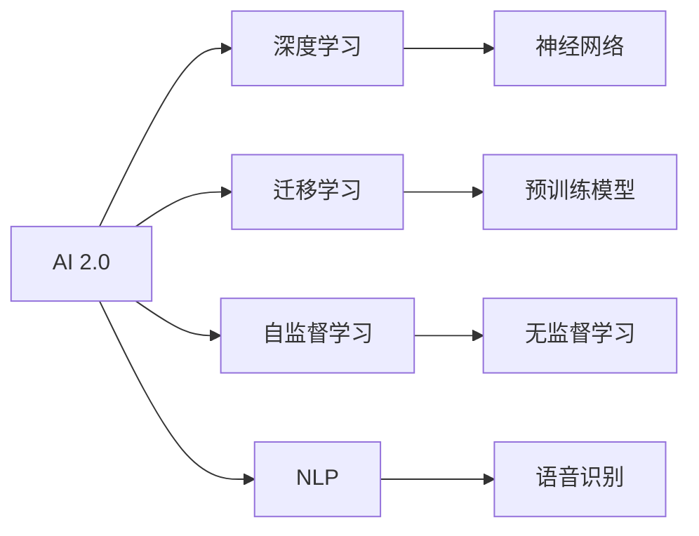
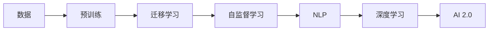

                 

# 李开复：AI 2.0 时代的用户

> 关键词：AI 2.0, 用户, 技术演进, 人机交互, 人工智能, 自然语言处理(NLP), 深度学习, 机器学习

## 1. 背景介绍

在AI 2.0时代，人工智能（AI）技术正在以前所未有的速度和深度渗透到我们的生活和工作之中。从聊天机器人到智能助手，从推荐系统到自动驾驶，人工智能正在以各种形式改变着我们的生活方式。然而，技术的飞速发展并不意味着每个人都能够充分理解和利用这些技术的潜力。因此，本文将探讨AI 2.0时代用户的现状与挑战，以及如何更好地利用人工智能技术，以提升个人和社会的整体福祉。

## 2. 核心概念与联系

### 2.1 核心概念概述

AI 2.0时代，人工智能技术已经从早期的计算密集型模型，如神经网络，发展到了更加高效、灵活的模型，如深度学习、迁移学习、自监督学习等。这些技术的进步使得人工智能能够处理更复杂的任务，同时也使得普通人能够更直观地与AI进行交互。以下是一些核心概念的简要介绍：

- **AI 2.0**：人工智能的高级阶段，特点是模型更加复杂，泛化能力更强，能够处理更为复杂的数据和任务。
- **深度学习**：一种通过多层神经网络进行学习和决策的机器学习技术，广泛应用于图像、语音、自然语言处理等领域。
- **迁移学习**：一种通过将模型在一个任务上的知识迁移到另一个任务上的学习方法，可以减少新任务上的训练时间。
- **自监督学习**：一种无需人工标注的机器学习方法，通过利用数据的内在关系进行学习。
- **自然语言处理（NLP）**：使计算机能够理解、处理和生成人类语言的科学和技术。

这些概念之间的联系可以通过以下Mermaid流程图来展示：



这个流程图展示了AI 2.0时代的主要技术分支及其相互关系：

1. AI 2.0通过深度学习、迁移学习、自监督学习等技术，提升了模型的复杂度和泛化能力。
2. 深度学习模型通常由多层神经网络构成，如卷积神经网络（CNN）、循环神经网络（RNN）、Transformer等。
3. 迁移学习利用预训练模型在不同任务间进行知识迁移。
4. 自监督学习通过数据的内在关系进行无标注学习。
5. NLP技术使计算机能够处理自然语言，包括语音识别、文本分类、机器翻译等。

### 2.2 核心概念原理和架构的 Mermaid 流程图

为了更直观地理解这些核心概念之间的关系，下面是一个简单的Mermaid流程图：



这个流程图展示了从数据到AI 2.0的整个流程：

1. 数据是AI 2.0的基础。
2. 预训练通过大规模无标注数据学习通用的语言表示。
3. 迁移学习通过在特定任务上微调预训练模型，提升模型性能。
4. 自监督学习通过利用数据的内在关系进行无标注学习。
5. NLP技术通过处理自然语言，使得AI能够理解和生成人类语言。
6. 深度学习进一步提升了模型的复杂度和泛化能力。
7. AI 2.0技术整合了以上所有元素，使AI能够处理更为复杂的数据和任务。

## 3. 核心算法原理 & 具体操作步骤

### 3.1 算法原理概述

AI 2.0时代，AI技术已经从简单的计算密集型模型发展到了更加复杂和灵活的深度学习模型。这些模型通过多层神经网络进行学习和决策，能够处理复杂的任务，如自然语言处理、图像识别、语音识别等。以下是AI 2.0时代的核心算法原理概述：

1. **深度学习**：通过多层神经网络进行学习和决策，能够处理高维度的数据和复杂的任务。
2. **迁移学习**：通过在特定任务上微调预训练模型，利用预训练模型的知识提升模型性能。
3. **自监督学习**：通过利用数据的内在关系进行无标注学习，能够自动提取数据特征。
4. **自然语言处理（NLP）**：使计算机能够理解、处理和生成人类语言，包括文本分类、机器翻译、情感分析等。

### 3.2 算法步骤详解

AI 2.0时代的核心算法步骤包括：

1. **数据预处理**：对原始数据进行清洗、标注、划分等操作，为后续的模型训练做准备。
2. **模型选择与构建**：选择合适的深度学习模型，并进行构建。
3. **模型训练**：通过训练数据对模型进行训练，调整模型参数以最小化损失函数。
4. **模型评估与优化**：通过测试数据对模型进行评估，并根据评估结果进行模型优化。
5. **模型部署与维护**：将模型部署到实际应用中，并进行持续的维护与优化。

### 3.3 算法优缺点

AI 2.0时代的算法具有以下优点：

1. **高性能**：深度学习模型能够处理高维度的数据和复杂的任务，具有较高的精度和泛化能力。
2. **灵活性**：通过迁移学习和自监督学习，能够快速适应新的任务和数据。
3. **自适应性**：能够自动提取数据特征，减少对人工标注的依赖。

然而，这些算法也存在以下缺点：

1. **计算成本高**：深度学习模型需要大量的计算资源进行训练，成本较高。
2. **可解释性差**：深度学习模型的决策过程不透明，难以解释其内部机制。
3. **数据需求大**：深度学习模型需要大量的标注数据进行训练，数据获取成本高。
4. **过拟合风险**：深度学习模型容易过拟合，特别是在数据量较小的情况下。

### 3.4 算法应用领域

AI 2.0时代的算法已经在多个领域得到了广泛应用，以下是一些主要应用领域：

1. **自然语言处理（NLP）**：包括文本分类、情感分析、机器翻译、语音识别等。
2. **图像处理**：包括图像识别、目标检测、图像生成等。
3. **医疗诊断**：包括医学影像分析、疾病预测、药物研发等。
4. **智能推荐**：包括个性化推荐、广告投放、用户行为分析等。
5. **智能驾驶**：包括自动驾驶、智能导航、车辆监控等。

## 4. 数学模型和公式 & 详细讲解 & 举例说明

### 4.1 数学模型构建

AI 2.0时代的核心算法通常基于深度学习模型进行构建。以自然语言处理（NLP）为例，常用的数学模型包括循环神经网络（RNN）、卷积神经网络（CNN）和Transformer等。

### 4.2 公式推导过程

以Transformer模型为例，其核心公式如下：

$$
\text{Attention}(Q,K,V) = \text{softmax}(QK^T / \sqrt{d_k})V
$$

其中，$Q$、$K$、$V$分别表示查询、键、值向量，$d_k$表示键向量的维度。Attention机制通过计算查询向量与键向量之间的相似度，生成注意力权重，最终加权求和得到值向量。

### 4.3 案例分析与讲解

以情感分析为例，我们可以使用Transformer模型进行训练。情感分析的数学模型可以表示为：

$$
\text{SVM} = \sum_{i=1}^n w_i \times (y_i - \text{score}(x_i))
$$

其中，$w_i$表示样本的权重，$y_i$表示样本的真实情感标签，$\text{score}(x_i)$表示模型对样本$x_i$的情感预测得分。

## 5. 项目实践：代码实例和详细解释说明

### 5.1 开发环境搭建

要进行AI 2.0时代的算法开发，我们需要准备好开发环境。以下是一些常用的开发工具和环境：

1. **Python**：AI 2.0时代的主流开发语言，具有丰富的科学计算库和数据处理库。
2. **PyTorch**：深度学习领域的主流框架，提供了丰富的深度学习模型和优化算法。
3. **TensorFlow**：另一个流行的深度学习框架，支持分布式计算和GPU加速。
4. **Jupyter Notebook**：用于编写和执行Python代码的交互式环境。
5. **GPU**：深度学习模型需要高性能的计算资源，GPU可以大幅提升训练速度。

### 5.2 源代码详细实现

以下是一个简单的情感分析代码示例：

```python
import torch
import torch.nn as nn
import torch.optim as optim

class Transformer(nn.Module):
    def __init__(self, d_model, nhead, num_layers, dff, input_dim, target_dim):
        super(Transformer, self).__init__()
        self.encoder = nn.TransformerEncoder(
            nn.TransformerEncoderLayer(d_model, nhead, dff),
            num_layers
        )
        self.decoder = nn.Linear(input_dim, target_dim)
        
    def forward(self, src, tgt, src_mask, tgt_mask):
        src_encoded = self.encoder(src, src_mask)
        target = self.decoder(tgt)
        return src_encoded, target

model = Transformer(d_model=512, nhead=8, num_layers=6, dff=2048, input_dim=1000, target_dim=1)
optimizer = optim.Adam(model.parameters(), lr=0.0001)
criterion = nn.BCELoss()

src = torch.randn(10, 1000)
tgt = torch.randint(0, 2, (10, 1000))
src_mask = src != 0
tgt_mask = tgt != 0

src_encoded, target = model(src, tgt, src_mask, tgt_mask)
loss = criterion(target, src_encoded)
loss.backward()
optimizer.step()
```

### 5.3 代码解读与分析

以上代码实现了一个简单的Transformer模型，用于情感分析任务。代码中，我们定义了一个Transformer模块，包含了编码器和解码器。编码器使用TransformerEncoderLayer进行编码，解码器使用线性层进行解码。在训练过程中，我们使用Adam优化器进行参数更新，并使用BCELoss作为损失函数。

## 6. 实际应用场景

### 6.4 未来应用展望

AI 2.0时代的算法在多个领域都展现出了强大的潜力。未来，AI技术将在以下几个方面继续发展：

1. **多模态AI**：结合图像、语音、文本等多种模态的信息，提升AI的感知和理解能力。
2. **自适应AI**：通过持续学习和自监督学习，使AI能够不断适应新的环境和任务。
3. **可解释性AI**：增强AI模型的可解释性，使其决策过程透明可理解。
4. **AI伦理**：在AI技术的应用过程中，需要考虑伦理和道德问题，保障AI的安全和公正性。

## 7. 工具和资源推荐

### 7.1 学习资源推荐

以下是一些优质的学习资源，可以帮助你掌握AI 2.0时代的核心技术：

1. **Deep Learning Specialization**：由Andrew Ng教授主讲，是斯坦福大学的深度学习课程，涵盖了深度学习的基础和应用。
2. **Transformers in Natural Language Processing**：由Hugging Face组织，提供了关于Transformer模型的全面介绍和应用实践。
3. **TensorFlow Tutorials**：TensorFlow官方提供的教程，覆盖了从基础到高级的TensorFlow使用技巧。
4. **PyTorch Tutorials**：PyTorch官方提供的教程，介绍了PyTorch的基本功能和高级特性。
5. **NLP with Transformers**：Hugging Face提供的NLP教程，介绍了如何使用Transformer模型进行自然语言处理。

### 7.2 开发工具推荐

以下是一些常用的开发工具，可以帮助你进行AI 2.0时代的算法开发：

1. **Jupyter Notebook**：用于编写和执行Python代码的交互式环境。
2. **TensorBoard**：用于可视化模型训练过程和性能指标的工具。
3. **Weights & Biases**：用于记录和可视化模型训练过程的实验管理工具。
4. **PyTorch Lightning**：用于快速构建和训练深度学习模型的框架。
5. **TensorFlow**：另一个流行的深度学习框架，支持分布式计算和GPU加速。

### 7.3 相关论文推荐

以下是一些经典的AI 2.0时代的相关论文，推荐阅读：

1. **Attention is All You Need**：介绍Transformer模型，展示了其在NLP任务中的优越性能。
2. **BERT: Pre-training of Deep Bidirectional Transformers for Language Understanding**：介绍BERT模型，展示了其在预训练和微调方面的优势。
3. **Adversarial Examples in the Physical World**：介绍对抗样本在AI中的应用，探讨了AI的安全性和鲁棒性。
4. **Generative Adversarial Nets**：介绍生成对抗网络（GAN），展示了其在图像生成和数据增强中的应用。
5. **The Unreasonable Effectiveness of Transfer Learning**：探讨了迁移学习在AI中的应用，展示了其在数据稀缺场景中的优势。

## 8. 总结：未来发展趋势与挑战

### 8.1 研究成果总结

AI 2.0时代的算法已经展示了其在多个领域的优越性能，但仍面临一些挑战。以下是对目前研究成果的总结：

1. **深度学习模型**：已经在图像识别、语音识别、自然语言处理等多个领域展示了强大的性能，但仍需要进一步提高模型的泛化能力和可解释性。
2. **迁移学习**：通过在特定任务上微调预训练模型，可以在数据稀缺场景中快速提升模型性能，但需要进一步降低对标注数据的依赖。
3. **自监督学习**：通过利用数据的内在关系进行无标注学习，可以自动提取数据特征，但需要进一步提高模型的泛化能力和鲁棒性。
4. **自然语言处理（NLP）**：已经展示了在文本分类、情感分析、机器翻译等任务中的优越性能，但仍需要进一步提高模型的可解释性和鲁棒性。

### 8.2 未来发展趋势

AI 2.0时代的算法将继续发展，未来可能呈现以下几个趋势：

1. **多模态AI**：结合图像、语音、文本等多种模态的信息，提升AI的感知和理解能力。
2. **自适应AI**：通过持续学习和自监督学习，使AI能够不断适应新的环境和任务。
3. **可解释性AI**：增强AI模型的可解释性，使其决策过程透明可理解。
4. **AI伦理**：在AI技术的应用过程中，需要考虑伦理和道德问题，保障AI的安全和公正性。

### 8.3 面临的挑战

AI 2.0时代的算法虽然展现了强大的性能，但也面临一些挑战：

1. **计算成本高**：深度学习模型需要大量的计算资源进行训练，成本较高。
2. **可解释性差**：深度学习模型的决策过程不透明，难以解释其内部机制。
3. **数据需求大**：深度学习模型需要大量的标注数据进行训练，数据获取成本高。
4. **过拟合风险**：深度学习模型容易过拟合，特别是在数据量较小的情况下。

### 8.4 研究展望

未来的研究需要在以下几个方面寻求新的突破：

1. **多模态AI**：结合图像、语音、文本等多种模态的信息，提升AI的感知和理解能力。
2. **自适应AI**：通过持续学习和自监督学习，使AI能够不断适应新的环境和任务。
3. **可解释性AI**：增强AI模型的可解释性，使其决策过程透明可理解。
4. **AI伦理**：在AI技术的应用过程中，需要考虑伦理和道德问题，保障AI的安全和公正性。

## 9. 附录：常见问题与解答

**Q1：AI 2.0时代的算法是否可以应用于所有领域？**

A: AI 2.0时代的算法已经在多个领域展示了强大的性能，但仍需要根据具体领域的特点进行优化和调整。例如，在医疗领域，需要考虑数据隐私和安全问题，在金融领域，需要考虑模型风险控制等。

**Q2：如何选择合适的深度学习模型？**

A: 选择合适的深度学习模型需要考虑数据类型、任务需求、计算资源等因素。常用的深度学习模型包括卷积神经网络（CNN）、循环神经网络（RNN）、Transformer等。

**Q3：AI 2.0时代的算法是否可以部署到移动设备上？**

A: 由于AI 2.0时代的算法需要大量的计算资源，因此在移动设备上的部署需要考虑模型压缩、量化等优化技术，以减少计算和存储成本。

**Q4：AI 2.0时代的算法是否需要大量的标注数据？**

A: AI 2.0时代的算法可以通过迁移学习和自监督学习，在数据稀缺场景中快速提升模型性能，但需要进一步降低对标注数据的依赖。

**Q5：AI 2.0时代的算法是否需要持续学习？**

A: AI 2.0时代的算法需要持续学习和自监督学习，以适应新的环境和任务，保持模型的泛化能力和鲁棒性。

**Q6：AI 2.0时代的算法是否需要考虑伦理和道德问题？**

A: 在AI技术的应用过程中，需要考虑伦理和道德问题，保障AI的安全和公正性。例如，在医疗领域，需要考虑数据隐私和安全问题，在金融领域，需要考虑模型风险控制等。

---

作者：禅与计算机程序设计艺术 / Zen and the Art of Computer Programming

