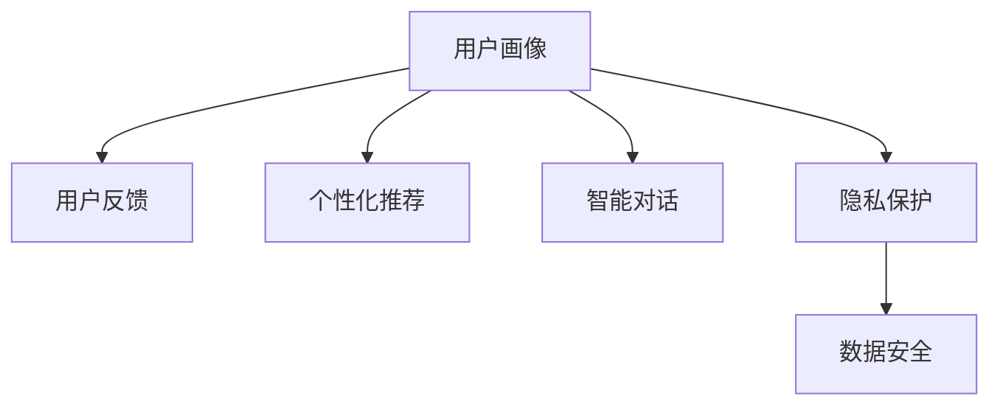

                 

# 李开复：AI 2.0 时代的用户

## 1. 背景介绍

### 1.1 问题由来

随着人工智能（AI）技术的迅猛发展，我们正进入一个新的时代——AI 2.0时代。这个时代，AI已经从数据驱动的计算智能，进化到以知识为中心的增强智能，逐步走向理解智能和协同智能。在这个过程中，用户扮演的角色也将发生深刻变化。

AI 2.0时代的核心特征包括：
- **深度学习与迁移学习的普及**：深度学习模型已经广泛应用在图像识别、自然语言处理、推荐系统等领域，迁移学习使得模型能够轻松地在新领域上取得良好表现。
- **大规模预训练模型的崛起**：如GPT-3、BERT等大规模预训练语言模型，拥有亿级的参数，能够理解自然语言的内在逻辑和语义关系。
- **多模态融合技术的发展**：语音、视觉、文本等多种模态数据的融合，使得AI系统能够更好地理解现实世界，提供更加丰富的智能服务。

### 1.2 问题核心关键点

AI 2.0时代用户面临的核心问题包括：
- **AI系统的理解与推理能力**：用户期望AI系统能够像人一样理解语言，进行逻辑推理，而不是仅仅按照事先设定的规则进行机械操作。
- **AI系统的泛化能力**：用户希望AI系统能够适应不同的情境和任务，而不仅仅是单一的应用场景。
- **AI系统的可解释性**：用户需要了解AI系统的决策过程，从而对其输出结果进行验证和反馈。
- **AI系统的安全性与隐私保护**：用户需要确保AI系统不会侵犯个人隐私，同时提供可靠的安全保障。

## 2. 核心概念与联系

### 2.1 核心概念概述

AI 2.0时代，用户在AI系统的设计和应用中扮演着重要角色。以下是几个与用户密切相关的核心概念：

- **用户画像(User Profile)**：通过收集和分析用户的行为数据，构建用户画像，帮助AI系统更好地理解用户需求和偏好。
- **用户反馈(User Feedback)**：用户对AI系统输出结果的反馈，可以用于调整模型参数，提高系统的性能和准确性。
- **个性化推荐(Recommendation)**：根据用户的历史行为和偏好，提供个性化的内容推荐，提升用户体验。
- **智能对话(Chatbot)**：通过AI技术实现自然语言理解与回复，提供即时的智能对话服务。
- **隐私保护(Privacy Protection)**：确保用户在AI系统中的数据和隐私不受侵犯，实现数据安全。

这些概念之间的逻辑关系可以通过以下Mermaid流程图来展示：



这个流程图展示了几大核心概念及其之间的关系：

1. **用户画像**：构建用户的基本信息、兴趣偏好、行为模式等。
2. **用户反馈**：用户对系统输出结果的评价，用于迭代优化模型。
3. **个性化推荐**：根据用户画像和反馈，生成个性化的内容推荐。
4. **智能对话**：用户与AI系统的互动过程，提供即时的对话服务。
5. **隐私保护**：确保用户数据的安全性，防止数据泄露和滥用。

这些概念共同构成了AI 2.0时代用户与AI系统的交互框架，使得用户能够在AI系统中找到自己的位置，并从中获得更好的服务体验。

## 3. 核心算法原理 & 具体操作步骤

### 3.1 算法原理概述

AI 2.0时代，用户与AI系统的交互过程中，涉及到许多核心算法和技术。以下将详细介绍这些核心算法及其原理。

### 3.2 算法步骤详解

AI 2.0时代的核心算法主要包括：

1. **深度学习模型训练**：使用深度学习框架，如TensorFlow、PyTorch等，对模型进行训练，使其能够从大量数据中学习到有用的特征表示。
2. **迁移学习**：利用预训练模型在特定任务上进行微调，使得模型能够快速适应新的任务。
3. **自然语言处理(NLP)**：使用语言模型、词向量等技术，实现对自然语言的理解、生成和推理。
4. **推荐系统**：基于用户行为数据，构建推荐模型，实现个性化推荐。
5. **智能对话系统**：通过自然语言处理和语言模型，实现自然语言理解与回复。
6. **隐私保护技术**：使用加密技术、差分隐私等方法，保护用户数据的安全性和隐私性。

### 3.3 算法优缺点

AI 2.0时代的核心算法具有以下优点：
- **高效性**：利用深度学习、迁移学习等技术，能够快速地从大量数据中学习到有用的特征表示，并应用于新任务中。
- **适应性强**：通过迁移学习，模型能够快速适应不同的任务和场景，提高系统的泛化能力。
- **个性化推荐**：基于用户画像和行为数据，实现个性化的内容推荐，提升用户体验。

同时，这些算法也存在一些局限性：
- **计算资源消耗大**：深度学习模型的训练和推理需要大量的计算资源，可能在一些设备上无法满足。
- **模型复杂度高**：大模型往往具有亿级的参数，导致模型的复杂度增加，难以解释和调试。
- **隐私保护难度大**：用户数据的安全性和隐私性保护是AI系统的核心挑战之一，需要采取多种技术手段进行保护。

### 3.4 算法应用领域

AI 2.0时代的核心算法广泛应用于以下几个领域：

1. **智能推荐系统**：在电商、音乐、视频等领域，实现个性化推荐。
2. **智能客服**：通过智能对话系统，提供即时的客户服务。
3. **智能助手**：如Siri、小爱同学等，实现语音交互和任务执行。
4. **医疗健康**：通过自然语言处理和图像识别技术，辅助医疗诊断和健康管理。
5. **金融服务**：利用AI技术进行风险评估、欺诈检测和个性化理财等。

## 4. 数学模型和公式 & 详细讲解

### 4.1 数学模型构建

在AI 2.0时代，用户与AI系统的交互过程中，涉及到许多数学模型和公式。以下将详细介绍这些数学模型及其构建方法。

**深度学习模型**：
深度学习模型由多个神经网络层构成，每层包含多个神经元。模型输入为原始数据，经过多次非线性变换，最终输出预测结果。模型参数通过反向传播算法进行优化，最小化预测结果与真实结果之间的误差。

**迁移学习模型**：
迁移学习模型基于预训练模型，在特定任务上进行微调。模型包括两部分：预训练部分和微调部分。预训练部分通常使用大规模无标签数据进行训练，微调部分使用特定任务的数据进行优化。

**自然语言处理模型**：
自然语言处理模型包括词向量、语言模型、序列标注、机器翻译等。其中，词向量通过降维技术，将单词转换为高维向量，用于表示单词的语义信息；语言模型通过预测下一个单词的概率，实现自然语言的理解和生成；序列标注通过标记每个单词的标签，实现实体识别、情感分析等任务；机器翻译通过将一种语言转换为另一种语言，实现跨语言交流。

**推荐系统模型**：
推荐系统模型基于用户行为数据，构建推荐模型。常见的模型包括协同过滤、基于内容的推荐、基于矩阵分解的推荐等。其中，协同过滤模型通过用户-物品矩阵，计算用户对物品的评分；基于内容的推荐模型通过物品的属性特征，推荐相关物品；基于矩阵分解的推荐模型通过低秩矩阵分解，生成物品的潜在特征。

**智能对话系统模型**：
智能对话系统模型基于自然语言处理和语言模型，实现自然语言理解与回复。模型通常包括编码器-解码器结构，通过自注意力机制，实现对自然语言的理解与生成。

**隐私保护模型**：
隐私保护模型通过加密技术、差分隐私等方法，保护用户数据的安全性和隐私性。其中，加密技术包括对称加密、非对称加密、同态加密等；差分隐私通过在数据中添加噪声，保护用户隐私。

### 4.2 公式推导过程

以下将以深度学习模型和迁移学习模型为例，推导其公式和计算过程。

**深度学习模型**：
假设深度学习模型包含$n$个神经网络层，每个层包含$m$个神经元。模型输入为$x$，输出为$y$。模型参数为$\theta$，包括权重和偏置。模型的计算过程如下：

$$
y = f(x; \theta) = \sigma(W_n x + b_n) \sigma(W_{n-1} f(x; \theta_{n-1}) + b_{n-1}) \cdots \sigma(W_1 x + b_1) \sigma(W_0 x + b_0)
$$

其中，$\sigma$为激活函数，$W$和$b$分别为权重和偏置。模型的目标是最小化预测结果与真实结果之间的误差，即：

$$
\min_{\theta} \frac{1}{N} \sum_{i=1}^N \ell(y_i, f(x_i; \theta))
$$

其中，$\ell$为损失函数，$\ell(y_i, f(x_i; \theta))$为预测结果与真实结果之间的误差。

**迁移学习模型**：
假设迁移学习模型包含$n$个层，其中前$m$层为预训练部分，后$n-m$层为微调部分。模型参数为$\theta$，包括权重和偏置。模型的计算过程如下：

$$
y = f(x; \theta) = \sigma(W_n x + b_n) \sigma(W_{n-1} f(x; \theta_{n-1}) + b_{n-1}) \cdots \sigma(W_{m+1} f(x; \theta_{m+1}) + b_{m+1}) \sigma(W_m f(x; \theta_m) + b_m)
$$

其中，前$m$层的权重和偏置为预训练部分的参数，后$n-m$层的权重和偏置为微调部分的参数。模型的目标是最小化预测结果与真实结果之间的误差，即：

$$
\min_{\theta} \frac{1}{N} \sum_{i=1}^N \ell(y_i, f(x_i; \theta))
$$

其中，$\ell$为损失函数，$\ell(y_i, f(x_i; \theta))$为预测结果与真实结果之间的误差。

## 5. 项目实践：代码实例和详细解释说明

### 5.1 开发环境搭建

在进行AI 2.0时代的项目实践前，我们需要准备好开发环境。以下是使用Python进行TensorFlow开发的环境配置流程：

1. 安装Anaconda：从官网下载并安装Anaconda，用于创建独立的Python环境。

2. 创建并激活虚拟环境：
```bash
conda create -n tensorflow-env python=3.8 
conda activate tensorflow-env
```

3. 安装TensorFlow：根据CUDA版本，从官网获取对应的安装命令。例如：
```bash
conda install tensorflow==2.7
```

4. 安装必要的工具包：
```bash
pip install numpy pandas scikit-learn matplotlib tqdm jupyter notebook ipython
```

完成上述步骤后，即可在`tensorflow-env`环境中开始项目实践。

### 5.2 源代码详细实现

下面我们以推荐系统为例，给出使用TensorFlow实现个性化推荐模型的PyTorch代码实现。

首先，定义推荐系统的数据处理函数：

```python
import tensorflow as tf
from tensorflow.keras.layers import Dense, Input
from tensorflow.keras.models import Model

def create_model(input_dim, hidden_dim, output_dim):
    input_layer = Input(shape=(input_dim,))
    hidden_layer = Dense(hidden_dim, activation='relu')(input_layer)
    output_layer = Dense(output_dim, activation='sigmoid')(hidden_layer)
    model = Model(inputs=input_layer, outputs=output_layer)
    return model

# 创建模型
model = create_model(input_dim=10, hidden_dim=20, output_dim=5)
```

然后，定义模型和优化器：

```python
from tensorflow.keras.optimizers import Adam

optimizer = Adam(learning_rate=0.001)
model.compile(optimizer=optimizer, loss='binary_crossentropy', metrics=['accuracy'])
```

接着，定义训练和评估函数：

```python
def train_model(model, train_data, validation_data, epochs, batch_size):
    history = model.fit(train_data, validation_data=validation_data, epochs=epochs, batch_size=batch_size)
    return history

# 训练模型
history = train_model(model, train_data, validation_data, epochs=10, batch_size=32)
```

最后，启动训练流程并在测试集上评估：

```python
test_loss, test_accuracy = model.evaluate(test_data)
print(f'Test accuracy: {test_accuracy:.2f}%')
```

以上就是使用TensorFlow实现个性化推荐模型的完整代码实现。可以看到，TensorFlow提供了便捷的API，使得模型开发和训练变得简单高效。

### 5.3 代码解读与分析

让我们再详细解读一下关键代码的实现细节：

**创建模型函数**：
- `create_model`函数：定义一个简单的多层感知器模型，包括输入层、隐藏层和输出层。
- `Input`层：定义模型的输入维度。
- `Dense`层：定义隐藏层的神经元数和激活函数。
- `Model`层：将输入层、隐藏层和输出层组合成一个完整的模型。

**模型编译**：
- `optimizer`：定义优化器，并设置学习率。
- `compile`函数：配置模型进行训练和评估的参数，包括损失函数和评估指标。

**训练模型**：
- `fit`函数：训练模型，并返回训练历史。
- `epochs`和`batch_size`：定义训练的轮数和批次大小。

**模型评估**：
- `evaluate`函数：评估模型在测试集上的性能，并输出测试准确率。

可以看到，TensorFlow提供了便捷的API，使得模型开发和训练变得简单高效。开发者可以将更多精力放在数据处理、模型改进等高层逻辑上，而不必过多关注底层的实现细节。

当然，工业级的系统实现还需考虑更多因素，如模型的保存和部署、超参数的自动搜索、更灵活的任务适配层等。但核心的算法和流程基本与此类似。

## 6. 实际应用场景

### 6.1 智能推荐系统

基于深度学习模型的智能推荐系统，已经在电商、音乐、视频等领域得到了广泛应用。传统推荐系统往往只依赖用户的历史行为数据进行物品推荐，无法深入理解用户的真实兴趣偏好。基于深度学习模型的推荐系统可以更好地挖掘用户行为背后的语义信息，从而提供更加精准、多样的推荐内容。

在技术实现上，可以收集用户浏览、点击、评论、分享等行为数据，提取和用户交互的物品标题、描述、标签等文本内容。将文本内容作为模型输入，用户的后续行为（如是否点击、购买等）作为监督信号，在此基础上训练深度学习模型。深度学习模型能够从文本内容中准确把握用户的兴趣点。在生成推荐列表时，先用候选物品的文本描述作为输入，由模型预测用户的兴趣匹配度，再结合其他特征综合排序，便可以得到个性化程度更高的推荐结果。

### 6.2 智能客服系统

传统的客服系统往往需要配备大量人力，高峰期响应缓慢，且一致性和专业性难以保证。基于深度学习模型的智能客服系统可以7x24小时不间断服务，快速响应客户咨询，用自然流畅的语言解答各类常见问题。

在技术实现上，可以收集企业内部的历史客服对话记录，将问题和最佳答复构建成监督数据，在此基础上对预训练深度学习模型进行微调。微调后的深度学习模型能够自动理解用户意图，匹配最合适的答案模板进行回复。对于客户提出的新问题，还可以接入检索系统实时搜索相关内容，动态组织生成回答。如此构建的智能客服系统，能大幅提升客户咨询体验和问题解决效率。

### 6.3 智能对话系统

基于深度学习模型的智能对话系统已经在医疗、金融、教育等领域得到了广泛应用。传统的对话系统往往依赖预设的规则和模板，难以处理复杂多变的用户需求。基于深度学习模型的智能对话系统通过自然语言处理和语言模型，实现自然语言理解与回复。

在技术实现上，可以收集用户的对话记录，将其作为监督数据，在此基础上对预训练的深度学习模型进行微调。微调后的深度学习模型能够理解用户的意图，生成符合语境的回复。同时，为了提高系统的鲁棒性，可以引入对抗训练和对抗样本，使得系统能够在面对恶意攻击或噪声干扰时仍然保持稳定。

### 6.4 未来应用展望

随着深度学习模型的不断发展，基于深度学习模型的AI 2.0系统将具备更强大的理解能力和推理能力，广泛应用于更多的领域。未来，AI 2.0系统有望在医疗、教育、金融、工业等领域得到广泛应用，为各行各业带来颠覆性的变革。

在医疗领域，AI 2.0系统可以通过自然语言处理和图像识别技术，辅助医疗诊断和健康管理。例如，利用深度学习模型对医学影像进行分析，自动生成诊断报告；或者通过自然语言处理技术，对病人的病历进行自动归纳和整理。

在教育领域，AI 2.0系统可以通过自然语言处理和推荐系统，提供个性化的学习建议和智能辅助教学。例如，利用深度学习模型对学生的作业进行自动批改和反馈，或者通过推荐系统为学生推荐适合的学习资源和习题。

在金融领域，AI 2.0系统可以通过自然语言处理和推荐系统，提供个性化的理财建议和智能风控。例如，利用深度学习模型对用户的交易记录进行分析和预测，提供个性化的理财方案；或者通过推荐系统为用户推荐合适的金融产品和服务。

在工业领域，AI 2.0系统可以通过自然语言处理和推荐系统，提供智能生产管理和智能质量控制。例如，利用深度学习模型对生产数据进行分析，优化生产流程；或者通过推荐系统为工人提供合适的工具和培训内容，提高工作效率和质量。

## 7. 工具和资源推荐

### 7.1 学习资源推荐

为了帮助开发者系统掌握AI 2.0技术的基础知识和实践技巧，这里推荐一些优质的学习资源：

1. 《深度学习》系列书籍：由斯坦福大学的深度学习课程讲义编写而成，全面介绍了深度学习的基本概念和核心算法。
2. 《TensorFlow官方文档》：TensorFlow的官方文档，提供了丰富的API和代码示例，适合新手学习。
3. 《自然语言处理综述》：由自然语言处理领域的权威专家编写，全面介绍了自然语言处理的基本概念和技术。
4. 《推荐系统》书籍：介绍了推荐系统的基本原理和常用算法，适合学习推荐系统的开发者。
5. 《智能对话系统》书籍：介绍了智能对话系统的基本原理和实现方法，适合学习智能对话系统的开发者。

通过对这些资源的学习实践，相信你一定能够快速掌握AI 2.0技术的基础知识和实践技巧，并用于解决实际的AI应用问题。

### 7.2 开发工具推荐

高效的开发离不开优秀的工具支持。以下是几款用于AI 2.0开发的常用工具：

1. TensorFlow：由Google主导开发的开源深度学习框架，生产部署方便，适合大规模工程应用。
2. PyTorch：基于Python的开源深度学习框架，灵活动态的计算图，适合快速迭代研究。
3. TensorBoard：TensorFlow配套的可视化工具，可实时监测模型训练状态，并提供丰富的图表呈现方式。
4. Weights & Biases：模型训练的实验跟踪工具，可以记录和可视化模型训练过程中的各项指标，方便对比和调优。
5. Jupyter Notebook：免费的开源笔记本环境，支持Python代码的开发、测试和展示。

合理利用这些工具，可以显著提升AI 2.0系统的开发效率，加快创新迭代的步伐。

### 7.3 相关论文推荐

AI 2.0技术的发展源于学界的持续研究。以下是几篇奠基性的相关论文，推荐阅读：

1. Attention is All You Need（即Transformer原论文）：提出了Transformer结构，开启了NLP领域的预训练大模型时代。
2. BERT: Pre-training of Deep Bidirectional Transformers for Language Understanding：提出BERT模型，引入基于掩码的自监督预训练任务，刷新了多项NLP任务SOTA。
3. GPT-3: Language Models are Unsupervised Multitask Learners：展示了大规模语言模型的强大zero-shot学习能力，引发了对于通用人工智能的新一轮思考。
4. Transformer-XL: Attentive Language Models beyond a Fixed-Length Context：提出了Transformer-XL模型，解决了长文本序列的训练问题。
5. XGLM: Generalized Autoregressive Pre-training for Better Generalization：提出XGLM模型，进一步提升了模型的泛化能力。

这些论文代表了大规模预训练语言模型的发展脉络。通过学习这些前沿成果，可以帮助研究者把握学科前进方向，激发更多的创新灵感。

## 8. 总结：未来发展趋势与挑战

### 8.1 研究成果总结

本文对AI 2.0时代的用户和AI系统的交互过程进行了全面系统的介绍。首先阐述了AI 2.0时代的核心特征和用户面临的核心问题。其次，从原理到实践，详细讲解了深度学习模型、迁移学习模型、自然语言处理模型、推荐系统模型、智能对话系统模型、隐私保护模型等核心算法的原理和实现细节。同时，本文还广泛探讨了AI 2.0技术在智能推荐系统、智能客服系统、智能对话系统等领域的实际应用，展示了AI 2.0技术的应用前景。

通过本文的系统梳理，可以看到，AI 2.0技术已经在多个领域得到了广泛应用，为各行各业带来了颠覆性的变革。未来，伴随AI 2.0技术的不断演进，相信将会有更多的AI应用进入实际生活，改变我们的生产生活方式。

### 8.2 未来发展趋势

展望未来，AI 2.0技术将呈现以下几个发展趋势：

1. **深度学习模型的不断进化**：深度学习模型将会继续进化，不断提升模型的理解能力和泛化能力，从而更好地适应复杂的任务和场景。
2. **迁移学习的普及应用**：迁移学习技术将会进一步普及，使得模型能够快速适应新的任务和领域，提高模型的泛化能力。
3. **多模态融合技术的突破**：多模态融合技术将会进一步发展，实现语音、视觉、文本等多种模态数据的深度融合，提升系统的感知和理解能力。
4. **推荐系统的个性化和多样化**：推荐系统将会更加个性化和多样化，基于用户画像和行为数据，提供更加精准和多样化的推荐内容。
5. **智能对话系统的广泛应用**：智能对话系统将会广泛应用，提供更加自然和智能的对话体验，辅助人类的工作和日常生活。
6. **隐私保护技术的不断进步**：隐私保护技术将会不断进步，确保用户数据的安全性和隐私性，提高系统的信任度和可靠性。

以上趋势凸显了AI 2.0技术的广阔前景。这些方向的探索发展，必将进一步提升AI系统的性能和应用范围，为人类认知智能的进化带来深远影响。

### 8.3 面临的挑战

尽管AI 2.0技术已经取得了瞩目成就，但在迈向更加智能化、普适化应用的过程中，它仍面临着诸多挑战：

1. **数据质量和多样性**：AI 2.0系统的训练数据质量和多样性直接影响系统的性能和泛化能力。如何获取高质量、多样化的数据，仍然是一个重大挑战。
2. **计算资源消耗大**：深度学习模型的训练和推理需要大量的计算资源，可能在一些设备上无法满足。如何优化模型结构，提高计算效率，仍然是一个亟待解决的问题。
3. **模型的可解释性和可控性**：AI 2.0系统的决策过程难以解释和控制，用户难以理解其内部工作机制和决策逻辑。如何提高模型的可解释性和可控性，仍然是一个重要研究方向。
4. **数据隐私和安全**：AI 2.0系统需要处理大量敏感数据，数据隐私和安全问题亟需解决。如何保护用户数据的安全性和隐私性，仍然是一个重要研究方向。

### 8.4 研究展望

面对AI 2.0技术面临的种种挑战，未来的研究需要在以下几个方面寻求新的突破：

1. **多任务学习**：研究多任务学习技术，使得模型能够在多个任务上进行训练，提升模型的泛化能力和鲁棒性。
2. **自监督学习**：研究自监督学习技术，使得模型能够从无标注数据中学习有用的特征表示，提升模型的可解释性和可控性。
3. **联邦学习**：研究联邦学习技术，使得模型能够在分布式环境中进行训练，保护用户数据的安全性和隐私性。
4. **交互式学习**：研究交互式学习技术，使得模型能够与用户进行互动，提升系统的鲁棒性和智能性。
5. **对抗训练**：研究对抗训练技术，使得模型能够在对抗攻击下保持稳定，提高系统的安全性和可靠性。
6. **模型压缩和优化**：研究模型压缩和优化技术，使得模型能够在有限的资源下运行，提高系统的效率和可扩展性。

这些研究方向的探索，必将引领AI 2.0技术迈向更高的台阶，为构建安全、可靠、可解释、可控的智能系统铺平道路。面向未来，AI 2.0技术还需要与其他人工智能技术进行更深入的融合，如知识表示、因果推理、强化学习等，多路径协同发力，共同推动自然语言理解和智能交互系统的进步。只有勇于创新、敢于突破，才能不断拓展AI 2.0技术的边界，让智能技术更好地造福人类社会。

## 9. 附录：常见问题与解答

**Q1：AI 2.0时代用户与AI系统的交互过程是怎样的？**

A: AI 2.0时代用户与AI系统的交互过程包括以下几个关键步骤：
1. **用户画像构建**：通过收集和分析用户的行为数据，构建用户的基本信息、兴趣偏好、行为模式等。
2. **系统反馈获取**：用户对AI系统输出结果的反馈，用于调整模型参数，提高系统的性能和准确性。
3. **个性化推荐生成**：根据用户画像和反馈，生成个性化的内容推荐，提升用户体验。
4. **智能对话互动**：通过自然语言处理和语言模型，实现自然语言理解与回复，提供即时的对话服务。
5. **隐私保护措施**：确保用户数据的安全性和隐私性，防止数据泄露和滥用。

这些步骤共同构成了AI 2.0时代用户与AI系统的交互框架，使得用户能够在AI系统中找到自己的位置，并从中获得更好的服务体验。

**Q2：深度学习模型训练过程中需要注意哪些问题？**

A: 深度学习模型训练过程中需要注意以下几个问题：
1. **过拟合问题**：模型在训练过程中，容易过拟合训练集，导致在新数据上表现不佳。可以采用正则化技术、Dropout等方法进行缓解。
2. **数据增强**：通过对训练数据进行增强，如数据扩充、噪声注入等，可以提高模型的泛化能力。
3. **学习率调节**：学习率过大容易破坏模型权重，过小则收敛缓慢。建议采用学习率衰减、自适应学习率等方法进行调节。
4. **模型优化**：选择合适的优化算法和损失函数，如Adam、SGD等，可以提高模型的收敛速度和精度。
5. **超参数调整**：调整模型的超参数，如批次大小、迭代轮数等，可以影响模型的性能和效率。

这些步骤需要在实践中不断优化和调整，才能得到理想的模型效果。

**Q3：如何提高AI系统的可解释性和可控性？**

A: 提高AI系统的可解释性和可控性，可以从以下几个方面进行优化：
1. **模型结构简化**：通过减少模型的复杂度，降低模型的黑盒性，提高模型的可解释性。
2. **特征解释**：解释模型中每个特征的作用和贡献，帮助用户理解模型的决策过程。
3. **可视化工具**：使用可视化工具，如TensorBoard、Tableau等，展示模型的训练和推理过程，帮助用户理解模型的行为。
4. **对抗训练**：研究对抗训练技术，使得模型能够在对抗攻击下保持稳定，提高系统的鲁棒性和可控性。
5. **模型压缩和优化**：研究模型压缩和优化技术，使得模型能够在有限的资源下运行，提高系统的效率和可扩展性。

这些步骤需要在实践中不断优化和调整，才能得到理想的模型效果。

**Q4：如何保护用户数据的安全性和隐私性？**

A: 保护用户数据的安全性和隐私性，可以从以下几个方面进行优化：
1. **数据加密**：对敏感数据进行加密处理，防止数据泄露和滥用。
2. **差分隐私**：通过在数据中添加噪声，保护用户隐私，防止数据泄露。
3. **联邦学习**：在分布式环境中进行模型训练，保护用户数据的安全性和隐私性。
4. **模型微调**：在微调模型时，使用对抗样本和对抗训练，提高模型的鲁棒性和可控性。
5. **数据访问控制**：设置数据访问权限，防止未经授权的人员访问敏感数据。

这些步骤需要在实践中不断优化和调整，才能得到理想的模型效果。

**Q5：AI 2.0时代未来应用场景有哪些？**

A: AI 2.0时代未来应用场景包括以下几个领域：
1. **智能推荐系统**：在电商、音乐、视频等领域，实现个性化推荐。
2. **智能客服系统**：通过智能对话系统，提供7x24小时不间断服务，快速响应客户咨询，用自然流畅的语言解答各类常见问题。
3. **智能对话系统**：通过自然语言处理和语言模型，实现自然语言理解与回复，提供即时的对话服务。
4. **医疗健康**：通过自然语言处理和图像识别技术，辅助医疗诊断和健康管理。
5. **金融服务**：利用AI技术进行风险评估、欺诈检测和个性化理财等。

这些应用场景展示了AI 2.0技术的广阔前景，未来将会有更多的AI应用进入实际生活，改变我们的生产生活方式。

---

作者：禅与计算机程序设计艺术 / Zen and the Art of Computer Programming

