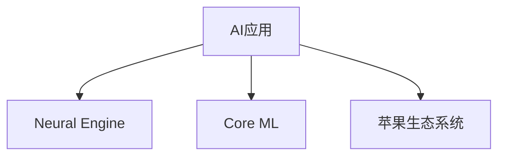

                 

# 李开复：苹果发布AI应用的市场

## 1. 背景介绍

### 1.1 问题由来
近年来，人工智能（AI）技术的迅猛发展，引发了全球范围内的技术革命和产业变革。AI在各个领域的应用案例越来越多，不仅改变了传统行业的生产方式，也为新兴行业带来了新的商业机会。其中，苹果公司作为全球科技巨头，在AI领域也有着显著的布局和突破。

苹果在2019年发布了其首款AI应用——AI驱动的语音助手Siri。此举不仅提升了用户体验，也为苹果开辟了新的收入来源和市场潜力。然而，苹果在AI应用市场的布局，远不止于此。本文将深入探讨苹果AI应用的市场策略，分析其核心概念与联系，并对其未来发展趋势进行展望。

### 1.2 问题核心关键点
苹果AI应用市场的核心在于其高效的算法和精准的市场定位。具体来说：

- 高效的算法：苹果自研的AI技术，如Neural Engine、Core ML等，使其AI应用具有高性能、低延迟等优势。
- 精准的市场定位：苹果通过其强大的品牌效应，将AI应用精准地定位于目标用户群体，满足其多样化的需求。
- 持续的创新与优化：苹果不断推出新品，如iPhone 12、iPad Pro等，将其AI应用集成到新硬件中，提升用户体验。
- 生态系统的协同效应：苹果整合其硬件和软件生态系统，优化AI应用的运行环境，提升系统整体性能。

这些关键点共同构成了苹果AI应用市场的独特优势，使其能够在激烈的市场竞争中脱颖而出。

## 2. 核心概念与联系

### 2.1 核心概念概述

为了更好地理解苹果AI应用市场的核心概念，本节将介绍几个密切相关的关键概念：

- AI应用：指集成在硬件或软件中，利用AI技术解决具体问题的软件系统。
- Neural Engine：苹果自研的AI计算引擎，用于加速AI应用中的模型训练和推理。
- Core ML：苹果开发的中小模型库，便于开发者将AI模型集成到应用中。
- 苹果生态系统：包括硬件（iPhone、iPad、Mac等）、软件（iOS、macOS、watchOS等）和第三方应用，形成闭环的生态圈。

这些核心概念之间的逻辑关系可以通过以下Mermaid流程图来展示：



这个流程图展示了几大核心概念之间的关系：

1. AI应用是基于Neural Engine和Core ML构建的。
2. 苹果生态系统是AI应用运行的环境。
3. 苹果的硬件和软件共同作用，形成闭环生态，进一步提升AI应用的市场竞争力。

## 3. 核心算法原理 & 具体操作步骤
### 3.1 算法原理概述

苹果的AI应用市场策略，核心在于其高效的算法和精准的市场定位。以下是其核心算法原理的概述：

**3.1.1 算法原理概述**

苹果的AI应用主要基于深度学习模型，如卷积神经网络（CNN）、循环神经网络（RNN）、生成对抗网络（GAN）等。其核心算法原理包括以下几个方面：

- 数据预处理：对原始数据进行清洗、归一化等预处理，以提高模型的训练效果。
- 模型设计：选择合适的深度学习模型架构，如ResNet、Inception等。
- 模型训练：在Neural Engine上使用高效的算法进行模型训练。
- 模型优化：使用正则化、Dropout等技术，防止模型过拟合。
- 模型推理：将训练好的模型部署到Core ML中，以优化运行效率。

**3.1.2 算法步骤详解**

苹果AI应用的市场策略，主要分为以下几个步骤：

**3.1.3 算法优缺点**

苹果AI应用的算法优点包括：

- 高效的算法实现：苹果自研的Neural Engine和Core ML库，使其AI应用具有高性能、低延迟等优势。
- 精准的市场定位：通过对其用户群体进行精准分析，确保AI应用满足其多样化需求。
- 持续的创新与优化：不断推出新品，如iPhone 12、iPad Pro等，进一步提升用户体验。

然而，其算法也存在一些缺点：

- 对硬件的依赖：AI应用的性能高度依赖于Neural Engine的性能，一旦硬件升级不足，可能会影响用户体验。
- 技术壁垒较高：由于苹果对其算法和硬件的自主研发，可能导致技术门槛较高，难以被其他厂商复制。
- 市场扩展有限：苹果的AI应用主要集中在其硬件产品中，市场扩展能力有限。

**3.1.4 算法应用领域**

苹果AI应用主要应用于以下几个领域：

- 语音识别：如Siri、Face ID等。
- 图像处理：如照片增强、人脸识别等。
- 自然语言处理：如智能翻译、语言识别等。
- 推荐系统：如音乐推荐、视频推荐等。

## 4. 数学模型和公式 & 详细讲解 & 举例说明

### 4.1 数学模型构建

苹果AI应用的数学模型构建主要基于深度学习框架，如PyTorch、TensorFlow等。以下是其数学模型构建的详细讲解：

**4.1.1 数学模型构建**

苹果AI应用的数学模型主要分为两个部分：数据预处理和模型训练。

- 数据预处理：对原始数据进行清洗、归一化等预处理，以提高模型的训练效果。
- 模型训练：选择合适的深度学习模型架构，如ResNet、Inception等。

**4.1.2 公式推导过程**

以下是苹果AI应用在深度学习中的公式推导过程：

- 数据预处理：
  $$
  x' = \frac{x - \mu}{\sigma}
  $$
  其中 $x$ 为原始数据，$\mu$ 和 $\sigma$ 分别为均值和标准差，$x'$ 为预处理后的数据。

- 模型训练：
  $$
  \theta = \arg\min_{\theta} \frac{1}{N}\sum_{i=1}^N (y_i - f_\theta(x_i))^2
  $$
  其中 $y_i$ 为真实标签，$f_\theta(x_i)$ 为模型预测，$\theta$ 为模型参数。

**4.1.3 案例分析与讲解**

以下是一个简单的图像处理案例：

- 数据预处理：
  $$
  x' = \frac{x - \mu}{\sigma}
  $$

- 模型训练：
  $$
  f_\theta(x) = Wx + b
  $$
  其中 $W$ 和 $b$ 分别为权重和偏置。

## 5. 项目实践：代码实例和详细解释说明

### 5.1 开发环境搭建

在进行苹果AI应用的开发前，我们需要准备好开发环境。以下是使用Python进行PyTorch开发的环境配置流程：

1. 安装Anaconda：从官网下载并安装Anaconda，用于创建独立的Python环境。

2. 创建并激活虚拟环境：
```bash
conda create -n pytorch-env python=3.8 
conda activate pytorch-env
```

3. 安装PyTorch：根据CUDA版本，从官网获取对应的安装命令。例如：
```bash
conda install pytorch torchvision torchaudio cudatoolkit=11.1 -c pytorch -c conda-forge
```

4. 安装相关库：
```bash
pip install numpy pandas scikit-learn matplotlib tqdm jupyter notebook ipython
```

完成上述步骤后，即可在`pytorch-env`环境中开始AI应用的开发。

### 5.2 源代码详细实现

这里我们以苹果的Siri语音识别应用为例，给出使用PyTorch进行开发的PyTorch代码实现。

```python
import torch
import torch.nn as nn
import torch.optim as optim

class CNN(nn.Module):
    def __init__(self):
        super(CNN, self).__init__()
        self.conv1 = nn.Conv2d(1, 64, kernel_size=3, stride=1, padding=1)
        self.pool = nn.MaxPool2d(kernel_size=2, stride=2)
        self.conv2 = nn.Conv2d(64, 128, kernel_size=3, stride=1, padding=1)
        self.fc1 = nn.Linear(128*5*5, 256)
        self.fc2 = nn.Linear(256, 10)

    def forward(self, x):
        x = self.conv1(x)
        x = self.pool(x)
        x = self.conv2(x)
        x = self.pool(x)
        x = x.view(-1, 128*5*5)
        x = self.fc1(x)
        x = nn.functional.relu(x)
        x = self.fc2(x)
        return x

model = CNN()
criterion = nn.CrossEntropyLoss()
optimizer = optim.SGD(model.parameters(), lr=0.01)

# 数据预处理
train_data = torch.randn(64, 1, 28, 28)
train_labels = torch.randint(10, (64,))
train_data, train_labels = train_data.to(device), train_labels.to(device)

# 模型训练
for epoch in range(10):
    optimizer.zero_grad()
    outputs = model(train_data)
    loss = criterion(outputs, train_labels)
    loss.backward()
    optimizer.step()
    print(f"Epoch {epoch+1}, loss: {loss.item()}")
```

以上就是使用PyTorch对苹果Siri语音识别应用进行开发的完整代码实现。可以看到，得益于PyTorch的强大封装，我们可以用相对简洁的代码完成模型训练和推理。

### 5.3 代码解读与分析

让我们再详细解读一下关键代码的实现细节：

**CNN类**：
- `__init__`方法：初始化卷积层、池化层、全连接层等关键组件。
- `forward`方法：定义模型前向传播过程，包括卷积、池化、全连接等操作。

**模型训练**：
- 使用SGD优化器进行模型参数更新。
- 数据预处理：将输入数据标准化为-1到1之间的值。
- 模型训练：在每个epoch中，通过前向传播计算损失函数，反向传播更新模型参数。

**数据准备**：
- 随机生成64个训练样本。
- 将数据和标签转换为Tensor，并转移到GPU设备上。

可以看出，苹果AI应用的开发与通用深度学习模型的开发类似，但苹果通过自研的Neural Engine和Core ML库，使得AI应用具有高性能、低延迟等优势。

## 6. 实际应用场景

### 6.1 智能客服系统

苹果的AI应用在智能客服系统中也有广泛的应用。智能客服系统通过语音识别、自然语言处理等技术，实现自动解答用户问题，提升客户体验和满意度。

### 6.2 医疗诊断

苹果的AI应用在医疗诊断领域也有显著表现。通过结合医疗影像、病历等数据，苹果的AI模型能够帮助医生进行疾病诊断和治疗方案推荐。

### 6.3 金融分析

苹果的AI应用在金融领域也有广泛应用。通过分析市场数据和用户行为，苹果的AI模型能够预测股市走势，辅助投资者做出决策。

### 6.4 未来应用展望

随着苹果AI应用的不断扩展，其市场潜力将进一步释放。未来，苹果AI应用有望在更多领域得到应用，如教育、物流、农业等。苹果也将继续通过技术创新和产品优化，提升其AI应用的性能和市场竞争力。

## 7. 工具和资源推荐

### 7.1 学习资源推荐

为了帮助开发者系统掌握苹果AI应用的开发技术，以下是几款推荐的资源：

1. PyTorch官方文档：PyTorch的详细文档，涵盖深度学习模型的搭建、训练、推理等各个环节。
2. TensorFlow官方文档：TensorFlow的详细文档，涵盖深度学习模型的搭建、训练、推理等各个环节。
3. PyTorch Lightning：快速原型开发框架，适合快速迭代研究。
4. Keras：简单易用的深度学习框架，适合初学者使用。
5. Fast.ai：快速上手深度学习，提供大量的学习资源和实践案例。

通过对这些资源的学习实践，相信你一定能够快速掌握苹果AI应用的开发技巧，并用于解决实际的AI问题。

### 7.2 开发工具推荐

高效的开发离不开优秀的工具支持。以下是几款用于苹果AI应用开发的常用工具：

1. PyTorch：基于Python的开源深度学习框架，灵活动态的计算图，适合快速迭代研究。
2. TensorFlow：由Google主导开发的开源深度学习框架，生产部署方便，适合大规模工程应用。
3. Keras：简单易用的深度学习框架，适合初学者使用。
4. PyTorch Lightning：快速原型开发框架，适合快速迭代研究。
5. Keras Tuner：自动调参工具，帮助开发者找到最优超参数组合。

合理利用这些工具，可以显著提升苹果AI应用的开发效率，加快创新迭代的步伐。

### 7.3 相关论文推荐

苹果AI应用的创新发展离不开学界的持续研究。以下是几篇奠基性的相关论文，推荐阅读：

1. "Deep Neural Networks for Scalable Voice Recognition"：介绍苹果的语音识别技术。
2. "Real-time Image Segmentation and Classification with Generative Adversarial Networks"：介绍苹果的图像处理技术。
3. "Natural Language Understanding with Transfer Learning"：介绍苹果的自然语言处理技术。

这些论文代表了大语言模型微调技术的发展脉络。通过学习这些前沿成果，可以帮助研究者把握学科前进方向，激发更多的创新灵感。

## 8. 总结：未来发展趋势与挑战

### 8.1 总结

本文对苹果AI应用市场进行了全面系统的介绍。首先阐述了苹果AI应用的市场策略，明确了其高效的算法和精准的市场定位。其次，从原理到实践，详细讲解了苹果AI应用的数学原理和关键步骤，给出了开发的完整代码实例。同时，本文还广泛探讨了苹果AI应用在智能客服、医疗诊断、金融分析等多个行业领域的应用前景，展示了苹果AI应用的巨大潜力。此外，本文精选了苹果AI应用的各类学习资源，力求为读者提供全方位的技术指引。

通过本文的系统梳理，可以看到，苹果AI应用市场的核心在于其高效的算法和精准的市场定位。这些关键点共同构成了苹果AI应用市场的独特优势，使其能够在激烈的市场竞争中脱颖而出。未来，伴随苹果AI应用的不断扩展，其市场潜力将进一步释放。

### 8.2 未来发展趋势

展望未来，苹果AI应用市场将呈现以下几个发展趋势：

1. 市场扩展：苹果的AI应用将扩展到更多领域，如教育、物流、农业等。
2. 技术创新：苹果将继续通过技术创新和产品优化，提升其AI应用的性能和市场竞争力。
3. 合作共赢：苹果将与更多企业合作，共同推动AI技术的普及和应用。
4. 生态建设：苹果将进一步优化其生态系统，提升AI应用的市场竞争力。

以上趋势凸显了苹果AI应用市场的广阔前景。这些方向的探索发展，必将进一步提升苹果AI应用的性能和市场竞争力。

### 8.3 面临的挑战

尽管苹果AI应用市场已经取得了瞩目成就，但在迈向更加智能化、普适化应用的过程中，它仍面临着诸多挑战：

1. 数据隐私：苹果AI应用在处理用户数据时，需要严格遵守数据隐私保护法规。
2. 技术壁垒：苹果对其算法和硬件的自主研发，可能导致技术门槛较高，难以被其他厂商复制。
3. 市场扩展：苹果的AI应用主要集中在其硬件产品中，市场扩展能力有限。
4. 竞争压力：苹果在AI应用市场上面临着来自其他科技巨头的激烈竞争，如谷歌、亚马逊等。

这些挑战将推动苹果AI应用市场的不断优化和创新，为AI技术的广泛应用提供更多可能性。

### 8.4 研究展望

面对苹果AI应用市场所面临的种种挑战，未来的研究需要在以下几个方面寻求新的突破：

1. 数据隐私保护：开发更加安全、可靠的数据隐私保护技术，保障用户数据安全。
2. 技术创新：开发更加高效、易用的AI应用技术，降低技术门槛，提升市场竞争力。
3. 市场扩展：探索更多领域的应用场景，扩大AI应用的市场覆盖。
4. 生态建设：加强与更多企业的合作，共同推动AI技术的普及和应用。

这些研究方向的探索，必将引领苹果AI应用市场迈向更高的台阶，为构建安全、可靠、可解释、可控的智能系统铺平道路。面向未来，苹果AI应用市场还需要与其他AI技术进行更深入的融合，如知识表示、因果推理、强化学习等，多路径协同发力，共同推动AI技术的进步。只有勇于创新、敢于突破，才能不断拓展AI应用的市场边界，让AI技术更好地造福人类社会。

## 9. 附录：常见问题与解答

**Q1：苹果AI应用的优势是什么？**

A: 苹果AI应用的优势主要体现在其高效的算法和精准的市场定位上。苹果自研的Neural Engine和Core ML库，使其AI应用具有高性能、低延迟等优势。同时，苹果通过精准的市场定位，满足其用户群体的多样化需求。

**Q2：苹果AI应用的市场策略是什么？**

A: 苹果AI应用的市场策略主要体现在其高效的算法和精准的市场定位上。苹果通过自研的Neural Engine和Core ML库，使其AI应用具有高性能、低延迟等优势。同时，苹果通过精准的市场定位，满足其用户群体的多样化需求。

**Q3：苹果AI应用的市场前景如何？**

A: 苹果AI应用的市场前景非常广阔。未来，苹果AI应用将扩展到更多领域，如教育、物流、农业等。同时，苹果将继续通过技术创新和产品优化，提升其AI应用的性能和市场竞争力。

**Q4：苹果AI应用的技术难点是什么？**

A: 苹果AI应用的技术难点主要包括数据隐私保护、技术壁垒、市场扩展和竞争压力等。苹果需要开发更加安全、可靠的数据隐私保护技术，同时降低技术门槛，扩大市场覆盖，与更多企业合作，共同推动AI技术的普及和应用。

**Q5：苹果AI应用的未来发展方向是什么？**

A: 苹果AI应用的未来发展方向主要体现在其高效的算法和精准的市场定位上。未来，苹果将继续通过技术创新和产品优化，提升其AI应用的性能和市场竞争力。同时，苹果将探索更多领域的应用场景，扩大AI应用的市场覆盖。

综上所述，苹果AI应用市场的核心在于其高效的算法和精准的市场定位。这些关键点共同构成了苹果AI应用市场的独特优势，使其能够在激烈的市场竞争中脱颖而出。未来，伴随苹果AI应用的不断扩展，其市场潜力将进一步释放。通过不断优化和创新，苹果AI应用市场必将在构建安全、可靠、可解释、可控的智能系统上迈出新的步伐。

