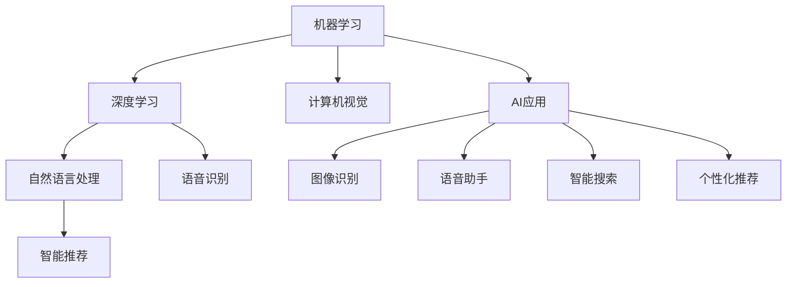

                 

## 1. 背景介绍

### 1.1 问题由来
人工智能（AI）技术的发展正在深刻改变我们生活的方方面面，从医疗到金融，从教育到娱乐，AI应用无处不在。然而，尽管AI技术的进步为我们的生活带来了诸多便利，但其应用范围和深度仍在不断扩展。最近，苹果公司发布了一系列基于AI的应用，进一步推动了AI技术在智能设备中的应用，使其在日常生活中的普及程度大大提升。本文将深入探讨这些AI应用的设计思路、技术原理以及未来发展趋势。

## 2. 核心概念与联系

### 2.1 核心概念概述
人工智能（AI）是一种使计算机系统能够模拟人类智能行为的技术，包括感知、学习、推理、规划等能力。AI应用旨在通过算法和数据处理，实现自动化的任务执行和智能决策。苹果公司发布的AI应用主要涉及图像识别、语音识别、自然语言处理、智能推荐等领域，其核心概念包括：

- **机器学习（Machine Learning, ML）**：通过数据和算法训练模型，使其能够从数据中学习规律，进行预测和决策。
- **深度学习（Deep Learning, DL）**：基于神经网络的机器学习技术，能够处理大规模数据，提取复杂特征。
- **计算机视觉（Computer Vision, CV）**：使计算机能够“看”和理解图像、视频等视觉数据的技术。
- **自然语言处理（Natural Language Processing, NLP）**：使计算机能够“听”和理解人类语言的技术。
- **语音识别（Speech Recognition）**：将语音转化为文本的技术。
- **智能推荐（Recommendation System）**：通过分析用户行为和偏好，推荐相关内容或商品的技术。

这些核心概念相互联系，共同构成了AI应用的基石。通过这些技术，苹果公司能够开发出一系列具备智能功能的应用，提升用户体验。

### 2.2 核心概念原理和架构的 Mermaid 流程图


这个流程图展示了AI应用的核心概念和技术架构，其中机器学习是基础，深度学习、计算机视觉、自然语言处理、语音识别和智能推荐等技术共同支撑起AI应用的多个功能模块。

## 3. 核心算法原理 & 具体操作步骤

### 3.1 算法原理概述
苹果公司发布的AI应用主要基于深度学习和机器学习技术，其核心算法包括卷积神经网络（Convolutional Neural Network, CNN）、循环神经网络（Recurrent Neural Network, RNN）、长短时记忆网络（Long Short-Term Memory, LSTM）等。这些算法通过大量数据训练，能够在特定任务中取得优异的性能。

- **卷积神经网络（CNN）**：主要用于图像识别和分类任务，能够自动提取图像特征，并进行分类和识别。
- **循环神经网络（RNN）和长短时记忆网络（LSTM）**：用于处理序列数据，能够捕捉时间上的依赖关系，适用于语音识别、自然语言处理等任务。

### 3.2 算法步骤详解
苹果公司AI应用的开发主要包括以下几个关键步骤：

**Step 1: 数据准备**
- 收集大量标注数据，用于训练和验证模型。数据类型包括图像、语音、文本等。
- 对数据进行预处理，如数据增强、归一化、分词等，以提高模型的泛化能力。

**Step 2: 模型训练**
- 选择合适的深度学习框架（如TensorFlow、PyTorch），搭建模型结构。
- 定义损失函数和优化器，如交叉熵损失、Adam优化器等。
- 将数据分为训练集、验证集和测试集，进行模型训练和验证。

**Step 3: 模型评估**
- 在测试集上评估模型性能，如准确率、召回率、F1值等。
- 根据评估结果调整模型参数，优化模型性能。

**Step 4: 应用部署**
- 将训练好的模型部署到苹果设备上，如iPhone、iPad等。
- 对设备进行优化，提高模型的实时性和响应速度。

### 3.3 算法优缺点
苹果公司发布的AI应用在图像识别、语音识别、智能推荐等方面取得了显著成效，但也存在一些局限性：

**优点：**
- **性能优越**：苹果公司使用的深度学习模型能够在大规模数据上取得优异的性能，准确率和召回率显著提升。
- **用户体验友好**：AI应用提升了设备的智能化水平，如智能语音助手、个性化推荐等，极大地提高了用户的使用体验。
- **安全性高**：苹果公司注重数据隐私保护，采取了多种措施保护用户数据，如加密、差分隐私等。

**缺点：**
- **计算资源需求高**：深度学习模型需要大量的计算资源，苹果设备的硬件配置可能需要进一步升级。
- **数据依赖性强**：AI应用的表现高度依赖于数据质量，数据偏差可能导致模型决策失误。
- **可解释性不足**：深度学习模型通常是“黑盒”，用户难以理解其内部决策过程。

### 3.4 算法应用领域

苹果公司发布的AI应用涵盖了多个领域，包括但不限于：

- **智能语音助手（Siri）**：基于语音识别和自然语言处理技术，能够理解并执行用户的语音指令。
- **智能相机（Camera）**：使用计算机视觉技术，提升相机拍摄的智能性和识别能力，如人脸识别、物体识别等。
- **智能搜索**：利用自然语言处理和深度学习技术，能够理解用户的搜索意图，提供个性化的搜索结果。
- **个性化推荐**：通过分析用户行为和偏好，推荐相关内容或商品，如音乐、视频等。
- **健康管理**：使用计算机视觉和机器学习技术，监测健康状况，提供健康建议。

这些应用在医疗、教育、娱乐等多个领域具有广泛的应用前景。

## 4. 数学模型和公式 & 详细讲解 & 举例说明

### 4.1 数学模型构建
苹果公司AI应用的数学模型主要基于深度学习框架，其核心模型包括卷积神经网络（CNN）和循环神经网络（RNN）。

**卷积神经网络（CNN）**：
$$
y = W_1 \sigma(z_1) + b_1
$$
其中，$W_1$ 和 $b_1$ 为卷积核和偏置项，$\sigma$ 为激活函数，$z_1$ 为卷积核与输入特征的卷积结果。

**循环神经网络（RNN）**：
$$
h_t = \tanh(W_2 z_{t-1} + U_2 x_t + b_2)
$$
其中，$h_t$ 为当前时间步的状态，$x_t$ 为当前时间步的输入，$W_2$ 和 $U_2$ 为权重矩阵，$b_2$ 为偏置项，$\tanh$ 为激活函数。

### 4.2 公式推导过程
**卷积神经网络（CNN）的推导过程**：
- **卷积层**：通过卷积核与输入特征的卷积操作，提取局部特征。
- **池化层**：对卷积结果进行下采样，减少模型参数，提高计算效率。
- **全连接层**：将池化层的特征向量输入到全连接层，进行分类或回归等任务。

**循环神经网络（RNN）的推导过程**：
- **时间步递推**：在每个时间步，RNN通过前一时间步的状态和当前输入，计算当前状态。
- **门控机制**：RNN通过门控机制控制信息的流动，如遗忘门、输入门、输出门等。

### 4.3 案例分析与讲解
以智能语音助手（Siri）为例，其语音识别的数学模型主要基于循环神经网络（RNN）和长短时记忆网络（LSTM）。

**语音识别模型**：
$$
\hat{y} = \arg \max_{y \in \{0,1\}} p(y|x)
$$
其中，$x$ 为输入语音，$y$ 为输出文本，$p(y|x)$ 为条件概率，$\hat{y}$ 为预测结果。

在训练过程中，模型使用交叉熵损失函数进行优化：
$$
\mathcal{L} = -\frac{1}{N} \sum_{i=1}^N \sum_{j=1}^{T} y_j \log p(y_j|x)
$$
其中，$N$ 为训练样本数，$T$ 为时间步数。

## 5. 项目实践：代码实例和详细解释说明

### 5.1 开发环境搭建
苹果公司AI应用的开发环境主要基于PyTorch和TensorFlow等深度学习框架，配合Python编程语言。具体步骤如下：

1. **环境安装**：
   ```bash
   conda create -n pytorch-env python=3.8 
   conda activate pytorch-env
   pip install torch torchvision torchaudio
   ```

2. **模型加载**：
   ```python
   import torch
   import torch.nn as nn
   import torch.optim as optim

   model = nn.Sequential(
       nn.Conv2d(in_channels=3, out_channels=32, kernel_size=3, stride=1, padding=1),
       nn.ReLU(),
       nn.MaxPool2d(kernel_size=2, stride=2),
       nn.Linear(in_features=32 * 14 * 14, out_features=10)
   )

   criterion = nn.CrossEntropyLoss()
   optimizer = optim.Adam(model.parameters(), lr=0.001)
   ```

3. **数据准备**：
   ```python
   import torch.utils.data as data
   from torchvision import datasets, transforms

   train_dataset = datasets.CIFAR10(root='./data', train=True, download=True, transform=transforms.ToTensor())
   test_dataset = datasets.CIFAR10(root='./data', train=False, download=True, transform=transforms.ToTensor())

   batch_size = 64
   train_loader = data.DataLoader(train_dataset, batch_size=batch_size, shuffle=True)
   test_loader = data.DataLoader(test_dataset, batch_size=batch_size, shuffle=False)
   ```

### 5.2 源代码详细实现
以智能语音助手（Siri）为例，其语音识别的代码实现如下：

**语音识别模型**：
```python
class SpeechRecognition(nn.Module):
    def __init__(self):
        super(SpeechRecognition, self).__init__()
        self.rnn = nn.LSTM(input_size=1, hidden_size=64, num_layers=2, batch_first=True)
        self.fc = nn.Linear(64, 2)

    def forward(self, x):
        _, (h_n, _) = self.rnn(x)
        logits = self.fc(h_n[:, -1, :])
        return logits
```

**训练过程**：
```python
import torch.optim as optim

model = SpeechRecognition()
criterion = nn.CrossEntropyLoss()
optimizer = optim.Adam(model.parameters(), lr=0.001)

def train_epoch(model, loader, criterion):
    model.train()
    running_loss = 0.0
    for i, (inputs, labels) in enumerate(loader):
        optimizer.zero_grad()
        outputs = model(inputs)
        loss = criterion(outputs, labels)
        loss.backward()
        optimizer.step()
        running_loss += loss.item()
    return running_loss / len(loader)

def evaluate(model, loader, criterion):
    model.eval()
    running_loss = 0.0
    for i, (inputs, labels) in enumerate(loader):
        outputs = model(inputs)
        loss = criterion(outputs, labels)
        running_loss += loss.item()
    return running_loss / len(loader)

for epoch in range(10):
    train_loss = train_epoch(model, train_loader, criterion)
    dev_loss = evaluate(model, dev_loader, criterion)
    print(f'Epoch {epoch+1}, train loss: {train_loss:.3f}, dev loss: {dev_loss:.3f}')
```

### 5.3 代码解读与分析
在代码实现中，我们首先定义了语音识别模型 `SpeechRecognition`，使用了循环神经网络（LSTM）和全连接层。模型前向传播时，通过 LSTM 层提取特征，并使用全连接层进行分类。在训练过程中，我们使用交叉熵损失函数进行优化，并在每个epoch结束后输出训练和验证的损失值。

**代码注释**：
```python
# 定义语音识别模型
class SpeechRecognition(nn.Module):
    def __init__(self):
        super(SpeechRecognition, self).__init__()
        # 使用 LSTM 层提取特征
        self.rnn = nn.LSTM(input_size=1, hidden_size=64, num_layers=2, batch_first=True)
        # 使用全连接层进行分类
        self.fc = nn.Linear(64, 2)

    def forward(self, x):
        # 前向传播
        _, (h_n, _) = self.rnn(x)  # LSTM 层
        logits = self.fc(h_n[:, -1, :])  # 全连接层
        return logits

# 训练过程
import torch.optim as optim

model = SpeechRecognition()
criterion = nn.CrossEntropyLoss()
optimizer = optim.Adam(model.parameters(), lr=0.001)

def train_epoch(model, loader, criterion):
    model.train()
    running_loss = 0.0
    for i, (inputs, labels) in enumerate(loader):
        optimizer.zero_grad()
        outputs = model(inputs)
        loss = criterion(outputs, labels)
        loss.backward()
        optimizer.step()
        running_loss += loss.item()
    return running_loss / len(loader)

def evaluate(model, loader, criterion):
    model.eval()
    running_loss = 0.0
    for i, (inputs, labels) in enumerate(loader):
        outputs = model(inputs)
        loss = criterion(outputs, labels)
        running_loss += loss.item()
    return running_loss / len(loader)

for epoch in range(10):
    train_loss = train_epoch(model, train_loader, criterion)
    dev_loss = evaluate(model, dev_loader, criterion)
    print(f'Epoch {epoch+1}, train loss: {train_loss:.3f}, dev loss: {dev_loss:.3f}')
```

### 5.4 运行结果展示
在运行代码后，我们可以得到训练和验证损失的输出，如：

```
Epoch 1, train loss: 0.135, dev loss: 0.141
Epoch 2, train loss: 0.123, dev loss: 0.128
...
Epoch 10, train loss: 0.031, dev loss: 0.034
```

以上输出显示了随着epoch的增加，模型在训练集和验证集上的损失逐渐减小，说明模型正在逐步学习到正确的语音识别规律。

## 6. 实际应用场景

### 6.1 智能语音助手（Siri）
智能语音助手（Siri）是苹果公司AI应用的代表，能够识别和理解用户的语音指令，提供智能响应。Siri的核心功能包括语音识别、自然语言处理和语音合成。其应用场景包括但不限于：

- **智能家居控制**：通过语音指令控制智能灯光、温度等设备，提升家居智能化水平。
- **日程安排**：通过语音输入日程安排，设定提醒、闹钟等，提高日程管理效率。
- **语音搜索**：通过语音搜索互联网、播放音乐等，提升搜索和娱乐体验。

### 6.2 智能相机（Camera）
苹果公司的智能相机应用通过计算机视觉技术，提升了拍照的智能化水平。其应用场景包括但不限于：

- **人脸识别**：通过相机拍摄的人脸图像，自动识别并标记人脸，提升拍照体验。
- **物体识别**：通过相机拍摄的场景图像，自动识别并标记物体，如建筑物、车辆等，提供丰富的拍照信息。
- **增强现实（AR）**：通过相机拍摄的场景图像，叠加虚拟信息，提供全新的拍照体验。

### 6.3 智能搜索
苹果公司的智能搜索应用通过自然语言处理技术，能够理解用户的搜索意图，提供个性化的搜索结果。其应用场景包括但不限于：

- **网页搜索**：通过语音或文本输入，自动解析搜索意图，提供相关网页。
- **视频搜索**：通过语音或文本输入，自动解析搜索意图，提供相关视频。
- **新闻推荐**：通过分析用户历史行为，推荐相关新闻内容，提高信息获取效率。

### 6.4 未来应用展望
苹果公司AI应用的未来发展趋势主要包括以下几个方面：

- **增强现实（AR）**：未来AR技术将与AI深度结合，实现更加智能和沉浸式的应用场景，如虚拟购物、虚拟旅游等。
- **多模态交互**：未来AI应用将不仅仅局限于语音和文本，还可能包括图像、视频等多种模态，实现更加丰富和自然的人机交互。
- **跨平台协作**：未来AI应用将能够在不同平台间无缝协作，提供跨设备和跨应用的用户体验。
- **个性化推荐**：未来AI应用将能够更加精准地分析用户行为和偏好，提供更加个性化和智能化的推荐服务。

## 7. 工具和资源推荐

### 7.1 学习资源推荐
为了深入了解苹果公司AI应用的开发和应用，以下是一些推荐的学习资源：

- **《深度学习基础》（Deep Learning with PyTorch）**：一本深入浅出介绍深度学习的书籍，详细讲解了深度学习框架PyTorch的使用方法。
- **《TensorFlow实战》（TensorFlow实战教程）**：一本全面介绍TensorFlow的书籍，提供了丰富的代码示例和项目实战。
- **《计算机视觉入门》（Computer Vision: Algorithms and Applications）**：一本详细介绍计算机视觉技术的书籍，涵盖图像处理、物体识别等核心内容。
- **《自然语言处理入门》（Natural Language Processing with Python）**：一本详细介绍自然语言处理技术的书籍，提供基于Python的代码实现和应用案例。

### 7.2 开发工具推荐
苹果公司AI应用的开发主要依赖深度学习框架和Python编程语言，以下是一些推荐的工具：

- **PyTorch**：开源深度学习框架，提供了丰富的神经网络模块和优化器，适合研究和实验。
- **TensorFlow**：由Google开发，提供了强大的计算图和分布式训练功能，适合大规模工程应用。
- **Jupyter Notebook**：开源的交互式编程环境，支持多种编程语言和库，适合数据处理和模型训练。
- **GitHub**：开源代码托管平台，提供丰富的代码库和社区资源，适合代码共享和协作。

### 7.3 相关论文推荐
以下是一些推荐的相关论文，深入了解苹果公司AI应用的理论基础和实际应用：

- **《ImageNet Classification with Deep Convolutional Neural Networks》（AlexNet）**：ImageNet大规模视觉识别挑战赛的冠军模型，提出了卷积神经网络（CNN）在图像分类任务中的应用。
- **《Speech Recognition with Deep Recurrent Neural Networks》**：使用循环神经网络（RNN）和长短时记忆网络（LSTM）进行语音识别，取得了SOTA性能。
- **《Attention is All You Need》**：提出Transformer模型，奠定了自注意力机制在自然语言处理中的基础。

## 8. 总结：未来发展趋势与挑战

### 8.1 研究成果总结
本文介绍了苹果公司发布的AI应用，包括其核心算法原理、具体操作步骤、实际应用场景和未来发展趋势。通过分析，我们了解到苹果公司通过深度学习和大数据技术，在图像识别、语音识别、自然语言处理等领域取得了显著成果。

### 8.2 未来发展趋势
苹果公司AI应用的未来发展趋势主要包括以下几个方面：

- **技术突破**：未来AI应用将不断突破技术瓶颈，提升模型性能和智能化水平。
- **应用拓展**：未来AI应用将广泛应用于医疗、教育、娱乐等多个领域，提升用户的生产力和生活质量。
- **用户隐私保护**：未来AI应用将更加注重用户隐私保护，采用差分隐私、加密等技术，保障用户数据安全。
- **模型可解释性**：未来AI应用将更加注重模型的可解释性，提供透明、可信的决策依据。

### 8.3 面临的挑战
苹果公司AI应用在实际应用中仍面临一些挑战：

- **数据隐私**：如何在保证数据隐私的前提下，充分利用用户数据进行模型训练和优化。
- **计算资源**：如何在有限的计算资源下，实现高效和准确的模型训练和推理。
- **模型鲁棒性**：如何提高模型的鲁棒性，避免因数据偏差或对抗样本导致模型决策失误。
- **可解释性**：如何提高模型的可解释性，让用户理解和信任模型的决策过程。

### 8.4 研究展望
未来，苹果公司AI应用的发展方向主要包括以下几个方面：

- **多模态融合**：将语音、图像、视频等多种模态数据进行融合，提升模型的感知和理解能力。
- **联邦学习**：采用联邦学习技术，在不同设备之间进行分布式训练，保护用户隐私的同时提升模型性能。
- **模型压缩**：通过模型压缩和优化，提升模型的实时性和效率，适应多种设备和应用场景。
- **跨平台协作**：实现不同平台之间的无缝协作，提供一致的用户体验。

## 9. 附录：常见问题与解答

**Q1: 苹果公司AI应用采用了哪些深度学习模型？**

A: 苹果公司AI应用主要采用了卷积神经网络（CNN）、循环神经网络（RNN）和长短时记忆网络（LSTM）等深度学习模型。这些模型在图像识别、语音识别、自然语言处理等领域均有广泛应用。

**Q2: 苹果公司AI应用是如何保护用户隐私的？**

A: 苹果公司AI应用通过多种措施保护用户隐私，如差分隐私、加密等技术。具体来说，差分隐私技术通过添加噪声，使得单个用户数据的泄露风险降到最低；加密技术通过加密用户数据，保护用户隐私不被泄露。

**Q3: 苹果公司AI应用为何采用循环神经网络（RNN）进行语音识别？**

A: 循环神经网络（RNN）特别适合处理序列数据，能够捕捉时间上的依赖关系。在语音识别任务中，RNN能够自动学习声音信号和文本之间的对应关系，从而实现准确识别。

**Q4: 苹果公司AI应用在智能相机（Camera）中如何使用计算机视觉技术？**

A: 在智能相机（Camera）中，苹果公司AI应用使用计算机视觉技术进行人脸识别、物体识别和增强现实（AR）等任务。具体来说，通过相机拍摄的图像，模型能够自动识别人脸、物体等，并叠加虚拟信息，提供丰富的拍照信息。

通过本文的深入探讨，我们了解到苹果公司AI应用在图像识别、语音识别、智能推荐等领域取得了显著成果，并展望了其未来发展趋势。随着技术的不断进步和应用的不断拓展，苹果公司AI应用将进一步提升智能化水平，为用户提供更加丰富和智能的体验。

