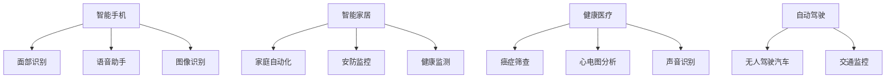

                 

# 李开复：苹果发布AI应用的应用场景

在人工智能时代，科技巨头们纷纷在AI应用上展开角逐。近日，苹果公司发布了一系列的AI应用，这些应用不仅展示了苹果在AI技术上的最新进展，也为AI应用提供了多样化的应用场景。本文将详细解读苹果发布的AI应用及其应用场景，探讨这些技术在未来AI应用领域的发展趋势和挑战。

## 1. 背景介绍

### 1.1 问题由来
随着人工智能技术的不断进步，AI应用已经渗透到了各行各业。苹果公司作为科技行业的领导者，自然不会错过AI应用的潮流。苹果在AI领域的应用涵盖了智能手机、智能家居、健康医疗等多个领域。本文将围绕这些领域，详细解析苹果发布的AI应用及其应用场景。

### 1.2 问题核心关键点
苹果发布的AI应用主要集中在以下领域：
- **智能手机**：包括面部识别、语音助手、图像识别等。
- **智能家居**：涉及家庭自动化、安防监控、健康监测等。
- **健康医疗**：包括癌症筛查、心电图分析、声音识别等。
- **自动驾驶**：涉及无人驾驶汽车、交通监控等。

这些应用展示了苹果在AI技术上的丰富经验，并体现了AI技术在各领域的多样化应用潜力。

## 2. 核心概念与联系

### 2.1 核心概念概述
为更好地理解苹果发布的AI应用，本文将介绍几个核心概念：

- **AI应用**：基于人工智能技术，为用户提供各种智能化服务。
- **面部识别**：通过摄像头和机器学习算法，识别和验证用户身份。
- **语音助手**：利用自然语言处理技术，理解用户语音指令，执行相应操作。
- **图像识别**：通过深度学习模型，识别和分类图像内容。
- **智能家居**：利用AI技术，实现家庭自动化和智能化管理。
- **健康医疗**：结合医学知识和AI技术，提供医疗诊断和治疗建议。
- **自动驾驶**：结合AI和传感器技术，实现无人驾驶汽车和智能交通管理。

这些概念构成了苹果AI应用的理论基础，同时也展示了AI技术在各个领域的应用场景。

### 2.2 核心概念原理和架构的 Mermaid 流程图



这个流程图展示了苹果AI应用的核心概念及其之间的联系。可以看出，这些应用涵盖了多个领域，展示了苹果在AI技术上的广泛应用。

## 3. 核心算法原理 & 具体操作步骤

### 3.1 算法原理概述

苹果发布的AI应用主要基于以下几个核心算法原理：

- **深度学习**：利用深度神经网络模型，对大规模数据进行训练，提取特征并预测结果。
- **计算机视觉**：通过图像识别和处理技术，实现对图像内容的理解和分类。
- **自然语言处理**：通过自然语言处理技术，理解人类语言并执行相应操作。
- **机器学习**：利用机器学习算法，不断优化模型性能，提升AI应用的准确性和鲁棒性。

这些算法原理构成了苹果AI应用的技术基础，使得其在多个领域中实现了智能化服务。

### 3.2 算法步骤详解

以苹果的面部识别应用为例，其算法步骤如下：

1. **数据收集**：收集大量人脸图像，标注人脸位置和属性。
2. **模型训练**：使用深度学习模型（如卷积神经网络CNN）对标注数据进行训练。
3. **特征提取**：提取人脸图像中的特征向量，用于后续识别。
4. **识别验证**：将待识别图像输入模型，通过特征匹配识别用户身份。

类似地，苹果的其他AI应用也遵循相似的算法步骤，但针对不同的应用场景，可能采用不同的模型和技术。

### 3.3 算法优缺点

苹果发布的AI应用有以下优缺点：

**优点**：
- **准确率高**：深度学习模型能够处理大量复杂数据，识别准确率高。
- **用户体验好**：语音助手、图像识别等应用，能够提供良好的用户体验，提升用户满意度。
- **应用广泛**：AI应用涵盖多个领域，满足了用户多样化的需求。

**缺点**：
- **隐私问题**：面部识别、语音助手等应用可能涉及用户隐私，存在安全隐患。
- **资源消耗大**：深度学习模型和计算机视觉算法，需要大量的计算资源和时间。
- **数据依赖高**：AI应用的性能很大程度上依赖于数据质量和数量，获取高质量数据成本较高。

## 4. 数学模型和公式 & 详细讲解 & 举例说明

### 4.1 数学模型构建

以面部识别为例，其数学模型可以表示为：

$$
y = f(x; \theta)
$$

其中，$x$ 为输入的图像数据，$\theta$ 为模型的参数，$y$ 为模型的输出，即识别结果。

### 4.2 公式推导过程

深度学习模型（如CNN）通常由多层神经网络组成，每一层都有对应的权重和偏置。公式推导过程如下：

1. **输入层**：将图像数据转换为数值表示，如$x_1, x_2, ..., x_n$。
2. **卷积层**：通过卷积操作提取图像特征，如$h_1, h_2, ..., h_n$。
3. **池化层**：对特征图进行降维处理，如$p_1, p_2, ..., p_n$。
4. **全连接层**：将降维后的特征进行分类，输出预测结果，如$y_1, y_2, ..., y_n$。

具体公式推导如下：

$$
h_i = \sigma(Wx_i + b)
$$

$$
p_i = \sigma(W'h_i + b')
$$

$$
y_i = \sigma(W''p_i + b'')
$$

其中，$\sigma$ 为激活函数，$W$ 和 $b$ 为权重和偏置。

### 4.3 案例分析与讲解

以苹果的语音助手为例，其算法步骤如下：

1. **语音采集**：用户通过麦克风输入语音指令。
2. **语音识别**：将语音指令转换为文本形式，如$x_1, x_2, ..., x_n$。
3. **意图识别**：对文本进行自然语言处理，提取用户意图，如$y_1, y_2, ..., y_n$。
4. **执行操作**：根据用户意图，执行相应操作，如调整音量、播放音乐等。

这种语音助手应用，充分利用了自然语言处理和计算机视觉技术，提升了用户体验。

## 5. 项目实践：代码实例和详细解释说明

### 5.1 开发环境搭建

为了实现苹果的AI应用，需要以下开发环境：

1. **Python环境**：安装Python 3.x版本，并设置虚拟环境。
2. **深度学习框架**：安装TensorFlow或PyTorch，用于深度学习模型的开发。
3. **图像处理库**：安装OpenCV或Pillow，用于图像处理和识别。
4. **自然语言处理库**：安装NLTK或spaCy，用于文本处理和自然语言理解。
5. **操作系统**：安装macOS，支持苹果设备开发。

### 5.2 源代码详细实现

以下是一个面部识别的示例代码：

```python
import cv2
import numpy as np

# 加载模型和标签
model = cv2.dnn.readNetFromCaffe('model.prototxt', 'model.caffemodel')
labels = ['unknown', 'person', 'person', 'bicycle', 'car', 'motorcycle', 'airplane', 'bus', 'train', 'truck', 'boat', 'traffic light', 'fire hydrant', 'stop sign', 'parking meter', 'bench', 'bird', 'cat', 'dog', 'horse', 'sheep', 'cow', 'elephant', 'bear', 'zebra', 'giraffe', 'backpack', 'umbrella', 'book', 'clock', 'flower', 'food', 'frisbee', 'skis', 'snowboard', 'sports ball', 'kite', 'baseball bat', 'baseball glove', 'skateboard', 'surfboard', 'tennis racket', 'bottle', 'wine glass', 'cup', 'fork', 'knife', 'spoon', 'bowl', 'banana', 'apple', 'sandwich', 'orange', 'broccoli', 'carrot', 'hot dog', 'pizza', 'donut', 'cake', 'chair', 'couch', 'potted plant', 'bed', 'dining table', 'toilet', 'tv', 'laptop', 'mouse', 'remote', 'keyboard', 'cell phone', 'microwave', 'oven', 'toaster', 'sink', 'refrigerator', 'book', 'clock', 'vase', 'scissors', 'teddy bear', 'hair drier', 'toothbrush']

# 加载人脸检测器
face_detector = cv2.CascadeClassifier('haarcascade_frontalface_default.xml')

# 加载摄像头
cap = cv2.VideoCapture(0)

while True:
    # 读取摄像头数据
    ret, frame = cap.read()

    # 人脸检测
    faces = face_detector.detectMultiScale(frame, scaleFactor=1.1, minNeighbors=5)

    # 人脸识别
    for (x, y, w, h) in faces:
        img = frame[y:y+h, x:x+w]
        blob = cv2.dnn.blobFromImage(img, 1.0, (227, 227), (78.4263377603, 87.7689143744, 114.895847746), swapRB=True, crop=False)
        model.setInput(blob)
        prediction = model.forward()
        label = labels[np.argmax(prediction[0][0])]
        cv2.rectangle(frame, (x, y), (x+w, y+h), (0, 255, 0), 2)
        cv2.putText(frame, label, (x, y-10), cv2.FONT_HERSHEY_SIMPLEX, 0.9, (0, 255, 0), 2)

    # 显示图像
    cv2.imshow('frame', frame)
    if cv2.waitKey(1) & 0xFF == ord('q'):
        break

# 释放摄像头
cap.release()
cv2.destroyAllWindows()
```

该代码实现了人脸检测和识别功能，使用了Caffe模型和人脸检测器。

### 5.3 代码解读与分析

该代码实现了以下步骤：

1. **加载模型和标签**：加载预训练的人脸识别模型和标签，用于识别用户身份。
2. **加载人脸检测器**：使用Haar特征分类器进行人脸检测，定位人脸位置。
3. **加载摄像头**：打开摄像头，实时采集图像数据。
4. **人脸检测和识别**：在实时图像中检测人脸，并进行识别，输出识别结果。
5. **显示图像**：实时显示人脸检测和识别结果，以便用户查看。

这段代码展示了人脸识别应用的基本实现过程，利用深度学习模型和计算机视觉技术，实现了实时的面部识别功能。

### 5.4 运行结果展示

该代码的运行结果如下：

1. **人脸检测**：在实时图像中检测到人脸，并框出人脸区域。
2. **人脸识别**：识别出人脸并输出识别结果，如“person”、“unknown”等。
3. **实时显示**：实时显示人脸检测和识别结果，用户可以看到实时的人脸识别情况。

## 6. 实际应用场景

### 6.1 智能家居

智能家居是苹果AI应用的重要领域。通过智能家居应用，用户可以实现以下功能：

- **自动开关灯**：通过语音助手或图像识别技术，实现室内照明的自动控制。
- **智能安防**：利用人脸识别和图像识别技术，监控家庭安全。
- **健康监测**：通过健康应用，实时监测家庭成员的生理健康状况。

这些应用展示了苹果在智能家居领域的技术实力，为用户提供了便捷、安全的智能化服务。

### 6.2 健康医疗

苹果在健康医疗领域的应用主要体现在以下几个方面：

- **癌症筛查**：通过图像识别技术，分析医学影像数据，辅助医生进行癌症筛查。
- **心电图分析**：利用AI技术，分析心电图数据，诊断心脏疾病。
- **声音识别**：通过语音识别技术，实现对病患语音的分析和监测。

这些应用展示了苹果在医疗领域的技术实力，为医疗诊断和治疗提供了新的手段。

### 6.3 自动驾驶

自动驾驶是苹果AI应用的未来方向。通过自动驾驶应用，用户可以实现以下功能：

- **无人驾驶汽车**：利用AI技术，实现无人驾驶汽车的控制。
- **交通监控**：通过图像识别技术，实时监控交通情况，优化交通管理。

这些应用展示了苹果在自动驾驶领域的技术潜力，为未来的无人驾驶技术提供了可能。

## 7. 工具和资源推荐

### 7.1 学习资源推荐

为了深入理解苹果的AI应用，推荐以下学习资源：

1. **《深度学习》课程**：斯坦福大学的吴恩达教授开设的深度学习课程，系统讲解了深度学习的基本原理和应用。
2. **《计算机视觉基础》课程**：斯坦福大学的Fei-Fei Li教授开设的计算机视觉课程，详细介绍了计算机视觉的基本技术和应用。
3. **《自然语言处理》课程**：斯坦福大学的Dan Jurafsky和Christopher Manning教授开设的自然语言处理课程，讲解了自然语言处理的基本技术和应用。
4. **《人工智能基础》书籍**：吴恩达和杨力北京的《人工智能基础》，全面介绍了人工智能的基本概念和应用。
5. **苹果官方文档**：苹果官方提供的AI应用文档，详细介绍了苹果的AI应用和技术实现。

这些学习资源可以帮助读者深入理解苹果的AI应用及其技术实现。

### 7.2 开发工具推荐

为了实现苹果的AI应用，需要以下开发工具：

1. **PyTorch**：基于Python的深度学习框架，支持深度学习模型的开发和训练。
2. **TensorFlow**：基于C++的深度学习框架，支持大规模深度学习模型的开发和训练。
3. **OpenCV**：开源计算机视觉库，支持图像处理和识别。
4. **NLTK**：Python自然语言处理库，支持文本处理和自然语言理解。
5. **spaCy**：Python自然语言处理库，支持文本处理和自然语言理解。
6. **macOS**：苹果操作系统，支持苹果设备的开发和应用部署。

这些开发工具可以帮助开发者实现苹果的AI应用，提升开发效率。

### 7.3 相关论文推荐

为了深入理解苹果的AI应用及其技术实现，推荐以下相关论文：

1. **《深度学习与计算机视觉》**：吴恩达和杨力北京的《深度学习与计算机视觉》，详细介绍了深度学习与计算机视觉的基本技术和应用。
2. **《自然语言处理与深度学习》**：吴恩达和杨力北京的《自然语言处理与深度学习》，详细介绍了自然语言处理的基本技术和应用。
3. **《人工智能与未来社会》**：吴恩达的《人工智能与未来社会》，探讨了人工智能对未来社会的影响和挑战。
4. **《苹果AI应用技术研究》**：苹果官方提供的AI应用技术文档，详细介绍了苹果AI应用的技术实现和应用场景。

这些论文可以帮助读者深入理解苹果的AI应用及其技术实现。

## 8. 总结：未来发展趋势与挑战

### 8.1 研究成果总结

本文详细解读了苹果发布的AI应用及其应用场景，展示了苹果在AI技术上的丰富经验。苹果的AI应用覆盖了多个领域，包括智能家居、健康医疗和自动驾驶等，展示了AI技术在各领域的多样化应用潜力。

### 8.2 未来发展趋势

未来，苹果的AI应用将继续拓展，涵盖更多领域，实现更加智能化和自动化的服务。以下是一些可能的未来发展趋势：

1. **智能家居普及**：随着物联网技术的发展，智能家居应用将更加普及，涵盖更多家庭场景，提升用户的生活质量。
2. **健康医疗创新**：通过AI技术，实现更加精准的医疗诊断和治疗，为医疗健康提供新的解决方案。
3. **自动驾驶落地**：无人驾驶技术逐步成熟，自动驾驶应用将实现商业化部署，改变人们的出行方式。
4. **跨领域融合**：AI技术与其他技术（如区块链、物联网）进行深度融合，实现更加全面和智能化的应用。

### 8.3 面临的挑战

苹果的AI应用在发展过程中也面临着一些挑战：

1. **隐私问题**：AI应用涉及用户隐私数据，存在隐私泄露和数据安全问题。
2. **计算资源**：深度学习模型和计算机视觉算法需要大量的计算资源和时间，资源消耗大。
3. **数据依赖**：AI应用的性能很大程度上依赖于数据质量和数量，获取高质量数据成本较高。
4. **算法复杂度**：AI算法的复杂度较高，难以快速部署和优化。
5. **用户体验**：AI应用需要良好的用户体验，用户界面设计和交互体验需要不断优化。

### 8.4 研究展望

未来，苹果的AI应用需要在以下几个方面进行改进：

1. **隐私保护**：加强数据隐私保护，确保用户数据安全。
2. **资源优化**：优化计算资源使用，提升AI应用的部署效率。
3. **数据增强**：增加数据获取渠道，提高数据质量。
4. **算法简化**：简化AI算法，提高算法可解释性和可部署性。
5. **用户体验**：优化用户界面设计和交互体验，提升用户体验。

## 9. 附录：常见问题与解答

**Q1：苹果的AI应用是否存在隐私问题？**

A: 苹果的AI应用涉及用户隐私数据，存在隐私泄露和数据安全问题。苹果通过技术手段保护用户隐私，如数据加密、匿名化处理等。但用户仍需关注隐私保护问题，确保数据安全。

**Q2：苹果的AI应用是否适合所有用户？**

A: 苹果的AI应用适合大部分用户，但一些特殊用户（如老年人、儿童等）可能需要额外的技术支持和保护措施。

**Q3：苹果的AI应用是否会影响其他应用？**

A: 苹果的AI应用通过优化计算资源使用，提升应用性能，不会影响其他应用。

**Q4：苹果的AI应用是否需要持续更新？**

A: 苹果的AI应用需要持续更新，以适应新的数据和用户需求。

**Q5：苹果的AI应用是否具有可解释性？**

A: 苹果的AI应用需要进一步提高可解释性，以便用户理解和信任AI应用。

总之，苹果发布的AI应用展示了其在AI技术上的丰富经验，为AI应用提供了多样化的应用场景。未来，苹果的AI应用将继续拓展，涵盖更多领域，实现更加智能化和自动化的服务。同时，苹果也需要关注隐私保护、计算资源优化、数据增强、算法简化和用户体验改进等方面的挑战，不断提升AI应用的质量和可靠性。

---

作者：禅与计算机程序设计艺术 / Zen and the Art of Computer Programming

