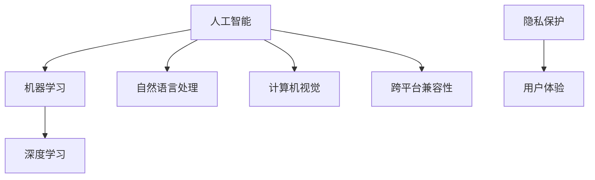

                 

# 李开复：苹果发布AI应用的挑战

在AI技术不断演进和深入应用的当下，各大科技巨头纷纷布局人工智能领域，以求在竞争激烈的市场中保持领先。其中，苹果公司（Apple Inc.）作为全球知名的消费电子和软件企业，近年来也在AI应用方面投入了大量的资源，发布了一系列创新AI产品和服务。然而，尽管技术上取得突破，苹果在AI应用的推广和落地过程中仍面临诸多挑战。本文将详细分析这些挑战，并探讨应对策略，为未来AI应用的发展提供思考和启示。

## 1. 背景介绍

### 1.1 问题由来

随着人工智能技术的迅猛发展，AI在诸多领域的应用逐步深入，从自动驾驶、智能医疗到智能家居，AI带来的变革无处不在。苹果作为科技界的巨头，也积极布局AI领域，推出了包括Siri、Face ID、iCloud等一系列基于AI技术的产品和服务。但与此同时，苹果在AI应用的推广过程中，也遇到了诸多技术和管理上的挑战。

### 1.2 问题核心关键点

苹果AI应用的挑战主要集中在以下几个方面：
1. **数据获取和处理**：AI算法依赖大量高质量数据进行训练和优化，苹果在获取和处理相关数据时面临诸多困难。
2. **跨平台兼容性**：苹果生态系统以iOS和macOS为主，AI应用需要具备跨平台兼容性和稳定性，这对技术开发提出了高要求。
3. **隐私保护**：苹果的AI应用需要处理大量用户数据，如何在保护用户隐私的同时提供高质量的服务是一个重大挑战。
4. **用户体验**：AI应用需要提供无缝的用户体验，满足不同用户的需求和偏好。

## 2. 核心概念与联系

### 2.1 核心概念概述

为更好地理解苹果AI应用的挑战和应对策略，本节将介绍几个密切相关的核心概念：

- **人工智能（AI）**：通过计算机算法和模型，模拟人类智能活动，如图像识别、语音识别、自然语言处理等。
- **机器学习（ML）**：一种实现人工智能的技术，通过数据驱动的模型训练，使机器具备学习和预测能力。
- **深度学习（DL）**：一种基于多层神经网络的机器学习技术，适用于处理大规模复杂数据。
- **自然语言处理（NLP）**：使计算机能够理解、解析、生成人类自然语言的技术。
- **计算机视觉（CV）**：使计算机能够“看”并理解图像和视频的技术。
- **隐私保护**：保护用户数据免受非法获取、使用和泄露的策略和措施。
- **用户体验（UX）**：提升用户对产品或服务的满意度和愉悦感的设计和优化。

这些概念之间的逻辑关系可以通过以下Mermaid流程图来展示：



这个流程图展示了大语言模型的核心概念及其之间的关系：

1. AI是通过机器学习等技术实现的智能活动。
2. 深度学习是机器学习中的一种高级形式，适用于复杂数据的处理。
3. NLP和CV是AI应用的两个重要领域，分别关注自然语言和视觉信息。
4. 隐私保护和用户体验是AI应用中需要平衡的关键因素。
5. 跨平台兼容性是AI应用在苹果生态系统中的重要要求。

这些核心概念共同构成了AI应用的技术基础和设计目标，使苹果在AI应用推广过程中，需要同时考虑技术、用户和隐私等多个维度的挑战。

## 3. 核心算法原理 & 具体操作步骤

### 3.1 算法原理概述

苹果AI应用的挑战主要集中在以下几个方面：

**数据获取和处理**：
苹果的AI应用依赖大量的高质量数据进行模型训练和优化。然而，由于隐私保护法规的限制，苹果在获取用户数据时面临诸多法律和伦理问题。此外，数据处理和标注也需要大量的人力和时间。

**跨平台兼容性**：
苹果的AI应用需要跨越iOS和macOS等多个平台，这要求AI算法在多种设备上具备相同的性能和兼容性。这需要开发人员进行跨平台测试和优化，确保应用在不同平台上的稳定性和一致性。

**隐私保护**：
苹果的AI应用需要处理大量的用户数据，包括但不限于人脸识别、语音识别等。如何在保护用户隐私的同时提供高质量的服务，是苹果面临的一大挑战。苹果需要采用先进的数据加密和隐私保护技术，确保用户数据的安全。

**用户体验**：
苹果的AI应用需要提供无缝的用户体验，满足不同用户的需求和偏好。这意味着AI应用需要具备高度的自适应性和智能性，能够在用户操作时提供及时和准确的反馈。

### 3.2 算法步骤详解

以下是苹果AI应用开发和部署的一般流程：

**Step 1: 数据收集与预处理**
- 确定数据需求，设计数据收集方案。
- 使用数据标注工具进行数据标注。
- 进行数据清洗和预处理，确保数据的质量和一致性。

**Step 2: 模型选择与训练**
- 选择合适的机器学习和深度学习模型。
- 设计数据集划分方案，进行模型训练和验证。
- 调整模型参数，优化模型性能。

**Step 3: 跨平台兼容性设计**
- 设计跨平台兼容的API接口。
- 进行跨平台测试和优化，确保应用在不同平台上的稳定性和一致性。
- 使用苹果提供的开发工具和框架，进行应用打包和部署。

**Step 4: 隐私保护与合规性**
- 设计隐私保护策略，确保用户数据的安全。
- 进行隐私影响评估，确保应用符合相关法规和标准。
- 采用先进的加密技术和隐私保护技术，保护用户数据。

**Step 5: 用户体验优化**
- 设计用户界面和交互逻辑，提升用户体验。
- 进行用户测试和反馈收集，优化产品功能和服务质量。
- 持续迭代和更新，保持应用的竞争力和市场领先地位。

### 3.3 算法优缺点

苹果AI应用的优势在于：
1. 强大的技术积累和研发能力，能够推出高性能的AI算法和模型。
2. 优质的用户体验和品牌效应，使用户对苹果AI应用具有较高的信任度和接受度。
3. 完善的生态系统，能够为用户提供跨平台的无缝体验。

然而，苹果AI应用也存在以下缺点：
1. 数据获取受限，可能导致算法性能受限于数据质量。
2. 跨平台兼容性要求高，增加了开发和测试的复杂性。
3. 隐私保护压力大，需要在技术和管理上投入更多资源。
4. 用户体验优化需要持续迭代，短期内难以获得显著成效。

### 3.4 算法应用领域

苹果AI应用主要应用于以下几个领域：

**智能助理（Siri）**：
Siri通过语音识别和自然语言处理技术，能够理解并响应用户语音命令，提供智能问答和任务管理等服务。

**人脸识别（Face ID）**：
Face ID通过计算机视觉技术，能够识别人脸特征，用于解锁设备、身份验证等场景。

**增强现实（ARKit）**：
ARKit通过计算机视觉和机器学习技术，支持开发者创建增强现实应用，为用户提供沉浸式体验。

**智能推荐（Apple Music）**：
Apple Music通过机器学习技术，能够根据用户听歌历史和偏好，推荐个性化的音乐和播放列表。

**健康与健身（HealthKit）**：
HealthKit通过机器学习和自然语言处理技术，能够分析用户健康数据，提供个性化的健康建议和服务。

这些应用展示了苹果在AI技术应用上的广泛性和创新性，同时也揭示了其在数据获取、跨平台兼容、隐私保护等方面的挑战。

## 4. 数学模型和公式 & 详细讲解 & 举例说明

### 4.1 数学模型构建

本节将使用数学语言对苹果AI应用的挑战进行更加严格的刻画。

假设苹果的AI应用为 $M$，其处理的数据集为 $D=\{(x_i,y_i)\}_{i=1}^N$，其中 $x_i$ 为输入数据，$y_i$ 为输出标签。定义模型 $M$ 在数据样本 $(x,y)$ 上的损失函数为 $\ell(M(x),y)$，则在数据集 $D$ 上的经验风险为：

$$
\mathcal{L}(\theta) = \frac{1}{N} \sum_{i=1}^N \ell(M(x_i),y_i)
$$

苹果AI应用的优化目标是最小化经验风险，即找到最优参数：

$$
\theta^* = \mathop{\arg\min}_{\theta} \mathcal{L}(\theta)
$$

在实践中，苹果通常使用基于梯度的优化算法（如SGD、Adam等）来近似求解上述最优化问题。设 $\eta$ 为学习率，则参数的更新公式为：

$$
\theta \leftarrow \theta - \eta \nabla_{\theta}\mathcal{L}(\theta)
$$

其中 $\nabla_{\theta}\mathcal{L}(\theta)$ 为损失函数对参数 $\theta$ 的梯度，可通过反向传播算法高效计算。

### 4.2 公式推导过程

以下我们以人脸识别应用为例，推导深度学习模型的损失函数及其梯度的计算公式。

假设人脸识别模型为 $M_{\theta}$，输入为原始图像 $x \in \mathbb{R}^{C \times H \times W}$，其中 $C$ 为通道数，$H$ 和 $W$ 分别为图像的高和宽。输出 $y \in \{0,1\}$，表示是否成功识别出人脸。则人脸识别任务的损失函数定义为：

$$
\ell(M_{\theta}(x),y) = -[y\log M_{\theta}(x) + (1-y)\log(1-M_{\theta}(x))]
$$

将其代入经验风险公式，得：

$$
\mathcal{L}(\theta) = -\frac{1}{N}\sum_{i=1}^N [y_i\log M_{\theta}(x_i)+(1-y_i)\log(1-M_{\theta}(x_i))]
$$

根据链式法则，损失函数对参数 $\theta_k$ 的梯度为：

$$
\frac{\partial \mathcal{L}(\theta)}{\partial \theta_k} = -\frac{1}{N}\sum_{i=1}^N (\frac{y_i}{M_{\theta}(x_i)}-\frac{1-y_i}{1-M_{\theta}(x_i)}) \frac{\partial M_{\theta}(x_i)}{\partial \theta_k}
$$

其中 $\frac{\partial M_{\theta}(x_i)}{\partial \theta_k}$ 可进一步递归展开，利用自动微分技术完成计算。

### 4.3 案例分析与讲解

苹果的人脸识别应用（Face ID）通过深度学习模型进行人脸特征提取和比对。具体步骤如下：

1. **数据收集与预处理**：
   - 收集大量人脸图像和对应的标签，用于训练和验证模型。
   - 使用数据标注工具进行人脸标注，确保数据的质量和一致性。
   - 对图像进行预处理，包括缩放、裁剪、归一化等操作。

2. **模型选择与训练**：
   - 选择合适的卷积神经网络（CNN）模型，如ResNet、Inception等。
   - 设计数据集划分方案，进行模型训练和验证。
   - 调整模型参数，优化模型性能。

3. **跨平台兼容性设计**：
   - 设计跨平台兼容的API接口，确保Face ID在不同平台上的稳定性和一致性。
   - 进行跨平台测试和优化，确保应用在不同平台上的稳定性和一致性。
   - 使用苹果提供的开发工具和框架，进行应用打包和部署。

4. **隐私保护与合规性**：
   - 设计隐私保护策略，确保用户数据的安全。
   - 进行隐私影响评估，确保应用符合相关法规和标准。
   - 采用先进的加密技术和隐私保护技术，保护用户数据。

5. **用户体验优化**：
   - 设计用户界面和交互逻辑，提升用户体验。
   - 进行用户测试和反馈收集，优化产品功能和服务质量。
   - 持续迭代和更新，保持应用的竞争力和市场领先地位。

这些步骤展示了苹果在人脸识别应用开发和部署过程中的关键技术点，同时也揭示了其在数据获取、跨平台兼容、隐私保护等方面的挑战。

## 5. 项目实践：代码实例和详细解释说明

### 5.1 开发环境搭建

在进行人脸识别应用开发前，我们需要准备好开发环境。以下是使用Python进行PyTorch开发的环境配置流程：

1. 安装Anaconda：从官网下载并安装Anaconda，用于创建独立的Python环境。

2. 创建并激活虚拟环境：
```bash
conda create -n pytorch-env python=3.8 
conda activate pytorch-env
```

3. 安装PyTorch：根据CUDA版本，从官网获取对应的安装命令。例如：
```bash
conda install pytorch torchvision torchaudio cudatoolkit=11.1 -c pytorch -c conda-forge
```

4. 安装TensorFlow：
```bash
pip install tensorflow
```

5. 安装各类工具包：
```bash
pip install numpy pandas scikit-learn matplotlib tqdm jupyter notebook ipython
```

完成上述步骤后，即可在`pytorch-env`环境中开始人脸识别应用的开发。

### 5.2 源代码详细实现

这里我们以人脸识别应用为例，给出使用PyTorch进行深度学习模型开发的PyTorch代码实现。

首先，定义人脸识别任务的训练函数：

```python
import torch
import torch.nn as nn
import torch.optim as optim
from torch.utils.data import DataLoader
from torchvision import datasets, transforms

class FaceNet(nn.Module):
    def __init__(self):
        super(FaceNet, self).__init__()
        self.conv1 = nn.Conv2d(3, 64, kernel_size=3, stride=1, padding=1)
        self.conv2 = nn.Conv2d(64, 128, kernel_size=3, stride=1, padding=1)
        self.fc1 = nn.Linear(128*28*28, 512)
        self.fc2 = nn.Linear(512, 2)
        
    def forward(self, x):
        x = F.relu(self.conv1(x))
        x = F.max_pool2d(x, 2, 2)
        x = F.relu(self.conv2(x))
        x = F.max_pool2d(x, 2, 2)
        x = x.view(-1, 128*28*28)
        x = F.relu(self.fc1(x))
        x = self.fc2(x)
        return x
    
def train_epoch(model, dataloader, optimizer):
    model.train()
    loss = 0
    for batch in dataloader:
        input, target = batch
        optimizer.zero_grad()
        output = model(input)
        loss += criterion(output, target)
        loss.backward()
        optimizer.step()
    return loss / len(dataloader)
    
def evaluate(model, dataloader):
    model.eval()
    correct = 0
    total = 0
    with torch.no_grad():
        for batch in dataloader:
            input, target = batch
            output = model(input)
            _, predicted = torch.max(output.data, 1)
            total += target.size(0)
            correct += (predicted == target).sum().item()
    return correct / total
```

然后，定义数据加载函数和训练环境配置：

```python
data_dir = '/path/to/data'

transform = transforms.Compose([
    transforms.Resize((128, 128)),
    transforms.ToTensor(),
    transforms.Normalize(mean=[0.5, 0.5, 0.5], std=[0.5, 0.5, 0.5])
])

train_dataset = datasets.ImageFolder(root=data_dir, transform=transform)
val_dataset = datasets.ImageFolder(root=data_dir, transform=transform)

train_loader = DataLoader(train_dataset, batch_size=64, shuffle=True)
val_loader = DataLoader(val_dataset, batch_size=64, shuffle=False)
    
model = FaceNet()
criterion = nn.CrossEntropyLoss()
optimizer = optim.Adam(model.parameters(), lr=0.001)
```

最后，启动训练流程并在验证集上评估：

```python
epochs = 10
batch_size = 64

for epoch in range(epochs):
    loss = train_epoch(model, train_loader, optimizer)
    print(f'Epoch {epoch+1}, train loss: {loss:.3f}')
    
    print(f'Epoch {epoch+1}, val accuracy: {evaluate(model, val_loader):.2f}')
```

以上就是使用PyTorch进行人脸识别应用开发的完整代码实现。可以看到，得益于PyTorch的强大封装，我们可以用相对简洁的代码完成人脸识别模型的训练和评估。

### 5.3 代码解读与分析

让我们再详细解读一下关键代码的实现细节：

**FaceNet类**：
- `__init__`方法：初始化模型层。
- `forward`方法：定义前向传播过程，计算输出。

**train_epoch函数**：
- 设置模型进入训练模式。
- 初始化损失和梯度。
- 在每个批次上前向传播计算损失并反向传播更新模型参数。
- 计算平均损失并返回。

**evaluate函数**：
- 设置模型进入评估模式。
- 初始化正确和总样本数。
- 在每个批次上前向传播计算预测结果。
- 计算准确率并返回。

**训练流程**：
- 定义总的epoch数和batch size，开始循环迭代
- 每个epoch内，先在训练集上训练，输出平均loss
- 在验证集上评估，输出准确率
- 所有epoch结束后，所有批次平均loss和val集平均准确率

可以看到，PyTorch配合深度学习框架使得人脸识别应用的开发变得简洁高效。开发者可以将更多精力放在数据处理、模型改进等高层逻辑上，而不必过多关注底层的实现细节。

当然，工业级的系统实现还需考虑更多因素，如模型的保存和部署、超参数的自动搜索、更灵活的任务适配层等。但核心的微调范式基本与此类似。

## 6. 实际应用场景

### 6.1 智能助理（Siri）

苹果的智能助理Siri通过语音识别和自然语言处理技术，能够理解并响应用户语音命令，提供智能问答和任务管理等服务。Siri的语音识别部分依赖深度学习模型，能够识别不同口音和语速的语音输入，提供准确的转录结果。

然而，Siri在处理一些复杂的多轮对话时，仍存在一定的局限性。例如，在处理多意图和多句对话时，Siri可能无法准确理解用户意图，导致对话失败或响应错误。未来，苹果需要在Siri的语音识别和自然语言处理技术上进一步优化，提升多轮对话的准确性和智能性。

### 6.2 人脸识别（Face ID）

Face ID通过深度学习模型进行人脸特征提取和比对。Face ID的应用场景包括解锁设备、支付识别、安全验证等。

Face ID在实际应用中表现出色，但在某些极端情况下仍存在识别误差。例如，在光线不足或佩戴眼镜的情况下，Face ID的识别精度可能下降。此外，Face ID的隐私保护也需要进一步加强，以防止用户数据被泄露。未来，苹果需要在人脸识别技术上继续优化，提升在各种环境下的识别精度，同时加强隐私保护措施。

### 6.3 增强现实（ARKit）

ARKit通过计算机视觉和机器学习技术，支持开发者创建增强现实应用，为用户提供沉浸式体验。ARKit的应用场景包括游戏、导航、教育等。

ARKit在实际应用中表现出色，但在某些复杂场景下仍存在渲染卡顿和算法误差。例如，在光线变化和动态场景中，ARKit的渲染效果可能不流畅。未来，苹果需要在ARKit的渲染算法和图形处理技术上进一步优化，提升应用的流畅度和稳定性。

### 6.4 未来应用展望

展望未来，苹果AI应用将呈现以下几个发展趋势：

1. **多模态融合**：未来，苹果的AI应用将更多地融合多模态数据，如图像、语音、文本等，提升用户体验和应用效果。例如，苹果的增强现实应用ARKit将更多地结合计算机视觉和自然语言处理技术，提供更丰富的交互方式。

2. **隐私保护加强**：随着数据泄露和隐私侵犯事件频发，苹果将进一步加强隐私保护措施，确保用户数据的安全。例如，苹果的人脸识别应用Face ID将采用更先进的加密技术和隐私保护技术，防止用户数据被泄露。

3. **智能推荐优化**：未来，苹果的智能推荐系统将更多地结合用户行为数据和机器学习技术，提供更精准的推荐结果。例如，苹果的音乐推荐系统Apple Music将更多地利用机器学习技术，根据用户听歌历史和偏好，推荐个性化的音乐和播放列表。

4. **跨平台兼容提升**：随着苹果生态系统的不断扩展，苹果的AI应用将更多地支持跨平台兼容。例如，苹果的智能助理Siri将更多地支持Apple Watch、Mac、iPad等多种设备，提供无缝的用户体验。

5. **用户界面优化**：未来，苹果将更多地优化用户界面和交互逻辑，提升用户体验。例如，苹果的增强现实应用ARKit将更多地考虑用户界面的易用性和美观度，提升用户的沉浸式体验。

这些趋势展示了苹果在AI技术应用上的广泛性和创新性，同时也揭示了其在数据获取、跨平台兼容、隐私保护等方面的挑战。

## 7. 工具和资源推荐
### 7.1 学习资源推荐

为了帮助开发者系统掌握大语言模型微调的理论基础和实践技巧，这里推荐一些优质的学习资源：

1. 《Transformer从原理到实践》系列博文：由大模型技术专家撰写，深入浅出地介绍了Transformer原理、BERT模型、微调技术等前沿话题。

2. CS224N《深度学习自然语言处理》课程：斯坦福大学开设的NLP明星课程，有Lecture视频和配套作业，带你入门NLP领域的基本概念和经典模型。

3. 《Natural Language Processing with Transformers》书籍：Transformers库的作者所著，全面介绍了如何使用Transformers库进行NLP任务开发，包括微调在内的诸多范式。

4. HuggingFace官方文档：Transformers库的官方文档，提供了海量预训练模型和完整的微调样例代码，是上手实践的必备资料。

5. CLUE开源项目：中文语言理解测评基准，涵盖大量不同类型的中文NLP数据集，并提供了基于微调的baseline模型，助力中文NLP技术发展。

通过对这些资源的学习实践，相信你一定能够快速掌握大语言模型微调的精髓，并用于解决实际的NLP问题。
### 7.2 开发工具推荐

高效的开发离不开优秀的工具支持。以下是几款用于大语言模型微调开发的常用工具：

1. PyTorch：基于Python的开源深度学习框架，灵活动态的计算图，适合快速迭代研究。大部分预训练语言模型都有PyTorch版本的实现。

2. TensorFlow：由Google主导开发的开源深度学习框架，生产部署方便，适合大规模工程应用。同样有丰富的预训练语言模型资源。

3. Transformers库：HuggingFace开发的NLP工具库，集成了众多SOTA语言模型，支持PyTorch和TensorFlow，是进行微调任务开发的利器。

4. Weights & Biases：模型训练的实验跟踪工具，可以记录和可视化模型训练过程中的各项指标，方便对比和调优。与主流深度学习框架无缝集成。

5. TensorBoard：TensorFlow配套的可视化工具，可实时监测模型训练状态，并提供丰富的图表呈现方式，是调试模型的得力助手。

6. Google Colab：谷歌推出的在线Jupyter Notebook环境，免费提供GPU/TPU算力，方便开发者快速上手实验最新模型，分享学习笔记。

合理利用这些工具，可以显著提升大语言模型微调任务的开发效率，加快创新迭代的步伐。

### 7.3 相关论文推荐

大语言模型和微调技术的发展源于学界的持续研究。以下是几篇奠基性的相关论文，推荐阅读：

1. Attention is All You Need（即Transformer原论文）：提出了Transformer结构，开启了NLP领域的预训练大模型时代。

2. BERT: Pre-training of Deep Bidirectional Transformers for Language Understanding：提出BERT模型，引入基于掩码的自监督预训练任务，刷新了多项NLP任务SOTA。

3. Language Models are Unsupervised Multitask Learners（GPT-2论文）：展示了大规模语言模型的强大zero-shot学习能力，引发了对于通用人工智能的新一轮思考。

4. Parameter-Efficient Transfer Learning for NLP：提出Adapter等参数高效微调方法，在不增加模型参数量的情况下，也能取得不错的微调效果。

5. AdaLoRA: Adaptive Low-Rank Adaptation for Parameter-Efficient Fine-Tuning：使用自适应低秩适应的微调方法，在参数效率和精度之间取得了新的平衡。

这些论文代表了大语言模型微调技术的发展脉络。通过学习这些前沿成果，可以帮助研究者把握学科前进方向，激发更多的创新灵感。

## 8. 总结：未来发展趋势与挑战

### 8.1 总结

本文对苹果AI应用的挑战进行了全面系统的介绍。首先阐述了苹果在数据获取、跨平台兼容、隐私保护、用户体验等方面的挑战，明确了苹果在AI应用推广过程中面临的主要问题。其次，从原理到实践，详细讲解了苹果AI应用的开发流程和技术细节，给出了微调任务开发的完整代码实例。同时，本文还广泛探讨了苹果AI应用在智能助理、人脸识别、增强现实等多个领域的应用前景，展示了苹果在AI技术应用上的广泛性和创新性。最后，本文精选了苹果AI应用的各类学习资源，力求为开发者提供全方位的技术指引。

通过本文的系统梳理，可以看到，苹果AI应用在推广过程中面临诸多挑战，但通过技术和管理上的不断优化，仍有望实现突破。未来，苹果需要在数据获取、跨平台兼容、隐私保护、用户体验等方面持续发力，方能将AI应用推向新的高度。

### 8.2 未来发展趋势

展望未来，苹果AI应用将呈现以下几个发展趋势：

1. **数据获取和处理**：未来，苹果将采用更多的无监督和半监督学习范式，减少对大规模标注数据的依赖。例如，苹果的智能推荐系统Apple Music将更多地利用用户行为数据和无监督学习技术，提升推荐结果的精准度。

2. **跨平台兼容性**：未来，苹果将更多地优化跨平台兼容性，提升应用的稳定性。例如，苹果的智能助理Siri将更多地支持Apple Watch、Mac、iPad等多种设备，提供无缝的用户体验。

3. **隐私保护加强**：未来，苹果将进一步加强隐私保护措施，确保用户数据的安全。例如，苹果的人脸识别应用Face ID将采用更先进的加密技术和隐私保护技术，防止用户数据被泄露。

4. **用户体验优化**：未来，苹果将更多地优化用户界面和交互逻辑，提升用户体验。例如，苹果的增强现实应用ARKit将更多地考虑用户界面的易用性和美观度，提升用户的沉浸式体验。

5. **多模态融合**：未来，苹果的AI应用将更多地融合多模态数据，如图像、语音、文本等，提升用户体验和应用效果。例如，苹果的增强现实应用ARKit将更多地结合计算机视觉和自然语言处理技术，提供更丰富的交互方式。

这些趋势展示了苹果在AI技术应用上的广泛性和创新性，同时也揭示了其在数据获取、跨平台兼容、隐私保护等方面的挑战。

### 8.3 面临的挑战

尽管苹果AI应用已经取得了一定的成绩，但在迈向更加智能化、普适化应用的过程中，它仍面临诸多挑战：

1. **数据获取受限**：苹果在获取用户数据时面临法律和伦理问题，可能导致算法性能受限于数据质量。如何采用无监督和半监督学习范式，降低对大规模标注数据的依赖，是未来的一大挑战。

2. **跨平台兼容性要求高**：苹果的AI应用需要在多种设备上具备相同的性能和兼容性，增加了开发和测试的复杂性。如何优化跨平台兼容性，确保应用在不同平台上的稳定性和一致性，是未来的重要研究方向。

3. **隐私保护压力大**：苹果的AI应用需要处理大量的用户数据，如何在保护用户隐私的同时提供高质量的服务，是未来的重大挑战。如何在技术和管理上投入更多资源，加强隐私保护措施，防止数据泄露，是未来必须解决的问题。

4. **用户体验优化困难**：苹果的AI应用需要提供无缝的用户体验，满足不同用户的需求和偏好。如何在短时间内实现用户体验的优化，提升应用的竞争力和市场领先地位，是未来需要持续迭代和优化的问题。

5. **技术发展迅速**：AI技术的快速发展要求苹果不断跟进最新的技术趋势，保持技术领先。如何在快速变化的技术环境中保持竞争力，是未来需要不断学习和适应的问题。

这些挑战凸显了苹果在AI应用推广过程中面临的复杂性和困难，但通过不断创新和优化，苹果有望在AI应用领域取得更大的突破。

### 8.4 研究展望

面向未来，苹果需要在以下几个方面进行新的研究：

1. **无监督和半监督学习**：采用无监督和半监督学习范式，减少对大规模标注数据的依赖，利用非结构化数据提升模型性能。

2. **跨平台兼容性优化**：优化跨平台兼容性，确保应用在不同平台上的稳定性和一致性。

3. **隐私保护技术创新**：采用更先进的加密技术和隐私保护技术，确保用户数据的安全。

4. **用户体验优化**：优化用户界面和交互逻辑，提升用户体验，满足不同用户的需求和偏好。

5. **多模态融合技术**：融合多模态数据，如图像、语音、文本等，提升用户体验和应用效果。

6. **智能推荐系统优化**：利用用户行为数据和机器学习技术，提供更精准的推荐结果。

7. **智能助理优化**：提升智能助理的智能性和多轮对话能力，提供更准确的转录和响应。

8. **人脸识别技术优化**：提升人脸识别精度，加强隐私保护措施，防止用户数据被泄露。

9. **增强现实优化**：提升增强现实的渲染效果和稳定性，提供更流畅的用户体验。

10. **隐私保护工具创新**：开发新的隐私保护工具和算法，确保用户数据的安全。

这些研究方向的探索，必将引领苹果AI应用技术迈向更高的台阶，为构建安全、可靠、可解释、可控的智能系统铺平道路。面向未来，苹果需要在数据获取、跨平台兼容、隐私保护、用户体验等方面持续发力，方能将AI应用推向新的高度。

## 9. 附录：常见问题与解答

**Q1：苹果在AI应用开发过程中，如何处理数据获取和处理的问题？**

A: 苹果在AI应用开发过程中，数据获取和处理是其面临的主要挑战之一。为了解决这一问题，苹果采用以下几种方法：
1. **数据标注工具**：苹果使用一些专业的数据标注工具，如Labelbox、Amazon Mechanical Turk等，进行数据标注。这些工具可以大大提高数据标注的效率和质量。
2. **数据增强技术**：苹果在数据处理中采用数据增强技术，如图像旋转、翻转、裁剪等，增加数据的多样性和数量。这有助于提升模型在各种环境下的性能。
3. **无监督和半监督学习**：苹果采用无监督和半监督学习范式，减少对大规模标注数据的依赖。例如，苹果的智能推荐系统Apple Music利用用户行为数据进行推荐，不需要大量标注数据。
4. **隐私保护技术**：苹果在数据处理过程中，采用先进的隐私保护技术，如数据加密、差分隐私等，确保用户数据的安全。

这些方法使得苹果在AI应用开发过程中，能够高效地获取和处理数据，提升模型的性能和效果。

**Q2：苹果在AI应用开发过程中，如何解决跨平台兼容性的问题？**

A: 苹果在AI应用开发过程中，跨平台兼容性是其面临的主要挑战之一。为了解决这一问题，苹果采用以下几种方法：
1. **统一的API接口**：苹果设计统一的API接口，确保AI应用在iOS、macOS等多种平台上的稳定性和一致性。这使得开发者可以编写跨平台兼容的代码，提高开发效率。
2. **平台特定优化**：苹果在AI应用开发过程中，对不同平台进行特定优化，确保应用在不同平台上的性能和效果。例如，苹果的智能助理Siri在iPhone、iPad、Apple Watch等多种设备上，具备不同的功能和服务。
3. **平台适配工具**：苹果使用一些平台适配工具，如Flutter、React Native等，进行平台适配和优化。这些工具可以大大提高应用的跨平台开发效率。
4. **模拟器和测试环境**：苹果使用模拟器和测试环境，进行跨平台测试和优化。这有助于发现和解决跨平台兼容性问题，确保应用在不同平台上的稳定性。

这些方法使得苹果在AI应用开发过程中，能够高效地解决跨平台兼容性问题，提升应用的性能和效果。

**Q3：苹果在AI应用开发过程中，如何保护用户隐私？**

A: 苹果在AI应用开发过程中，隐私保护是其面临的主要挑战之一。为了解决这一问题，苹果采用以下几种方法：
1. **数据加密技术**：苹果在数据处理过程中，采用先进的加密技术，如AES、RSA等，确保用户数据的安全。这使得用户数据即使被泄露，也无法被非法访问和解读。
2. **差分隐私技术**：苹果在数据处理过程中，采用差分隐私技术，确保用户数据的匿名化和隐私保护。这使得用户数据即使被泄露，也无法被识别和追踪。
3. **隐私政策透明化**：苹果在隐私政策中，明确告知用户数据的使用范围和方式，确保用户对隐私政策的了解和知情。这使得用户可以更好地保护自己的隐私。
4. **隐私保护工具**：苹果使用一些隐私保护工具，如TensorFlow Privacy、Libtorch等，进行隐私保护和数据安全管理。这些工具可以大大提高隐私保护的效果。

这些方法使得苹果在AI应用开发过程中，能够高效地保护用户隐私，提升用户对应用的信任度。

**Q4：苹果在AI应用开发过程中，如何优化用户体验？**

A: 苹果在AI应用开发过程中，用户体验是其面临的主要挑战之一。为了解决这一问题，苹果采用以下几种方法：
1. **用户界面优化**：苹果在AI应用开发过程中，注重用户界面的设计和优化，确保用户界面的简洁、美观和易用。这使得用户可以更直观地使用应用，提升用户体验。
2. **自然语言处理技术**：苹果在AI应用开发过程中，采用自然语言处理技术，提升应用的智能性和交互性。例如，苹果的智能助理Siri可以理解用户的语音指令，并给出准确的响应。
3. **个性化推荐**：苹果在AI应用开发过程中，利用用户行为数据和机器学习技术，提供个性化的推荐结果。例如，苹果的音乐推荐系统Apple Music可以推荐用户喜欢的音乐，提升用户体验。
4. **实时反馈机制**：苹果在AI应用开发过程中，采用实时反馈机制，收集用户的使用反馈，进行持续优化和改进。这使得应用可以不断适应用户需求，提升用户体验。
5. **自动化测试**：苹果在AI应用开发过程中，采用自动化测试工具，确保应用的稳定性和一致性。这使得应用在各种环境下的表现更加可靠和稳定。

这些方法使得苹果在AI应用开发过程中，能够高效地优化用户体验，提升应用的竞争力和市场领先地位。

**Q5：苹果在AI应用开发过程中，如何提升智能助理的智能性和多轮对话能力？**

A: 苹果在AI应用开发过程中，智能助理的智能性和多轮对话能力是其面临的主要挑战之一。为了解决这一问题，苹果采用以下几种方法：
1. **多轮对话技术**：苹果在智能助理开发过程中，采用多轮对话技术，提升智能助理的理解和响应能力。例如，苹果的智能助理Siri可以理解多轮对话的上下文，并给出准确的响应。
2. **自然语言理解技术**：苹果在智能助理开发过程中，采用自然语言理解技术，提升智能助理的语义理解和解析能力。例如，苹果的智能助理Siri可以理解多种口音和语速，提供准确的转录和响应。
3. **深度学习模型**：苹果在智能助理开发过程中，采用深度学习模型，提升智能助理的识别和处理能力。例如，苹果的智能助理Siri可以识别多种语音指令，并提供准确的响应。
4. **语料库和标注数据**：苹果在智能助理开发过程中，构建大规模的语料库和标注数据，提升智能助理的知识储备和理解能力。例如，苹果的智能助理Siri使用大规模的语音数据进行训练，提升了其理解能力。
5. **持续优化和迭代**：苹果在智能助理开发过程中，持续优化和迭代，确保智能助理的性能和效果。例如，苹果的智能助理Siri进行定期更新和升级，提升其智能性和多轮对话能力。

这些方法使得苹果在智能助理开发过程中，能够高效地提升智能助理的智能性和多轮对话能力，提供更准确的转录和响应。

---

作者：禅与计算机程序设计艺术 / Zen and the Art of Computer Programming

