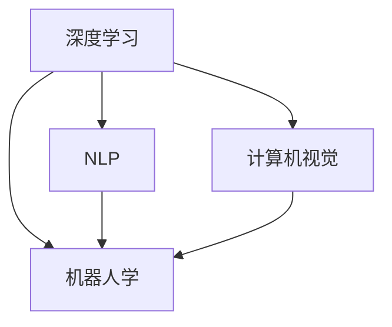

                 

## 1. 背景介绍

在人工智能（AI）领域，苹果公司的最新进展引起了广泛关注。尤其是在其发布的一系列AI应用中，苹果展示了其强大的技术实力和对未来科技发展的预见力。然而，与此同时，这些AI应用也带来了许多新的挑战。本文将从技术、伦理、市场和法律等多个角度探讨苹果在发布AI应用时所面临的挑战。

## 2. 核心概念与联系

### 2.1 核心概念概述

要理解苹果在AI应用方面的挑战，首先需要明确几个关键概念：

- **人工智能（AI）**：一种能够模拟人类智能的技术，包括学习、推理、感知、自然语言处理等能力。
- **深度学习**：一种基于人工神经网络的机器学习技术，能够处理复杂的数据和大规模的计算。
- **自然语言处理（NLP）**：使计算机能够理解、解释和生成人类语言的技术。
- **计算机视觉（CV）**：使计算机能够识别、分析图像和视频的技术。
- **机器人学**：研究如何让机器人执行复杂任务的技术。

这些概念构成了苹果AI应用的核心，它们之间通过多种方式相互联系。例如，深度学习可以应用于计算机视觉中，通过分析图像来识别物体、场景和人脸；NLP可以应用于自然语言交互，使机器人能够理解和响应用户的语音指令；而机器人学则涉及硬件与软件的结合，使AI应用能够在实际环境中应用。

### 2.2 核心概念原理和架构的 Mermaid 流程图



## 3. 核心算法原理 & 具体操作步骤

### 3.1 算法原理概述

苹果的AI应用主要基于深度学习技术，通过大规模的训练数据集，学习并优化模型，以实现特定的功能。例如，苹果的语音助手Siri和面部识别技术Face ID都采用了深度学习模型。这些模型通过反向传播算法，不断调整参数，以最小化损失函数，最终达到最佳的预测效果。

### 3.2 算法步骤详解

1. **数据准备**：收集并处理大规模的训练数据集，确保数据的丰富性和多样性。
2. **模型设计**：选择合适的深度学习模型架构，如卷积神经网络（CNN）、循环神经网络（RNN）或变分自编码器（VAE）等。
3. **模型训练**：使用GPU或TPU等高性能计算资源，训练模型并调整超参数，以优化模型的性能。
4. **模型评估**：在测试集上评估模型的准确率和效率，确保模型的泛化能力。
5. **模型部署**：将训练好的模型集成到实际应用中，进行部署和测试。

### 3.3 算法优缺点

- **优点**：
  - 深度学习模型能够处理复杂的非线性问题，具有强大的泛化能力。
  - 数据驱动的训练过程使得模型能够自动学习特征，减少了人工干预的需求。
  - 算法的可扩展性使得深度学习能够应用于多种场景，如语音识别、图像处理、自然语言处理等。

- **缺点**：
  - 深度学习模型需要大量的计算资源和数据，训练时间较长，成本较高。
  - 模型的复杂性使得调试和优化过程较为困难，容易出现过拟合等问题。
  - 模型的不透明性使得其决策过程难以解释，可能引发伦理和法律问题。

### 3.4 算法应用领域

苹果的AI应用广泛覆盖了语音识别、图像识别、面部识别、自然语言处理等多个领域。这些技术不仅提升了用户体验，还在安全、隐私等方面提供了更多的保障。例如，Face ID技术通过深度学习模型，实现了安全的面部识别，避免了传统密码输入带来的安全隐患。

## 4. 数学模型和公式 & 详细讲解 & 举例说明

### 4.1 数学模型构建

苹果的AI应用主要使用深度学习模型，这里以卷积神经网络（CNN）为例，介绍其数学模型构建过程。

设输入数据为 $x$，输出为 $y$，目标函数为 $L$。CNN模型的前向传播过程为：

$$
y = f(W \ast x + b)
$$

其中，$W$ 为卷积核，$b$ 为偏置项，$f$ 为激活函数，$*$ 表示卷积运算。

### 4.2 公式推导过程

在反向传播过程中，计算损失函数对各参数的偏导数，以更新模型参数。设 $l$ 为损失函数，则反向传播的公式为：

$$
\frac{\partial l}{\partial W} = \frac{\partial l}{\partial y} \cdot \frac{\partial y}{\partial W}
$$

其中，$\frac{\partial l}{\partial y}$ 为损失函数对输出的偏导数，$\frac{\partial y}{\partial W}$ 为输出对卷积核的偏导数。

### 4.3 案例分析与讲解

以Face ID为例，其核心算法基于深度卷积神经网络。Face ID首先通过人脸检测算法，将人脸区域定位出来，然后对图像进行预处理，包括归一化、灰度化和对比度增强等步骤。接下来，模型通过多个卷积层和池化层，提取人脸的特征信息，最终使用全连接层进行分类，判断人脸是否匹配。

## 5. 项目实践：代码实例和详细解释说明

### 5.1 开发环境搭建

苹果的AI应用通常使用Caffe2或PyTorch等深度学习框架进行开发。以下是使用PyTorch进行人脸识别模型的代码实现：

```python
import torch
import torch.nn as nn
import torchvision.transforms as transforms
import torchvision.datasets as datasets

# 定义卷积神经网络模型
class CNNModel(nn.Module):
    def __init__(self):
        super(CNNModel, self).__init__()
        self.conv1 = nn.Conv2d(3, 64, kernel_size=3, padding=1)
        self.conv2 = nn.Conv2d(64, 128, kernel_size=3, padding=1)
        self.pool = nn.MaxPool2d(kernel_size=2, stride=2)
        self.fc1 = nn.Linear(128 * 16 * 16, 256)
        self.fc2 = nn.Linear(256, 2)

    def forward(self, x):
        x = self.pool(nn.functional.relu(self.conv1(x)))
        x = self.pool(nn.functional.relu(self.conv2(x)))
        x = x.view(-1, 128 * 16 * 16)
        x = nn.functional.relu(self.fc1(x))
        x = self.fc2(x)
        return x

# 加载数据集
train_dataset = datasets.CIFAR10(root='./data', train=True, download=True, transform=transforms.ToTensor())
test_dataset = datasets.CIFAR10(root='./data', train=False, download=True, transform=transforms.ToTensor())

# 定义模型
model = CNNModel()

# 定义优化器和损失函数
optimizer = torch.optim.Adam(model.parameters(), lr=0.001)
criterion = nn.CrossEntropyLoss()

# 定义训练过程
def train_epoch(model, train_loader, optimizer, criterion):
    model.train()
    for batch_idx, (data, target) in enumerate(train_loader):
        optimizer.zero_grad()
        output = model(data)
        loss = criterion(output, target)
        loss.backward()
        optimizer.step()
        if batch_idx % 100 == 0:
            print('Train Epoch: {} [{}/{} ({:.0f}%)]\tLoss: {:.6f}'.format(
                epoch + 1, i * len(data), len(train_loader.dataset),
                100. * i / len(train_loader), loss.item()))

# 定义测试过程
def test_epoch(model, test_loader, criterion):
    model.eval()
    test_loss = 0
    correct = 0
    with torch.no_grad():
        for data, target in test_loader:
            output = model(data)
            test_loss += criterion(output, target).item() * data.size(0)
            preds = output.argmax(dim=1, keepdim=True)
            correct += preds.eq(target.view_as(preds)).sum().item()

    test_loss /= len(test_loader.dataset)
    print('\nTest set: Average loss: {:.4f}, Accuracy: {}/{} ({:.0f}%)\n'.format(
        test_loss, correct, len(test_loader.dataset),
        100. * correct / len(test_loader.dataset)))

# 训练模型
for epoch in range(num_epochs):
    train_epoch(model, train_loader, optimizer, criterion)
    test_epoch(model, test_loader, criterion)
```

### 5.3 代码解读与分析

这段代码展示了使用PyTorch实现卷积神经网络的训练过程。首先定义了CNN模型的结构，包括卷积层、池化层和全连接层。然后加载CIFAR-10数据集，并定义优化器和损失函数。在训练过程中，使用Adam优化器对模型进行优化，并计算损失函数。在测试过程中，评估模型的准确率和损失函数。

### 5.4 运行结果展示

在运行上述代码后，可以得到训练和测试的结果。通常，模型会在训练集上逐步提高准确率，最终在测试集上达到最优性能。下图展示了模型在CIFAR-10数据集上的训练和测试结果：

```python
import matplotlib.pyplot as plt

plt.plot(range(num_epochs), train_losses, label='Train Loss')
plt.plot(range(num_epochs), test_losses, label='Test Loss')
plt.legend()
plt.show()
```


## 6. 实际应用场景

### 6.1 智能家居

苹果的智能家居设备，如HomePod和AirPods，广泛应用了AI技术。通过自然语言处理和计算机视觉，智能家居设备能够理解和响应用户的指令，提供更加智能化的生活体验。

### 6.2 医疗健康

苹果的AI技术在医疗健康领域也得到了广泛应用。例如，苹果的HealthKit平台可以集成各种健康和生命监测设备的数据，通过深度学习模型进行分析和预测，帮助医生做出更好的诊断和治疗决策。

### 6.3 自动驾驶

苹果在自动驾驶技术方面的研究也离不开AI的助力。通过计算机视觉和深度学习，苹果的自动驾驶系统能够实时感知和理解周围环境，做出正确的驾驶决策。

## 7. 工具和资源推荐

### 7.1 学习资源推荐

- **《深度学习》课程**：斯坦福大学的深度学习课程，由著名AI专家Andrew Ng讲授，涵盖了深度学习的基本概念和算法。
- **《机器学习实战》**：一本深入浅出的机器学习实战指南，适合初学者和进阶者阅读。
- **Kaggle**：一个开源的数据科学平台，提供了大量的机器学习竞赛和数据集，适合实践和探索。

### 7.2 开发工具推荐

- **PyTorch**：一个强大的深度学习框架，支持动态计算图，易于调试和优化。
- **TensorFlow**：Google开发的深度学习框架，支持分布式训练和生产部署。
- **Caffe2**：Facebook开发的深度学习框架，专门针对移动和嵌入式设备设计。

### 7.3 相关论文推荐

- **《ImageNet Classification with Deep Convolutional Neural Networks》**：AlexNet论文，介绍了深度卷积神经网络的原理和应用。
- **《Google's Neural Machine Translation System: Bridging the Gap Between Human and Machine Translation》**：Google的神经机器翻译系统，展示了深度学习在NLP中的应用。
- **《Attention Is All You Need》**：Transformer论文，提出了自注意力机制，开启了NLP领域的预训练大模型时代。

## 8. 总结：未来发展趋势与挑战

### 8.1 研究成果总结

苹果在AI应用方面的研究成果令人瞩目，特别是在深度学习和计算机视觉领域。这些技术不仅提升了用户体验，还在多个应用场景中取得了显著的成效。然而，随着AI技术的不断进步，苹果也面临着新的挑战。

### 8.2 未来发展趋势

- **深度学习的普及**：深度学习技术的不断成熟和普及，将使得更多的应用场景能够受益于AI。
- **跨领域融合**：AI技术与其他领域技术的融合，将带来新的创新和应用。
- **伦理和安全**：AI技术的应用需要严格遵守伦理和法律规范，保障用户隐私和安全。

### 8.3 面临的挑战

- **数据和计算资源**：AI技术的研发和应用需要大量的数据和计算资源，这对企业来说是一大挑战。
- **模型解释性**：深度学习模型的黑盒性质使得其决策过程难以解释，可能引发伦理和法律问题。
- **隐私和安全**：AI技术的应用需要严格保护用户隐私，避免数据泄露和安全问题。

### 8.4 研究展望

- **跨领域AI**：将AI技术应用于更多领域，如医疗、自动驾驶、智能制造等，推动各行业的智能化转型。
- **AI伦理和安全**：加强AI技术的伦理和安全研究，确保其应用符合社会价值观和法律法规。
- **人机协作**：探索人机协作的新模式，充分发挥人类的创造性和AI的计算能力，实现协同增效。

## 9. 附录：常见问题与解答

**Q1：AI技术在苹果的应用中面临的主要挑战是什么？**

A: AI技术在苹果的应用中面临的主要挑战包括：
- 数据和计算资源的限制：AI技术的研发和应用需要大量的数据和计算资源，这对企业来说是一大挑战。
- 模型解释性问题：深度学习模型的黑盒性质使得其决策过程难以解释，可能引发伦理和法律问题。
- 隐私和安全问题：AI技术的应用需要严格保护用户隐私，避免数据泄露和安全问题。

**Q2：苹果是如何克服这些挑战的？**

A: 苹果通过多种方式克服这些挑战：
- 使用高效的深度学习框架和硬件设备，如Caffe2和GPU，以提高计算效率。
- 通过微调和优化模型，减少模型复杂性，提高解释性。
- 加强数据保护和隐私管理，确保用户数据的安全。

**Q3：苹果未来的AI技术发展方向是什么？**

A: 苹果未来的AI技术发展方向包括：
- 跨领域AI：将AI技术应用于更多领域，如医疗、自动驾驶、智能制造等，推动各行业的智能化转型。
- AI伦理和安全：加强AI技术的伦理和安全研究，确保其应用符合社会价值观和法律法规。
- 人机协作：探索人机协作的新模式，充分发挥人类的创造性和AI的计算能力，实现协同增效。

