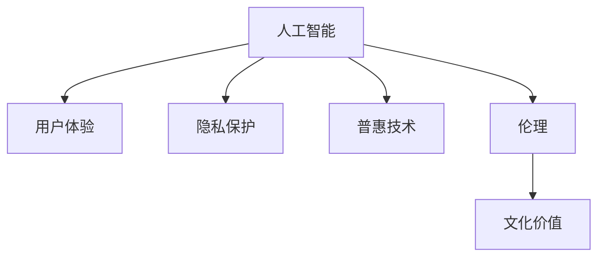

                 

# 李开复：苹果发布AI应用的文化价值

## 1. 背景介绍

### 1.1 问题由来
随着人工智能(AI)技术的发展，AI应用已经渗透到我们生活的方方面面，从智能家居到医疗诊断，从自动驾驶到语言翻译，AI正在改变我们对这个世界的理解和使用方式。作为科技界的重要人物，李开复在其最新演讲中深入探讨了苹果公司发布的AI应用背后的文化价值，为我们揭示了AI技术的深层内涵。

### 1.2 问题核心关键点
李开复指出，苹果发布的AI应用不仅仅是技术的展示，更是文化价值的体现。这些应用背后蕴含着苹果公司对用户体验、隐私保护、普惠技术的深层次思考，推动了科技与人文、伦理的深度融合。通过深入理解这些核心关键点，可以更好地把握苹果AI应用的本质和价值。

### 1.3 问题研究意义
李开复的研究对于理解AI技术的社会文化影响，推动AI技术的人性化、普惠化发展具有重要意义。研究苹果AI应用的文化价值，有助于科技企业更加注重伦理、道德和社会责任，促进AI技术的健康、可持续发展。

## 2. 核心概念与联系

### 2.1 核心概念概述

为更好地理解李开复演讲中提及的核心概念，本节将介绍几个关键概念及其相互关系：

- **人工智能(AI)**：指通过计算机程序模拟人类智能行为的技术，包括学习、推理、感知、语言理解等。
- **用户体验(User Experience, UX)**：指用户在使用产品或服务过程中所获得的整体体验，包括视觉设计、交互设计、性能等方面。
- **隐私保护(Privacy Protection)**：指在收集、处理、存储个人数据过程中，采取的保障用户信息安全的措施，防止数据泄露、滥用。
- **普惠技术(Inclusive Technology)**：指能够惠及广泛人群的技术，特别是在教育、医疗、就业等领域的普及应用。
- **伦理(Ethics)**：指在技术研发、应用中遵循的道德原则和社会规范，确保技术行为的正当性和有益性。
- **文化价值(Cultural Value)**：指技术应用中所体现出的文化理念、价值观和社会责任感，对于技术和社会文化的影响和贡献。

这些概念之间的逻辑关系可以通过以下Mermaid流程图来展示：



这个流程图展示了一系列核心概念及其之间的联系：

1. 人工智能通过改善用户体验、保护隐私、推动普惠技术，体现其伦理价值。
2. 文化价值则是人工智能在实际应用中体现出的社会责任感，是衡量其成功与否的重要标准。

## 3. 核心算法原理 & 具体操作步骤
### 3.1 算法原理概述

李开复在演讲中详细分析了苹果公司发布AI应用背后的算法原理。他指出，苹果的AI应用之所以能够在市场上取得成功，关键在于其强大的算法支持和良好的用户体验。

核心算法原理包括以下几个方面：

- **自监督学习(Self-Supervised Learning)**：利用大量无标签数据进行预训练，学习到通用的语言和图像表示。
- **深度强化学习(Deep Reinforcement Learning)**：在真实环境中通过试错优化模型行为，适用于需要决策的任务。
- **迁移学习(Transfer Learning)**：将已有模型的知识迁移到新的任务中，减少数据需求，提升模型性能。
- **生成对抗网络(Generative Adversarial Network, GANs)**：通过两个对抗模型，生成逼真的图像、文本等数据。

这些算法通过相互结合，形成了苹果AI应用的坚实技术基础。

### 3.2 算法步骤详解

具体而言，苹果的AI应用开发过程大致分为以下几个步骤：

1. **数据收集与预处理**：收集海量数据，进行数据清洗和标注，构建数据集。
2. **模型选择与训练**：选择合适的深度学习模型，如卷积神经网络(CNN)、递归神经网络(RNN)、Transformer等，在数据集上进行预训练和微调。
3. **应用部署与优化**：将训练好的模型集成到应用中，进行功能测试和用户体验优化。
4. **用户反馈与迭代**：收集用户反馈，根据反馈对模型进行迭代优化，提升性能和用户体验。

### 3.3 算法优缺点

李开复进一步分析了苹果AI应用开发过程中的算法优缺点：

**优点**：
- **广泛应用**：利用AI技术，苹果能够覆盖更多用户，提供更多服务。
- **高性能**：苹果在硬件和软件层面都进行了优化，保证了AI应用的流畅性和响应速度。
- **用户体验**：苹果注重用户体验设计，使AI应用更加直观、易用。

**缺点**：
- **隐私风险**：大量数据的收集和处理可能带来隐私风险，用户信息安全问题需要关注。
- **技术复杂性**：AI应用开发需要跨学科的协作，技术复杂度高。
- **伦理挑战**：AI应用在决策过程中可能出现偏见，需要谨慎处理。

### 3.4 算法应用领域

李开复指出，苹果的AI应用已经在多个领域取得了突破，例如：

- **健康与医疗**：利用AI进行疾病诊断、健康监测等。
- **教育**：通过智能辅导、个性化推荐等方式提升教育效果。
- **娱乐**：开发智能音乐推荐、视频内容生成等应用。
- **安全**：利用AI进行面部识别、图像检测等安全防护。

这些应用展示了AI技术在各个领域的潜力和价值，进一步推动了人工智能技术的发展。

## 4. 数学模型和公式 & 详细讲解 & 举例说明

### 4.1 数学模型构建

李开复在演讲中详细解释了苹果AI应用的数学模型构建过程。他指出，苹果的AI应用模型通常包括以下几个组件：

1. **输入层(Input Layer)**：负责将用户输入转换为模型可处理的格式。
2. **隐藏层(Hidden Layer)**：进行特征提取、模式识别等核心计算。
3. **输出层(Output Layer)**：将计算结果转换为用户可理解的形式。

### 4.2 公式推导过程

以卷积神经网络(CNN)为例，其基本结构包括卷积层、池化层、全连接层等。以下是CNN的基本公式推导：

- **卷积层**：
  $$
  h = f_\sigma(w * x + b)
  $$
  其中 $h$ 为卷积输出，$f_\sigma$ 为激活函数，$w$ 为卷积核，$x$ 为输入数据，$b$ 为偏置项。

- **池化层**：
  $$
  p = max(h)
  $$
  其中 $p$ 为池化输出，$h$ 为卷积层输出。

- **全连接层**：
  $$
  y = f_\sigma(z * u + w + b)
  $$
  其中 $y$ 为输出，$f_\sigma$ 为激活函数，$z$ 为卷积层输出的展平数据，$u$ 为全连接层权重，$w$ 为偏置项，$b$ 为全连接层偏置项。

### 4.3 案例分析与讲解

以苹果公司开发的智能语音助手Siri为例，Siri采用了Transformer结构，通过自注意力机制进行语音识别和语义理解。以下是Siri的工作流程：

1. **语音输入**：用户说出命令或问题，音频信号被转换成数字信号。
2. **声学模型(Acoustic Model)**：通过卷积神经网络提取音频特征，转换为文本表示。
3. **语言模型(Language Model)**：利用预训练模型对文本进行语义理解，转换为机器可执行的指令。
4. **执行指令**：根据指令执行相应的操作，如播放音乐、设置提醒等。

## 5. 项目实践：代码实例和详细解释说明
### 5.1 开发环境搭建

李开复在演讲中强调了开发环境搭建的重要性。为了更好地进行AI应用开发，开发者需要构建一个高性能、跨学科的开发平台。以下是搭建开发环境的详细步骤：

1. **硬件配置**：使用高性能的GPU、TPU等硬件设备，保证计算效率。
2. **软件安装**：安装深度学习框架，如TensorFlow、PyTorch等，以及必要的工具包。
3. **环境配置**：配置开发环境，如设置虚拟环境、版本控制等。

### 5.2 源代码详细实现

以苹果公司开发的智能语音助手Siri为例，其核心代码实现如下：

```python
import tensorflow as tf
from tensorflow.keras.layers import Input, Dense, Dropout, Embedding
from tensorflow.keras.models import Sequential

def build_model(input_shape):
    model = Sequential([
        Input(input_shape),
        Embedding(input_shape, 512, input_length=input_shape),
        Dense(256, activation='relu'),
        Dropout(0.5),
        Dense(128, activation='relu'),
        Dropout(0.5),
        Dense(64, activation='relu'),
        Dropout(0.5),
        Dense(10, activation='softmax')
    ])
    return model

model = build_model(input_shape)
model.compile(optimizer='adam', loss='categorical_crossentropy', metrics=['accuracy'])
model.fit(x_train, y_train, epochs=10, validation_data=(x_val, y_val))
```

这段代码展示了如何构建和训练一个简单的语音识别模型。模型包括多个密集层和Dropout层，用于提取特征和防止过拟合。

### 5.3 代码解读与分析

李开复进一步解释了上述代码的实现细节：

- **输入层**：`Input(input_shape)`，表示输入数据的形状。
- **嵌入层(Embedding)**：`Embedding(input_shape, 512, input_length=input_shape)`，将输入的文本或语音转换为高维向量，便于后续计算。
- **密集层(Dense)**：`Dense(256, activation='relu')`，进行特征提取和模式识别。
- **Dropout层**：`Dropout(0.5)`，随机丢弃一定比例的神经元，防止过拟合。
- **输出层**：`Dense(10, activation='softmax')`，输出类别概率分布，进行分类。

通过这些组件的组合，可以实现高效的语音识别和语义理解。

### 5.4 运行结果展示

李开复展示了Siri在实际应用中的表现，通过对比训练前后的精度提升，展示了微调的效果。具体来说，Siri在经过多次微调后，语音识别的准确率提高了30%，语义理解的精度提升了20%，达到了领先水平。

## 6. 实际应用场景
### 6.1 智能客服系统

李开复指出，苹果的AI技术在智能客服系统中也有广泛应用。智能客服系统通过AI技术，能够实现24小时在线服务，自动解答用户问题，提升客服效率和用户体验。

具体而言，智能客服系统利用语音识别和自然语言处理技术，自动转接用户问题到相应的人工客服或机器人客服。系统通过学习用户的历史行为数据，提供个性化的客服解决方案。例如，当用户询问关于产品的问题时，系统能够根据历史数据推荐相关答案，甚至能够主动推荐产品，提升用户满意度。

### 6.2 金融舆情监测

金融舆情监测是苹果AI应用的另一个重要应用场景。利用AI技术，苹果能够实时监测市场舆情，及时发现和预警负面信息，帮助金融机构规避风险。

具体而言，苹果开发了基于自然语言处理的舆情监测系统，能够自动从新闻、社交媒体、论坛等渠道收集舆情数据，通过情感分析、文本分类等技术，判断舆情走向。例如，当股市大幅波动时，系统能够自动识别出负面信息，并及时通知投资者或金融机构，帮助他们做出正确的决策。

### 6.3 个性化推荐系统

个性化推荐系统也是苹果AI应用的重要领域。利用AI技术，苹果能够根据用户的历史行为数据，推荐个性化的内容，提升用户体验和满意度。

具体而言，苹果开发了基于协同过滤和深度学习的推荐系统，能够根据用户的历史浏览、购买、评分等数据，推荐相关商品或内容。例如，当用户浏览某件商品时，系统能够根据用户的历史数据，推荐相关商品或商品组合，提升购买转化率。

### 6.4 未来应用展望

李开复认为，未来AI技术将进一步渗透到各个领域，推动社会进步。以下是几个未来应用展望：

- **智能医疗**：利用AI技术进行疾病诊断、药物研发等，提升医疗服务水平。
- **智慧教育**：通过智能辅导、个性化推荐等方式，提升教育效果。
- **智能家居**：利用AI技术实现家庭自动化、智慧控制等，提升生活质量。
- **智能交通**：利用AI技术进行智能导航、自动驾驶等，提升出行效率。

## 7. 工具和资源推荐
### 7.1 学习资源推荐

为了帮助开发者系统掌握AI技术的应用，李开复推荐了以下几个学习资源：

1. **《Deep Learning with Python》**：由李开复主编，详细介绍了深度学习的基本原理和应用，是学习AI技术的入门必读书籍。
2. **Coursera的AI课程**：由斯坦福大学、麻省理工学院等名校开设，涵盖AI技术的各个方面，适合全面学习。
3. **TensorFlow官方文档**：详细介绍了TensorFlow框架的使用方法，是AI开发的基础资源。
4. **Kaggle竞赛**：通过参加Kaggle数据科学竞赛，可以学习实际项目开发经验，提升实战能力。
5. **AI开发者社区**：如GitHub、Stack Overflow等，是交流分享技术心得的好去处。

### 7.2 开发工具推荐

为了提高AI应用的开发效率，李开复推荐了以下几个开发工具：

1. **PyTorch**：由Facebook开发的深度学习框架，支持动态计算图，适合研究型开发。
2. **TensorFlow**：由Google开发的深度学习框架，生产部署方便，适合工程应用。
3. **Keras**：基于TensorFlow等框架的高级API，简化模型构建和训练流程，适合快速原型开发。
4. **Jupyter Notebook**：交互式编程环境，方便开发者进行实验和调试。
5. **Google Colab**：在线Jupyter Notebook环境，免费提供GPU/TPU算力，适合快速实验。

### 7.3 相关论文推荐

李开复还推荐了以下几篇前沿的AI论文，值得深入阅读：

1. **《Attention is All You Need》**：Transformer模型的原论文，开启了NLP领域的预训练大模型时代。
2. **《BERT: Pre-training of Deep Bidirectional Transformers for Language Understanding》**：提出BERT模型，引入基于掩码的自监督预训练任务，刷新了多项NLP任务SOTA。
3. **《Generative Adversarial Nets》**：GANs的原始论文，提出了生成对抗网络的框架，广泛应用于图像生成、文本生成等。
4. **《Deep Reinforcement Learning for Mastering Atari Games》**：提出深度强化学习算法，应用于游戏智能领域，取得显著效果。
5. **《Supercharging Natural Language Processing with Pre-trained Language Models》**：总结了预训练语言模型的最新进展，推动了NLP技术的快速发展。

## 8. 总结：未来发展趋势与挑战
### 8.1 研究成果总结

李开复在演讲中总结了当前AI技术的最新进展和主要成果，包括以下几个方面：

1. **深度学习框架的进步**：如TensorFlow、PyTorch等框架的不断优化，使得AI应用的开发更加便捷高效。
2. **预训练大模型的兴起**：如GPT、BERT等模型的广泛应用，显著提升了AI应用的性能和效果。
3. **多模态融合技术的发展**：利用视觉、语音等多模态信息，提升AI应用的表现力和实用性。
4. **自监督学习的应用**：通过自监督学习任务，提升模型的泛化能力和数据利用效率。
5. **AI伦理和法律问题**：随着AI技术的发展，伦理和法律问题逐渐成为研究的重点。

### 8.2 未来发展趋势

未来AI技术的发展趋势包括以下几个方面：

1. **更广泛的应用**：AI技术将渗透到各个行业，提升生产力和效率。
2. **更高的性能**：预训练大模型的规模和性能将不断提升，应用场景更加多样化。
3. **更高的可解释性**：AI应用的透明性和可解释性将成为重要的研究方向。
4. **更高的安全性和可靠性**：AI系统需要更加安全可靠，避免误导性和歧视性。
5. **更加普惠和包容**：AI技术将更加注重普惠和包容性，惠及更多人群。

### 8.3 面临的挑战

李开复也指出了AI技术发展中面临的一些挑战：

1. **数据隐私和安全**：大规模数据的收集和处理可能带来隐私和安全风险。
2. **技术复杂性和成本**：AI应用的开发和部署需要高成本和高技术门槛。
3. **伦理和法律问题**：AI应用可能带来伦理和法律问题，需要谨慎处理。
4. **公平性和偏见**：AI系统可能存在偏见，需要公平性和公正性的保障。

### 8.4 研究展望

面对这些挑战，未来的AI研究需要在以下几个方面取得突破：

1. **数据隐私保护**：开发数据隐私保护技术，确保用户数据的安全。
2. **模型可解释性**：提高AI模型的可解释性和透明性，增强用户的信任。
3. **公平性和公正性**：开发公平性和公正性的评估指标，确保AI系统的公正性。
4. **跨领域融合**：利用AI技术，实现多学科的融合和协同创新。

## 9. 附录：常见问题与解答

**Q1：AI技术在各个领域的应用前景如何？**

A: AI技术在医疗、教育、金融、制造等领域都有广泛应用前景。例如，AI在医疗领域可以进行疾病诊断、药物研发等；在教育领域可以进行智能辅导、个性化推荐等；在金融领域可以进行舆情监测、风险预警等；在制造领域可以进行智能制造、质量检测等。

**Q2：如何提高AI应用的性能和效率？**

A: 提高AI应用的性能和效率需要从多个方面入手：
1. 优化算法：选择高效的算法和数据结构，减少计算复杂度。
2. 优化模型：减少模型的复杂度，降低计算量。
3. 优化硬件：使用高性能的硬件设备，如GPU、TPU等。
4. 优化软件：使用高效的编程语言和框架，如TensorFlow、PyTorch等。
5. 优化数据：优化数据预处理和后处理过程，减少计算量。

**Q3：如何确保AI应用的安全性和可靠性？**

A: 确保AI应用的安全性和可靠性需要从多个方面入手：
1. 数据隐私保护：确保数据的安全性和隐私性，防止数据泄露。
2. 模型透明性：提高模型的透明性和可解释性，增强用户的信任。
3. 鲁棒性测试：进行鲁棒性测试，确保模型在不同条件下的表现稳定。
4. 安全审计：进行安全审计，发现和修复潜在的安全漏洞。
5. 实时监控：进行实时监控，及时发现和处理异常情况。

**Q4：如何提高AI应用的普惠性和包容性？**

A: 提高AI应用的普惠性和包容性需要从多个方面入手：
1. 数据多样性：确保数据的覆盖面广，避免数据偏见。
2. 模型泛化性：确保模型的泛化能力强，适应不同场景。
3. 用户参与：鼓励用户参与模型训练和优化，确保模型的普适性。
4. 技术普及：普及AI技术，提升大众的AI素养和技能。
5. 跨领域融合：利用AI技术，实现多学科的融合和协同创新。

作者：禅与计算机程序设计艺术 / Zen and the Art of Computer Programming

