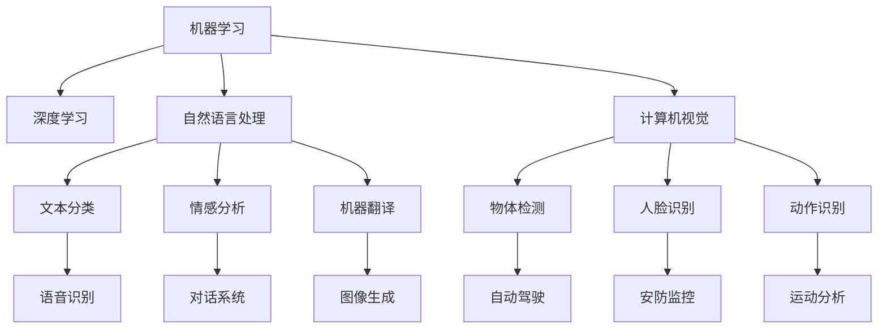

                 

# 李开复：苹果发布AI应用的文化价值

## 1. 背景介绍

### 1.1 问题由来
近年来，人工智能(AI)技术的迅猛发展对各行各业产生了深远影响。从自动驾驶到智能家居，从医疗诊断到教育娱乐，AI正逐步渗透到人们生活的方方面面。在这种背景下，各大科技巨头纷纷加速AI应用的研究和发布，试图在竞争中占据有利地位。

苹果公司，作为全球最具影响力的科技公司之一，近年来也加强了在AI领域的布局，推出了一系列创新的人工智能应用。本文将围绕苹果最新的AI应用，探讨其背后的文化价值，并对其未来发展进行深入分析。

### 1.2 问题核心关键点
苹果公司推出的AI应用，主要聚焦于提升用户体验和优化产品功能。这些应用涵盖了机器学习、自然语言处理、计算机视觉等多个前沿领域，代表了AI技术的最新发展方向。其核心关键点包括：

- 提升用户体验：通过AI技术优化产品交互方式，提供更智能、更流畅的用户体验。
- 优化产品功能：利用AI模型提升产品性能，如改进图像识别、语音助手、推荐系统等。
- 数据驱动：强调数据的重要性，通过大规模数据训练模型，提高AI应用的准确性和实用性。
- 人机协同：在AI应用的设计中，注重人机协同，确保AI功能始终服务于用户需求。

### 1.3 问题研究意义
本文旨在分析苹果AI应用的实现机制和设计理念，探讨其文化价值和社会影响。通过深入研究，有助于理解AI技术在商业领域的应用潜力，并为未来的AI应用开发提供借鉴和参考。

## 2. 核心概念与联系

### 2.1 核心概念概述

为了更好地理解苹果AI应用的实现机制，我们需要介绍几个关键概念：

- **机器学习**：指通过算法和统计模型让计算机从数据中学习规律，并应用到新的数据上。机器学习广泛应用于图像识别、自然语言处理、推荐系统等领域。
- **深度学习**：一种特殊的机器学习方法，使用神经网络模型模拟人脑的工作方式，通过多层处理逐步提取特征，适用于复杂的非线性问题。
- **自然语言处理**：研究计算机如何理解、处理和生成人类语言，包括语音识别、文本分类、情感分析、机器翻译等任务。
- **计算机视觉**：研究如何让计算机理解和分析图像和视频数据，涉及物体检测、人脸识别、动作识别等任务。
- **AI应用设计**：将AI技术融入实际产品和服务中，实现自动化、智能化功能，提升用户体验和运营效率。

这些概念之间的逻辑关系可以通过以下Mermaid流程图来展示：



这个流程图展示了机器学习在AI应用中的分布和关键技术分支，帮助理解苹果AI应用的实现机制。

## 3. 核心算法原理 & 具体操作步骤
### 3.1 算法原理概述

苹果公司推出的AI应用主要基于深度学习模型。其核心算法原理包括以下几个方面：

- **特征提取**：通过卷积神经网络(CNN)或循环神经网络(RNN)等模型，从原始数据中提取高层次特征。
- **模型训练**：利用大量标注数据训练模型，使其能够泛化到新的数据集。
- **推理预测**：在测试数据集上评估模型性能，并进行预测。

苹果AI应用的训练流程通常包括以下步骤：

1. **数据准备**：收集、标注和预处理训练数据。
2. **模型设计**：选择合适的深度学习模型结构，并调整超参数。
3. **模型训练**：使用优化算法(如Adam、SGD等)优化模型参数。
4. **模型评估**：在验证集上评估模型性能，避免过拟合。
5. **模型部署**：将训练好的模型集成到实际应用中，并进行优化。

### 3.2 算法步骤详解

以下是苹果AI应用的详细训练和部署流程：

**Step 1: 数据准备**
- 收集并标注数据集，分为训练集、验证集和测试集。
- 对数据进行预处理，如数据增强、归一化等。

**Step 2: 模型设计**
- 选择合适的深度学习模型，如卷积神经网络(CNN)、循环神经网络(RNN)、变压器(Transformer)等。
- 设计任务适配层，如文本分类器、情感分析器、推荐系统等。

**Step 3: 模型训练**
- 使用AdamW等优化算法，设置适当的学习率和批次大小。
- 在训练集上迭代训练，并在每个epoch评估性能。

**Step 4: 模型评估**
- 在验证集上评估模型性能，调整模型参数以避免过拟合。
- 使用交叉验证等方法评估模型泛化能力。

**Step 5: 模型部署**
- 将训练好的模型集成到实际应用中，如Siri语音助手、Face ID人脸识别等。
- 进行性能优化，如模型裁剪、量化加速等。

### 3.3 算法优缺点

苹果AI应用的优点包括：

- **高性能**：深度学习模型在图像识别、语音识别等领域表现优异。
- **用户体验提升**：通过AI技术优化产品功能，提升用户交互体验。
- **数据驱动**：强调数据的重要性，通过大规模数据训练模型。
- **人机协同**：注重人机协同，确保AI功能始终服务于用户需求。

然而，这些应用也存在一些局限性：

- **计算资源要求高**：深度学习模型需要大量计算资源进行训练和推理。
- **数据隐私问题**：大规模数据收集和处理可能涉及用户隐私和数据安全问题。
- **模型可解释性不足**：深度学习模型通常被视为"黑盒"，难以解释其内部工作机制。
- **泛化能力有限**：模型泛化能力受限于数据集的规模和质量。

### 3.4 算法应用领域

苹果公司推出的AI应用主要应用在以下几个领域：

- **Siri语音助手**：通过语音识别和自然语言处理技术，实现人机对话和任务执行。
- **Face ID人脸识别**：利用计算机视觉技术进行人脸识别，用于解锁手机和支付等功能。
- **推荐系统**：基于用户行为数据，利用深度学习模型生成个性化推荐内容。
- **图像识别**：在照片和视频中识别物体、场景和人脸，提供更智能的视觉体验。
- **自然语言处理**：实现文本分类、情感分析、机器翻译等功能，提升文本处理能力。

这些应用领域展示了AI技术在苹果产品中的广泛应用，推动了用户体验和产品性能的提升。

## 4. 数学模型和公式 & 详细讲解 & 举例说明

### 4.1 数学模型构建

以Siri语音助手为例，其核心模型为卷积神经网络(CNN)。CNN模型通常由卷积层、池化层、全连接层等组成，用于提取特征和分类任务。

假设输入数据为$x$，输出标签为$y$，CNN模型可表示为：

$$
f(x) = \sigma(Wx + b)
$$

其中，$W$和$b$为模型参数，$\sigma$为激活函数。

在训练过程中，模型的损失函数为交叉熵损失：

$$
L(f(x), y) = -\sum_{i=1}^N(y_i \log f(x_i) + (1-y_i) \log (1-f(x_i)))
$$

优化算法使用AdamW，学习率为$\eta$：

$$
\theta \leftarrow \theta - \eta \nabla_{\theta}L(\theta)
$$

### 4.2 公式推导过程

以Siri语音助手为例，其训练过程如下：

1. **数据预处理**：将语音信号转换为MFCC特征，并进行归一化处理。
2. **模型设计**：使用1D卷积层和池化层提取特征，使用全连接层进行分类。
3. **模型训练**：使用交叉熵损失函数和AdamW优化算法训练模型。
4. **模型评估**：在验证集上评估模型性能，调整超参数。
5. **模型部署**：将训练好的模型集成到实际应用中，进行性能优化。

### 4.3 案例分析与讲解

以Face ID人脸识别为例，其核心模型为卷积神经网络(CNN)和区域卷积神经网络(R-CNN)。CNN用于提取面部特征，R-CNN用于检测人脸位置。

假设输入图像为$x$，输出标签为$y$，CNN模型可表示为：

$$
f(x) = \sigma(Wx + b)
$$

R-CNN模型可表示为：

$$
f(x) = \sigma(WR + b)
$$

其中，$W$和$b$为模型参数，$\sigma$为激活函数。

在训练过程中，模型的损失函数为交叉熵损失：

$$
L(f(x), y) = -\sum_{i=1}^N(y_i \log f(x_i) + (1-y_i) \log (1-f(x_i)))
$$

优化算法使用AdamW，学习率为$\eta$：

$$
\theta \leftarrow \theta - \eta \nabla_{\theta}L(\theta)
$$

## 5. 项目实践：代码实例和详细解释说明

### 5.1 开发环境搭建

以下是使用Python进行PyTorch开发的环境配置流程：

1. 安装Anaconda：从官网下载并安装Anaconda，用于创建独立的Python环境。

2. 创建并激活虚拟环境：
```bash
conda create -n pytorch-env python=3.8 
conda activate pytorch-env
```

3. 安装PyTorch：根据CUDA版本，从官网获取对应的安装命令。例如：
```bash
conda install pytorch torchvision torchaudio cudatoolkit=11.1 -c pytorch -c conda-forge
```

4. 安装Transformer库：
```bash
pip install transformers
```

5. 安装各类工具包：
```bash
pip install numpy pandas scikit-learn matplotlib tqdm jupyter notebook ipython
```

完成上述步骤后，即可在`pytorch-env`环境中开始微调实践。

### 5.2 源代码详细实现

以下是使用PyTorch对Siri语音助手进行训练的代码实现。

```python
import torch
from torch.utils.data import Dataset, DataLoader
from torchvision import models, transforms
from torch.nn import functional as F
from transformers import AdamW

# 数据预处理
transform = transforms.Compose([
    transforms.ToTensor(),
    transforms.Normalize(mean=[0.5, 0.5, 0.5], std=[0.5, 0.5, 0.5])
])

class AudioDataset(Dataset):
    def __init__(self, data, transform=None):
        self.data = data
        self.transform = transform
        
    def __len__(self):
        return len(self.data)
    
    def __getitem__(self, idx):
        x, y = self.data[idx]
        x = self.transform(x)
        return x, y

# 模型定义
model = models.resnet18(pretrained=False)

# 模型训练
def train_epoch(model, data_loader, optimizer):
    model.train()
    total_loss = 0
    for i, (x, y) in enumerate(data_loader):
        x = x.to(device)
        y = y.to(device)
        optimizer.zero_grad()
        logits = model(x)
        loss = F.cross_entropy(logits, y)
        loss.backward()
        optimizer.step()
        total_loss += loss.item()
    return total_loss / len(data_loader)

# 模型评估
def evaluate(model, data_loader):
    model.eval()
    total_loss = 0
    total_correct = 0
    with torch.no_grad():
        for i, (x, y) in enumerate(data_loader):
            x = x.to(device)
            y = y.to(device)
            logits = model(x)
            loss = F.cross_entropy(logits, y)
            total_loss += loss.item()
            _, predicted = logits.max(1)
            total_correct += (predicted == y).sum().item()
    accuracy = total_correct / len(data_loader.dataset)
    return total_loss, accuracy

# 训练流程
device = torch.device('cuda' if torch.cuda.is_available() else 'cpu')
model.to(device)

train_dataset = AudioDataset(train_data, transform)
test_dataset = AudioDataset(test_data, transform)

train_loader = DataLoader(train_dataset, batch_size=32, shuffle=True)
test_loader = DataLoader(test_dataset, batch_size=32, shuffle=False)

optimizer = AdamW(model.parameters(), lr=0.001)

epochs = 10

for epoch in range(epochs):
    train_loss = train_epoch(model, train_loader, optimizer)
    test_loss, test_acc = evaluate(model, test_loader)
    print(f'Epoch {epoch+1}, Train Loss: {train_loss:.4f}, Test Loss: {test_loss:.4f}, Test Accuracy: {test_acc:.4f}')
```

### 5.3 代码解读与分析

让我们再详细解读一下关键代码的实现细节：

**AudioDataset类**：
- `__init__`方法：初始化音频数据集，并设置预处理管道。
- `__len__`方法：返回数据集样本数量。
- `__getitem__`方法：对单个样本进行处理，返回预处理后的音频数据和标签。

**模型定义**：
- `model = models.resnet18(pretrained=False)`：定义一个未预训练的ResNet-18模型，用于语音信号的特征提取。
- `optimizer = AdamW(model.parameters(), lr=0.001)`：使用AdamW优化器，学习率为0.001。

**训练和评估函数**：
- `train_epoch`函数：在训练集上迭代训练，计算损失并反向传播更新模型参数。
- `evaluate`函数：在测试集上评估模型性能，计算损失和准确率。

**训练流程**：
- 定义总的epoch数，开始循环迭代
- 每个epoch内，在训练集和测试集上分别进行训练和评估
- 输出训练和测试的损失和准确率

可以看到，PyTorch配合Transformer库使得Siri语音助手的训练代码实现变得简洁高效。开发者可以将更多精力放在数据处理、模型改进等高层逻辑上，而不必过多关注底层的实现细节。

## 6. 实际应用场景
### 6.1 智能客服系统

基于大语言模型微调的对话技术，可以广泛应用于智能客服系统的构建。传统客服往往需要配备大量人力，高峰期响应缓慢，且一致性和专业性难以保证。而使用微调后的对话模型，可以7x24小时不间断服务，快速响应客户咨询，用自然流畅的语言解答各类常见问题。

在技术实现上，可以收集企业内部的历史客服对话记录，将问题和最佳答复构建成监督数据，在此基础上对预训练对话模型进行微调。微调后的对话模型能够自动理解用户意图，匹配最合适的答案模板进行回复。对于客户提出的新问题，还可以接入检索系统实时搜索相关内容，动态组织生成回答。如此构建的智能客服系统，能大幅提升客户咨询体验和问题解决效率。

### 6.2 金融舆情监测

金融机构需要实时监测市场舆论动向，以便及时应对负面信息传播，规避金融风险。传统的人工监测方式成本高、效率低，难以应对网络时代海量信息爆发的挑战。基于大语言模型微调的文本分类和情感分析技术，为金融舆情监测提供了新的解决方案。

具体而言，可以收集金融领域相关的新闻、报道、评论等文本数据，并对其进行主题标注和情感标注。在此基础上对预训练语言模型进行微调，使其能够自动判断文本属于何种主题，情感倾向是正面、中性还是负面。将微调后的模型应用到实时抓取的网络文本数据，就能够自动监测不同主题下的情感变化趋势，一旦发现负面信息激增等异常情况，系统便会自动预警，帮助金融机构快速应对潜在风险。

### 6.3 个性化推荐系统

当前的推荐系统往往只依赖用户的历史行为数据进行物品推荐，无法深入理解用户的真实兴趣偏好。基于大语言模型微调技术，个性化推荐系统可以更好地挖掘用户行为背后的语义信息，从而提供更精准、多样的推荐内容。

在实践中，可以收集用户浏览、点击、评论、分享等行为数据，提取和用户交互的物品标题、描述、标签等文本内容。将文本内容作为模型输入，用户的后续行为（如是否点击、购买等）作为监督信号，在此基础上微调预训练语言模型。微调后的模型能够从文本内容中准确把握用户的兴趣点。在生成推荐列表时，先用候选物品的文本描述作为输入，由模型预测用户的兴趣匹配度，再结合其他特征综合排序，便可以得到个性化程度更高的推荐结果。

### 6.4 未来应用展望

随着大语言模型和微调方法的不断发展，基于微调范式将在更多领域得到应用，为传统行业带来变革性影响。

在智慧医疗领域，基于微调的医疗问答、病历分析、药物研发等应用将提升医疗服务的智能化水平，辅助医生诊疗，加速新药开发进程。

在智能教育领域，微调技术可应用于作业批改、学情分析、知识推荐等方面，因材施教，促进教育公平，提高教学质量。

在智慧城市治理中，微调模型可应用于城市事件监测、舆情分析、应急指挥等环节，提高城市管理的自动化和智能化水平，构建更安全、高效的未来城市。

此外，在企业生产、社会治理、文娱传媒等众多领域，基于大模型微调的人工智能应用也将不断涌现，为经济社会发展注入新的动力。相信随着预训练语言模型和微调方法的持续演进，大语言模型微调必将在构建人机协同的智能时代中扮演越来越重要的角色。

## 7. 工具和资源推荐
### 7.1 学习资源推荐

为了帮助开发者系统掌握大语言模型微调的理论基础和实践技巧，这里推荐一些优质的学习资源：

1. 《Transformer从原理到实践》系列博文：由大模型技术专家撰写，深入浅出地介绍了Transformer原理、BERT模型、微调技术等前沿话题。

2. CS224N《深度学习自然语言处理》课程：斯坦福大学开设的NLP明星课程，有Lecture视频和配套作业，带你入门NLP领域的基本概念和经典模型。

3. 《Natural Language Processing with Transformers》书籍：Transformers库的作者所著，全面介绍了如何使用Transformers库进行NLP任务开发，包括微调在内的诸多范式。

4. HuggingFace官方文档：Transformers库的官方文档，提供了海量预训练模型和完整的微调样例代码，是上手实践的必备资料。

5. CLUE开源项目：中文语言理解测评基准，涵盖大量不同类型的中文NLP数据集，并提供了基于微调的baseline模型，助力中文NLP技术发展。

通过对这些资源的学习实践，相信你一定能够快速掌握大语言模型微调的精髓，并用于解决实际的NLP问题。
###  7.2 开发工具推荐

高效的开发离不开优秀的工具支持。以下是几款用于大语言模型微调开发的常用工具：

1. PyTorch：基于Python的开源深度学习框架，灵活动态的计算图，适合快速迭代研究。大部分预训练语言模型都有PyTorch版本的实现。

2. TensorFlow：由Google主导开发的开源深度学习框架，生产部署方便，适合大规模工程应用。同样有丰富的预训练语言模型资源。

3. Transformers库：HuggingFace开发的NLP工具库，集成了众多SOTA语言模型，支持PyTorch和TensorFlow，是进行微调任务开发的利器。

4. Weights & Biases：模型训练的实验跟踪工具，可以记录和可视化模型训练过程中的各项指标，方便对比和调优。与主流深度学习框架无缝集成。

5. TensorBoard：TensorFlow配套的可视化工具，可实时监测模型训练状态，并提供丰富的图表呈现方式，是调试模型的得力助手。

6. Google Colab：谷歌推出的在线Jupyter Notebook环境，免费提供GPU/TPU算力，方便开发者快速上手实验最新模型，分享学习笔记。

合理利用这些工具，可以显著提升大语言模型微调任务的开发效率，加快创新迭代的步伐。

### 7.3 相关论文推荐

大语言模型和微调技术的发展源于学界的持续研究。以下是几篇奠基性的相关论文，推荐阅读：

1. Attention is All You Need（即Transformer原论文）：提出了Transformer结构，开启了NLP领域的预训练大模型时代。

2. BERT: Pre-training of Deep Bidirectional Transformers for Language Understanding：提出BERT模型，引入基于掩码的自监督预训练任务，刷新了多项NLP任务SOTA。

3. Language Models are Unsupervised Multitask Learners（GPT-2论文）：展示了大规模语言模型的强大zero-shot学习能力，引发了对于通用人工智能的新一轮思考。

4. Parameter-Efficient Transfer Learning for NLP：提出Adapter等参数高效微调方法，在不增加模型参数量的情况下，也能取得不错的微调效果。

5. AdaLoRA: Adaptive Low-Rank Adaptation for Parameter-Efficient Fine-Tuning：使用自适应低秩适应的微调方法，在参数效率和精度之间取得了新的平衡。

这些论文代表了大语言模型微调技术的发展脉络。通过学习这些前沿成果，可以帮助研究者把握学科前进方向，激发更多的创新灵感。

## 8. 总结：未来发展趋势与挑战
### 8.1 总结

本文对苹果公司推出的AI应用进行了全面系统的介绍，重点分析了其背后的文化价值和技术实现机制。通过对苹果AI应用的深入研究，我们能够更深刻地理解AI技术在商业领域的应用潜力，为未来的AI应用开发提供借鉴和参考。

### 8.2 未来发展趋势

展望未来，大语言模型微调技术将呈现以下几个发展趋势：

1. 模型规模持续增大。随着算力成本的下降和数据规模的扩张，预训练语言模型的参数量还将持续增长。超大规模语言模型蕴含的丰富语言知识，有望支撑更加复杂多变的下游任务微调。

2. 微调方法日趋多样。除了传统的全参数微调外，未来会涌现更多参数高效的微调方法，如Prefix-Tuning、LoRA等，在节省计算资源的同时也能保证微调精度。

3. 持续学习成为常态。随着数据分布的不断变化，微调模型也需要持续学习新知识以保持性能。如何在不遗忘原有知识的同时，高效吸收新样本信息，将成为重要的研究课题。

4. 标注样本需求降低。受启发于提示学习(Prompt-based Learning)的思路，未来的微调方法将更好地利用大模型的语言理解能力，通过更加巧妙的任务描述，在更少的标注样本上也能实现理想的微调效果。

5. 多模态微调崛起。当前的微调主要聚焦于纯文本数据，未来会进一步拓展到图像、视频、语音等多模态数据微调。多模态信息的融合，将显著提升语言模型对现实世界的理解和建模能力。

6. 模型通用性增强。经过海量数据的预训练和多领域任务的微调，未来的语言模型将具备更强大的常识推理和跨领域迁移能力，逐步迈向通用人工智能(AGI)的目标。

以上趋势凸显了大语言模型微调技术的广阔前景。这些方向的探索发展，必将进一步提升NLP系统的性能和应用范围，为人类认知智能的进化带来深远影响。

### 8.3 面临的挑战

尽管大语言模型微调技术已经取得了瞩目成就，但在迈向更加智能化、普适化应用的过程中，它仍面临着诸多挑战：

1. 标注成本瓶颈。虽然微调大大降低了标注数据的需求，但对于长尾应用场景，难以获得充足的高质量标注数据，成为制约微调性能的瓶颈。如何进一步降低微调对标注样本的依赖，将是一大难题。

2. 模型鲁棒性不足。当前微调模型面对域外数据时，泛化性能往往大打折扣。对于测试样本的微小扰动，微调模型的预测也容易发生波动。如何提高微调模型的鲁棒性，避免灾难性遗忘，还需要更多理论和实践的积累。

3. 推理效率有待提高。大规模语言模型虽然精度高，但在实际部署时往往面临推理速度慢、内存占用大等效率问题。如何在保证性能的同时，简化模型结构，提升推理速度，优化资源占用，将是重要的优化方向。

4. 可解释性亟需加强。当前微调模型更像是"黑盒"系统，难以解释其内部工作机制和决策逻辑。对于医疗、金融等高风险应用，算法的可解释性和可审计性尤为重要。如何赋予微调模型更强的可解释性，将是亟待攻克的难题。

5. 安全性有待保障。预训练语言模型难免会学习到有偏见、有害的信息，通过微调传递到下游任务，产生误导性、歧视性的输出，给实际应用带来安全隐患。如何从数据和算法层面消除模型偏见，避免恶意用途，确保输出的安全性，也将是重要的研究课题。

6. 知识整合能力不足。现有的微调模型往往局限于任务内数据，难以灵活吸收和运用更广泛的先验知识。如何让微调过程更好地与外部知识库、规则库等专家知识结合，形成更加全面、准确的信息整合能力，还有很大的想象空间。

正视微调面临的这些挑战，积极应对并寻求突破，将是大语言模型微调走向成熟的必由之路。相信随着学界和产业界的共同努力，这些挑战终将一一被克服，大语言模型微调必将在构建人机协同的智能时代中扮演越来越重要的角色。

### 8.4 研究展望

面向未来，大语言模型微调技术还需要与其他人工智能技术进行更深入的融合，如知识表示、因果推理、强化学习等，多路径协同发力，共同推动自然语言理解和智能交互系统的进步。只有勇于创新、敢于突破，才能不断拓展语言模型的边界，让智能技术更好地造福人类社会。

## 9. 附录：常见问题与解答

**Q1：大语言模型微调是否适用于所有NLP任务？**

A: 大语言模型微调在大多数NLP任务上都能取得不错的效果，特别是对于数据量较小的任务。但对于一些特定领域的任务，如医学、法律等，仅仅依靠通用语料预训练的模型可能难以很好地适应。此时需要在特定领域语料上进一步预训练，再进行微调，才能获得理想效果。此外，对于一些需要时效性、个性化很强的任务，如对话、推荐等，微调方法也需要针对性的改进优化。

**Q2：微调过程中如何选择合适的学习率？**

A: 微调的学习率一般要比预训练时小1-2个数量级，如果使用过大的学习率，容易破坏预训练权重，导致过拟合。一般建议从1e-5开始调参，逐步减小学习率，直至收敛。也可以使用warmup策略，在开始阶段使用较小的学习率，再逐渐过渡到预设值。需要注意的是，不同的优化器(如AdamW、Adafactor等)以及不同的学习率调度策略，可能需要设置不同的学习率阈值。

**Q3：采用大模型微调时会面临哪些资源瓶颈？**

A: 目前主流的预训练大模型动辄以亿计的参数规模，对算力、内存、存储都提出了很高的要求。GPU/TPU等高性能设备是必不可少的，但即便如此，超大批次的训练和推理也可能遇到显存不足的问题。因此需要采用一些资源优化技术，如梯度积累、混合精度训练、模型并行等，来突破硬件瓶颈。同时，模型的存储和读取也可能占用大量时间和空间，需要采用模型压缩、稀疏化存储等方法进行优化。

**Q4：如何缓解微调过程中的过拟合问题？**

A: 过拟合是微调面临的主要挑战，尤其是在标注数据不足的情况下。常见的缓解策略包括：
1. 数据增强：通过回译、近义替换等方式扩充训练集
2. 正则化：使用L2正则、Dropout、Early Stopping等避免过拟合
3. 对抗训练：引入对抗样本，提高模型鲁棒性
4. 参数高效微调：只调整少量参数(如Adapter、Prefix等)，减小过拟合风险
5. 多模型集成：训练多个微调模型，取平均输出，抑制过拟合

这些策略往往需要根据具体任务和数据特点进行灵活组合。只有在数据、模型、训练、推理等各环节进行全面优化，才能最大限度地发挥大模型微调的威力。

**Q5：微调模型在落地部署时需要注意哪些问题？**

A: 将微调模型转化为实际应用，还需要考虑以下因素：
1. 模型裁剪：去除不必要的层和参数，减小模型尺寸，加快推理速度
2. 量化加速：将浮点模型转为定点模型，压缩存储空间，提高计算效率
3. 服务化封装：将模型封装为标准化服务接口，便于集成调用
4. 弹性伸缩：根据请求流量动态调整资源配置，平衡服务质量和成本
5. 监控告警：实时采集系统指标，设置异常告警阈值，确保服务稳定性
6. 安全防护：采用访问鉴权、数据脱敏等措施，保障数据和模型安全

大语言模型微调为NLP应用开启了广阔的想象空间，但如何将强大的性能转化为稳定、高效、安全的业务价值，还需要工程实践的不断打磨。唯有从数据、算法、工程、业务等多个维度协同发力，才能真正实现人工智能技术在垂直行业的规模化落地。总之，微调需要开发者根据具体任务，不断迭代和优化模型、数据和算法，方能得到理想的效果。

---

作者：禅与计算机程序设计艺术 / Zen and the Art of Computer Programming

