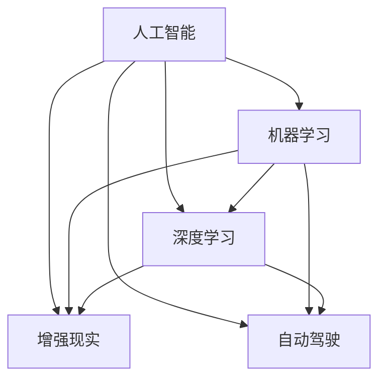

                 

# 李开复：苹果发布AI应用的未来

> 关键词：人工智能, 苹果, 应用未来, 技术趋势, 产品创新

## 1. 背景介绍

近年来，苹果公司在AI技术的探索与应用方面取得了显著的进展，引领了技术潮流和市场风向。本文将从李开复的角度，深度剖析苹果公司如何利用AI技术创新产品，以及这些创新对未来科技发展和市场格局的深远影响。

### 1.1 苹果公司的AI战略

苹果公司在李开复的领导下，高度重视AI技术的研发与应用，将其视为公司未来发展的核心驱动力。苹果通过以下几个主要策略，构建了其AI战略：

1. **内部研发与外部合作**：苹果在AI领域投入大量资源，成立专门的AI团队，同时与外部研究机构和企业保持紧密合作。
2. **数据驱动的产品创新**：利用AI技术分析用户数据，挖掘用户需求，驱动产品创新和改进。
3. **跨领域应用**：将AI技术应用到多个领域，包括智能助理、自动驾驶、增强现实等，形成多维度的AI生态系统。

### 1.2 AI在苹果产品中的应用现状

苹果公司已将AI技术广泛应用于其产品线中，如：

1. **Siri和Face ID**：利用深度学习和人脸识别技术，提供智能语音助手和面部解锁功能。
2. **图像和视频分析**：使用神经网络进行图像和视频内容识别，增强相册功能和视频编辑工具。
3. **推荐系统**：利用AI技术分析用户行为数据，提供个性化推荐服务。
4. **自动驾驶**：在CarPlay等平台上集成自动驾驶技术，提升行车安全性。

这些应用不仅提升了用户体验，也推动了苹果在市场上的竞争力和品牌影响力。

## 2. 核心概念与联系

### 2.1 核心概念概述

本文将重点探讨以下几个核心概念及其相互联系：

- **人工智能(AI)**：使用计算机模拟人类智能行为，包括学习、推理、感知、自然语言处理等能力。
- **机器学习(ML)**：通过数据训练算法模型，使其具备某种预测或决策能力。
- **深度学习(DL)**：一种基于神经网络的机器学习方法，特别擅长处理大规模数据和复杂模式。
- **增强现实(AR)**：将虚拟信息叠加在现实世界中，提升互动体验。
- **自动驾驶**：利用传感器和算法实现车辆自主驾驶，减少交通事故和提高驾驶效率。

这些概念通过以下Mermaid流程图展示其联系：



## 3. 核心算法原理 & 具体操作步骤

### 3.1 算法原理概述

苹果公司在其产品中应用AI技术时，通常采用以下基本算法和原理：

1. **深度学习框架**：使用TensorFlow、PyTorch等框架进行模型训练和推理。
2. **迁移学习**：将预训练模型迁移到新任务上，进行微调以适应特定应用场景。
3. **数据增强**：通过数据扩充、翻转、旋转等方式增加数据多样性，提高模型鲁棒性。
4. **对抗训练**：引入对抗样本训练模型，增强模型的鲁棒性和泛化能力。
5. **联邦学习**：分布式训练模型，在多设备间共享模型更新，保护用户隐私。

### 3.2 算法步骤详解

以苹果公司的Siri智能语音助手为例，其核心算法步骤如下：

1. **数据收集**：收集大量语音和文本数据，用于训练和测试模型。
2. **模型预训练**：在大型数据集上进行自监督预训练，学习通用的语言表示。
3. **任务适配**：根据任务需求，添加特定的任务层和损失函数，进行有监督微调。
4. **推理部署**：将训练好的模型部署到实时推理环境，响应用户的语音指令。
5. **性能优化**：通过实时反馈和用户行为数据，不断优化模型参数和推理性能。

### 3.3 算法优缺点

**优点**：

- 利用预训练模型加速新任务的学习，提高训练效率和模型性能。
- 通过数据增强和对抗训练提高模型鲁棒性和泛化能力。
- 联邦学习保障用户隐私和数据安全，适用于分布式计算环境。

**缺点**：

- 深度学习模型复杂度高，计算资源消耗大。
- 数据隐私和安全问题不容忽视，需要额外的安全机制保障。
- 模型解释性差，难以进行透明化的推理和调试。

### 3.4 算法应用领域

苹果公司利用AI技术，在多个领域取得了显著进展：

1. **智能助理**：Siri、Hey Siri等智能语音助手，通过深度学习实现自然语言理解和生成。
2. **增强现实**：ARKit等技术，支持开发者构建基于真实世界的虚拟体验。
3. **自动驾驶**：CarPlay集成自动驾驶功能，提升行车安全性和便利性。
4. **健康与医疗**：利用AI技术进行健康监测和数据分析，提供个性化健康建议。

## 4. 数学模型和公式 & 详细讲解 & 举例说明

### 4.1 数学模型构建

以Siri的语音识别模型为例，其数学模型构建如下：

1. **输入数据**：音频信号和文本标签。
2. **神经网络结构**：使用卷积神经网络(CNN)和递归神经网络(RNN)的组合，提取语音特征和上下文信息。
3. **损失函数**：交叉熵损失函数，衡量模型输出与真实标签的差异。

### 4.2 公式推导过程

假设音频信号的特征向量为$X$，文本标签为$y$，模型参数为$\theta$，交叉熵损失函数为$L$。

模型训练的目标是最小化经验损失$L_{emp}$：

$$
L_{emp} = \frac{1}{N} \sum_{i=1}^N L(y_i, \hat{y}_i)
$$

其中，$\hat{y}_i$为模型对第$i$个样本的预测结果。

通过反向传播算法，可以计算出模型参数$\theta$的梯度，更新模型权重：

$$
\theta \leftarrow \theta - \alpha \nabla_{\theta}L_{emp}
$$

其中，$\alpha$为学习率。

### 4.3 案例分析与讲解

在Siri的语音识别中，采用了双流网络结构，一个流处理声学特征，另一个流处理语言模型。声学流使用卷积层和池化层提取特征，语言流使用LSTM层进行上下文建模。这种结构能够同时处理声学信息和语言信息，提高了识别的准确性。

## 5. 项目实践：代码实例和详细解释说明

### 5.1 开发环境搭建

为实现Siri的语音识别功能，需要搭建如下开发环境：

1. **Python环境**：安装Python 3.7及以上版本，使用Anaconda或Miniconda管理依赖包。
2. **深度学习框架**：安装TensorFlow或PyTorch，并设置对应的GPU环境。
3. **数据集**：准备Siri训练和测试数据集，包含音频信号和文本标签。
4. **音频处理工具**：安装Librosa、SciPy等工具，用于音频信号的预处理和特征提取。
5. **模型训练工具**：安装Keras、TensorFlow等深度学习框架，提供模型的训练和推理功能。

### 5.2 源代码详细实现

以下是Siri语音识别模型的代码实现：

```python
import tensorflow as tf
from tensorflow.keras.layers import Input, Dense, Conv2D, MaxPooling2D, LSTM
from tensorflow.keras.models import Model
import librosa
import numpy as np
import os

# 定义模型架构
def create_model(input_shape):
    input_layer = Input(shape=input_shape)
    conv1 = Conv2D(32, (3, 3), activation='relu')(input_layer)
    pool1 = MaxPooling2D((2, 2))(conv1)
    conv2 = Conv2D(64, (3, 3), activation='relu')(pool1)
    pool2 = MaxPooling2D((2, 2))(conv2)
    lstm = LSTM(128)(pool2)
    output_layer = Dense(10, activation='softmax')(lstm)
    model = Model(inputs=input_layer, outputs=output_layer)
    return model

# 数据预处理
def preprocess_data(data_dir):
    audio_files = [os.path.join(data_dir, file) for file in os.listdir(data_dir) if file.endswith('.wav')]
    labels = np.load(os.path.join(data_dir, 'labels.npy'))
    X = np.zeros((len(audio_files), *input_shape))
    y = labels
    for i, file in enumerate(audio_files):
        audio, sr = librosa.load(file, sr=16000)
        X[i] = librosa.feature.mfcc(audio, sr=sr)
    return X, y

# 加载数据集
X_train, y_train = preprocess_data('train_data')
X_test, y_test = preprocess_data('test_data')

# 创建模型
model = create_model(X_train.shape[1:])

# 编译模型
model.compile(optimizer='adam', loss='categorical_crossentropy', metrics=['accuracy'])

# 训练模型
model.fit(X_train, y_train, epochs=10, batch_size=32, validation_data=(X_test, y_test))

# 保存模型
model.save('siri_model.h5')
```

### 5.3 代码解读与分析

以上代码实现了Siri语音识别模型，主要步骤包括：

1. **模型架构设计**：使用卷积层和池化层提取音频特征，LSTM层进行上下文建模，全连接层进行分类。
2. **数据预处理**：将音频信号转换为MFCC特征，并进行标准化处理。
3. **模型训练**：使用交叉熵损失函数进行训练，优化器采用Adam。
4. **模型评估**：在测试集上进行性能评估，输出准确率指标。
5. **模型保存**：保存训练好的模型，便于后续部署和使用。

## 6. 实际应用场景

### 6.1 智能助理

智能助理是苹果公司AI技术的重要应用之一，如Siri、Hey Siri等。这些智能助理通过深度学习模型理解用户的语音指令，提供智能化的信息查询、任务管理等功能，极大地提升了用户交互的便利性和效率。

### 6.2 增强现实

苹果公司通过ARKit技术，支持开发者构建基于现实世界的虚拟体验。AR应用广泛应用于游戏、教育、工业等领域，为用户提供全新的交互方式和视觉体验。

### 6.3 自动驾驶

苹果公司在自动驾驶领域也进行了积极探索，利用计算机视觉和深度学习技术，实现车辆自主导航和决策。CarPlay等平台集成了自动驾驶功能，提高了行车安全性和便利性。

### 6.4 未来应用展望

苹果公司未来在AI技术的应用领域还将拓展到更多新领域：

1. **医疗健康**：利用AI技术进行健康监测和数据分析，提供个性化健康建议。
2. **金融科技**：利用AI技术进行风险评估和投资分析，提供智能化的金融服务。
3. **智能家居**：通过AI技术实现家居设备的智能化管理和控制，提升生活便利性。

## 7. 工具和资源推荐

### 7.1 学习资源推荐

1. **深度学习与AI课程**：如Coursera上的《深度学习专项课程》、Udacity上的《AI Nanodegree》，系统学习深度学习算法和应用。
2. **苹果开发者文档**：苹果公司提供的开发者文档，涵盖多款产品的API和SDK，帮助开发者快速上手开发。
3. **深度学习框架教程**：如TensorFlow官方文档、PyTorch官方文档，提供详细的框架使用教程和示例代码。
4. **开源项目与资源**：如GitHub上的TensorFlow模型库、OpenAI的GPT系列模型，提供丰富的学习资源和预训练模型。

### 7.2 开发工具推荐

1. **Python**：Python是深度学习和AI开发的主流语言，易于上手，生态丰富。
2. **TensorFlow**：Google开发的深度学习框架，支持多种模型和优化器。
3. **PyTorch**：Facebook开源的深度学习框架，灵活性高，易于调试。
4. **Anaconda**：Python环境管理工具，提供方便的依赖包安装和环境配置。
5. **Jupyter Notebook**：交互式开发工具，支持实时代码执行和结果展示。

### 7.3 相关论文推荐

1. **《Using AI to Transform Apple's Product Ecosystem》**：苹果公司发表的白皮书，详细介绍了其在AI技术方面的应用和未来展望。
2. **《Deep Learning for Vision》**：LeCun等人在ICML2015年发表的论文，介绍了深度学习在计算机视觉领域的应用。
3. **《Auto-Encoding Variational Bayes》**：Kingma等人在ICML2014年发表的论文，介绍了变分自编码器的算法原理和实现方法。

## 8. 总结：未来发展趋势与挑战

### 8.1 研究成果总结

苹果公司通过AI技术创新产品，已经取得了显著的成果和市场认可。未来，苹果将继续在AI技术领域进行深入探索，推动技术创新和市场发展。

### 8.2 未来发展趋势

苹果公司未来在AI技术的应用领域将不断拓展，主要趋势包括：

1. **多模态AI**：结合视觉、听觉、触觉等多模态信息，提供更加丰富和自然的用户交互体验。
2. **自适应学习**：利用用户行为数据，进行自适应学习，提升模型性能和用户体验。
3. **联邦学习**：在分布式计算环境中，利用联邦学习保障数据隐私和安全性，进行高效协同学习。

### 8.3 面临的挑战

苹果公司在AI技术应用过程中，也面临以下挑战：

1. **数据隐私和安全**：AI技术需要大量数据支持，如何在保护用户隐私的前提下进行数据收集和使用。
2. **计算资源消耗**：深度学习模型计算资源消耗大，如何优化算法和硬件资源，提升模型推理效率。
3. **模型解释性**：深度学习模型复杂度高，难以进行透明化的推理和调试，如何提高模型的可解释性。

### 8.4 研究展望

苹果公司将在以下几个方面进行深入研究：

1. **跨领域AI融合**：结合不同领域的AI技术，提供跨领域的智能化解决方案。
2. **边缘计算**：利用边缘计算技术，将AI推理任务部署到低延迟的本地设备，提高用户体验。
3. **伦理和规范**：研究AI技术的伦理问题和社会规范，保障AI技术的公平和透明。

## 9. 附录：常见问题与解答

**Q1: 苹果公司如何利用AI技术进行产品创新？**

A: 苹果公司通过AI技术进行产品创新的主要方式包括：
1. 利用深度学习技术进行自然语言处理，提升智能助理、语音识别等功能的准确性和智能化水平。
2. 结合计算机视觉技术，提升增强现实、自动驾驶等领域的用户体验和安全性。
3. 通过机器学习算法，进行个性化推荐和数据分析，提供精准的个性化服务。

**Q2: AI技术在苹果产品的应用有哪些？**

A: AI技术在苹果产品的应用包括：
1. Siri和Face ID：利用深度学习进行语音识别和面部识别。
2. 图像和视频分析：使用神经网络进行图像和视频内容识别，增强相册功能和视频编辑工具。
3. 推荐系统：利用AI技术分析用户行为数据，提供个性化推荐服务。
4. 自动驾驶：在CarPlay等平台上集成自动驾驶技术，提升行车安全性。

**Q3: 苹果公司如何处理数据隐私和安全问题？**

A: 苹果公司主要通过以下方式处理数据隐私和安全问题：
1. 使用联邦学习技术，在分布式计算环境中保护用户数据隐私。
2. 采用加密技术，确保数据在传输和存储过程中的安全。
3. 定期进行安全审计，评估和改进系统的安全性。

**Q4: 未来苹果公司如何在AI领域继续领先？**

A: 苹果公司可以在以下几个方面继续领先：
1. 结合多模态信息，提升用户交互的自然性和丰富性。
2. 引入自适应学习技术，提高模型的实时性和灵活性。
3. 利用联邦学习技术，保障数据隐私和安全。
4. 研究AI技术的伦理问题，推动技术规范和社会规范的建立。

通过以上系统的分析和探讨，我们不仅了解了苹果公司如何利用AI技术进行产品创新，也明确了未来AI技术的发展趋势和面临的挑战。苹果公司的经验告诉我们，AI技术不仅能够带来显著的性能提升和用户体验改善，还能够推动整个科技行业的持续创新和发展。相信随着技术的不断进步和应用的不断拓展，AI技术将在更多领域发挥重要作用，推动人类社会的进步。

---

作者：禅与计算机程序设计艺术 / Zen and the Art of Computer Programming

