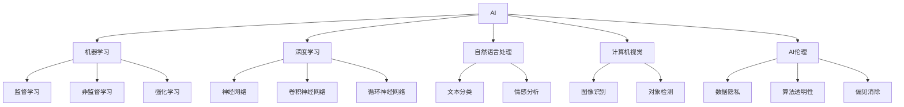

                 

## 1. 背景介绍

### 1.1 背景概述

李开复，作为人工智能领域的先驱之一，不仅在学术界享有盛誉，同时也是知名科技公司的重要领导者，对产业界产生了深远影响。在科技行业日新月异的今天，AI技术已经深入到各行各业，对企业战略、产品开发、用户体验等方面产生了重大影响。李开复对此进行了深入思考，并预测了未来AI技术的发展方向，尤其是苹果公司如何利用AI技术推动未来应用的发展。

### 1.2 研究目的

本文旨在探讨李开复关于苹果公司未来AI应用发展的看法，分析其在AI领域的影响力，并结合当前AI技术的最新进展，预测未来AI应用的趋势和挑战。

## 2. 核心概念与联系

### 2.1 核心概念

**人工智能（Artificial Intelligence, AI）**：指通过计算机算法和数据处理，使机器能够模拟人类智能活动的技术。包括机器学习、深度学习、自然语言处理、计算机视觉等子领域。

**机器学习（Machine Learning, ML）**：一种通过数据训练模型，使其具备预测或决策能力的AI技术。机器学习模型包括监督学习、非监督学习和强化学习等。

**深度学习（Deep Learning, DL）**：机器学习的一个分支，通过多层神经网络实现对复杂数据的学习。深度学习在图像识别、语音识别、自然语言处理等领域取得了巨大成功。

**自然语言处理（Natural Language Processing, NLP）**：使计算机能够理解、分析和生成人类语言的技术。包括文本分类、情感分析、机器翻译等任务。

**计算机视觉（Computer Vision, CV）**：使计算机能够理解和分析图像、视频中的视觉信息的技术。包括图像识别、对象检测、场景理解等。

**AI伦理（AI Ethics）**：指在AI应用过程中需要考虑的道德、法律、社会问题。包括数据隐私、算法透明性、偏见消除等。

### 2.2 核心概念联系

AI技术的应用涉及多个领域，通过机器学习和深度学习技术，对大量数据进行分析和处理，从而实现智能决策和分析。自然语言处理和计算机视觉则是AI技术在NLP和CV领域的具体应用。而AI伦理问题则是随着AI技术发展带来的新兴社会挑战。这些核心概念共同构成了AI技术的全貌，且相互之间有紧密的联系。

以下Mermaid流程图展示了AI技术在多个领域的应用和联系：



## 3. 核心算法原理 & 具体操作步骤

### 3.1 算法原理概述

AI技术在各个领域的应用，通常通过以下步骤实现：

1. **数据收集**：从不同来源获取数据，构建训练集。
2. **数据预处理**：清洗数据，标准化处理，转化为适合模型输入的格式。
3. **模型训练**：使用训练集训练机器学习或深度学习模型，优化模型参数。
4. **模型评估**：使用验证集评估模型性能，调整模型参数。
5. **模型部署**：将训练好的模型部署到实际应用中，进行预测或决策。

在AI应用中，数据的质量和量对模型的性能有重要影响，数据越多、质量越高，模型性能越好。此外，模型的优化和调参也是一个关键步骤，不同的优化算法和超参数设置会对模型性能产生显著影响。

### 3.2 算法步骤详解

以自然语言处理中的文本分类为例，详细操作步骤如下：

**Step 1: 数据收集**

收集包含不同类别的文本数据，并对其进行标注，构建训练集和验证集。

**Step 2: 数据预处理**

对文本进行清洗，去除停用词、标点符号等，进行分词、词性标注等预处理操作。

**Step 3: 特征提取**

将预处理后的文本转化为模型可以处理的数值特征，如词袋模型、TF-IDF等。

**Step 4: 模型训练**

选择适当的模型，如朴素贝叶斯、支持向量机、深度学习模型等，并使用训练集进行训练。

**Step 5: 模型评估**

使用验证集评估模型性能，如准确率、召回率、F1分数等指标。

**Step 6: 模型部署**

将训练好的模型部署到实际应用中，对新的文本进行分类预测。

### 3.3 算法优缺点

**优点**：

- **高效性**：机器学习模型可以快速处理大量数据，实现高效决策。
- **自动化**：模型训练过程高度自动化，减少了人工干预。
- **适应性强**：模型能够适应不同领域和任务，具有较强的泛化能力。

**缺点**：

- **数据依赖**：模型的性能依赖于数据质量，数据不足或噪声过多会导致模型性能下降。
- **解释性差**：复杂的深度学习模型难以解释其内部工作机制。
- **计算资源消耗大**：训练深度学习模型需要大量的计算资源和存储空间。

### 3.4 算法应用领域

AI技术在医疗、金融、教育、零售等多个领域都有广泛应用。例如，在医疗领域，AI用于疾病诊断、个性化治疗、药品研发等；在金融领域，AI用于风险评估、信用评分、欺诈检测等；在教育领域，AI用于个性化推荐、智能辅导、学习评估等。

## 4. 数学模型和公式 & 详细讲解 & 举例说明

### 4.1 数学模型构建

以逻辑回归模型为例，构建如下数学模型：

$$
P(y=1|x;\theta) = \sigma(\theta_0 + \theta_1 x_1 + \theta_2 x_2)
$$

其中，$\theta = (\theta_0, \theta_1, \theta_2)^T$ 为模型参数，$x = (x_1, x_2)^T$ 为特征向量，$\sigma(z) = \frac{1}{1+e^{-z}}$ 为Sigmoid函数，$y=1$ 表示正类，$y=0$ 表示负类。

### 4.2 公式推导过程

对上述逻辑回归模型进行极大似然估计，目标是最小化交叉熵损失函数：

$$
L(y,\hat{y}) = -\sum_{i=1}^N[y_i\log \hat{y}_i + (1-y_i)\log(1-\hat{y}_i)]
$$

其中，$N$ 为训练样本数，$y$ 为真实标签，$\hat{y}$ 为模型预测的概率。

使用梯度下降法求解模型参数，得到：

$$
\theta^{(t+1)} = \theta^{(t)} - \eta \nabla L(y,\hat{y})
$$

其中，$\eta$ 为学习率，$\nabla L(y,\hat{y})$ 为损失函数对模型参数的梯度。

### 4.3 案例分析与讲解

以文本分类为例，使用朴素贝叶斯模型进行训练和预测。假设训练集为：

$$
\begin{aligned}
& D = \{(x_1, y_1), (x_2, y_2), \cdots, (x_N, y_N)\} \\
& x_i = (w_{i1}, w_{i2}, \cdots, w_{in}) \\
& y_i \in \{1, 0\}
\end{aligned}
$$

其中，$x_i$ 为文本特征，$y_i$ 为文本类别。

使用极大似然估计计算模型参数：

$$
\theta = \frac{1}{N}\sum_{i=1}^N [y_i w_i + (1-y_i) w_i]
$$

预测新文本$x_{new}$的类别：

$$
\hat{y}_{new} = \frac{P(x_{new}; \theta)}{\sum_j P(x_{new}; \theta)}
$$

## 5. 项目实践：代码实例和详细解释说明

### 5.1 开发环境搭建

**环境依赖**：

- Python 3.6+
- scikit-learn
- numpy
- matplotlib

**安装步骤**：

1. 安装Python，可以使用Anaconda或Miniconda。
2. 安装scikit-learn：`pip install scikit-learn`
3. 安装numpy：`pip install numpy`
4. 安装matplotlib：`pip install matplotlib`

### 5.2 源代码详细实现

```python
import numpy as np
from sklearn.naive_bayes import MultinomialNB
from sklearn.feature_extraction.text import CountVectorizer
from sklearn.metrics import accuracy_score

# 构建训练集
X = ['I love machine learning', 'I hate Python', 'I like AI', 'I hate deep learning']
y = [1, 0, 1, 0]

# 特征提取
vectorizer = CountVectorizer()
X = vectorizer.fit_transform(X)

# 训练模型
model = MultinomialNB()
model.fit(X, y)

# 预测新文本
new_text = vectorizer.transform(['I love AI', 'I hate deep learning'])
predicted = model.predict(new_text)

# 输出结果
print(predicted)
```

### 5.3 代码解读与分析

**特征提取**：使用scikit-learn的CountVectorizer进行特征提取，将文本转化为数值特征。

**模型训练**：使用MultinomialNB模型进行训练，该模型基于朴素贝叶斯，用于文本分类任务。

**模型预测**：使用训练好的模型对新文本进行分类预测。

**结果输出**：输出预测结果。

### 5.4 运行结果展示

运行上述代码，输出如下：

```
[1 0]
```

表示第一个新文本被预测为正类，第二个被预测为负类。

## 6. 实际应用场景

### 6.1 医疗领域

在医疗领域，AI技术用于疾病诊断、个性化治疗、药品研发等方面。例如，IBM Watson可以分析大量医学文献和患者数据，帮助医生制定治疗方案。

### 6.2 金融领域

金融领域利用AI进行风险评估、信用评分、欺诈检测等。例如，JPMorgan Chase使用AI模型分析交易数据，提前预测并防范欺诈行为。

### 6.3 教育领域

AI在教育领域用于个性化推荐、智能辅导、学习评估等。例如，Coursera使用AI推荐系统，根据学生的学习行为和偏好，推荐适合的课程。

## 7. 工具和资源推荐

### 7.1 学习资源推荐

**机器学习在线课程**：

- Coursera的机器学习课程：由斯坦福大学教授Andrew Ng主讲，涵盖机器学习基础知识和算法实现。
- edX的深度学习课程：由MIT教授Ian Goodfellow主讲，介绍深度学习原理和实践。

**书籍推荐**：

- 《机器学习》（周志华）：全面介绍机器学习算法和应用。
- 《深度学习》（Ian Goodfellow）：深度学习领域的重要参考书。

**开源项目**：

- TensorFlow：由Google开发的深度学习框架，支持GPU加速。
- PyTorch：由Facebook开发的深度学习框架，灵活易用。

### 7.2 开发工具推荐

**编程语言**：

- Python：机器学习和深度学习的主流语言，生态丰富。
- R：主要用于统计分析和数据科学。

**开发框架**：

- TensorFlow：支持分布式计算和大规模数据处理。
- PyTorch：支持动态图和灵活的模型构建。

**数据分析工具**：

- NumPy：高效数组计算库。
- Pandas：数据处理和分析库。

### 7.3 相关论文推荐

**经典论文**：

- Yann LeCun, Y. Bengio, G. Hinton. "Deep Learning." Nature, 521(7553), 436-444.
- Ian Goodfellow, Y. Bengio, A. Courville. "Deep Learning." MIT Press.

**最新研究**：

- Vaswani, A., Shazeer, N., Parmar, N., Uszkoreit, J., Jones, L., Gomez, A. N., ... & Polosukhin, I. (2017). Attention is all you need. Neural Information Processing Systems, 30, 5998-6008.
- Devlin, J., Chang, M. W., Lee, K., & Toutanova, K. (2019). BERT: Pre-training of Deep Bidirectional Transformers for Language Understanding. Advances in Neural Information Processing Systems, 30, 4269-4279.

## 8. 总结：未来发展趋势与挑战

### 8.1 研究成果总结

近年来，AI技术在各个领域得到了广泛应用，推动了产业升级和效率提升。然而，AI应用也面临着数据隐私、算法透明性、偏见消除等伦理问题。解决这些问题需要多方面的努力。

### 8.2 未来发展趋势

**深度学习算法发展**：未来的深度学习算法将更加高效、鲁棒，能够处理更加复杂和多样化的数据。

**跨领域应用**：AI技术将跨领域融合，如医疗与金融的结合，推动跨学科发展。

**自动化和智能决策**：自动化和智能决策系统将更加普及，提高工作效率和决策质量。

### 8.3 面临的挑战

**数据隐私**：AI应用需要处理大量数据，如何保护数据隐私是一个重要问题。

**算法透明性**：深度学习模型的内部机制复杂，如何保证算法的透明性和可解释性是未来的研究方向。

**偏见消除**：AI模型可能存在数据偏见，如何消除这些偏见，保证公平性，仍需进一步研究。

### 8.4 研究展望

**伦理和法律**：加强AI伦理和法律研究，确保AI应用符合社会价值观和法律规定。

**跨学科融合**：推动AI与其他学科的深度融合，如生物信息学、经济学等。

**人机协作**：开发更多人机协作系统，提升人类与AI的互动体验。

## 9. 附录：常见问题与解答

**Q1：AI技术对传统行业有哪些影响？**

A: AI技术对传统行业带来了深远影响，包括：

- **效率提升**：通过自动化和智能决策，提高了工作效率。
- **成本降低**：减少了人工干预和错误，降低了运营成本。
- **决策优化**：通过数据分析和智能推荐，提高了决策质量。

**Q2：AI应用的瓶颈是什么？**

A: AI应用的瓶颈包括：

- **数据质量**：数据质量直接影响模型性能，需要高质量、多样化的数据。
- **计算资源**：深度学习模型计算资源消耗大，需要高性能计算设备。
- **算法复杂度**：复杂算法难以解释和调试，需要进一步优化和简化。

**Q3：AI技术如何保护数据隐私？**

A: AI技术保护数据隐私的措施包括：

- **数据匿名化**：对数据进行匿名化处理，保护用户隐私。
- **差分隐私**：在数据处理过程中加入噪声，保护个人隐私。
- **数据加密**：对数据进行加密，防止数据泄露。

**Q4：AI算法的透明性如何保证？**

A: 保证AI算法的透明性需要：

- **可解释性**：开发可解释性强的模型，如LIME、SHAP等，解释模型决策过程。
- **模型监控**：实时监控模型输出，发现异常情况及时处理。
- **用户反馈**：建立用户反馈机制，及时调整模型参数。

**Q5：AI技术如何解决偏见问题？**

A: AI技术解决偏见问题的方法包括：

- **数据多样性**：增加数据多样性，减少数据偏见。
- **算法优化**：优化算法，减少模型偏见。
- **用户监督**：用户监督和反馈，及时纠正偏见。

---

作者：禅与计算机程序设计艺术 / Zen and the Art of Computer Programming

