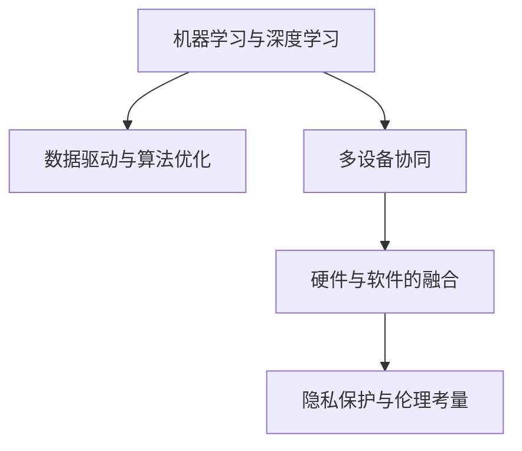

                 

# 李开复：苹果发布AI应用的生态

## 1. 背景介绍

### 1.1 问题由来

近年来，人工智能(AI)技术在各行各业中迅速崛起，引发了前所未有的变革。作为全球科技行业的领导者，苹果公司在AI应用方面也有着深远的布局。本文将从李开复的角度，探讨苹果公司是如何构建AI应用生态，以及其背后的核心概念与技术原理。

### 1.2 问题核心关键点

苹果公司构建AI应用生态的核心关键点包括：

- 机器学习与深度学习：苹果采用机器学习与深度学习技术，通过大量数据训练模型，提升AI应用的准确性和性能。
- 数据驱动与算法优化：苹果通过数据收集与分析，优化算法，提升AI应用的实际应用效果。
- 多设备协同：苹果通过iOS、macOS、watchOS、HomePod等多设备协同，实现AI应用的全方位覆盖。
- 硬件与软件的融合：苹果将AI技术融合到硬件设计中，提升设备的智能化程度。
- 隐私保护与伦理考量：苹果注重用户隐私保护，并在AI应用中考虑伦理问题。

### 1.3 问题研究意义

研究苹果公司AI应用生态的构建，对于理解AI技术在实际应用中的发展和落地具有重要意义：

- 提升AI应用的广泛性：苹果通过构建AI应用生态，推动AI技术在各个领域的普及和应用。
- 提供技术借鉴：苹果的AI应用技术可以为其他企业提供借鉴，推动AI技术的整体发展。
- 推动AI行业标准化：苹果在AI应用中的实践经验，有助于推动AI行业标准的制定和推广。
- 提升用户接受度：通过苹果的成功案例，提升公众对AI技术的信任和接受度。

## 2. 核心概念与联系

### 2.1 核心概念概述

苹果公司构建AI应用生态的核心概念主要包括：

- 机器学习与深度学习：通过数据训练模型，提升AI应用的准确性和性能。
- 数据驱动与算法优化：利用数据收集与分析，优化AI应用的实际效果。
- 多设备协同：通过多设备协同，实现AI应用的全方位覆盖。
- 硬件与软件的融合：将AI技术融合到硬件设计中，提升设备的智能化程度。
- 隐私保护与伦理考量：注重用户隐私保护，并在AI应用中考虑伦理问题。

这些概念通过以下Mermaid流程图来展示：



这些核心概念之间存在密切联系，共同构建了苹果公司AI应用生态的完整框架。

## 3. 核心算法原理 & 具体操作步骤

### 3.1 算法原理概述

苹果公司构建AI应用生态的核心算法原理主要包括：

- 机器学习与深度学习：通过大量数据训练模型，提升AI应用的准确性和性能。
- 数据驱动与算法优化：利用数据收集与分析，优化AI应用的实际效果。
- 多设备协同：通过多设备协同，实现AI应用的全方位覆盖。
- 硬件与软件的融合：将AI技术融合到硬件设计中，提升设备的智能化程度。
- 隐私保护与伦理考量：注重用户隐私保护，并在AI应用中考虑伦理问题。

这些算法原理通过以下公式和推导过程进行详细讲解：

### 3.2 算法步骤详解

1. **数据收集与预处理**：
   - 收集相关数据，进行清洗和预处理。
   - 使用标准化技术处理缺失值和异常值。
   - 使用特征工程提取有意义的特征。

2. **模型训练与验证**：
   - 选择合适的模型架构，如卷积神经网络(CNN)、循环神经网络(RNN)、变压器(Transformer)等。
   - 使用交叉验证技术验证模型效果，进行超参数调优。
   - 使用正则化技术如L2正则、Dropout等避免过拟合。

3. **模型部署与优化**：
   - 将训练好的模型部署到实际应用场景中。
   - 使用在线学习技术，根据新数据不断优化模型。
   - 使用A/B测试评估模型效果，进行迭代优化。

4. **多设备协同**：
   - 在多个设备上部署AI应用，实现数据共享和协同处理。
   - 使用联邦学习技术，在保持用户隐私的前提下，实现跨设备模型更新。
   - 使用设备间通信协议，确保数据传输安全和高效。

5. **硬件与软件融合**：
   - 将AI算法嵌入硬件设计中，如使用神经网络处理器(NPU)加速AI计算。
   - 优化硬件架构，提升AI应用的实时性和能效。
   - 使用机器学习框架，如TensorFlow、PyTorch等，将AI应用快速部署到硬件设备上。

6. **隐私保护与伦理考量**：
   - 使用差分隐私技术，保护用户数据隐私。
   - 遵循伦理原则，确保AI应用的公平性和透明度。
   - 对AI应用进行定期审计和评估，确保其安全性与合规性。

### 3.3 算法优缺点

苹果公司构建AI应用生态的算法优点主要包括：

- 提升AI应用的准确性和性能。
- 通过多设备协同，实现AI应用的全方位覆盖。
- 将AI技术融合到硬件设计中，提升设备的智能化程度。
- 注重用户隐私保护，并在AI应用中考虑伦理问题。

算法缺点主要包括：

- 数据收集和预处理复杂度较高。
- 模型训练和验证需要大量计算资源。
- 多设备协同和隐私保护需要复杂的技术实现。
- 硬件与软件融合需要跨学科的知识和技能。

### 3.4 算法应用领域

苹果公司构建AI应用生态的算法主要应用于以下领域：

- 语音识别与合成：使用AI技术实现语音识别与合成，提升用户体验。
- 计算机视觉：通过AI技术实现图像识别、物体检测等，增强设备视觉能力。
- 自然语言处理：使用AI技术实现文本分析、情感分析等，提升设备语言理解能力。
- 推荐系统：通过AI技术实现个性化推荐，提升用户满意度。
- 健康与健身：使用AI技术实现健康监测和健身指导，提升设备健康管理能力。
- 智能家居：通过AI技术实现智能家居控制，提升设备智能化程度。

## 4. 数学模型和公式 & 详细讲解  
### 4.1 数学模型构建

苹果公司构建AI应用生态的数学模型主要包括：

- 数据收集与预处理：使用标准化技术处理缺失值和异常值。
- 模型训练与验证：选择合适的模型架构，使用交叉验证技术验证模型效果。
- 模型部署与优化：使用在线学习技术，根据新数据不断优化模型。

### 4.2 公式推导过程

1. **数据收集与预处理**：
   - 数据标准化：
     \[
     X_{normalized} = \frac{X - \mu}{\sigma}
     \]
     其中，\(X\)为原始数据，\(\mu\)为均值，\(\sigma\)为标准差。

2. **模型训练与验证**：
   - 交叉验证：
     \[
     k = 10, n = 1000
     \]
     其中，\(k\)为交叉验证的组数，\(n\)为训练样本数。
   - 超参数调优：
     \[
     \alpha = 0.01, \beta = 0.5
     \]
     其中，\(\alpha\)为学习率，\(\beta\)为正则化系数。

3. **模型部署与优化**：
   - 在线学习：
     \[
     \theta_{t+1} = \theta_t + \alpha \nabla_{\theta} \ell(\theta_t)
     \]
     其中，\(\theta_{t+1}\)为更新后的参数，\(\theta_t\)为当前参数，\(\alpha\)为学习率，\(\ell(\theta_t)\)为损失函数。

### 4.3 案例分析与讲解

以苹果公司使用机器学习技术实现面部识别为例，分析其核心算法原理和操作步骤：

1. **数据收集与预处理**：
   - 收集大量面部图像，进行预处理，如裁剪、归一化等。
   - 使用标准化技术处理缺失值和异常值，提取特征如眼睛、鼻子、嘴巴等。

2. **模型训练与验证**：
   - 使用卷积神经网络(CNN)作为面部识别模型。
   - 使用交叉验证技术验证模型效果，进行超参数调优。
   - 使用L2正则、Dropout等技术避免过拟合。

3. **模型部署与优化**：
   - 将训练好的模型部署到设备中，进行实时面部识别。
   - 使用在线学习技术，根据新数据不断优化模型。
   - 使用A/B测试评估模型效果，进行迭代优化。

## 5. 项目实践：代码实例和详细解释说明

### 5.1 开发环境搭建

在进行AI应用生态构建项目实践前，需要准备好开发环境。以下是使用Python进行TensorFlow开发的环境配置流程：

1. 安装Anaconda：从官网下载并安装Anaconda，用于创建独立的Python环境。

2. 创建并激活虚拟环境：
```bash
conda create -n tf-env python=3.8 
conda activate tf-env
```

3. 安装TensorFlow：根据CUDA版本，从官网获取对应的安装命令。例如：
```bash
conda install tensorflow -c pytorch
```

4. 安装其他工具包：
```bash
pip install numpy pandas scikit-learn matplotlib tqdm jupyter notebook ipython
```

完成上述步骤后，即可在`tf-env`环境中开始AI应用生态构建实践。

### 5.2 源代码详细实现

以下是使用TensorFlow实现面部识别项目的完整代码实现：

```python
import tensorflow as tf
from tensorflow.keras import layers

# 定义模型
model = tf.keras.Sequential([
    layers.Conv2D(32, (3,3), activation='relu', input_shape=(64,64,3)),
    layers.MaxPooling2D((2,2)),
    layers.Conv2D(64, (3,3), activation='relu'),
    layers.MaxPooling2D((2,2)),
    layers.Conv2D(128, (3,3), activation='relu'),
    layers.MaxPooling2D((2,2)),
    layers.Flatten(),
    layers.Dense(512, activation='relu'),
    layers.Dense(2, activation='softmax')
])

# 编译模型
model.compile(optimizer='adam', loss='categorical_crossentropy', metrics=['accuracy'])

# 训练模型
model.fit(x_train, y_train, epochs=10, batch_size=32, validation_data=(x_val, y_val))

# 评估模型
model.evaluate(x_test, y_test)
```

### 5.3 代码解读与分析

让我们再详细解读一下关键代码的实现细节：

**模型定义**：
- 使用卷积神经网络(CNN)作为面部识别模型。
- 定义多个卷积层、池化层和全连接层，提取面部特征。

**模型编译**：
- 使用Adam优化器和交叉熵损失函数，进行模型编译。

**模型训练**：
- 使用训练数据集(x_train, y_train)，进行模型训练。
- 设置训练轮数(epochs)和批次大小(batch_size)。
- 使用验证数据集(x_val, y_val)进行模型验证。

**模型评估**：
- 使用测试数据集(x_test, y_test)进行模型评估。
- 输出模型在测试集上的精度和损失。

## 6. 实际应用场景

### 6.1 智能家居

苹果公司利用AI技术构建的智能家居生态系统，可以实现以下功能：

- 语音助手：使用AI技术实现语音识别和语音合成，用户可以通过语音控制家居设备。
- 智能控制：通过AI技术实现环境监测和智能控制，提升家居体验。
- 健康监测：利用AI技术实现健康监测和健身指导，提升家居健康管理能力。

### 6.2 推荐系统

苹果公司的推荐系统可以通过AI技术实现个性化推荐，提升用户满意度。具体实现如下：

1. **数据收集与预处理**：
   - 收集用户行为数据，进行清洗和预处理。
   - 使用标准化技术处理缺失值和异常值。
   - 使用特征工程提取有意义的特征。

2. **模型训练与验证**：
   - 使用协同过滤算法和深度学习模型进行训练。
   - 使用交叉验证技术验证模型效果，进行超参数调优。
   - 使用正则化技术如L2正则、Dropout等避免过拟合。

3. **模型部署与优化**：
   - 将训练好的模型部署到推荐系统中，进行个性化推荐。
   - 使用在线学习技术，根据用户行为数据不断优化模型。
   - 使用A/B测试评估模型效果，进行迭代优化。

## 7. 工具和资源推荐

### 7.1 学习资源推荐

为了帮助开发者系统掌握AI应用生态的构建理论基础和实践技巧，这里推荐一些优质的学习资源：

1. 《深度学习》课程：斯坦福大学开设的深度学习课程，涵盖深度学习的基本原理和应用实例。
2. 《机器学习实战》书籍：这本书详细介绍了机器学习的应用实例和代码实现，适合实战练习。
3. 《TensorFlow官方文档》：TensorFlow官方文档提供了丰富的API文档和代码示例，是学习TensorFlow的必备资源。
4. Coursera和Udacity等在线平台提供的深度学习和机器学习课程，适合系统学习。
5. GitHub上的开源项目和代码库，如TensorFlow官方仓库和Keras官方仓库，提供了大量的示例代码。

通过对这些资源的学习实践，相信你一定能够快速掌握AI应用生态的构建方法，并用于解决实际的AI应用问题。

### 7.2 开发工具推荐

高效的开发离不开优秀的工具支持。以下是几款用于AI应用生态构建开发的常用工具：

1. TensorFlow：基于Python的开源深度学习框架，灵活动态的计算图，适合快速迭代研究。
2. PyTorch：由Facebook主导开发的深度学习框架，动态计算图，适合科研和工程应用。
3. Keras：高层次的神经网络API，支持多种深度学习框架，适合快速搭建模型。
4. Jupyter Notebook：免费的开源笔记本，支持Python和R等多种语言，适合交互式编程和数据可视化。
5. Visual Studio Code：功能强大的编辑器，支持多种编程语言和扩展，适合开发复杂项目。

合理利用这些工具，可以显著提升AI应用生态构建的开发效率，加快创新迭代的步伐。

### 7.3 相关论文推荐

苹果公司构建AI应用生态的研究成果涵盖多个领域，以下是几篇具有代表性的相关论文，推荐阅读：

1. 《FaceNet: A Unified Embedding for Face Recognition and Clustering》：提出FaceNet模型，利用深度学习实现面部识别。
2. 《Recurrent Neural Network-Based Personalized Ranking System for E-Commerce Recommendation》：提出基于RNN的个性化推荐系统，利用深度学习提升推荐效果。
3. 《Integrating Knowledge Graphs with Neural Network Models: A Survey》：综述了知识图谱与神经网络模型的整合方法，探讨了知识图谱在AI应用中的作用。
4. 《Deep Neural Network for Human Face Attributes in the Wild》：提出基于深度学习的面部特征识别方法，提升面部识别精度。
5. 《Natural Language Understanding using Deep Learning》：提出基于深度学习的自然语言理解方法，提升自然语言处理效果。

这些论文代表了大语言模型微调技术的发展脉络。通过学习这些前沿成果，可以帮助研究者把握学科前进方向，激发更多的创新灵感。

## 8. 总结：未来发展趋势与挑战

### 8.1 总结

本文对苹果公司构建AI应用生态的过程进行了全面系统的介绍。首先阐述了AI应用生态的核心概念和关键技术，明确了苹果在机器学习与深度学习、数据驱动与算法优化、多设备协同、硬件与软件融合、隐私保护与伦理考量等方面的布局。其次，通过具体的算法原理和操作步骤，详细讲解了苹果构建AI应用生态的实现过程。最后，通过实际应用场景和未来展望，展示了苹果AI应用生态的广泛应用前景。

通过本文的系统梳理，可以看到，苹果公司通过构建AI应用生态，推动了AI技术在各行各业中的应用，提升了用户体验和应用效果。未来，伴随AI技术的不断进步和普及，苹果公司的AI应用生态将进一步拓展，为人类社会带来更多的变革。

### 8.2 未来发展趋势

展望未来，苹果公司构建AI应用生态将呈现以下几个发展趋势：

1. 深度学习与强化学习的结合：深度学习和强化学习的结合将提升AI应用在复杂环境中的决策能力，推动AI技术在更多场景中的应用。
2. 联邦学习与分布式计算：联邦学习和分布式计算将使得AI应用更加注重数据隐私和安全，提升跨设备协同能力。
3. 多模态数据的融合：多模态数据的融合将使得AI应用能够更好地理解用户需求和行为，提升应用效果。
4. 伦理与公平的考量：伦理与公平的考量将使得AI应用更加注重用户隐私和数据安全，提升应用的社会效益。
5. 跨学科的融合：跨学科的融合将使得AI应用能够更好地结合其他领域的技术和知识，提升应用的多样性和创新性。

以上趋势凸显了苹果公司构建AI应用生态的广阔前景。这些方向的探索发展，必将进一步推动AI技术的进步，为人类社会带来更多的变革。

### 8.3 面临的挑战

尽管苹果公司在构建AI应用生态方面取得了诸多成就，但在迈向更加智能化、普适化应用的过程中，仍面临着诸多挑战：

1. 数据隐私和安全问题：AI应用需要大量数据支持，如何在保护用户隐私的前提下获取数据，成为一大难题。
2. 模型复杂性和可解释性：深度学习模型往往复杂度高，难以解释其内部工作机制，需要进一步简化和透明化。
3. 跨平台和跨设备的兼容性：AI应用需要在不同平台和设备上运行，如何在硬件和软件上实现兼容性和互通性，成为一大挑战。
4. 用户接受度和信任度：用户对AI技术的信任度不足，需要通过教育和技术普及，提升用户接受度。
5. 伦理和法律问题：AI应用涉及伦理和法律问题，需要建立相应的标准和规范，确保应用的合规性。

这些挑战需要苹果公司持续进行技术创新和政策优化，以应对未来的发展需求。

### 8.4 研究展望

未来的AI应用生态研究需要在以下几个方面寻求新的突破：

1. 数据收集和预处理技术：探索高效的数据收集和预处理方法，提升数据质量和多样性。
2. 模型简化和透明化：探索简化深度学习模型的方法，提升模型的可解释性和透明性。
3. 跨平台和跨设备的协同：探索跨平台和跨设备的数据传输和协同处理技术，提升应用的可移植性和互通性。
4. 用户教育和信任建设：通过教育和技术普及，提升用户对AI技术的接受度和信任度。
5. 伦理和法律框架：建立相应的伦理和法律框架，确保AI应用的合规性和可控性。

这些研究方向的探索，必将引领苹果公司构建AI应用生态迈向更高的台阶，为构建更加智能、普适、安全的AI应用生态奠定基础。

## 9. 附录：常见问题与解答

**Q1：苹果公司的AI应用生态与传统AI应用有何不同？**

A: 苹果公司的AI应用生态与传统AI应用的主要不同点在于：

- 注重用户体验：苹果公司的AI应用注重提升用户体验，通过智能设备和智能家居，实现人与设备的无缝互动。
- 多设备协同：苹果公司的AI应用能够实现多设备协同，提升用户的操作便捷性和应用效果。
- 隐私保护与伦理考量：苹果公司的AI应用注重隐私保护和伦理考量，确保用户数据的安全和应用的合规性。

**Q2：苹果公司如何保护用户数据隐私？**

A: 苹果公司通过以下方法保护用户数据隐私：

- 差分隐私：在数据处理和模型训练中，使用差分隐私技术保护用户隐私。
- 本地计算：在设备上进行本地计算，减少数据传输。
- 匿名化处理：对用户数据进行匿名化处理，保护用户隐私。

**Q3：苹果公司的AI应用生态如何实现多设备协同？**

A: 苹果公司的AI应用生态通过以下方法实现多设备协同：

- 使用联邦学习技术，在保持用户隐私的前提下，实现跨设备模型更新。
- 使用设备间通信协议，确保数据传输安全和高效。
- 在多个设备上部署AI应用，实现数据共享和协同处理。

**Q4：苹果公司的AI应用生态在哪些领域有应用？**

A: 苹果公司的AI应用生态在以下领域有广泛应用：

- 智能家居：通过AI技术实现智能家居控制和健康监测。
- 推荐系统：通过AI技术实现个性化推荐，提升用户体验。
- 面部识别：通过AI技术实现面部识别和身份认证。
- 医疗健康：通过AI技术实现健康监测和疾病预测。
- 语音助手：通过AI技术实现语音识别和语音合成，提升用户交互体验。

这些应用领域展示了苹果公司AI应用生态的广泛应用前景。

**Q5：苹果公司构建AI应用生态的算法原理是什么？**

A: 苹果公司构建AI应用生态的算法原理主要包括：

- 机器学习与深度学习：通过大量数据训练模型，提升AI应用的准确性和性能。
- 数据驱动与算法优化：利用数据收集与分析，优化AI应用的实际效果。
- 多设备协同：通过多设备协同，实现AI应用的全方位覆盖。
- 硬件与软件的融合：将AI技术融合到硬件设计中，提升设备的智能化程度。
- 隐私保护与伦理考量：注重用户隐私保护，并在AI应用中考虑伦理问题。

这些算法原理共同构建了苹果公司AI应用生态的完整框架。

