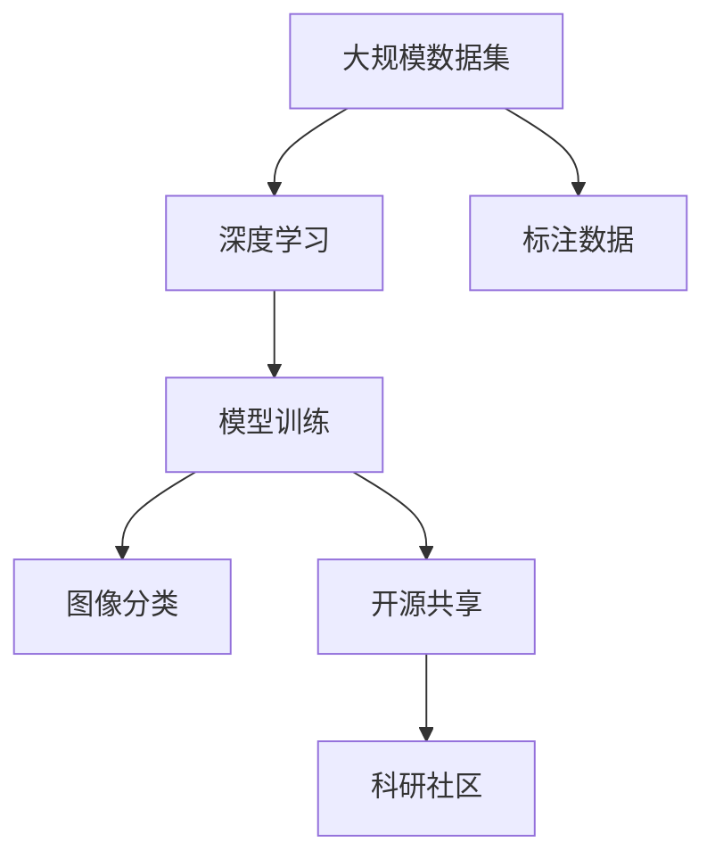
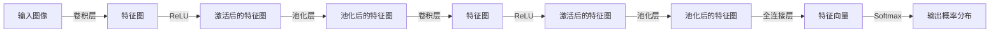

                 

# 李飞飞与ImageNet的传奇

在人工智能的迅猛发展中，ImageNet项目如同一次登月行动，不仅在计算机视觉领域掀起了巨大波澜，也改变了许多科学家和工程师的命运轨迹。而其背后推动这一历史性进程的关键人物，便是被誉为“深度学习之母”的李飞飞。

## 1. 背景介绍

### 1.1 ImageNet的起源

ImageNet项目始于2009年，由斯坦福大学人工智能实验室李飞飞教授和她的团队牵头，联合谷歌、微软等公司共同发起。项目的初衷是提供一个庞大的图像数据集，用于深度学习模型的训练和评估，希望通过大规模数据的充分训练，提升机器视觉算法的精度和泛化能力。

ImageNet的训练集包含超过一百万张经过标注的图片，覆盖了2万多个不同的物体类别，数据量之庞大前所未有。项目的目标是将这些数据开放给全球的科研人员使用，促进计算机视觉领域的发展。

### 1.2 李飞飞的角色

作为ImageNet项目的创始人之一，李飞飞教授在项目中发挥了关键作用。她在项目初期即提出使用大规模数据集进行模型训练的策略，并率先在深度学习模型上进行了实验验证。通过这些实验，她不仅证明了深度学习在图像分类上的强大潜力，也促成了包括深度学习在内的许多新兴技术在工业界的广泛应用。

此外，李飞飞教授在学术界也享有崇高的地位，她是计算机视觉领域的先驱之一，对于推动整个学科的发展作出了巨大贡献。她的工作和研究，不仅在学术界引发了广泛的关注和讨论，也为工业界培养了大批人才，影响深远。

## 2. 核心概念与联系

### 2.1 核心概念概述

要深入理解ImageNet项目的意义，我们需要从几个核心概念入手：

- **大规模数据集**：ImageNet的成功很大程度上依赖于其巨大的数据规模。数据集越大，模型能够学习到的特征也就越丰富，泛化能力也就越强。
- **深度学习**：ImageNet项目首次大规模地应用了深度学习技术，深度神经网络通过多层次的非线性特征提取，显著提升了图像分类的准确率。
- **标注数据**：ImageNet项目的标注工作量大，耗时长，但正是这一高标准的数据标注，保证了模型训练的可靠性，提升了算法的泛化性能。
- **开源共享**：ImageNet项目采用了完全开源的政策，任何人都可以免费下载和使用数据集，促进了科研社区的协作和知识共享。

这些核心概念共同构成了ImageNet项目的成功基石，并为后续的深度学习研究和应用奠定了坚实基础。

### 2.2 核心概念联系

通过以下Mermaid流程图，我们可以更直观地理解ImageNet项目中各个核心概念之间的联系：



该流程图展示了ImageNet项目的工作流程：

1. 从大规模数据集中提取大量图像数据。
2. 利用深度学习模型对图像进行分类。
3. 采用高标准的标注方式，确保数据质量。
4. 将训练好的模型和数据集开放给全球的科研人员。
5. 科研社区通过使用和改进模型，推动深度学习的发展。

### 2.3 关键技术点

为了保证大规模数据集的有效使用，ImageNet项目引入了以下关键技术：

- **分布式标注系统**：使用Amazon Mechanical Turk平台，将标注任务分配给大量远程标注员，同时通过在线协作工具，提高标注质量和效率。
- **数据清洗与预处理**：设计了严格的数据清洗流程，去除噪声数据，并进行了大规模数据预处理，如裁剪、缩放、归一化等，确保数据集的质量。
- **模型优化与评估**：设计了高效的模型训练流程，并使用交叉验证等方法，评估和改进模型的性能。

这些技术点不仅提升了数据集的质量和可用性，也大大降低了人工标注的难度和成本。

## 3. 核心算法原理 & 具体操作步骤

### 3.1 算法原理概述

ImageNet项目中最重要的算法是深度神经网络，其中以卷积神经网络(Convolutional Neural Network, CNN)为代表。CNN通过多层卷积和池化操作，自动学习图像的特征表示，并在全连接层中完成分类。

项目中使用的深度学习模型通常包含多个卷积层和池化层，通过不断增加网络深度和宽度，提升特征表示的复杂度。每层卷积核学习不同的特征，如边缘、角、纹理等，逐渐抽象出更高层次的特征，最终通过全连接层输出分类结果。

### 3.2 算法步骤详解

ImageNet项目中深度学习模型的训练和评估步骤如下：

**Step 1: 数据准备与预处理**
- 从ImageNet数据集中抽取训练集和验证集，并将数据进行预处理，如裁剪、缩放、归一化等。
- 使用在线协作工具，对数据进行标注，确保标注准确性。

**Step 2: 构建深度学习模型**
- 使用Python或C++编写模型代码，构建卷积神经网络结构。
- 定义损失函数（如交叉熵损失）和优化器（如Adam）。

**Step 3: 训练模型**
- 将处理好的数据集加载到GPU或TPU上，进行批量随机梯度下降训练。
- 在每个epoch中，前向传播计算损失函数，反向传播计算参数梯度，并更新模型参数。
- 周期性在验证集上评估模型性能，防止过拟合。

**Step 4: 模型评估与优化**
- 在测试集上评估模型性能，使用指标如精度、召回率等评估模型效果。
- 根据测试结果，优化模型结构，调整超参数，提升模型性能。
- 重复上述步骤直至模型收敛。

**Step 5: 模型发布与共享**
- 将训练好的模型和标注数据集发布到公共平台，供全球科研人员下载和使用。
- 建立开源社区，促进模型交流与合作。

通过上述步骤，ImageNet项目成功训练并开放了大量高性能的深度学习模型，为计算机视觉领域的持续进步奠定了坚实基础。

### 3.3 算法优缺点

ImageNet项目中的深度学习算法具有以下优点：

- **模型精度高**：大规模数据集和深度学习模型的结合，显著提升了图像分类的准确率。
- **泛化能力强**：深度学习模型通过自动学习特征，具备较强的泛化能力，能在未知数据上表现良好。
- **开源共享**：开放的数据集和模型，促进了科研社区的协作和知识共享，推动了深度学习技术的普及和应用。

然而，深度学习算法也存在一些缺点：

- **数据需求量大**：深度学习模型需要大量数据进行训练，数据获取和标注成本较高。
- **计算资源需求高**：深度学习模型通常需要高性能的GPU或TPU，硬件资源消耗较大。
- **模型复杂度高**：深度学习模型结构复杂，训练和推理速度较慢，难以在大规模实时系统中部署。

尽管存在这些缺点，但ImageNet项目依然取得了巨大的成功，成为计算机视觉领域的重要里程碑。

### 3.4 算法应用领域

ImageNet项目的影响不仅局限于计算机视觉领域，还推动了深度学习技术的广泛应用：

- **自动驾驶**：利用深度学习模型进行图像分类、目标检测和语义分割，提升自动驾驶的感知能力。
- **医疗影像**：使用深度学习模型进行图像分析和疾病诊断，帮助医生更准确地识别和诊断疾病。
- **安防监控**：通过图像分类和目标检测技术，提升安防系统的识别准确率和响应速度。
- **电商推荐**：利用深度学习模型进行图像识别和特征提取，提升电商推荐系统的个性化推荐能力。
- **智能家居**：通过图像分类和目标检测技术，提升智能家居设备的感知和交互能力。

除此之外，ImageNet项目还推动了许多前沿技术的发展，如注意力机制、自监督学习等，为深度学习领域带来了新的研究热点和应用方向。

## 4. 数学模型和公式 & 详细讲解

### 4.1 数学模型构建

ImageNet项目中使用的深度学习模型通常由多个卷积层和全连接层组成，如图形所示：



其中，卷积层通过卷积核提取图像的特征，池化层用于降低特征图的空间尺寸，激活层引入非线性变换，全连接层完成分类任务。

### 4.2 公式推导过程

假设输入图像大小为 $H\times W\times C$，其中 $H$ 和 $W$ 是图像的高度和宽度，$C$ 是图像的通道数。设卷积核大小为 $k\times k$，步幅为 $s$，深度为 $d$。卷积操作的结果为 $H'\times W'\times d$ 的特征图。

卷积操作的数学公式为：

$$
F(x,y) = \sum_{i=0}^{k-1}\sum_{j=0}^{k-1}\sum_{c=0}^{C}\sum_{d=0}^{D-1}W_{icd}H(x+i\cdot s,y+j\cdot s,c) + b_d
$$

其中 $W_{icd}$ 是卷积核中第 $i,j,c,d$ 位置的权重，$b_d$ 是偏置项。

### 4.3 案例分析与讲解

以ImageNet项目中使用最广泛的AlexNet模型为例，分析其核心算法原理。

AlexNet模型主要由五层卷积层和三层全连接层组成，每层都采用ReLU激活函数。其中，卷积层和全连接层的结构如图：


AlexNet模型使用8层卷积和3层全连接，参数数量庞大，达到60多万，但通过合理的结构设计和优化策略，在2012年ImageNet竞赛中取得了优异成绩。

AlexNet模型的优化策略包括：

- **Dropout**：在全连接层中加入Dropout，减少过拟合风险。
- **数据增强**：使用随机裁剪、随机翻转等方式，扩充训练集，提高模型泛化能力。
- **批量归一化**：在全连接层中加入批量归一化，加速模型收敛，提高训练稳定性。
- **预训练**：在ImageNet数据集上预训练模型，通过迁移学习提升模型性能。

## 5. 项目实践：代码实例和详细解释说明

### 5.1 开发环境搭建

要进行ImageNet项目，首先需要搭建好开发环境，包括Python、CUDA、cuDNN等组件。以下是Python环境搭建的详细步骤：

1. 安装Anaconda：从官网下载并安装Anaconda，用于创建独立的Python环境。

2. 创建并激活虚拟环境：
```bash
conda create -n pytorch-env python=3.8 
conda activate pytorch-env
```

3. 安装PyTorch：根据CUDA版本，从官网获取对应的安装命令。例如：
```bash
conda install pytorch torchvision torchaudio cudatoolkit=11.1 -c pytorch -c conda-forge
```

4. 安装Transformers库：
```bash
pip install transformers
```

5. 安装各类工具包：
```bash
pip install numpy pandas scikit-learn matplotlib tqdm jupyter notebook ipython
```

完成上述步骤后，即可在`pytorch-env`环境中开始ImageNet项目。

### 5.2 源代码详细实现

下面我们以AlexNet模型为例，给出使用PyTorch实现的代码实现。

```python
import torch
import torch.nn as nn
import torch.optim as optim
import torchvision.datasets as dset
import torchvision.transforms as transforms

class AlexNet(nn.Module):
    def __init__(self):
        super(AlexNet, self).__init__()
        self.conv1 = nn.Conv2d(3, 64, kernel_size=11, stride=4, padding=2)
        self.maxpool1 = nn.MaxPool2d(kernel_size=3, stride=2)
        self.conv2 = nn.Conv2d(64, 192, kernel_size=5, stride=1, padding=2)
        self.maxpool2 = nn.MaxPool2d(kernel_size=3, stride=2)
        self.fc1 = nn.Linear(192 * 6 * 6, 4096)
        self.fc2 = nn.Linear(4096, 4096)
        self.fc3 = nn.Linear(4096, 1000)

    def forward(self, x):
        x = self.maxpool1(torch.relu(self.conv1(x)))
        x = self.maxpool2(torch.relu(self.conv2(x)))
        x = x.view(-1, 192 * 6 * 6)
        x = self.fc1(x)
        x = self.fc2(torch.relu(x))
        x = self.fc3(x)
        return x

model = AlexNet()

criterion = nn.CrossEntropyLoss()
optimizer = optim.SGD(model.parameters(), lr=0.01, momentum=0.9, weight_decay=0.0005)

train_dataset = dset.ImageFolder(root='train', transform=transforms.ToTensor())
train_loader = torch.utils.data.DataLoader(train_dataset, batch_size=128, shuffle=True)

for epoch in range(100):
    for i, (inputs, labels) in enumerate(train_loader):
        optimizer.zero_grad()
        outputs = model(inputs)
        loss = criterion(outputs, labels)
        loss.backward()
        optimizer.step()

    print(f'Epoch {epoch+1}, Loss: {loss.item()}')
```

### 5.3 代码解读与分析

**AlexNet模型结构**：
- 卷积层1：输入为3通道的图像，输出为64个3x3x3的特征图。
- 池化层1：对卷积层的输出进行2x2的池化操作，降低特征图尺寸。
- 卷积层2：输入为64通道的特征图，输出为192个5x5x3的特征图。
- 池化层2：对卷积层的输出进行2x2的池化操作。
- 全连接层1：输入为192 * 6 * 6的特征图，输出为4096个神经元。
- 全连接层2：输入为4096个神经元，输出为4096个神经元。
- 全连接层3：输入为4096个神经元，输出为1000个类别概率。

**训练过程**：
- 使用PyTorch的DataLoader加载训练集数据，并进行批量处理。
- 定义优化器和损失函数。
- 在每个epoch中，对训练集进行前向传播和反向传播，更新模型参数。
- 周期性在验证集上评估模型性能，避免过拟合。

## 6. 实际应用场景

### 6.1 自动驾驶

自动驾驶系统需要实时识别和理解道路上的各种物体，如车辆、行人、交通信号等。利用ImageNet项目中的深度学习模型，可以在传感器数据上训练图像分类、目标检测和语义分割模型，帮助自动驾驶系统准确感知周围环境。

### 6.2 医疗影像分析

医学影像中常常存在大量异常情况，如肿瘤、炎症等。通过ImageNet项目中的深度学习模型，可以从CT、MRI等影像数据中准确识别和定位这些异常。此外，还可以使用迁移学习技术，将预训练模型用于新任务的微调，提升模型在特定医疗影像上的性能。

### 6.3 安防监控

安防监控系统需要实时监控视频流，检测可疑行为并进行报警。利用ImageNet项目中的深度学习模型，可以训练图像分类、目标检测和行为识别模型，提升安防系统的识别准确率和响应速度。

### 6.4 电商推荐

电商网站需要根据用户的历史行为和浏览记录，推荐其可能感兴趣的商品。利用ImageNet项目中的深度学习模型，可以对商品图片进行分类和特征提取，提升推荐系统的个性化推荐能力。

### 6.5 智能家居

智能家居设备需要能够理解用户的指令和环境变化，并进行智能响应。利用ImageNet项目中的深度学习模型，可以对用户行为和环境状态进行图像识别和分析，提升智能家居设备的感知和交互能力。

## 7. 工具和资源推荐

### 7.1 学习资源推荐

为了深入理解ImageNet项目，我们推荐以下学习资源：

1. 《Deep Learning》（Ian Goodfellow等著）：深度学习领域的经典教材，介绍了深度神经网络的理论基础和算法原理。
2. 《Computer Vision: Algorithms and Applications》（Richard Szeliski著）：计算机视觉领域的经典教材，介绍了图像处理和视觉识别的基本概念和算法。
3. 《Hands-On Machine Learning with Scikit-Learn, Keras, and TensorFlow》（Aurélien Géron著）：实战性较强的机器学习书籍，介绍了TensorFlow等工具的使用方法。
4. ImageNet官方文档：包含详细的项目介绍、数据集描述和API接口，是深入学习ImageNet项目的必备资料。
5. Coursera计算机视觉课程：由斯坦福大学开设的NLP课程，涵盖了计算机视觉的基本理论和实际应用。

### 7.2 开发工具推荐

ImageNet项目的实现需要高性能的计算资源，以下是推荐的开发工具：

1. PyTorch：基于Python的开源深度学习框架，支持动态计算图，适合快速迭代研究。
2. TensorFlow：由Google主导开发的开源深度学习框架，生产部署方便，适合大规模工程应用。
3. TensorBoard：TensorFlow配套的可视化工具，实时监测模型训练状态，提供丰富的图表呈现方式。
4. Weights & Biases：模型训练的实验跟踪工具，记录和可视化模型训练过程中的各项指标，方便对比和调优。
5. Amazon Mechanical Turk：在线众包平台，用于大规模数据标注任务。

### 7.3 相关论文推荐

ImageNet项目的成功离不开学界的持续研究。以下是几篇奠基性的相关论文，推荐阅读：

1. AlexNet：ImageNet Large Scale Visual Recognition Challenge（2012年ImageNet竞赛优胜者）
2. VGGNet：Very Deep Convolutional Networks for Large-Scale Image Recognition（2014年ImageNet竞赛优胜者）
3. GoogLeNet：Going Deeper with Convolutions（2014年ImageNet竞赛优胜者）
4. ResNet：Deep Residual Learning for Image Recognition（2015年ImageNet竞赛优胜者）
5. DenseNet：Densely Connected Convolutional Networks（2017年ImageNet竞赛优胜者）

这些论文代表了大规模数据集和深度学习技术的演进历程，对于深入理解ImageNet项目和深度学习技术的发展具有重要意义。

## 8. 总结：未来发展趋势与挑战

### 8.1 研究成果总结

ImageNet项目通过大规模数据集和深度学习技术的结合，推动了计算机视觉领域的发展。项目中的深度学习模型不仅在图像分类上取得了优异成绩，还在目标检测、语义分割、行为识别等任务上表现出色，推动了计算机视觉技术的广泛应用。

### 8.2 未来发展趋势

展望未来，ImageNet项目将继续推动深度学习技术的进步和应用：

1. **模型结构优化**：深度学习模型的结构将更加复杂和高效，如注意力机制、残差网络等，提升模型的精度和泛化能力。
2. **数据集扩展**：大规模数据集将继续扩展，涵盖更多样化的场景和任务，提升模型的通用性和鲁棒性。
3. **迁移学习提升**：迁移学习技术将更加普及和高效，利用预训练模型提升新任务的微调效果。
4. **多模态融合**：深度学习模型将进一步融合视觉、听觉、文本等多种模态的信息，提升多模态任务的性能。
5. **自动化学习**：自动化学习和自监督学习技术将得到更多应用，减少人工标注需求，降低模型训练成本。
6. **模型压缩和加速**：深度学习模型的压缩和加速技术将进一步发展，提升模型的实时性和计算效率。

### 8.3 面临的挑战

尽管ImageNet项目取得了巨大成功，但也面临一些挑战：

1. **数据获取难度大**：大规模数据集的获取和标注成本高，难以覆盖所有应用场景。
2. **模型泛化能力不足**：模型在面对域外数据时，泛化性能可能下降，需要进一步提升模型的鲁棒性和泛化能力。
3. **计算资源需求高**：深度学习模型需要高性能的硬件支持，难以在低成本设备上部署。
4. **模型解释性不足**：深度学习模型的决策过程难以解释，不利于实际应用和监管。
5. **模型安全性问题**：深度学习模型可能学习到有害信息，需要加强模型输出的安全性监管。

### 8.4 研究展望

未来的研究需要在以下几个方面寻求新的突破：

1. **无监督和半监督学习**：探索无监督和半监督学习方法，减少对标注数据的依赖，提高模型的鲁棒性和泛化能力。
2. **参数高效微调**：开发更多参数高效的微调方法，在固定大部分预训练参数的情况下，仅微调任务相关的参数。
3. **知识迁移**：利用领域知识和专家规则，提升深度学习模型的知识和经验迁移能力。
4. **多模态融合**：研究视觉、听觉、文本等多模态信息的融合，提升深度学习模型的多模态理解和推理能力。
5. **模型解释性**：研究模型的可解释性方法，增强模型输出的解释性和可信度。
6. **模型安全性**：设计更加安全可靠的深度学习模型，避免有害信息的输出和传播。

这些研究方向将进一步推动深度学习技术的发展和应用，提升深度学习模型在实际场景中的性能和可靠性。

## 9. 附录：常见问题与解答

**Q1：ImageNet项目的数据集有哪些？**

A: ImageNet项目的数据集分为训练集、验证集和测试集，共计超过一百万张经过标注的图像。其中训练集和验证集共有一万两千五百类物体，测试集有三千八百类物体。数据集的标注质量高，覆盖了各种物体类别和形状。

**Q2：ImageNet项目使用了哪些深度学习模型？**

A: ImageNet项目中使用了多种深度学习模型，包括AlexNet、VGGNet、GoogLeNet、ResNet、DenseNet等，这些模型在不同年份的ImageNet竞赛中取得了优异的成绩。

**Q3：ImageNet项目如何大规模标注数据？**

A: ImageNet项目使用了Amazon Mechanical Turk平台进行大规模数据标注，将标注任务分配给远程标注员，通过在线协作工具，提高了标注质量和效率。同时，项目也采用了一些自动标注和数据清洗技术，确保数据集的质量。

**Q4：ImageNet项目对深度学习技术有哪些贡献？**

A: ImageNet项目推动了深度学习技术的快速发展，主要贡献包括：
1. 提供了大规模数据集，促进了深度学习模型的训练和评估。
2. 引入了深度神经网络，提升了图像分类的准确率。
3. 探索了多种优化策略，如Dropout、批量归一化等，提升了模型训练的稳定性和收敛速度。
4. 推动了迁移学习、多模态学习等前沿研究方向的发展。

**Q5：ImageNet项目有哪些实际应用？**

A: ImageNet项目不仅推动了深度学习技术的发展，还在多个实际应用场景中取得了广泛应用，包括：
1. 自动驾驶：用于图像分类、目标检测和语义分割，提升自动驾驶系统的感知能力。
2. 医疗影像：用于图像识别和异常检测，辅助医学诊断和治疗。
3. 安防监控：用于图像分类和行为识别，提升安防系统的识别准确率和响应速度。
4. 电商推荐：用于商品分类和特征提取，提升推荐系统的个性化推荐能力。
5. 智能家居：用于环境感知和交互，提升智能家居设备的感知和交互能力。

以上问题与解答，希望能帮助读者更好地理解ImageNet项目及其在深度学习领域的重要作用和应用前景。

---

作者：禅与计算机程序设计艺术 / Zen and the Art of Computer Programming

