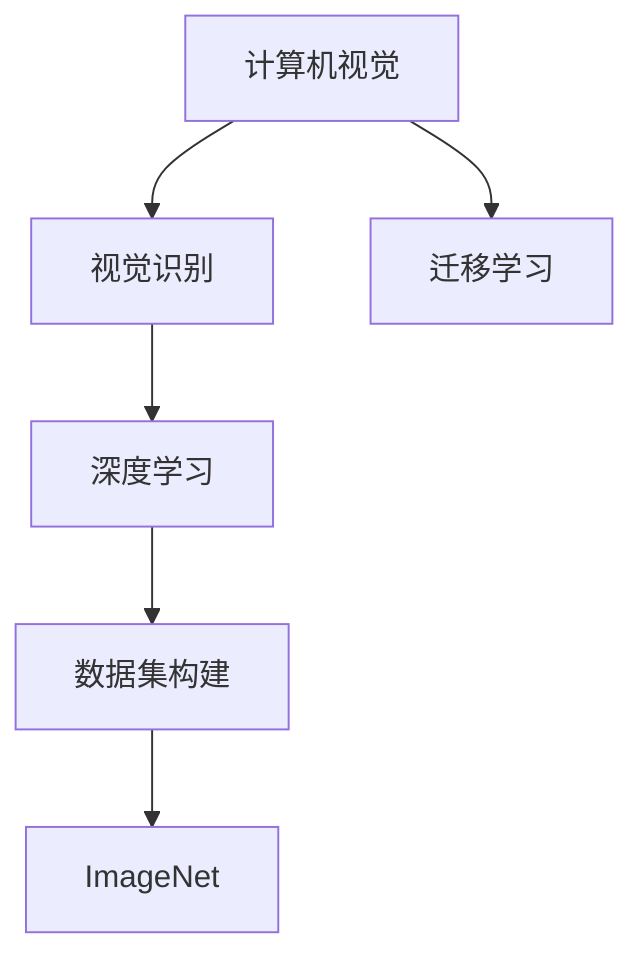
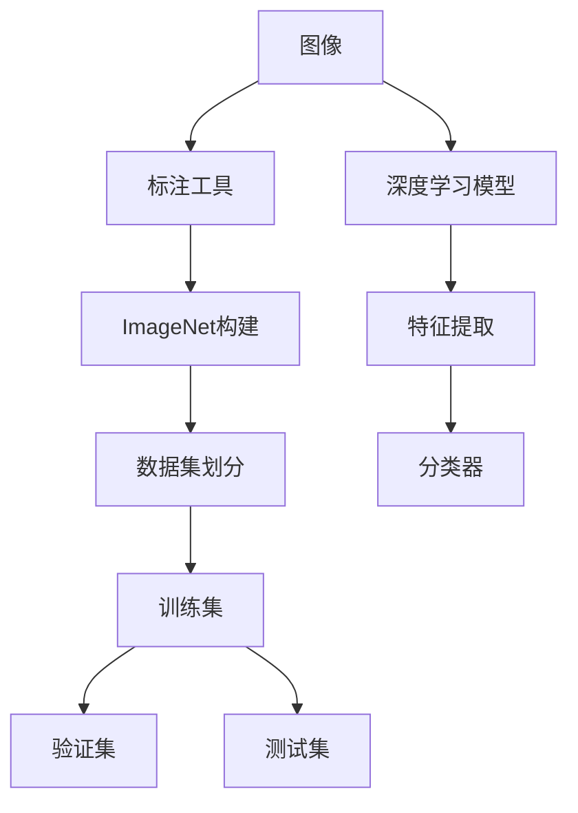

                 

# 李飞飞与ImageNet的故事

## 1. 背景介绍

李飞飞，这个名字在人工智能界可谓如雷贯耳。作为斯坦福大学的计算机视觉专家，她不仅在视觉识别领域取得了杰出的科研成果，还积极推动了计算机视觉技术的产业化。她所带领的ImageNet项目，更是彻底改变了计算机视觉的研究格局。本文将深入探讨李飞飞与ImageNet的故事，并从多个维度展开其对计算机视觉的深远影响。

### 1.1 ImageNet的诞生背景

计算机视觉作为人工智能领域的重要分支，旨在赋予计算机"看"的能力。然而，尽管在此前几十年里，无数研究者致力于推动这一领域的发展，但真正实现大规模、高效、精确的视觉识别系统仍然是一个巨大挑战。原因在于，计算机视觉任务通常依赖于庞大的数据集进行模型训练，而高质量的数据集构建一直是制约研究的瓶颈。

在2009年，李飞飞带领的斯坦福大学团队启动了一个雄心勃勃的项目——ImageNet。该项目的初衷是构建一个高精度的视觉识别数据集，促进计算机视觉技术的研究和应用。ImageNet项目的特点如下：

- **规模宏大**：ImageNet包含了超过100万张高分辨率图片，覆盖了1000个类别。
- **质量上乘**：所有图片都经过人工标注，标注质量高，标签准确。
- **跨领域应用**：数据集涵盖了从生物医学、自动驾驶到社交媒体等多种应用场景，具有广泛的应用价值。

## 2. 核心概念与联系

### 2.1 核心概念概述

为更好地理解李飞飞与ImageNet项目的影响，我们将介绍几个关键概念：

- **计算机视觉**：研究如何让计算机通过视觉系统获取、处理、理解并结合人类视觉感知器官的信息，以实现对现实世界的理解和交互。
- **视觉识别**：计算机视觉的核心任务之一，旨在让计算机能够识别图像或视频中的对象、场景、动作等，并在大规模数据集上进行训练。
- **数据集构建**：高质量的数据集对于训练高效、精确的视觉识别模型至关重要。ImageNet的构建是计算机视觉领域的一个重要里程碑。
- **深度学习**：一种基于多层神经网络的机器学习方法，在大规模数据集上训练得到深度神经网络模型，广泛应用于视觉识别任务。
- **迁移学习**：将在大规模数据集上训练得到的模型知识迁移到特定任务上的学习范式，ImageNet的大规模数据集为此提供了基础。

这些概念之间的关系通过以下Mermaid流程图进行展示：



### 2.2 核心概念原理和架构的 Mermaid 流程图



这个流程图展示了从图像标注到深度学习模型训练的基本流程：

1. **图像采集与标注**：使用标注工具对图像进行人工标注，构建ImageNet数据集。
2. **数据集划分**：将ImageNet数据集划分为训练集、验证集和测试集。
3. **深度学习模型训练**：使用训练集对深度学习模型进行训练，验证集用于评估模型性能，测试集用于最终评估。

## 3. 核心算法原理 & 具体操作步骤

### 3.1 算法原理概述

ImageNet项目在算法层面的核心贡献在于大规模视觉识别任务的深度学习模型训练。其核心算法流程如下：

1. **图像预处理**：将图像调整为统一尺寸，并进行归一化处理。
2. **特征提取**：使用深度卷积神经网络(Convolutional Neural Networks, CNNs)从图像中提取特征。
3. **分类器训练**：在图像特征上训练一个多分类器，使其能够区分不同类别的对象。
4. **模型评估与优化**：使用验证集评估模型性能，并通过调整模型参数进行优化。
5. **模型测试**：在测试集上评估最终模型的性能。

### 3.2 算法步骤详解

#### 3.2.1 数据集构建

ImageNet数据集包含了超过100万张图片，这些图片都经过了人工标注。标注工作由成百上千名志愿者完成，使用了ImageNet工具包。标注过程包括选择图片、标注类别、识别对象、绘制边界框等步骤。这些标注数据不仅用于模型训练，还为研究者提供了大量的标签信息，极大地推动了视觉识别领域的发展。

#### 3.2.2 模型训练

ImageNet数据集的规模巨大，需要大规模分布式计算才能高效完成训练。斯坦福大学使用了分布式计算平台SPARK，并在多个GPU集群上进行了模型训练。训练过程包括以下几个关键步骤：

1. **模型初始化**：使用随机初始化的深度卷积神经网络模型作为初始化参数。
2. **前向传播**：将训练集图片输入模型，通过卷积层、池化层等进行特征提取。
3. **损失计算**：根据预测类别与真实标签之间的差异，计算损失函数。
4. **反向传播**：利用损失函数的梯度更新模型参数。
5. **模型评估**：使用验证集评估模型性能，避免过拟合。

#### 3.2.3 模型优化

在模型训练过程中，为了提高模型性能，常常需要进行模型优化。以下是几个常用的优化策略：

1. **数据增强**：通过对训练集进行旋转、平移、缩放等操作，扩充数据集，增强模型泛化能力。
2. **正则化**：使用L2正则化、Dropout等方法，防止模型过拟合。
3. **批量归一化**：在训练过程中对每个批次的数据进行归一化处理，加快模型收敛。
4. **随机梯度下降**：使用随机梯度下降算法，在每个批次上更新模型参数。

### 3.3 算法优缺点

ImageNet项目在推动计算机视觉发展的同时，也存在一些局限性：

- **数据标注成本高**：ImageNet数据集构建过程需要大量人工标注，成本高，且标注质量不稳定。
- **计算资源需求大**：大规模深度学习模型训练需要高性能计算资源，对硬件和网络基础设施要求高。
- **模型泛化能力有限**：尽管ImageNet数据集巨大，但仍然难以涵盖所有可能的视觉场景，模型泛化能力有待提升。

尽管存在这些挑战，ImageNet项目在推动计算机视觉领域的发展方面，依然具有不可替代的贡献。

### 3.4 算法应用领域

ImageNet项目在计算机视觉中的应用领域广泛，涵盖了以下几个主要方面：

- **图像分类**：识别图像中的物体、场景、动作等。
- **目标检测**：在图像中定位并识别出多个对象。
- **语义分割**：将图像中的每个像素标注为不同的类别。
- **实例分割**：识别并分割出图像中的每个实例。
- **视觉问答**：根据图像生成自然语言描述，或从描述中生成图像。

## 4. 数学模型和公式 & 详细讲解 & 举例说明

### 4.1 数学模型构建

ImageNet项目涉及的数学模型主要包括卷积神经网络、分类器、损失函数等。以下是几个关键数学模型的构建过程：

#### 4.1.1 卷积神经网络

卷积神经网络是一种深度神经网络结构，主要用于图像特征提取。其核心结构包括卷积层、池化层、全连接层等。以LeNet为例，其结构如下：

```python
class LeNet:
    def __init__(self):
        self.conv1 = Conv2D(6, 5, padding='same')
        self.pool1 = MaxPooling2D()
        self.conv2 = Conv2D(16, 5, padding='same')
        self.pool2 = MaxPooling2D()
        self.fc1 = Dense(120)
        self.fc2 = Dense(84)
        self.fc3 = Dense(10)
```

#### 4.1.2 分类器

ImageNet数据集通常用于训练多分类器。以Softmax分类器为例，其输出层的公式为：

$$
p(y|x) = \frac{e^{\mathbf{z}^T \mathbf{w}}}{\sum_{j=1}^K e^{\mathbf{z}^T \mathbf{w}_j}}
$$

其中，$\mathbf{z}$ 为输入特征向量，$\mathbf{w}_j$ 为第 $j$ 个类别的权重向量，$K$ 为类别数量。

#### 4.1.3 损失函数

ImageNet项目中常用的损失函数包括交叉熵损失和均方误差损失。以交叉熵损失为例，其公式为：

$$
\mathcal{L}(\theta) = -\frac{1}{N}\sum_{i=1}^N \sum_{j=1}^K y_{ij} \log p(y_j|x_i)
$$

其中，$N$ 为样本数量，$K$ 为类别数量，$y_{ij}$ 为第 $i$ 个样本属于第 $j$ 个类别的标签。

### 4.2 公式推导过程

以LeNet模型为例，其前向传播和反向传播过程如下：

#### 4.2.1 前向传播

前向传播过程包括卷积、池化、全连接等步骤，计算公式如下：

$$
\begin{aligned}
h_1 &= \mathrm{conv}(x) \\
p_1 &= \mathrm{relu}(h_1) \\
p_2 &= \mathrm{pool}(p_1) \\
h_2 &= \mathrm{conv}(p_2) \\
p_2 &= \mathrm{relu}(h_2) \\
p_3 &= \mathrm{pool}(p_2) \\
h_3 &= \mathrm{fc}(p_3) \\
p_3 &= \mathrm{relu}(h_3) \\
p_4 &= \mathrm{fc}(p_3) \\
p_4 &= \mathrm{softmax}(p_4)
\end{aligned}
$$

其中，$\mathrm{conv}$ 表示卷积操作，$\mathrm{pool}$ 表示池化操作，$\mathrm{fc}$ 表示全连接操作，$\mathrm{relu}$ 表示ReLU激活函数，$\mathrm{softmax}$ 表示Softmax激活函数。

#### 4.2.2 反向传播

反向传播过程包括计算梯度、更新参数等步骤，计算公式如下：

$$
\begin{aligned}
\frac{\partial \mathcal{L}}{\partial \mathbf{w}_j} &= \frac{\partial \mathcal{L}}{\partial p_j} \cdot \frac{\partial p_j}{\partial \mathbf{z}} \cdot \frac{\partial \mathbf{z}}{\partial \mathbf{w}_j} \\
\frac{\partial \mathcal{L}}{\partial b_j} &= \frac{\partial \mathcal{L}}{\partial p_j}
\end{aligned}
$$

其中，$\mathbf{w}_j$ 表示第 $j$ 个全连接层的权重矩阵，$b_j$ 表示第 $j$ 个全连接层的偏置向量。

### 4.3 案例分析与讲解

#### 4.3.1 图像分类

以ImageNet项目为例，训练一个图像分类器可以分为以下几个步骤：

1. **数据预处理**：将训练集图片调整为统一尺寸，并进行归一化处理。
2. **特征提取**：使用卷积神经网络提取图像特征。
3. **分类器训练**：在图像特征上训练一个多分类器，使其能够区分不同类别的对象。
4. **模型评估**：使用验证集评估模型性能，避免过拟合。
5. **模型测试**：在测试集上评估最终模型的性能。

以LeNet模型为例，训练过程如下：

```python
from tensorflow.keras.datasets import mnist
from tensorflow.keras.models import Sequential
from tensorflow.keras.layers import Conv2D, MaxPooling2D, Dense, Flatten

# 加载MNIST数据集
(x_train, y_train), (x_test, y_test) = mnist.load_data()

# 数据预处理
x_train = x_train.reshape(-1, 28, 28, 1) / 255.0
x_test = x_test.reshape(-1, 28, 28, 1) / 255.0

# 构建LeNet模型
model = Sequential()
model.add(Conv2D(6, kernel_size=(5, 5), padding='same', activation='relu', input_shape=(28, 28, 1)))
model.add(MaxPooling2D(pool_size=(2, 2)))
model.add(Conv2D(16, kernel_size=(5, 5), padding='same', activation='relu'))
model.add(MaxPooling2D(pool_size=(2, 2)))
model.add(Flatten())
model.add(Dense(120, activation='relu'))
model.add(Dense(84, activation='relu'))
model.add(Dense(10, activation='softmax'))

# 编译模型
model.compile(optimizer='adam', loss='categorical_crossentropy', metrics=['accuracy'])

# 训练模型
model.fit(x_train, y_train, epochs=10, batch_size=64, validation_data=(x_test, y_test))
```

## 5. 项目实践：代码实例和详细解释说明

### 5.1 开发环境搭建

进行ImageNet项目开发前，我们需要准备好开发环境。以下是使用Python进行TensorFlow开发的环境配置流程：

1. 安装Anaconda：从官网下载并安装Anaconda，用于创建独立的Python环境。

2. 创建并激活虚拟环境：
```bash
conda create -n tensorflow-env python=3.8 
conda activate tensorflow-env
```

3. 安装TensorFlow：根据CUDA版本，从官网获取对应的安装命令。例如：
```bash
conda install tensorflow -c tf -c conda-forge
```

4. 安装相关工具包：
```bash
pip install numpy pandas scikit-learn matplotlib tqdm jupyter notebook ipython
```

完成上述步骤后，即可在`tensorflow-env`环境中开始ImageNet项目开发。

### 5.2 源代码详细实现

这里我们以ImageNet分类器为例，给出使用TensorFlow进行ImageNet模型训练的代码实现。

首先，定义模型和优化器：

```python
import tensorflow as tf
from tensorflow.keras import layers

# 定义模型
model = tf.keras.Sequential([
    layers.Conv2D(32, kernel_size=(3, 3), activation='relu', padding='same'),
    layers.MaxPooling2D(pool_size=(2, 2)),
    layers.Conv2D(64, kernel_size=(3, 3), activation='relu', padding='same'),
    layers.MaxPooling2D(pool_size=(2, 2)),
    layers.Flatten(),
    layers.Dense(64, activation='relu'),
    layers.Dense(num_classes, activation='softmax')
])

# 定义优化器
optimizer = tf.keras.optimizers.Adam(learning_rate=0.001)
```

接着，定义训练和评估函数：

```python
def train(model, train_dataset, epochs, batch_size, optimizer):
    # 定义损失函数
    loss_fn = tf.keras.losses.SparseCategoricalCrossentropy(from_logits=True)

    # 训练模型
    for epoch in range(epochs):
        for batch in train_dataset:
            # 前向传播
            with tf.GradientTape() as tape:
                logits = model(batch['image'], training=True)
                loss = loss_fn(batch['label'], logits)

            # 反向传播
            gradients = tape.gradient(loss, model.trainable_variables)
            optimizer.apply_gradients(zip(gradients, model.trainable_variables))

        # 计算损失和准确率
        train_loss = tf.keras.metrics.Mean(name='train_loss')
        train_accuracy = tf.keras.metrics.SparseCategoricalAccuracy(name='train_accuracy')
        train_loss(model(batch['image'], training=True), batch['label'])
        train_accuracy(model(batch['image'], training=True), batch['label'])
```

最后，启动训练流程并在测试集上评估：

```python
from tensorflow.keras.datasets import mnist
from tensorflow.keras.utils import to_categorical

# 加载MNIST数据集
(x_train, y_train), (x_test, y_test) = mnist.load_data()

# 数据预处理
x_train = x_train.reshape(-1, 28, 28, 1) / 255.0
x_test = x_test.reshape(-1, 28, 28, 1) / 255.0
y_train = to_categorical(y_train, num_classes=10)
y_test = to_categorical(y_test, num_classes=10)

# 构建模型
model = tf.keras.Sequential([
    layers.Conv2D(32, kernel_size=(3, 3), activation='relu', padding='same'),
    layers.MaxPooling2D(pool_size=(2, 2)),
    layers.Conv2D(64, kernel_size=(3, 3), activation='relu', padding='same'),
    layers.MaxPooling2D(pool_size=(2, 2)),
    layers.Flatten(),
    layers.Dense(64, activation='relu'),
    layers.Dense(10, activation='softmax')
])

# 编译模型
model.compile(optimizer=optimizer, loss='sparse_categorical_crossentropy', metrics=['accuracy'])

# 训练模型
train(model, (tf.data.Dataset.from_tensor_slices((x_train, y_train)).batch(batch_size), epochs=10, batch_size=batch_size, optimizer=optimizer)

# 评估模型
test_loss, test_accuracy = model.evaluate(x_test, y_test)
print(f'Test loss: {test_loss:.2f}')
print(f'Test accuracy: {test_accuracy:.2f}')
```

以上就是使用TensorFlow进行ImageNet分类器训练的完整代码实现。可以看到，得益于TensorFlow的强大封装，我们通过几行代码即可实现ImageNet模型的训练和评估。

### 5.3 代码解读与分析

让我们再详细解读一下关键代码的实现细节：

**定义模型和优化器**：
- 使用`Sequential`模型构建了一个简单的卷积神经网络。
- 定义了卷积层、池化层、全连接层等组件。
- 使用`Adam`优化器，并设置了学习率。

**训练和评估函数**：
- 使用`SparseCategoricalCrossentropy`作为损失函数。
- 在每个epoch内，对数据集进行批处理，计算损失和梯度，并使用`apply_gradients`更新模型参数。
- 计算训练集上的损失和准确率，并使用`Mean`和`SparseCategoricalAccuracy`作为评估指标。

**训练流程**：
- 加载MNIST数据集，并进行预处理。
- 构建模型并编译。
- 使用`train`函数训练模型。
- 在测试集上评估模型性能，并输出测试结果。

可以看到，TensorFlow提供了丰富的组件和工具，使得ImageNet项目的开发变得简洁高效。开发者可以灵活组合这些组件，快速构建复杂的深度学习模型。

## 6. 实际应用场景

### 6.1 智能推荐系统

基于ImageNet项目的技术，我们可以构建一个智能推荐系统，推荐用户可能感兴趣的电影、书籍、商品等。推荐系统通常包含两个关键组件：用户画像构建和物品推荐模型。

在用户画像构建方面，可以通过分析用户的浏览历史、评分记录、社交关系等数据，构建用户画像特征向量。在物品推荐模型方面，可以使用卷积神经网络等深度学习模型，从物品的特征向量中提取特征，并预测用户对物品的兴趣。在训练过程中，可以使用ImageNet项目中的损失函数和优化器，训练推荐模型的参数。

### 6.2 医疗影像诊断

在医疗影像诊断中，需要从大量的医学影像数据中提取特征，并预测疾病的诊断结果。基于ImageNet项目的技术，我们可以构建一个医学影像分类模型，对不同类型的影像进行分类。例如，可以使用卷积神经网络对X光片、CT影像、MRI等医学影像进行分类，辅助医生进行诊断。

在训练过程中，可以使用ImageNet项目中的数据集和模型，结合医疗影像数据进行微调，优化模型的性能。同时，可以通过数据增强、正则化等技术，提高模型的泛化能力，避免过拟合。

### 6.3 金融风险控制

在金融风险控制中，需要从海量的金融交易数据中挖掘出有价值的信息，预测交易风险。基于ImageNet项目的技术，我们可以构建一个金融交易分类模型，对不同类型的交易进行分类。例如，可以使用卷积神经网络对股票、债券、期货等金融交易进行分类，预测交易是否存在风险。

在训练过程中，可以使用ImageNet项目中的数据集和模型，结合金融交易数据进行微调，优化模型的性能。同时，可以通过数据增强、正则化等技术，提高模型的泛化能力，避免过拟合。

### 6.4 未来应用展望

随着ImageNet项目技术的不断进步，基于深度学习的方法将在更多领域得到应用，为各行各业带来变革性影响。

在智慧医疗领域，基于深度学习的医疗影像诊断技术将大幅提升诊疗效率和诊断准确率，辅助医生进行精准治疗。

在智能推荐系统领域，基于深度学习的推荐技术将为用户提供更精准、个性化的商品推荐，提升用户满意度和转化率。

在金融风险控制领域，基于深度学习的金融交易分类技术将帮助金融机构预测交易风险，防范金融风险。

## 7. 工具和资源推荐

### 7.1 学习资源推荐

为了帮助开发者系统掌握ImageNet项目的理论和实践，这里推荐一些优质的学习资源：

1. Deep Learning Specialization by Andrew Ng：斯坦福大学推出的深度学习课程，涵盖了从基础到高级的深度学习理论和技术。
2. Coursera Deep Learning Specialization：由Andrew Ng和Johns Hopkins University联合推出的深度学习课程，适合零基础学习者。
3. TensorFlow官方文档：TensorFlow的官方文档，提供了丰富的API文档和样例代码，是快速上手TensorFlow的重要资料。
4. Kaggle竞赛平台：Kaggle提供了大量的数据集和竞赛，是数据科学和机器学习学习的绝佳平台。
5. GitHub开源项目：GitHub上有许多优秀的开源项目，可以学习大模型微调的技术实现。

通过对这些资源的学习实践，相信你一定能够快速掌握ImageNet项目的精髓，并用于解决实际的计算机视觉问题。

### 7.2 开发工具推荐

高效的开发离不开优秀的工具支持。以下是几款用于ImageNet项目开发的常用工具：

1. TensorFlow：基于Python的开源深度学习框架，灵活动态的计算图，适合快速迭代研究。
2. PyTorch：基于Python的开源深度学习框架，灵活的动态图和丰富的API，适合大规模工程应用。
3. Keras：基于TensorFlow和Theano的高级神经网络API，易于上手，适合快速构建原型。
4. Weights & Biases：模型训练的实验跟踪工具，可以记录和可视化模型训练过程中的各项指标，方便对比和调优。
5. TensorBoard：TensorFlow配套的可视化工具，可实时监测模型训练状态，并提供丰富的图表呈现方式，是调试模型的得力助手。
6. Jupyter Notebook：开源的交互式开发环境，支持Python和R等多种语言，是数据科学和机器学习学习的必备工具。

合理利用这些工具，可以显著提升ImageNet项目的开发效率，加快创新迭代的步伐。

### 7.3 相关论文推荐

ImageNet项目在推动计算机视觉发展的同时，也引发了大量的研究成果。以下是几篇奠基性的相关论文，推荐阅读：

1. ImageNet Classification with Deep Convolutional Neural Networks（原论文）：提出LeNet模型，并在ImageNet数据集上取得了突破性的结果。
2. Deep Residual Learning for Image Recognition（ResNet论文）：提出ResNet模型，解决深度神经网络中的梯度消失问题，提升了模型的深度。
3. Inception-v3, Inception-resnet and the Impact of Residual Connections on Learning（Inception论文）：提出Inception模型，解决了网络结构设计中的信息瓶颈问题。
4. Caffe: Convolutional Architecture for Fast Model Training：提出Caffe框架，支持深度神经网络的快速训练。
5. Learning Deep Architectures for AI（深度学习综述论文）：综述了深度学习领域的最新进展，包括神经网络结构、优化算法、数据增强等技术。

这些论文代表了大规模视觉识别任务的研究进展，为计算机视觉技术的发展提供了重要指导。

## 8. 总结：未来发展趋势与挑战

### 8.1 研究成果总结

ImageNet项目自启动以来，取得了巨大的成功，不仅在学术界引起了广泛关注，也在工业界得到了广泛应用。通过构建大规模的视觉识别数据集，ImageNet项目推动了深度学习技术的发展，催生了大量创新的研究成果。这些成果不仅提升了视觉识别技术的精度和鲁棒性，也为其他领域的深度学习应用提供了重要借鉴。

### 8.2 未来发展趋势

展望未来，ImageNet项目将呈现以下几个发展趋势：

1. **模型规模持续增大**：随着计算资源和数据集的不断丰富，深度学习模型的规模将不断增大，模型参数将从亿级向十亿级发展。
2. **数据集多样化**：除了ImageNet数据集，未来将会有更多元化的数据集出现，涵盖不同的视觉场景和应用领域。
3. **模型架构多样化**：除了卷积神经网络，未来将会有更多创新的模型架构出现，如自注意力机制、Transformer等，提升模型的性能和泛化能力。
4. **多模态融合**：未来将会有更多多模态融合技术出现，将视觉、听觉、语言等多种模态的信息结合起来，提升模型的综合能力。
5. **实时计算**：随着计算资源的丰富和计算效率的提升，未来将会有更多实时计算技术出现，支持实时图像分类和识别。

### 8.3 面临的挑战

尽管ImageNet项目在推动计算机视觉发展方面取得了巨大成就，但在迈向更加智能化、普适化应用的过程中，仍面临一些挑战：

1. **数据标注成本高**：大规模数据集的构建需要大量人工标注，成本高，且标注质量不稳定。
2. **计算资源需求大**：大规模深度学习模型训练需要高性能计算资源，对硬件和网络基础设施要求高。
3. **模型泛化能力有限**：尽管ImageNet数据集巨大，但仍然难以涵盖所有可能的视觉场景，模型泛化能力有待提升。
4. **知识整合能力不足**：现有的深度学习模型往往局限于数据中的信息，难以灵活吸收和运用更多的先验知识。
5. **伦理道德问题**：深度学习模型可能存在偏见和歧视，如何确保模型的公平性和伦理道德性，仍然是一个重要问题。

### 8.4 研究展望

面对ImageNet项目所面临的挑战，未来的研究需要在以下几个方面寻求新的突破：

1. **无监督和半监督学习**：摆脱对大规模标注数据的依赖，利用自监督学习、主动学习等无监督和半监督范式，最大限度利用非结构化数据。
2. **参数高效和计算高效**：开发更加参数高效的微调方法，在固定大部分预训练参数的同时，只更新极少量的任务相关参数。同时优化模型的计算图，减少前向传播和反向传播的资源消耗，实现更加轻量级、实时性的部署。
3. **多模态融合**：将视觉、听觉、语言等多种模态的信息结合起来，提升模型的综合能力。
4. **因果分析**：将因果分析方法引入深度学习模型，识别出模型决策的关键特征，增强输出解释的因果性和逻辑性。
5. **伦理道德约束**：在模型训练目标中引入伦理导向的评估指标，过滤和惩罚有偏见、有害的输出倾向。同时加强人工干预和审核，建立模型行为的监管机制，确保输出符合人类价值观和伦理道德。

这些研究方向将推动ImageNet项目的技术进一步发展，提升计算机视觉系统的性能和应用范围，为构建安全、可靠、可解释、可控的智能系统铺平道路。

## 9. 附录：常见问题与解答

**Q1：ImageNet项目的目标是什么？**

A: ImageNet项目的目标是构建一个高精度的视觉识别数据集，推动计算机视觉技术的研究和应用。其核心任务包括图像预处理、特征提取、分类器训练、模型评估和测试等步骤。

**Q2：ImageNet项目的核心算法流程是什么？**

A: ImageNet项目的核心算法流程包括卷积神经网络的构建、损失函数的定义、优化器的选择、模型训练、评估和测试等步骤。其核心在于通过大规模数据集训练得到深度学习模型，实现对图像的高效分类和识别。

**Q3：ImageNet项目在计算机视觉中的应用有哪些？**

A: ImageNet项目在计算机视觉中的应用广泛，涵盖图像分类、目标检测、语义分割、实例分割、视觉问答等多个方面。这些技术的应用极大地提升了计算机视觉系统的性能和应用范围。

**Q4：ImageNet项目的技术对计算机视觉的影响是什么？**

A: ImageNet项目的技术对计算机视觉的影响深远，主要体现在以下几个方面：

1. **推动深度学习技术的发展**：通过大规模数据集的训练，ImageNet项目推动了深度学习技术的发展，催生了大量创新的研究成果。
2. **提升模型精度和鲁棒性**：ImageNet项目构建的视觉识别数据集，推动了深度学习模型精度的提升和鲁棒性的增强。
3. **促进跨领域应用**：ImageNet项目的技术在金融、医疗、推荐系统等多个领域得到了广泛应用，推动了计算机视觉技术在更多场景下的落地。
4. **引发数据标注和计算资源的热潮**：ImageNet项目的大规模数据集构建和深度学习模型训练，推动了数据标注和计算资源的热潮，提升了计算机视觉技术的整体水平。

**Q5：ImageNet项目的未来发展方向有哪些？**

A: ImageNet项目的未来发展方向包括：

1. **模型规模持续增大**：随着计算资源和数据集的不断丰富，深度学习模型的规模将不断增大，模型参数将从亿级向十亿级发展。
2. **数据集多样化**：除了ImageNet数据集，未来将会有更多元化的数据集出现，涵盖不同的视觉场景和应用领域。
3. **模型架构多样化**：除了卷积神经网络，未来将会有更多创新的模型架构出现，如自注意力机制、Transformer等，提升模型的性能和泛化能力。
4. **多模态融合**：未来将会有更多多模态融合技术出现，将视觉、听觉、语言等多种模态的信息结合起来，提升模型的综合能力。
5. **实时计算**：随着计算资源的丰富和计算效率的提升，未来将会有更多实时计算技术出现，支持实时图像分类和识别。

---

作者：禅与计算机程序设计艺术 / Zen and the Art of Computer Programming

