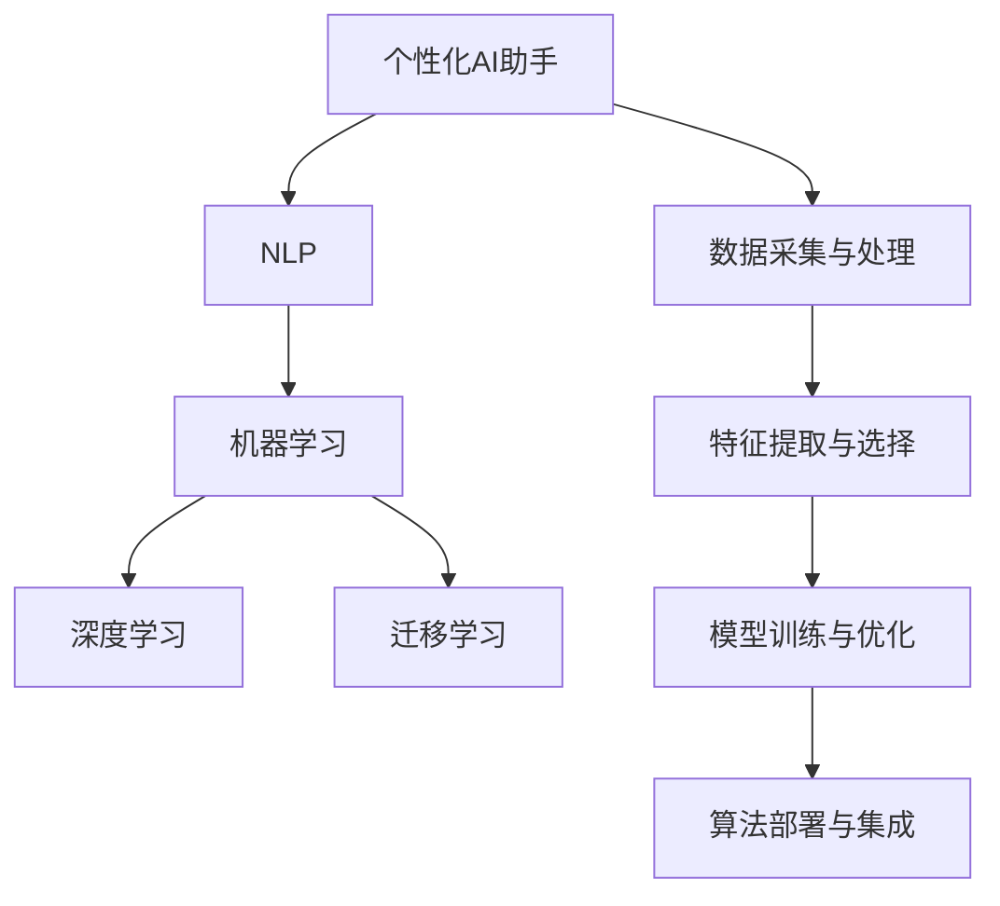

                 

# 构建个性化AI助手的技术路径

## 1. 背景介绍

### 1.1 问题由来
随着人工智能(AI)技术的快速发展，个性化AI助手逐渐成为人类生活和工作中不可或缺的辅助工具。它们不仅能够提供个性化信息推荐、智能日程管理、问题解答等实用功能，还能在不同应用场景中提供情境感知、自然语言理解、情感识别等复杂能力。当前，许多公司和研究机构都在竞相开发和部署个性化AI助手，以期在用户交互、用户体验、服务效率等方面取得突破。然而，构建一个真正高效、可靠、有价值的个性化AI助手并非易事，涉及从数据获取到模型训练、从功能设计到用户体验的多个环节。本文将系统介绍构建个性化AI助手的关键技术和技术路径，帮助开发者在设计和使用个性化AI助手时，能够充分理解和运用相关技术。

### 1.2 问题核心关键点
构建个性化AI助手的技术路径涉及多个核心技术点，包括数据采集与处理、特征提取与选择、模型训练与优化、算法部署与集成等。如何有效融合这些技术，确保个性化AI助手在各个环节中都能提供高效、准确的个性化服务，是本文的关注重点。以下是一些关键点：

1. **数据采集与处理**：获取、清洗、标注数据是个性化AI助手的基础，数据的质量和多样性直接影响模型的性能。
2. **特征提取与选择**：从原始数据中提取出有意义的特征，并选择对模型预测有帮助的特征，是模型训练的关键步骤。
3. **模型训练与优化**：选择合适的模型和优化算法，在训练集上训练模型，并在验证集上进行调参，以优化模型性能。
4. **算法部署与集成**：将训练好的模型集成到应用系统中，并部署到实际环境中，需要考虑模型推理速度、资源消耗等问题。

## 2. 核心概念与联系

### 2.1 核心概念概述

为了更好地理解构建个性化AI助手的技术路径，本节将介绍几个关键概念及其相互之间的联系：

- **个性化AI助手**：能够根据用户的历史行为、偏好、情感等数据，提供定制化、上下文感知的辅助工具。
- **自然语言处理(NLP)**：使计算机能够理解、处理和生成人类语言的技术，是构建个性化AI助手的核心能力。
- **机器学习(ML)**：通过数据训练模型，使其具备预测、分类、聚类等能力，是实现个性化推荐、智能对话等功能的基石。
- **深度学习(Deep Learning)**：一种特殊的机器学习技术，通过构建神经网络模型进行复杂模式识别，是目前构建高效、准确的个性化AI助手的常用方法。
- **迁移学习(Transfer Learning)**：利用预训练模型在新任务上进行微调，以提升模型在新领域上的性能，是提升个性化AI助手泛化能力的重要手段。

这些概念之间的联系可以通过以下Mermaid流程图来展示：



这个流程图展示了个性化AI助手从数据处理到模型部署的全过程，以及各个环节间的联系。

## 3. 核心算法原理 & 具体操作步骤
### 3.1 算法原理概述

个性化AI助手的构建，主要依赖于机器学习特别是深度学习技术。从用户数据中提取特征，训练模型，并在实际应用中进行推理和决策，是整个过程的核心。

#### 3.1.1 数据采集与处理
个性化AI助手的数据采集和处理通常包括以下步骤：

1. **数据收集**：通过日志、传感器、用户操作等渠道收集用户数据，包括行为数据、偏好数据、情感数据等。
2. **数据清洗**：对收集到的数据进行去重、填补缺失值、异常值处理等操作，确保数据的质量和完整性。
3. **数据标注**：对部分数据进行人工标注，为模型提供训练标签。

#### 3.1.2 特征提取与选择
从原始数据中提取有意义的特征，对提升模型性能至关重要。常见的特征提取方法包括：

1. **向量表示**：将文本、语音、图像等数据转换为向量形式，使用如TF-IDF、Word2Vec、ImageNet等技术。
2. **特征选择**：使用如Lasso回归、PCA等方法，选择对预测有帮助的特征。
3. **深度特征提取**：使用卷积神经网络(CNN)、循环神经网络(RNN)、Transformer等深度学习模型，提取高层次的特征表示。

#### 3.1.3 模型训练与优化
个性化AI助手的模型训练与优化通常包括以下步骤：

1. **模型选择**：选择适合的深度学习模型，如CNN、RNN、LSTM、GRU、Transformer等。
2. **模型训练**：在标注数据上训练模型，使用如交叉熵损失、均方误差损失等。
3. **超参数调优**：通过网格搜索、随机搜索、贝叶斯优化等方法，调整模型的超参数，如学习率、批次大小、优化器等。
4. **模型评估**：在验证集上评估模型性能，使用如准确率、召回率、F1分数等指标。

#### 3.1.4 算法部署与集成
模型部署与集成通常包括以下步骤：

1. **模型部署**：将训练好的模型部署到服务器、移动设备、嵌入式设备等实际应用场景中。
2. **接口集成**：将模型与用户界面、数据仓库、其他API等系统集成，确保数据流和信息流的畅通。
3. **性能优化**：对模型进行量化、剪枝、压缩等优化，以提升推理速度和资源利用率。

### 3.2 算法步骤详解

下面将详细介绍每个步骤的详细步骤和技术要点。

#### 3.2.1 数据采集与处理

**步骤1：数据收集**
- 使用日志记录用户操作、浏览、购买等行为数据。
- 使用传感器收集用户位置、生理数据等物理信息。
- 使用问卷、对话等渠道收集用户反馈和偏好数据。

**步骤2：数据清洗**
- 去重：移除重复数据。
- 填补缺失值：使用均值、中位数、插值等方法填补缺失数据。
- 异常值处理：使用箱线图、Z-score等方法检测和处理异常值。

**步骤3：数据标注**
- 人工标注：对部分数据进行人工标注，如标注新闻文章的主题、情感。
- 自动化标注：使用如BART、XLNet等模型，自动标注文本的实体、事件等信息。

#### 3.2.2 特征提取与选择

**步骤1：向量表示**
- 使用TF-IDF将文本转换为向量形式。
- 使用Word2Vec、GloVe等技术将单词映射为向量。
- 使用ImageNet等预训练模型提取图像特征。

**步骤2：特征选择**
- 使用Lasso回归选择对预测有帮助的特征。
- 使用PCA进行特征降维，保留重要特征。
- 使用Transformer等模型进行特征提取。

#### 3.2.3 模型训练与优化

**步骤1：模型选择**
- 选择适合的深度学习模型，如CNN、RNN、LSTM、GRU、Transformer等。
- 选择适合的激活函数，如ReLU、Sigmoid、Tanh等。
- 选择适合的优化器，如SGD、Adam、RMSprop等。

**步骤2：模型训练**
- 使用交叉熵损失训练分类模型。
- 使用均方误差损失训练回归模型。
- 使用自监督学习任务进行预训练，如语言模型、自编码器等。

**步骤3：超参数调优**
- 使用网格搜索、随机搜索、贝叶斯优化等方法，调整模型的超参数。
- 在验证集上进行交叉验证，选择最优模型。

**步骤4：模型评估**
- 在测试集上评估模型性能，使用如准确率、召回率、F1分数等指标。
- 使用混淆矩阵、ROC曲线等可视化工具，帮助理解模型性能。

#### 3.2.4 算法部署与集成

**步骤1：模型部署**
- 将训练好的模型部署到服务器、移动设备、嵌入式设备等实际应用场景中。
- 使用Docker、Kubernetes等容器化技术，确保模型的稳定性和可移植性。
- 使用TensorFlow Serving、TorchScript等框架，提供推理服务接口。

**步骤2：接口集成**
- 将模型与用户界面集成，确保用户输入和输出的流畅性。
- 将模型与数据仓库集成，确保数据的存储和查询。
- 将模型与其他API集成，实现跨系统、跨平台的数据共享。

**步骤3：性能优化**
- 使用量化技术，将浮点模型转换为定点模型，减少计算资源消耗。
- 使用剪枝技术，去除不必要的参数，减少模型尺寸。
- 使用压缩技术，减少模型的存储空间。

### 3.3 算法优缺点

#### 3.3.1 优点

1. **准确性高**：深度学习模型在处理大规模、高维度数据方面具有优势，能够提供准确的用户画像和个性化推荐。
2. **可扩展性好**：深度学习模型可以轻松扩展到多个应用场景，如智能客服、智能推荐、智能问答等。
3. **数据利用率高**：深度学习模型能够充分挖掘用户数据的潜力，提供丰富的个性化服务。

#### 3.3.2 缺点

1. **计算资源消耗大**：深度学习模型需要大量的计算资源和存储资源，特别是在训练阶段。
2. **训练时间长**：深度学习模型需要较长的训练时间，特别是在大规模数据集上。
3. **可解释性差**：深度学习模型通常是"黑盒"系统，难以解释其内部工作机制和决策逻辑。

### 3.4 算法应用领域

个性化AI助手的应用领域非常广泛，涵盖了多个行业和应用场景。以下是几个典型的应用领域：

1. **智能推荐系统**：如电商、音乐、视频等平台，根据用户的历史行为和偏好，提供个性化的商品、内容推荐。
2. **智能客服系统**：如在线客服、客户支持等，根据用户输入的自然语言，提供即时的智能对话和问题解答。
3. **智能助理系统**：如语音助手、个人助理等，根据用户的时间安排、日程计划，提供智能日程管理和任务提醒。
4. **情感分析系统**：如社交媒体、新闻评论等，分析用户情感倾向，提供情感分析报告和舆情预警。
5. **个性化医疗系统**：如健康监测、疾病诊断等，根据用户的健康数据和历史病历，提供个性化的健康建议和治疗方案。

## 4. 数学模型和公式 & 详细讲解  
### 4.1 数学模型构建

本节将使用数学语言对构建个性化AI助手的全过程进行更加严格的刻画。

记个性化AI助手的数据集为 $D=\{(x_i,y_i)\}_{i=1}^N$，其中 $x_i$ 为输入特征向量，$y_i$ 为标签向量。假设选择的模型为 $M_{\theta}$，其中 $\theta$ 为模型参数。

定义模型 $M_{\theta}$ 在输入 $x$ 上的预测为 $\hat{y}=M_{\theta}(x)$。训练目标为最小化预测误差：

$$
\mathcal{L}(\theta) = \frac{1}{N} \sum_{i=1}^N \ell(M_{\theta}(x_i),y_i)
$$

其中 $\ell$ 为损失函数，如交叉熵损失、均方误差损失等。

### 4.2 公式推导过程

以下我们以二分类任务为例，推导交叉熵损失函数及其梯度的计算公式。

假设模型 $M_{\theta}$ 在输入 $x$ 上的输出为 $\hat{y}=M_{\theta}(x) \in [0,1]$，表示样本属于正类的概率。真实标签 $y \in \{0,1\}$。则二分类交叉熵损失函数定义为：

$$
\ell(M_{\theta}(x),y) = -[y\log \hat{y} + (1-y)\log (1-\hat{y})]
$$

将其代入经验风险公式，得：

$$
\mathcal{L}(\theta) = -\frac{1}{N}\sum_{i=1}^N [y_i\log M_{\theta}(x_i)+(1-y_i)\log(1-M_{\theta}(x_i))]
$$

根据链式法则，损失函数对参数 $\theta_k$ 的梯度为：

$$
\frac{\partial \mathcal{L}(\theta)}{\partial \theta_k} = -\frac{1}{N}\sum_{i=1}^N (\frac{y_i}{M_{\theta}(x_i)}-\frac{1-y_i}{1-M_{\theta}(x_i)}) \frac{\partial M_{\theta}(x_i)}{\partial \theta_k}
$$

其中 $\frac{\partial M_{\theta}(x_i)}{\partial \theta_k}$ 可进一步递归展开，利用自动微分技术完成计算。

在得到损失函数的梯度后，即可带入参数更新公式，完成模型的迭代优化。重复上述过程直至收敛，最终得到适应下游任务的最优模型参数 $\theta^*$。

### 4.3 案例分析与讲解

以智能推荐系统为例，进行详细的案例分析。

假设推荐系统有 $N$ 个用户，每个用户有 $M$ 个可能的商品，每个商品有 $K$ 个特征。假设用户的历史行为数据为 $D=\{(x_i,y_i)\}_{i=1}^N$，其中 $x_i$ 为第 $i$ 个用户的商品选择历史，$y_i$ 为对应的推荐标签。

**步骤1：数据采集与处理**

1. **数据收集**：从电商平台收集用户的历史行为数据，如浏览记录、购买记录等。
2. **数据清洗**：去除重复记录，填补缺失值，检测和处理异常值。
3. **数据标注**：对部分数据进行人工标注，如标注用户对商品的喜好程度。

**步骤2：特征提取与选择**

1. **向量表示**：使用TF-IDF将文本转换为向量形式。
2. **特征选择**：使用Lasso回归选择对预测有帮助的特征。
3. **深度特征提取**：使用Transformer等模型提取高层次的特征表示。

**步骤3：模型训练与优化**

1. **模型选择**：选择适合的多层感知机(MLP)或深度神经网络(DNN)模型。
2. **模型训练**：使用交叉熵损失训练分类模型。
3. **超参数调优**：使用网格搜索、随机搜索、贝叶斯优化等方法，调整模型的超参数。

**步骤4：算法部署与集成**

1. **模型部署**：将训练好的模型部署到服务器上，使用TensorFlow Serving提供推理服务接口。
2. **接口集成**：将模型与用户界面集成，确保用户输入和输出的流畅性。
3. **性能优化**：使用量化技术，将浮点模型转换为定点模型，减少计算资源消耗。

## 5. 项目实践：代码实例和详细解释说明
### 5.1 开发环境搭建

在进行个性化AI助手的开发实践前，我们需要准备好开发环境。以下是使用Python进行TensorFlow开发的环境配置流程：

1. 安装Anaconda：从官网下载并安装Anaconda，用于创建独立的Python环境。

2. 创建并激活虚拟环境：
```bash
conda create -n tf-env python=3.8 
conda activate tf-env
```

3. 安装TensorFlow：根据CUDA版本，从官网获取对应的安装命令。例如：
```bash
pip install tensorflow
```

4. 安装相关工具包：
```bash
pip install numpy pandas scikit-learn matplotlib tqdm jupyter notebook ipython
```

完成上述步骤后，即可在`tf-env`环境中开始个性化AI助手的开发实践。

### 5.2 源代码详细实现

下面我们以智能推荐系统为例，给出使用TensorFlow对推荐模型进行训练的PyTorch代码实现。

首先，定义推荐任务的数据处理函数：

```python
import tensorflow as tf
from tensorflow.keras.layers import Input, Dense, Embedding, Flatten, Concatenate
from tensorflow.keras.models import Model
from tensorflow.keras.optimizers import Adam
from tensorflow.keras.callbacks import EarlyStopping

# 定义输入和输出
input_user = Input(shape=(N,))
input_item = Input(shape=(M,))
input_user_item = Concatenate()([input_user, input_item])

# 定义用户和商品嵌入层
user_embedding = Embedding(N, K)(input_user)
item_embedding = Embedding(M, K)(input_item)

# 定义MLP层
dense_layer1 = Dense(256, activation='relu')(input_user_item)
dense_layer2 = Dense(128, activation='relu')(dense_layer1)
output_layer = Dense(1, activation='sigmoid')(dense_layer2)

# 定义模型
model = Model(inputs=[input_user, input_item], outputs=output_layer)

# 定义优化器和回调函数
optimizer = Adam(lr=0.001)
early_stopping = EarlyStopping(patience=10, restore_best_weights=True)

# 编译模型
model.compile(optimizer=optimizer, loss='binary_crossentropy', metrics=['accuracy'])

# 训练模型
model.fit(x=[train_user_data, train_item_data], y=train_labels, epochs=50, validation_data=(val_user_data, val_item_data), callbacks=[early_stopping])
```

然后，定义评估和预测函数：

```python
# 定义评估函数
def evaluate(model, test_user_data, test_item_data, test_labels):
    loss, accuracy = model.evaluate(x=[test_user_data, test_item_data], y=test_labels)
    print(f"Test loss: {loss}, Test accuracy: {accuracy}")

# 定义预测函数
def predict(model, user_data, item_data):
    scores = model.predict([user_data, item_data])
    return scores
```

最后，启动训练流程并在测试集上评估：

```python
epochs = 50
batch_size = 128

# 训练模型
model.fit(x=[train_user_data, train_item_data], y=train_labels, epochs=epochs, batch_size=batch_size, validation_data=(val_user_data, val_item_data))

# 评估模型
evaluate(model, test_user_data, test_item_data, test_labels)

# 预测推荐结果
scores = predict(model, user_data, item_data)
```

以上就是使用TensorFlow对推荐模型进行训练的完整代码实现。可以看到，使用TensorFlow构建的推荐模型非常灵活和强大，可以轻松实现复杂的多层神经网络结构。

### 5.3 代码解读与分析

让我们再详细解读一下关键代码的实现细节：

**定义输入和输出**

- `Input`函数定义了用户ID和商品ID的输入张量。
- `Concatenate`函数将用户ID和商品ID的嵌入向量拼接，形成高维的输入向量。

**定义用户和商品嵌入层**

- `Embedding`函数将用户ID和商品ID转换为低维的嵌入向量。

**定义MLP层**

- `Dense`函数定义了多层的全连接神经网络层，使用`relu`激活函数。
- `Flatten`函数将多层输出展平，形成最终的输出向量。

**定义模型**

- `Model`函数定义了整个推荐模型，包括输入、中间层和输出层。
- `compile`函数定义了优化器、损失函数和评估指标。

**训练模型**

- `fit`函数定义了训练过程中的超参数，如批次大小和训练轮数。
- `EarlyStopping`回调函数用于避免模型过拟合。

**评估和预测函数**

- `evaluate`函数用于在测试集上评估模型性能。
- `predict`函数用于对新的用户和商品ID进行预测。

**启动训练流程**

- `fit`函数训练模型，`evaluate`函数评估模型性能，`predict`函数生成推荐结果。

可以看到，TensorFlow在构建推荐模型时，提供了丰富的组件和接口，使得开发者能够灵活地设计和使用复杂模型。

当然，工业级的系统实现还需考虑更多因素，如模型的保存和部署、超参数的自动搜索、更灵活的任务适配层等。但核心的训练范式基本与此类似。

## 6. 实际应用场景
### 6.1 智能客服系统

个性化AI助手在智能客服系统中应用广泛。传统的客服系统需要大量人工，效率低、成本高，且无法提供24小时服务。而使用个性化AI助手，能够自动处理用户咨询，提高服务效率和用户满意度。

具体而言，可以收集历史客服对话数据，将问题和最佳答复构建成监督数据，在此基础上对预训练模型进行微调。微调后的模型能够自动理解用户意图，匹配最合适的答案模板进行回复。对于用户提出的新问题，还可以接入检索系统实时搜索相关内容，动态组织生成回答。如此构建的智能客服系统，能大幅提升客户咨询体验和问题解决效率。

### 6.2 金融舆情监测

金融机构需要实时监测市场舆论动向，以便及时应对负面信息传播，规避金融风险。传统的人工监测方式成本高、效率低，难以应对网络时代海量信息爆发的挑战。基于个性化AI助手的文本分类和情感分析技术，为金融舆情监测提供了新的解决方案。

具体而言，可以收集金融领域相关的新闻、报道、评论等文本数据，并对其进行主题标注和情感标注。在此基础上对预训练语言模型进行微调，使其能够自动判断文本属于何种主题，情感倾向是正面、中性还是负面。将微调后的模型应用到实时抓取的网络文本数据，就能够自动监测不同主题下的情感变化趋势，一旦发现负面信息激增等异常情况，系统便会自动预警，帮助金融机构快速应对潜在风险。

### 6.3 个性化推荐系统

当前的推荐系统往往只依赖用户的历史行为数据进行物品推荐，无法深入理解用户的真实兴趣偏好。基于个性化AI助手的推荐系统可以更好地挖掘用户行为背后的语义信息，从而提供更精准、多样的推荐内容。

在实践中，可以收集用户浏览、点击、评论、分享等行为数据，提取和用户交互的物品标题、描述、标签等文本内容。将文本内容作为模型输入，用户的后续行为（如是否点击、购买等）作为监督信号，在此基础上微调预训练语言模型。微调后的模型能够从文本内容中准确把握用户的兴趣点。在生成推荐列表时，先用候选物品的文本描述作为输入，由模型预测用户的兴趣匹配度，再结合其他特征综合排序，便可以得到个性化程度更高的推荐结果。

### 6.4 未来应用展望

随着个性化AI助手技术的不断发展，其在更多领域的应用前景将更加广阔。

在智慧医疗领域，基于个性化AI助手的医疗问答、病历分析、药物研发等应用将提升医疗服务的智能化水平，辅助医生诊疗，加速新药开发进程。

在智能教育领域，个性化AI助手可应用于作业批改、学情分析、知识推荐等方面，因材施教，促进教育公平，提高教学质量。

在智慧城市治理中，个性化AI助手可应用于城市事件监测、舆情分析、应急指挥等环节，提高城市管理的自动化和智能化水平，构建更安全、高效的未来城市。

此外，在企业生产、社会治理、文娱传媒等众多领域，基于个性化AI助手的人工智能应用也将不断涌现，为经济社会发展注入新的动力。相信随着技术的日益成熟，个性化AI助手必将在构建人机协同的智能时代中扮演越来越重要的角色。

## 7. 工具和资源推荐
### 7.1 学习资源推荐

为了帮助开发者系统掌握个性化AI助手的理论基础和实践技巧，这里推荐一些优质的学习资源：

1. 《深度学习入门：基于TensorFlow 2.0》书籍：介绍了TensorFlow 2.0的基本概念和使用方法，适合初学者入门。
2. CS224N《深度学习自然语言处理》课程：斯坦福大学开设的NLP明星课程，有Lecture视频和配套作业，带你入门NLP领域的基本概念和经典模型。
3. 《TensorFlow 2.0实战》书籍：通过实战案例，深入讲解TensorFlow 2.0的高级应用，如模型部署、性能优化等。
4. HuggingFace官方文档：提供了丰富的预训练模型和微调样例代码，是上手实践的必备资料。
5. Kaggle：提供丰富的数据集和竞赛，帮助开发者实践和测试个性化AI助手的性能。

通过对这些资源的学习实践，相信你一定能够快速掌握构建个性化AI助手的精髓，并用于解决实际的NLP问题。
###  7.2 开发工具推荐

高效的开发离不开优秀的工具支持。以下是几款用于个性化AI助手开发的常用工具：

1. TensorFlow：基于Python的开源深度学习框架，灵活动态的计算图，适合快速迭代研究。大部分预训练语言模型都有TensorFlow版本的实现。
2. PyTorch：基于Python的开源深度学习框架，动态计算图，灵活易用。
3. Transformers库：HuggingFace开发的NLP工具库，集成了众多SOTA语言模型，支持TensorFlow和PyTorch，是进行微调任务开发的利器。
4. Weights & Biases：模型训练的实验跟踪工具，可以记录和可视化模型训练过程中的各项指标，方便对比和调优。与主流深度学习框架无缝集成。
5. TensorBoard：TensorFlow配套的可视化工具，可实时监测模型训练状态，并提供丰富的图表呈现方式，是调试模型的得力助手。
6. Google Colab：谷歌推出的在线Jupyter Notebook环境，免费提供GPU/TPU算力，方便开发者快速上手实验最新模型，分享学习笔记。

合理利用这些工具，可以显著提升个性化AI助手开发的效率，加快创新迭代的步伐。

### 7.3 相关论文推荐

个性化AI助手的研究始于学界的持续研究。以下是几篇奠基性的相关论文，推荐阅读：

1. Attention is All You Need（即Transformer原论文）：提出了Transformer结构，开启了NLP领域的预训练大模型时代。
2. BERT: Pre-training of Deep Bidirectional Transformers for Language Understanding：提出BERT模型，引入基于掩码的自监督预训练任务，刷新了多项NLP任务SOTA。
3. Deep Personalization with Learning Profiles：介绍学习轮廓技术，通过个性化特征的生成，提高推荐系统的个性化程度。
4. Knowledge-Aware Recommender Systems：介绍知识图谱与推荐系统的融合，提升推荐系统的准确性和多样性。
5. Multi-task Learning for Personalized Ranking：介绍多任务学习技术，通过联合训练多个任务，提高推荐系统的泛化能力和性能。

这些论文代表了个性化AI助手的研究方向和最新进展。通过学习这些前沿成果，可以帮助研究者把握学科前进方向，激发更多的创新灵感。

## 8. 总结：未来发展趋势与挑战
### 8.1 总结

本文对构建个性化AI助手的关键技术和技术路径进行了全面系统的介绍。首先阐述了个性化AI助手的发展背景和应用场景，明确了个性化AI助手的基础是深度学习，尤其是深度神经网络和迁移学习。其次，从数据采集与处理、特征提取与选择、模型训练与优化、算法部署与集成等环节，详细讲解了构建个性化AI助手的技术步骤。同时，本文还广泛探讨了个性化AI助手在多个行业领域的应用前景，展示了其巨大的潜力。

通过本文的系统梳理，可以看到，构建个性化AI助手需要从多个方面综合考虑，包括数据获取、模型训练、算法部署等环节，并需要结合具体应用场景进行优化和改进。未来，随着个性化AI助手技术的不断发展，其在更多领域的应用前景将更加广阔。

### 8.2 未来发展趋势

展望未来，个性化AI助手将呈现以下几个发展趋势：

1. **模型规模持续增大**：随着算力成本的下降和数据规模的扩张，预训练语言模型的参数量还将持续增长。超大规模语言模型蕴含的丰富语言知识，有望支撑更加复杂多变的个性化服务。
2. **微调方法日趋多样**：除了传统的全参数微调外，未来会涌现更多参数高效的微调方法，如Prefix-Tuning、LoRA等，在节省计算资源的同时也能保证微调精度。
3. **多模态个性化服务**：当前的个性化AI助手主要聚焦于文本数据，未来会进一步拓展到图像、视频、语音等多模态数据微调。多模态信息的融合，将显著提升个性化AI助手的感知能力和服务质量。
4. **知识图谱与AI结合**：将符号化的先验知识，如知识图谱、逻辑规则等，与神经网络模型进行巧妙融合，引导个性化AI助手学习更准确、合理的语言模型。同时加强不同模态数据的整合，实现视觉、语音等多模态信息与文本信息的协同建模。

以上趋势凸显了个性化AI助手技术的广阔前景。这些方向的探索发展，必将进一步提升个性化AI助手系统的性能和应用范围，为构建人机协同的智能时代中扮演越来越重要的角色。

### 8.3 面临的挑战

尽管个性化AI助手技术已经取得了瞩目成就，但在迈向更加智能化、普适化应用的过程中，它仍面临着诸多挑战：

1. **数据隐私和安全**：个性化AI助手需要大量的用户数据进行训练，如何保护用户隐私、确保数据安全，是一个亟待解决的问题。
2. **模型鲁棒性不足**：当前个性化AI助手模型面对域外数据时，泛化性能往往大打折扣。对于测试样本的微小扰动，个性化AI助手模型的预测也容易发生波动。
3. **模型复杂度高**：大规模、复杂的网络模型虽然精度高，但在实际部署时往往面临推理速度慢、内存占用大等效率问题。
4. **可解释性差**：个性化AI助手模型通常是"黑盒"系统，难以解释其内部工作机制和决策逻辑。

### 8.4 研究展望

面对个性化AI助手所面临的挑战，未来的研究需要在以下几个方面寻求新的突破：

1. **隐私保护与数据安全**：开发数据去识别技术，如差分隐私、联邦学习等，保护用户隐私和数据安全。
2. **模型鲁棒性增强**：引入鲁棒性损失函数、对抗样本生成等技术，提高个性化AI助手的泛化能力和鲁棒性。
3. **模型压缩与优化**：开发模型压缩技术，如知识蒸馏、量化加速等，提升推理速度和资源利用率。
4. **模型可解释性增强**：引入可解释性技术，如LIME、SHAP等，增强个性化AI助手模型的可解释性。

这些研究方向将为个性化AI助手技术的进一步发展提供理论和技术支持，推动其向更加智能化、可靠化、普适化的方向迈进。面向未来，个性化AI助手技术还需要与其他人工智能技术进行更深入的融合，如知识表示、因果推理、强化学习等，多路径协同发力，共同推动自然语言理解和智能交互系统的进步。只有勇于创新、敢于突破，才能不断拓展个性化AI助手系统的边界，让智能技术更好地造福人类社会。

## 9. 附录：常见问题与解答

**Q1：如何提高个性化AI助手的推荐效果？**

A: 提高个性化AI助手的推荐效果，可以从以下几个方面入手：

1. **数据采集与处理**：获取更多的用户数据和多样化的行为数据，确保数据的全面性和代表性。
2. **特征提取与选择**：使用更加有效的特征提取方法，如深度特征提取、多模态特征融合等。
3. **模型选择与优化**：选择适合的深度学习模型，并在训练过程中进行超参数调优和模型集成。
4. **算法部署与集成**：对模型进行量化、剪枝、压缩等优化，提升推理速度和资源利用率。

**Q2：在构建个性化AI助手时，如何平衡个性化和通用性？**

A: 在构建个性化AI助手时，需要平衡个性化和通用性。具体建议如下：

1. **多任务学习**：在训练过程中，加入多个任务，如推荐、对话、情感分析等，提升模型在不同任务上的泛化能力。
2. **领域自适应**：在特定领域的数据上预训练模型，使其能够适应特定领域的需求。
3. **跨领域迁移学习**：在通用领域的预训练模型上微调，以适应特定领域的需求。
4. **数据增强**：通过数据增强技术，如数据回译、回写等，增加数据的丰富性和多样性。

**Q3：个性化AI助手在实际应用中需要注意哪些问题？**

A: 个性化AI助手在实际应用中需要注意以下几个问题：

1. **用户隐私保护**：在数据采集和处理过程中，确保用户隐私保护，不泄露敏感信息。
2. **模型鲁棒性**：在面对异常数据和干扰信息时，个性化AI助手模型需要具备一定的鲁棒性，避免模型输出异常。
3. **用户满意度**：个性化AI助手需要考虑到用户的真实需求和反馈，避免过度推荐和误导性推荐。
4. **系统稳定性**：在实际部署中，需要确保系统的稳定性和可靠性，避免系统崩溃和故障。

通过合理处理这些关键问题，可以构建一个高效、可靠、有价值的个性化AI助手，为用户带来更好的体验和服务。

---

作者：禅与计算机程序设计艺术 / Zen and the Art of Computer Programming

