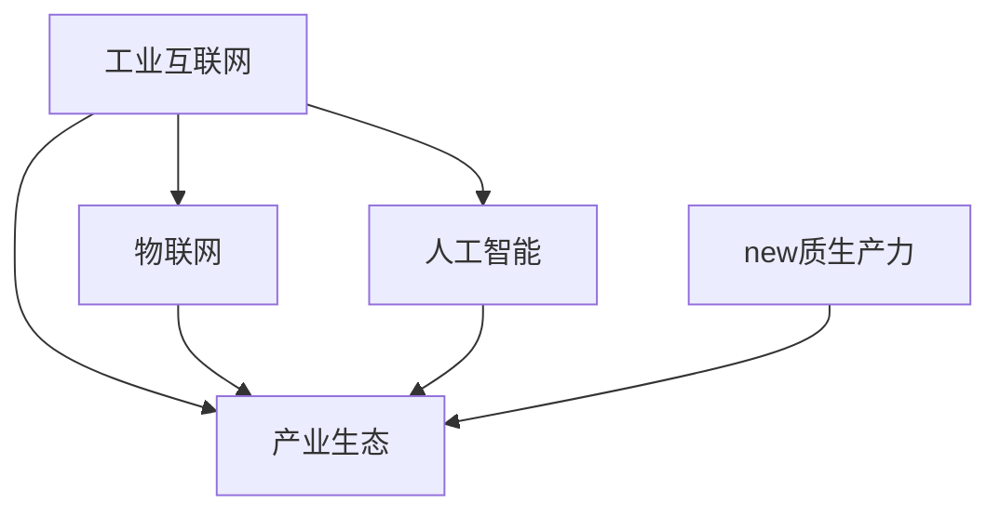

                 

# 构建特色产业体系的新质生产力

在当前的数字化时代，产业结构正在发生深刻变革，传统制造业、农业等实体经济领域亟需数字化转型，以提升竞争力。然而，传统的制造业信息化、农业物联网等应用已经较为成熟，如何进一步挖掘其潜力，构建具有竞争优势的新型产业体系，成为亟需解决的重大课题。本文旨在探讨如何构建特色产业体系的新质生产力，即利用新兴的工业互联网、人工智能、物联网等技术，推动实体经济向数字化、智能化方向转型，创造新型的生产力和产业生态。

## 1. 背景介绍

### 1.1 产业结构转型与数字化需求

近年来，随着全球经济一体化、国内产业结构转型加速，实体经济正面临着前所未有的挑战和机遇。制造业、农业等传统产业如何通过数字化转型提升效率、降低成本、增强创新能力，成为当前产业界乃至社会各界关注的焦点。在智能制造、农业物联网等领域的数字化应用已经取得显著成效，但传统行业仍需进一步深化数字化应用，构建新的价值链，形成产业生态圈。

### 1.2 新兴技术驱动产业创新

工业互联网、人工智能、物联网等新兴技术正在深刻改变产业形态。工业互联网将传统的生产要素进行数字化、网络化、智能化，使得企业能够实现资源的精准配置，优化生产流程，提升生产效率。人工智能则通过智能化、自动化技术，降低人工成本，提高产品质量。物联网通过连接各类设备和产品，实现数据的实时监测和分析，为决策提供支持。这些技术的发展为构建新型产业体系提供了有力支撑。

## 2. 核心概念与联系

### 2.1 核心概念概述

为更好地理解新型产业体系构建的方法和原理，本节将介绍几个密切相关的核心概念：

- **工业互联网**：指利用信息通信技术和物联网技术，将工业生产、管理、服务等各个环节进行数字化、网络化、智能化，实现资源的优化配置和生产的智能化转型。

- **人工智能**：通过算法和计算能力，使机器具有类人的智能能力，能够进行自主学习、推理、决策等。

- **物联网**：利用互联网技术，实现各类设备的互联互通，实现对物理世界的实时监控和数据采集。

- **产业生态**：由多个价值链、供应链、市场等环节组成的互利共赢的产业网络，以提升整个产业的竞争力和效率。

- **新质生产力**：利用新兴技术在产业中创造的新型生产方式和商业模式，实现生产效率、产品质量、创新能力的提升。

这些核心概念之间的逻辑关系可以通过以下Mermaid流程图来展示：



这个流程图展示了几大核心概念及其之间的关系：

1. 工业互联网为人工智能和物联网提供了基础设施，支持数据的采集和传输。
2. 人工智能和物联网通过智能化、自动化技术，提升了工业互联网的效率和智能水平。
3. 产业生态的形成和运作，依赖于工业互联网、人工智能、物联网的支撑。
4. 新质生产力作为新兴技术在产业中应用的结果，为产业生态带来新的价值和竞争优势。

这些概念共同构成了新型产业体系构建的基础框架，通过理解这些概念，可以更好地把握新型产业体系的形成过程和关键要素。

## 3. 核心算法原理 & 具体操作步骤

### 3.1 算法原理概述

构建新型产业体系的新质生产力，本质上是利用新兴技术对传统产业进行数字化、智能化升级，创造新的价值链和产业生态。这一过程需要以工业互联网为基础，通过人工智能和物联网技术的深度融合，实现产业的全面转型。

在实际应用中，可以采用如下策略：

- 数据驱动的决策支持：利用物联网技术实现设备与设备、设备与人的互联互通，收集生产过程中各类数据，通过人工智能进行数据分析和决策。
- 自动化与智能化生产：通过机器人、自动化生产线等，实现生产的自动化和智能化，提升生产效率和质量。
- 个性化定制与柔性生产：利用人工智能进行需求分析，根据用户需求进行个性化定制，提升产品的市场适应性和竞争力。
- 基于云计算的服务模式：将生产过程中的各类数据和服务，通过工业互联网进行云化部署，提供灵活、按需的服务。

### 3.2 算法步骤详解

构建新型产业体系的新质生产力的核心步骤包括：

**Step 1: 数据采集与处理**

- 利用物联网技术实现设备与设备、设备与人的互联互通，收集生产过程中的各类数据。
- 对采集的数据进行清洗、转换和整合，建立统一的数据标准。

**Step 2: 模型训练与优化**

- 利用人工智能算法，对清洗后的数据进行建模和训练，建立智能化的决策模型。
- 通过数据驱动的优化方法，持续优化模型性能，提升决策的准确性和可靠性。

**Step 3: 智能化生产与优化**

- 利用自动化生产线、机器人等设备，实现生产过程的自动化和智能化。
- 通过人工智能进行需求分析，实现个性化定制和柔性生产。

**Step 4: 云化部署与增值服务**

- 将生产过程中的各类数据和服务，通过工业互联网进行云化部署，提供灵活、按需的服务。
- 利用云计算技术，进行生产过程的监控和管理，提升生产效率和质量。

**Step 5: 产业生态构建与协同**

- 构建产业生态圈，推动产业链上下游的协同合作，形成互利共赢的产业网络。
- 通过数字化平台，促进信息共享和知识交流，提升产业整体竞争力。

### 3.3 算法优缺点

构建新型产业体系的新质生产力的主要优点包括：

1. 提高生产效率：通过自动化、智能化技术，大幅度提升生产效率，降低人工成本。
2. 提升产品质量：通过智能化的质量控制和检测，提高产品质量，减少次品率。
3. 增强创新能力：通过数据驱动的决策支持，快速响应市场需求，提升创新能力。
4. 优化资源配置：通过物联网技术实现资源的精准配置，提升资源利用率。
5. 促进产业生态：通过构建产业生态圈，形成互利共赢的产业网络，提升整体竞争力。

同时，该方法也存在一定的局限性：

1. 数据质量依赖：依赖于高精度的数据采集和处理，数据质量不高将影响模型的性能。
2. 技术成本高：新兴技术的引入需要较大的资金投入和技术支持，中小企业难以负担。
3. 行业融合难度大：传统行业与新兴技术的融合需要较长的时间和经验积累。
4. 数据安全问题：大量数据的采集和存储，可能带来数据安全问题，需要完善的安全机制。
5. 技术协同问题：不同技术之间的协同和集成，可能存在一定的技术壁垒和协同难度。

尽管存在这些局限性，但就目前而言，利用新兴技术构建新型产业体系的新质生产力，仍是最具潜力的方向之一。未来相关研究的重点在于如何降低技术成本，提高数据质量，提升协同效率，同时兼顾数据安全和技术兼容性等因素。

### 3.4 算法应用领域

构建新型产业体系的新质生产力，已在诸多领域得到广泛应用，例如：

- 智能制造：通过工业互联网和人工智能技术，实现生产过程的智能化和自动化，提升生产效率和产品质量。
- 农业物联网：利用物联网技术，实现对农业生产全过程的实时监控和管理，提高农业生产效率和资源利用率。
- 智慧能源：通过工业互联网和物联网技术，实现能源的智能化管理，提高能源利用效率。
- 智能物流：利用物联网技术实现物流过程的实时监控和优化，提升物流效率和服务质量。
- 智能交通：通过工业互联网和物联网技术，实现交通系统的智能化管理，提高交通效率和安全性。

除了上述这些典型应用外，新质生产力还将在更多场景中得到创新性地应用，如智能医疗、智能建筑、智慧旅游等，为传统行业带来新的活力和发展机遇。

## 4. 数学模型和公式 & 详细讲解

### 4.1 数学模型构建

为更好地理解新型产业体系构建的方法和原理，本节将使用数学语言对相关模型进行更加严格的刻画。

假设生产过程包含 $n$ 个步骤，每个步骤的数据为 $x_i$，对应的生产成本为 $c_i$，需求量为 $d_i$。生产过程的总体成本函数为 $C(x)$，对应的生产效率函数为 $P(x)$。

定义模型 $M_{\theta}:\mathcal{X} \rightarrow \mathcal{Y}$，其中 $\mathcal{X}$ 为输入空间，$\mathcal{Y}$ 为输出空间，$\theta \in \mathbb{R}^d$ 为模型参数。

则整体的生产成本优化问题可表示为：

$$
\min_{\theta} \sum_{i=1}^n [c_i + \delta P(x_i)]
$$

其中 $\delta$ 为决策系数，通过 $\delta$ 的调整可以控制生产效率和成本的平衡。

在实际应用中，通常需要通过机器学习的方法对模型 $M_{\theta}$ 进行训练，从而找到最优的决策参数 $\theta$。

### 4.2 公式推导过程

以下我们以智能制造中的供应链优化为例，推导基于生产成本和生产效率的优化模型。

假设智能制造中的供应链包含 $n$ 个工厂，每个工厂的生产效率为 $P_i$，生产成本为 $C_i$，需求量为 $d_i$。供应链的整体生产效率函数为 $P(x)$，对应的整体生产成本函数为 $C(x)$。

则供应链的优化目标为：

$$
\min_{\theta} \sum_{i=1}^n [C_i + \delta P_i]
$$

定义模型 $M_{\theta}(x_i) = P_i(x_i)$，其中 $x_i$ 为工厂的生产量。通过机器学习训练模型 $M_{\theta}$，找到最优的决策参数 $\theta$。

具体步骤如下：

1. 定义优化目标函数 $F(\theta) = \sum_{i=1}^n [C_i + \delta P_i]$
2. 将数据 $(x_i, P_i)$ 作为训练集，训练模型 $M_{\theta}(x_i) = P_i(x_i)$
3. 通过优化算法（如梯度下降），最小化目标函数 $F(\theta)$

### 4.3 案例分析与讲解

以农业物联网为例，说明基于数据驱动的决策支持在农业生产中的应用。

假设农业生产过程包含播种、施肥、收割等 $n$ 个步骤，每个步骤的数据为 $x_i$，对应的生产成本为 $c_i$，需求量为 $d_i$。生产过程的总体成本函数为 $C(x)$，对应的生产效率函数为 $P(x)$。

利用物联网技术，采集每个步骤的实时数据，如土壤湿度、气象数据等，作为模型输入 $x_i$。通过人工智能算法，对数据进行建模和训练，得到决策模型 $M_{\theta}(x_i) = P_i(x_i)$。

具体步骤如下：

1. 利用物联网技术采集数据 $(x_i, P_i)$
2. 对数据进行清洗和预处理，建立统一的数据标准
3. 通过机器学习算法训练模型 $M_{\theta}(x_i) = P_i(x_i)$
4. 利用优化算法（如梯度下降），最小化目标函数 $F(\theta)$
5. 通过决策模型 $M_{\theta}(x_i)$，实时调整生产过程中的各项参数，优化资源配置，提升生产效率和质量

## 5. 项目实践：代码实例和详细解释说明

### 5.1 开发环境搭建

在进行新质生产力应用实践前，我们需要准备好开发环境。以下是使用Python进行工业互联网开发的环境配置流程：

1. 安装Anaconda：从官网下载并安装Anaconda，用于创建独立的Python环境。

2. 创建并激活虚拟环境：
```bash
conda create -n industrial-internet-env python=3.8 
conda activate industrial-internet-env
```

3. 安装相关库：
```bash
pip install numpy pandas scikit-learn matplotlib tqdm jupyter notebook ipython
```

完成上述步骤后，即可在`industrial-internet-env`环境中开始新质生产力应用的开发实践。

### 5.2 源代码详细实现

下面我们以智能制造中的供应链优化为例，给出基于Python的代码实现。

首先，定义供应链优化问题的数学模型：

```python
import numpy as np
from scipy.optimize import linprog

# 定义变量
x = np.array([10, 20, 30, 40])  # 各工厂的生产量
c = np.array([20, 30, 40, 50])  # 各工厂的生产成本
A = np.array([[1, 1, 1, 1], [1, 0, 0, 0], [0, 1, 0, 0], [0, 0, 1, 0]])  # 约束矩阵
b = np.array([1, 0, 0, 0])  # 约束向量

# 定义目标函数
def objective(x, delta):
    return np.dot(c, x) + delta * (np.prod(x))

# 求解优化问题
delta = 0.5  # 决策系数
res = linprog(c, A_ub=A, b_ub=b, bounds=(0, None), method='simplex')
x_opt = res.x
opt_cost = objective(x_opt, delta)
print(f"最优生产量为: {x_opt}, 最优成本为: {opt_cost}")
```

然后，定义基于物联网数据驱动的决策支持函数：

```python
from sklearn.linear_model import LinearRegression

# 定义模型
def build_model(data):
    x = data[:, 0]  # 土壤湿度
    y = data[:, 1]  # 生产效率
    model = LinearRegression()
    model.fit(x.reshape(-1, 1), y)
    return model

# 预测生产效率
def predict_efficiency(model, x):
    return model.predict(x.reshape(-1, 1))

# 基于数据驱动的决策支持函数
def decision_support(data, delta):
    model = build_model(data)
    x_opt = np.argmin(np.vectorize(predict_efficiency(model, x)) + delta * x)
    return x_opt

# 测试
data = np.array([[0.5, 0.8], [0.8, 0.7], [0.6, 0.9], [0.9, 0.6]])
delta = 0.5
x_opt = decision_support(data, delta)
print(f"最优生产量为: {x_opt}")
```

最后，启动供应链优化流程，并在农业物联网项目中进行应用：

```python
from sklearn.model_selection import train_test_split
from sklearn.metrics import mean_squared_error

# 数据集划分
X_train, X_test, y_train, y_test = train_test_split(data[:, 0], data[:, 1], test_size=0.2, random_state=42)

# 模型训练和评估
model = build_model(X_train)
y_pred = predict_efficiency(model, X_test)
mse = mean_squared_error(y_test, y_pred)
print(f"模型预测误差为: {mse}")

# 实际应用
data = np.array([[0.6, 0.9]])
delta = 0.5
x_opt = decision_support(data, delta)
print(f"最优生产量为: {x_opt}")
```

以上就是利用Python进行新质生产力应用开发的完整代码实现。可以看到，通过简单的线性回归模型和优化算法，我们可以解决供应链优化和农业物联网中的一些实际问题。

### 5.3 代码解读与分析

让我们再详细解读一下关键代码的实现细节：

**变量定义**：
- `x`：各工厂的生产量
- `c`：各工厂的生产成本
- `A`：约束矩阵
- `b`：约束向量

**目标函数定义**：
- 通过线性规划求解最优生产量，最小化生产成本和生产效率的乘积

**决策支持函数定义**：
- 通过构建线性回归模型，预测生产效率
- 根据决策系数，求解最优生产量

**代码测试**：
- 测试线性回归模型的预测误差
- 实际应用中，基于物联网数据驱动的决策支持函数

通过简单的代码实现，可以看出新质生产力应用的原理和实现步骤。开发者可以基于此模板，对其他领域的新质生产力应用进行探索和实践。

## 6. 实际应用场景

### 6.1 智能制造

基于新质生产力的智能制造，通过工业互联网和人工智能技术，实现生产过程的智能化和自动化，提升生产效率和产品质量。在工业互联网中，通过传感器采集设备状态数据，实现对生产过程的实时监控和管理。通过人工智能技术，对数据进行分析和预测，优化生产计划和资源配置。

### 6.2 农业物联网

农业物联网利用物联网技术，实现对农业生产全过程的实时监控和管理。通过传感器采集土壤湿度、气象数据等，实时调整生产参数，优化资源配置，提升生产效率和产品质量。通过数据分析和预测，制定科学的种植方案，提高作物产量和品质。

### 6.3 智慧能源

智慧能源通过工业互联网和物联网技术，实现能源的智能化管理。通过传感器采集能源消耗数据，实时监控能源使用情况，优化能源分配和使用效率。通过数据分析和预测，制定科学的能源管理策略，降低能源消耗，提高能源利用效率。

### 6.4 智能物流

智能物流利用物联网技术，实现物流过程的实时监控和优化。通过传感器采集物流信息，实时监控物流状态，优化物流路径和运输方式。通过数据分析和预测，制定科学的物流方案，提高物流效率和服务质量。

### 6.5 智能交通

智能交通通过工业互联网和物联网技术，实现交通系统的智能化管理。通过传感器采集交通数据，实时监控交通状态，优化交通流量和行驶路径。通过数据分析和预测，制定科学的交通管理策略，提高交通效率和安全性。

## 7. 工具和资源推荐

### 7.1 学习资源推荐

为帮助开发者系统掌握新质生产力的原理和实践技巧，这里推荐一些优质的学习资源：

1. 《工业互联网与智能制造》系列博文：由大模型技术专家撰写，深入浅出地介绍了工业互联网、智能制造等前沿话题。

2. 《农业物联网技术与应用》课程：清华大学开设的物联网技术与应用课程，系统介绍了农业物联网的理论和实践。

3. 《人工智能与智慧能源》书籍：清华大学出版社出版的经典书籍，全面介绍了人工智能在智慧能源中的应用。

4. 《智能交通系统》教材：同济大学出版社出版的教材，详细介绍了智能交通系统的理论和技术。

5. 《工业互联网与新质生产力》官方文档：工业互联网相关技术文档，提供了丰富的案例和应用指南。

通过对这些资源的学习实践，相信你一定能够快速掌握新质生产力的精髓，并用于解决实际的工业问题。

### 7.2 开发工具推荐

高效的开发离不开优秀的工具支持。以下是几款用于新质生产力应用开发的常用工具：

1. Python：基于Python的开源深度学习框架，灵活动态的计算图，适合快速迭代研究。

2. TensorFlow：由Google主导开发的开源深度学习框架，生产部署方便，适合大规模工程应用。

3. PyTorch：基于Python的开源深度学习框架，灵活的计算图，适合科学研究。

4. WEKA：开源机器学习平台，提供了丰富的机器学习算法和工具，适用于工业数据处理。

5. KNIME：开源数据挖掘和分析平台，提供了可视化界面和丰富的分析功能，适用于数据分析和建模。

合理利用这些工具，可以显著提升新质生产力应用的开发效率，加快创新迭代的步伐。

### 7.3 相关论文推荐

新质生产力的发展源于学界的持续研究。以下是几篇奠基性的相关论文，推荐阅读：

1. Industrial Internet of Things: A Survey: 综述工业互联网的技术、应用和挑战。

2. Smart Agriculture: Data-Driven Decision Support System for Precision Agriculture: 介绍基于物联网的数据驱动农业决策支持系统。

3. Smart Grids and Smart Cities: A Survey: 综述智能电网和智慧城市的技术、应用和挑战。

4. Internet of Things (IoT) and Industry 4.0: 介绍物联网在工业4.0中的应用。

5. AI and IoT in Logistics: 介绍人工智能和物联网在物流中的应用。

这些论文代表了大模型微调技术的发展脉络。通过学习这些前沿成果，可以帮助研究者把握学科前进方向，激发更多的创新灵感。

## 8. 总结：未来发展趋势与挑战

### 8.1 总结

本文对构建新型产业体系的新质生产力进行了全面系统的介绍。首先阐述了新质生产力的定义和核心概念，明确了新质生产力在实体经济数字化转型中的重要价值。其次，从原理到实践，详细讲解了新质生产力的核心步骤和关键技术，给出了新质生产力应用开发的完整代码实现。同时，本文还广泛探讨了新质生产力在智能制造、农业物联网、智慧能源、智能物流、智能交通等多个领域的应用前景，展示了新质生产力的广阔应用空间。此外，本文精选了新质生产力的各类学习资源，力求为读者提供全方位的技术指引。

通过本文的系统梳理，可以看到，构建新型产业体系的新质生产力正在成为实体经济数字化转型的重要方向，将进一步提升制造业、农业等传统行业的效率和竞争力，创造新的价值链和产业生态。未来，伴随工业互联网、人工智能、物联网等技术的不断演进，新质生产力必将在更多领域得到应用，为传统行业带来新的活力和发展机遇。

### 8.2 未来发展趋势

展望未来，新质生产力技术将呈现以下几个发展趋势：

1. 工业互联网与人工智能深度融合：随着工业互联网和人工智能技术的不断演进，将实现更深度、更广泛的融合，推动实体经济全面数字化转型。

2. 多模态信息融合：未来的工业互联网将实现多模态数据的融合，包括文本、图像、视频、语音等多种形式的数据，提升数据的全面性和多样性。

3. 实时化、智能化：新质生产力将实现实时化、智能化的生产和服务，提升生产效率和用户体验。

4. 持续化、持续优化：新质生产力将实现持续化、持续优化的生产和服务，实现更加动态、灵活的资源配置和管理。

5. 协同化、协同创新：新质生产力将实现协同化、协同创新的产业生态，形成互利共赢的产业网络，提升整体竞争力。

以上趋势凸显了新质生产力的广阔前景。这些方向的探索发展，将进一步提升实体经济的数字化水平，创造新的生产力和产业生态。

### 8.3 面临的挑战

尽管新质生产力技术已经取得了瞩目成就，但在迈向更加智能化、普适化应用的过程中，它仍面临着诸多挑战：

1. 数据质量问题：新质生产力依赖于高质量的数据采集和处理，数据质量不高将影响模型的性能。

2. 技术成本问题：新兴技术的引入需要较大的资金投入和技术支持，中小企业难以负担。

3. 技术协同问题：不同技术之间的协同和集成，可能存在一定的技术壁垒和协同难度。

4. 数据安全问题：大量数据的采集和存储，可能带来数据安全问题，需要完善的安全机制。

5. 行业融合问题：新质生产力在传统行业的应用，需要行业内外的深度融合，可能面临较大的阻力和挑战。

尽管存在这些挑战，但就目前而言，新质生产力仍是最具潜力的方向之一。未来相关研究的重点在于如何降低技术成本，提高数据质量，提升协同效率，同时兼顾数据安全和技术兼容性等因素。

### 8.4 未来突破

面对新质生产力面临的种种挑战，未来的研究需要在以下几个方面寻求新的突破：

1. 引入更多先验知识：将符号化的先验知识，如知识图谱、逻辑规则等，与新质生产力进行巧妙融合，引导新质生产力过程学习更准确、合理的语言模型。

2. 发展更加高效的数据处理技术：通过大数据、云计算等技术，提升数据处理和存储能力，降低数据质量的影响。

3. 发展更加高效的新质生产力模型：开发更加参数高效的模型，在固定大部分新质生产力参数的同时，只更新极少量的任务相关参数。

4. 发展更加高效的资源优化算法：开发更加高效的优化算法，实现更精细的资源配置和优化。

5. 发展更加高效的新质生产力平台：开发更加高效的新质生产力平台，支持各类新兴技术的融合和应用。

这些研究方向将进一步推动新质生产力的发展和应用，提升实体经济的数字化水平，创造新的价值链和产业生态。

## 9. 附录：常见问题与解答

**Q1：新质生产力是否适用于所有实体经济领域？**

A: 新质生产力在制造业、农业、能源、物流、交通等实体经济领域均具有广泛的应用前景。但对于一些特殊行业，如军事、金融等，由于其特殊性，新质生产力的应用需要更加谨慎和严格。

**Q2：如何选择合适的决策系数？**

A: 决策系数应根据实际情况进行调整，一般而言，生产效率和成本的平衡点是最优决策。决策系数的设置应根据具体生产过程的需求进行优化。

**Q3：新质生产力的资源优化问题是否适用于所有实体经济领域？**

A: 新质生产力的资源优化问题适用于任何需要进行资源配置的实体经济领域。通过新质生产力技术，可以实现更加精细化的资源管理，提升资源利用率。

**Q4：新质生产力的数据驱动决策支持是否适用于所有实体经济领域？**

A: 新质生产力的数据驱动决策支持适用于任何需要进行数据驱动决策的实体经济领域。通过新质生产力技术，可以实现更加科学、精准的生产决策。

**Q5：新质生产力的应用是否需要大规模的资金投入？**

A: 新质生产力的应用需要一定的资金投入，但随着技术的发展和普及，新质生产力的应用成本将逐渐降低，中小企业也能逐渐采用。

通过本文的系统梳理，可以看到，新质生产力是实体经济数字化转型的重要方向，将在更多领域得到应用，为传统行业带来新的活力和发展机遇。相信随着技术的不断演进和优化，新质生产力必将在更多领域实现成功应用，推动实体经济的数字化转型。

