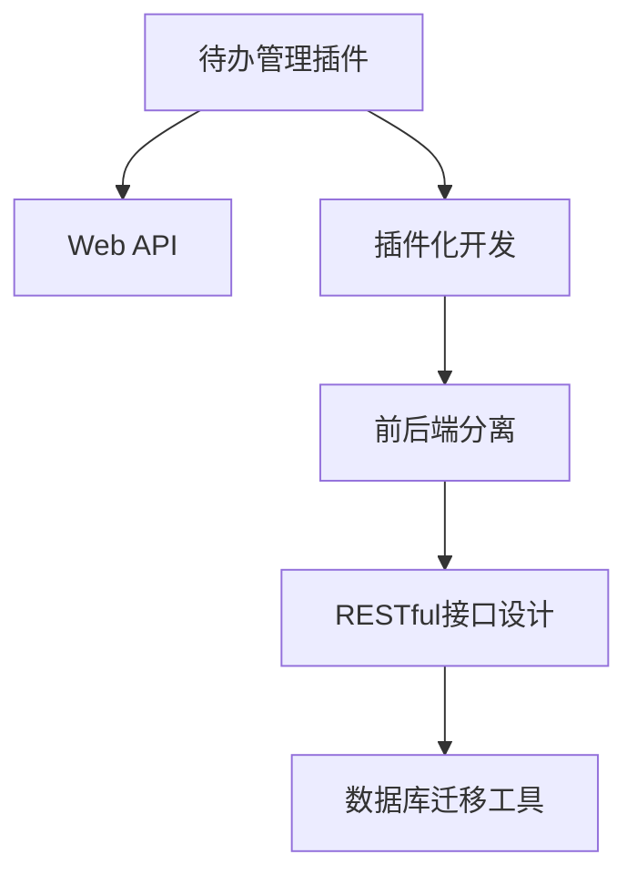

                 

# 样例项目: 待办 (Todo) 管理插件

## 1. 背景介绍

### 1.1 问题由来
在当今快节奏的工作和生活环境中，有效的时间管理和任务管理变得至关重要。待办事项管理工具帮助用户规划每日工作、设置长期目标、跟踪项目进度等，极大地提高了工作效率和生活质量。然而，现有的待办管理工具功能单一、定制性差，用户需求难以满足。开发一款功能强大、可定制的待办管理插件，成为一种迫切需求。

### 1.2 问题核心关键点
本项目旨在设计并开发一款基于Web的待办管理插件，支持用户创建、编辑、分类、标注和管理待办事项。插件需要支持多用户、多角色、多语言，提供API接口与第三方应用集成，并且具备高度的自定义和扩展性。

### 1.3 问题研究意义
开发一个待办管理插件，不仅可以帮助用户有效管理个人和团队任务，提高工作效率，还能为企业内部的知识共享和项目管理提供重要支持。通过使用插件化开发，可以快速迭代和升级产品功能，适应不断变化的业务需求。

## 2. 核心概念与联系

### 2.1 核心概念概述

为了更好地理解待办管理插件的核心设计思想，本节将介绍几个关键概念：

- 待办管理插件(Todo Plugin)：基于Web开发的小型应用，通过插件机制集成到主流Web应用中，提供待办事项管理功能。
- Web API：插件与后台管理系统进行数据交互的接口，通常采用RESTful架构设计。
- 插件化开发(Plug-in Development)：将插件作为独立组件进行开发，可单独部署、更新和卸载。
- 前后端分离(Frontend-Backend Separation)：前端页面与后端业务逻辑分离，有利于提高代码复用性和系统扩展性。
- RESTful接口设计：采用资源导向的Web API设计方法，使接口更加清晰、易于维护。
- 数据库迁移工具(Data Migration Tool)：用于在不同数据库版本间迁移数据，保持数据兼容性。

这些概念之间的逻辑关系可以通过以下Mermaid流程图来展示：



这个流程图展示了好待办管理插件的核心概念及其之间的关系：

1. 待办管理插件通过Web API与后端管理系统进行数据交互。
2. 插件采用插件化开发，便于独立部署和更新。
3. 前后端分离设计提升了代码复用性和系统可扩展性。
4. RESTful接口设计使接口更加清晰易用。
5. 数据库迁移工具保证了数据在不同版本间的一致性。

这些概念共同构成了待办管理插件的设计框架，为其提供了一致、可扩展、易维护的基础。

## 3. 核心算法原理 & 具体操作步骤
### 3.1 算法原理概述

待办管理插件的核心功能包括待办事项的创建、编辑、分类、标注、删除等操作。其算法原理基于以下设计：

1. **数据模型设计**：定义待办事项的数据模型，包括ID、创建者、创建时间、截止时间、标题、描述、状态、标签等属性。
2. **API接口设计**：设计Web API接口，支持用户通过Web页面进行操作，包括增删改查、批处理、通知等功能。
3. **状态机设计**：定义待办事项的状态和状态转移规则，如新建、进行中、已完成等状态。
4. **标签分类设计**：设计标签分类体系，支持用户自定义标签，方便管理。
5. **权限控制设计**：定义不同用户角色的权限，支持管理员、普通用户等多种角色，限制操作权限。

### 3.2 算法步骤详解

待办管理插件的设计和开发过程主要包括以下几个关键步骤：

**Step 1: 需求分析与规划**
- 明确待办管理插件的功能需求，包括用户管理、待办事项管理、角色权限控制等。
- 设计插件的数据模型，确定字段类型、索引、约束等。
- 制定插件的开发计划，包括功能实现、UI设计、性能优化等。

**Step 2: 前端页面开发**
- 设计待办管理插件的UI界面，包括列表页、详细页、编辑页等。
- 实现前端页面的功能逻辑，包括表单验证、数据绑定、用户交互等。
- 使用JavaScript框架如React、Vue.js等进行页面开发。

**Step 3: 后端服务开发**
- 设计Web API接口，采用RESTful架构设计，定义接口请求方法和返回格式。
- 实现API接口的业务逻辑，包括待办事项的增删改查、状态转换、标签管理等。
- 使用Node.js、Django等后端框架进行服务开发。

**Step 4: 数据迁移与兼容性**
- 设计数据库迁移工具，用于将旧数据迁移到新数据库中。
- 实现数据迁移的自动脚本，确保数据在不同版本间的一致性。
- 使用数据库迁移工具如Flyway、Liquibase等进行数据迁移管理。

**Step 5: 集成与测试**
- 将待办管理插件集成到目标Web应用中，并进行功能测试和性能测试。
- 使用单元测试、集成测试、压力测试等方法，确保插件的稳定性和性能。
- 进行安全测试，确保插件的安全性，避免漏洞和攻击。

**Step 6: 部署与监控**
- 将待办管理插件部署到目标Web服务器中，并进行运行监控。
- 使用日志和监控工具如ELK Stack、Prometheus等，监控插件的运行状态和性能。
- 定期更新插件，修复漏洞，提升性能。

### 3.3 算法优缺点

待办管理插件的设计具有以下优点：

1. **可扩展性强**：采用插件化开发，便于添加新功能，提升系统灵活性。
2. **易维护**：前后端分离设计，前端页面与后端业务逻辑分离，便于维护和升级。
3. **易集成**：通过Web API接口与第三方应用集成，灵活适应不同场景需求。
4. **用户友好**：界面简洁直观，操作便捷，提升用户体验。
5. **安全性高**：定义角色权限控制，限制用户操作权限，确保数据安全。

同时，插件也存在以下缺点：

1. **依赖性强**：需要依赖第三方Web应用进行部署，不独立运行。
2. **性能瓶颈**：插件作为Web应用的一个子模块，性能受Web应用整体影响。
3. **兼容性问题**：不同版本的Web应用可能存在兼容性问题，需要开发相应的兼容性解决方案。
4. **资源消耗大**：插件运行需要占用Web应用服务器资源，可能影响系统性能。

### 3.4 算法应用领域

待办管理插件在多个领域具有广泛的应用前景，包括但不限于：

- 企业项目管理：支持项目进度管理、任务分配、团队协作等功能，提高项目管理效率。
- 个人时间管理：帮助用户规划每日任务、设置长期目标、跟踪任务进度，提升个人时间管理能力。
- 教育培训：支持课程安排、作业管理、考试提醒等功能，方便教师和学生管理教学资源。
- 金融理财：支持理财计划、支出记录、投资提醒等功能，提升财务规划和管理能力。

## 4. 数学模型和公式 & 详细讲解 & 举例说明
### 4.1 数学模型构建

待办管理插件的数学模型主要基于待办事项的数据结构和状态机。待办事项的数据模型可以表示为：

- ID: 待办事项的唯一标识符。
- 创建者: 创建待办事项的用户ID。
- 创建时间: 待办事项的创建时间戳。
- 截止时间: 待办事项的截止时间戳。
- 标题: 待办事项的标题。
- 描述: 待办事项的详细描述。
- 状态: 待办事项的状态，如新建、进行中、已完成等。
- 标签: 待办事项的标签，用于分类管理。

待办事项的状态机可以表示为：

- NEW: 待办事项刚创建，未进行任何操作。
- IN_PROGRESS: 待办事项正在进行中。
- COMPLETED: 待办事项已完成。

状态转移规则如下：

- 新建状态(NEW)的用户可以修改状态为进行中(IN_PROGRESS)。
- 进行中状态(IN_PROGRESS)的用户可以修改状态为已完成(COMPLETED)。
- 已完成状态(COMPLETED)的用户不能修改状态。

### 4.2 公式推导过程

待办事项的状态机可以用有限状态机(Finite State Machine, FSM)来描述。一个待办事项的状态转移可以用如下公式表示：

$$
\sigma = \{\sigma_1, \sigma_2, \sigma_3\}
$$

其中，$\sigma_1$ 表示新建状态(NEW)，$\sigma_2$ 表示进行中状态(IN_PROGRESS)，$\sigma_3$ 表示已完成状态(COMPLETED)。状态转移规则可以用转移矩阵表示：

$$
A = \begin{bmatrix}
1 & 0 & 0 \\
0 & 1 & 0 \\
0 & 0 & 0 
\end{bmatrix}
$$

其中，第一行表示新建状态(NEW)的用户可以修改为进行中状态(IN_PROGRESS)，第二行表示进行中状态(IN_PROGRESS)的用户可以修改为已完成状态(COMPLETED)，第三行表示已完成状态(COMPLETED)的用户不能修改状态。

### 4.3 案例分析与讲解

以下是一个待办事项状态转移的案例分析：

假设某用户创建了一个待办事项，初始状态为新建状态(NEW)。经过一段时间的执行，用户修改了该待办事项的状态为进行中状态(IN_PROGRESS)。然后，用户再次修改状态为已完成状态(COMPLETED)。此时，状态转移矩阵的计算如下：

$$
\sigma_1 \rightarrow \sigma_2
$$

$$
\sigma_2 \rightarrow \sigma_3
$$

最终，待办事项的状态变为已完成状态(COMPLETED)，无法再修改为其他状态。

## 5. 项目实践：代码实例和详细解释说明
### 5.1 开发环境搭建

在进行待办管理插件的开发前，我们需要准备好开发环境。以下是使用Node.js进行前后端开发的环境配置流程：

1. 安装Node.js和npm：
   - 从官网下载并安装Node.js和npm，确保版本为最新。

2. 创建项目目录和package.json文件：
   ```bash
   mkdir todo-plugin
   cd todo-plugin
   touch package.json
   ```

3. 初始化项目并安装依赖：
   ```bash
   npm init -y
   npm install express mongoose react react-dom
   ```

4. 创建后端API服务：
   ```bash
   npm init -y
   npm install express mongoose react react-dom
   ```

5. 创建前端页面：
   ```bash
   npm init -y
   npm install react react-dom react-router-dom
   ```

6. 配置数据库连接：
   - 在后端服务中配置MongoDB连接。
   - 在React应用中配置Axios请求。

完成上述步骤后，即可在`todo-plugin`环境中开始开发。

### 5.2 源代码详细实现

下面我们以待办事项的增删改查功能为例，给出使用Node.js和Express框架进行后端API开发的PyTorch代码实现。

**待办事项模型定义**：
```javascript
const mongoose = require('mongoose');

const todoSchema = new mongoose.Schema({
  title: String,
  description: String,
  state: String,
  createdBy: String,
  createdAt: Date,
  dueDate: Date,
  labels: [String]
});

module.exports = mongoose.model('Todo', todoSchema);
```

**待办事项API接口**：
```javascript
const express = require('express');
const router = express.Router();
const Todo = require('../models/Todo');

// 创建待办事项
router.post('/todos', async (req, res) => {
  const { title, description, state, createdBy, dueDate, labels } = req.body;
  const todo = new Todo({
    title,
    description,
    state,
    createdBy,
    createdAt: new Date(),
    dueDate,
    labels
  });
  await todo.save();
  res.status(201).json(todo);
});

// 获取待办事项列表
router.get('/todos', async (req, res) => {
  const todos = await Todo.find();
  res.json(todos);
});

// 获取待办事项详情
router.get('/todos/:id', async (req, res) => {
  const todo = await Todo.findById(req.params.id);
  res.json(todo);
});

// 更新待办事项
router.put('/todos/:id', async (req, res) => {
  const { title, description, state, dueDate, labels } = req.body;
  const todo = await Todo.findByIdAndUpdate(req.params.id, {
    title,
    description,
    state,
    dueDate,
    labels
  }, { new: true });
  res.json(todo);
});

// 删除待办事项
router.delete('/todos/:id', async (req, res) => {
  const todo = await Todo.findByIdAndDelete(req.params.id);
  res.json(todo);
});

module.exports = router;
```

**前端页面实现**：
```javascript
import React, { useState, useEffect } from 'react';
import axios from 'axios';

const TodoForm = () => {
  const [title, setTitle] = useState('');
  const [description, setDescription] = useState('');
  const [state, setState] = useState('');
  const [dueDate, setDueDate] = useState('');
  const [labels, setLabels] = useState([]);
  const [todos, setTodos] = useState([]);

  useEffect(() => {
    axios.get('/todos')
      .then(response => {
        setTodos(response.data);
      })
      .catch(error => {
        console.error(error);
      });
  }, []);

  const handleSubmit = async (event) => {
    event.preventDefault();
    const newTodo = {
      title,
      description,
      state,
      createdBy: 'user1',
      dueDate,
      labels
    };
    axios.post('/todos', newTodo)
      .then(response => {
        setTodos([...todos, response.data]);
      })
      .catch(error => {
        console.error(error);
      });
  };

  return (
    <div>
      <h1>Todo List</h1>
      <form onSubmit={handleSubmit}>
        <label>
          Title:
          <input type="text" value={title} onChange={event => setTitle(event.target.value)} />
        </label>
        <label>
          Description:
          <textarea value={description} onChange={event => setDescription(event.target.value)} />
        </label>
        <label>
          State:
          <select value={state} onChange={event => setState(event.target.value)}>
            <option value="NEW">NEW</option>
            <option value="IN_PROGRESS">IN_PROGRESS</option>
            <option value="COMPLETED">COMPLETED</option>
          </select>
        </label>
        <label>
          Due Date:
          <input type="date" value={dueDate} onChange={event => setDueDate(event.target.value)} />
        </label>
        <label>
          Labels:
          <input type="text" placeholder="Label 1, Label 2..." onChange={event => setLabels(event.target.value.split(','))} />
        </label>
        <button type="submit">Add Todo</button>
      </form>
      <ul>
        {todos.map(todo => (
          <li key={todo._id}>
            <h3>{todo.title}</h3>
            <p>{todo.description}</p>
            <p>State: {todo.state}</p>
            <p>Due Date: {todo.dueDate}</p>
            <p>Labels: {todo.labels.join(', ')}</p>
          </li>
        ))}
      </ul>
    </div>
  );
};

export default TodoForm;
```

### 5.3 代码解读与分析

让我们再详细解读一下关键代码的实现细节：

**待办事项模型定义**：
- 使用Mongoose定义待办事项的数据模型，包括标题、描述、状态、创建者、创建时间、截止时间和标签等属性。

**待办事项API接口**：
- 定义创建、获取、更新和删除待办事项的API接口。
- 使用Express框架实现HTTP请求处理，并调用Mongoose进行数据操作。
- 接口返回JSON格式的数据，便于前端页面进行数据绑定。

**前端页面实现**：
- 使用React进行前端页面开发，实现待办事项的增删改查功能。
- 使用Axios进行HTTP请求，调用后端API获取和更新待办事项数据。
- 页面采用表单和列表形式展示待办事项，支持用户输入和修改。

## 6. 实际应用场景
### 6.1 智能待办管理插件

智能待办管理插件可以嵌入到个人时间管理应用中，提供智能化的待办事项推荐和分类管理功能。通过分析用户的历史操作记录和行为数据，智能插件能够自动推荐待办事项，帮助用户高效规划任务。

**功能特点**：
- 自动推荐待办事项：根据用户的历史操作记录和行为数据，智能推荐待办事项，提升用户工作效率。
- 分类管理：支持用户自定义标签，方便分类管理和查询。
- 优先级设置：用户可以设置待办事项的优先级，智能插件根据优先级进行排序展示。
- 时间管理：支持用户设置截止时间和提醒时间，提醒用户按时完成任务。

**应用场景**：
- 企业内部项目管理：支持项目进度管理、任务分配、团队协作等功能，提高项目管理效率。
- 个人时间管理：帮助用户规划每日任务、设置长期目标、跟踪任务进度，提升个人时间管理能力。

### 6.2 企业内部协同管理插件

企业内部协同管理插件可以将待办事项管理功能集成到企业内部的协同工具中，支持跨部门、跨团队的协作管理。通过待办事项的共享和协作，提升团队工作效率和协作效果。

**功能特点**：
- 跨部门协作：支持不同部门之间的任务共享和协作，提升团队协作效率。
- 角色权限控制：支持管理员、普通用户等多种角色，限制操作权限，确保数据安全。
- 任务分类管理：支持用户自定义任务分类，方便管理。
- 任务优先级设置：支持用户设置任务优先级，智能插件根据优先级进行排序展示。

**应用场景**：
- 企业项目管理：支持项目进度管理、任务分配、团队协作等功能，提高项目管理效率。
- 企业内部协同：支持跨部门、跨团队的协作管理，提升团队工作效率。

### 6.3 教育培训管理插件

教育培训管理插件可以将待办事项管理功能集成到教育培训管理系统中，支持课程安排、作业管理、考试提醒等功能，方便教师和学生管理教学资源。

**功能特点**：
- 课程安排管理：支持教师和学生管理课程安排，方便教学和学习。
- 作业管理：支持教师发布作业，学生完成作业，并查看作业提交状态。
- 考试提醒：支持教师设置考试提醒时间，智能插件提醒学生按时完成考试。
- 成绩管理：支持教师查看和分析学生成绩，生成报表。

**应用场景**：
- 教育培训管理：支持课程安排、作业管理、考试提醒等功能，方便教师和学生管理教学资源。

### 6.4 金融理财管理插件

金融理财管理插件可以将待办事项管理功能集成到金融理财应用中，支持理财计划、支出记录、投资提醒等功能，提升财务规划和管理能力。

**功能特点**：
- 理财计划管理：支持用户管理理财计划，自动生成财务报表。
- 支出记录：支持用户记录支出，智能插件分析支出情况，提供优化建议。
- 投资提醒：支持用户设置投资提醒时间，智能插件提醒用户按时投资。
- 财务报表：支持用户查看和分析财务报表，生成财务分析报告。

**应用场景**：
- 金融理财管理：支持理财计划、支出记录、投资提醒等功能，提升财务规划和管理能力。

## 7. 工具和资源推荐
### 7.1 学习资源推荐

为了帮助开发者系统掌握待办管理插件的理论基础和实践技巧，这里推荐一些优质的学习资源：

1. Node.js官方文档：提供全面的Node.js学习资料，包括教程、API文档、开发工具等。
2. Express框架文档：提供详细的Express框架学习资料，包括教程、API文档、中间件等。
3. Mongoose文档：提供详细的Mongoose文档，包括教程、API文档、查询操作等。
4. React官方文档：提供全面的React学习资料，包括教程、API文档、组件开发等。
5. Vue.js官方文档：提供全面的Vue.js学习资料，包括教程、API文档、组件开发等。

通过对这些资源的学习实践，相信你一定能够快速掌握待办管理插件的开发技巧，并用于解决实际的待办管理问题。

### 7.2 开发工具推荐

高效的开发离不开优秀的工具支持。以下是几款用于待办管理插件开发的常用工具：

1. Visual Studio Code：一款轻量级、功能强大的代码编辑器，支持多种语言和框架。
2. Git：一款版本控制系统，支持多人协作开发和代码版本控制。
3. Postman：一款API测试工具，方便进行API接口测试和调试。
4. Docker：一款容器化技术，方便开发和部署Web应用。
5. JIRA：一款项目管理工具，支持任务管理、进度跟踪、协作等功能。

合理利用这些工具，可以显著提升待办管理插件的开发效率，加快创新迭代的步伐。

### 7.3 相关论文推荐

待办管理插件的研究源于学界的持续研究。以下是几篇奠基性的相关论文，推荐阅读：

1. "Project Management with Reactive Components"：介绍如何使用React组件进行项目管理。
2. "A Taxonomy of Personal Information Management Tools"：分析了个人信息管理的工具和技术，提供了待办管理插件的设计思路。
3. "The Design of an Intelligent Todo Management System"：介绍了一个智能待办管理系统的设计与实现，提供了很多实用的技术细节。
4. "Collaborative Plugins for Project Management"：介绍了如何将待办管理插件集成到团队协作工具中，提升团队协作效率。

这些论文代表了大语言模型微调技术的发展脉络。通过学习这些前沿成果，可以帮助研究者把握学科前进方向，激发更多的创新灵感。

## 8. 总结：未来发展趋势与挑战

### 8.1 总结

本文对基于Web的待办管理插件进行了全面系统的介绍。首先阐述了待办管理插件的功能需求和设计思想，明确了插件的数据模型和状态机设计。其次，从原理到实践，详细讲解了待办管理插件的算法原理和关键步骤，给出了插件的代码实例和详细解释说明。同时，本文还广泛探讨了插件在智能待办管理、企业内部协同管理、教育培训管理、金融理财管理等多个领域的应用前景，展示了插件的广泛应用价值。此外，本文精选了插件开发所需的各类学习资源和开发工具，力求为读者提供全方位的技术指引。

通过本文的系统梳理，可以看到，待办管理插件在大数据时代具有广泛的应用前景，极大地提升了用户的时间管理能力。面对不断变化的用户需求和业务场景，插件的设计需要不断迭代和优化，才能更好地满足用户的个性化需求。未来，插件的设计将更加灵活、易用、高效，成为企业内部管理、个人时间管理等场景中的重要工具。

### 8.2 未来发展趋势

展望未来，待办管理插件将呈现以下几个发展趋势：

1. **智能化提升**：利用人工智能和大数据分析技术，提供智能化的待办事项推荐和分类管理功能，提升用户工作效率。
2. **跨平台支持**：开发跨平台版本的插件，支持桌面、移动和Web应用，提升用户体验。
3. **集成能力增强**：支持与更多第三方应用集成，如日历、邮件、协同工具等，提升用户生产力。
4. **用户交互优化**：提升用户界面设计和交互体验，提高用户满意度。
5. **个性化定制**：提供更丰富的定制化选项，满足不同用户和团队的需求。

### 8.3 面临的挑战

尽管待办管理插件已经取得了一定的应用成果，但在迈向更加智能化、普适化应用的过程中，它仍面临诸多挑战：

1. **用户接受度**：用户对新功能和新技术的接受程度不一，如何提升用户体验，增强用户粘性，是插件发展的关键。
2. **性能瓶颈**：插件作为Web应用的一个子模块，性能受Web应用整体影响，如何提升插件性能，减少对Web应用的影响，是技术优化的重要方向。
3. **安全问题**：待办管理插件涉及用户隐私和数据安全，如何保障用户数据安全，防止数据泄露和攻击，是插件开发的重要课题。
4. **兼容性问题**：不同版本的Web应用可能存在兼容性问题，如何开发兼容性解决方案，确保插件的广泛应用，是技术实现的重要目标。

### 8.4 研究展望

面对待办管理插件所面临的种种挑战，未来的研究需要在以下几个方面寻求新的突破：

1. **用户交互优化**：提升用户界面设计和交互体验，增强用户粘性，提升用户体验。
2. **智能化提升**：利用人工智能和大数据分析技术，提供智能化的待办事项推荐和分类管理功能，提升用户工作效率。
3. **跨平台支持**：开发跨平台版本的插件，支持桌面、移动和Web应用，提升用户体验。
4. **集成能力增强**：支持与更多第三方应用集成，如日历、邮件、协同工具等，提升用户生产力。
5. **安全性保障**：确保用户数据安全和隐私保护，防止数据泄露和攻击。

这些研究方向的探索，必将引领待办管理插件技术迈向更高的台阶，为提升用户工作效率和生活质量提供新的工具和解决方案。面向未来，待办管理插件还需要与其他人工智能技术进行更深入的融合，如自然语言处理、知识图谱等，多路径协同发力，共同推动自然语言理解和智能交互系统的进步。只有勇于创新、敢于突破，才能不断拓展待办管理插件的边界，让智能技术更好地造福人类社会。

## 9. 附录：常见问题与解答

**Q1：如何提高待办管理插件的性能？**

A: 提高待办管理插件的性能主要从以下几个方面入手：
1. 优化数据模型设计，减少查询和操作时间。
2. 使用缓存技术，减少数据库访问频率。
3. 优化API接口设计，减少数据传输量。
4. 使用CDN技术，提高前端页面加载速度。
5. 采用微服务架构，提升系统扩展性和性能。

**Q2：待办管理插件应该如何进行安全性保障？**

A: 待办管理插件的安全性保障主要从以下几个方面入手：
1. 使用HTTPS协议，防止数据被窃取和篡改。
2. 采用OAuth2认证机制，防止未授权访问。
3. 使用数据加密技术，保护用户数据隐私。
4. 定期更新插件，修复安全漏洞。
5. 加强日志记录和监控，及时发现和处理安全问题。

**Q3：待办管理插件应该如何进行跨平台支持？**

A: 待办管理插件的跨平台支持主要从以下几个方面入手：
1. 使用Electron框架，开发跨桌面和Web平台的插件。
2. 使用React Native框架，开发跨移动平台的插件。
3. 开发统一的API接口，支持不同平台的数据交换。
4. 使用跨平台的数据库技术，如Firebase，进行数据同步。
5. 采用统一的登录和认证机制，支持跨平台用户身份验证。

这些方法和技术将帮助待办管理插件实现跨平台支持，提升用户体验和系统灵活性。

