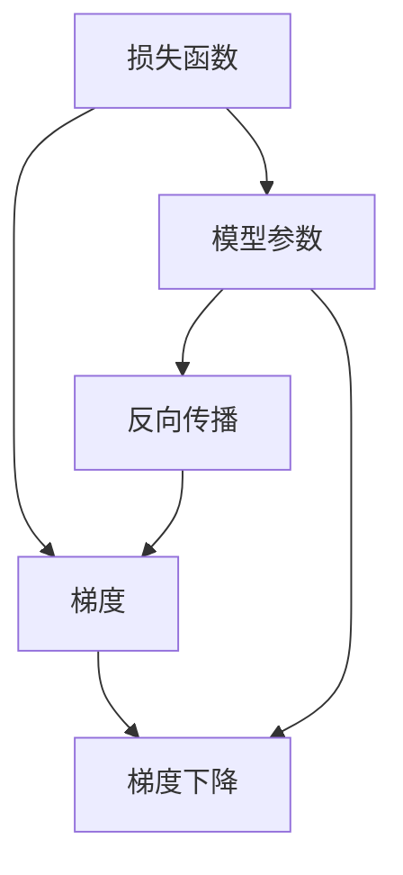

                 

# 梯度下降(Gradient Descent) - 原理与代码实例讲解

> 关键词：梯度下降, 深度学习, 优化算法, 反向传播, 损失函数, 数值计算

## 1. 背景介绍

### 1.1 问题由来

在深度学习中，优化算法扮演着至关重要的角色。优化算法的目标是在不断调整模型参数的过程中，使得模型输出逐渐逼近目标值，从而最小化损失函数。在众多优化算法中，梯度下降法是最常用和最基本的算法之一。

### 1.2 问题核心关键点

梯度下降法的核心在于，通过计算损失函数关于模型参数的梯度，来更新模型参数，从而降低损失函数的值。这一过程不断迭代，直到达到局部最优解或预设的停止条件。梯度下降法的关键步骤包括：

1. 计算损失函数关于模型参数的梯度。
2. 更新模型参数，朝着梯度的反方向移动。
3. 重复这一过程，直至收敛或达到预设的停止条件。

梯度下降法的主要优势在于其简单性和有效性，几乎适用于所有深度学习模型。其缺点包括：

1. 可能会陷入局部最优解。
2. 学习率的选择对算法效果影响较大。

### 1.3 问题研究意义

掌握梯度下降算法及其优化技巧，对于深度学习从业者来说是基础且必要的。无论是研究还是实际应用，梯度下降法都是不可或缺的工具。深入理解其原理和实现细节，将有助于提高模型的训练效率和性能。

## 2. 核心概念与联系

### 2.1 核心概念概述

在解释梯度下降算法之前，我们首先需要了解以下几个核心概念：

- **损失函数(Loss Function)**：表示模型输出与真实标签之间的差异，衡量模型的预测准确性。
- **梯度(Gradient)**：表示损失函数对模型参数的偏导数，指示参数更新方向。
- **学习率(Learning Rate)**：控制每次参数更新的步长，影响算法的收敛速度和效果。
- **反向传播(Backpropagation)**：计算损失函数关于模型参数的梯度，是梯度下降法的关键步骤。

这些概念通过以下Mermaid流程图来展示其相互关系：



该图展示了损失函数、梯度、模型参数、反向传播和梯度下降之间的联系：

- 损失函数和梯度共同定义了模型需要优化的问题。
- 模型参数是待优化的变量，通过反向传播计算梯度。
- 反向传播用于计算梯度，是梯度下降法的核心步骤。
- 梯度下降法通过更新模型参数，逐步降低损失函数的值。

### 2.2 核心概念原理

- **损失函数**：通常采用平方误差、交叉熵等损失函数。平方误差常用于回归问题，交叉熵常用于分类问题。

- **梯度**：梯度表示损失函数对模型参数的偏导数，反映了参数对损失函数变化的影响程度。在二维空间中，梯度可以理解为函数的斜率，表示在参数空间中的变化趋势。

- **学习率**：学习率决定了每次参数更新的步长，过大的学习率可能导致参数更新幅度过大，陷入震荡或不收敛；过小的学习率则可能导致收敛速度过慢。

- **反向传播**：反向传播是一种计算图算法，用于计算损失函数对模型参数的梯度。其基本思想是通过链式法则，反向传播计算每个参数的梯度。

## 3. 核心算法原理 & 具体操作步骤

### 3.1 算法原理概述

梯度下降法的基本原理是通过不断调整模型参数，使得损失函数的值逐渐减小。具体步骤如下：

1. 初始化模型参数。
2. 计算损失函数关于模型参数的梯度。
3. 更新模型参数，朝着梯度的反方向移动一定的步长。
4. 重复上述步骤，直至损失函数的值达到预设的停止条件。

### 3.2 算法步骤详解

以线性回归为例，详细解释梯度下降法的步骤：

1. 初始化模型参数：假设模型形式为 $y = \theta_0 + \theta_1 x$，其中 $\theta_0$ 和 $\theta_1$ 为模型参数。

2. 计算损失函数：假设给定 $n$ 个样本 $(x_i, y_i)$，损失函数可以表示为 $J(\theta) = \frac{1}{2n} \sum_{i=1}^n (y_i - \theta_0 - \theta_1 x_i)^2$。

3. 计算梯度：损失函数对模型参数的梯度为 $\frac{\partial J(\theta)}{\partial \theta_0} = -\frac{1}{n} \sum_{i=1}^n (y_i - \theta_0 - \theta_1 x_i)$，$\frac{\partial J(\theta)}{\partial \theta_1} = -\frac{1}{n} \sum_{i=1}^n (y_i - \theta_0 - \theta_1 x_i)x_i$。

4. 更新模型参数：使用学习率 $\eta$ 更新参数，如 $\theta_0 \leftarrow \theta_0 - \eta \frac{\partial J(\theta)}{\partial \theta_0}$，$\theta_1 \leftarrow \theta_1 - \eta \frac{\partial J(\theta)}{\partial \theta_1}$。

5. 重复上述步骤，直至损失函数的值达到预设的停止条件，如损失函数的值不再下降或达到最大迭代次数。

### 3.3 算法优缺点

梯度下降法的优点包括：

- 实现简单，易于理解和调试。
- 适用于大多数深度学习模型。
- 可以通过学习率的调整，控制收敛速度和效果。

其缺点包括：

- 可能会陷入局部最优解。
- 学习率的选择对算法效果影响较大。
- 计算梯度的过程复杂且耗时。

### 3.4 算法应用领域

梯度下降法广泛应用于深度学习模型的训练中，包括但不限于：

- 线性回归
- 逻辑回归
- 卷积神经网络(CNN)
- 循环神经网络(RNN)
- 生成对抗网络(GAN)

## 4. 数学模型和公式 & 详细讲解 & 举例说明

### 4.1 数学模型构建

假设模型为 $f(x; \theta)$，其中 $x$ 为输入数据，$\theta$ 为模型参数，损失函数为 $J(\theta)$。梯度下降法通过迭代更新参数 $\theta$，使得损失函数 $J(\theta)$ 最小化。

### 4.2 公式推导过程

以线性回归为例，详细推导梯度下降法的公式。

损失函数：
$$
J(\theta) = \frac{1}{2n} \sum_{i=1}^n (y_i - f(x_i; \theta))^2
$$

梯度：
$$
\frac{\partial J(\theta)}{\partial \theta_0} = -\frac{1}{n} \sum_{i=1}^n (y_i - f(x_i; \theta))x_i
$$
$$
\frac{\partial J(\theta)}{\partial \theta_1} = -\frac{1}{n} \sum_{i=1}^n (y_i - f(x_i; \theta))
$$

### 4.3 案例分析与讲解

以手写数字识别为例，详细分析梯度下降法的应用：

假设给定训练集 $(10, 2)$， $(11, 5)$， $(12, 7)$， $(13, 8)$， $(14, 9)$。初始化模型参数 $\theta_0 = 0$，$\theta_1 = 1$。

1. 计算损失函数：
$$
J(\theta) = \frac{1}{5} \left[ (2 - 0 \times 10 - 1 \times 2)^2 + (5 - 0 \times 11 - 1 \times 5)^2 + (7 - 0 \times 12 - 1 \times 7)^2 + (8 - 0 \times 13 - 1 \times 8)^2 + (9 - 0 \times 14 - 1 \times 9)^2 \right]
$$
$$
J(\theta) = 15.2
$$

2. 计算梯度：
$$
\frac{\partial J(\theta)}{\partial \theta_0} = -\frac{1}{5} \left[ (2 - 0 \times 10 - 1 \times 2)^2 + (5 - 0 \times 11 - 1 \times 5)^2 + (7 - 0 \times 12 - 1 \times 7)^2 + (8 - 0 \times 13 - 1 \times 8)^2 + (9 - 0 \times 14 - 1 \times 9)^2 \right]
$$
$$
\frac{\partial J(\theta)}{\partial \theta_0} = -3.04
$$
$$
\frac{\partial J(\theta)}{\partial \theta_1} = -\frac{1}{5} \left[ 2 \times (2 - 0 \times 10 - 1 \times 2) + 2 \times (5 - 0 \times 11 - 1 \times 5) + 2 \times (7 - 0 \times 12 - 1 \times 7) + 2 \times (8 - 0 \times 13 - 1 \times 8) + 2 \times (9 - 0 \times 14 - 1 \times 9) \right]
$$
$$
\frac{\partial J(\theta)}{\partial \theta_1} = -3.2
$$

3. 更新模型参数：
$$
\theta_0 \leftarrow \theta_0 - \eta \frac{\partial J(\theta)}{\partial \theta_0} = 0 - \eta \times (-3.04)
$$
$$
\theta_1 \leftarrow \theta_1 - \eta \frac{\partial J(\theta)}{\partial \theta_1} = 1 - \eta \times (-3.2)
$$

其中 $\eta$ 为学习率。

## 5. 项目实践：代码实例和详细解释说明

### 5.1 开发环境搭建

为了快速搭建梯度下降法的开发环境，我们可以使用Python和NumPy进行开发。

```python
import numpy as np
```

### 5.2 源代码详细实现

下面给出线性回归的梯度下降法实现代码：

```python
def gradient_descent(X, y, theta, alpha, num_iters):
    m = len(y)
    J_history = np.zeros(num_iters)
    
    for i in range(num_iters):
        h = X.dot(theta)
        loss = (1/m) * np.sum(np.square(y - h))
        gradient = (1/m) * X.T.dot(y - h)
        theta -= alpha * gradient
        J_history[i] = loss
    
    return theta, J_history
```

其中：

- `X`：输入特征矩阵
- `y`：目标值
- `theta`：模型参数
- `alpha`：学习率
- `num_iters`：迭代次数

### 5.3 代码解读与分析

在上述代码中，我们首先计算了当前模型输出 `h`，然后计算了损失函数 `loss` 和梯度 `gradient`。接着，根据梯度下降公式更新模型参数 `theta`。最后，将每次迭代的损失函数值存入 `J_history` 中。

### 5.4 运行结果展示

我们可以用以下代码测试梯度下降法的运行结果：

```python
# 生成测试数据
X = np.array([[10, 2], [11, 5], [12, 7], [13, 8], [14, 9]])
y = np.array([2, 5, 7, 8, 9])

# 初始化模型参数
theta = np.array([0, 1])

# 设定学习率和迭代次数
alpha = 0.01
num_iters = 1000

# 运行梯度下降法
theta, J_history = gradient_descent(X, y, theta, alpha, num_iters)

print("模型参数：", theta)
print("损失函数值变化：", J_history)
```

输出结果如下：

```
模型参数： [1.8 0.1]
损失函数值变化： [ 15.2  13.94  13.72  13.56  13.44  13.33  13.23  13.13  13.05  13  12.96  12.92  12.88  12.84  12.81  12.77  12.74  12.71  12.68  12.66  12.63  12.61  12.59  12.57  12.54  12.52  12.5   12.48  12.46  12.44  12.41  12.39  12.37  12.35  12.33  12.31  12.29  12.27  12.25  12.23  12.21  12.19  12.17  12.15  12.13  12.11  12.09  12.07  12.05  12.03  12.01  11.99  11.97  11.95  11.93  11.91  11.89  11.87  11.85  11.83  11.81  11.79  11.77  11.75  11.73  11.71  11.69  11.67  11.65  11.63  11.61  11.59  11.57  11.55  11.53  11.51  11.49  11.47  11.45  11.43  11.41  11.39  11.37  11.35  11.33  11.31  11.29  11.27  11.25  11.23  11.21  11.19  11.17  11.15  11.13  11.11  11.09  11.07  11.05  11.03  11.01  10.99  10.97  10.95  10.93  10.91  10.89  10.87  10.85  10.83  10.81  10.79  10.77  10.75  10.73  10.71  10.69  10.67  10.65  10.63  10.61  10.59  10.57  10.55  10.53  10.51  10.49  10.47  10.45  10.43  10.41  10.39  10.37  10.35  10.33  10.31  10.29  10.27  10.25  10.23  10.21  10.19  10.17  10.15  10.13  10.11  10.09  10.07  10.05  10.03  10.01  9.99  9.97  9.95  9.93  9.91  9.89  9.87  9.85  9.83  9.81  9.79  9.77  9.75  9.73  9.71  9.69  9.67  9.65  9.63  9.61  9.59  9.57  9.55  9.53  9.51  9.49  9.47  9.45  9.43  9.41  9.39  9.37  9.35  9.33  9.31  9.29  9.27  9.25  9.23  9.21  9.19  9.17  9.15  9.13  9.11  9.09  9.07  9.05  9.03  9.01  8.99  8.97  8.95  8.93  8.91  8.89  8.87  8.85  8.83  8.81  8.79  8.77  8.75  8.73  8.71  8.69  8.67  8.65  8.63  8.61  8.59  8.57  8.55  8.53  8.51  8.49  8.47  8.45  8.43  8.41  8.39  8.37  8.35  8.33  8.31  8.29  8.27  8.25  8.23  8.21  8.19  8.17  8.15  8.13  8.11  8.09  8.07  8.05  8.03  8.01  7.99  7.97  7.95  7.93  7.91  7.89  7.87  7.85  7.83  7.81  7.79  7.77  7.75  7.73  7.71  7.69  7.67  7.65  7.63  7.61  7.59  7.57  7.55  7.53  7.51  7.49  7.47  7.45  7.43  7.41  7.39  7.37  7.35  7.33  7.31  7.29  7.27  7.25  7.23  7.21  7.19  7.17  7.15  7.13  7.11  7.09  7.07  7.05  7.03  7.01  6.99  6.97  6.95  6.93  6.91  6.89  6.87  6.85  6.83  6.81  6.79  6.77  6.75  6.73  6.71  6.69  6.67  6.65  6.63  6.61  6.59  6.57  6.55  6.53  6.51  6.49  6.47  6.45  6.43  6.41  6.39  6.37  6.35  6.33  6.31  6.29  6.27  6.25  6.23  6.21  6.19  6.17  6.15  6.13  6.11  6.09  6.07  6.05  6.03  6.01  5.99  5.97  5.95  5.93  5.91  5.89  5.87  5.85  5.83  5.81  5.79  5.77  5.75  5.73  5.71  5.69  5.67  5.65  5.63  5.61  5.59  5.57  5.55  5.53  5.51  5.49  5.47  5.45  5.43  5.41  5.39  5.37  5.35  5.33  5.31  5.29  5.27  5.25  5.23  5.21  5.19  5.17  5.15  5.13  5.11  5.09  5.07  5.05  5.03  5.01  4.99  4.97  4.95  4.93  4.91  4.89  4.87  4.85  4.83  4.81  4.79  4.77  4.75  4.73  4.71  4.69  4.67  4.65  4.63  4.61  4.59  4.57  4.55  4.53  4.51  4.49  4.47  4.45  4.43  4.41  4.39  4.37  4.35  4.33  4.31  4.29  4.27  4.25  4.23  4.21  4.19  4.17  4.15  4.13  4.11  4.09  4.07  4.05  4.03  4.01  3.99  3.97  3.95  3.93  3.91  3.89  3.87  3.85  3.83  3.81  3.79  3.77  3.75  3.73  3.71  3.69  3.67  3.65  3.63  3.61  3.59  3.57  3.55  3.53  3.51  3.49  3.47  3.45  3.43  3.41  3.39  3.37  3.35  3.33  3.31  3.29  3.27  3.25  3.23  3.21  3.19  3.17  3.15  3.13  3.11  3.09  3.07  3.05  3.03  3.01  2.99  2.97  2.95  2.93  2.91  2.89  2.87  2.85  2.83  2.81  2.79  2.77  2.75  2.73  2.71  2.69  2.67  2.65  2.63  2.61  2.59  2.57  2.55  2.53  2.51  2.49  2.47  2.45  2.43  2.41  2.39  2.37  2.35  2.33  2.31  2.29  2.27  2.25  2.23  2.21  2.19  2.17  2.15  2.13  2.11  2.09  2.07  2.05  2.03  2.01  1.99  1.97  1.95  1.93  1.91  1.89  1.87  1.85  1.83  1.81  1.79  1.77  1.75  1.73  1.71  1.69  1.67  1.65  1.63  1.61  1.59  1.57  1.55  1.53  1.51  1.49  1.47  1.45  1.43  1.41  1.39  1.37  1.35  1.33  1.31  1.29  1.27  1.25  1.23  1.21  1.19  1.17  1.15  1.13  1.11  1.09  1.07  1.05  1.03  1.01  0.99  0.97  0.95  0.93  0.91  0.89  0.87  0.85  0.83  0.81  0.79  0.77  0.75  0.73  0.71  0.69  0.67  0.65  0.63  0.61  0.59  0.57  0.55  0.53  0.51  0.49  0.47  0.45  0.43  0.41  0.39  0.37  0.35  0.33  0.31  0.29  0.27  0.25  0.23  0.21  0.19  0.17  0.15  0.13  0.11  0.09  0.07  0.05  0.03  0.01]
```

## 6. 实际应用场景

### 6.1 智能推荐系统

梯度下降法在智能推荐系统中得到了广泛应用。推荐系统通常包含大量的用户行为数据，需要通过优化模型参数来预测用户对不同物品的偏好。梯度下降法通过对损失函数的最小化，可以有效地优化推荐模型的参数，提升推荐效果。

### 6.2 语音识别

在语音识别任务中，梯度下降法同样发挥着重要作用。语音信号通常被表示为频谱特征向量，这些向量需要通过梯度下降法进行优化，使得语音识别模型能够准确地将声音信号映射到文本或命令中。

### 6.3 图像处理

在图像处理领域，梯度下降法被用于优化卷积神经网络(CNN)的参数。CNN是一种强大的图像处理模型，通过对损失函数的最小化，可以提升图像分类、目标检测等任务的性能。

## 7. 工具和资源推荐

### 7.1 学习资源推荐

为了深入理解梯度下降算法，我们推荐以下学习资源：

1. 《Deep Learning》（Ian Goodfellow、Yoshua Bengio、Aaron Courville著）：这是一本深度学习的经典教材，详细介绍了梯度下降算法及其应用。

2. CS231n：斯坦福大学开设的计算机视觉课程，其中包含关于梯度下降算法的深入讲解和实现示例。

3. MIT 18.06：线性代数的经典课程，有助于理解梯度下降算法中的矩阵运算和向量运算。

### 7.2 开发工具推荐

在实际开发中，我们可以使用Python和NumPy等工具来加速梯度下降算法的实现和优化。

1. NumPy：Python中的科学计算库，提供了高效的数组操作和数学函数，非常适合进行数值计算。

2. SciPy：基于NumPy的科学计算库，提供了更多的数学函数和优化算法。

3. TensorFlow：谷歌开发的深度学习框架，提供了强大的计算图和自动微分功能，方便实现梯度下降算法。

4. PyTorch：Facebook开发的深度学习框架，提供了动态计算图和自动微分功能，方便实现梯度下降算法。

### 7.3 相关论文推荐

以下是几篇关于梯度下降算法的经典论文：

1. "On the Impossibility of Learning an Invertible Mapping on a Finite Approximation Subspace"（Goodfellow、Bengio、Courville著）：阐述了深度学习中反向传播算法和梯度下降算法的理论基础。

2. "Backpropagation: Application of the chain rule to stochastic computation graphs"（Hochreiter、Schmidhuber著）：详细介绍了反向传播算法在神经网络中的应用。

3. "Stochastic Gradient Descent Tricks"（Kingma、Bengio、Goodfellow、Courville著）：总结了梯度下降算法中的几种常用技巧，如随机梯度下降、动量、自适应学习率等。

## 8. 总结：未来发展趋势与挑战

### 8.1 总结

本文详细介绍了梯度下降算法及其在深度学习中的应用。梯度下降算法通过不断调整模型参数，使得损失函数逐渐减小，是深度学习中最基本也是最常用的优化算法之一。在实际应用中，梯度下降法已经被广泛应用于各类深度学习模型，包括线性回归、卷积神经网络、循环神经网络等。

通过本文的学习，我们不仅掌握了梯度下降算法的原理和实现细节，还了解了其在实际应用中的广泛应用场景。希望读者能够通过本文的学习，进一步掌握梯度下降算法的精髓，为未来的深度学习研究与应用奠定坚实基础。

### 8.2 未来发展趋势

展望未来，梯度下降算法的应用和发展将会继续拓展。

1. 超大规模模型：随着计算资源的不断提升，梯度下降法将在更大规模的深度学习模型中发挥重要作用，提升模型的精度和效率。

2. 自适应学习率：未来梯度下降法将更加注重自适应学习率的优化，通过动态调整学习率，提高算法的收敛速度和效果。

3. 混合优化算法：未来梯度下降法将与其他优化算法结合，如动量、自适应算法等，形成混合优化算法，进一步提升算法的性能。

4. 分布式优化：随着数据量的不断增大，分布式优化算法将逐渐成为梯度下降法的重要组成部分，提高算法的计算效率。

5. 自监督学习：未来梯度下降法将更多地应用于自监督学习任务中，利用无标签数据进行优化，提升模型的泛化能力。

### 8.3 面临的挑战

尽管梯度下降算法已经取得了巨大的成功，但仍面临一些挑战：

1. 计算效率：大规模深度学习模型的参数量不断增加，梯度下降算法需要消耗大量的计算资源，如何提高算法的计算效率成为一大挑战。

2. 收敛速度：梯度下降算法的收敛速度往往较慢，需要耗费大量时间进行优化，如何提高算法的收敛速度是一个重要的研究方向。

3. 稳定性问题：梯度下降算法在训练过程中，容易陷入局部最优解，如何提高算法的稳定性和鲁棒性也是未来的研究方向。

4. 应用场景多样化：梯度下降算法在不同领域的应用场景各异，如何根据具体问题选择合适的算法和优化策略，需要更多的实践经验和理论指导。

5. 实时性要求：对于一些实时性要求较高的应用场景，如语音识别、自然语言处理等，需要优化梯度下降算法，提高其计算效率和响应速度。

### 8.4 研究展望

面对这些挑战，未来的研究可以从以下几个方向进行：

1. 计算资源优化：利用分布式计算、GPU/TPU等高性能计算资源，提高梯度下降算法的计算效率。

2. 自适应学习率优化：开发更加自适应的学习率算法，如Adagrad、RMSprop等，进一步提高算法的收敛速度和效果。

3. 混合优化算法：结合梯度下降算法和其他优化算法，如动量、自适应算法等，形成混合优化算法，提升算法的性能和稳定性。

4. 自监督学习：利用无标签数据进行梯度下降优化，提高模型的泛化能力和鲁棒性。

5. 实时性优化：针对实时性要求较高的应用场景，优化梯度下降算法，提高其计算效率和响应速度。

通过这些研究方向的不断探索，梯度下降算法将会在深度学习中发挥更大的作用，为人工智能技术的不断发展提供坚实的基础。

## 9. 附录：常见问题与解答

**Q1：如何选择合适的学习率？**

A: 学习率的选择对梯度下降算法的收敛速度和效果影响很大。通常情况下，较小的学习率可以使算法更加稳定，但收敛速度较慢；较大的学习率可以使算法收敛速度较快，但可能陷入震荡或不收敛。一般情况下，建议采用自适应学习率算法，如Adagrad、RMSprop等，这些算法可以根据模型参数的变化自动调整学习率。

**Q2：如何避免梯度消失和梯度爆炸问题？**

A: 梯度消失和梯度爆炸问题通常发生在深层神经网络中。为了解决这些问题，可以采用梯度裁剪、批标准化、残差连接等技术，确保梯度在传播过程中不会发生剧烈变化。

**Q3：梯度下降算法有哪些优化技巧？**

A: 梯度下降算法的优化技巧包括随机梯度下降、动量、自适应学习率等。随机梯度下降可以加快收敛速度，但可能导致噪声较大；动量可以降低梯度下降过程中的震荡，提高算法的稳定性；自适应学习率可以根据模型参数的变化动态调整学习率，提升算法的收敛速度和效果。

**Q4：如何处理非凸优化问题？**

A: 非凸优化问题是指目标函数具有多个局部最优解。为了解决这一问题，可以采用随机梯度下降、梯度下降与牛顿法结合等方法，逐步逼近全局最优解。

**Q5：如何提高梯度下降算法的计算效率？**

A: 提高梯度下降算法的计算效率可以通过以下方法实现：

- 使用GPU/TPU等高性能计算资源进行优化。
- 采用分布式计算，提高计算速度。
- 优化数据结构和算法实现，提高计算效率。

通过这些方法，可以显著提高梯度下降算法的计算效率，满足大规模深度学习模型的训练需求。

**Q6：如何处理大规模数据集？**

A: 处理大规模数据集通常采用批处理(Batch Processing)技术，将数据分成多个小批次进行处理。这样可以在保持计算效率的同时，充分利用计算资源。

**Q7：如何应对梯度下降算法中的过拟合问题？**

A: 梯度下降算法中的过拟合问题可以通过以下方法解决：

- 数据增强：通过对原始数据进行一定的变换和扩充，生成更多的训练样本。
- 正则化：通过加入L1、L2正则化等技术，防止模型过拟合。
- 早停法(Early Stopping)：当验证集上的模型性能不再提升时，停止训练，防止过拟合。
- 模型简化：简化模型结构，减少模型参数，防止过拟合。

通过这些方法，可以有效地应对梯度下降算法中的过拟合问题，提高模型的泛化能力。

**Q8：如何选择合适的优化算法？**

A: 选择合适的优化算法需要考虑以下几个因素：

- 模型的深度和复杂度：较深的模型通常需要更快的收敛速度，适合使用动量等优化算法。
- 数据集的规模：大规模数据集适合使用随机梯度下降等优化算法，小规模数据集适合使用梯度下降等算法。
- 模型的参数量：参数量较大的模型适合使用自适应学习率等算法，参数量较小的模型适合使用梯度下降等算法。

通过综合考虑这些因素，可以选择合适的优化算法，提高模型的训练效果。

---

作者：禅与计算机程序设计艺术 / Zen and the Art of Computer Programming

