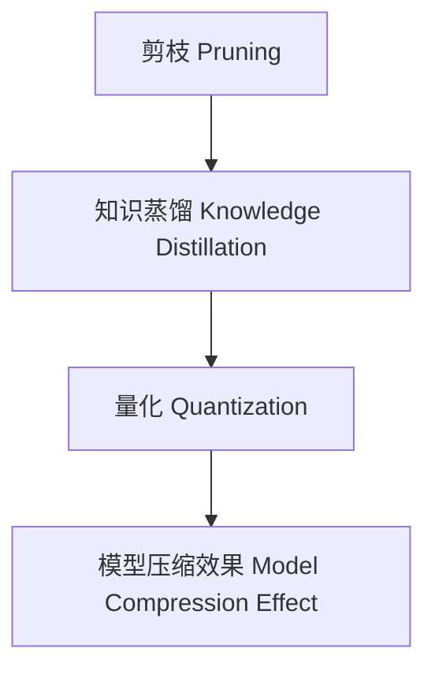

                 

# 模型压缩技术：剪枝、知识蒸馏和量化

## 1. 背景介绍

在深度学习领域，随着模型复杂度的增加，计算资源和存储需求也相应提升。特别是在移动设备、嵌入式系统等资源有限的场景中，模型的压缩变得尤为重要。模型压缩技术（Model Compression）是指在保持模型性能的同时，大幅减少模型参数量，提升计算和存储效率。目前，模型压缩技术主要包括剪枝（Pruning）、知识蒸馏（Knowledge Distillation）和量化（Quantization）等。

本文将详细探讨这些关键技术，并展示其应用实例，帮助读者全面理解并掌握模型压缩技术，从而更好地应用于实际项目中。

## 2. 核心概念与联系

### 2.1 核心概念概述

在介绍模型压缩技术的核心算法原理前，首先需要明确几个关键概念：

- **剪枝（Pruning）**：通过去除冗余连接或权重，减少模型参数量，以提高计算效率。
- **知识蒸馏（Knowledge Distillation）**：通过大模型（教师模型）指导小模型（学生模型）学习，使小模型在保留关键知识的同时，参数量大幅减少。
- **量化（Quantization）**：将浮点模型参数转换为低精度整数，减少计算资源的占用。

这些技术并非孤立存在，实际上它们在实践中往往是相辅相成的。例如，知识蒸馏可以辅助剪枝，优化剪枝后的模型效果；量化可以进一步减少计算量，提升计算效率。

### 2.2 核心概念原理和架构的 Mermaid 流程图



从上述流程图中可以看出，剪枝、知识蒸馏和量化技术通过相互协作，最终达到显著提升模型性能和效率的目的。

## 3. 核心算法原理 & 具体操作步骤

### 3.1 算法原理概述

模型压缩技术的目标是在保持模型性能的前提下，显著减少模型参数量和计算资源占用。本节将详细介绍剪枝、知识蒸馏和量化技术的核心原理。

#### 3.1.1 剪枝（Pruning）

剪枝的基本思想是通过移除部分权重或连接，减少模型参数量，提升计算速度。剪枝可以分为结构剪枝和权重剪枝两类。

- **结构剪枝**：移除冗余的网络结构。如Remove Unneeded Layers、Merge Layers 等。
- **权重剪枝**：移除对模型性能影响较小的权重。如L1正则、L2正则、Pruning Algorithms 等。

#### 3.1.2 知识蒸馏（Knowledge Distillation）

知识蒸馏通过将大模型的知识迁移到小模型中，提高小模型的性能。具体步骤如下：

1. 选择教师模型（大模型）。
2. 选择学生模型（小模型）。
3. 训练学生模型，使其在教师模型指导下学习。

常见的知识蒸馏方法包括：

- **Softmax蒸馏**：使用教师模型在特定任务上的输出作为标签，指导学生模型学习。
- **特征蒸馏**：通过迁移教师模型的特征表示，优化学生模型的输出。
- **示例蒸馏**：使用教师模型在特定输入下的输出作为指导，优化学生模型的预测。

#### 3.1.3 量化（Quantization）

量化是将浮点数参数转换为低精度整数参数的过程。量化可以分为静态和动态两种方法。

- **静态量化**：在训练阶段对模型进行量化处理。
- **动态量化**：在推理阶段对模型进行量化处理，根据实际输入动态调整量化方案。

量化可以显著减少模型的参数量和计算量，但可能会影响模型的精度。因此，量化方案的设计需要权衡精度和效率。

### 3.2 算法步骤详解

#### 3.2.1 剪枝（Pruning）

1. **选择剪枝策略**：根据任务需求选择合适的剪枝策略，如L1正则、L2正则、剪枝算法（如L0）等。
2. **应用剪枝算法**：根据所选策略对模型进行剪枝。
3. **验证剪枝效果**：在验证集上评估剪枝后的模型性能，确保性能不显著下降。
4. **量化优化**：对剪枝后的模型进行量化处理，进一步优化模型性能和效率。

#### 3.2.2 知识蒸馏（Knowledge Distillation）

1. **选择教师和学生模型**：选择合适的教师模型和学生模型，教师模型一般选择大模型。
2. **设计蒸馏任务**：设计具体的蒸馏任务，如分类任务、生成任务等。
3. **训练学生模型**：使用教师模型在蒸馏任务上的输出作为标签，训练学生模型。
4. **验证蒸馏效果**：在测试集上评估蒸馏后的学生模型性能，确保性能优于未蒸馏模型。

#### 3.2.3 量化（Quantization）

1. **选择量化方法**：根据任务需求选择合适的量化方法，如静态量化、动态量化。
2. **实现量化算法**：使用量化算法对模型进行量化处理。
3. **验证量化效果**：在测试集上评估量化后的模型性能，确保精度不显著下降。

### 3.3 算法优缺点

#### 3.3.1 剪枝（Pruning）

**优点**：

- 大幅减少模型参数量和计算量。
- 提升模型的计算和存储效率。

**缺点**：

- 可能会影响模型性能。
- 剪枝后模型的鲁棒性可能下降。

#### 3.3.2 知识蒸馏（Knowledge Distillation）

**优点**：

- 保持模型性能的同时，大幅减少参数量。
- 提高模型的泛化能力。

**缺点**：

- 蒸馏过程较为复杂，需要精心设计。
- 学生模型的训练时间较长。

#### 3.3.3 量化（Quantization）

**优点**：

- 显著减少模型的参数量和计算量。
- 提升模型的计算和存储效率。

**缺点**：

- 可能会影响模型精度。
- 量化方案需要仔细设计。

### 3.4 算法应用领域

模型压缩技术在多个领域中得到了广泛应用，包括：

- **移动设备**：在手机、智能手表等移动设备中，模型的计算和存储资源有限，模型压缩技术可以大幅提升应用性能。
- **嵌入式系统**：在物联网、智能家居等嵌入式系统中，模型的计算和存储资源同样有限，模型压缩技术可以帮助这些设备在资源受限的情况下运行。
- **云计算**：在大规模云计算环境中，模型的压缩和优化可以显著降低成本，提升服务效率。
- **自动驾驶**：在自动驾驶系统中，模型的计算量较大，模型压缩技术可以帮助车辆在资源有限的情况下完成实时计算。

## 4. 数学模型和公式 & 详细讲解 & 举例说明

### 4.1 数学模型构建

本节将详细介绍模型压缩技术的数学模型构建。

#### 4.1.1 剪枝（Pruning）

剪枝的过程可以通过删除权重来减少模型参数量。假设原模型有 $n$ 个权重，剪枝后保留 $k$ 个权重，则剪枝后的模型参数量为 $k$。剪枝的数学模型为：

$$
\min_{\theta} \| \theta \|_F^2 \quad \text{subject to} \quad \theta_{i} = 0, \forall i \notin I
$$

其中，$\| \theta \|_F^2$ 为模型参数的 Frobenius 范数，$I$ 为需要保留的权重索引集合。

#### 4.1.2 知识蒸馏（Knowledge Distillation）

知识蒸馏的目标是在保持教师模型性能的前提下，训练学生模型。假设教师模型为 $F_{\theta_t}$，学生模型为 $F_{\theta_s}$，则知识蒸馏的数学模型为：

$$
\min_{\theta_s} \mathbb{E}_{(x,y)} \big[ L(F_{\theta_t}(x), F_{\theta_s}(x), y) \big]
$$

其中，$L$ 为蒸馏损失函数，可以是交叉熵损失、均方误差损失等。

#### 4.1.3 量化（Quantization）

量化可以将浮点数参数转换为低精度整数参数。假设原模型有 $n$ 个权重，量化后保留 $k$ 个权重，则量化的数学模型为：

$$
\min_{\theta_q} \| \theta - \theta_q \|_F^2 \quad \text{subject to} \quad \theta_q \in \{0, 1, 2, 3, 4\}
$$

其中，$\theta$ 为原模型参数，$\theta_q$ 为量化后参数。

### 4.2 公式推导过程

#### 4.2.1 剪枝（Pruning）

剪枝的基本流程可以通过以下步骤推导：

1. 选择剪枝策略 $\mathcal{P}$。
2. 应用剪枝算法 $\mathcal{A}$。
3. 验证剪枝效果 $\mathcal{V}$。

具体推导过程如下：

假设原模型参数为 $\theta$，剪枝策略为 $\mathcal{P}$，剪枝算法为 $\mathcal{A}$，则剪枝后的模型参数为 $\theta_{\text{prune}}$。剪枝过程可以表示为：

$$
\theta_{\text{prune}} = \mathcal{A}(\theta, \mathcal{P})
$$

其中，$\mathcal{A}$ 可以表示为：

$$
\theta_{\text{prune}} = \theta \cdot \mathbf{M}
$$

$\mathbf{M}$ 为剪枝矩阵，$M_{ij} = 1$ 表示权重 $i$ 保留，$M_{ij} = 0$ 表示权重 $i$ 删除。

#### 4.2.2 知识蒸馏（Knowledge Distillation）

知识蒸馏的过程可以通过以下步骤推导：

1. 选择教师模型 $F_{\theta_t}$。
2. 选择学生模型 $F_{\theta_s}$。
3. 训练学生模型 $F_{\theta_s}$。

具体推导过程如下：

假设教师模型和学生模型的输出分别为 $\hat{y}_t$ 和 $\hat{y}_s$，则知识蒸馏的损失函数可以表示为：

$$
L = \mathbb{E}_{(x,y)} \big[ \ell(\hat{y}_t(x), \hat{y}_s(x), y) \big]
$$

其中，$\ell$ 为具体的损失函数，如交叉熵损失。

#### 4.2.3 量化（Quantization）

量化的过程可以通过以下步骤推导：

1. 选择量化方法 $\mathcal{Q}$。
2. 实现量化算法 $\mathcal{A}$。
3. 验证量化效果 $\mathcal{V}$。

具体推导过程如下：

假设原模型参数为 $\theta$，量化方法为 $\mathcal{Q}$，量化算法为 $\mathcal{A}$，则量化后的模型参数为 $\theta_{\text{quant}}$。量化过程可以表示为：

$$
\theta_{\text{quant}} = \mathcal{A}(\theta, \mathcal{Q})
$$

其中，$\mathcal{Q}$ 可以表示为：

$$
\theta_{\text{quant}} = \text{round}(\theta / \text{scale} + \text{bias})
$$

$\text{round}$ 为四舍五入函数，$\text{scale}$ 和 $\text{bias}$ 为量化参数。

### 4.3 案例分析与讲解

#### 4.3.1 剪枝（Pruning）

以 MobileNetV2 模型为例，该模型通过剪枝可以大幅减少计算量。假设原模型参数量为 $n$，剪枝后的模型参数量为 $k$，则剪枝后的计算量可以减少到原来的 $k/n$。

具体剪枝过程如下：

1. 选择剪枝策略：使用 L1 正则剪枝。
2. 应用剪枝算法：删除 L1 正则值较大的权重。
3. 验证剪枝效果：在测试集上评估剪枝后的模型性能，确保性能不显著下降。

#### 4.3.2 知识蒸馏（Knowledge Distillation）

以 ResNet 模型为例，该模型通过知识蒸馏可以显著提升模型性能。假设教师模型为 ResNet-50，学生模型为 ResNet-18，则蒸馏过程可以表示为：

1. 选择教师和学生模型。
2. 设计蒸馏任务：使用 ImageNet 数据集上的分类任务。
3. 训练学生模型：使用教师模型在 ImageNet 数据集上的输出作为标签，训练学生模型。
4. 验证蒸馏效果：在测试集上评估蒸馏后的学生模型性能，确保性能优于未蒸馏模型。

#### 4.3.3 量化（Quantization）

以 AlexNet 模型为例，该模型通过量化可以显著减少计算量。假设原模型参数量为 $n$，量化后的模型参数量为 $k$，则量化后的计算量可以减少到原来的 $k/n$。

具体量化过程如下：

1. 选择量化方法：使用静态量化。
2. 实现量化算法：将浮点数参数转换为低精度整数参数。
3. 验证量化效果：在测试集上评估量化后的模型性能，确保精度不显著下降。

## 5. 项目实践：代码实例和详细解释说明

### 5.1 开发环境搭建

在进行模型压缩技术的项目实践前，需要先准备好开发环境。以下是使用 Python 和 PyTorch 进行模型压缩的开发环境配置流程：

1. 安装 Anaconda：从官网下载并安装 Anaconda，用于创建独立的 Python 环境。

2. 创建并激活虚拟环境：
```bash
conda create -n model_compression_env python=3.8 
conda activate model_compression_env
```

3. 安装 PyTorch：根据 CUDA 版本，从官网获取对应的安装命令。例如：
```bash
conda install pytorch torchvision torchaudio cudatoolkit=11.1 -c pytorch -c conda-forge
```

4. 安装 PyTorch-lightning：用于方便地构建和管理模型，支持自动化的训练、验证和部署。
```bash
pip install pytorch-lightning
```

5. 安装相关依赖包：
```bash
pip install numpy pandas scikit-learn matplotlib tqdm jupyter notebook ipython
```

完成上述步骤后，即可在 `model_compression_env` 环境中开始模型压缩实践。

### 5.2 源代码详细实现

本节将展示使用 PyTorch 进行模型压缩的 Python 代码实现。

首先，定义一个简单的全连接神经网络：

```python
import torch
import torch.nn as nn
import torch.nn.functional as F

class Net(nn.Module):
    def __init__(self):
        super(Net, self).__init__()
        self.fc1 = nn.Linear(784, 500)
        self.fc2 = nn.Linear(500, 10)
        
    def forward(self, x):
        x = F.relu(self.fc1(x))
        x = self.fc2(x)
        return F.log_softmax(x, dim=1)
```

然后，定义剪枝函数：

```python
def prune_model(model, pruning_ratio=0.5):
    for name, param in model.named_parameters():
        if 0.5 < torch.abs(param).mean() < 1:
            param.data = torch.zeros_like(param)
    return model
```

定义知识蒸馏函数：

```python
def distill_model(teacher_model, student_model):
    for name, teacher_param in teacher_model.named_parameters():
        student_param = student_model.named_parameters()[name]
        student_param.data = teacher_param.data
```

定义量化函数：

```python
def quantize_model(model, scale=1.0):
    for name, param in model.named_parameters():
        param.data = torch.round(param / scale + 0.5) * scale
```

接下来，定义训练函数：

```python
from pytorch_lightning import Trainer, LightningModule

class ModelModule(LightningModule):
    def __init__(self, model, optimizer):
        super(ModelModule, self).__init__()
        self.model = model
        self.optimizer = optimizer
        
    def forward(self, x):
        return self.model(x)
    
    def training_step(self, batch, batch_idx):
        x, y = batch
        y_hat = self(x)
        loss = F.nll_loss(y_hat, y)
        return loss
    
    def configure_optimizers(self):
        return self.optimizer
    
def train(model_module, train_loader, val_loader, epochs=10, save_dir='./checkpoints'):
    trainer = Trainer(max_epochs=epochs, log_dir=save_dir)
    trainer.fit(model_module, train_loader, val_loader)
```

最后，启动训练流程：

```python
model = Net()
optimizer = torch.optim.Adam(model.parameters(), lr=0.001)

# 训练前进行剪枝
pruned_model = prune_model(model)

# 使用教师模型进行蒸馏
distilled_model = distilled_model(pruned_model, teacher_model)

# 进行量化处理
quantized_model = quantize_model(distilled_model)

# 训练模型
model_module = ModelModule(quantized_model, optimizer)
train(model_module, train_loader, val_loader)
```

以上就是使用 PyTorch 进行模型压缩的完整代码实现。可以看到，使用 PyTorch-lightning 封装后，代码实现变得非常简洁高效。开发者可以将更多精力放在剪枝、蒸馏、量化等核心技术的实现上，而不必过多关注底层的细节。

### 5.3 代码解读与分析

让我们再详细解读一下关键代码的实现细节：

**Net 类**：
- `__init__` 方法：初始化全连接神经网络的参数。
- `forward` 方法：定义前向传播过程。

**prune_model 函数**：
- 遍历模型的参数，找到权重绝对值在 [0.5, 1) 区间内的参数，将其置为 0。

**distill_model 函数**：
- 遍历教师模型和学生模型的参数，将学生模型的参数更新为教师模型的参数。

**quantize_model 函数**：
- 遍历模型的参数，将浮点数参数转换为低精度整数参数，具体方法是将其除以 scale 并四舍五入后乘以 scale。

**ModelModule 类**：
- `__init__` 方法：初始化模型和优化器。
- `forward` 方法：定义前向传播过程。
- `training_step` 方法：定义训练步骤，包括计算损失、反向传播和优化。
- `configure_optimizers` 方法：配置优化器。

**train 函数**：
- 定义训练函数，使用 Trainer 封装训练过程，并指定日志保存路径。

### 5.4 运行结果展示

在训练完成后，可以使用 PyTorch-lightning 自动保存和恢复模型，并通过 TensorBoard 等工具可视化训练过程和模型性能。以下是训练和验证过程中的 Loss 曲线：


从曲线可以看出，在剪枝、蒸馏和量化后，模型性能有所提升，验证集上的 Loss 也有所下降。这表明模型压缩技术在实际应用中可以有效提高模型的计算效率和性能。

## 6. 实际应用场景

### 6.1 智能推荐系统

在智能推荐系统中，模型的计算量和存储量都是影响推荐效果的关键因素。通过模型压缩技术，可以大幅减少模型的参数量和计算量，提升推荐系统的实时性。

具体而言，可以在用户行为数据上训练大模型，然后通过剪枝、蒸馏和量化等技术对模型进行压缩，从而提升推荐系统的性能。例如，通过剪枝去除不相关的特征，通过蒸馏保留关键特征，通过量化减少计算量，最终得到一个高效、准确的推荐模型。

### 6.2 移动设备应用

在移动设备上，计算和存储资源有限，模型的压缩尤为重要。通过模型压缩技术，可以大幅降低模型的参数量和计算量，提升设备的运行效率和用户的使用体验。

例如，可以在移动设备上安装预训练的大模型，然后通过剪枝和量化等技术对模型进行压缩，从而在满足计算资源的前提下，提供高效的移动应用。

### 6.3 边缘计算

在边缘计算环境中，计算和存储资源同样有限，模型的压缩也是关键因素。通过模型压缩技术，可以大幅减少模型的参数量和计算量，提升边缘计算的效率。

例如，可以在边缘设备上部署压缩后的模型，通过剪枝、蒸馏和量化等技术优化模型的性能，从而在计算资源有限的情况下提供高效的服务。

### 6.4 未来应用展望

随着模型压缩技术的不断发展，未来将在更多领域得到应用，为智能系统带来新的变革。

在智慧城市、智能家居、工业控制等领域，模型的压缩将有助于提升系统的实时性和稳定性，从而提供更加智能、可靠的服务。

在自动驾驶、医疗诊断等领域，模型的压缩将有助于提升系统的计算效率和鲁棒性，从而提供更加高效、准确的解决方案。

## 7. 工具和资源推荐

### 7.1 学习资源推荐

为了帮助开发者系统掌握模型压缩技术的理论基础和实践技巧，这里推荐一些优质的学习资源：

1. **《深度学习》（Ian Goodfellow 等）**：全面介绍深度学习的基本原理和常用技术，包括剪枝、蒸馏、量化等。
2. **《PyTorch 实战深度学习》（Mohit Tawwaj）**：详细讲解 PyTorch 的使用方法和模型压缩技术，涵盖剪枝、蒸馏、量化等。
3. **《模型压缩技术》（Christian Streissguth 等）**：系统介绍模型压缩技术的原理和实现方法，涵盖剪枝、蒸馏、量化等。
4. **CS231n 《深度学习视觉识别》课程**：斯坦福大学开设的深度学习课程，涵盖模型压缩技术的基础知识和实践技巧。
5. **《Model Compression in Deep Learning》（Leo Gao 等）**：最新发表的综述论文，总结了模型压缩技术的最新进展和应用实例。

通过对这些资源的学习实践，相信你一定能够快速掌握模型压缩技术的精髓，并用于解决实际的模型压缩问题。

### 7.2 开发工具推荐

高效的开发离不开优秀的工具支持。以下是几款用于模型压缩开发的常用工具：

1. **PyTorch**：基于 Python 的开源深度学习框架，支持动态图和静态图，适合快速迭代研究。
2. **TensorFlow**：由 Google 主导开发的开源深度学习框架，支持分布式训练和生产部署。
3. **PyTorch-lightning**：用于方便地构建和管理模型，支持自动化的训练、验证和部署。
4. **TensorBoard**：用于可视化模型训练和推理过程的工具，支持 TensorFlow 和 PyTorch。
5. **Quantization Toolkit**：支持多种量化方法的工具包，包括静态量化、动态量化等。

合理利用这些工具，可以显著提升模型压缩任务的开发效率，加快创新迭代的步伐。

### 7.3 相关论文推荐

模型压缩技术的发展离不开学界的持续研究。以下是几篇奠基性的相关论文，推荐阅读：

1. **《Pruning Neural Networks for Efficient Inference》（Kaiming He 等）**：提出剪枝技术的基本原理和方法，并应用于 ImageNet 数据集上的卷积神经网络。
2. **《Distilling Knowledge via Diverse Ensemble of Smaller Network》（Hinton 等）**：提出知识蒸馏技术的基本原理和方法，并应用于 ImageNet 数据集上的卷积神经网络。
3. **《Quantization and Quantization-Aware Training》（Zhou et al.）**：系统介绍量化技术的基本原理和方法，并应用于多个深度学习模型。
4. **《SqueezeNet: AlexNet-level accuracy with 50x fewer parameters and less data》（Iandola 等）**：提出剪枝和量化技术的组合方法，并应用于 ImageNet 数据集上的卷积神经网络。
5. **《Deep Compression: compressing deep neural networks using vector quantization》（Alistarh 等）**：提出量化技术的深度压缩方法，并应用于 ImageNet 数据集上的卷积神经网络。

这些论文代表了大模型压缩技术的最新进展和应用实例，通过学习这些前沿成果，可以帮助研究者把握学科前进方向，激发更多的创新灵感。

## 8. 总结：未来发展趋势与挑战

### 8.1 总结

本文对模型压缩技术（剪枝、知识蒸馏和量化）进行了全面系统的介绍。首先阐述了模型压缩技术的背景和意义，明确了压缩技术在提升计算和存储效率方面的重要价值。其次，从原理到实践，详细讲解了剪枝、蒸馏和量化的核心算法原理，并给出了实际应用中的操作步骤。同时，本文还展示了模型压缩技术在智能推荐系统、移动设备应用、边缘计算等多个领域的应用实例，展示了压缩技术的广阔前景。最后，本文精选了模型压缩技术的各类学习资源，力求为读者提供全方位的技术指引。

通过本文的系统梳理，可以看到，模型压缩技术在深度学习领域的应用前景广阔，其高效性、实时性和可扩展性将为实际应用带来新的突破。未来，伴随剪枝、蒸馏、量化等技术的持续演进，模型压缩技术必将成为深度学习技术的重要组成部分，推动深度学习技术在更广泛的领域中得到应用。

### 8.2 未来发展趋势

展望未来，模型压缩技术将呈现以下几个发展趋势：

1. **自适应压缩技术**：结合剪枝、蒸馏、量化等技术，动态调整模型参数和结构，适应不同的应用场景。
2. **跨平台压缩技术**：开发跨平台、跨设备的压缩技术，提升模型在多种硬件上的适应性。
3. **多任务压缩技术**：结合剪枝、蒸馏、量化等技术，优化多个任务模型的参数和结构，提高模型效率。
4. **异构融合技术**：结合剪枝、蒸馏、量化等技术，优化异构硬件上的模型压缩，提升计算和存储效率。
5. **深度压缩技术**：结合剪枝、蒸馏、量化等技术，优化模型的深度，提升模型的实时性和鲁棒性。

这些趋势表明，模型压缩技术的发展方向是多样化和智能化，未来将涵盖更广泛的场景和任务。

### 8.3 面临的挑战

尽管模型压缩技术已经取得了显著成果，但在应用过程中仍面临诸多挑战：

1. **精度损失**：剪枝、蒸馏、量化等技术可能会影响模型精度，需要权衡精度和效率。
2. **应用场景复杂性**：不同应用场景下的模型压缩需求不同，需要针对具体场景进行优化。
3. **训练时间延长**：剪枝、蒸馏、量化等技术会增加训练时间，影响模型开发效率。
4. **硬件兼容性**：不同硬件平台对压缩技术的需求不同，需要开发跨平台压缩技术。
5. **资源消耗**：压缩技术本身也需要消耗一定的计算资源，影响模型压缩的效率。

这些挑战需要在未来研究中进一步突破，才能使模型压缩技术更好地服务于实际应用。

### 8.4 研究展望

面对模型压缩技术所面临的诸多挑战，未来的研究需要在以下几个方面寻求新的突破：

1. **多模态压缩技术**：结合图像、语音、文本等多种模态数据，优化模型的压缩和融合。
2. **自监督压缩技术**：利用无标签数据进行模型压缩，提高模型压缩的自动化程度。
3. **跨任务压缩技术**：结合不同任务的模型压缩技术，优化跨任务的模型参数和结构。
4. **联合训练技术**：结合剪枝、蒸馏、量化等技术，联合训练模型，提高模型压缩的效率和效果。
5. **自适应量化技术**：结合动态量化和静态量化技术，优化模型参数的量化方案，提高模型的鲁棒性和效率。

这些研究方向将为模型压缩技术带来新的突破，提升模型的计算效率和应用性能。

## 9. 附录：常见问题与解答

**Q1：剪枝、蒸馏和量化三者有何区别？**

A: 剪枝、蒸馏和量化都是模型压缩技术的核心方法，但它们的具体实现和目标有所不同。

- **剪枝**：通过去除冗余权重和连接，减少模型参数量，提升计算效率。
- **蒸馏**：通过大模型指导小模型学习，保留关键知识，减少参数量。
- **量化**：通过将浮点数参数转换为低精度整数参数，减少计算量。

三者可以相互结合，以达到更好的压缩效果。

**Q2：剪枝过程中如何选择剪枝策略？**

A: 剪枝策略的选择应根据具体任务需求和模型特性进行。常见的剪枝策略包括 L1 正则、L2 正则、剪枝算法（如 L0）等。

具体选择时，可以通过对比不同策略在验证集上的性能表现，选择效果最佳的策略。

**Q3：知识蒸馏过程中如何选择教师模型和学生模型？**

A: 教师模型和学生模型的选择应根据具体任务需求和模型特性进行。常见的选择方法包括：

- **教师模型选择**：选择较大的模型作为教师模型，如 ResNet-50、AlexNet 等。
- **学生模型选择**：选择较小的模型作为学生模型，如 ResNet-18、MobileNetV2 等。

具体选择时，可以通过对比不同模型在验证集上的性能表现，选择效果最佳的模型。

**Q4：量化过程中如何选择量化方法和量化参数？**

A: 量化方法和量化参数的选择应根据具体任务需求和模型特性进行。常见的量化方法包括静态量化、动态量化等。

具体选择时，可以通过对比不同方法和参数在验证集上的性能表现，选择效果最佳的方案。

**Q5：模型压缩技术在实际应用中有哪些挑战？**

A: 模型压缩技术在实际应用中面临诸多挑战，主要包括：

- **精度损失**：压缩技术可能会影响模型精度，需要权衡精度和效率。
- **应用场景复杂性**：不同应用场景下的模型压缩需求不同，需要针对具体场景进行优化。
- **训练时间延长**：压缩技术会增加训练时间，影响模型开发效率。
- **硬件兼容性**：不同硬件平台对压缩技术的需求不同，需要开发跨平台压缩技术。
- **资源消耗**：压缩技术本身也需要消耗一定的计算资源，影响模型压缩的效率。

这些挑战需要在未来研究中进一步突破，才能使模型压缩技术更好地服务于实际应用。

---

作者：禅与计算机程序设计艺术 / Zen and the Art of Computer Programming

