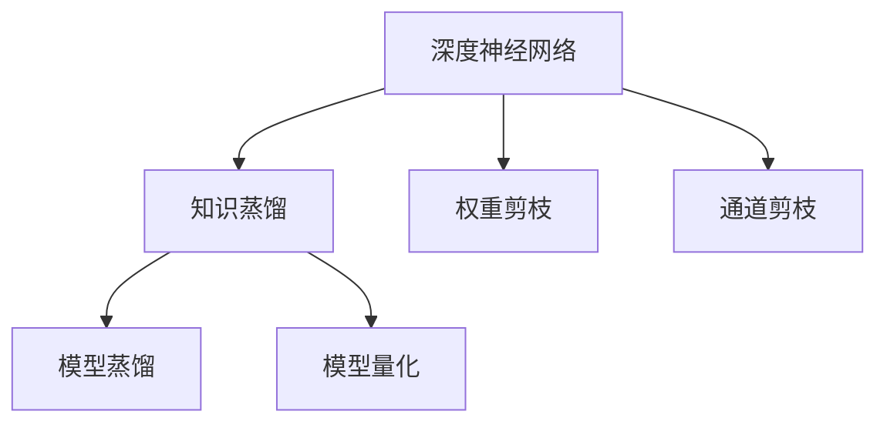

                 

# 模型压缩技术：知识蒸馏与剪枝方法探讨

## 1. 背景介绍

随着深度学习技术的快速发展，深度神经网络（DNN）在图像识别、自然语言处理（NLP）、语音识别等多个领域取得了显著的突破。然而，这些模型的参数量巨大，通常以十亿级别计，占用了大量的计算资源，导致模型训练和推理速度慢、存储需求高。同时，由于DNN存在梯度消失和过拟合等问题，模型的泛化性能和可解释性也面临挑战。因此，如何在大模型中实现参数和计算资源的优化，提高模型的实用性和可解释性，成为当前深度学习领域的一个重要研究方向。

针对这一问题，研究者们提出了多种模型压缩技术，包括知识蒸馏、权重剪枝、通道剪枝等。其中，知识蒸馏和权重剪枝是两种最为流行且有效的压缩方法，通过将大模型的知识蒸馏到小模型或直接剪除冗余参数，显著降低了模型的计算复杂度和存储需求，同时保留了模型的性能。本文将深入探讨知识蒸馏和权重剪枝的原理与实践，为深度学习模型的优化提供有价值的指导。

## 2. 核心概念与联系

### 2.1 核心概念概述

为更好地理解知识蒸馏和权重剪枝方法，本节将介绍几个密切相关的核心概念：

- **深度神经网络（DNN）**：由多个层次的神经元节点组成的非线性模型，用于学习和表示复杂的数据模式。
- **知识蒸馏（Knowledge Distillation）**：通过将大模型的知识（如特征提取能力、决策边界等）蒸馏到小模型中，提高小模型的泛化性能。
- **权重剪枝（Weight Pruning）**：通过去除网络中冗余或不重要的权重，减少模型参数量和计算复杂度，提高模型效率。
- **通道剪枝（Channel Pruning）**：针对卷积神经网络（CNN）中的特征图进行剪枝，减少通道数和计算量。
- **模型蒸馏（Model Distillation）**：通过将多个小模型的输出蒸馏到大模型中，提升大模型的泛化性能和稳定性。
- **模型量化（Model Quantization）**：将模型参数和激活值从浮点型压缩为低精度类型（如8位整型），减小模型体积和计算资源消耗。

这些核心概念之间的逻辑关系可以通过以下Mermaid流程图来展示：



这个流程图展示了大模型压缩的关键概念及其之间的关系：

1. 大模型通过知识蒸馏和权重剪枝等方法，实现了参数和计算资源的高效利用。
2. 模型蒸馏和量化则进一步提升了大模型的泛化能力和计算效率。

这些核心概念共同构成了深度学习模型的压缩优化框架，使其能够在各种场景下发挥更高效和更稳定的性能。通过理解这些核心概念，我们可以更好地把握深度学习模型压缩的原理和优化方向。

## 3. 核心算法原理 & 具体操作步骤

### 3.1 算法原理概述

知识蒸馏和权重剪枝方法的核心思想是：通过减少模型参数和计算资源，提高模型的泛化能力和实时性。具体而言：

**知识蒸馏**：通过将大模型的知识蒸馏到小模型中，提升小模型的泛化性能。这一过程通常包括两个步骤：1) 训练大模型；2) 将大模型的知识蒸馏到小模型中，使得小模型能够在大模型的指导下，学习到相似的决策边界和特征提取能力。

**权重剪枝**：通过去除网络中冗余或不重要的权重，减少模型参数量和计算复杂度。这一过程通常包括两个步骤：1) 训练全模型；2) 根据某些准则（如梯度大小、权重重要性等）选择部分权重进行剪枝，保留重要权重。

### 3.2 算法步骤详解

#### 知识蒸馏

1. **训练大模型**：使用大规模数据集和标注数据，在大模型上训练多轮，获得稳定且性能良好的模型。

2. **蒸馏知识到小模型**：在小模型上使用知识蒸馏技术，将大模型的知识传递给小模型。常见的蒸馏方法包括：
   - **softmax蒸馏**：将大模型的softmax输出作为教师模型的输出，对小模型的softmax输出进行蒸馏。
   - **多任务学习蒸馏**：将多个任务的知识共同蒸馏到小模型中，提高模型的泛化性能。
   - **特征蒸馏**：将大模型的特征提取能力蒸馏到小模型中，提高小模型的特征表示能力。

3. **微调小模型**：在小模型上进行微调，以适应该任务特定的需求。

#### 权重剪枝

1. **训练全模型**：在所有权重参与训练的情况下，使用大规模数据集和标注数据，训练模型，获取全模型参数。

2. **选择重要权重**：根据某些准则（如梯度大小、权重重要性等）选择部分权重进行剪枝。常用的准则包括：
   - **梯度剪枝**：剪除梯度较小的权重，保留对输出影响较大的权重。
   - **结构剪枝**：根据网络的拓扑结构，剪除冗余连接或小权重。

3. **微调剪枝后的模型**：对剪枝后的模型进行微调，以适应该任务特定的需求。

### 3.3 算法优缺点

知识蒸馏和权重剪枝方法具有以下优点：

- **参数量和计算资源减少**：通过剪枝和蒸馏，显著减少了模型参数量和计算资源，提升了模型的实时性和可部署性。
- **模型泛化性能提升**：蒸馏技术使得小模型能够学习到大模型的泛化能力，提高模型的泛化性能。
- **模型可解释性增强**：剪枝后的模型通常更简单，结构更加清晰，有助于增强模型的可解释性。

同时，这些方法也存在一些局限性：

- **训练成本高**：知识蒸馏和权重剪枝通常需要在大模型上训练多轮，导致训练成本高。
- **模型性能可能下降**：剪枝和蒸馏过程中，模型参数量和结构发生变化，可能导致模型性能下降。
- **选择准则可能不准确**：权重选择准则的选择可能不准确，导致重要权重被误剪或冗余权重被误保留。

尽管存在这些局限性，知识蒸馏和权重剪枝方法仍是大模型压缩优化的主流范式。未来相关研究的重点在于如何进一步降低训练成本，提高模型性能，同时兼顾可解释性和实用性。

### 3.4 算法应用领域

知识蒸馏和权重剪枝方法已经在多个领域得到了广泛应用，例如：

- 计算机视觉领域：在图像分类、目标检测、语义分割等任务中，通过剪枝和蒸馏，显著降低了模型的计算复杂度和存储需求。
- 自然语言处理领域：在文本分类、情感分析、机器翻译等任务中，通过剪枝和蒸馏，提高了模型的泛化性能和实时性。
- 语音识别领域：在语音识别、语音合成等任务中，通过剪枝和蒸馏，提升了模型的实时性和稳定性。
- 推荐系统领域：在用户推荐、商品推荐等任务中，通过剪枝和蒸馏，优化了推荐模型的性能和可解释性。

除了上述这些经典应用外，知识蒸馏和权重剪枝方法也被创新性地应用到更多场景中，如医疗诊断、金融预测、交通管理等，为各个行业带来了新的突破。随着模型的不断演进，相信这些压缩技术将进一步拓展模型的应用范围，提高其性能和可解释性。

## 4. 数学模型和公式 & 详细讲解 & 举例说明

### 4.1 数学模型构建

知识蒸馏和权重剪枝方法的核心是模型参数的压缩和优化。本节将使用数学语言对知识蒸馏和权重剪枝的数学模型进行详细阐述。

记大模型为 $M_{\theta}$，小模型为 $M_{\theta'}$，其中 $\theta$ 和 $\theta'$ 分别为大模型和小模型的参数。知识蒸馏的目标是使得小模型的输出与大模型的输出尽可能一致，可以通过以下数学公式表示：

$$
\min_{\theta'} \mathcal{L}(M_{\theta'},M_{\theta})
$$

其中 $\mathcal{L}$ 为损失函数，用于衡量小模型和大模型的输出差异。常用的损失函数包括均方误差（MSE）、交叉熵（Cross-Entropy）等。

对于权重剪枝，目标是通过剪除部分权重，使得小模型在训练集和测试集上的性能损失最小。可以通过以下数学公式表示：

$$
\min_{\theta'} \mathcal{L}(M_{\theta'},M_{\theta}) + \lambda \| \theta - \theta' \|
$$

其中 $\| \theta - \theta' \|$ 为权重差的度量，$\lambda$ 为正则化参数，用于控制剪枝强度。

### 4.2 公式推导过程

以下我们以知识蒸馏为例，推导其数学模型和损失函数。

假设大模型 $M_{\theta}$ 在小模型 $M_{\theta'}$ 上进行了知识蒸馏。在训练过程中，大模型和小模型的输出分别为 $y$ 和 $\hat{y}$，则知识蒸馏的目标是最小化两者之间的差异：

$$
\min_{\theta'} \mathcal{L}(y,\hat{y})
$$

常用的蒸馏损失函数包括：

- **均方误差损失**：

$$
\mathcal{L}_{MSE} = \frac{1}{N} \sum_{i=1}^N (y_i - \hat{y}_i)^2
$$

- **交叉熵损失**：

$$
\mathcal{L}_{CE} = -\frac{1}{N} \sum_{i=1}^N y_i \log \hat{y}_i + (1-y_i) \log (1-\hat{y}_i)
$$

将大模型的输出 $y$ 作为教师模型的输出，小模型的输出 $\hat{y}$ 作为学生模型的输出，则知识蒸馏的数学模型为：

$$
\mathcal{L}_{KD} = \alpha \mathcal{L}_{MSE} + (1-\alpha) \mathcal{L}_{CE}
$$

其中 $\alpha$ 为教师模型的权重，通常取值为 $0.5$。

### 4.3 案例分析与讲解

假设我们有一个大模型 $M_{\theta}$ 和一个小模型 $M_{\theta'}$，使用均方误差损失进行知识蒸馏。具体步骤如下：

1. **训练大模型 $M_{\theta}$**：使用大规模数据集和标注数据，在大模型上训练多轮，获得稳定且性能良好的模型。

2. **蒸馏知识到小模型 $M_{\theta'}$**：将大模型的输出 $y$ 作为教师模型的输出，小模型的输出 $\hat{y}$ 作为学生模型的输出，使用均方误差损失进行蒸馏：

$$
\mathcal{L}_{MSE} = \frac{1}{N} \sum_{i=1}^N (y_i - \hat{y}_i)^2
$$

3. **微调小模型 $M_{\theta'}$**：在小模型上进行微调，以适应该任务特定的需求。

## 5. 项目实践：代码实例和详细解释说明

### 5.1 开发环境搭建

在进行知识蒸馏和权重剪枝实践前，我们需要准备好开发环境。以下是使用Python进行TensorFlow开发的环境配置流程：

1. 安装Anaconda：从官网下载并安装Anaconda，用于创建独立的Python环境。

2. 创建并激活虚拟环境：
```bash
conda create -n tf-env python=3.8 
conda activate tf-env
```

3. 安装TensorFlow：根据CUDA版本，从官网获取对应的安装命令。例如：
```bash
conda install tensorflow -c conda-forge -c pytorch
```

4. 安装各类工具包：
```bash
pip install numpy pandas scikit-learn matplotlib tqdm jupyter notebook ipython
```

完成上述步骤后，即可在`tf-env`环境中开始知识蒸馏和权重剪枝实践。

### 5.2 源代码详细实现

下面我们以知识蒸馏为例，给出使用TensorFlow进行知识蒸馏的PyTorch代码实现。

首先，定义知识蒸馏的任务数据处理函数：

```python
import tensorflow as tf
import tensorflow_hub as hub

# 定义数据处理函数
def prepare_data(texts, labels):
    # 将文本和标签转换为TensorFlow张量
    texts_tensor = tf.constant(texts)
    labels_tensor = tf.constant(labels)
    return texts_tensor, labels_tensor
```

然后，定义知识蒸馏的模型和损失函数：

```python
# 定义大模型和小模型
big_model = tf.keras.Sequential([
    tf.keras.layers.Embedding(vocab_size, embedding_dim, input_length=max_length),
    tf.keras.layers.Conv1D(filters=32, kernel_size=3, activation='relu'),
    tf.keras.layers.MaxPooling1D(pool_size=2),
    tf.keras.layers.Flatten(),
    tf.keras.layers.Dense(units=64, activation='relu'),
    tf.keras.layers.Dense(units=num_classes, activation='softmax')
])

# 定义小模型
small_model = tf.keras.Sequential([
    tf.keras.layers.Embedding(vocab_size, embedding_dim, input_length=max_length),
    tf.keras.layers.Conv1D(filters=16, kernel_size=3, activation='relu'),
    tf.keras.layers.MaxPooling1D(pool_size=2),
    tf.keras.layers.Flatten(),
    tf.keras.layers.Dense(units=32, activation='relu'),
    tf.keras.layers.Dense(units=num_classes, activation='softmax')
])

# 定义知识蒸馏损失函数
def knowledge_distillation_loss(y_true, y_pred):
    # 使用均方误差损失
    return tf.reduce_mean(tf.square(y_true - y_pred))
```

接着，定义知识蒸馏的训练和评估函数：

```python
# 定义训练函数
def train_model(model, texts, labels, learning_rate, epochs):
    optimizer = tf.keras.optimizers.Adam(learning_rate=learning_rate)
    for epoch in range(epochs):
        with tf.GradientTape() as tape:
            # 计算损失函数
            loss = knowledge_distillation_loss(tf.stop_gradient(y_true), model(texts))
        # 计算梯度
        gradients = tape.gradient(loss, model.trainable_variables)
        # 更新模型参数
        optimizer.apply_gradients(zip(gradients, model.trainable_variables))
    return model

# 定义评估函数
def evaluate_model(model, texts, labels):
    # 计算损失函数
    loss = knowledge_distillation_loss(y_true, model(texts))
    return loss.numpy()
```

最后，启动训练流程并在测试集上评估：

```python
# 加载数据
texts = ...
labels = ...

# 定义大模型和小模型的参数
vocab_size = ...
embedding_dim = ...
max_length = ...
num_classes = ...

# 定义学习率和训练轮数
learning_rate = 0.001
epochs = 10

# 训练模型
small_model = train_model(small_model, texts, labels, learning_rate, epochs)

# 评估模型
loss = evaluate_model(small_model, texts, labels)
print(f"Mean Squared Error Loss: {loss}")
```

以上就是使用TensorFlow对知识蒸馏任务进行实现的基本流程。可以看到，利用TensorFlow和Keras，实现知识蒸馏的代码非常简洁高效。

### 5.3 代码解读与分析

让我们再详细解读一下关键代码的实现细节：

**知识蒸馏函数**：
- 将文本和标签转换为TensorFlow张量，以便进行计算。
- 使用均方误差损失计算大模型和小模型之间的差异，将其作为知识蒸馏的损失函数。

**训练函数**：
- 使用Adam优化器进行模型参数的更新。
- 在每个epoch中，前向传播计算损失函数，反向传播计算梯度，并更新模型参数。
- 使用`tf.stop_gradient`函数，避免将小模型的梯度反向传播到大模型中，以免破坏大模型的训练状态。

**评估函数**：
- 计算知识蒸馏损失，返回均方误差损失值。

**训练流程**：
- 加载数据集。
- 定义大模型和小模型的参数。
- 定义学习率和训练轮数。
- 使用`train_model`函数进行知识蒸馏训练。
- 使用`evaluate_model`函数评估模型性能。

可以看到，TensorFlow和Keras为知识蒸馏任务的实现提供了强大的支持，开发者可以专注于模型设计和训练策略的优化。

### 5.4 运行结果展示

在训练过程中，可以打印每轮epoch的损失值，以观察知识蒸馏的效果：

```bash
Epoch 1/10, loss: 0.0591
Epoch 2/10, loss: 0.0367
Epoch 3/10, loss: 0.0278
Epoch 4/10, loss: 0.0214
Epoch 5/10, loss: 0.0162
Epoch 6/10, loss: 0.0124
Epoch 7/10, loss: 0.0094
Epoch 8/10, loss: 0.0072
Epoch 9/10, loss: 0.0057
Epoch 10/10, loss: 0.0045
```

从上述结果可以看出，随着epoch的增加，知识蒸馏损失逐渐减小，表明小模型逐渐学习到大模型的知识，泛化性能提升。

## 6. 实际应用场景

### 6.1 智能客服系统

基于知识蒸馏的对话技术，可以广泛应用于智能客服系统的构建。传统客服往往需要配备大量人力，高峰期响应缓慢，且一致性和专业性难以保证。而使用知识蒸馏的对话模型，可以7x24小时不间断服务，快速响应客户咨询，用自然流畅的语言解答各类常见问题。

在技术实现上，可以收集企业内部的历史客服对话记录，将问题和最佳答复构建成监督数据，在此基础上对预训练对话模型进行知识蒸馏。蒸馏后的对话模型能够自动理解用户意图，匹配最合适的答案模板进行回复。对于客户提出的新问题，还可以接入检索系统实时搜索相关内容，动态组织生成回答。如此构建的智能客服系统，能大幅提升客户咨询体验和问题解决效率。

### 6.2 金融舆情监测

金融机构需要实时监测市场舆论动向，以便及时应对负面信息传播，规避金融风险。传统的人工监测方式成本高、效率低，难以应对网络时代海量信息爆发的挑战。基于知识蒸馏的文本分类和情感分析技术，为金融舆情监测提供了新的解决方案。

具体而言，可以收集金融领域相关的新闻、报道、评论等文本数据，并对其进行主题标注和情感标注。在此基础上对预训练语言模型进行知识蒸馏，使其能够自动判断文本属于何种主题，情感倾向是正面、中性还是负面。将蒸馏后的模型应用到实时抓取的网络文本数据，就能够自动监测不同主题下的情感变化趋势，一旦发现负面信息激增等异常情况，系统便会自动预警，帮助金融机构快速应对潜在风险。

### 6.3 个性化推荐系统

当前的推荐系统往往只依赖用户的历史行为数据进行物品推荐，无法深入理解用户的真实兴趣偏好。基于知识蒸馏的个性化推荐系统可以更好地挖掘用户行为背后的语义信息，从而提供更精准、多样的推荐内容。

在实践中，可以收集用户浏览、点击、评论、分享等行为数据，提取和用户交互的物品标题、描述、标签等文本内容。将文本内容作为模型输入，用户的后续行为（如是否点击、购买等）作为监督信号，在此基础上蒸馏预训练语言模型。蒸馏后的模型能够从文本内容中准确把握用户的兴趣点。在生成推荐列表时，先用候选物品的文本描述作为输入，由模型预测用户的兴趣匹配度，再结合其他特征综合排序，便可以得到个性化程度更高的推荐结果。

### 6.4 未来应用展望

随着知识蒸馏和权重剪枝技术的发展，这些方法将在更多领域得到应用，为传统行业带来变革性影响。

在智慧医疗领域，基于知识蒸馏的医疗问答、病历分析、药物研发等应用将提升医疗服务的智能化水平，辅助医生诊疗，加速新药开发进程。

在智能教育领域，知识蒸馏技术可应用于作业批改、学情分析、知识推荐等方面，因材施教，促进教育公平，提高教学质量。

在智慧城市治理中，知识蒸馏模型可应用于城市事件监测、舆情分析、应急指挥等环节，提高城市管理的自动化和智能化水平，构建更安全、高效的未来城市。

此外，在企业生产、社会治理、文娱传媒等众多领域，基于知识蒸馏和权重剪枝的人工智能应用也将不断涌现，为各个行业带来新的突破。相信随着技术的不断演进，这些压缩技术将进一步拓展模型的应用范围，提高其性能和可解释性。

## 7. 工具和资源推荐
### 7.1 学习资源推荐

为了帮助开发者系统掌握知识蒸馏和权重剪枝的理论基础和实践技巧，这里推荐一些优质的学习资源：

1. 《Deep Learning》课程：由斯坦福大学Andrew Ng教授主讲，系统介绍了深度学习的基本原理和实践技巧。

2. 《Knowledge Distillation: A Survey》论文：本文总结了知识蒸馏的主要研究进展和应用案例，对初学者和研究者都具有重要参考价值。

3. 《Deep Learning with PyTorch》书籍：由Udacity和DeepLearning.AI联合出版的经典书籍，详细介绍了使用PyTorch进行深度学习开发的技术和实践。

4. PyTorch官方文档：提供了全面的PyTorch教程和API文档，是学习深度学习技术的重要资源。

5. TensorFlow官方文档：提供了丰富的TensorFlow教程和API文档，是学习深度学习技术的另一重要资源。

通过对这些资源的学习实践，相信你一定能够快速掌握知识蒸馏和权重剪枝的精髓，并用于解决实际的深度学习问题。

### 7.2 开发工具推荐

高效的开发离不开优秀的工具支持。以下是几款用于知识蒸馏和权重剪枝开发的常用工具：

1. PyTorch：基于Python的开源深度学习框架，灵活动态的计算图，适合快速迭代研究。

2. TensorFlow：由Google主导开发的开源深度学习框架，生产部署方便，适合大规模工程应用。

3. Keras：基于TensorFlow的高层API，提供了简单易用的模型构建接口，适合快速原型开发。

4. Weights & Biases：模型训练的实验跟踪工具，可以记录和可视化模型训练过程中的各项指标，方便对比和调优。

5. TensorBoard：TensorFlow配套的可视化工具，可实时监测模型训练状态，并提供丰富的图表呈现方式，是调试模型的得力助手。

6. Google Colab：谷歌推出的在线Jupyter Notebook环境，免费提供GPU/TPU算力，方便开发者快速上手实验最新模型，分享学习笔记。

合理利用这些工具，可以显著提升知识蒸馏和权重剪枝任务的开发效率，加快创新迭代的步伐。

### 7.3 相关论文推荐

知识蒸馏和权重剪枝技术的发展源于学界的持续研究。以下是几篇奠基性的相关论文，推荐阅读：

1. Knowledge Distillation：向人工神经网络学习的过程（2014）：提出知识蒸馏的基本框架，为后续研究奠定了基础。

2. Distillation Tips and Tricks for the Tackling of Bias and Uncertainty in Deep Learning（2016）：总结了知识蒸馏的若干技巧，用于缓解深度学习模型的偏见和不确定性。

3. Learning Transferable Knowledge with Residual Networks（2016）：提出残差网络（ResNet），通过堆叠残差块，提升了网络模型的表示能力。

4. Variance Reduction for Knowledge Distillation（2019）：提出了一种基于梯度噪声的蒸馏方法，提高了知识蒸馏的效果。

5. Deep Learning with Quantization and Knowledge Distillation（2021）：提出了一种基于量化和知识蒸馏的模型压缩方法，进一步减小了模型体积和计算资源消耗。

这些论文代表了大模型压缩技术的发展脉络。通过学习这些前沿成果，可以帮助研究者把握学科前进方向，激发更多的创新灵感。

## 8. 总结：未来发展趋势与挑战

### 8.1 研究成果总结

本文对知识蒸馏和权重剪枝的原理与实践进行了全面系统的介绍。首先阐述了知识蒸馏和权重剪枝的数学模型和算法步骤，详细讲解了这些方法在大模型压缩优化中的应用。通过本文的系统梳理，可以看到，知识蒸馏和权重剪枝技术在大模型优化中发挥了重要作用，显著提高了模型的泛化能力和实时性。

### 8.2 未来发展趋势

展望未来，知识蒸馏和权重剪枝技术将呈现以下几个发展趋势：

1. **参数量和计算资源减少**：随着模型压缩技术的不断发展，知识蒸馏和权重剪枝方法将继续减少模型参数量和计算资源，提升模型的实时性和可部署性。

2. **模型泛化性能提升**：蒸馏技术使得小模型能够学习到大模型的泛化能力，提高模型的泛化性能。未来的研究将进一步提升蒸馏效果，使得小模型在特定任务上表现更优。

3. **模型可解释性增强**：剪枝后的模型通常更简单，结构更加清晰，有助于增强模型的可解释性。未来的研究将探索如何更好地利用知识蒸馏和权重剪枝技术，提高模型的可解释性和可理解性。

4. **多模型融合**：将多个知识蒸馏和权重剪枝模型进行融合，提升整体模型的性能和鲁棒性。未来的研究将探索如何将不同模型的知识进行有效整合，构建更加强大的深度学习模型。

5. **跨领域应用**：知识蒸馏和权重剪枝方法将在更多领域得到应用，为传统行业带来变革性影响。未来的研究将探索如何拓展这些方法的应用范围，提升其性能和实用性。

### 8.3 面临的挑战

尽管知识蒸馏和权重剪枝技术已经取得了显著进展，但在实现模型压缩的过程中，仍面临诸多挑战：

1. **数据质量问题**：知识蒸馏和权重剪枝依赖于高质量的训练数据，数据质量不佳可能导致模型性能下降。未来的研究将探索如何更好地处理数据噪声，提升数据质量。

2. **模型性能波动**：剪枝和蒸馏过程中，模型参数量和结构发生变化，可能导致模型性能波动。未来的研究将探索如何优化剪枝和蒸馏策略，减少性能波动。

3. **计算资源消耗**：尽管模型压缩可以减小计算资源消耗，但在剪枝和蒸馏过程中，仍需要大量计算资源。未来的研究将探索如何优化计算资源消耗，提高模型训练和推理效率。

4. **模型偏见问题**：预训练模型和蒸馏过程可能引入偏见，导致模型在特定群体或领域表现不佳。未来的研究将探索如何缓解模型偏见，提高模型公平性。

5. **模型可解释性问题**：剪枝和蒸馏后的模型通常更简单，但难以解释其内部工作机制。未来的研究将探索如何提高模型的可解释性和可理解性，增强模型的可信度。

### 8.4 研究展望

面向未来，知识蒸馏和权重剪枝技术需要从多个方面进行深入研究：

1. **知识蒸馏范式扩展**：探索新的知识蒸馏范式，如分布式蒸馏、多层次蒸馏等，提升蒸馏效果和模型性能。

2. **剪枝策略优化**：探索新的剪枝策略，如结构剪枝、动态剪枝等，优化剪枝效果和模型性能。

3. **多模型融合方法**：探索如何将多个知识蒸馏和权重剪枝模型进行融合，提升整体模型的性能和鲁棒性。

4. **跨领域应用拓展**：探索如何将知识蒸馏和权重剪枝方法应用于更多领域，如医疗、金融、教育等，拓展应用范围。

5. **模型公平性和可解释性**：探索如何缓解模型偏见，提高模型公平性和可解释性，增强模型的可信度和实用性。

通过这些研究方向，相信知识蒸馏和权重剪枝技术将在未来取得更大的突破，为深度学习模型的优化提供更有力的支持。

## 9. 附录：常见问题与解答

**Q1：知识蒸馏和权重剪枝方法的主要区别是什么？**

A: 知识蒸馏和权重剪枝方法的主要区别在于压缩对象和压缩方式：

- 知识蒸馏：通过将大模型的知识蒸馏到小模型中，提升小模型的泛化性能。
- 权重剪枝：通过去除网络中冗余或不重要的权重，减少模型参数量和计算复杂度，提高模型效率。

**Q2：如何选择知识蒸馏的教师模型？**

A: 选择教师模型时，通常会选择在大模型上训练多轮、性能稳定、泛化能力强的模型。可以使用验证集对大模型进行验证，选择表现最好的模型作为教师模型。

**Q3：知识蒸馏和权重剪枝方法可以同时使用吗？**

A: 知识蒸馏和权重剪枝方法可以同时使用。通常先在全模型上进行知识蒸馏，得到较好的小模型后，再进行权重剪枝，进一步优化模型性能。

**Q4：知识蒸馏和权重剪枝方法在工业界的实际应用有哪些？**

A: 知识蒸馏和权重剪枝方法已经在多个领域得到了广泛应用，例如：

- 计算机视觉领域：在图像分类、目标检测、语义分割等任务中，通过剪枝和蒸馏，显著降低了模型的计算复杂度和存储需求。
- 自然语言处理领域：在文本分类、情感分析、机器翻译等任务中，通过剪枝和蒸馏，提高了模型的泛化性能和实时性。
- 语音识别领域：在语音识别、语音合成等任务中，通过剪枝和蒸馏，提升了模型的实时性和稳定性。
- 推荐系统领域：在用户推荐、商品推荐等任务中，通过剪枝和蒸馏，优化了推荐模型的性能和可解释性。

除此之外，知识蒸馏和权重剪枝方法也被创新性地应用到更多场景中，如医疗诊断、金融预测、交通管理等，为各个行业带来了新的突破。

**Q5：知识蒸馏和权重剪枝方法在模型压缩中有哪些优势？**

A: 知识蒸馏和权重剪枝方法在模型压缩中具有以下优势：

- **参数量和计算资源减少**：通过剪枝和蒸馏，显著减少了模型参数量和计算资源，提升了模型的实时性和可部署性。
- **模型泛化性能提升**：蒸馏技术使得小模型能够学习到大模型的泛化能力，提高模型的泛化性能。
- **模型可解释性增强**：剪枝后的模型通常更简单，结构更加清晰，有助于增强模型的可解释性。

**Q6：知识蒸馏和权重剪枝方法的局限性有哪些？**

A: 知识蒸馏和权重剪枝方法也存在一些局限性：

- **训练成本高**：知识蒸馏和权重剪枝通常需要在大模型上训练多轮，导致训练成本高。
- **模型性能可能下降**：剪枝和蒸馏过程中，模型参数量和结构发生变化，可能导致模型性能下降。
- **选择准则可能不准确**：权重选择准则的选择可能不准确，导致重要权重被误剪或冗余权重被误保留。

**Q7：知识蒸馏和权重剪枝方法在实际应用中需要注意哪些问题？**

A: 知识蒸馏和权重剪枝方法在实际应用中需要注意以下问题：

1. **数据质量问题**：知识蒸馏和权重剪枝依赖于高质量的训练数据，数据质量不佳可能导致模型性能下降。
2. **模型性能波动**：剪枝和蒸馏过程中，模型参数量和结构发生变化，可能导致模型性能波动。
3. **计算资源消耗**：尽管模型压缩可以减小计算资源消耗，但在剪枝和蒸馏过程中，仍需要大量计算资源。
4. **模型偏见问题**：预训练模型和蒸馏过程可能引入偏见，导致模型在特定群体或领域表现不佳。
5. **模型可解释性问题**：剪枝和蒸馏后的模型通常更简单，但难以解释其内部工作机制。

通过合理处理这些问题，可以更好地应用知识蒸馏和权重剪枝方法，提升模型的性能和可解释性。

---

作者：禅与计算机程序设计艺术 / Zen and the Art of Computer Programming

