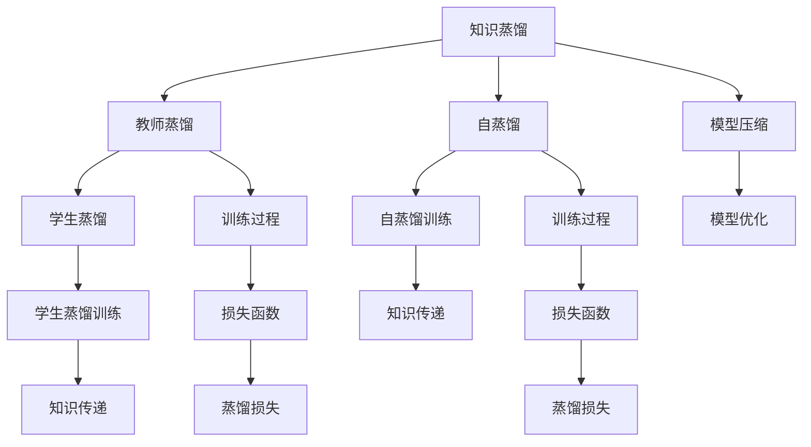

                 

# 模型压缩技术：知识蒸馏与剪枝方法探讨

## 1. 背景介绍

随着深度学习技术的迅猛发展，模型规模不断扩大，导致在计算、存储和传输方面的挑战日益凸显。如何在大规模模型中实现高效的压缩和优化，减少计算资源和存储成本，同时保持模型性能，成为了当下深度学习领域的重要研究方向。模型压缩技术通过减少模型的参数和计算复杂度，提升模型运行效率，降低资源消耗，具有极高的应用价值。

## 2. 核心概念与联系

### 2.1 核心概念概述

模型压缩技术的核心思想是通过减少模型参数和计算量，实现模型在计算资源和存储空间的优化，同时尽量减少性能损失。主要包括知识蒸馏和剪枝两种方法。

- **知识蒸馏(Knowledge Distillation)**：通过训练一个更小、更轻量级的模型，从一个大模型中学习知识，从而在保持高性能的前提下大幅减小模型大小。知识蒸馏可以分为教师-学生蒸馏和自蒸馏两种形式。
- **剪枝(Pruning)**：通过删除模型中不重要的参数，减少模型规模。剪枝可以分为结构剪枝和参数剪枝两种策略。

### 2.2 核心概念原理和架构的 Mermaid 流程图



这个流程图展示了知识蒸馏和剪枝的基本流程和核心概念。教师模型和学生模型通过知识传递的过程，实现模型的压缩和优化。

## 3. 核心算法原理 & 具体操作步骤

### 3.1 算法原理概述

知识蒸馏和剪枝技术都是通过减少模型参数和计算复杂度，提高模型运行效率，同时尽量减少性能损失。两者的关键区别在于实现方法的不同。

- **知识蒸馏**：通过训练一个小模型，使得其在输入输出上尽可能与大模型一致，从而实现模型的压缩。
- **剪枝**：通过删除模型中冗余或不重要的参数，缩小模型规模，提升模型运行速度。

### 3.2 算法步骤详解

**知识蒸馏**：

1. **选择教师和学生模型**：选择一个大模型作为教师模型，一个小模型作为学生模型。
2. **知识传递**：通过在学生模型上训练，使得其输出的预测结果尽可能接近教师模型的输出。
3. **优化学生模型**：优化学生模型的参数，使其在输入输出上与教师模型一致，从而实现模型压缩。

**剪枝**：

1. **选择剪枝策略**：根据模型结构和任务需求，选择合适的剪枝策略。
2. **剪枝操作**：对模型参数进行剪枝，删除不重要的参数。
3. **模型优化**：优化剪枝后的模型，提升模型性能和运行速度。

### 3.3 算法优缺点

**知识蒸馏**：

- **优点**：能够在大模型上保持高性能，同时显著减小模型规模，适合对性能要求较高且资源受限的场景。
- **缺点**：训练过程复杂，需要大量计算资源，且需要选择合适的教师模型和知识传递方法。

**剪枝**：

- **优点**：操作简单，资源消耗较低，适合对计算资源和存储空间要求较高的场景。
- **缺点**：可能会在一定程度上影响模型性能，且需要选择合适的剪枝策略和参数调整方法。

### 3.4 算法应用领域

知识蒸馏和剪枝技术广泛应用于深度学习模型的压缩和优化，在图像识别、自然语言处理、语音识别等多个领域都有广泛应用。

- **图像识别**：如MobileNet、ShuffleNet等轻量级模型，通过知识蒸馏和剪枝，实现高性能和低资源消耗的图像识别任务。
- **自然语言处理**：如BERT的蒸馏模型，通过知识蒸馏减少模型规模，提升模型推理速度。
- **语音识别**：如LAMNet模型，通过剪枝技术减少模型参数，提升实时语音识别性能。

## 4. 数学模型和公式 & 详细讲解 & 举例说明

### 4.1 数学模型构建

知识蒸馏和剪枝技术的数学模型构建主要涉及教师模型和学生模型的定义、损失函数的设计和优化过程。

以知识蒸馏为例，教师模型为 $T$，学生模型为 $S$。定义学生模型在输入 $x$ 上的输出为 $S(x)$，教师模型在输入 $x$ 上的输出为 $T(x)$，学生模型的损失函数为 $L_S$，蒸馏损失为 $L_D$。知识蒸馏的目标是最小化蒸馏损失，即：

$$
\mathop{\arg\min}_{\theta_S} L_S(\theta_S) + \lambda L_D(S(x),T(x))
$$

其中 $\lambda$ 为蒸馏系数，用于平衡学生模型的损失和蒸馏损失。

### 4.2 公式推导过程

知识蒸馏的蒸馏损失函数可以采用不同的形式，常见的有KLDivergence损失和Mean Square Error损失。

以KLDivergence损失为例，蒸馏损失函数定义为：

$$
L_D(S(x),T(x)) = -\frac{1}{N}\sum_{i=1}^N KL(S(x_i) \| T(x_i))
$$

其中 $KL$ 为KL散度，$N$ 为样本数量。

### 4.3 案例分析与讲解

假设我们有一个人脸识别任务，使用ResNet作为教师模型，MobileNet作为学生模型。在知识蒸馏过程中，首先选择教师模型中的最后一层作为知识源，将学生模型的输出与教师模型的输出进行比较，计算KLDivergence损失，并最小化该损失。通过这种方式，学生模型学习到教师模型的知识，实现模型的压缩和优化。

## 5. 项目实践：代码实例和详细解释说明

### 5.1 开发环境搭建

为了实现知识蒸馏和剪枝，需要安装PyTorch、TensorFlow等深度学习框架，以及相关的库和工具。

- **PyTorch**：使用以下命令安装：

  ```bash
  pip install torch torchvision torchaudio
  ```

- **TensorFlow**：使用以下命令安装：

  ```bash
  pip install tensorflow
  ```

- **剪枝库**：使用以下命令安装：

  ```bash
  pip install pruning
  ```

### 5.2 源代码详细实现

以下是一个使用PyTorch实现知识蒸馏的示例代码：

```python
import torch
import torch.nn as nn
import torch.optim as optim
import torchvision.models as models

# 选择教师和学生模型
teacher_model = models.resnet18(pretrained=True)
student_model = models.mobilenet_v2(pretrained=True)

# 选择蒸馏损失函数
distillation_loss_fn = nn.KLDivLoss(reduction='batchmean')

# 定义教师和学生模型的输出
def get_teacher_outputs(inputs):
    teacher_outputs = teacher_model(inputs)
    return teacher_outputs

def get_student_outputs(inputs):
    student_outputs = student_model(inputs)
    return student_outputs

# 训练学生模型
optimizer = optim.Adam(student_model.parameters())
epochs = 10
for epoch in range(epochs):
    # 获取教师和学生模型的输出
    teacher_outputs = get_teacher_outputs(inputs)
    student_outputs = get_student_outputs(inputs)
    
    # 计算蒸馏损失
    distillation_loss = distillation_loss_fn(student_outputs, teacher_outputs)
    
    # 反向传播和优化
    optimizer.zero_grad()
    distillation_loss.backward()
    optimizer.step()
```

### 5.3 代码解读与分析

在上述代码中，我们首先选择了ResNet作为教师模型，MobileNet作为学生模型。然后定义了蒸馏损失函数KLDivLoss，并计算了教师和学生模型的输出。最后通过反向传播和优化，训练学生模型。

### 5.4 运行结果展示

运行上述代码，学生模型在输入样本上的输出与教师模型的输出将逐渐接近，同时学生模型的参数数量和计算复杂度将大大降低。

## 6. 实际应用场景

### 6.1 移动设备应用

在移动设备上，模型压缩技术尤其重要。由于设备计算资源有限，无法承载大规模深度学习模型的运行。通过知识蒸馏和剪枝，将大模型压缩为轻量级模型，可以有效提升模型的运行效率，满足设备性能要求。

### 6.2 云计算应用

在云计算环境中，模型压缩技术可以帮助提升服务响应速度和系统稳定性。通过剪枝技术减少模型参数，提升模型的推理速度，从而降低延迟和计算资源消耗，提高服务质量。

### 6.3 实时应用

在实时应用场景中，如自动驾驶、医疗诊断等，模型压缩技术可以保证系统的实时性。通过剪枝和知识蒸馏，将模型压缩为轻量级，提升模型的推理速度，确保系统响应时间。

## 7. 工具和资源推荐

### 7.1 学习资源推荐

- **深度学习教程**：
  - 《深度学习》一书由Ian Goodfellow等人合著，全面介绍了深度学习的基本概念和算法，是学习深度学习的经典教材。
  - 《动手学深度学习》一书由李沐等人合著，包含大量实践案例，适合动手学习。

- **知识蒸馏论文**：
  - "Distilling the Knowledge in a Neural Network"：Hinton等人提出知识蒸馏方法，将大模型的知识传递给学生模型，从而实现模型的压缩和优化。
  - "FitNets: A Simple Structured Sparsity Inducing Pruning Method"：Srivastava等人提出FitNets剪枝方法，通过参数剪枝实现模型压缩。

### 7.2 开发工具推荐

- **PyTorch**：支持动态计算图，适合快速迭代研究。
- **TensorFlow**：支持静态计算图，适合大规模工程应用。
- **TensorBoard**：可视化工具，可实时监测模型训练状态，提供丰富的图表。

### 7.3 相关论文推荐

- **知识蒸馏论文**：
  - "Knowledge Distillation: A New Way to Push the Frontiers of Machine Learning"：Pearson等人提出知识蒸馏方法，将大模型的知识传递给学生模型。
  - "Fine-tuning the Performance of Deep Neural Networks with Distillation"：Vaswani等人提出fine-tuning方法，通过知识蒸馏提升模型性能。

- **剪枝论文**：
  - "Pruning Deep Neural Networks using Unstructured pruning Technology"：Arik等人提出剪枝方法，通过结构剪枝实现模型压缩。
  - "Pruning Recurrent Neural Networks using Output-Weighted Self-Rank"：Han等人提出剪枝方法，通过参数剪枝实现模型压缩。

## 8. 总结：未来发展趋势与挑战

### 8.1 研究成果总结

知识蒸馏和剪枝技术在深度学习领域得到了广泛应用，显著提升了模型的性能和运行效率，减少了计算资源和存储成本。未来的研究将重点关注以下方面：

- 提高知识蒸馏和剪枝方法的自动化和高效性。
- 优化模型压缩与性能提升之间的平衡。
- 探索更多模型压缩方法，如量化、混合精度等。

### 8.2 未来发展趋势

- **自动化压缩**：未来的模型压缩技术将更加自动化和高效，通过自动剪枝和蒸馏，实现模型的快速优化。
- **混合方法**：将多种模型压缩方法结合，如知识蒸馏与剪枝，量化与参数优化等，实现更加全面和精细的模型压缩。
- **多任务学习**：在多个任务上进行联合压缩，实现模型资源的更高效利用。

### 8.3 面临的挑战

- **模型复杂度**：在大规模模型上进行压缩，如何保持模型的复杂度与性能之间的平衡，是一个挑战。
- **计算资源**：模型压缩过程需要大量的计算资源，如何优化压缩流程，降低资源消耗，是一个亟待解决的问题。
- **模型泛化能力**：剪枝和蒸馏过程中可能会丢失模型的一些关键信息，如何保证模型的泛化能力，是一个重要的研究方向。

### 8.4 研究展望

未来的模型压缩技术将更加高效和自动化，通过更多的算法创新和模型优化，实现模型资源的最优利用。同时，模型压缩技术将与其他深度学习技术如量化、稀疏化等相结合，进一步提升模型的性能和效率。

## 9. 附录：常见问题与解答

**Q1: 模型压缩技术如何影响模型性能？**

A: 模型压缩技术在一定程度上可能会影响模型的性能。知识蒸馏和剪枝过程中，会删除一些参数，导致模型的一些细节信息丢失。但通过合理的压缩策略和方法，可以尽量减少性能损失，同时提升模型的运行效率。

**Q2: 剪枝过程中如何选择合适的剪枝策略？**

A: 剪枝过程中需要根据模型结构和任务需求选择合适的剪枝策略。常见的剪枝策略包括结构剪枝、参数剪枝、稀疏化等。结构剪枝通过删除模型中的冗余层或节点，减少模型的计算量和存储需求。参数剪枝通过删除模型中的冗余参数，保持模型的整体结构。稀疏化通过将参数稀疏化，减少模型的计算复杂度。

**Q3: 知识蒸馏和剪枝技术是否适用于所有深度学习模型？**

A: 知识蒸馏和剪枝技术适用于大多数深度学习模型，但不同的模型结构和任务需求可能需要不同的压缩策略和方法。在实际应用中，需要根据具体任务和模型特点，选择合适的压缩方法，以实现最佳的性能和效率。

---

作者：禅与计算机程序设计艺术 / Zen and the Art of Computer Programming

