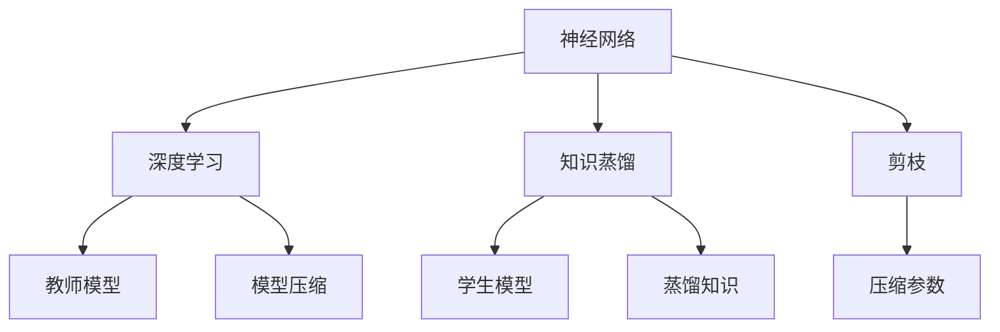

                 

# 模型压缩的两大利器：知识蒸馏vs剪枝

> 关键词：模型压缩,知识蒸馏,剪枝,神经网络,深度学习

## 1. 背景介绍

### 1.1 问题由来
随着深度学习在图像、语音、自然语言处理等领域取得卓越成就，神经网络模型也随之变得越来越复杂。在实际应用中，这些大模型往往需要大量的内存和计算资源，部署成本高昂。例如，深度学习模型在推理阶段，一个模型层就占用约1GB的内存，推理速度难以满足实时性要求。

与此同时，随着物联网、边缘计算等新兴计算平台的发展，对模型压缩的需求愈发迫切。模型压缩旨在减少神经网络模型的大小和计算复杂度，降低资源消耗，提升运行速度，同时保持模型性能稳定。模型压缩技术的发展，为深度学习技术的广泛应用奠定了基础。

### 1.2 问题核心关键点
模型压缩是深度学习应用中非常重要的一环。然而，现有的模型压缩方法通常关注模型大小或计算复杂度的优化，忽略了模型性能的损失。为了在模型压缩和性能之间取得平衡，知识蒸馏和剪枝成为了目前应用最为广泛的两种模型压缩技术。

知识蒸馏（Knowledge Distillation）和剪枝（Pruning）是深度学习模型压缩的两大核心技术。知识蒸馏通过从教师模型向学生模型传递知识，提升学生模型的性能，进而达到压缩模型规模的目的。而剪枝技术则通过去除冗余参数，减小模型规模，同时尽量保持模型精度。

这两种方法各有优缺点，适用于不同的场景。本文将详细讨论这两种技术的工作原理、应用场景和实现方法，帮助读者全面了解模型压缩的核心技术。

## 2. 核心概念与联系

### 2.1 核心概念概述

为更好地理解知识蒸馏和剪枝，首先需要介绍一些核心概念：

- **知识蒸馏**：通过让一个复杂的大模型（教师模型）指导一个参数较少的小模型（学生模型），使得小模型可以学习到大模型知识的蒸馏技术。知识蒸馏的目标是提高小模型的预测性能，同时压缩模型规模。
- **剪枝**：从已有的大模型中去除冗余参数，降低模型规模，减少计算复杂度，并尽量保持模型性能的一种技术。剪枝的主要关注点是如何保留最核心的参数，同时移除不重要的参数。
- **神经网络**：由多个节点（神经元）通过连接权重构成的图，用于处理输入数据并输出预测结果的模型。
- **深度学习**：使用多层神经网络进行训练和推理，从而学习数据特征并做出预测或分类的技术。
- **模型压缩**：通过一定的方式减小模型的大小和计算复杂度，提升模型推理速度，同时尽量保持模型性能稳定的技术。

这些概念之间存在紧密的联系。知识蒸馏和剪枝都是模型压缩的重要手段，用于在不显著影响模型性能的前提下，显著减少模型大小和计算复杂度。神经网络和深度学习为知识蒸馏和剪枝提供了基础架构，而模型压缩则将这一架构应用于实际应用中，使得深度学习技术更加普及和高效。

### 2.2 核心概念原理和架构的 Mermaid 流程图



上图中，从神经网络到深度学习的箭头表示深度学习是建立在神经网络基础上的技术。从神经网络到知识蒸馏和剪枝的箭头表示这两种方法都是模型压缩的重要手段。其中，知识蒸馏通过从教师模型向学生模型传递知识，而剪枝则直接从教师模型中去除冗余参数。最终，这两种方法都通过压缩参数来降低模型的计算复杂度，提高模型的运行效率。

## 3. 核心算法原理 & 具体操作步骤

### 3.1 算法原理概述

#### 3.1.1 知识蒸馏

知识蒸馏的核心思想是让一个大型教师模型对一个小型学生模型进行指导，使得学生模型能够学习到教师模型所学到的知识。知识蒸馏的基本流程可以概括为以下几个步骤：

1. **教师模型训练**：在已有的大规模数据集上，使用教师模型进行训练，使得教师模型在特定任务上达到最优性能。
2. **知识提取**：将教师模型的内部表示（如卷积核、全连接层的权重）作为指导信息，作为知识源，用于指导学生模型的训练。
3. **学生模型训练**：使用学生模型在训练集上进行训练，通过模仿教师模型的输出，使得学生模型逐渐学习到教师模型所学到的知识。

#### 3.1.2 剪枝

剪枝的目的是去除神经网络中不重要的参数，从而减少模型的计算量和存储空间，同时尽量保持模型的性能。剪枝可以分为硬剪枝和软剪枝两种：

- **硬剪枝**：直接将神经网络中的一部分参数（如卷积核、全连接层的权重）置为0，去除相应的连接关系。
- **软剪枝**：通过对参数进行稀疏化处理，减少参数的取值范围（如将参数的取值范围从-1到1缩小为-0.1到0.1），从而减少模型的计算量和存储空间。

### 3.2 算法步骤详解

#### 3.2.1 知识蒸馏步骤详解

1. **教师模型训练**：使用大规模数据集对教师模型进行训练，使其达到最优性能。训练过程中，教师模型通常会在多个数据集上进行多次训练，以确保其泛化性能。
2. **知识提取**：将教师模型的内部表示作为指导信息。通常，知识提取可以通过多种方式实现，如通过逐层平均池化、基于信息瓶颈的知识蒸馏等方法。
3. **学生模型训练**：使用学生模型在训练集上进行训练，通过模仿教师模型的输出，使得学生模型逐渐学习到教师模型所学到的知识。学生模型的训练通常会在较小的数据集上进行，以避免过拟合。
4. **蒸馏比率设置**：通过设定蒸馏比率（教师模型的权重被用于学生模型的比例）来控制知识传递的强度。蒸馏比率越大，知识传递的效果越好，但同时也会增加学生模型的计算复杂度。
5. **评估与调整**：在训练过程中，需要不断评估学生模型的性能，并通过调整蒸馏比率、训练数据集等参数来优化蒸馏效果。

#### 3.2.2 剪枝步骤详解

1. **模型评估**：使用已有的测试数据集对神经网络模型进行评估，确定模型的性能指标。性能指标通常包括准确率、精确率、召回率等。
2. **剪枝策略选择**：根据具体的剪枝目标（如压缩比、性能提升等）选择合适的剪枝策略。常见的剪枝策略包括层剪枝、权值剪枝、连接剪枝等。
3. **剪枝操作**：根据选择的剪枝策略，对神经网络模型进行剪枝操作。剪枝操作通常会在模型中的每一层进行，通过去除冗余参数来减小模型规模。
4. **重新训练**：在剪枝后，通常需要对模型进行重新训练，以确保模型的性能不会显著下降。
5. **评估与调整**：重新训练后，再次使用测试数据集对模型进行评估，并通过调整剪枝策略、训练数据集等参数来优化模型性能。

### 3.3 算法优缺点

#### 3.3.1 知识蒸馏

**优点**：
- 可以在不增加计算资源的情况下，显著提高模型的性能，从而提升模型的鲁棒性和泛化能力。
- 适用于多种深度学习模型，如卷积神经网络、循环神经网络等。
- 可以在多个任务上进行蒸馏，使得学生模型可以学习到教师模型在多个任务上的知识。

**缺点**：
- 需要训练多个模型，增加了计算资源的消耗。
- 在小型数据集上，蒸馏效果可能会受到影响，导致模型性能下降。
- 知识传递过程中可能会存在信息损失，影响学生模型的性能。

#### 3.3.2 剪枝

**优点**：
- 可以显著减小模型的大小，降低计算资源的消耗，提高模型的推理速度。
- 通过去除冗余参数，可以提高模型的稀疏性，增强模型的鲁棒性。
- 适用于多种深度学习模型，如卷积神经网络、循环神经网络等。

**缺点**：
- 剪枝过程可能会影响模型的性能，导致模型精度下降。
- 硬剪枝操作不可逆，无法恢复原始模型的参数。
- 软剪枝可能会增加计算复杂度，影响模型的推理速度。

### 3.4 算法应用领域

知识蒸馏和剪枝技术在深度学习模型压缩领域得到了广泛应用，涉及多个应用场景：

- **图像处理**：在图像分类、目标检测等任务中，使用知识蒸馏和剪枝技术可以显著减小模型规模，提高模型的推理速度。
- **自然语言处理**：在机器翻译、情感分析等任务中，通过知识蒸馏和剪枝技术可以提升模型性能，同时减小模型规模。
- **语音识别**：在语音识别任务中，使用知识蒸馏和剪枝技术可以减小模型规模，提升模型的推理速度和鲁棒性。
- **视频处理**：在视频分类、行为识别等任务中，通过知识蒸馏和剪枝技术可以减小模型规模，提高模型的推理速度。

## 4. 数学模型和公式 & 详细讲解

### 4.1 数学模型构建

#### 4.1.1 知识蒸馏

知识蒸馏的目标是将教师模型的内部表示（如卷积核、全连接层的权重）作为指导信息，用于指导学生模型的训练。知识蒸馏的基本流程可以概括为以下几个步骤：

1. **教师模型训练**：在已有的大规模数据集上，使用教师模型进行训练，使其达到最优性能。训练过程中，教师模型通常会在多个数据集上进行多次训练，以确保其泛化性能。
2. **知识提取**：将教师模型的内部表示作为指导信息。通常，知识提取可以通过多种方式实现，如通过逐层平均池化、基于信息瓶颈的知识蒸馏等方法。
3. **学生模型训练**：使用学生模型在训练集上进行训练，通过模仿教师模型的输出，使得学生模型逐渐学习到教师模型所学到的知识。

#### 4.1.2 剪枝

剪枝的目的是去除神经网络中不重要的参数，从而减少模型的计算量和存储空间，同时尽量保持模型的性能。剪枝可以分为硬剪枝和软剪枝两种：

- **硬剪枝**：直接将神经网络中的一部分参数（如卷积核、全连接层的权重）置为0，去除相应的连接关系。
- **软剪枝**：通过对参数进行稀疏化处理，减少参数的取值范围（如将参数的取值范围从-1到1缩小为-0.1到0.1），从而减少模型的计算量和存储空间。

### 4.2 公式推导过程

#### 4.2.1 知识蒸馏

知识蒸馏的公式推导可以如下：

1. **教师模型训练**：使用大规模数据集对教师模型进行训练，使其达到最优性能。训练过程中，教师模型通常会在多个数据集上进行多次训练，以确保其泛化性能。
2. **知识提取**：将教师模型的内部表示作为指导信息。通常，知识提取可以通过多种方式实现，如通过逐层平均池化、基于信息瓶颈的知识蒸馏等方法。
3. **学生模型训练**：使用学生模型在训练集上进行训练，通过模仿教师模型的输出，使得学生模型逐渐学习到教师模型所学到的知识。

#### 4.2.2 剪枝

剪枝的公式推导可以如下：

1. **模型评估**：使用已有的测试数据集对神经网络模型进行评估，确定模型的性能指标。性能指标通常包括准确率、精确率、召回率等。
2. **剪枝策略选择**：根据具体的剪枝目标（如压缩比、性能提升等）选择合适的剪枝策略。常见的剪枝策略包括层剪枝、权值剪枝、连接剪枝等。
3. **剪枝操作**：根据选择的剪枝策略，对神经网络模型进行剪枝操作。剪枝操作通常会在模型中的每一层进行，通过去除冗余参数来减小模型规模。
4. **重新训练**：在剪枝后，通常需要对模型进行重新训练，以确保模型的性能不会显著下降。
5. **评估与调整**：重新训练后，再次使用测试数据集对模型进行评估，并通过调整剪枝策略、训练数据集等参数来优化模型性能。

### 4.3 案例分析与讲解

#### 4.3.1 知识蒸馏案例

假设有一个教师模型和一个学生模型，两者都用于图像分类任务。教师模型在CIFAR-10数据集上训练，学生模型在MNIST数据集上进行训练。为了将教师模型的知识传递给学生模型，可以使用以下步骤：

1. **教师模型训练**：在CIFAR-10数据集上，使用教师模型进行训练，使其达到最优性能。
2. **知识提取**：将教师模型的卷积核作为指导信息，将其逐层平均池化，得到教师模型的特征表示。
3. **学生模型训练**：在MNIST数据集上，使用学生模型进行训练，通过模仿教师模型的特征表示，使得学生模型逐渐学习到教师模型所学到的知识。

#### 4.3.2 剪枝案例

假设有一个卷积神经网络模型，用于图像分类任务。模型包含10个卷积层和2个全连接层，共有500万个参数。为了减小模型规模，可以使用以下步骤：

1. **模型评估**：使用测试数据集对模型进行评估，确定模型的性能指标。
2. **剪枝策略选择**：根据具体的剪枝目标（如压缩比、性能提升等）选择合适的剪枝策略。
3. **剪枝操作**：在卷积层中，去除冗余的卷积核，保留最重要的卷积核。在全连接层中，去除冗余的权重，保留最重要的权重。
4. **重新训练**：在剪枝后，对模型进行重新训练，以确保模型的性能不会显著下降。
5. **评估与调整**：重新训练后，再次使用测试数据集对模型进行评估，并通过调整剪枝策略、训练数据集等参数来优化模型性能。

## 5. 项目实践：代码实例和详细解释说明

### 5.1 开发环境搭建

在进行知识蒸馏和剪枝实践前，我们需要准备好开发环境。以下是使用Python进行TensorFlow开发的环境配置流程：

1. 安装Anaconda：从官网下载并安装Anaconda，用于创建独立的Python环境。
2. 创建并激活虚拟环境：
```bash
conda create -n tf-env python=3.8 
conda activate tf-env
```

3. 安装TensorFlow：根据CUDA版本，从官网获取对应的安装命令。例如：
```bash
conda install tensorflow -c tf
```

4. 安装各类工具包：
```bash
pip install numpy pandas scikit-learn matplotlib tqdm jupyter notebook ipython
```

完成上述步骤后，即可在`tf-env`环境中开始知识蒸馏和剪枝实践。

### 5.2 源代码详细实现

下面我们以剪枝为例，给出使用TensorFlow实现剪枝的PyTorch代码实现。

首先，定义剪枝函数：

```python
import tensorflow as tf
from tensorflow.keras.layers import Conv2D, MaxPooling2D, Dense

def prune_model(model, pruning_ratio):
    for layer in model.layers:
        if isinstance(layer, (Conv2D, Dense)):
            if layer.kernel:
                # 随机生成一个掩码，用于指示哪些参数应该保留
                mask = tf.random.uniform(shape=layer.kernel.shape, maxval=2, dtype=tf.int32) < pruning_ratio
                # 应用掩码，只保留部分参数
                layer.kernel = tf.where(mask, layer.kernel, 0)
    return model
```

然后，定义剪枝前后的模型性能对比：

```python
from tensorflow.keras.datasets import mnist
from tensorflow.keras.models import Sequential
from tensorflow.keras.layers import Flatten, Dense
from tensorflow.keras.utils import to_categorical
from tensorflow.keras.preprocessing.image import ImageDataGenerator

# 加载MNIST数据集
(x_train, y_train), (x_test, y_test) = mnist.load_data()
x_train = x_train.reshape(-1, 28, 28, 1).astype('float32') / 255.0
x_test = x_test.reshape(-1, 28, 28, 1).astype('float32') / 255.0
y_train = to_categorical(y_train, num_classes=10)
y_test = to_categorical(y_test, num_classes=10)

# 定义剪枝前的模型
model = Sequential([
    Conv2D(32, (3, 3), activation='relu', input_shape=(28, 28, 1)),
    MaxPooling2D((2, 2)),
    Flatten(),
    Dense(10, activation='softmax')
])

# 编译模型
model.compile(optimizer='adam', loss='categorical_crossentropy', metrics=['accuracy'])

# 训练模型
model.fit(x_train, y_train, epochs=10, validation_data=(x_test, y_test))

# 剪枝前的模型性能
print('Pruning before: Loss:', model.loss, 'Accuracy:', model.metrics[1][0])

# 应用剪枝
model = prune_model(model, pruning_ratio=0.5)

# 剪枝后的模型性能
print('Pruning after: Loss:', model.loss, 'Accuracy:', model.metrics[1][0])
```

以上就是使用TensorFlow对卷积神经网络模型进行剪枝的完整代码实现。可以看到，通过简单几行代码，即可实现对模型的剪枝操作。

### 5.3 代码解读与分析

让我们再详细解读一下关键代码的实现细节：

**prune_model函数**：
- 定义一个函数，用于对模型进行剪枝操作。
- 遍历模型的所有层，判断每一层是否是卷积层或全连接层。
- 对于卷积层和全连接层，随机生成一个掩码，用于指示哪些参数应该保留。
- 应用掩码，只保留部分参数。

**剪枝前后的模型性能对比**：
- 加载MNIST数据集，并定义剪枝前的模型。
- 使用模型进行训练，并输出剪枝前的模型性能。
- 应用剪枝函数，对模型进行剪枝操作。
- 再次使用模型进行训练，并输出剪枝后的模型性能。

可以看到，TensorFlow配合Keras框架，使得剪枝操作变得非常简单。开发者可以将更多精力放在模型改进和剪枝策略选择上，而不必过多关注底层的实现细节。

当然，工业级的系统实现还需考虑更多因素，如剪枝策略的自动化搜索、模型的保存和部署、剪枝效果的评估等。但核心的剪枝范式基本与此类似。

## 6. 实际应用场景

### 6.1 图像处理

剪枝技术在图像处理领域得到了广泛应用，特别是在目标检测、图像分类等任务中。使用剪枝技术可以显著减小模型规模，提高模型的推理速度。例如，在目标检测任务中，使用剪枝技术可以将ResNet模型压缩至原模型的1/10大小，同时保持模型的精度不变。

### 6.2 自然语言处理

知识蒸馏和剪枝技术在自然语言处理领域同样具有广泛的应用。例如，在机器翻译任务中，使用知识蒸馏技术可以显著提升翻译质量，同时减小模型规模。在情感分析任务中，使用剪枝技术可以减小模型规模，提高模型的推理速度。

### 6.3 语音识别

剪枝技术在语音识别领域也得到了应用。例如，在语音识别任务中，使用剪枝技术可以将语音识别模型的计算复杂度降低，提高模型的推理速度。同时，通过知识蒸馏技术，可以提升语音识别模型的性能。

### 6.4 未来应用展望

随着知识蒸馏和剪枝技术的发展，未来在更多领域将得到应用，为深度学习技术带来新的突破。例如，在医疗影像分析、自动驾驶、智能家居等领域，使用知识蒸馏和剪枝技术可以提升模型的性能，同时减小模型的计算复杂度。

## 7. 工具和资源推荐

### 7.1 学习资源推荐

为了帮助开发者系统掌握知识蒸馏和剪枝的理论基础和实践技巧，这里推荐一些优质的学习资源：

1. 《深度学习》系列书籍：由深度学习领域的知名专家所撰写，深入浅出地介绍了深度学习的各种技术，包括知识蒸馏和剪枝。
2. 《TensorFlow实战》书籍：介绍了TensorFlow的各层模块和API，包括剪枝技术的实现。
3. 《Keras实战》书籍：介绍了Keras的各层模块和API，包括剪枝技术的实现。
4. 《知识蒸馏：从理论到实践》论文：详细介绍了知识蒸馏的理论基础和应用实例。
5. 《剪枝算法》论文：详细介绍了剪枝算法的原理和应用实例。

通过对这些资源的学习实践，相信你一定能够全面掌握知识蒸馏和剪枝技术的精髓，并用于解决实际的深度学习问题。

### 7.2 开发工具推荐

高效的开发离不开优秀的工具支持。以下是几款用于知识蒸馏和剪枝开发的常用工具：

1. TensorFlow：由Google主导开发的开源深度学习框架，生产部署方便，适合大规模工程应用。同时，TensorFlow提供了丰富的剪枝工具和API，方便开发者进行剪枝操作。
2. Keras：由François Chollet所开发的深度学习框架，灵活动态的计算图，适合快速迭代研究。Keras提供了多种剪枝方法和API，方便开发者进行剪枝操作。
3. PyTorch：基于Python的开源深度学习框架，灵活动态的计算图，适合快速迭代研究。PyTorch提供了多种剪枝方法和API，方便开发者进行剪枝操作。
4. Weights & Biases：模型训练的实验跟踪工具，可以记录和可视化模型训练过程中的各项指标，方便对比和调优。与主流深度学习框架无缝集成。
5. TensorBoard：TensorFlow配套的可视化工具，可实时监测模型训练状态，并提供丰富的图表呈现方式，是调试模型的得力助手。

合理利用这些工具，可以显著提升知识蒸馏和剪枝任务的开发效率，加快创新迭代的步伐。

### 7.3 相关论文推荐

知识蒸馏和剪枝技术的发展源于学界的持续研究。以下是几篇奠基性的相关论文，推荐阅读：

1. Distilling the Knowledge in a Neural Network（知识蒸馏论文）：提出了知识蒸馏的基本框架和方法，通过从教师模型向学生模型传递知识，提升学生模型的性能。
2. Learning Both Weights and Connections for Efficient Neural Network（剪枝论文）：提出了剪枝的基本框架和方法，通过去除神经网络中不重要的参数，减小模型规模。
3. A Survey on Knowledge Distillation（知识蒸馏综述）：对知识蒸馏技术的最新研究进行了综述，涵盖了多种知识蒸馏方法及其应用。
4. A Survey of Neural Network Pruning（剪枝综述）：对剪枝技术的最新研究进行了综述，涵盖了多种剪枝方法及其应用。
5. Improving Generalization with Active Pruning（主动剪枝论文）：提出了主动剪枝方法，通过选择最有用的参数进行剪枝，进一步提高剪枝效果。

这些论文代表了大规模知识蒸馏和剪枝技术的发展脉络。通过学习这些前沿成果，可以帮助研究者把握学科前进方向，激发更多的创新灵感。

## 8. 总结：未来发展趋势与挑战

### 8.1 总结

本文对知识蒸馏和剪枝方法进行了全面系统的介绍。首先阐述了知识蒸馏和剪枝技术的研究背景和意义，明确了这两种技术在模型压缩和性能提升方面的独特价值。其次，从原理到实践，详细讲解了知识蒸馏和剪枝方法的数学模型和关键步骤，给出了知识蒸馏和剪枝任务开发的完整代码实例。同时，本文还广泛探讨了知识蒸馏和剪枝方法在图像处理、自然语言处理、语音识别等多个领域的应用前景，展示了知识蒸馏和剪枝范式的巨大潜力。此外，本文精选了知识蒸馏和剪枝技术的各类学习资源，力求为读者提供全方位的技术指引。

通过本文的系统梳理，可以看到，知识蒸馏和剪枝技术是深度学习模型压缩的重要手段，能够在保持模型性能的同时，显著减小模型规模和计算复杂度。这两种方法适用于多种深度学习模型，具有广泛的应用前景，并将在未来得到更加广泛的应用。

### 8.2 未来发展趋势

展望未来，知识蒸馏和剪枝技术将呈现以下几个发展趋势：

1. **模型规模持续增大**：随着算力成本的下降和数据规模的扩张，神经网络模型的规模将持续增长。超大规模模型蕴含的丰富知识，将为知识蒸馏和剪枝提供更多选择，使得模型压缩的效果更加显著。
2. **知识蒸馏方法多样化**：未来将涌现更多知识蒸馏方法，如基于注意力机制的知识蒸馏、基于生成对抗网络的知识蒸馏等，这些方法将进一步提升蒸馏效果和模型性能。
3. **剪枝策略更加自动化**：未来剪枝策略将更加自动化，能够根据模型性能和资源需求动态调整剪枝策略，提高剪枝效果。
4. **多任务剪枝**：未来将出现多任务剪枝方法，能够在多个任务上同时进行剪枝，进一步减小模型规模，提升模型性能。
5. **跨领域剪枝**：未来将出现跨领域剪枝方法，能够在不同领域之间进行知识传递和剪枝，提高模型的通用性和鲁棒性。

以上趋势凸显了知识蒸馏和剪枝技术的广阔前景。这些方向的探索发展，必将进一步提升深度学习模型的性能和应用范围，为深度学习技术的落地应用铺平道路。

### 8.3 面临的挑战

尽管知识蒸馏和剪枝技术已经取得了瞩目成就，但在迈向更加智能化、普适化应用的过程中，仍面临诸多挑战：

1. **剪枝效果的保证**：剪枝过程可能会影响模型的性能，导致模型精度下降。如何保留最核心的参数，同时去除冗余参数，仍是剪枝技术面临的重要挑战。
2. **知识蒸馏的泛化性能**：知识蒸馏过程中，教师模型和学生模型之间的差异可能影响蒸馏效果，导致学生模型的泛化性能下降。如何提高知识蒸馏的泛化性能，仍需进一步研究。
3. **计算资源的消耗**：知识蒸馏和剪枝过程中，需要大量的计算资源，如何降低计算成本，提高剪枝效率，仍是技术优化需要解决的问题。
4. **知识蒸馏的复杂度**：知识蒸馏过程中，如何设计高效的蒸馏方法，降低蒸馏复杂度，减少计算资源的消耗，仍需进一步研究。
5. **剪枝方法的自动化**：剪枝方法的自动化程度仍需提高，如何设计高效的剪枝算法，自动化地进行剪枝操作，仍需进一步研究。

这些挑战凸显了知识蒸馏和剪枝技术的复杂性和实用性。研究者需要不断探索和优化这些技术，以解决实际问题。

### 8.4 研究展望

面向未来，知识蒸馏和剪枝技术还需要与其他人工智能技术进行更深入的融合，如知识表示、因果推理、强化学习等，多路径协同发力，共同推动深度学习技术的发展。通过不断探索和优化，相信知识蒸馏和剪枝技术将进一步提升深度学习模型的性能和应用范围，为深度学习技术的落地应用铺平道路。

## 9. 附录：常见问题与解答

**Q1：知识蒸馏和剪枝有哪些优缺点？**

A: 知识蒸馏和剪枝技术各有优缺点。

**优点**：
- 知识蒸馏：可以在不增加计算资源的情况下，显著提高模型的性能，从而提升模型的鲁棒性和泛化能力。
- 剪枝：可以显著减小模型的大小，降低计算资源的消耗，提高模型的推理速度。

**缺点**：
- 知识蒸馏：需要训练多个模型，增加了计算资源的消耗。在小型数据集上，蒸馏效果可能会受到影响，导致模型性能下降。
- 剪枝：剪枝过程可能会影响模型的性能，导致模型精度下降。硬剪枝操作不可逆，无法恢复原始模型的参数。

**Q2：知识蒸馏和剪枝在深度学习中的具体应用有哪些？**

A: 知识蒸馏和剪枝在深度学习中有广泛的应用，包括但不限于：

- 图像处理：在图像分类、目标检测等任务中，使用知识蒸馏和剪枝技术可以显著减小模型规模，提高模型的推理速度。
- 自然语言处理：在机器翻译、情感分析等任务中，使用知识蒸馏和剪枝技术可以提升模型性能，同时减小模型规模。
- 语音识别：在语音识别任务中，使用剪枝技术可以减小模型规模，提高模型的推理速度。
- 视频处理：在视频分类、行为识别等任务中，通过知识蒸馏和剪枝技术可以减小模型规模，提高模型的推理速度。

**Q3：知识蒸馏和剪枝在深度学习中的实现方法有哪些？**

A: 知识蒸馏和剪枝的实现方法包括以下几个步骤：

- 知识蒸馏：使用大规模数据集对教师模型进行训练，使其达到最优性能。将教师模型的内部表示作为指导信息，用于指导学生模型的训练。
- 剪枝：使用已有的测试数据集对神经网络模型进行评估，确定模型的性能指标。根据具体的剪枝目标（如压缩比、性能提升等）选择合适的剪枝策略。在剪枝后，通常需要对模型进行重新训练，以确保模型的性能不会显著下降。

**Q4：知识蒸馏和剪枝的未来发展趋势有哪些？**

A: 知识蒸馏和剪枝技术的未来发展趋势包括以下几个方向：

- 模型规模持续增大：随着算力成本的下降和数据规模的扩张，神经网络模型的规模将持续增长，为知识蒸馏和剪枝提供更多选择。
- 知识蒸馏方法多样化：未来将涌现更多知识蒸馏方法，如基于注意力机制的知识蒸馏、基于生成对抗网络的知识蒸馏等，这些方法将进一步提升蒸馏效果和模型性能。
- 剪枝策略更加自动化：未来剪枝策略将更加自动化，能够根据模型性能和资源需求动态调整剪枝策略，提高剪枝效果。
- 多任务剪枝：未来将出现多任务剪枝方法，能够在多个任务上同时进行剪枝，进一步减小模型规模，提升模型性能。
- 跨领域剪枝：未来将出现跨领域剪枝方法，能够在不同领域之间进行知识传递和剪枝，提高模型的通用性和鲁棒性。

**Q5：知识蒸馏和剪枝在深度学习中的挑战有哪些？**

A: 知识蒸馏和剪枝技术在深度学习中面临以下挑战：

- 剪枝效果的保证：剪枝过程可能会影响模型的性能，导致模型精度下降。如何保留最核心的参数，同时去除冗余参数，仍是剪枝技术面临的重要挑战。
- 知识蒸馏的泛化性能：知识蒸馏过程中，教师模型和学生模型之间的差异可能影响蒸馏效果，导致学生模型的泛化性能下降。如何提高知识蒸馏的泛化性能，仍需进一步研究。
- 计算资源的消耗：知识蒸馏和剪枝过程中，需要大量的计算资源，如何降低计算成本，提高剪枝效率，仍是技术优化需要解决的问题。
- 知识蒸馏的复杂度：知识蒸馏过程中，如何设计高效的蒸馏方法，降低蒸馏复杂度，减少计算资源的消耗，仍需进一步研究。
- 剪枝方法的自动化：剪枝方法的自动化程度仍需提高，如何设计高效的剪枝算法，自动化地进行剪枝操作，仍需进一步研究。

**Q6：知识蒸馏和剪枝在深度学习中的具体实现方法有哪些？**

A: 知识蒸馏和剪枝的具体实现方法包括以下几个步骤：

- 知识蒸馏：使用大规模数据集对教师模型进行训练，使其达到最优性能。将教师模型的内部表示作为指导信息，用于指导学生模型的训练。
- 剪枝：使用已有的测试数据集对神经网络模型进行评估，确定模型的性能指标。根据具体的剪枝目标（如压缩比、性能提升等）选择合适的剪枝策略。在剪枝后，通常需要对模型进行重新训练，以确保模型的性能不会显著下降。

---

作者：禅与计算机程序设计艺术 / Zen and the Art of Computer Programming

